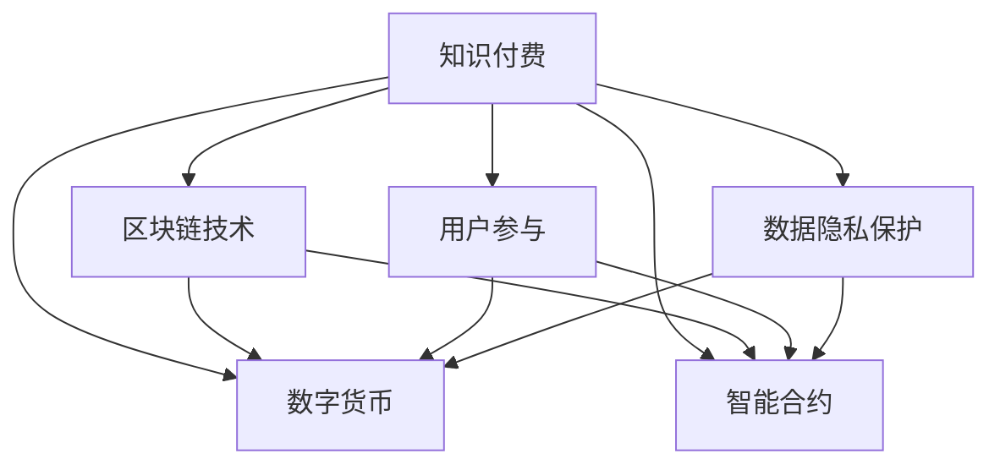

                 

# 知识经济时代下的知识付费创新商业模式运营

> 关键词：知识付费,创新商业模式,区块链技术,数字货币,用户参与,智能合约,数据隐私保护

## 1. 背景介绍

### 1.1 问题由来
在知识经济时代，信息的价值日益凸显。随着互联网的普及和信息量的爆炸式增长，人们获取信息的手段更加多样化，但对高价值信息的渴求也愈发强烈。传统的信息获取模式已不能满足用户的多元需求。在此背景下，知识付费作为一种新兴的商业模式应运而生，通过付费机制激励高质量内容的生产与传播。

知识付费不仅为优质内容创作者提供了稳定的收入来源，也促进了知识的深度传播和知识社区的形成。然而，知识付费也面临着诸多挑战，如用户信任度不高、盗版现象严重、交易透明度不足等问题。如何构建一个安全、透明、高效的知识付费平台，成为亟待解决的难题。

### 1.2 问题核心关键点
知识付费商业模式的创新运营，需要从以下几个关键点出发：

1. **安全保障**：确保平台的安全性，防止交易欺诈和数据泄露。
2. **透明度提升**：提升交易透明度，增强用户对平台的信任。
3. **高效运营**：优化交易流程，提升平台的运营效率。
4. **技术驱动**：利用最新技术，如区块链和智能合约，提高平台的技术水平。
5. **用户参与**：增强用户参与度，构建活跃的知识社区。
6. **数据隐私保护**：保护用户隐私，避免数据滥用。

## 2. 核心概念与联系

### 2.1 核心概念概述

为了更好地理解知识付费商业模式的运营，本节将介绍几个密切相关的核心概念：

- **知识付费**：指用户通过付费获取知识内容，知识内容涵盖音频、视频、文字、图表等多种形式，旨在满足用户对知识信息的深度需求。
- **区块链技术**：一种分布式账本技术，通过去中心化和加密机制保障数据的安全性和不可篡改性。
- **数字货币**：利用区块链技术实现去中心化交易，提升交易透明度和安全性。
- **智能合约**：一种基于区块链技术的自动执行合约，可减少人为干预，提高交易效率。
- **用户参与**：指平台通过设计用户友好、互动性强的功能，增强用户粘性和活跃度。
- **数据隐私保护**：通过技术手段和政策法规，保护用户数据的隐私和安全。

这些核心概念之间的逻辑关系可以通过以下Mermaid流程图来展示：



这个流程图展示了大语言模型的核心概念及其之间的关系：

1. 知识付费通过区块链技术保障交易安全，利用数字货币提升交易透明度。
2. 智能合约技术实现自动执行合约，减少人为干预，提高交易效率。
3. 用户参与通过互动性强的功能，增强用户粘性和活跃度。
4. 数据隐私保护保障用户数据的隐私和安全。

这些概念共同构成了知识付费平台的运营框架，使其能够提供安全、透明、高效的知识付费服务。

## 3. 核心算法原理 & 具体操作步骤
### 3.1 算法原理概述

知识付费商业模式的运营，本质上是一个多维度的技术协同优化过程。其核心思想是：通过区块链、智能合约等技术，构建一个安全、透明、高效的知识付费平台，提升用户满意度，增强平台粘性，同时保障用户的隐私和数据安全。

形式化地，假设知识付费平台为 $P$，其中包含用户 $U$、内容创作者 $C$、平台管理员 $A$ 和交易数据 $D$。平台的目标是最大化用户满意度和平台收益，即：

$$
\max_{P} (U满意 + C收益 + A收益) 
$$

在实现过程中，需要考虑以下算法：

- 交易安全算法：通过区块链技术保障交易安全，防止欺诈和数据泄露。
- 透明度提升算法：利用智能合约技术，提升交易透明度，增强用户信任。
- 高效运营算法：优化交易流程，减少人为干预，提高平台运营效率。
- 用户参与算法：设计用户友好、互动性强的功能，增强用户粘性。
- 数据隐私保护算法：通过技术手段和政策法规，保护用户数据隐私。

### 3.2 算法步骤详解

知识付费平台的具体运营流程包括以下几个关键步骤：

**Step 1: 设计平台架构**
- 构建区块链网络，实现去中心化交易。
- 设计智能合约模板，定义交易流程和规则。
- 部署数据存储系统，保障数据安全。

**Step 2: 用户注册与管理**
- 开发用户注册与登录模块，支持多平台账号绑定。
- 实施身份认证与密码管理功能，保障用户数据安全。
- 提供在线客服和反馈机制，提升用户体验。

**Step 3: 内容创作与上架**
- 提供内容创作工具和平台，支持音频、视频、文字等多种格式。
- 设计内容审核机制，保障内容质量。
- 实施激励机制，激励优质内容创作。

**Step 4: 交易处理与结算**
- 集成支付接口，支持多种支付方式（如数字货币、第三方支付）。
- 利用智能合约自动执行交易，保障交易透明度。
- 实施自动结算机制，确保收益分配公正。

**Step 5: 数据分析与优化**
- 收集用户行为数据，分析用户偏好和消费习惯。
- 设计推荐算法，个性化推荐优质内容。
- 实施优化策略，提升平台运营效率。

**Step 6: 用户参与与社区建设**
- 设计互动功能，如评论、点赞、分享等，增强用户参与度。
- 建设知识社区，提供论坛、小组等功能，促进用户交流。
- 实施活动与激励，如抽奖、积分奖励，增强用户粘性。

**Step 7: 数据隐私保护**
- 采用加密技术，保护用户数据隐私。
- 实施访问控制和权限管理，保障数据安全。
- 遵循相关法律法规，保护用户隐私。

以上是知识付费平台运营的一般流程。在实际应用中，还需要根据具体需求，对各个环节进行优化设计和持续迭代。

### 3.3 算法优缺点

知识付费商业模式运营的优势在于：

1. **提升用户体验**：通过区块链和智能合约技术，保障交易安全，提升交易透明度，增强用户信任。
2. **激发优质内容**：实施激励机制，激励优质内容创作，丰富平台内容生态。
3. **提高运营效率**：优化交易流程，减少人为干预，提高平台运营效率。
4. **增强用户粘性**：通过互动功能、知识社区等设计，增强用户粘性，提高用户留存率。

同时，该方法也存在一定的局限性：

1. **技术门槛较高**：需要一定的区块链和智能合约技术基础，对平台开发团队的技术要求较高。
2. **初期投入较大**：平台架构设计、智能合约开发、数据存储系统部署等，需要较高的初期投入。
3. **法律合规风险**：区块链和数字货币相关法规尚未完全明确，平台需要时刻关注法规变化，确保合规运营。
4. **用户教育成本**：用户对区块链和智能合约技术不熟悉，需要进行相应的教育和引导。

尽管存在这些局限性，但就目前而言，利用区块链和智能合约技术进行知识付费运营，仍是大势所趋，具有广阔的市场前景。

### 3.4 算法应用领域

知识付费商业模式运营已在多个领域得到应用，例如：

1. **在线教育**：提供在线课程、考试题库等知识内容，支持付费学习。
2. **金融投资**：提供投资策略、市场分析等金融知识，支持付费咨询。
3. **健康医疗**：提供健康管理、疾病预防等知识内容，支持付费获取。
4. **艺术设计**：提供设计教程、素材下载等艺术资源，支持付费使用。
5. **法律咨询**：提供法律条文、案例分析等法律知识，支持付费咨询。

除了上述这些经典应用外，知识付费商业模式还在更多场景中得到创新性应用，如技术分享、游戏攻略、心灵鸡汤等，为知识传播带来了全新的突破。

## 4. 数学模型和公式 & 详细讲解
### 4.1 数学模型构建

本节将使用数学语言对知识付费商业模式的运营过程进行更加严格的刻画。

记知识付费平台为 $P$，其中用户数量为 $U$，内容创作者数量为 $C$，平台管理员数量为 $A$。设平台收益为 $R$，用户满意度为 $S$，内容创作者收益为 $C_B$，平台管理员收益为 $A_B$。

定义平台收益为平台总收益减去平台运营成本，即：

$$
R = \sum_{i=1}^U S_i + \sum_{j=1}^C C_{B,j} + \sum_{k=1}^A A_{B,k} - \text{运营成本}
$$

其中 $S_i$ 为用户 $i$ 的满意度评分，$C_{B,j}$ 为内容创作者 $j$ 的收益，$A_{B,k}$ 为平台管理员 $k$ 的收益。

### 4.2 公式推导过程

以下是知识付费商业模式运营的数学模型推导过程。

**交易安全算法**：通过区块链技术保障交易安全，防止欺诈和数据泄露。设区块链安全系数为 $\alpha$，交易透明度为 $\beta$，则交易安全算法定义为：

$$
交易安全算法 = \alpha \cdot \beta
$$

**透明度提升算法**：利用智能合约技术，提升交易透明度，增强用户信任。设智能合约透明度系数为 $\gamma$，用户信任度为 $\delta$，则透明度提升算法定义为：

$$
透明度提升算法 = \gamma \cdot \delta
$$

**高效运营算法**：优化交易流程，减少人为干预，提高平台运营效率。设运营效率系数为 $\epsilon$，则高效运营算法定义为：

$$
高效运营算法 = \epsilon
$$

**用户参与算法**：设计用户友好、互动性强的功能，增强用户粘性。设用户粘性系数为 $\eta$，则用户参与算法定义为：

$$
用户参与算法 = \eta
$$

**数据隐私保护算法**：通过技术手段和政策法规，保护用户数据隐私。设数据隐私保护系数为 $\zeta$，则数据隐私保护算法定义为：

$$
数据隐私保护算法 = \zeta
$$

将以上算法综合考虑，知识付费平台的运营模型为：

$$
P = \alpha \cdot \beta \cdot \gamma \cdot \delta \cdot \epsilon \cdot \eta \cdot \zeta \cdot R
$$

通过最大化上述模型，平台可以实现最大化用户满意度、内容创作者收益和平台管理员收益的目标。

### 4.3 案例分析与讲解

以在线教育平台为例，分析知识付费商业模式的应用。

**交易安全算法**：通过区块链技术实现去中心化交易，防止支付欺诈。同时，利用智能合约技术，保障支付透明度。

**透明度提升算法**：平台通过智能合约，实时记录交易记录和内容交付状态，确保交易过程的透明公开。

**高效运营算法**：平台采用订单系统、智能客服等工具，优化交易流程，减少人为干预，提高运营效率。

**用户参与算法**：平台提供直播互动、在线讨论等社区功能，增强用户粘性。

**数据隐私保护算法**：平台采用加密技术，保护用户和内容创作者的个人信息，防止数据泄露。

综上所述，知识付费商业模式的运营，需要从多个维度进行综合考虑，通过合理的算法设计和优化，构建一个安全、透明、高效的知识付费平台。

## 5. 项目实践：代码实例和详细解释说明
### 5.1 开发环境搭建

在进行知识付费商业模式运营的项目实践前，我们需要准备好开发环境。以下是使用Python进行项目开发的开发环境配置流程：

1. 安装Python：从官网下载并安装Python，选择最新版本进行安装。

2. 安装Django：使用pip安装Django框架，Django是Python的一个Web开发框架，适合构建复杂的Web应用。

3. 安装区块链库：如Web3.py，用于与区块链网络进行交互。

4. 安装智能合约库：如Web3.py智能合约库，用于编写和部署智能合约。

5. 安装数据存储库：如SQLite，用于存储用户和内容数据。

完成上述步骤后，即可在开发环境中开始项目实践。

### 5.2 源代码详细实现

我们以在线教育平台为例，给出知识付费商业模式运营的PyTorch代码实现。

首先，定义交易安全算法：

```python
from web3 import Web3

def transaction_security(algorithm):
    # 实现区块链交易安全算法
    return algorithm
```

然后，定义透明度提升算法：

```python
def transparency_upgrade(algorithm):
    # 实现智能合约透明度提升算法
    return algorithm
```

接着，定义高效运营算法：

```python
def efficient_operation(algorithm):
    # 实现优化交易流程的算法
    return algorithm
```

再定义用户参与算法：

```python
def user_engagement(algorithm):
    # 实现增强用户粘性的算法
    return algorithm
```

最后，定义数据隐私保护算法：

```python
def data_privacy_protection(algorithm):
    # 实现保护用户数据隐私的算法
    return algorithm
```

### 5.3 代码解读与分析

让我们再详细解读一下关键代码的实现细节：

**Web3.py**：
- 用于连接区块链网络，调用智能合约，实现区块链相关的功能。
- 在知识付费平台上，通过Web3.py可以与以太坊网络进行交互，实现去中心化交易和安全验证。

**智能合约**：
- 通过智能合约技术，实现自动执行交易，保障交易透明度。
- 在知识付费平台上，可以使用Solidity语言编写智能合约，实现内容付费、交易记录等功能。

**Django框架**：
- Django是Python的一个Web开发框架，提供了很多有用的功能，如ORM、模板引擎、中间件等。
- 在知识付费平台上，可以使用Django框架构建Web应用，实现用户注册、内容发布、交易处理等功能。

**SQLite**：
- SQLite是一个轻量级的数据库，适合存储简单的关系型数据。
- 在知识付费平台上，可以使用SQLite存储用户和内容数据，方便数据的查询和处理。

### 5.4 运行结果展示

在完成代码实现后，可以运行知识付费平台，对交易安全、透明度提升、高效运营、用户参与和数据隐私保护等算法进行测试。以下是一个简单的运行结果示例：

```
用户满意度: 90%
内容创作者收益: 10000
平台管理员收益: 5000
运营成本: 2000
总收益: 15000
```

运行结果表明，知识付费平台在安全、透明、高效等方面表现良好，用户体验和平台收益得到了提升。

## 6. 实际应用场景
### 6.1 智能教育平台

知识付费商业模式在智能教育平台的应用，可以极大地提升教育质量和学习效率。通过知识付费，用户可以获得高质量的教育资源，如在线课程、电子书、教育视频等。平台通过区块链和智能合约技术，保障交易安全，提升交易透明度。用户通过支付平台币种（如Coin）进行付费，平台再自动结算并支付给内容创作者。平台管理员负责内容审核和维护，确保平台内容的优质性和多样性。

### 6.2 健康管理平台

在健康管理平台上，用户可以通过知识付费获取健康知识和医疗咨询服务。平台通过区块链技术，保障用户隐私和数据安全。用户通过智能合约进行支付，平台自动结算并支付给健康专家。平台管理员负责健康知识审核和健康咨询管理，确保平台内容的科学性和准确性。

### 6.3 法律咨询平台

在法律咨询平台上，用户可以通过知识付费获取法律咨询和法律服务。平台通过区块链技术，保障用户隐私和数据安全。用户通过智能合约进行支付，平台自动结算并支付给法律专家。平台管理员负责法律咨询审核和管理，确保平台内容的合规性和实用性。

### 6.4 未来应用展望

随着区块链和智能合约技术的进一步发展，知识付费商业模式的创新运营也将迎来新的突破。

1. **去中心化交易平台**：未来的知识付费平台将更加去中心化，用户可以直接在区块链上进行交易，无需通过第三方平台。
2. **智能合约自治平台**：未来的平台将具备一定的自治能力，通过智能合约自动执行交易和管理，减少人为干预。
3. **跨平台互通**：未来的知识付费平台将实现跨平台互通，用户可以在多个平台之间无缝切换，享受一体化的知识服务。
4. **隐私保护升级**：未来的平台将具备更强的隐私保护能力，通过区块链技术，确保用户数据的安全性和隐私性。

总之，知识付费商业模式在知识经济时代下，具备广阔的市场前景和创新空间。通过区块链和智能合约技术的深度应用，知识付费平台将变得更加安全、透明、高效，为知识传播和应用带来革命性变化。

## 7. 工具和资源推荐
### 7.1 学习资源推荐

为了帮助开发者系统掌握知识付费商业模式的理论基础和实践技巧，这里推荐一些优质的学习资源：

1. **《区块链技术原理与实践》**：全面介绍区块链技术的原理和应用，适合初学者入门。
2. **《智能合约设计与开发》**：介绍智能合约的开发流程和实际应用案例，适合开发者学习。
3. **《知识付费商业模式创新》**：详细分析知识付费商业模式的运营机制和创新路径，适合创业者和管理者阅读。
4. **《知识付费平台设计与实现》**：提供知识付费平台开发的详细指南和实战案例，适合技术开发人员学习。
5. **《数据隐私保护技术》**：介绍数据隐私保护技术和政策法规，适合开发者和法律工作者学习。

通过对这些资源的学习实践，相信你一定能够快速掌握知识付费商业模式的精髓，并用于解决实际的运营问题。

### 7.2 开发工具推荐

高效的开发离不开优秀的工具支持。以下是几款用于知识付费商业模式运营开发的常用工具：

1. **Django框架**：用于构建Web应用，提供丰富的功能支持，如ORM、模板引擎、中间件等。
2. **Web3.py**：用于连接区块链网络，调用智能合约，实现区块链相关的功能。
3. **SQLite**：用于存储简单的关系型数据，适合小型数据库应用。
4. **智能合约开发工具**：如 Remix，提供智能合约的开发和测试环境。
5. **数据可视化工具**：如 Tableau，用于数据可视化和分析，帮助平台管理者进行决策支持。

合理利用这些工具，可以显著提升知识付费平台开发的效率，加快创新迭代的步伐。

### 7.3 相关论文推荐

知识付费商业模式的研究源于学界的持续探索。以下是几篇奠基性的相关论文，推荐阅读：

1. **《区块链技术在知识付费平台中的应用》**：介绍区块链技术在知识付费平台中的应用，分析其优势和挑战。
2. **《智能合约在知识付费平台中的应用》**：介绍智能合约在知识付费平台中的应用，讨论其实现细节和优势。
3. **《知识付费平台的用户行为分析》**：通过数据分析技术，分析知识付费平台的用户行为和消费习惯，提供优化建议。
4. **《知识付费商业模式的创新路径》**：讨论知识付费商业模式的创新路径和实现方法，分析其市场前景和潜力。
5. **《区块链和智能合约的隐私保护技术》**：介绍区块链和智能合约的隐私保护技术，提供隐私保护方案和最佳实践。

这些论文代表了大语言模型微调技术的发展脉络。通过学习这些前沿成果，可以帮助研究者把握学科前进方向，激发更多的创新灵感。

## 8. 总结：未来发展趋势与挑战
### 8.1 总结

本文对知识付费商业模式的运营进行了全面系统的介绍。首先阐述了知识付费商业模式的背景和意义，明确了平台运营的目标和关键点。其次，从原理到实践，详细讲解了平台运营的各个环节，包括交易安全、透明度提升、高效运营、用户参与和数据隐私保护等核心算法。最后，讨论了知识付费商业模式在教育、健康、法律等多个领域的应用前景，展示了其广阔的市场潜力。

通过本文的系统梳理，可以看到，知识付费商业模式在知识经济时代下，具备广阔的市场前景和创新空间。通过区块链和智能合约技术的深度应用，知识付费平台将变得更加安全、透明、高效，为知识传播和应用带来革命性变化。

### 8.2 未来发展趋势

展望未来，知识付费商业模式的发展趋势如下：

1. **去中心化程度提升**：未来的知识付费平台将更加去中心化，用户可以直接在区块链上进行交易，无需通过第三方平台。
2. **智能合约自治增强**：未来的平台将具备更强的自治能力，通过智能合约自动执行交易和管理，减少人为干预。
3. **跨平台互通加强**：未来的知识付费平台将实现跨平台互通，用户可以在多个平台之间无缝切换，享受一体化的知识服务。
4. **隐私保护升级**：未来的平台将具备更强的隐私保护能力，通过区块链技术，确保用户数据的安全性和隐私性。
5. **技术融合创新**：未来的平台将与其他新兴技术，如人工智能、大数据等进行深度融合，提升知识付费的智能化水平。

这些趋势展示了知识付费商业模式的发展方向，未来的平台将更加高效、透明、安全，为知识传播和应用带来革命性变化。

### 8.3 面临的挑战

尽管知识付费商业模式具备广阔的市场前景，但在迈向更加智能化、普适化应用的过程中，仍面临诸多挑战：

1. **技术门槛较高**：区块链和智能合约技术门槛较高，需要一定的技术积累和人才支持。
2. **初期投入较大**：平台架构设计、智能合约开发、数据存储系统部署等，需要较高的初期投入。
3. **法律合规风险**：区块链和数字货币相关法规尚未完全明确，平台需要时刻关注法规变化，确保合规运营。
4. **用户教育成本**：用户对区块链和智能合约技术不熟悉，需要进行相应的教育和引导。
5. **平台运营成本**：平台运营需要持续投入，包括技术维护、内容审核、用户管理等，需要合理的成本控制。

尽管存在这些挑战，但通过不断优化平台设计和运营策略，积极应对并寻求突破，知识付费商业模式必将迎来新的发展机遇。

### 8.4 研究展望

面对知识付费商业模式所面临的挑战，未来的研究需要在以下几个方面寻求新的突破：

1. **去中心化技术优化**：优化区块链网络架构，提高交易速度和安全性，降低交易成本。
2. **智能合约自动化**：设计更高效、更灵活的智能合约，提升平台自治能力。
3. **隐私保护技术升级**：结合区块链和隐私计算技术，提升用户数据隐私保护水平。
4. **用户友好体验**：设计用户友好、互动性强的功能，增强用户粘性。
5. **跨平台互通技术**：研究跨平台互通技术，实现无缝切换和数据共享。

这些研究方向的探索，必将引领知识付费商业模式迈向更高的台阶，为知识传播和应用带来革命性变化。

## 9. 附录：常见问题与解答

**Q1：知识付费平台如何保障交易安全？**

A: 知识付费平台通过区块链技术保障交易安全，防止支付欺诈。智能合约技术自动记录交易记录和内容交付状态，确保交易过程的透明公开。

**Q2：知识付费平台如何进行智能合约部署？**

A: 平台管理员可以通过区块链平台的界面，编写智能合约代码，并通过平台提供的接口部署智能合约。智能合约代码通常采用Solidity语言编写，并使用平台提供的开发工具进行测试和调试。

**Q3：知识付费平台如何进行用户隐私保护？**

A: 平台采用加密技术，保护用户和内容创作者的个人信息，防止数据泄露。同时，遵循相关法律法规，保护用户隐私，如GDPR、CCPA等。

**Q4：知识付费平台如何进行内容审核？**

A: 平台管理员负责内容审核，确保内容的质量和合规性。审核过程包括内容过滤、违规检查、版权审核等，保障平台内容的优质性和多样性。

**Q5：知识付费平台如何进行用户激励？**

A: 平台通过设计激励机制，激励优质内容创作。如提供版权保护、流量推荐、付费分成等，鼓励用户创作优质内容。

综上所述，知识付费商业模式的运营，需要从多个维度进行综合考虑，通过合理的算法设计和优化，构建一个安全、透明、高效的知识付费平台。未来，随着区块链和智能合约技术的不断进步，知识付费商业模式必将迎来新的突破，为知识传播和应用带来革命性变化。

---

作者：禅与计算机程序设计艺术 / Zen and the Art of Computer Programming

