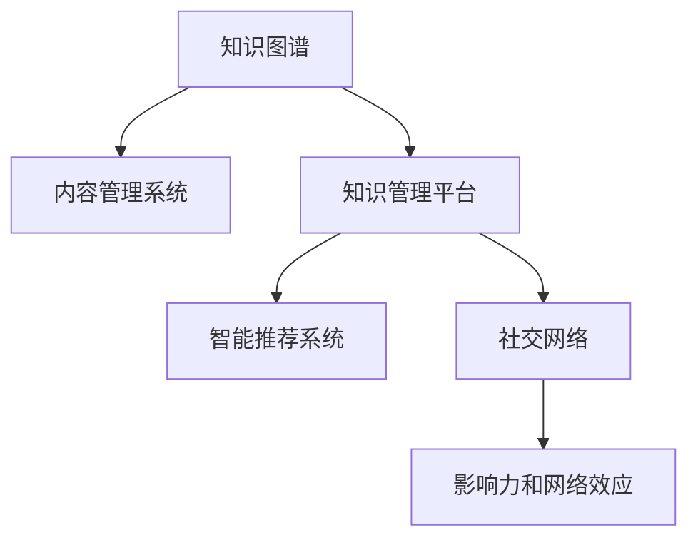

                 

## 1. 背景介绍

### 1.1 问题由来
在信息爆炸的时代，知识的更新速度不断加快，管理者需要不断学习新的知识和技能，以应对复杂多变的商业环境。然而，仅凭个人的力量难以在有限的时间内全面掌握最新的知识，管理者需要借助技术手段来提升自身的知识输出能力和影响力。这正是本文的核心议题——利用现代技术手段，增强管理者的知识输出，提升其个人影响力。

### 1.2 问题核心关键点
管理者在知识输出和影响力提升的过程中，面临的关键点包括：
- 知识获取效率：如何快速获取并理解最新的知识和技术？
- 知识组织能力：如何将零散的知识点系统化、结构化？
- 知识传递方式：如何通过高效的输出方式将知识传达给团队和外界？
- 影响力建设：如何通过有效的沟通和影响力手段，引导团队成员和利益相关者接受和应用知识？

### 1.3 问题研究意义
提升管理者的知识输出能力和个人影响力，对于团队和组织的发展具有重要意义：
- 促进团队成长：管理者通过传授知识，可以提升团队整体的技能水平和创新能力。
- 增强决策质量：管理者掌握的知识越多，其决策的准确性和前瞻性也会相应提升。
- 优化组织文化：知识输出可以营造学习型组织的氛围，鼓励知识共享和创新。
- 提升组织竞争力：知识输出可以为企业带来竞争优势，增强市场竞争力。

## 2. 核心概念与联系

### 2.1 核心概念概述

为了更好地理解如何通过技术手段提升管理者的知识输出能力和影响力，本节将介绍几个核心概念：

- **知识图谱(Knowledge Graph)**：一种结构化的知识表示方式，用于描述实体和概念之间的关系。
- **内容管理系统(Content Management System, CMS)**：用于管理、存储、发布和检索内容的系统。
- **知识管理平台(Knowledge Management Platform, KMP)**：集成了内容管理系统、协作工具和知识图谱的平台，支持知识获取、组织、输出和共享。
- **智能推荐系统(Recommender System)**：通过分析用户行为和兴趣，推荐相关知识和信息。
- **社交网络(Social Network)**：通过社交关系网络，实现知识的传播和分享。
- **影响力和网络效应(Network Effect)**：通过社交网络等手段，扩大知识的影响范围，形成网络效应。

这些核心概念之间的逻辑关系可以通过以下Mermaid流程图来展示：



这个流程图展示出知识图谱与知识管理平台的紧密联系，以及通过智能推荐系统和社交网络手段，将知识输出和影响力建设的循环过程。

## 3. 核心算法原理 & 具体操作步骤
### 3.1 算法原理概述

知识输出与影响力提升的核心算法原理，可以概括为以下几个步骤：

1. **知识获取**：通过数据爬取、API接口、订阅服务等手段，获取最新的知识资源。
2. **知识组织**：利用知识图谱等工具，对获取的知识进行结构化、分类化处理。
3. **知识输出**：通过内容管理系统、博客、社交媒体等渠道，高效输出知识。
4. **影响力建设**：通过社交网络、互动评论等手段，增强知识的影响力和传播范围。

### 3.2 算法步骤详解

#### 3.2.1 知识获取

知识获取是知识输出的第一步，也是关键的一步。以下是几种常用的知识获取方法：

1. **数据爬取**：利用网络爬虫技术，自动从各类网站获取最新的知识资源。例如，可以通过爬取学术论文、技术博客、专利数据库等获取最新的技术信息。
2. **API接口**：利用公共或企业提供的API接口，获取结构化数据。例如，可以利用新闻API获取新闻标题和摘要，利用金融API获取市场数据。
3. **订阅服务**：通过订阅服务获取持续更新的知识资源。例如，可以通过RSS订阅技术获取最新的新闻和博客内容。

#### 3.2.2 知识组织

知识组织是将获取的知识进行结构化和分类化的过程。以下是几种常用的知识组织方法：

1. **知识图谱**：利用知识图谱工具，将知识资源转化为实体和关系的网络结构。例如，可以使用Wikidata、Google Knowledge Graph等公开的知识图谱。
2. **标签和分类**：通过人工或自动化的方式，为知识资源打上标签和分类，便于检索和组织。
3. **文档数据库**：将知识资源存储在文档数据库中，利用全文检索技术进行查询。例如，可以使用Elasticsearch、Apache Solr等工具。

#### 3.2.3 知识输出

知识输出是将知识资源呈现给用户的过程，可以通过以下几种方式：

1. **内容管理系统**：通过CMS系统，发布文章、博客、视频等知识资源。例如，可以使用WordPress、Drupal等CMS平台。
2. **博客和文章**：通过个人博客或技术文章，分享深度分析和技术洞察。例如，可以使用Medium、博客园等平台。
3. **社交媒体**：通过Twitter、LinkedIn等社交媒体，分享知识快讯和见解。

#### 3.2.4 影响力建设

影响力建设是将知识传播出去，扩大其影响力和传播范围的过程。以下是几种常用的影响力建设方法：

1. **社交网络**：通过LinkedIn、Twitter等社交网络，建立个人品牌，扩大影响力。
2. **互动评论**：通过在博客、文章下的互动评论，增强知识的传播和互动。
3. **内容营销**：通过SEO优化、邮件营销等手段，提升内容在搜索引擎和邮件中的曝光率。

### 3.3 算法优缺点

知识输出与影响力提升的算法具有以下优点：
- 高效获取知识：通过自动化和订阅服务，可以快速获取最新的知识资源。
- 系统化组织知识：利用知识图谱和标签分类等工具，将知识资源进行系统化处理。
- 多样化输出方式：通过CMS、博客、社交媒体等多种渠道，高效输出知识。
- 广泛传播影响力：利用社交网络和内容营销等手段，扩大知识的影响力和传播范围。

同时，该算法也存在以下局限性：
- 数据质量和一致性：获取的知识资源可能存在质量不一和格式不一致的问题。
- 知识输出难度：高质量的知识输出需要较高的文字表达和深度分析能力。
- 影响力建设复杂性：建立个人品牌和扩大影响力需要持续的努力和互动。

尽管存在这些局限性，但就目前而言，利用知识图谱、CMS、社交网络等技术手段，可以显著提升管理者的知识输出能力和影响力，成为提升个人品牌的重要途径。

### 3.4 算法应用领域

知识输出与影响力提升的算法应用广泛，包括但不限于以下几个领域：

1. **技术管理**：技术经理通过输出最新的技术资讯和分析，帮助团队保持技术领先。
2. **产品管理**：产品经理通过分享产品使用体验和技术细节，提升产品的知名度和用户满意度。
3. **战略规划**：高层管理者通过输出战略思考和市场洞察，指导企业的发展方向。
4. **学术研究**：学术专家通过发布学术论文和研究成果，扩大其学术影响力。
5. **品牌建设**：品牌经理通过社交媒体和内容营销，提升品牌知名度和美誉度。

这些领域的应用展示了知识输出与影响力提升在实际管理中的广泛应用和重要价值。

## 4. 数学模型和公式 & 详细讲解 & 举例说明

### 4.1 数学模型构建

本节将使用数学语言对知识输出与影响力提升的过程进行更加严格的刻画。

记知识图谱中的知识实体为 $E$，关系为 $R$，知识资源的获取速度为 $g(t)$，输出速度为 $o(t)$，知识资源的影响力传播速度为 $i(t)$。

定义知识资源在时间 $t$ 的输出量为 $K(t)$，影响力传播量为 $I(t)$，则知识输出的数学模型可以表示为：

$$
K(t) = \int_0^t g(t) dt
$$

影响力传播的数学模型可以表示为：

$$
I(t) = \int_0^t i(t) dt
$$

### 4.2 公式推导过程

以下是知识输出的数学模型和影响力传播的数学模型的详细推导：

#### 知识输出的数学模型推导

知识输出的数学模型定义为知识资源在时间 $t$ 的累计输出量 $K(t)$，可以表示为：

$$
K(t) = \int_0^t g(t) dt
$$

其中 $g(t)$ 为知识资源的获取速度，可以表示为：

$$
g(t) = \sum_{i=1}^N g_i(t)
$$

其中 $g_i(t)$ 为获取第 $i$ 种知识资源的速度，可以表示为：

$$
g_i(t) = a_i \cdot e^{b_it}
$$

其中 $a_i$ 为获取第 $i$ 种知识资源的初始速度，$b_i$ 为增长率。

将 $g_i(t)$ 代入 $K(t)$ 的公式中，得到：

$$
K(t) = \sum_{i=1}^N \left(\frac{a_i}{b_i}(e^{b_it}-1)\right)
$$

#### 影响力传播的数学模型推导

影响力传播的数学模型定义为知识资源在时间 $t$ 的累计影响力传播量 $I(t)$，可以表示为：

$$
I(t) = \int_0^t i(t) dt
$$

其中 $i(t)$ 为知识资源的影响力传播速度，可以表示为：

$$
i(t) = \sum_{j=1}^M i_j(t)
$$

其中 $i_j(t)$ 为第 $j$ 种传播方式的影响力传播速度，可以表示为：

$$
i_j(t) = c_j \cdot e^{d_jt}
$$

其中 $c_j$ 为第 $j$ 种传播方式的初始传播速度，$d_j$ 为传播速率。

将 $i_j(t)$ 代入 $I(t)$ 的公式中，得到：

$$
I(t) = \sum_{j=1}^M \left(\frac{c_j}{d_j}(e^{d_jt}-1)\right)
$$

### 4.3 案例分析与讲解

以某技术经理为例，其知识输出和影响力提升的过程可以表示为：

**Step 1: 知识获取**
- 通过数据爬取每天获取5篇最新的技术博客。
- 使用API接口获取每日的市场新闻。
- 通过订阅服务获取每周的行业报告。

**Step 2: 知识组织**
- 利用Wikidata构建技术领域的知识图谱。
- 为每篇博客打上标签和分类，如“云计算”、“人工智能”等。
- 将知识存储在Elasticsearch数据库中。

**Step 3: 知识输出**
- 通过Medium发布每周的技术分享文章。
- 在Twitter上分享每日的市场新闻。
- 利用LinkedIn发表每周的行业报告。

**Step 4: 影响力建设**
- 在Medium上与读者互动评论。
- 通过Twitter与业界专家互动，提升个人品牌。
- 利用LinkedIn加入技术社群，扩大影响力。

## 5. 项目实践：代码实例和详细解释说明

### 5.1 开发环境搭建

在进行知识输出与影响力提升的实践前，我们需要准备好开发环境。以下是使用Python进行知识管理系统的环境配置流程：

1. 安装Anaconda：从官网下载并安装Anaconda，用于创建独立的Python环境。

2. 创建并激活虚拟环境：
```bash
conda create -n knowledge-env python=3.8 
conda activate knowledge-env
```

3. 安装必要的库：
```bash
conda install pandas numpy requests beautifulsoup4 scikit-learn elasticsearch Flask
```

完成上述步骤后，即可在`knowledge-env`环境中开始实践。

### 5.2 源代码详细实现

下面我们以知识图谱的构建和知识输出的为例，给出使用Python和Flask进行知识管理系统的代码实现。

#### 5.2.1 知识图谱构建

首先，定义知识图谱的实体和关系：

```python
from rdflib import Namespace, Graph, RDF

graph = Graph()
graph.parse("knowledge_graph.ttl")
```

然后，使用RDF库进行实体和关系的添加：

```python
ns = Namespace("http://example.org/")

# 添加实体
graph.add((ns.Node("A"), ns.property1, ns.Node("B")))
graph.add((ns.Node("B"), ns.property2, ns.Node("C")))
```

最后，将知识图谱导出为Turtle格式：

```python
graph.serialize("knowledge_graph.turtle")
```

#### 5.2.2 知识输出系统

使用Flask搭建知识输出系统，定义API接口：

```python
from flask import Flask, request, jsonify

app = Flask(__name__)

@app.route('/knowledge', methods=['GET'])
def get_knowledge():
    # 从知识图谱中获取知识
    # ...
    # 转换为API响应格式
    return jsonify(knowledge)

if __name__ == '__main__':
    app.run(debug=True)
```

定义API响应格式：

```python
def jsonify(knowledge):
    # 将知识转换为API响应格式
    return {
        "title": knowledge.title,
        "description": knowledge.description,
        "keywords": knowledge.keywords,
        "url": knowledge.url,
    }
```

以上代码实现了Flask服务，通过API接口获取知识资源并返回响应。

### 5.3 代码解读与分析

让我们再详细解读一下关键代码的实现细节：

**知识图谱构建**：
- 利用RDF库构建知识图谱，通过添加实体和关系，构建知识网络。
- 将知识图谱导出为Turtle格式，方便后续的存储和查询。

**知识输出系统**：
- 使用Flask搭建API接口，通过GET请求获取知识资源。
- 将知识资源转换为API响应格式，方便客户端调用。

## 6. 实际应用场景
### 6.1 企业内知识管理

知识输出与影响力提升技术在企业内知识管理中有着广泛应用。通过知识管理系统，企业管理者可以：
- 汇总企业内部的技术文档、项目报告、市场数据等知识资源，方便全员查询和学习。
- 利用知识图谱构建企业知识网络，帮助员工快速定位相关知识资源。
- 通过社交网络和内容营销，提升企业内部的知识传播效率和影响力。

### 6.2 高校学术研究

学术研究中，研究人员可以通过知识管理系统：
- 存储和共享研究成果、论文、会议报告等学术资源。
- 利用知识图谱和标签分类，方便同行检索和引用。
- 通过社交网络和学术平台，扩大研究成果的影响力。

### 6.3 在线教育平台

在线教育平台上的知识输出与影响力提升可以：
- 教师通过博客、视频课程等形式，分享教学经验和知识资源。
- 学生通过互动评论和社交网络，学习交流和反馈。
- 平台通过推荐系统，提升知识资源的曝光率和学习效率。

### 6.4 未来应用展望

随着技术的不断进步，知识输出与影响力提升在以下领域将有更广泛的应用：

1. **智慧城市**：通过知识管理系统，城市管理者可以整合各类数据，提升城市管理和决策的智能化水平。
2. **健康医疗**：医疗机构可以利用知识管理系统，存储和共享病历、诊疗方案等知识资源，提升医疗服务的质量和效率。
3. **教育培训**：通过知识输出系统，教育培训机构可以提升教学质量，加速知识传播和人才培养。

## 7. 工具和资源推荐
### 7.1 学习资源推荐

为了帮助开发者系统掌握知识输出与影响力提升的理论基础和实践技巧，这里推荐一些优质的学习资源：

1. **《知识图谱与语义Web》系列书籍**：全面介绍了知识图谱的基本概念和构建方法，是进入知识图谱领域的入门读物。
2. **Coursera《数据科学与机器学习》课程**：斯坦福大学开设的机器学习课程，介绍了数据科学和机器学习的基本知识和应用方法。
3. **Kaggle《自然语言处理》竞赛**：通过参与自然语言处理领域的竞赛，实战提升知识输出和影响力建设的能力。
4. **Hugging Face官方文档**：提供了丰富的自然语言处理工具和模型，适合学习和实践知识输出系统。
5. **Tedx Talks**：通过观看TEDx Talks，了解知识管理和影响力建设的最新前沿和成功案例。

通过对这些资源的学习实践，相信你一定能够快速掌握知识输出与影响力提升的精髓，并用于解决实际的NLP问题。

### 7.2 开发工具推荐

高效的开发离不开优秀的工具支持。以下是几款用于知识管理系统和社交网络开发的常用工具：

1. **Flask**：轻量级的Web框架，适合构建知识输出系统。
2. **Elasticsearch**：强大的全文检索和分布式存储引擎，适合存储和查询知识资源。
3. **Wikidata**：开放的知识图谱，适合构建企业内部知识图谱。
4. **Twitter API**：提供丰富的社交网络API接口，适合发布和获取知识资源。
5. **LinkedIn API**：提供丰富的社交网络API接口，适合发布和获取知识资源。

合理利用这些工具，可以显著提升知识输出与影响力提升的开发效率，加快创新迭代的步伐。

### 7.3 相关论文推荐

知识输出与影响力提升的研究源于学界的持续研究。以下是几篇奠基性的相关论文，推荐阅读：

1. **《知识图谱在自然语言处理中的应用》**：介绍知识图谱在NLP领域的基本概念和应用方法。
2. **《内容推荐系统》**：介绍基于协同过滤和协同学习的内容推荐方法。
3. **《社交网络分析》**：介绍社交网络的基本概念和分析方法。
4. **《影响力传播模型》**：介绍基于社会网络和影响传播模型的影响力和网络效应。
5. **《知识图谱与语义搜索》**：介绍知识图谱在语义搜索中的应用。

这些论文代表了大语言模型微调技术的发展脉络。通过学习这些前沿成果，可以帮助研究者把握学科前进方向，激发更多的创新灵感。

## 8. 总结：未来发展趋势与挑战

### 8.1 总结

本文对知识输出与影响力提升的方法进行了全面系统的介绍。首先阐述了知识输出与影响力提升的研究背景和意义，明确了技术手段在提升管理者的知识输出能力和个人影响力方面的独特价值。其次，从原理到实践，详细讲解了知识获取、组织、输出和影响力建设的过程，给出了知识管理系统和社交网络系统的完整代码实现。同时，本文还广泛探讨了知识输出与影响力提升在企业、高校、在线教育平台等领域的实际应用前景，展示了其广泛的应用场景和重要价值。

通过本文的系统梳理，可以看到，利用现代技术手段，可以显著提升管理者的知识输出能力和个人影响力，成为构建学习型组织的重要途径。随着技术的不断进步，知识输出与影响力提升必将为NLP技术带来更广阔的应用前景，深刻影响人类的生产生活方式。

### 8.2 未来发展趋势

展望未来，知识输出与影响力提升技术将呈现以下几个发展趋势：

1. **自动化和智能化**：随着AI技术的发展，知识获取、组织和输出的过程将更加自动化和智能化。例如，利用自然语言处理技术自动识别和抽取知识资源，利用机器学习算法自动生成知识摘要。
2. **跨平台集成**：知识管理系统和社交网络将进一步跨平台集成，实现知识的无缝传播和交流。例如，利用移动应用和桌面客户端，随时随地获取和输出知识。
3. **多模态融合**：知识管理系统将支持多模态数据融合，将文本、图片、视频等多种形式的知识资源整合在一起，提升知识的表达和传播能力。
4. **社区驱动**：知识输出与影响力提升将更多地依赖社区驱动，利用众包和社交网络的力量，实现知识的共创和共享。
5. **知识地图**：知识管理系统将利用知识图谱构建知识地图，帮助用户快速定位和浏览知识资源，提升知识获取的效率和效果。

这些趋势展示了知识输出与影响力提升技术的广阔前景，预示着未来的知识管理将更加智能化、自动化和社区化。

### 8.3 面临的挑战

尽管知识输出与影响力提升技术已经取得了瞩目成就，但在迈向更加智能化、普适化应用的过程中，它仍面临着诸多挑战：

1. **数据质量和一致性**：获取的知识资源可能存在质量不一和格式不一致的问题。如何保证数据的一致性和可靠性，需要进一步优化和规范数据获取和处理流程。
2. **知识表达难度**：高质量的知识输出需要较高的文字表达和深度分析能力。如何提升知识表达的准确性和丰富性，需要进一步提升知识输出者的写作和分析能力。
3. **影响力建设复杂性**：建立个人品牌和扩大影响力需要持续的努力和互动。如何简化影响力建设的复杂性，提升影响力传播的效果，需要进一步研究和优化。
4. **隐私和安全**：在知识管理和社交网络中，如何保护用户的隐私和安全，需要进一步加强数据加密和访问控制措施。
5. **知识孤岛**：在知识图谱和知识管理系统中，如何避免知识孤岛的问题，需要进一步加强知识共享和跨系统集成。

这些挑战需要学界和产业界的共同努力，进一步提升知识输出与影响力提升技术的成熟度和应用效果。

### 8.4 研究展望

面对知识输出与影响力提升技术所面临的挑战，未来的研究需要在以下几个方面寻求新的突破：

1. **知识图谱的丰富化**：构建更加丰富和全面的知识图谱，涵盖更多的实体和关系，提升知识获取和组织的效果。
2. **自动化和智能化技术**：开发更加自动化和智能化的知识获取、组织和输出系统，提升知识传播和影响力建设的效率。
3. **跨领域知识融合**：将多领域的知识融合，形成更加全面和系统的知识体系，提升知识输出和影响力建设的效果。
4. **社区驱动的知识管理**：利用社交网络和技术平台，推动社区驱动的知识管理和知识共享，提升知识的传播效果和影响力。
5. **多模态知识管理**：支持多模态数据融合，提升知识的表达和传播能力。

这些研究方向的探索和发展，必将引领知识输出与影响力提升技术迈向更高的台阶，为构建学习型组织和智能社会提供新的技术手段。总之，知识输出与影响力提升需要学界和产业界的共同努力，通过技术创新和实践优化，不断提升管理者的知识输出能力和个人影响力，为构建智能化、学习型社会做出更大的贡献。

## 9. 附录：常见问题与解答

**Q1: 如何提升知识输出与影响力提升的技术效果？**

A: 提升知识输出与影响力提升的技术效果需要从以下几个方面入手：
1. 提升数据质量：确保知识资源的准确性和一致性，利用数据清洗和规范化技术，提升数据质量。
2. 优化算法模型：利用机器学习和自然语言处理技术，优化知识获取、组织和输出的算法模型，提升效果。
3. 增强用户互动：利用社交网络和内容营销，增强用户互动和知识传播，提升影响力建设的效果。
4. 多模态融合：支持多模态数据融合，提升知识的表达和传播能力。

**Q2: 如何构建一个高效的知识管理系统？**

A: 构建一个高效的知识管理系统需要从以下几个方面入手：
1. 选择合适的工具：利用Flask、Elasticsearch等工具，构建高效的知识管理系统。
2. 设计合理的知识组织架构：利用知识图谱和标签分类，设计合理的知识组织架构，方便知识获取和检索。
3. 优化数据获取和处理流程：利用数据爬取和API接口，优化数据获取和处理流程，提升数据质量。
4. 提供多种知识输出方式：利用CMS、博客、社交媒体等多种方式，提供多种知识输出方式，提升知识传播的效果。

**Q3: 如何在知识管理系统和社交网络中保护用户隐私？**

A: 在知识管理系统和社交网络中保护用户隐私需要从以下几个方面入手：
1. 加强数据加密和访问控制：利用数据加密和访问控制技术，保护用户隐私。
2. 限制数据共享权限：利用权限管理机制，限制数据共享权限，防止敏感数据泄露。
3. 匿名化处理：利用匿名化处理技术，保护用户隐私。

这些措施可以有效保护用户隐私，提升知识管理系统和社交网络的安全性。

通过以上分析和实践，相信你一定能够掌握知识输出与影响力提升的核心技术和方法，并在实际应用中取得理想的效果。

---

作者：禅与计算机程序设计艺术 / Zen and the Art of Computer Programming

