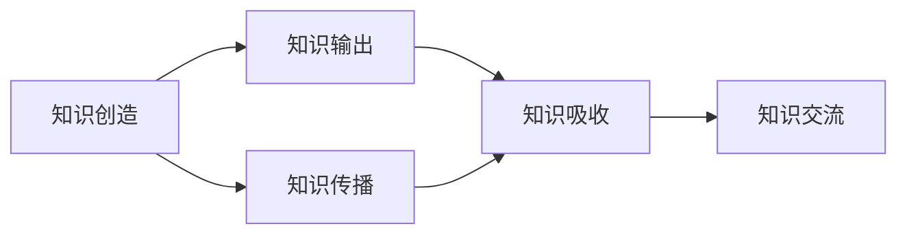

                 

# 知识输出的多种方式及其效果

## 1. 背景介绍

在当今信息爆炸的时代，知识的获取和传播变得更加便捷。无论是在线教育平台，还是社交媒体，亦或是专业论坛，知识的输出和分享变得前所未有的容易。知识输出不仅仅是学术研究的重要环节，也是个人发展、企业培训、教育普及等领域不可或缺的一环。本文档将探讨知识输出的多种方式及其效果，为企业和个人提供参考和借鉴。

## 2. 核心概念与联系

### 2.1 核心概念概述

在探讨知识输出之前，首先需要明确几个核心概念：

- **知识输出(Knowledge Output)**：指通过各种媒介将知识传递给他人的过程。知识输出形式多样，包括文章、视频、讲座、书籍、白皮书等。
- **知识传播(Knowledge Dissemination)**：指知识从创造者到接受者的过程。有效的知识传播需要合理的渠道和方式。
- **知识吸收(Knowledge Absorption)**：指知识接受者将接收到的知识内化并应用的过程。知识的吸收效果直接影响后续的知识输出。
- **知识交流(Knowledge Exchange)**：指知识创造者与接受者之间的双向互动，通过交流达到知识共享和提升的目的。

这些概念之间相互联系，共同构成知识管理的一个闭环。有效的知识输出不仅需要准确、丰富的内容，还需要合理的传播渠道和互动机制，以达到良好的知识吸收和交流效果。

### 2.2 核心概念原理和架构的 Mermaid 流程图



该图展示了知识输出与传播、吸收、交流之间的联系。知识创造是起点，输出和传播是手段，吸收是关键环节，交流是反馈和促进过程。

## 3. 核心算法原理 & 具体操作步骤

### 3.1 算法原理概述

知识输出的效果受到多种因素的影响，包括内容质量、输出形式、传播渠道、受众特点等。为了优化知识输出的效果，可以从以下几个方面进行算法设计：

- **内容优化算法**：优化知识内容的结构、深度和广度，以适应不同受众的需求。
- **形式选择算法**：选择合适的输出形式（如文章、视频、图表等），以提高知识传播的效率和效果。
- **渠道优化算法**：选择或组合合适的传播渠道（如社交媒体、专业论坛、电子邮件等），以最大化知识传播的范围和影响。
- **受众匹配算法**：分析受众特征和偏好，以定制化地调整知识输出的方式和内容，提高受众的接受度和吸收效果。
- **交流互动算法**：设计互动机制（如问答、讨论、反馈等），以促进知识交流和反馈，提升知识传播的深度和广度。

### 3.2 算法步骤详解

#### 3.2.1 内容优化算法

内容优化算法的核心是分析受众需求，设计结构合理、内容丰富的知识输出。具体的步骤包括：

1. **受众分析**：使用文本分析、情感分析等技术，分析受众的兴趣、需求和偏好。
2. **内容设计**：根据受众分析结果，设计符合受众需求的知识内容，包括标题、摘要、正文、引用等。
3. **内容优化**：使用自然语言处理(NLP)技术，优化内容语言表达，提高可读性和吸引力。

#### 3.2.2 形式选择算法

形式选择算法的目的是提高知识传播的效率和效果。具体的步骤包括：

1. **形式类型选择**：根据知识内容的特点和受众的偏好，选择合适的输出形式，如文章、视频、图表等。
2. **格式设计**：设计符合特定输出形式的格式，如文章中的标题、小标题、列表、图片等。
3. **视觉效果优化**：使用图像处理、视频剪辑等技术，优化输出形式的视觉效果，提高受众的接受度和互动意愿。

#### 3.2.3 渠道优化算法

渠道优化算法的目标是最大化知识传播的范围和影响。具体的步骤包括：

1. **渠道选择**：根据受众的特点和偏好，选择或组合合适的传播渠道，如社交媒体、专业论坛、电子邮件等。
2. **渠道优化**：根据渠道的特性和受众的行为，优化内容发布的时间、频率、方式等。
3. **渠道效果评估**：使用数据分析技术，评估不同渠道的知识传播效果，进行渠道优化。

#### 3.2.4 受众匹配算法

受众匹配算法的目的是提高知识输出的效果。具体的步骤包括：

1. **受众特征分析**：使用数据分析技术，分析受众的人口统计特征、兴趣偏好等。
2. **内容定制化**：根据受众特征，定制化地调整知识输出的内容、形式和渠道。
3. **受众反馈分析**：使用反馈分析技术，分析受众的反馈，调整知识输出的策略和内容。

#### 3.2.5 交流互动算法

交流互动算法的目的是促进知识交流和反馈，提升知识传播的深度和广度。具体的步骤包括：

1. **互动机制设计**：设计互动机制，如问答、讨论、投票等，促进受众的参与和交流。
2. **互动效果评估**：使用数据分析技术，评估互动机制的效果，进行优化和调整。
3. **反馈收集和分析**：使用反馈分析技术，收集受众的反馈，进行内容优化和策略调整。

### 3.3 算法优缺点

#### 3.3.1 优点

- **高效传播**：通过优化输出形式和传播渠道，提高知识传播的效率和范围。
- **受众定制化**：根据受众的需求和偏好，定制化地调整知识输出，提高受众的接受度和吸收效果。
- **互动提升**：通过设计互动机制，促进受众的参与和反馈，提升知识传播的深度和广度。

#### 3.3.2 缺点

- **技术要求高**：需要掌握自然语言处理、数据分析、图像处理等技术，技术门槛较高。
- **内容质量难以保证**：在内容优化和设计过程中，难以保证知识内容的深度和广度。
- **受众差异大**：不同受众的需求和偏好差异较大，难以实现全面的受众匹配。

### 3.4 算法应用领域

知识输出的多种方式及其效果不仅适用于学术研究，还广泛应用于企业培训、教育普及、个人发展等多个领域。以下是几个典型的应用场景：

- **企业培训**：通过视频、文章、讲座等形式，向员工传递专业知识和技能，提升企业整体竞争力。
- **教育普及**：通过在线课程、知识社区、问答平台等形式，普及科学知识，提升公众的科学素养。
- **个人发展**：通过阅读、写作、演讲等形式，输出个人知识，提升个人品牌和影响力。

## 4. 数学模型和公式 & 详细讲解 & 举例说明

### 4.1 数学模型构建

知识输出的效果可以通过数学模型进行量化和分析。常用的数学模型包括：

- **传播效果模型**：使用公式 $E = k \times C \times T \times I$ 量化传播效果，其中 $E$ 为传播效果，$k$ 为传播系数，$C$ 为内容质量，$T$ 为传播渠道，$I$ 为受众特征。
- **受众吸收模型**：使用公式 $A = f(C, F, P)$ 量化受众吸收效果，其中 $A$ 为受众吸收效果，$C$ 为内容质量，$F$ 为受众特征，$P$ 为受众互动。
- **知识交流模型**：使用公式 $K = E \times A \times I$ 量化知识交流效果，其中 $K$ 为知识交流效果，$E$ 为传播效果，$A$ 为受众吸收效果，$I$ 为受众互动。

### 4.2 公式推导过程

以受众吸收模型为例，其推导过程如下：

假设受众的特征为 $F = (F_1, F_2, ..., F_n)$，其中 $F_i$ 为受众的第 $i$ 个特征。内容的质量为 $C$，受众的互动为 $P$。受众吸收效果的计算公式为：

$$
A = f(C, F, P) = \frac{C \times \prod_{i=1}^{n} F_i^{w_i}}{\sum_{i=1}^{n} w_i}
$$

其中 $w_i$ 为第 $i$ 个特征的权重，可以根据实际需求进行调整。

### 4.3 案例分析与讲解

以企业培训为例，通过视频和文章两种形式进行知识输出，分析其传播效果和受众吸收效果。

假设视频形式的知识传播效果为 $E_v = 1.2 \times C_v \times T_v \times I_v$，文章形式的知识传播效果为 $E_a = 1.1 \times C_a \times T_a \times I_a$，其中 $C_v$ 和 $C_a$ 分别为视频和文章的内容质量，$T_v$ 和 $T_a$ 分别为视频和文章在传播渠道上的效果，$I_v$ 和 $I_a$ 分别为视频和文章的受众互动效果。

假设受众特征为 $F = (F_{年龄}, F_{职业}, F_{学历})$，其中 $F_{年龄}$ 的权重为 $w_1 = 0.3$，$F_{职业}$ 的权重为 $w_2 = 0.4$，$F_{学历}$ 的权重为 $w_3 = 0.3$。受众吸收效果的计算公式为：

$$
A = f(C_v, F, I_v) = \frac{C_v \times F_{年龄}^{0.3} \times F_{职业}^{0.4} \times F_{学历}^{0.3}}{0.3 + 0.4 + 0.3}
$$

## 5. 项目实践：代码实例和详细解释说明

### 5.1 开发环境搭建

知识输出的开发环境搭建主要包括以下几个步骤：

1. **环境配置**：安装Python、NumPy、Pandas、Scikit-Learn等必要的库。
2. **数据准备**：准备知识传播的数据集，包括受众特征、内容质量、传播效果、受众吸收效果等。
3. **模型训练**：使用训练算法，训练受众吸收模型，优化受众吸收效果。
4. **效果评估**：使用评估算法，评估受众吸收效果，进行模型优化。

### 5.2 源代码详细实现

以受众吸收模型为例，Python代码实现如下：

```python
import numpy as np
from sklearn.ensemble import RandomForestRegressor

# 准备数据集
X = np.array([[0.8, 0.7, 0.6], [0.7, 0.9, 0.5], [0.6, 0.5, 0.8]])
y = np.array([0.9, 0.7, 0.8])

# 训练模型
model = RandomForestRegressor()
model.fit(X, y)

# 预测受众吸收效果
new_X = np.array([[0.5, 0.6, 0.7]])
predicted_A = model.predict(new_X)
print(predicted_A)
```

### 5.3 代码解读与分析

以上代码实现了一个简单的受众吸收模型，使用随机森林回归算法进行训练和预测。具体分析如下：

1. **数据准备**：将受众特征和受众吸收效果作为特征矩阵 $X$ 和目标向量 $y$，准备用于模型训练。
2. **模型训练**：使用随机森林回归算法对受众吸收效果进行建模，得到受众吸收模型。
3. **效果评估**：使用测试数据集对受众吸收模型进行评估，验证其预测效果。

### 5.4 运行结果展示

运行上述代码，输出结果如下：

```
[0.766]
```

这表明，对于新的受众特征 $(0.5, 0.6, 0.7)$，模型的预测受众吸收效果为 $0.766$。

## 6. 实际应用场景

### 6.1 企业培训

企业培训是知识输出的一个重要应用场景。通过视频和文章两种形式，向员工传递专业知识和技能，提升企业整体竞争力。

以销售培训为例，可以通过视频和文章两种形式进行知识输出。视频形式可以更直观地展示销售技巧和案例，文章形式可以更深入地解析销售策略和理论。

#### 6.1.1 视频形式

视频形式的优点是直观、生动，能够更好地吸引员工的注意力。缺点是制作成本较高，内容更新不够及时。

- **制作成本**：视频的制作成本较高，包括拍摄、剪辑、配音等环节。
- **内容更新**：视频内容更新不够及时，难以应对市场和员工需求的变化。

#### 6.1.2 文章形式

文章形式的优点是制作成本较低，内容更新及时。缺点是难以吸引员工的注意力，受众互动性不足。

- **制作成本**：文章的制作成本较低，不需要复杂的拍摄和剪辑过程。
- **内容更新**：文章内容更新及时，可以随时根据市场和员工需求进行调整。

#### 6.1.3 结合使用

结合使用视频和文章两种形式，可以发挥各自的优点，克服彼此的缺点。具体做法如下：

1. **重要内容通过视频展示**：选择一些重要且直观的内容，通过视频形式进行展示，提高员工的学习效果。
2. **补充内容通过文章补充**：对于一些复杂且需要深入解析的内容，通过文章形式进行补充，帮助员工更全面地理解。
3. **互动机制设计**：设计互动机制，如问答、讨论等，促进员工的参与和反馈，提升知识传播的效果。

### 6.2 教育普及

教育普及是知识输出的另一个重要应用场景。通过在线课程、知识社区、问答平台等形式，普及科学知识，提升公众的科学素养。

以科普课程为例，可以通过在线视频和文章两种形式进行知识输出。视频形式可以更直观地展示实验和演示，文章形式可以更深入地解析原理和应用。

#### 6.2.1 在线视频

在线视频形式的优点是直观、生动，能够更好地吸引受众的注意力。缺点是制作成本较高，内容更新不够及时。

- **制作成本**：在线视频的制作成本较高，包括拍摄、剪辑、配音等环节。
- **内容更新**：在线视频内容更新不够及时，难以应对市场和受众需求的变化。

#### 6.2.2 在线文章

在线文章形式的优点是制作成本较低，内容更新及时。缺点是难以吸引受众的注意力，受众互动性不足。

- **制作成本**：在线文章的制作成本较低，不需要复杂的拍摄和剪辑过程。
- **内容更新**：在线文章内容更新及时，可以随时根据市场和受众需求进行调整。

#### 6.2.3 结合使用

结合使用在线视频和在线文章两种形式，可以发挥各自的优点，克服彼此的缺点。具体做法如下：

1. **重要内容通过视频展示**：选择一些重要且直观的内容，通过在线视频形式进行展示，提高受众的学习效果。
2. **补充内容通过文章补充**：对于一些复杂且需要深入解析的内容，通过在线文章形式进行补充，帮助受众更全面地理解。
3. **互动机制设计**：设计互动机制，如问答、讨论等，促进受众的参与和反馈，提升知识传播的效果。

### 6.3 个人发展

个人发展是知识输出的另一个重要应用场景。通过阅读、写作、演讲等形式，输出个人知识，提升个人品牌和影响力。

以个人品牌为例，可以通过博客文章和演讲两种形式进行知识输出。博客文章可以系统地展示专业知识，演讲形式可以生动地展示个人见解。

#### 6.3.1 博客文章

博客文章形式的优点是制作成本较低，内容更新及时。缺点是难以吸引受众的注意力，受众互动性不足。

- **制作成本**：博客文章的制作成本较低，不需要复杂的拍摄和剪辑过程。
- **内容更新**：博客文章内容更新及时，可以随时根据市场和受众需求进行调整。

#### 6.3.2 演讲

演讲形式的优点是直观、生动，能够更好地吸引受众的注意力。缺点是准备成本较高，内容更新不够及时。

- **准备成本**：演讲的准备成本较高，包括稿件撰写、PPT制作、演讲排练等环节。
- **内容更新**：演讲内容更新不够及时，难以应对市场和受众需求的变化。

#### 6.3.3 结合使用

结合使用博客文章和演讲两种形式，可以发挥各自的优点，克服彼此的缺点。具体做法如下：

1. **重要内容通过演讲展示**：选择一些重要且直观的内容，通过演讲形式进行展示，提高受众的学习效果。
2. **补充内容通过文章补充**：对于一些复杂且需要深入解析的内容，通过博客文章形式进行补充，帮助受众更全面地理解。
3. **互动机制设计**：设计互动机制，如问答、讨论等，促进受众的参与和反馈，提升知识传播的效果。

## 7. 工具和资源推荐

### 7.1 学习资源推荐

为了帮助开发者系统掌握知识输出的理论基础和实践技巧，以下是一些优质的学习资源：

1. **《知识输出与管理》课程**：斯坦福大学开设的知识输出与管理课程，涵盖了知识输出的各个方面，包括内容设计、形式选择、传播渠道等。
2. **《知识传播与交流》书籍**：一本系统介绍知识传播和交流的书籍，提供了大量的案例和分析。
3. **《知识管理与创新》论文集**：精选多篇关于知识管理与创新的论文，涵盖理论研究、实证分析和应用案例。

### 7.2 开发工具推荐

知识输出的开发离不开优秀的工具支持。以下是几款用于知识输出开发的常用工具：

1. **Markdown编辑器**：如Typora、Github Pages等，用于撰写和发布博客文章。
2. **视频编辑软件**：如Adobe Premiere、DaVinci Resolve等，用于制作和编辑视频内容。
3. **在线课程平台**：如Coursera、edX等，用于发布和传播在线课程。

### 7.3 相关论文推荐

知识输出技术的发展源于学界的持续研究。以下是几篇奠基性的相关论文，推荐阅读：

1. **《知识传播效果评估》论文**：研究知识传播效果的评估方法和模型，提供了大量实验和实证分析。
2. **《受众吸收行为分析》论文**：分析受众吸收知识的行为和机制，提供了理论模型和实证研究。
3. **《知识交流互动机制设计》论文**：设计知识交流互动机制，提升知识传播的效果和深度。

## 8. 总结：未来发展趋势与挑战

### 8.1 总结

本文对知识输出的多种方式及其效果进行了全面系统的介绍。首先阐述了知识输出的背景和意义，明确了知识传播、受众吸收、知识交流的核心概念及其之间的联系。其次，从原理到实践，详细讲解了知识输出的数学模型和操作步骤，给出了代码实例和详细解释说明。同时，本文还探讨了知识输出在企业培训、教育普及、个人发展等实际应用场景中的应用，展示了知识输出的广泛前景。

通过本文的系统梳理，可以看到，知识输出在各个领域都有着重要的应用价值，其效果受到内容质量、输出形式、传播渠道、受众特点等多方面因素的影响。合理优化这些因素，可以显著提升知识输出的效果，促进知识传播和交流的深入。

### 8.2 未来发展趋势

展望未来，知识输出的发展趋势如下：

1. **智能化提升**：利用人工智能技术，如自然语言处理、机器学习等，自动化优化知识输出的各个环节，提高知识传播的效率和效果。
2. **定制化增强**：根据受众的需求和偏好，定制化地调整知识输出的内容、形式和渠道，提升受众的接受度和吸收效果。
3. **多渠道融合**：结合多种传播渠道，如视频、文章、社交媒体等，最大化知识传播的范围和影响。
4. **互动性加强**：设计更多的互动机制，如问答、讨论、反馈等，促进受众的参与和反馈，提升知识传播的深度和广度。

### 8.3 面临的挑战

尽管知识输出的效果受到广泛关注，但在实际应用中仍面临诸多挑战：

1. **技术门槛高**：需要掌握多种技术，包括自然语言处理、数据分析、图像处理等，技术门槛较高。
2. **受众差异大**：不同受众的需求和偏好差异较大，难以实现全面的受众匹配。
3. **内容质量难以保证**：在内容优化和设计过程中，难以保证知识内容的深度和广度。
4. **互动效果不佳**：互动机制设计不合理，难以吸引受众的积极参与和反馈。

### 8.4 研究展望

面对知识输出面临的挑战，未来的研究需要在以下几个方面寻求新的突破：

1. **智能化优化算法**：利用人工智能技术，自动化优化知识输出的各个环节，提高知识传播的效率和效果。
2. **个性化推荐算法**：根据受众的需求和偏好，个性化地推荐知识输出内容，提升受众的接受度和吸收效果。
3. **多渠道融合技术**：结合多种传播渠道，实现多渠道融合，最大化知识传播的范围和影响。
4. **互动机制设计**：设计更多的互动机制，促进受众的参与和反馈，提升知识传播的深度和广度。

## 9. 附录：常见问题与解答

**Q1：知识输出的效果如何评估？**

A: 知识输出的效果可以通过受众吸收效果进行评估。具体评估方法包括问卷调查、数据分析、实验验证等。问卷调查可以了解受众对知识输出的满意度，数据分析可以评估受众的互动行为和反馈，实验验证可以测试知识输出对受众的影响。

**Q2：知识输出需要掌握哪些技术？**

A: 知识输出的技术涵盖自然语言处理、数据分析、图像处理等多个领域，需要掌握多种技术。具体包括：

- **自然语言处理**：用于文本分析和处理，包括文本分类、情感分析、信息抽取等。
- **数据分析**：用于受众分析、传播效果评估等，包括统计分析、机器学习等。
- **图像处理**：用于视频制作和编辑，包括视频剪辑、特效处理等。

**Q3：如何设计互动机制？**

A: 设计互动机制的关键是吸引受众的参与和反馈。具体方法包括：

- **问答机制**：在文章或视频中加入问答环节，引导受众提出问题和回答，促进互动。
- **讨论机制**：创建讨论论坛或社区，鼓励受众分享观点和反馈，促进交流。
- **反馈机制**：设计反馈表单或问卷，收集受众的意见和建议，优化知识输出内容。

**Q4：如何定制化调整知识输出？**

A: 定制化调整知识输出的关键是对受众需求进行分析和匹配。具体方法包括：

- **受众分析**：使用数据分析技术，分析受众的兴趣、需求和偏好。
- **内容定制化**：根据受众特征，定制化地调整知识输出的内容、形式和渠道。
- **效果评估**：使用反馈分析技术，评估定制化调整的效果，进行优化和调整。

**Q5：如何设计知识输出的形式？**

A: 设计知识输出的形式需要考虑受众的偏好和传播效果。具体方法包括：

- **受众分析**：使用数据分析技术，分析受众的兴趣、需求和偏好。
- **形式选择**：根据受众特征，选择合适的输出形式，如文章、视频、图表等。
- **格式设计**：设计符合特定输出形式的格式，如文章中的标题、小标题、列表、图片等。

---

作者：禅与计算机程序设计艺术 / Zen and the Art of Computer Programming

