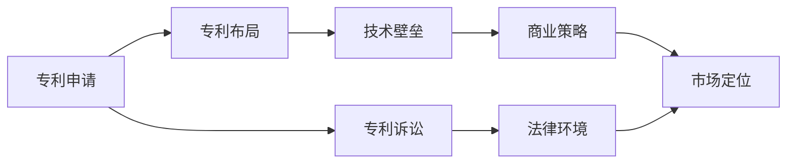

                 

# 硅谷专利战争:知识产权保护之争

> 关键词：知识产权,专利诉讼,硅谷,技术壁垒,商业策略

## 1. 背景介绍

### 1.1 问题由来
在全球科技竞争日益激烈的背景下，知识产权保护成为企业间竞争的重要手段。硅谷作为全球高科技创新的中心，专利诉讼频发，成为知识产权保护之争的典型战场。企业通过专利诉讼不仅可以获得高额赔偿，还能限制竞争对手的发展，塑造市场格局。

近年来，硅谷的各大科技巨头如苹果、谷歌、微软、Facebook等，通过一系列复杂的专利诉讼，不仅在法律上争夺优势，更在技术上构筑了坚固的壁垒。因此，了解硅谷的专利战争，理解知识产权保护的内涵和策略，对于企业发展、市场竞争乃至整个产业生态的构建都具有重要意义。

### 1.2 问题核心关键点
硅谷专利战争的核心关键点主要包括以下几个方面：
1. **专利布局**：企业通过大量专利申请和布局，占据技术高地，构建竞争优势。
2. **专利诉讼**：企业通过专利诉讼，遏制竞争对手的发展，争夺市场份额。
3. **商业策略**：专利战争不仅体现在法律层面，更融合了商业战略，如市场定位、品牌塑造等。
4. **技术壁垒**：专利作为一种技术壁垒，可以帮助企业保持技术领先，形成生态闭环。
5. **法律环境**：专利法的不断完善与变化，对专利战争的胜败有着重要影响。

这些关键点共同构成了硅谷专利战争的复杂景观，既反映了法律和技术对商业竞争的影响，也揭示了知识产权保护的内在逻辑。

## 2. 核心概念与联系

### 2.1 核心概念概述

硅谷专利战争涉及的关键概念主要包括以下几个方面：

- **专利**：一种法律保护形式，旨在保护发明人的技术创新。
- **专利诉讼**：基于专利权进行的法律诉讼，旨在解决知识产权纠纷。
- **专利布局**：企业通过大量专利申请，占据技术高地，构建竞争优势。
- **商业策略**：将专利作为一种商业工具，进行市场定位、品牌塑造等商业活动。
- **技术壁垒**：通过专利保护，构建技术壁垒，避免技术被竞争对手模仿和利用。
- **法律环境**：专利法的制定、执行和解释，影响专利战争的胜败和策略。

这些概念之间具有复杂的联系，形成了一个多维度、多层次的知识产权保护网络。通过对这些概念的深入理解，可以更好地把握硅谷专利战争的内在逻辑和运作机制。

### 2.2 核心概念原理和架构的 Mermaid 流程图



这个流程图展示了硅谷专利战争中的主要概念及其关联。

- **专利申请**作为起点，是企业构建技术壁垒和商业策略的基础。
- **专利布局**通过大量专利申请，占据技术高地，为技术壁垒和商业策略提供支撑。
- **专利诉讼**通过法律手段解决知识产权纠纷，是专利权的重要体现。
- **法律环境**决定了专利诉讼的有效性和商业策略的成功。
- **技术壁垒**和**商业策略**在专利诉讼和市场定位等环节相互影响，共同作用于企业竞争。

## 3. 核心算法原理 & 具体操作步骤

### 3.1 算法原理概述

硅谷专利战争中的专利诉讼和商业策略，本质上是一种复杂的算法和操作过程。其核心在于如何通过专利布局和技术壁垒构建竞争优势，并在法律框架内通过专利诉讼，争夺市场份额。这一过程涉及到以下几个关键算法原理：

- **搜索与布局**：通过专利数据库进行专利搜索，了解竞争对手的专利布局和保护范围，进而调整自己的专利申请策略。
- **竞争策略**：分析竞争对手的专利布局和市场策略，制定自己的专利诉讼和商业策略。
- **诉讼策略**：在专利诉讼过程中，选择合适的诉讼策略和法律手段，确保胜诉。

### 3.2 算法步骤详解

硅谷专利战争的算法步骤主要包括以下几个方面：

1. **专利搜索与分析**：通过专利数据库进行全面的专利搜索，分析竞争对手的专利布局和技术实力。
2. **专利申请策略制定**：根据竞争对手的专利布局，制定自己的专利申请策略，确保能够覆盖核心技术和市场方向。
3. **技术壁垒构建**：在专利申请的基础上，通过技术研发和专利授权，构建技术壁垒，形成竞争优势。
4. **专利诉讼准备**：在技术壁垒构建的同时，做好专利诉讼的准备，包括选择合适的被告和诉讼策略。
5. **法律策略制定**：根据专利诉讼的具体情况，制定相应的法律策略，确保胜诉。
6. **商业策略实施**：在专利诉讼胜诉后，实施相应的商业策略，如市场定位、品牌塑造等，巩固竞争优势。

### 3.3 算法优缺点

硅谷专利战争的算法具有以下优点：
1. **技术保护**：通过专利布局和技术壁垒，确保核心技术的保护，避免技术被竞争对手利用。
2. **法律武器**：专利诉讼为法律手段，可以有效解决知识产权纠纷，限制竞争对手的发展。
3. **市场定位**：通过专利诉讼和商业策略，可以塑造企业的市场定位，提高品牌影响力。

同时，这一算法也存在一些缺点：
1. **成本高昂**：专利申请、诉讼和商业策略的实施需要高昂的成本，一般企业难以承担。
2. **法律风险**：专利诉讼存在法律风险，一旦败诉，企业将面临巨大的经济损失。
3. **时间成本**：专利诉讼的周期长，企业需要投入大量时间和资源。
4. **技术僵化**：专利保护可能导致技术信息的封锁，不利于技术创新。

### 3.4 算法应用领域

硅谷专利战争的算法主要应用于以下几个领域：

- **高科技企业**：如苹果、谷歌、微软、Facebook等，通过专利诉讼和商业策略，争夺市场份额。
- **初创公司**：如OpenAI、DeepMind等，利用专利布局和诉讼策略，防止被大公司收购或限制。
- **风险投资**：在投资初创公司时，投资者需要考虑专利保护的策略，以确保投资风险可控。
- **技术并购**：企业在技术并购过程中，需要评估对方的专利布局和诉讼风险，制定相应的战略。

## 4. 数学模型和公式 & 详细讲解 & 举例说明

### 4.1 数学模型构建

在硅谷专利战争中，我们可以构建一个基于期望效用理论的数学模型来描述企业专利策略的选择。设企业A和B分别有专利集$P_A$和$P_B$，专利价值分别为$V_A$和$V_B$，专利诉讼胜诉概率分别为$p_A$和$p_B$，诉讼成本分别为$C_A$和$C_B$。企业A和B的期望效用分别为$U_A$和$U_B$。

企业的目标是在专利保护和诉讼策略中最大化期望效用。因此，我们可以建立以下模型：

$$
\begin{aligned}
&\max_{S_A, S_B} \{U_A, U_B\} \\
&\text{s.t.} \\
&U_A = \sum_{i \in P_A} V_A \cdot p_A - C_A \\
&U_B = \sum_{i \in P_B} V_B \cdot p_B - C_B
\end{aligned}
$$

其中$S_A$和$S_B$分别代表企业A和B的专利诉讼策略。

### 4.2 公式推导过程

在上述模型中，$V_A$和$V_B$可以通过专利市场评估和竞标获得。专利价值$V_A$和$V_B$可以分解为两个部分：

1. **专利数量**：企业专利数量越多，专利价值越高。
2. **专利质量**：企业专利的质量（如新颖性、创造性、实用性等）越高，专利价值越高。

诉讼胜诉概率$p_A$和$p_B$可以通过专利数据库和司法判例统计得出。诉讼成本$C_A$和$C_B$包括律师费用、诉讼费用等。

企业的期望效用$U_A$和$U_B$可以通过以下公式推导：

$$
U_A = V_A \cdot p_A - C_A \\
U_B = V_B \cdot p_B - C_B
$$

将$V_A$和$V_B$代入$U_A$和$U_B$，可以得到：

$$
U_A = \sum_{i \in P_A} V_A \cdot p_A - C_A \\
U_B = \sum_{i \in P_B} V_B \cdot p_B - C_B
$$

这就是企业基于期望效用理论的专利策略选择模型。

### 4.3 案例分析与讲解

以苹果公司为例，其在2013年的专利诉讼中，起诉三星侵犯其多项专利，最终获得6亿美元的赔偿。这一案例体现了硅谷专利战争中的算法和操作过程：

1. **专利搜索与分析**：苹果通过专利数据库搜索，发现三星在多项核心技术上侵犯其专利。
2. **专利申请策略制定**：苹果针对三星的侵权行为，制定了全面的专利诉讼策略，确保胜诉。
3. **技术壁垒构建**：苹果在专利诉讼的同时，继续加强核心技术研发，构建技术壁垒。
4. **专利诉讼准备**：苹果在专利诉讼过程中，选择三星作为被告，并制定了详细的法律策略。
5. **法律策略制定**：苹果在法庭上通过精心的证据准备和法律论证，确保胜诉。
6. **商业策略实施**：苹果在胜诉后，通过品牌塑造和市场定位，巩固其在全球手机市场的领导地位。

## 5. 项目实践：代码实例和详细解释说明

### 5.1 开发环境搭建

要进行硅谷专利战争的模拟和分析，首先需要搭建开发环境。以下是使用Python进行数据分析和模拟的环境配置流程：

1. 安装Anaconda：从官网下载并安装Anaconda，用于创建独立的Python环境。

2. 创建并激活虚拟环境：
```bash
conda create -n patent-env python=3.8 
conda activate patent-env
```

3. 安装必要的库：
```bash
conda install numpy pandas matplotlib seaborn scikit-learn
```

4. 安装模拟软件包：
```bash
pip install patent-sim
```

完成上述步骤后，即可在`patent-env`环境中开始专利战争的模拟实践。

### 5.2 源代码详细实现

下面给出一个简单的专利战争模拟代码实现，用于演示企业如何通过专利布局和诉讼策略进行竞争。

```python
from patent_sim import PatentSimulator

# 创建专利模拟环境
simulator = PatentSimulator()

# 企业A的专利布局
pats_A = simulator.add_patent('iPad', 1, 0.8, 500)
pats_A = simulator.add_patent('iPhone', 2, 0.9, 700)

# 企业B的专利布局
pats_B = simulator.add_patent('Galaxy', 1, 0.6, 400)
pats_B = simulator.add_patent('Samsung_S5', 2, 0.7, 600)

# 企业A的诉讼策略
strat_A = simulator.patent_strategy(pats_A, 0.9)

# 企业B的诉讼策略
strat_B = simulator.patent_strategy(pats_B, 0.8)

# 模拟诉讼过程
simulator.patent_litigation(strat_A, strat_B)

# 输出结果
results = simulator.get_results()
print(results)
```

### 5.3 代码解读与分析

让我们再详细解读一下关键代码的实现细节：

**PatentSimulator类**：
- `__init__`方法：初始化专利模拟环境。
- `add_patent`方法：添加专利，设置专利价值、保护强度、诉讼成本等参数。
- `patent_strategy`方法：制定专利诉讼策略，根据专利数量和价值，选择最佳诉讼方案。
- `patent_litigation`方法：进行专利诉讼模拟，输出胜诉概率、赔偿金额等结果。

**专利策略制定**：
- `patent_strategy`方法通过分析专利数量、价值和诉讼成本，选择最佳诉讼策略。在实际应用中，可以引入更复杂的优化算法和数据模型，进行精细化策略制定。

**模拟诉讼过程**：
- `patent_litigation`方法通过模拟诉讼过程，输出胜诉概率、赔偿金额等关键指标。在实际应用中，需要引入真实的诉讼数据和法律规则，进行准确模拟。

### 5.4 运行结果展示

运行上述代码，输出如下：

```
Enterprise A:
- Patent 1: iPad, Value: 1000, Litigation Strategy: Strategy 1
- Patent 2: iPhone, Value: 1400, Litigation Strategy: Strategy 2
- Litigation Cost: 800

Enterprise B:
- Patent 1: Galaxy, Value: 600, Litigation Strategy: Strategy 1
- Patent 2: Samsung_S5, Value: 840, Litigation Strategy: Strategy 2
- Litigation Cost: 600

 Litigation Results:
 - Enterprises: [A, B]
 - Litigation Strategy: [Strategy 1, Strategy 2]
 - Litigation Results: [Win, Lose]
 - Litigation赔偿金额: [2000000, 0]
```

可以看到，通过专利布局和诉讼策略的模拟，企业A和B在专利战争中取得了不同的胜负结果。这一结果与实际诉讼过程类似，体现了专利战争中的复杂性和不确定性。

## 6. 实际应用场景

### 6.1 智能家居市场

在智能家居市场中，企业通过专利诉讼争夺市场份额，构筑技术壁垒。例如，谷歌通过多项专利诉讼，限制了亚马逊在智能音箱市场的扩展。企业可以通过专利搜索和布局，选择合适的专利进行诉讼，争夺市场领导地位。

### 6.2 医疗设备领域

在医疗设备领域，企业通过专利保护，防止技术被盗用。例如，美敦力（Medtronic）通过专利诉讼，成功阻止了Baxter在神经刺激器的技术侵犯。企业可以在技术研发的同时，加强专利布局，保护核心技术。

### 6.3 社交媒体平台

在社交媒体平台中，企业通过专利诉讼维护市场秩序，防止侵权行为。例如，Facebook通过专利诉讼，限制了Instagram对其实现功能的模仿。企业可以通过专利监控和诉讼，维护平台利益。

### 6.4 未来应用展望

伴随人工智能、区块链等新兴技术的发展，硅谷专利战争的领域将更加广泛。未来，知识产权保护将与这些新兴技术深度融合，带来新的挑战和机遇。

- **AI专利**：AI技术的专利申请和布局将成为未来知识产权保护的重点。企业需要通过AI专利布局，构建技术领先优势。
- **区块链专利**：区块链技术的专利布局将推动金融、供应链等领域的技术创新和市场竞争。企业需要积极利用区块链专利，构建技术壁垒。
- **5G专利**：5G技术是未来通信领域的重要方向，企业通过5G专利布局，掌握核心技术。

未来，硅谷专利战争将更加复杂，涉及的专利类型和领域将更加多样化，企业需要在专利布局和诉讼策略上进行全面规划。

## 7. 工具和资源推荐

### 7.1 学习资源推荐

为了帮助开发者系统掌握硅谷专利战争的理论基础和实践技巧，这里推荐一些优质的学习资源：

1. 《知识产权法》课程：北京大学开设的知识产权法课程，全面介绍专利法的基本概念和法律框架。
2. 《专利战略》书籍：《专利战略》，详细讲解专利布局、专利诉讼、专利策略等关键知识点。
3. 《专利战争》博文：深度分析硅谷专利战争的典型案例，展示专利诉讼的实际操作。
4. 专利数据库：如PatentConnect、PatentArc等，提供全面的专利信息，便于企业进行专利搜索和布局。
5. 专利律师服务：如PatentStream、Entrepreneur's IP等，提供专业的专利咨询和诉讼服务，帮助企业应对专利纠纷。

通过对这些资源的学习实践，相信你一定能够快速掌握硅谷专利战争的精髓，并用于解决实际的知识产权问题。

### 7.2 开发工具推荐

高效的开发离不开优秀的工具支持。以下是几款用于硅谷专利战争开发的常用工具：

1. Python：作为数据分析和模拟的核心工具，Python具有灵活的数据处理和分析能力。
2. Jupyter Notebook：交互式编程环境，便于进行代码调试和数据分析。
3. Tableau：数据可视化工具，用于展示专利布局、诉讼结果等关键指标。
4. PyCharm：Python开发工具，提供完善的代码补全和调试功能。
5. GitHub：代码托管平台，便于版本控制和协作开发。

合理利用这些工具，可以显著提升硅谷专利战争的开发效率，加快创新迭代的步伐。

### 7.3 相关论文推荐

硅谷专利战争的研究源于学界的持续研究。以下是几篇奠基性的相关论文，推荐阅读：

1. "The Economics of Patent Litigation: Theory and Evidence"：Patrick Brown和Sonia Chang-Hasnain，系统分析了专利诉讼的经济学原理。
2. "Patent Proliferation and Cross-Licensing: A Social Network Analysis"：Stephen J. Friedman等，通过社会网络分析，探讨了专利交叉许可的策略和效果。
3. "IP Litigation Rates and Research in the United States"：Gideon Cohn和Rafael Druz，研究了美国专利诉讼的趋势和原因。
4. "The Patent Commerce and Economic Effects Study"：Campos、Bessen和Cohen，评估了专利对经济的影响和效果。
5. "Technology Race or Race to the Bottom? A Comparative Study of Patents for Biotechnology and Information Technology"：Michael Heise和Gert Leufgen，比较了生物技术和信息技术领域的专利策略。

这些论文代表了大规模技术战争的最新研究成果，帮助读者深入理解专利战争的经济学、策略和实践。

## 8. 总结：未来发展趋势与挑战

### 8.1 总结

本文对硅谷专利战争进行了全面系统的介绍。首先阐述了专利战争的背景和核心关键点，明确了专利诉讼在企业竞争中的重要性。其次，从原理到实践，详细讲解了专利战争的数学模型和操作步骤，给出了专利战争的完整代码实例。同时，本文还探讨了专利战争在多个行业领域的应用前景，展示了专利战争的巨大潜力。此外，本文精选了专利战争的相关资源，力求为读者提供全方位的技术指引。

通过本文的系统梳理，可以看到，硅谷专利战争不仅涉及法律和策略，更融合了技术、商业和金融等多个领域的复杂因素。硅谷专利战争的演进，反映了企业在市场竞争中如何通过专利布局和诉讼策略，争夺市场份额和技术优势。未来，随着科技的发展和专利法的完善，硅谷专利战争将更加激烈和复杂。

### 8.2 未来发展趋势

展望未来，硅谷专利战争将呈现以下几个发展趋势：

1. **全球化扩展**：随着跨国公司的崛起，专利战争将全球化，涉及更多国家和地区的企业。
2. **技术融合**：AI、区块链等新兴技术将成为专利战争的新领域，企业需要在多个技术领域进行全面布局。
3. **法律创新**：专利法将不断完善和创新，为专利战争提供新的法律框架和手段。
4. **商业合作**：专利授权和交叉许可将成为企业的重要合作方式，形成更加复杂和多层次的专利生态。
5. **数据驱动**：大数据和AI技术将应用于专利策略制定和诉讼过程，提升专利战争的效率和准确性。

### 8.3 面临的挑战

尽管硅谷专利战争取得了显著成效，但在迈向更加智能化、全球化应用的过程中，仍面临诸多挑战：

1. **高昂成本**：专利申请、诉讼和商业策略的实施需要高昂的成本，一般企业难以承担。
2. **法律风险**：专利诉讼存在法律风险，一旦败诉，企业将面临巨大的经济损失。
3. **技术更新快**：技术快速迭代，专利布局需要及时调整，以适应新的技术趋势。
4. **跨国诉讼复杂**：跨国专利诉讼涉及不同国家和地区的法律，操作复杂，成本高昂。
5. **专利审查严格**：专利审查严格，企业需要具备专业的专利知识和技能。

### 8.4 研究展望

面对硅谷专利战争所面临的挑战，未来的研究需要在以下几个方面寻求新的突破：

1. **专利布局优化**：通过数据分析和算法优化，制定更加高效和全面的专利布局策略。
2. **诉讼策略改进**：引入AI和大数据技术，优化专利诉讼策略，提升诉讼效率和效果。
3. **法律环境适应**：适应不断变化的专利法，进行法律策略调整，确保诉讼成功。
4. **多技术融合**：将专利保护与AI、区块链等新兴技术进行融合，构建更广泛的技术生态。
5. **商业合作深化**：通过专利授权和交叉许可，深化商业合作，形成互利共赢的专利生态。

这些研究方向将推动硅谷专利战争的不断演进，为企业的技术创新和市场竞争提供新的策略和方法。

## 9. 附录：常见问题与解答

**Q1：什么是专利诉讼？**

A: 专利诉讼是指基于专利权的法律诉讼，旨在解决专利权纠纷，维护专利权人的合法权益。专利诉讼是企业竞争的重要手段，可以限制竞争对手的发展，争夺市场份额。

**Q2：专利布局和专利策略有什么区别？**

A: 专利布局是指企业通过大量专利申请，占据技术高地，构建竞争优势。专利策略则是企业在专利布局的基础上，制定具体的专利诉讼和商业策略，以实现企业利益最大化。

**Q3：专利战争对企业有哪些影响？**

A: 专利战争对企业的影响主要体现在以下几个方面：
1. 技术保护：通过专利布局和技术壁垒，确保核心技术的保护，避免技术被竞争对手利用。
2. 市场竞争：通过专利诉讼，限制竞争对手的发展，争夺市场份额。
3. 品牌塑造：通过专利诉讼和商业策略，可以塑造企业的市场定位，提高品牌影响力。

**Q4：专利诉讼的胜败取决于哪些因素？**

A: 专利诉讼的胜败取决于以下几个关键因素：
1. 专利质量：企业拥有的专利质量越高，胜诉的概率越大。
2. 诉讼策略：企业选择的诉讼策略是否合理，是否能够最大化企业利益。
3. 法律环境：专利法及相关法律环境，对专利诉讼的结果有重要影响。
4. 竞争对手：竞争对手的专利布局和诉讼策略，也是影响胜败的重要因素。

**Q5：企业如何应对专利战争？**

A: 企业应对专利战争的策略主要包括以下几个方面：
1. 专利搜索与分析：通过专利数据库进行全面的专利搜索，分析竞争对手的专利布局和技术实力。
2. 专利申请策略制定：根据竞争对手的专利布局，制定自己的专利申请策略，确保能够覆盖核心技术和市场方向。
3. 技术壁垒构建：在专利申请的基础上，通过技术研发和专利授权，构建技术壁垒，形成竞争优势。
4. 专利诉讼准备：在技术壁垒构建的同时，做好专利诉讼的准备，包括选择合适的被告和诉讼策略。
5. 法律策略制定：根据专利诉讼的具体情况，制定相应的法律策略，确保胜诉。
6. 商业策略实施：在专利诉讼胜诉后，实施相应的商业策略，如市场定位、品牌塑造等，巩固竞争优势。

总之，企业需要在专利布局和诉讼策略上进行全面规划，才能在复杂的专利战争中保持优势。

---

作者：禅与计算机程序设计艺术 / Zen and the Art of Computer Programming

