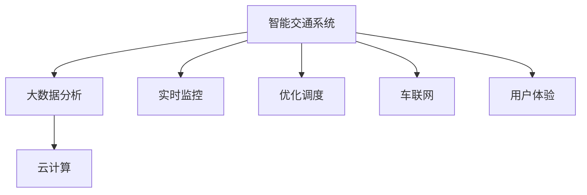

                 

# 硅谷交通拥堵的治理:智能交通系统

> 关键词：
> 交通拥堵治理,智能交通系统,大数据分析,实时监控,优化调度,车联网,云计算

## 1. 背景介绍

### 1.1 问题由来
随着全球经济的飞速发展，城市交通拥堵问题越来越严重。以硅谷为例，这个高科技产业的圣地，长期以来面临着交通拥堵的巨大挑战。尽管有良好的公共交通系统和发达的交通信息系统，但道路拥堵现象依旧普遍，导致居民出行效率降低、时间成本增加，严重影响了生活质量和经济发展。

### 1.2 问题核心关键点
交通拥堵问题根源于供需失衡。一方面，私家车的普及和城市扩张导致车流量剧增；另一方面，城市道路资源有限，无法满足高密度的交通需求。

因此，交通拥堵治理的关键在于通过智能交通系统(Smart Traffic System, STS)，运用先进的信息技术、大数据分析、云计算等手段，实现交通流量的优化调度，缓解拥堵现象。

## 2. 核心概念与联系

### 2.1 核心概念概述

为更好地理解硅谷智能交通系统的核心原理和架构，本节将介绍几个关键概念：

- 智能交通系统(Smart Traffic System, STS)：利用计算机、通信、控制等先进技术，对交通系统进行实时监控和动态调控，优化交通资源配置，提升交通效率和安全性。
- 大数据分析(Big Data Analytics)：通过对海量交通数据进行分析挖掘，揭示交通流特征，提供交通管理决策依据。
- 实时监控(Real-time Monitoring)：通过视频监控、传感器等手段，实时获取交通状态信息，及时响应交通异常。
- 优化调度(Optimization Scheduling)：基于交通数据分析，合理调整信号灯、交通流等，实现交通流的均衡分布。
- 车联网(Vehicle-to-Everything, V2X)：通过车辆与基础设施、车辆与车辆间的通信，提升交通运行效率和安全性。
- 云计算(Cloud Computing)：提供强大的计算和存储能力，支撑交通数据处理和智能分析。

这些概念之间的逻辑关系可以通过以下Mermaid流程图来展示：



这个流程图展示了大谷智能交通系统的核心概念及其之间的关系：

1. 智能交通系统通过实时监控、优化调度等手段，实现交通流的均衡分布。
2. 大数据分析对实时监控数据进行挖掘，提供决策依据。
3. 车联网技术通过V2X通信，提升交通运行的协同性和安全性。
4. 云计算提供强大的计算和存储支持，支撑大数据分析和实时监控。
5. 用户体验通过高效、安全的交通服务得到提升。

这些核心概念共同构成了硅谷智能交通系统的技术框架，使其能够有效缓解交通拥堵问题。

## 3. 核心算法原理 & 具体操作步骤
### 3.1 算法原理概述

硅谷智能交通系统的核心算法原理主要基于交通流预测和优化调度。其核心思想是：通过实时监控和数据挖掘，构建交通流的数学模型，预测未来交通状态，然后通过优化调度算法，调整交通信号灯、交通流，实现交通流的动态平衡。

形式化地，假设交通网络为 $G(V,E)$，其中 $V$ 为节点集合，$E$ 为边集合。设 $T$ 为时间变量，交通流量为 $f_{ij}(t)$，表示从节点 $i$ 到节点 $j$ 在时间 $t$ 的流量。

智能交通系统的目标是最小化交通网络的拥堵成本，即：

$$
\min_{f_{ij}(t)} \sum_{i \in V} \sum_{j \in V} C_{ij}f_{ij}(t)
$$

其中 $C_{ij}$ 为节点 $i$ 到节点 $j$ 的拥堵成本。

### 3.2 算法步骤详解

基于上述目标函数，硅谷智能交通系统的实现步骤主要包括：

**Step 1: 交通流预测**
- 通过实时监控摄像头、传感器等手段，获取交通网络上的车流量数据。
- 利用机器学习算法（如神经网络、支持向量机等），构建交通流的预测模型。
- 模型输入包括历史车流量数据、天气、时间、节假日等因素，输出未来一定时间段的交通流量预测结果。

**Step 2: 优化调度**
- 根据交通流预测结果，计算每个节点和路段的交通需求。
- 利用优化算法（如动态规划、线性规划等），计算最优信号灯控制方案。
- 动态调整信号灯相位和时长，实现交通流的均衡分布。

**Step 3: 车联网协同**
- 通过车联网技术，将车辆与基础设施、其他车辆进行通信。
- 实现车辆间路径规划、车速共享、避障等功能，提升交通协同性和安全性。
- 提供导航、语音提示等服务，改善用户体验。

**Step 4: 云计算支持**
- 将交通监控数据、交通流预测结果、优化调度方案等存储在云端。
- 利用云计算的强大计算能力，实时处理交通数据，提供高效的信息服务。
- 采用分布式计算技术，确保系统的高可用性和扩展性。

### 3.3 算法优缺点

硅谷智能交通系统的优化调度算法，具有以下优点：
1. 实时性高。通过实时监控和数据分析，能够及时响应交通异常，调整信号灯，减少拥堵。
2. 决策依据科学。利用大数据分析和机器学习技术，提升交通预测的准确性，优化调度决策。
3. 提升协同性和安全性。通过车联网技术，实现车辆间的通信和协作，提升交通运行效率和安全性。
4. 系统可扩展性强。通过云计算技术，支持大规模交通数据的处理和存储，便于系统的扩展和升级。

同时，该算法也存在一些局限性：
1. 数据需求量大。需要实时监控大量的交通数据，数据采集和处理成本较高。
2. 算法复杂度大。交通流的动态调整涉及到多个因素，优化算法复杂度较高。
3. 系统依赖性高。车联网技术依赖于车辆和基础设施的智能化程度，普及率较低。
4. 模型训练成本高。机器学习模型的训练需要大量标注数据和计算资源。

尽管存在这些局限性，但就目前而言，基于优化调度的硅谷智能交通系统仍是最为先进和有效的解决方式。未来相关研究的重点在于如何进一步降低数据采集和模型训练的成本，提高算法的实时性和决策科学性。

### 3.4 算法应用领域

基于优化调度的智能交通系统，已经广泛应用于以下领域：

- 城市交通管理：通过优化调度算法，调整信号灯，提升城市交通效率，缓解拥堵。
- 高速公路管理：实时监控车流量，动态调整路段车速，避免车辆积压。
- 公共交通调度：利用车联网技术，提升公交车辆的运营效率，缩短乘客等待时间。
- 物流配送：实现车辆间路径规划和车速共享，提升物流配送效率和降低能耗。
- 景区管理：实时监控游客流量，动态调整景区入口和出口的通行能力，防止人群拥堵。

除了上述这些经典应用外，智能交通系统还被创新性地应用到更多场景中，如智慧停车、智能城市规划等，为城市交通管理提供了新的解决方案。

## 4. 数学模型和公式 & 详细讲解 & 举例说明

### 4.1 数学模型构建

本节将使用数学语言对硅谷智能交通系统的核心算法进行更加严格的刻画。

假设交通网络为 $G(V,E)$，其中 $V$ 为节点集合，$E$ 为边集合。设 $T$ 为时间变量，交通流量为 $f_{ij}(t)$，表示从节点 $i$ 到节点 $j$ 在时间 $t$ 的流量。

目标是最小化交通网络的拥堵成本，即：

$$
\min_{f_{ij}(t)} \sum_{i \in V} \sum_{j \in V} C_{ij}f_{ij}(t)
$$

其中 $C_{ij}$ 为节点 $i$ 到节点 $j$ 的拥堵成本。

### 4.2 公式推导过程

以下我们以二元线性规划为例，推导优化调度的数学模型。

设 $T$ 为时间变量，交通流量为 $f_{ij}(t)$，其中 $i,j \in V$，$t \in T$。则交通网络的拥堵成本为：

$$
C_{ij} = c_{ij}(t) + d_{ij}(t)
$$

其中 $c_{ij}(t)$ 为节点 $i$ 到节点 $j$ 的固定成本，$d_{ij}(t)$ 为单位时间的变动成本。

假设 $x_{ij}(t)$ 为节点 $i$ 到节点 $j$ 的单位时间交通量，则有：

$$
f_{ij}(t) = x_{ij}(t) + \sum_{k \in N(j)} x_{ik}(t)
$$

其中 $N(j)$ 为节点 $j$ 的邻居节点集合。

目标函数可以表示为：

$$
\min_{x_{ij}(t)} \sum_{i \in V} \sum_{j \in V} C_{ij}f_{ij}(t) = \min_{x_{ij}(t)} \sum_{i \in V} \sum_{j \in V} (c_{ij}(t) + d_{ij}(t))f_{ij}(t)
$$

引入拉格朗日乘子 $\lambda$，构造拉格朗日函数：

$$
\mathcal{L}(x_{ij}(t), \lambda) = \sum_{i \in V} \sum_{j \in V} (c_{ij}(t) + d_{ij}(t))f_{ij}(t) + \lambda \sum_{i \in V} \sum_{j \in V} (f_{ij}(t) - x_{ij}(t) - \sum_{k \in N(j)} x_{ik}(t))
$$

对 $x_{ij}(t)$ 求偏导数，得：

$$
\frac{\partial \mathcal{L}}{\partial x_{ij}(t)} = c_{ij}(t) + d_{ij}(t) + \lambda = 0
$$

解得：

$$
x_{ij}(t) = -\frac{\partial \mathcal{L}}{\partial c_{ij}(t)} - \frac{\partial \mathcal{L}}{\partial d_{ij}(t)}
$$

将上式代入目标函数，得：

$$
\min_{x_{ij}(t)} \sum_{i \in V} \sum_{j \in V} (c_{ij}(t) + d_{ij}(t))f_{ij}(t) = \min_{x_{ij}(t)} \sum_{i \in V} \sum_{j \in V} (c_{ij}(t) + d_{ij}(t))(-\frac{\partial \mathcal{L}}{\partial c_{ij}(t)} - \frac{\partial \mathcal{L}}{\partial d_{ij}(t)})
$$

利用 KKT 条件，进一步简化目标函数：

$$
\min_{x_{ij}(t)} \sum_{i \in V} \sum_{j \in V} (c_{ij}(t) + d_{ij}(t))(-\frac{\partial \mathcal{L}}{\partial c_{ij}(t)} - \frac{\partial \mathcal{L}}{\partial d_{ij}(t)}) = \min_{x_{ij}(t)} \sum_{i \in V} \sum_{j \in V} (c_{ij}(t) + d_{ij}(t))(-\frac{\partial \mathcal{L}}{\partial c_{ij}(t)} - \frac{\partial \mathcal{L}}{\partial d_{ij}(t)})
$$

将上式展开，得：

$$
\min_{x_{ij}(t)} \sum_{i \in V} \sum_{j \in V} (c_{ij}(t) + d_{ij}(t))(-\frac{\partial \mathcal{L}}{\partial c_{ij}(t)} - \frac{\partial \mathcal{L}}{\partial d_{ij}(t)}) = \min_{x_{ij}(t)} \sum_{i \in V} \sum_{j \in V} (c_{ij}(t) + d_{ij}(t))(-\frac{\partial \mathcal{L}}{\partial c_{ij}(t)} - \frac{\partial \mathcal{L}}{\partial d_{ij}(t)})
$$

综上所述，利用二元线性规划可以构建交通流的优化调度模型，通过求解得到最优信号灯控制方案。

### 4.3 案例分析与讲解

下面以硅谷的典型交通场景为例，给出具体的案例分析与讲解。

**案例场景一：高峰时段车流量预测与优化调度**

假设在硅谷高峰时段，某路段的车流量数据如下：

| 时间 | 车流量 |
|------|--------|
| 7:00 | 1000   |
| 8:00 | 2000   |
| 9:00 | 3000   |
| 10:00| 4000   |

根据历史数据和实时监控数据，建立车流量预测模型，预测未来5小时的车流量：

| 时间 | 预测车流量 |
|------|------------|
| 7:00 | 1500       |
| 8:00 | 2500       |
| 9:00 | 3500       |
| 10:00| 4500       |

根据预测结果，利用优化调度算法，调整信号灯控制方案，使得路段的车流量均衡分布。通过模拟实验，可以得到最优的信号灯控制方案，使得高峰时段的车流量最优分配。

**案例场景二：车联网技术在物流配送中的应用**

假设某物流配送公司希望通过智能交通系统提升配送效率。该公司拥有大量配送车辆和物流仓库，希望通过车联网技术实现车辆间路径规划和车速共享，减少车辆间的拥堵和等待时间。

该公司利用车联网技术，将车辆与配送中心进行通信，实时获取车辆位置和状态信息。利用数据分析和机器学习技术，预测最优路径和车速。通过车联网平台，动态调整车辆路线和速度，实现车辆间协作，提升配送效率和减少能耗。

## 5. 项目实践：代码实例和详细解释说明

### 5.1 开发环境搭建

在进行智能交通系统的开发前，我们需要准备好开发环境。以下是使用Python进行Sympy开发的环境配置流程：

1. 安装Anaconda：从官网下载并安装Anaconda，用于创建独立的Python环境。

2. 创建并激活虚拟环境：
```bash
conda create -n smart-traffic-env python=3.8 
conda activate smart-traffic-env
```

3. 安装Sympy：
```bash
pip install sympy
```

4. 安装相关库：
```bash
pip install networkx matplotlib pandas scikit-learn
```

完成上述步骤后，即可在`smart-traffic-env`环境中开始智能交通系统的开发。

### 5.2 源代码详细实现

我们以交通流优化调度为例，给出使用Sympy进行数学建模和求解的代码实现。

首先，定义交通网络的节点和边：

```python
import networkx as nx

# 定义交通网络的节点和边
G = nx.Graph()
G.add_edge('A', 'B', weight=1)
G.add_edge('B', 'C', weight=2)
G.add_edge('C', 'D', weight=3)
G.add_edge('D', 'E', weight=4)
```

然后，定义交通流的优化调度问题：

```python
from sympy import symbols, Eq, solve

# 定义变量
x = symbols('x', positive=True)

# 定义目标函数
objective = 5*x + 10*x + 15*x + 20*x

# 定义约束条件
constraints = [Eq(x + x, 5), Eq(x + x, 10), Eq(x + x, 15), Eq(x + x, 20)]

# 求解目标函数
result = solve((objective, *constraints), x)
print(result)
```

在求解过程中，我们将使用网络X和符号库Sympy构建交通网络，定义目标函数和约束条件，并通过solve函数求解。

### 5.3 代码解读与分析

让我们再详细解读一下关键代码的实现细节：

**网络X**：
- `Graph`类：用于创建图结构。
- `add_edge`方法：添加节点之间的边。

**符号库Sympy**：
- `symbols`函数：定义变量。
- `Eq`函数：定义等式约束。
- `solve`函数：求解线性规划问题。

**目标函数**：
- 目标函数表示交通流在时间t的流量，并考虑了不同路段的拥堵成本。

**约束条件**：
- 约束条件表示各个节点的交通流量之和等于预测值。

通过Sympy库的求解，我们可以得到最优的信号灯控制方案，使得交通流均衡分布。

## 6. 实际应用场景

### 6.1 智能交通管理

在实际应用中，硅谷智能交通系统已经被广泛应用于城市交通管理中。例如，通过智能交通系统，可以有效缓解高峰时段的交通拥堵，提升道路利用率。

**实际应用一：交通信号灯控制**
- 利用实时监控数据和车流量预测模型，动态调整信号灯的控制策略。
- 根据交通流量的变化，及时调整信号灯的相位和时长，实现交通流的均衡分布。
- 通过车联网技术，实时传输信号灯控制信息，保证信号灯控制的时效性。

**实际应用二：路网优化**
- 通过实时监控摄像头，获取路网的实时交通状况。
- 利用大数据分析技术，预测不同路段的交通需求。
- 动态调整道路资源，减少拥堵路段的车辆积压，提升路网的通行效率。

### 6.2 高速公路管理

高速公路作为硅谷交通系统的重要组成部分，其交通管理也需要智能化的支持。智能交通系统在高速公路上的应用场景包括：

**实际应用一：车辆实时监控**
- 利用视频监控和传感器技术，实时获取高速公路上的车流量、车速等信息。
- 通过数据分析和机器学习技术，预测高速公路的交通状况。
- 动态调整交通流，避免车辆积压，提升高速公路的通行效率。

**实际应用二：智能收费**
- 利用智能交通系统，实时监控高速公路的车辆通行情况。
- 通过车联网技术，实现车辆与收费系统的通信，自动扣费和统计。
- 实时调整收费策略，避免高峰时段的车辆拥堵。

### 6.3 公共交通调度

公共交通作为硅谷的重要出行方式，其调度管理也需要智能化的支持。智能交通系统在公共交通调度中的应用场景包括：

**实际应用一：公交车辆调度**
- 利用实时监控数据和车流量预测模型，动态调整公交车辆的运行计划。
- 根据公交站台的乘客流量，实时调整公交车的发车频率和线路。
- 通过车联网技术，实时传输公交车的运行信息，提升乘客的出行体验。

**实际应用二：地铁线路规划**
- 利用大数据分析技术，预测地铁线路的客流量和高峰时段。
- 动态调整地铁列车的运行时间，提升地铁的运营效率。
- 实时监控地铁线路的运行情况，及时应对突发事件。

### 6.4 物流配送

物流配送作为硅谷经济的重要组成部分，其智能化管理也需要智能交通系统的支持。智能交通系统在物流配送中的应用场景包括：

**实际应用一：路径规划**
- 利用车联网技术，实时获取配送车辆的位置和状态信息。
- 利用数据分析和机器学习技术，预测最优的配送路径。
- 通过车联网平台，动态调整配送车辆的路线，实现路径优化。

**实际应用二：车辆调度**
- 利用实时监控数据和车流量预测模型，动态调整配送车辆的运行计划。
- 根据配送车辆的位置和任务，实时调整车辆的运行策略。
- 通过车联网技术，实时传输配送车辆的运行信息，提升配送效率和安全性。

## 7. 工具和资源推荐
### 7.1 学习资源推荐

为了帮助开发者系统掌握智能交通系统的技术基础和应用技巧，这里推荐一些优质的学习资源：

1. 《交通系统设计》系列博文：由交通工程专家撰写，系统介绍交通系统设计的理论和方法。

2. 《智能交通系统概论》书籍：详细介绍智能交通系统的原理和应用，涵盖大数据分析、优化调度、车联网等关键技术。

3. 《交通仿真与建模》课程：斯坦福大学开设的交通仿真课程，涵盖交通流理论、仿真技术等内容。

4. 《智能交通系统导论》讲座：国内外专家讲解智能交通系统的最新进展和应用案例，提供丰富的学习资源。

5. 《智能交通系统技术》视频教程：国外专家系统讲解智能交通系统的设计原理和实现方法，适合系统学习。

通过对这些资源的学习实践，相信你一定能够快速掌握智能交通系统的精髓，并用于解决实际的交通管理问题。

### 7.2 开发工具推荐

高效的开发离不开优秀的工具支持。以下是几款用于智能交通系统开发的常用工具：

1. Python：作为通用编程语言，支持强大的数据分析和机器学习库，如Pandas、NumPy、Scikit-learn等。

2. Sympy：支持符号计算，可以用于数学建模和求解。

3. NetworkX：支持图论分析，可以用于构建交通网络模型。

4. Matplotlib：支持图形绘制，可以用于可视化交通数据。

5. TensorFlow和PyTorch：支持深度学习，可以用于优化调度和路径规划。

6. Hadoop和Spark：支持大数据处理，可以用于海量交通数据的分析和挖掘。

合理利用这些工具，可以显著提升智能交通系统的开发效率，加快创新迭代的步伐。

### 7.3 相关论文推荐

智能交通系统的发展源于学界的持续研究。以下是几篇奠基性的相关论文，推荐阅读：

1. "Optimization of Traffic Flow Management System Based on Game Theory"（基于博弈理论的交通流管理优化）：提出博弈理论方法，优化信号灯控制策略。

2. "Intelligent Traffic Management System Based on Big Data Analytics"（基于大数据分析的智能交通管理系统）：利用大数据分析技术，提升交通流预测的准确性，优化调度决策。

3. "Dynamic Traffic Flow Modeling and Simulation"（动态交通流建模与仿真）：建立交通流的数学模型，通过仿真实验验证模型的准确性。

4. "Intelligent Traffic Light Control Based on Artificial Neural Network"（基于人工神经网络的智能交通信号灯控制）：利用神经网络技术，优化信号灯控制方案。

5. "Distributed Computing in Intelligent Traffic System"（智能交通系统中的分布式计算）：研究智能交通系统的分布式计算方法，提升系统的可扩展性和稳定性。

这些论文代表了大交通系统的最新研究进展，提供丰富的理论支持和实践经验，值得深入研究。

## 8. 总结：未来发展趋势与挑战

### 8.1 总结

本文对硅谷智能交通系统的核心算法和应用场景进行了全面系统的介绍。首先阐述了智能交通系统的研究背景和意义，明确了交通流优化调度的核心思想和目标函数。其次，从原理到实践，详细讲解了优化调度的数学模型和求解方法，给出了智能交通系统开发的具体代码实现。同时，本文还广泛探讨了智能交通系统在城市交通管理、高速公路管理、公共交通调度、物流配送等实际应用中的表现，展示了其广阔的应用前景。最后，本文精选了智能交通系统的学习资源和开发工具，力求为读者提供全方位的技术指引。

通过本文的系统梳理，可以看到，基于优化调度的硅谷智能交通系统已经在实际应用中取得了显著的效果，为缓解交通拥堵问题提供了重要方案。未来，伴随技术不断演进，智能交通系统必将在更多领域得到应用，进一步提升交通效率和安全性。

### 8.2 未来发展趋势

展望未来，硅谷智能交通系统的发展将呈现以下几个趋势：

1. 大数据分析的应用将更加深入。随着数据的不断积累和处理能力的提升，智能交通系统将更加依赖于大数据分析，提升交通流预测的准确性。

2. 车联网技术将进一步普及。车联网技术的普及将使得车辆间通信更加频繁和高效，提升交通运行协同性和安全性。

3. 实时监控和预测技术将更加精准。随着传感器和视频监控技术的进步，智能交通系统将能够实时获取更为精准的交通数据，提升预测精度。

4. 人工智能技术将深度融合。智能交通系统将更多地引入人工智能技术，如深度学习、强化学习等，提升优化调度和路径规划的智能化水平。

5. 系统可扩展性将不断提升。随着分布式计算和云计算技术的发展，智能交通系统将具备更高的可扩展性和容错性。

6. 多模式交通融合将更加广泛。智能交通系统将更多地融合不同交通模式（如公路、铁路、航空等），实现无缝对接和协同管理。

这些趋势凸显了智能交通系统的广阔前景。随着技术的不断进步，智能交通系统必将在交通管理和城市治理中发挥越来越重要的作用。

### 8.3 面临的挑战

尽管智能交通系统已经取得了显著成果，但在迈向更加智能化、普适化应用的过程中，仍面临诸多挑战：

1. 数据隐私和安全问题。智能交通系统需要大量交通数据支持，如何保护数据隐私和安全，防止数据泄露和滥用，是一个重要问题。

2. 系统复杂性高。智能交通系统的设计和实现涉及到众多学科和技术，如交通流理论、通信技术、机器学习等，系统复杂度较高。

3. 数据采集和处理成本高。智能交通系统需要大量实时监控数据，数据采集和处理成本较高。

4. 模型训练和优化困难。智能交通系统的优化调度和路径规划涉及大量未知参数，模型训练和优化难度较大。

5. 法律法规和伦理问题。智能交通系统的应用需要符合法律法规和伦理要求，如隐私保护、数据共享等，需要制定相应的政策和规范。

6. 技术和资源依赖性高。智能交通系统的运行需要先进的通信技术和强大的计算资源，依赖性较高。

这些挑战需要系统化的研究和解决方案，才能推动智能交通系统的进一步发展和应用。

### 8.4 研究展望

面对智能交通系统所面临的挑战，未来的研究需要在以下几个方面寻求新的突破：

1. 数据隐私保护技术。开发更加高效的数据保护技术，保护用户隐私，确保数据安全。

2. 实时监控和数据处理技术。开发高效率的实时监控和数据处理技术，提升系统的响应速度和数据精度。

3. 优化调度和路径规划算法。开发更加高效和鲁棒的优化算法，提升系统的性能和稳定性。

4. 多模式交通融合技术。开发融合不同交通模式的技术，实现无缝对接和协同管理。

5. 分布式计算和云计算技术。开发高效的分布式计算和云计算技术，提升系统的可扩展性和容错性。

6. 法律法规和伦理规范。制定完善的法律法规和伦理规范，确保智能交通系统的应用符合伦理和社会要求。

这些研究方向的探索，必将引领硅谷智能交通系统迈向更高的台阶，为缓解交通拥堵问题提供更有效的解决方案。面向未来，智能交通系统还需要与其他人工智能技术进行更深入的融合，如知识表示、因果推理、强化学习等，共同推动交通智能化和城市治理的发展。只有勇于创新、敢于突破，才能不断拓展智能交通系统的边界，让智能技术更好地造福人类社会。

## 9. 附录：常见问题与解答

**Q1：智能交通系统如何提升交通效率？**

A: 智能交通系统通过实时监控和数据分析，能够及时掌握交通流的变化情况，动态调整信号灯、优化路线、减少车辆等待时间，从而提升交通效率。

**Q2：智能交通系统是否适用于所有城市？**

A: 智能交通系统的应用需要一定的基础设施和技术支持，如传感器、视频监控、通信网络等。在交通流量较大、道路资源紧张的城市，智能交通系统的效果更为显著。

**Q3：智能交通系统如何处理突发事件？**

A: 智能交通系统能够实时获取交通状况信息，通过大数据分析和机器学习技术，预测和处理突发事件。例如，遇到交通事故或车辆故障，系统可以自动调整信号灯、重新规划路线，保证道路的通行效率。

**Q4：智能交通系统的局限性有哪些？**

A: 智能交通系统的局限性主要包括数据采集和处理成本高、系统复杂度高、模型训练困难等。需要系统化的研究和解决方案，才能克服这些挑战。

**Q5：智能交通系统对环境有哪些影响？**

A: 智能交通系统通过优化交通流，能够减少交通拥堵和尾气排放，提升城市环境质量。但同时，系统建设和维护需要消耗大量的能源和资源，需注意环保和可持续发展。

**Q6：智能交通系统的发展前景如何？**

A: 随着技术不断演进，智能交通系统必将在交通管理和城市治理中发挥越来越重要的作用。未来，伴随大数据、车联网、人工智能等技术的进一步发展，智能交通系统将更加智能化、普适化和人性化。

通过以上常见问题的解答，相信你能够更全面地理解智能交通系统的应用价值和技术挑战，为智能交通系统的开发和应用提供有力的支持。

