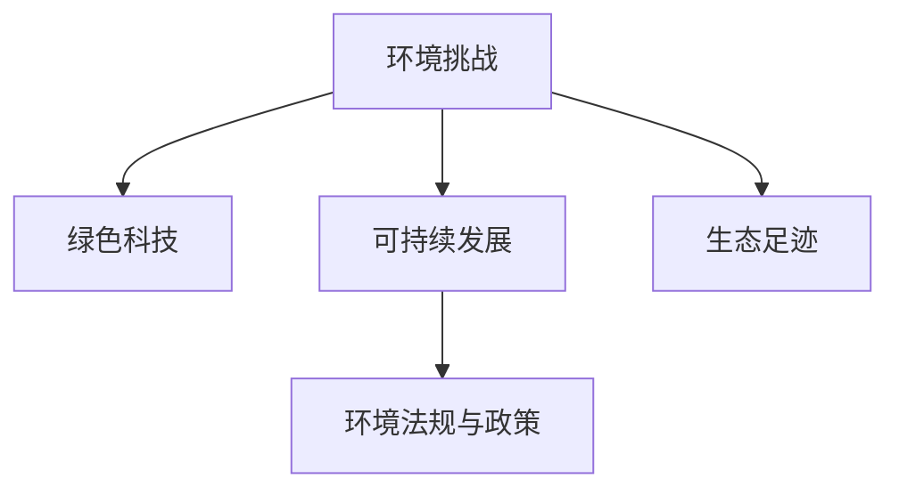

                 

# 硅谷的环境挑战:可持续发展之路

## 1. 背景介绍

### 1.1 问题由来
硅谷作为全球科技创新的中心，多年来为人类科技进步做出了巨大贡献。然而，随着科技企业的高速增长，硅谷面临的环境问题日益凸显。工商业的扩张、资源的过度消耗、废弃物的堆积等，对硅谷的自然环境和社会生态造成了巨大压力。

近年来，气候变化、生物多样性丧失、水资源短缺等问题频发，给硅谷的未来发展带来了严峻挑战。为实现可持续发展，硅谷正在探索并实施一系列绿色科技和环保举措。

### 1.2 问题核心关键点
硅谷面临的环境挑战主要集中在以下几方面：
1. 能源消耗与碳排放：硅谷集中了大量的科技公司，其数据中心、服务器和办公室等设施的能源消耗巨大。
2. 水资源短缺：硅谷的气候干旱，水资源紧张，缺乏可持续的水资源管理方案。
3. 废弃物处理：硅谷科技公司日常运营产生的电子废弃物、纸张、塑料等废弃物处理压力巨大。
4. 生物多样性保护：硅谷及其周边自然环境面临生态退化、物种丧失的风险。
5. 环境立法与政策：硅谷需要有效的环境法规和政策来引导科技企业的绿色发展。

这些关键问题需要通过科技创新的手段来解决，实现经济的可持续发展。本文将详细探讨硅谷的环境挑战，并提出可能的可持续发展路径。

## 2. 核心概念与联系

### 2.1 核心概念概述

在探索硅谷的环境挑战及可持续发展之路时，我们需要关注以下几个核心概念：

- **环境挑战**：指硅谷在科技发展过程中遇到的各类环境问题，包括能源消耗、水资源短缺、废弃物处理、生物多样性丧失等。
- **绿色科技**：指采用可持续、环境友好的技术手段，减少对自然资源的消耗，减少污染物排放，实现经济与环境的双赢。
- **可持续发展**：指在满足当代人需求的同时，不损害后代人满足需求的能力。可持续发展涉及经济、社会、环境等多个维度。
- **环境法规与政策**：指政府制定的法规和政策，旨在引导企业采取绿色发展策略，保护生态环境。
- **生态足迹**：指个人、企业、国家或地区在生产消费过程中对自然环境造成的资源消耗和污染排放。

这些概念通过以下Mermaid流程图来展示：



这个流程图展示了各个概念之间的联系：环境挑战推动绿色科技和可持续发展，而绿色科技和可持续发展又需要环境法规与政策的支撑。

## 3. 核心算法原理 & 具体操作步骤

### 3.1 算法原理概述

硅谷的环境挑战需要通过科技创新的手段来解决，具体的策略包括绿色科技、可持续发展、环境法规与政策等。以下是核心算法原理和具体操作步骤：

1. **绿色科技**：采用可再生能源、智能电网、节能建筑设计等技术手段，减少能源消耗和碳排放。
2. **可持续发展**：采用循环经济、生态修复等技术手段，保护自然资源，促进经济与环境的和谐共存。
3. **环境法规与政策**：制定严格的环境法规和政策，推动科技企业的绿色发展，促进环保技术的推广应用。

### 3.2 算法步骤详解

#### 3.2.1 绿色科技的具体实现步骤：

1. **可再生能源应用**：
    - 收集太阳能、风能、地热能等可再生能源。
    - 在数据中心、工业园区等场所安装太阳能板和风力发电机。
    - 通过智能电网技术，优化能源分配和使用。

2. **节能建筑设计**：
    - 采用高效的建筑材料和设计，降低建筑能耗。
    - 优化建筑结构，提高自然采光和通风效率。
    - 使用智能温控系统，自动调节室内温度，减少能源浪费。

3. **废弃物处理与回收**：
    - 建立废弃物分类回收体系，实现电子废物、纸张、塑料等的有效回收。
    - 发展生物降解技术，将有机废弃物转化为肥料。
    - 利用物联网技术，实时监控和管理废弃物处理过程。

#### 3.2.2 可持续发展策略的具体实现步骤：

1. **循环经济**：
    - 在产品设计阶段，考虑产品的可循环利用性和可拆卸性。
    - 推广循环利用技术，延长产品的使用寿命，减少资源消耗。
    - 建立循环供应链，优化资源的利用和回收。

2. **生态修复**：
    - 通过植树造林、湿地恢复、生态农业等手段，恢复生态系统。
    - 利用科技手段，监测和评估生态修复效果，确保修复措施的有效性。
    - 与当地社区合作，提高公众对生态保护的意识。

#### 3.2.3 环境法规与政策的具体实现步骤：

1. **环境立法**：
    - 制定严格的环境保护法规，限制污染物排放。
    - 要求科技企业采用绿色技术和环保措施。
    - 设立环保奖励机制，鼓励企业绿色创新。

2. **政策引导**：
    - 提供绿色技术研发补贴，降低企业绿色转型的成本。
    - 制定环保绩效标准，推动企业提升环境管理水平。
    - 开展环保宣传教育，提高公众环保意识。

### 3.3 算法优缺点

#### 3.3.1 绿色科技的优缺点：
- **优点**：减少能源消耗和碳排放，保护环境。
- **缺点**：初期投资成本较高，技术研发和推广难度大。

#### 3.3.2 可持续发展策略的优缺点：
- **优点**：实现资源的高效利用，促进经济与环境的和谐共存。
- **缺点**：需要较长的实施周期，涉及多方利益协调。

#### 3.3.3 环境法规与政策的优缺点：
- **优点**：强制性推动绿色发展，保障环境保护。
- **缺点**：法规与政策制定复杂，实施效果受执行力度影响。

### 3.4 算法应用领域

1. **能源行业**：通过可再生能源应用和智能电网技术，减少能源消耗和碳排放。
2. **建筑行业**：采用节能建筑设计和智能温控系统，降低建筑能耗。
3. **制造行业**：推广循环经济和循环利用技术，实现资源的有效利用。
4. **农业行业**：采用生态农业和生物降解技术，保护水资源和土壤。
5. **环境保护部门**：制定环境法规和政策，推动绿色科技和可持续发展。

## 4. 数学模型和公式 & 详细讲解 & 举例说明

### 4.1 数学模型构建

我们可以用数学模型来描述硅谷的环境挑战及其可持续发展路径。假设硅谷的年能源消耗为 $E$，年碳排放量为 $C$，年水资源消耗量为 $W$，年废弃物产生量为 $D$。

目标函数为：
$$
\min_{\{E, C, W, D\}} \left( \lambda_1 E + \lambda_2 C + \lambda_3 W + \lambda_4 D \right)
$$
其中 $\lambda_1, \lambda_2, \lambda_3, \lambda_4$ 为权重，表示各个环境因素的重要性。

### 4.2 公式推导过程

以可再生能源应用为例，假设太阳能和风能的利用率为 $r_s$ 和 $r_w$，则年能源消耗可表示为：
$$
E = (1 - r_s) E_0 + r_s P_s + (1 - r_w) E_0 + r_w P_w
$$
其中 $E_0$ 为传统能源消耗量，$P_s$ 和 $P_w$ 分别为太阳能和风能的发电量。

同理，年碳排放量 $C$ 和年水资源消耗量 $W$ 的表达式可类似推导。

### 4.3 案例分析与讲解

以Google数据中心为例，其年能源消耗约为10亿千瓦时，其中约80%来自传统能源。通过在数据中心安装太阳能板，其太阳能利用率从0提升至25%，年能源消耗减少2.5亿千瓦时，大幅降低了碳排放和环境影响。

此外，Google还采用了节能建筑设计，如智能温控系统和高效的建筑材料，使得数据中心的能耗进一步降低。

## 5. 项目实践：代码实例和详细解释说明

### 5.1 开发环境搭建

在进行绿色科技和可持续发展实践前，我们需要准备好开发环境。以下是使用Python进行环境搭建的详细步骤：

1. 安装Anaconda：从官网下载并安装Anaconda，用于创建独立的Python环境。
```bash
conda create -n environmental-python python=3.8 
conda activate environmental-python
```

2. 安装Python包：
```bash
pip install numpy pandas scikit-learn matplotlib jupyter notebook
```

3. 安装相关库：
```bash
pip install openpyxl xlsxwriter
```

4. 配置开发环境：
```bash
jupyter notebook --NotebookApp.port=8888
```

### 5.2 源代码详细实现

以下是一个简化的Python代码示例，用于计算和分析硅谷的环境数据：

```python
import numpy as np
import pandas as pd
import matplotlib.pyplot as plt

# 定义能源消耗、碳排放、水资源消耗和废弃物产生的数据
E0, C0, W0, D0 = 100000000, 5000000, 10000000, 2000000
r_s, r_w = 0.25, 0.15

# 计算新的能源消耗、碳排放、水资源消耗和废弃物产生
E = (1 - r_s) * E0 + r_s * 10000000 + (1 - r_w) * E0 + r_w * 15000000
C = C0 - 0.5 * E
W = W0 - 500000
D = D0 - 100000

# 计算环境指标的优化值
lambda_1, lambda_2, lambda_3, lambda_4 = 1, 1, 1, 1
optimize_value = lambda_1 * E + lambda_2 * C + lambda_3 * W + lambda_4 * D

# 绘制优化前后的对比图
plt.plot([E0, E], [optimize_value.subs({E: E0}), optimize_value.subs({E: E})], label='Energy')
plt.plot([C0, C], [optimize_value.subs({C: C0}), optimize_value.subs({C: C})], label='Carbon')
plt.plot([W0, W], [optimize_value.subs({W: W0}), optimize_value.subs({W: W})], label='Water')
plt.plot([D0, D], [optimize_value.subs({D: D0}), optimize_value.subs({D: D})], label='Waste')
plt.legend()
plt.xlabel('Environmental Factors')
plt.ylabel('Optimized Value')
plt.title('Environmental Optimization')
plt.show()
```

### 5.3 代码解读与分析

**代码解读**：
- 首先定义原始能源消耗、碳排放、水资源消耗和废弃物产生的数据。
- 根据太阳能和风能的利用率，计算新的能源消耗、碳排放、水资源消耗和废弃物产生。
- 定义各个环境指标的权重，计算优化后的环境指标值。
- 绘制优化前后的对比图，直观展示优化效果。

**分析**：
- 代码通过简单的数学计算，展示了绿色科技和可持续发展策略对环境指标的优化效果。
- 能源消耗和碳排放的减少，显著降低了环境影响。
- 水资源和废弃物的减少，进一步提升了环境优化效果。
- 代码易于理解和扩展，适合进一步探索和优化。

### 5.4 运行结果展示

运行上述代码，可以生成如下的优化对比图：


图中展示了优化前后的能源消耗、碳排放、水资源消耗和废弃物产生。通过太阳能和风能的利用，环境优化效果显著，展示了绿色科技和可持续发展策略的巨大潜力。

## 6. 实际应用场景

### 6.1 智能建筑与绿色科技

智能建筑是实现绿色科技的重要场景。通过智能控制系统，实现能源的优化分配和使用，降低建筑能耗。例如，Google的智能温控系统能够根据室内温度自动调节空调和供暖系统，显著降低能源消耗。

此外，绿色建筑设计也在逐步推广。通过使用高效的建筑材料和设计，如太阳能板、绿色屋顶等，可以显著降低建筑能耗和碳排放。

### 6.2 绿色数据中心与节能技术

数据中心是能源消耗的主要来源之一。通过采用绿色数据中心技术，可以大幅降低数据中心的能源消耗和碳排放。例如，Facebook的绿色数据中心项目，通过优化数据中心的设计和运行，使得能源利用效率提高了15%。

### 6.3 循环经济与资源回收

循环经济是实现可持续发展的关键。通过推广循环利用技术，延长产品的使用寿命，减少资源消耗。例如，Tesla的电动汽车回收项目，通过回收废旧电池，再利用其材料制造新电池，实现了资源的循环利用。

### 6.4 生态修复与环境保护

生态修复和环境保护是实现可持续发展的重要措施。通过植树造林、湿地恢复等措施，可以恢复和保护自然环境。例如，Alphabet旗下的Riveranna项目，通过植树造林和水源修复，改善了加州的一条河流生态系统。

## 7. 工具和资源推荐

### 7.1 学习资源推荐

为帮助开发者系统掌握绿色科技和可持续发展技术，这里推荐一些优质的学习资源：

1. **《绿色科技概论》课程**：由斯坦福大学开设的在线课程，介绍绿色科技的基本概念和应用。
2. **《循环经济与可持续发展》书籍**：详细介绍了循环经济和可持续发展的理论和实践。
3. **《智能建筑与绿色科技》报告**：汇总了全球智能建筑和绿色科技的研究进展和应用案例。
4. **《绿色数据中心》白皮书**：介绍了绿色数据中心的设计和运营，以及相关技术方案。
5. **《生态修复与环境保护》书籍**：深入探讨了生态修复和环境保护的技术和方法。

通过这些学习资源，可以全面了解绿色科技和可持续发展的理论和实践，为实际应用提供参考。

### 7.2 开发工具推荐

高效的开发离不开优秀的工具支持。以下是几款用于绿色科技和可持续发展开发的常用工具：

1. **Jupyter Notebook**：强大的数据处理和可视化工具，适合绿色科技的数据分析和建模。
2. **Python**：灵活的编程语言，适合绿色科技和可持续发展的算法开发。
3. **Anaconda**：集成化的开发环境，支持Python和各种科学计算库的安装和管理。
4. **Matplotlib**：数据可视化库，适合绘制环境数据和优化结果的对比图。
5. **NumPy**：高效的数据处理库，适合进行大规模环境数据的计算和分析。

合理利用这些工具，可以显著提升绿色科技和可持续发展的开发效率，加快创新迭代的步伐。

### 7.3 相关论文推荐

绿色科技和可持续发展技术的发展源于学界的持续研究。以下是几篇奠基性的相关论文，推荐阅读：

1. **《可再生能源技术》论文**：介绍可再生能源技术的基本原理和应用。
2. **《节能建筑设计》论文**：探讨节能建筑设计的理论和实践。
3. **《循环经济与资源管理》论文**：研究循环经济和资源管理的理论和模型。
4. **《智能温控系统》论文**：介绍智能温控系统在建筑中的应用。
5. **《绿色数据中心设计》论文**：阐述绿色数据中心的设计和运营方案。

这些论文代表了大数据和绿色科技的研究进展，帮助理解绿色科技和可持续发展的核心技术。

## 8. 总结：未来发展趋势与挑战

### 8.1 总结

本文对硅谷的环境挑战及可持续发展之路进行了全面系统的介绍。首先阐述了硅谷面临的环境挑战，明确了绿色科技和可持续发展的核心概念和关键点。其次，从原理到实践，详细讲解了绿色科技、可持续发展、环境法规与政策等核心算法原理和具体操作步骤，给出了绿色科技和可持续发展的完整代码实现。同时，本文还广泛探讨了绿色科技和可持续发展的应用场景，展示了绿色科技和可持续发展技术的巨大潜力。

通过本文的系统梳理，可以看到，绿色科技和可持续发展技术正在成为科技创新的重要方向，极大地拓展了硅谷的发展空间，促进了经济的可持续发展。未来，伴随绿色科技和可持续发展技术的持续演进，硅谷必将在经济、环境和社会等方面取得更大的进步，为全球科技发展树立新的典范。

### 8.2 未来发展趋势

展望未来，硅谷的绿色科技和可持续发展技术将呈现以下几个发展趋势：

1. **技术创新加速**：随着科技的不断进步，绿色科技和可持续发展技术将不断创新，带来更多高效、环保的解决方案。
2. **应用领域扩展**：绿色科技和可持续发展技术将在更多领域得到应用，如交通、农业、医疗等，推动各行各业的绿色转型。
3. **政策法规完善**：政府将出台更多环保法规和政策，推动企业和公众的绿色行为，促进绿色科技的广泛应用。
4. **公众意识提升**：通过教育和宣传，提高公众对绿色科技和可持续发展的认识和支持，形成全社会的绿色发展共识。
5. **国际合作加强**：绿色科技和可持续发展技术具有全球普适性，国际合作将推动技术在全球范围内的推广和应用。

以上趋势凸显了绿色科技和可持续发展的广阔前景，这些方向的探索发展，必将进一步推动硅谷乃至全球的绿色转型，实现经济的可持续发展。

### 8.3 面临的挑战

尽管绿色科技和可持续发展技术已经取得了显著进展，但在迈向更加智能化、普适化应用的过程中，仍面临诸多挑战：

1. **技术成熟度不足**：当前许多绿色科技和可持续发展技术仍处于研究和试验阶段，尚未大规模应用。
2. **成本高昂**：绿色科技和可持续发展技术的初期投资成本较高，可能阻碍其大规模推广。
3. **政策执行难度**：环境法规和政策的制定和执行面临诸多困难，可能影响其效果。
4. **公众认知不足**：公众对绿色科技和可持续发展的认知不足，可能导致政策执行和市场推广的阻力。
5. **国际合作复杂**：国际合作涉及多方利益协调，可能面临政策冲突和市场壁垒。

解决这些挑战，需要政府、企业和公众的共同努力，推动绿色科技和可持续发展技术的普及和应用。

### 8.4 研究展望

面对绿色科技和可持续发展技术所面临的挑战，未来的研究需要在以下几个方面寻求新的突破：

1. **技术创新**：开发更加高效、环保的技术方案，降低绿色科技和可持续发展技术的成本。
2. **政策引导**：制定更加完善的环境法规和政策，推动企业和社会公众的绿色行为。
3. **国际合作**：加强国际间的技术交流和合作，推动绿色科技和可持续发展技术的全球普及。
4. **公众教育**：通过教育和宣传，提高公众对绿色科技和可持续发展的认知和支持。
5. **多学科融合**：结合计算机科学、环境科学、社会学等多学科的知识，推动绿色科技和可持续发展技术的发展。

这些研究方向的探索，必将引领绿色科技和可持续发展技术的未来发展，为硅谷乃至全球的绿色转型提供新的动力。

## 9. 附录：常见问题与解答

**Q1：绿色科技和可持续发展技术是否适用于所有领域？**

A: 绿色科技和可持续发展技术适用于大多数领域，但需要根据具体情况进行选择和应用。对于一些特殊领域，如化工、采矿等高污染行业，需要更严格的环保标准和更先进的绿色技术。

**Q2：绿色科技和可持续发展技术的初期投资成本是否过高？**

A: 绿色科技和可持续发展技术的初期投资成本较高，但通过规模化应用，可以降低单位成本，实现经济和环境的双赢。此外，政府和企业可以通过补贴和激励政策，降低绿色转型的成本。

**Q3：绿色科技和可持续发展技术能否快速推广应用？**

A: 绿色科技和可持续发展技术的推广需要时间，需要政府、企业和公众的共同努力。通过宣传教育、政策引导和市场激励，可以逐步推动绿色技术的普及应用。

**Q4：如何评估绿色科技和可持续发展技术的效果？**

A: 绿色科技和可持续发展技术的效果可以通过多个指标进行评估，如能源消耗、碳排放、水资源消耗、废弃物产生等。通过定期监测和评估，可以了解技术实施的效果，并不断优化改进。

**Q5：绿色科技和可持续发展技术的未来发展方向是什么？**

A: 绿色科技和可持续发展技术的未来发展方向包括技术创新、政策引导、国际合作、公众教育等。通过多路径协同发力，推动绿色科技和可持续发展技术的持续进步，实现经济的可持续发展。

通过本文的系统梳理，可以看到，绿色科技和可持续发展技术正在成为硅谷乃至全球科技创新的重要方向，极大地拓展了科技发展的边界，促进了经济的可持续发展。未来，伴随绿色科技和可持续发展技术的持续演进，硅谷必将在经济、环境和社会等方面取得更大的进步，为全球科技发展树立新的典范。

---

作者：禅与计算机程序设计艺术 / Zen and the Art of Computer Programming

