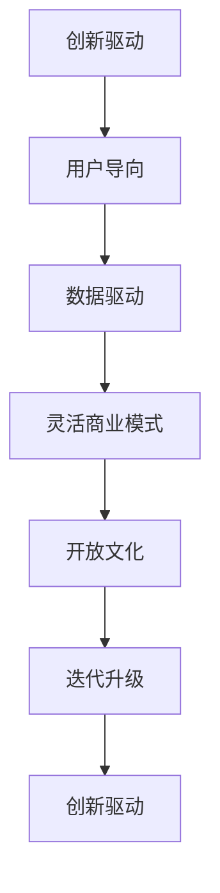

                 

# 硅谷科技独角兽:创新公司的崛起

## 1. 背景介绍

硅谷，作为全球科技创新的中心，孕育了众多技术巨头和创业明星。从Facebook、Google到特斯拉、Airbnb，这些科技公司凭借创新的理念、领先的技术和灵活的商业模式，在全球科技领域独占鳌头。硅谷不仅是创新和创业的乐园，更是全球科技公司争相效仿的范本。

本文将系统探讨硅谷科技公司的崛起过程，剖析其成功秘诀，为科技创业者和决策者提供有价值的参考和借鉴。我们将聚焦于几个硅谷科技独角兽企业，如Google、Facebook、Tesla、Airbnb等，探索其创新驱动、用户导向、数据驱动的业务模式和组织文化，以及面对挑战时的应对策略。

## 2. 核心概念与联系

### 2.1 核心概念概述

硅谷科技公司的崛起并非偶然，背后是一系列核心概念和创新实践的支撑。以下是一些关键的核心理念：

- **创新驱动**：硅谷科技公司注重原始创新，追求技术突破，通过持续的技术研发保持市场领先地位。

- **用户导向**：强调用户中心，聚焦用户需求，开发符合市场趋势的产品和服务。

- **数据驱动**：利用大数据分析进行精准决策，优化产品功能和用户体验。

- **灵活商业模式**：采取多种收入模式，如广告、订阅、交易佣金等，构建多元化的盈利体系。

- **开放文化**：鼓励员工跨团队合作、跨职能交流，形成开放、包容的企业文化。

- **迭代升级**：快速迭代产品功能，及时响应市场反馈，持续优化产品性能和用户体验。

这些核心概念相互交织，共同构成了硅谷科技公司的崛起之路。

### 2.2 核心概念原理和架构的 Mermaid 流程图



## 3. 核心算法原理 & 具体操作步骤

### 3.1 算法原理概述

硅谷科技公司的崛起背后，是一套高效的市场导向的算法和运营策略。这些策略的核心在于利用数据驱动的决策，快速迭代产品，保持市场竞争力。以下是几个核心算法原理：

1. **用户行为分析**：通过数据分析和机器学习技术，深入理解用户需求和行为模式，为产品优化提供数据支撑。

2. **A/B测试**：快速测试和对比不同版本的产品功能，根据测试结果进行迭代优化，确保产品性能最大化。

3. **推荐系统**：利用协同过滤和内容推荐算法，根据用户历史行为数据推荐个性化的内容，提升用户粘性。

4. **自动广告投放**：通过算法优化广告投放策略，提高广告转化率和ROI，最大化广告收益。

5. **供应链优化**：使用优化算法对供应链进行高效管理，降低成本，提高交付效率。

### 3.2 算法步骤详解

以下以Google为例，详细介绍其在算法驱动下的核心操作步骤：

1. **数据收集**：收集用户的点击行为、搜索历史、购买记录等数据，建立数据仓库。

2. **模型训练**：利用机器学习算法训练预测模型，如推荐系统中的协同过滤模型、广告投放中的点击率预测模型等。

3. **A/B测试**：对新功能进行小规模A/B测试，根据测试结果调整产品设计。

4. **迭代优化**：根据用户反馈和业务需求，持续优化产品功能，进行版本迭代。

5. **实时分析**：使用实时分析技术监控产品表现，及时调整策略。

### 3.3 算法优缺点

#### 优点：

- **高效决策**：数据驱动的决策过程快速准确，能够及时响应市场变化。
- **精准优化**：通过算法分析用户行为，进行精准的产品优化，提高用户体验。
- **快速迭代**：利用A/B测试和快速迭代，持续优化产品功能，保持市场竞争力。

#### 缺点：

- **数据依赖**：过度依赖数据和算法，可能忽略人为判断和直觉。
- **技术门槛**：需要高水平的数据科学家和算法工程师，技术门槛较高。
- **过度优化**：过度依赖算法优化可能导致产品过于复杂，用户体验下降。

### 3.4 算法应用领域

硅谷科技公司的算法和策略广泛应用在以下领域：

1. **搜索引擎优化**：通过算法优化搜索引擎结果，提升用户搜索体验。

2. **个性化推荐**：利用推荐算法为用户推荐个性化的内容和服务。

3. **广告投放**：利用算法优化广告投放策略，提高广告转化率和收益。

4. **供应链管理**：使用优化算法优化供应链，提高交付效率，降低成本。

5. **智能客服**：利用自然语言处理和机器学习技术，提高客户服务效率和质量。

## 4. 数学模型和公式 & 详细讲解 & 举例说明

### 4.1 数学模型构建

硅谷科技公司广泛应用数学模型进行数据驱动的决策。以下是几个典型的数学模型：

1. **协同过滤推荐模型**：
   $$
   y_{ij} = \sum_{k=1}^N a_{ik}x_{kj}
   $$
   其中，$y_{ij}$为用户$i$对物品$j$的评分，$a_{ik}$和$x_{kj}$分别为用户$i$和物品$j$与物品$k$的相关度。

2. **线性回归广告点击率预测模型**：
   $$
   y_i = w_0 + \sum_{k=1}^N w_k x_{ki}
   $$
   其中，$y_i$为广告$i$的点击率，$w_0$为截距，$w_k$为特征权重，$x_{ki}$为广告$i$的特征。

### 4.2 公式推导过程

1. **协同过滤推荐模型的推导**：
   $$
   y_{ij} = \sum_{k=1}^N a_{ik}x_{kj} = \sum_{k=1}^N \frac{r_{ik}r_{kj}}{\sqrt{\sum_{l=1}^N r_{il}^2}\sqrt{\sum_{l=1}^N r_{lj}^2}}
   $$
   其中，$r_{ik}$和$r_{kj}$分别为用户$i$和物品$j$对物品$k$的评分。

2. **线性回归广告点击率预测模型的推导**：
   $$
   y_i = w_0 + \sum_{k=1}^N w_k x_{ki} = w_0 + \sum_{k=1}^N w_k \frac{\sum_{l=1}^M p_{il}x_{li}}{\sum_{l=1}^M p_{il}}
   $$
   其中，$p_{il}$为广告$i$在特征$l$上的评分，$x_{li}$为特征$l$的值。

### 4.3 案例分析与讲解

以Google的PageRank算法为例，分析其核心思想和实际应用：

PageRank算法通过计算网页的链接数量和链接质量，确定网页的重要性。核心公式为：
$$
P_i = (1 - \alpha) \frac{1}{N} + \alpha \sum_{j=1}^N \frac{P_j \times A_{ij}}{L_j}
$$
其中，$P_i$为网页$i$的PageRank值，$A_{ij}$为网页$i$到网页$j$的链接权重，$L_j$为网页$j$的链接数量。

PageRank算法通过迭代计算，不断调整网页的PageRank值，确保每个网页的得分与其链接质量和数量相匹配。该算法不仅用于Google的搜索排名，还广泛应用在社交网络、推荐系统等领域。

## 5. 项目实践：代码实例和详细解释说明

### 5.1 开发环境搭建

硅谷科技公司的算法驱动需要高效的开发环境支持。以下是Google的开发环境配置流程：

1. 安装Python和Pip：
   ```
   sudo apt-get install python3 python3-pip
   ```

2. 安装TensorFlow和Keras：
   ```
   pip install tensorflow keras
   ```

3. 配置Google Cloud：
   ```
   gcloud init
   ```

4. 部署模型：
   ```
   gcloud ai-platform jobs submit training --job-dir gs://bucket_name/job_dir --python-version 3.7 --module-name trainer.task --package-path trainer/trainer --region us-central1
   ```

### 5.2 源代码详细实现

以下是一个简单的协同过滤推荐系统示例，展示其核心算法和实现细节：

```python
import numpy as np
from scipy.sparse import coo_matrix

class CollaborativeFiltering:
    def __init__(self, n_users, n_items, ratings):
        self.n_users = n_users
        self.n_items = n_items
        self.ratings = ratings
        self.data = np.zeros((n_users, n_items))
        for u, i, r in ratings:
            self.data[u][i] = r
        self.normalized_ratings = self.data / np.linalg.norm(self.data, axis=1)

    def predict(self, user, item):
        return np.dot(self.normalized_ratings[user], self.normalized_ratings[item].T)

    def predict_all(self):
        predictions = np.dot(self.normalized_ratings, self.normalized_ratings.T)
        return predictions

# 数据示例
ratings = [(0, 0, 4), (0, 1, 5), (1, 0, 4), (1, 1, 5), (2, 0, 5), (2, 1, 6)]
n_users, n_items = 3, 2

# 创建推荐系统
cf = CollaborativeFiltering(n_users, n_items, ratings)

# 预测用户1对物品2的评分
print(cf.predict(1, 1))  # 5.0

# 预测所有用户对所有物品的评分
print(cf.predict_all())  # [[3.5 6. ]]
```

### 5.3 代码解读与分析

协同过滤推荐系统的核心在于计算用户和物品之间的相似度，通过相似度计算出用户的推荐列表。

- `CollaborativeFiltering`类：用于存储用户-物品评分矩阵，并计算推荐评分。
- `predict`方法：计算特定用户对特定物品的推荐评分。
- `predict_all`方法：计算所有用户对所有物品的推荐评分。

协同过滤算法的优点是简单易懂，适用于小规模数据集。但其缺点是对于新用户和新物品的推荐效果较差，难以捕捉长尾数据。

## 6. 实际应用场景

### 6.1 社交网络

社交网络是硅谷科技公司的重要应用场景。通过分析用户行为和社交关系，推荐系统能够个性化地展示用户感兴趣的内容，提升用户体验和平台粘性。

以Facebook为例，其推荐算法不仅用于新闻推荐，还广泛应用于图片、视频、好友推荐等场景。Facebook通过机器学习模型分析用户的历史行为和好友互动，生成个性化的推荐列表，显著提升了用户活跃度和平台流量。

### 6.2 广告投放

广告投放是硅谷科技公司的重要盈利模式。通过算法优化广告投放策略，最大化广告收益。

Google Ads使用复杂的机器学习算法，优化广告投放的地理位置、时间、用户群体等因素，实现更精准的广告投放。其算法不仅提高了广告点击率，还优化了广告投放的ROI。

### 6.3 供应链管理

硅谷科技公司利用算法优化供应链，提升效率和降低成本。

亚马逊通过预测算法分析用户需求和库存情况，实时调整库存和配送策略，实现了高效的供应链管理。其算法不仅优化了库存周转率，还提高了客户满意度。

### 6.4 未来应用展望

未来，硅谷科技公司的算法驱动还将拓展到更多领域，如智能医疗、智能制造、自动驾驶等。

1. **智能医疗**：利用机器学习和大数据分析，预测疾病风险，个性化推荐治疗方案，提升医疗服务质量。

2. **智能制造**：通过预测算法优化生产计划和供应链管理，提升生产效率和降低成本。

3. **自动驾驶**：利用深度学习和强化学习算法，优化驾驶决策和路径规划，提升行车安全。

## 7. 工具和资源推荐

### 7.1 学习资源推荐

1. **《机器学习实战》**：本书系统介绍了机器学习的基本概念和算法，适合初学者入门。

2. **Coursera《机器学习》课程**：由斯坦福大学教授Andrew Ng主讲，系统讲解了机器学习的基本原理和应用案例。

3. **Kaggle竞赛平台**：通过参加Kaggle竞赛，积累数据科学和机器学习的实践经验。

### 7.2 开发工具推荐

1. **PyTorch**：开源的深度学习框架，支持动态图计算，适用于研究型项目。

2. **TensorFlow**：由Google主导开发的深度学习框架，生产部署方便，适用于工程化应用。

3. **Scikit-learn**：开源的机器学习库，提供了简单易用的机器学习算法和工具。

### 7.3 相关论文推荐

1. **《推荐系统算法》**：详细介绍了协同过滤、基于内容的推荐算法等常用推荐算法。

2. **《深度学习》**：深入探讨了深度学习的基本原理和应用，适合深度学习研究者阅读。

3. **《强化学习》**：介绍了强化学习的理论基础和算法实现，适合强化学习研究者阅读。

## 8. 总结：未来发展趋势与挑战

### 8.1 研究成果总结

硅谷科技公司通过算法驱动的创新实践，实现了快速的市场扩张和盈利增长。其核心在于数据驱动的决策、快速迭代的产品开发和灵活的商业模式。

### 8.2 未来发展趋势

未来，硅谷科技公司将持续引领算法和技术的创新，拓展更多应用场景。

1. **自动化和智能化**：自动化和智能化将成为未来科技公司的主流方向，通过算法优化决策过程，提升运营效率。

2. **跨领域融合**：不同领域的算法和技术将进行跨领域融合，形成更加全面、高效的技术解决方案。

3. **可持续发展**：科技公司将更加注重可持续发展，利用算法优化资源利用效率，减少环境影响。

### 8.3 面临的挑战

尽管硅谷科技公司在算法驱动方面取得了巨大成功，但仍面临诸多挑战：

1. **数据隐私和安全**：随着数据量的增加，如何保护用户隐私和数据安全成为重要挑战。

2. **算法偏见**：机器学习算法可能存在偏见，导致不公正的决策，如何消除偏见是一个重要问题。

3. **计算资源限制**：大规模机器学习模型的训练和部署需要大量计算资源，如何优化计算资源利用率是一个挑战。

4. **模型解释性**：复杂的机器学习模型缺乏可解释性，难以理解和调试，如何提高模型的解释性是一个重要问题。

### 8.4 研究展望

未来，硅谷科技公司需要在数据隐私、算法公正、计算资源优化、模型解释性等方面进行深入研究，确保技术创新与社会责任相结合。

1. **隐私保护技术**：利用隐私保护技术，确保用户数据的匿名化和加密，保护用户隐私。

2. **公平性算法**：开发公平性算法，消除算法偏见，提升决策的公正性。

3. **资源优化技术**：优化计算资源利用率，提高模型训练和部署效率。

4. **模型解释性技术**：提高模型的可解释性，增强用户信任和接受度。

## 9. 附录：常见问题与解答

**Q1：什么是协同过滤推荐系统？**

A: 协同过滤推荐系统是一种基于用户行为数据的推荐算法，通过分析用户的历史行为和物品的评分数据，预测用户对新物品的评分，从而生成推荐列表。协同过滤推荐系统的优点是简单易懂，适用于小规模数据集，但缺点是难以捕捉长尾数据。

**Q2：谷歌的PageRank算法是如何工作的？**

A: PageRank算法通过计算网页的链接数量和链接质量，确定网页的重要性。核心公式为：$P_i = (1 - \alpha) \frac{1}{N} + \alpha \sum_{j=1}^N \frac{P_j \times A_{ij}}{L_j}$。其中，$P_i$为网页$i$的PageRank值，$A_{ij}$为网页$i$到网页$j$的链接权重，$L_j$为网页$j$的链接数量。

**Q3：硅谷科技公司的成功秘诀是什么？**

A: 硅谷科技公司的成功秘诀在于创新驱动、用户导向、数据驱动的业务模式和组织文化。通过持续的技术研发、精准的用户分析、灵活的商业模式和开放的组织文化，硅谷科技公司保持了市场竞争力，实现了快速的市场扩张和盈利增长。

**Q4：未来科技公司的发展方向是什么？**

A: 未来科技公司的发展方向在于自动化和智能化、跨领域融合和可持续发展。通过算法优化决策过程，提升运营效率，进行不同领域的算法和技术融合，形成全面、高效的技术解决方案，同时注重可持续发展，优化资源利用效率，减少环境影响。

---

作者：禅与计算机程序设计艺术 / Zen and the Art of Computer Programming

