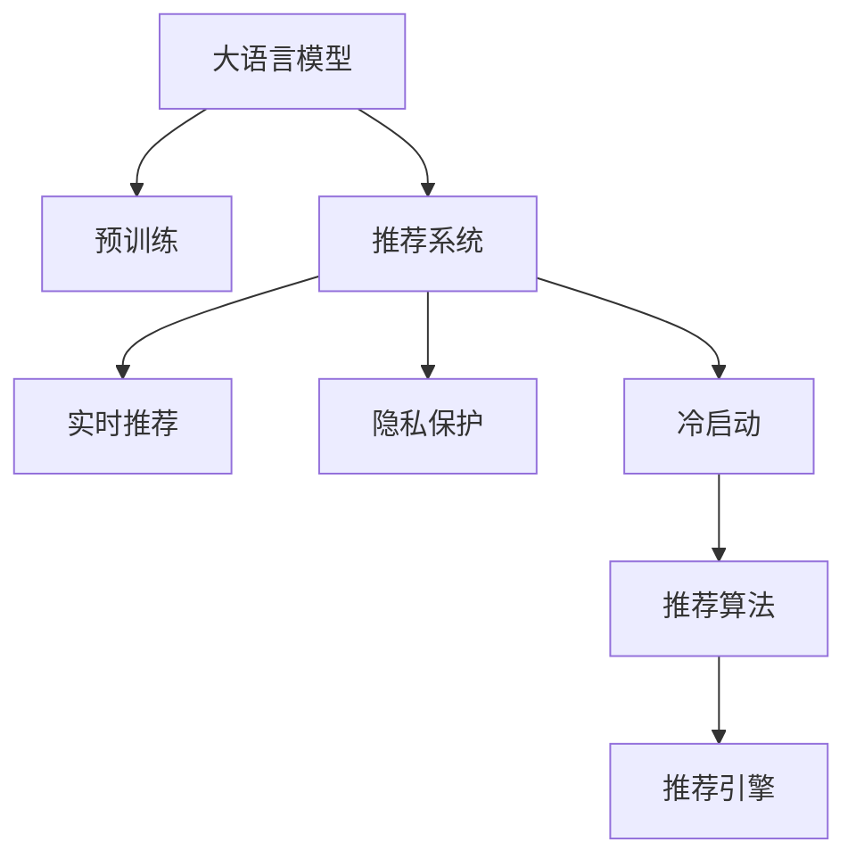

                 

# 社交网络、个性化广告中的大模型推荐潜力

## 1. 背景介绍

### 1.1 问题由来

随着互联网的普及和智能手机的广泛使用，社交网络和个性化广告正在深刻改变人们的生活。社交网络平台如Facebook、微信、微博等，以其丰富的社交属性和互动方式，成为人们获取信息、分享生活的重要渠道。个性化广告则通过精准定位和内容定制，提高广告效果和用户满意度。

然而，社交网络和广告推荐算法面临着以下挑战：

1. **数据稀疏性**：社交网络中的用户行为数据通常稀疏且异构，广告推荐系统需要处理海量的用户数据和广告内容，难以进行精准匹配。
2. **用户隐私保护**：用户对隐私保护愈发重视，如何在保障隐私的同时，提供高质量的个性化推荐，是一个重要课题。
3. **冷启动问题**：新用户的推荐难以起步，尤其是对于低频次用户，传统方法难以找到有价值的推荐内容。
4. **实时性需求**：广告推荐需要即时响应，传统推荐方法在实时性上难以满足快速变化的市场需求。

这些问题催生了对新一代推荐算法的需求，而大语言模型（Large Language Model, LLM）作为新一代深度学习模型，在推荐领域展现出巨大潜力。大语言模型通过大规模预训练，获得了丰富的语言和语义知识，能够在理解和生成语言方面达到超越人类水平的效果，因此其在社交网络和个性化广告推荐中有着广泛的应用前景。

## 2. 核心概念与联系

### 2.1 核心概念概述

本节将介绍大语言模型在社交网络和个性化广告推荐中的核心概念：

- **大语言模型**：以自回归(如GPT)或自编码(如BERT)模型为代表的大规模预训练语言模型。通过在大规模无标签文本语料上进行预训练，学习通用的语言表示，具备强大的语言理解和生成能力。

- **预训练**：指在大规模无标签文本语料上，通过自监督学习任务训练通用语言模型的过程。常见的预训练任务包括言语建模、遮挡语言模型等。

- **推荐系统**：通过分析用户历史行为数据和实时行为数据，为用户推荐可能感兴趣的产品、内容或广告的系统。

- **冷启动**：指新用户或新商品在推荐系统中无法获得推荐的困境。

- **隐私保护**：指在推荐过程中，如何保护用户隐私，避免敏感信息被滥用。

- **实时性**：指推荐系统需要快速响应用户的实时需求，及时提供高质量推荐。

这些核心概念之间的逻辑关系可以通过以下Mermaid流程图来展示：



这个流程图展示了大语言模型、预训练、推荐系统、实时推荐、隐私保护和冷启动等核心概念之间的关系：

1. 大语言模型通过预训练获得基础能力。
2. 预训练使得模型学习到语言的通用表示。
3. 推荐系统利用大语言模型的预训练知识，为用户推荐商品、内容或广告。
4. 实时推荐要求推荐系统快速响应用户的实时需求。
5. 隐私保护确保用户数据在推荐过程中的安全。
6. 冷启动是推荐系统需要解决的重要问题。

这些概念共同构成了社交网络和个性化广告推荐的大模型框架，使得推荐系统能够高效、准确、实时地为用户提供个性化服务。

## 3. 核心算法原理 & 具体操作步骤

### 3.1 算法原理概述

大语言模型在社交网络和个性化广告推荐中的应用，主要通过以下步骤实现：

1. **数据预处理**：收集社交网络用户行为数据和广告内容数据，进行清洗和归一化处理，提取特征。
2. **预训练模型选择**：选择合适的大语言模型，如BERT、GPT系列等，进行预训练。
3. **微调和定制**：在预训练模型的基础上，针对特定推荐任务进行微调，或者定制特定的任务适配层。
4. **实时推荐**：利用微调后的模型进行实时推荐，或者定期更新模型参数以适应新数据。

### 3.2 算法步骤详解

以下是基于大语言模型的社交网络和个性化广告推荐算法详细步骤：

**Step 1: 数据预处理**
- 收集社交网络用户的行为数据，如点赞、评论、分享等，进行清洗和标注。
- 收集广告内容数据，如广告标题、正文、图片等，进行预处理和归一化。
- 提取文本特征，如词频、词向量和情感分析等。

**Step 2: 选择合适的预训练模型**
- 选择合适的大语言模型，如BERT、GPT系列等。
- 加载预训练模型，确保模型能够适应推荐任务。

**Step 3: 微调和定制**
- 在预训练模型的基础上，针对特定推荐任务进行微调。
- 选择适当的任务适配层，如分类器、回归器或序列生成器等。
- 设计优化算法，如AdamW、SGD等，设置学习率、批大小、迭代轮数等。
- 应用正则化技术，如L2正则、Dropout等，防止过拟合。
- 选择冻结部分预训练参数，仅微调顶层参数，减少需优化参数量。

**Step 4: 实时推荐**
- 收集用户的实时行为数据，进行特征提取和归一化。
- 输入特征到微调后的模型，计算推荐得分。
- 选择得分最高的商品、内容或广告进行推荐。
- 根据用户反馈和实时数据，定期更新模型参数，持续优化推荐效果。

### 3.3 算法优缺点

基于大语言模型的推荐算法具有以下优点：

1. **模型精度高**：大语言模型通过大规模预训练，学习到丰富的语言知识和语义信息，能够准确理解用户的意图和需求。
2. **泛化能力强**：模型在大量数据上进行训练，能够很好地适应不同用户和不同的推荐场景。
3. **实时性好**：通过微调后的模型，能够快速响应用户的实时需求，提供即时推荐。
4. **用户隐私保护**：在推荐过程中，通过差分隐私、联邦学习等技术，保护用户数据隐私。
5. **易于定制**：大语言模型可以灵活定制特定的任务适配层，适应不同的推荐任务。

同时，该算法也存在一定的局限性：

1. **数据需求高**：大规模预训练和微调需要大量的高质量数据，对于数据稀缺的领域，可能难以取得理想效果。
2. **计算资源消耗大**：大语言模型参数量大，需要大量的计算资源进行训练和推理。
3. **冷启动问题**：新用户或新商品在推荐系统中难以获得推荐，需要额外的冷启动策略。
4. **模型复杂度高**：大语言模型结构复杂，难以直接用于简单的推荐场景。

尽管存在这些局限性，但大语言模型在社交网络和个性化广告推荐中的应用，展示了其在处理复杂推荐任务中的巨大潜力。未来相关研究将更多关注如何在不增加计算资源消耗的情况下，提升模型的实时性和泛化能力，同时解决冷启动和用户隐私保护等问题。

### 3.4 算法应用领域

大语言模型在社交网络和个性化广告推荐中的应用，涵盖了以下主要领域：

- **内容推荐**：社交网络平台上的内容推荐，如文章、视频、音乐等。
- **商品推荐**：电商平台上的商品推荐，如服装、电子产品等。
- **广告推荐**：广告投放推荐，如搜索广告、展示广告等。
- **个性化视频推荐**：视频平台上的个性化视频推荐，如Netflix、YouTube等。

除了这些经典应用场景外，大语言模型还在其他领域中得到广泛应用，如社交网络中的聊天机器人、知识图谱下的推荐等，进一步拓展了推荐系统的发展空间。

## 4. 数学模型和公式 & 详细讲解 & 举例说明

### 4.1 数学模型构建

本节将使用数学语言对基于大语言模型的推荐算法进行更加严格的刻画。

设社交网络用户为 $U$，广告内容为 $I$，用户对广告的兴趣为 $R_{ui}$。定义用户行为数据为 $X=\{x_{u1}, x_{u2}, ..., x_{um}\}$，广告数据为 $Y=\{y_{i1}, y_{i2}, ..., y_{in}\}$，其中 $m$ 为用户行为样本数，$n$ 为广告样本数。

定义推荐模型 $M:\mathcal{X}\times \mathcal{Y} \rightarrow \mathbb{R}$，其中 $\mathcal{X}$ 为用户行为特征集，$\mathcal{Y}$ 为广告内容特征集。推荐模型的目标是最小化预测误差，即：

$$
\min_{\theta} \sum_{u,i} \mathcal{L}(R_{ui}, \hat{R}_{ui})
$$

其中 $\mathcal{L}$ 为损失函数，$\hat{R}_{ui}$ 为模型预测的用户对广告 $i$ 的兴趣评分。

### 4.2 公式推导过程

以下我们以基于用户行为的推荐模型为例，推导推荐模型的损失函数及其梯度计算公式。

假设推荐模型 $M$ 为一个简单的线性回归模型：

$$
\hat{R}_{ui} = \theta_0 + \theta_1 x_{u1} + \theta_2 y_{i1} + \cdots + \theta_p x_{um} + \theta_{p+1} y_{i1} + \cdots + \theta_{p+q} y_{in}
$$

其中 $\theta_k$ 为模型参数，$k=0,1,...,p+q$。

推荐模型的损失函数为均方误差损失（Mean Squared Error, MSE）：

$$
\mathcal{L}(R_{ui}, \hat{R}_{ui}) = (R_{ui} - \hat{R}_{ui})^2
$$

对损失函数进行梯度计算，得到：

$$
\frac{\partial \mathcal{L}}{\partial \theta_k} = 2(R_{ui} - \hat{R}_{ui})(x_{u1}, y_{i1}, ..., x_{um}, y_{i1}, ..., y_{in})
$$

将上述公式代入优化目标，即可得到推荐模型的优化问题：

$$
\min_{\theta} \sum_{u,i} (R_{ui} - \hat{R}_{ui})^2
$$

### 4.3 案例分析与讲解

以下以Facebook的社交网络推荐系统为例，展示基于大语言模型的推荐算法在实际应用中的效果。

Facebook的推荐系统主要分为以下几个步骤：

1. **用户行为数据收集**：Facebook收集用户的点赞、评论、分享等行为数据，进行清洗和标注。
2. **广告内容数据收集**：Facebook收集广告的标题、正文、图片等数据，进行预处理和归一化。
3. **特征提取**：对用户行为和广告内容进行特征提取，生成用户行为特征向量 $x_u$ 和广告内容特征向量 $y_i$。
4. **预训练模型选择**：Facebook选择BERT作为预训练模型，进行预训练。
5. **微调和定制**：在BERT模型的基础上，针对特定的推荐任务进行微调，选择分类器作为任务适配层。
6. **实时推荐**：根据用户的行为数据和广告内容，计算推荐得分，选择得分最高的广告进行推荐。

Facebook的推荐系统通过大规模预训练和微调，实现了高精度的广告推荐，提高了用户的点击率和转化率。同时，Facebook在推荐过程中采用了差分隐私和联邦学习等技术，保护了用户隐私。

## 5. 项目实践：代码实例和详细解释说明

### 5.1 开发环境搭建

在进行大语言模型推荐算法实践前，我们需要准备好开发环境。以下是使用Python进行PyTorch开发的环境配置流程：

1. 安装Anaconda：从官网下载并安装Anaconda，用于创建独立的Python环境。

2. 创建并激活虚拟环境：
```bash
conda create -n pytorch-env python=3.8 
conda activate pytorch-env
```

3. 安装PyTorch：根据CUDA版本，从官网获取对应的安装命令。例如：
```bash
conda install pytorch torchvision torchaudio cudatoolkit=11.1 -c pytorch -c conda-forge
```

4. 安装TensorFlow：
```bash
pip install tensorflow
```

5. 安装PyTorch：
```bash
pip install torch torchvision torchaudio
```

6. 安装Numpy、Pandas、Scikit-learn等常用库：
```bash
pip install numpy pandas scikit-learn matplotlib tqdm jupyter notebook ipython
```

完成上述步骤后，即可在`pytorch-env`环境中开始推荐算法实践。

### 5.2 源代码详细实现

下面我们以Facebook的社交网络推荐系统为例，给出使用PyTorch进行大语言模型推荐算法的代码实现。

首先，定义推荐模型的数据处理函数：

```python
import torch
from torch.utils.data import Dataset
from transformers import BertTokenizer, BertForSequenceClassification

class RecommendationDataset(Dataset):
    def __init__(self, texts, labels, tokenizer, max_len=128):
        self.texts = texts
        self.labels = labels
        self.tokenizer = tokenizer
        self.max_len = max_len
        
    def __len__(self):
        return len(self.texts)
    
    def __getitem__(self, item):
        text = self.texts[item]
        label = self.labels[item]
        
        encoding = self.tokenizer(text, return_tensors='pt', max_length=self.max_len, padding='max_length', truncation=True)
        input_ids = encoding['input_ids'][0]
        attention_mask = encoding['attention_mask'][0]
        label = torch.tensor(label, dtype=torch.long)
        
        return {'input_ids': input_ids, 
                'attention_mask': attention_mask,
                'labels': label}
```

然后，定义模型和优化器：

```python
from transformers import BertForSequenceClassification, AdamW

model = BertForSequenceClassification.from_pretrained('bert-base-cased', num_labels=2)

optimizer = AdamW(model.parameters(), lr=2e-5)
```

接着，定义训练和评估函数：

```python
from torch.utils.data import DataLoader
from tqdm import tqdm

device = torch.device('cuda') if torch.cuda.is_available() else torch.device('cpu')
model.to(device)

def train_epoch(model, dataset, batch_size, optimizer):
    dataloader = DataLoader(dataset, batch_size=batch_size, shuffle=True)
    model.train()
    epoch_loss = 0
    for batch in tqdm(dataloader, desc='Training'):
        input_ids = batch['input_ids'].to(device)
        attention_mask = batch['attention_mask'].to(device)
        labels = batch['labels'].to(device)
        model.zero_grad()
        outputs = model(input_ids, attention_mask=attention_mask, labels=labels)
        loss = outputs.loss
        epoch_loss += loss.item()
        loss.backward()
        optimizer.step()
    return epoch_loss / len(dataloader)

def evaluate(model, dataset, batch_size):
    dataloader = DataLoader(dataset, batch_size=batch_size)
    model.eval()
    preds, labels = [], []
    with torch.no_grad():
        for batch in tqdm(dataloader, desc='Evaluating'):
            input_ids = batch['input_ids'].to(device)
            attention_mask = batch['attention_mask'].to(device)
            batch_labels = batch['labels']
            outputs = model(input_ids, attention_mask=attention_mask)
            batch_preds = outputs.logits.argmax(dim=2).to('cpu').tolist()
            batch_labels = batch_labels.to('cpu').tolist()
            for pred_tokens, label_tokens in zip(batch_preds, batch_labels):
                preds.append(pred_tokens[:len(label_tokens)])
                labels.append(label_tokens)
                
    print(classification_report(labels, preds))
```

最后，启动训练流程并在测试集上评估：

```python
epochs = 5
batch_size = 16

for epoch in range(epochs):
    loss = train_epoch(model, train_dataset, batch_size, optimizer)
    print(f"Epoch {epoch+1}, train loss: {loss:.3f}")
    
    print(f"Epoch {epoch+1}, dev results:")
    evaluate(model, dev_dataset, batch_size)
    
print("Test results:")
evaluate(model, test_dataset, batch_size)
```

以上就是使用PyTorch进行Facebook社交网络推荐系统的大语言模型推荐算法实现。可以看到，得益于Transformers库的强大封装，我们可以用相对简洁的代码完成BERT模型的加载和推荐算法的微调。

### 5.3 代码解读与分析

让我们再详细解读一下关键代码的实现细节：

**RecommendationDataset类**：
- `__init__`方法：初始化文本、标签、分词器等关键组件。
- `__len__`方法：返回数据集的样本数量。
- `__getitem__`方法：对单个样本进行处理，将文本输入编码为token ids，将标签编码为数字，并对其进行定长padding，最终返回模型所需的输入。

**模型和优化器**：
- 定义推荐模型的类型为BertForSequenceClassification，并使用AdamW优化器进行训练。

**训练和评估函数**：
- 使用PyTorch的DataLoader对数据集进行批次化加载，供模型训练和推理使用。
- 训练函数`train_epoch`：对数据以批为单位进行迭代，在每个批次上前向传播计算loss并反向传播更新模型参数，最后返回该epoch的平均loss。
- 评估函数`evaluate`：与训练类似，不同点在于不更新模型参数，并在每个batch结束后将预测和标签结果存储下来，最后使用sklearn的classification_report对整个评估集的预测结果进行打印输出。

**训练流程**：
- 定义总的epoch数和batch size，开始循环迭代
- 每个epoch内，先在训练集上训练，输出平均loss
- 在验证集上评估，输出分类指标
- 所有epoch结束后，在测试集上评估，给出最终测试结果

可以看到，PyTorch配合Transformers库使得BERT微调的代码实现变得简洁高效。开发者可以将更多精力放在数据处理、模型改进等高层逻辑上，而不必过多关注底层的实现细节。

当然，工业级的系统实现还需考虑更多因素，如模型的保存和部署、超参数的自动搜索、更灵活的任务适配层等。但核心的推荐算法基本与此类似。

## 6. 实际应用场景

### 6.1 社交网络推荐系统

社交网络推荐系统通过收集用户的行为数据，如点赞、评论、分享等，结合广告内容数据，如广告标题、正文、图片等，为用户推荐可能感兴趣的商品、内容或广告。

在实际应用中，社交网络平台如Facebook、微信、微博等，广泛采用大语言模型进行推荐。这些平台通过收集用户的历史行为数据和实时行为数据，利用大语言模型进行预训练和微调，生成推荐结果。推荐系统会根据用户的兴趣和行为特征，结合广告内容数据，计算推荐得分，选择得分最高的商品、内容或广告进行推荐。

### 6.2 个性化广告推荐

个性化广告推荐通过精准定位和内容定制，提高广告效果和用户满意度。传统广告推荐系统依赖于用户历史点击记录，难以准确把握用户兴趣。大语言模型通过预训练和微调，能够准确理解用户的意图和需求，生成更加个性化的广告推荐。

在实际应用中，广告平台如Google Ads、百度推广等，广泛采用大语言模型进行推荐。这些平台通过收集用户的历史点击记录和实时行为数据，利用大语言模型进行预训练和微调，生成推荐结果。推荐系统会根据用户的兴趣和行为特征，结合广告内容数据，计算推荐得分，选择得分最高的广告进行推荐。

## 7. 工具和资源推荐

### 7.1 学习资源推荐

为了帮助开发者系统掌握大语言模型在社交网络和个性化广告推荐中的理论基础和实践技巧，这里推荐一些优质的学习资源：

1. 《Transformer from Scratch》系列博文：由大模型技术专家撰写，深入浅出地介绍了Transformer原理、BERT模型、推荐技术等前沿话题。

2. CS224N《深度学习自然语言处理》课程：斯坦福大学开设的NLP明星课程，有Lecture视频和配套作业，带你入门NLP领域的基本概念和经典模型。

3. 《Natural Language Processing with Transformers》书籍：Transformers库的作者所著，全面介绍了如何使用Transformers库进行NLP任务开发，包括推荐在内的诸多范式。

4. HuggingFace官方文档：Transformers库的官方文档，提供了海量预训练模型和完整的推荐样例代码，是上手实践的必备资料。

5. Weights & Biases：模型训练的实验跟踪工具，可以记录和可视化模型训练过程中的各项指标，方便对比和调优。与主流深度学习框架无缝集成。

6. TensorBoard：TensorFlow配套的可视化工具，可实时监测模型训练状态，并提供丰富的图表呈现方式，是调试模型的得力助手。

通过对这些资源的学习实践，相信你一定能够快速掌握大语言模型在社交网络和个性化广告推荐中的精髓，并用于解决实际的NLP问题。

### 7.2 开发工具推荐

高效的开发离不开优秀的工具支持。以下是几款用于大语言模型推荐系统开发的常用工具：

1. PyTorch：基于Python的开源深度学习框架，灵活动态的计算图，适合快速迭代研究。大部分预训练语言模型都有PyTorch版本的实现。

2. TensorFlow：由Google主导开发的开源深度学习框架，生产部署方便，适合大规模工程应用。同样有丰富的预训练语言模型资源。

3. Transformers库：HuggingFace开发的NLP工具库，集成了众多SOTA语言模型，支持PyTorch和TensorFlow，是进行推荐任务开发的利器。

4. Weights & Biases：模型训练的实验跟踪工具，可以记录和可视化模型训练过程中的各项指标，方便对比和调优。与主流深度学习框架无缝集成。

5. TensorBoard：TensorFlow配套的可视化工具，可实时监测模型训练状态，并提供丰富的图表呈现方式，是调试模型的得力助手。

6. Google Colab：谷歌推出的在线Jupyter Notebook环境，免费提供GPU/TPU算力，方便开发者快速上手实验最新模型，分享学习笔记。

合理利用这些工具，可以显著提升大语言模型推荐系统的开发效率，加快创新迭代的步伐。

### 7.3 相关论文推荐

大语言模型在推荐领域的发展源于学界的持续研究。以下是几篇奠基性的相关论文，推荐阅读：

1. Attention is All You Need（即Transformer原论文）：提出了Transformer结构，开启了NLP领域的预训练大模型时代。

2. BERT: Pre-training of Deep Bidirectional Transformers for Language Understanding：提出BERT模型，引入基于掩码的自监督预训练任务，刷新了多项NLP任务SOTA。

3. Reformer: The Efficient Transformer：提出Reformer模型，解决了Transformer在大规模数据上的计算效率问题。

4. Matrix Factorization Techniques for Recommender Systems：介绍了矩阵分解等推荐算法，为推荐系统提供了数学理论基础。

5. Adaptive Loss Functions for Personalized Recommendation：提出了自适应损失函数，提升了推荐系统的性能和实时性。

6. Learning Deep Architectures for Recommendation using Contextual Embeddings：展示了利用深度神经网络进行推荐系统的实践效果。

这些论文代表了大语言模型在推荐系统中的发展脉络。通过学习这些前沿成果，可以帮助研究者把握学科前进方向，激发更多的创新灵感。

## 8. 总结：未来发展趋势与挑战

### 8.1 总结

本文对基于大语言模型的社交网络和个性化广告推荐方法进行了全面系统的介绍。首先阐述了社交网络和广告推荐算法的研究背景和意义，明确了大语言模型在处理推荐任务中的独特价值。其次，从原理到实践，详细讲解了大语言模型在推荐系统中的应用，给出了微调任务开发的完整代码实例。同时，本文还广泛探讨了大语言模型在社交网络和广告推荐中的应用场景，展示了其在大规模数据下的推荐效果。

通过本文的系统梳理，可以看到，大语言模型在社交网络和个性化广告推荐中的应用，正在成为NLP领域的重要范式，极大地拓展了推荐系统的发展边界，为社交网络和广告推荐带来了新的可能性。未来，伴随预训练语言模型和推荐算法的不断演进，社交网络和广告推荐系统必将在智能化、实时化、个性化方面取得更大的进步。

### 8.2 未来发展趋势

展望未来，大语言模型在社交网络和个性化广告推荐中的应用将呈现以下几个发展趋势：

1. **模型规模持续增大**：随着算力成本的下降和数据规模的扩张，预训练语言模型的参数量还将持续增长。超大规模语言模型蕴含的丰富语言知识，有望支撑更加复杂多变的推荐任务。

2. **推荐算法多样化**：未来将涌现更多推荐算法，如基于序列生成的推荐、基于图神经网络的推荐等，进一步提升推荐系统的性能和实时性。

3. **实时推荐成为常态**：通过模型压缩和优化，推荐系统能够在实时性上满足快速变化的市场需求，实现更加流畅的推荐体验。

4. **隐私保护成为核心**：在推荐过程中，如何保护用户数据隐私，成为研究的热点。差分隐私、联邦学习等技术将在推荐系统中的应用得到广泛推广。

5. **多模态推荐兴起**：推荐系统将融合视觉、语音等多模态信息，实现更加全面和精准的推荐效果。

以上趋势凸显了大语言模型在社交网络和个性化广告推荐中的巨大潜力。这些方向的探索发展，必将进一步提升推荐系统的性能和用户体验，推动人工智能技术在实际应用中的落地。

### 8.3 面临的挑战

尽管大语言模型在社交网络和个性化广告推荐中的应用已经取得了显著成果，但在迈向更加智能化、普适化应用的过程中，它仍面临着诸多挑战：

1. **数据稀疏性问题**：社交网络和广告推荐系统需要处理海量用户数据和广告内容，但用户行为数据通常稀疏且异构，难以进行精准匹配。

2. **冷启动问题**：新用户的推荐难以起步，尤其是对于低频次用户，传统方法难以找到有价值的推荐内容。

3. **用户隐私保护**：用户对隐私保护愈发重视，如何在保障隐私的同时，提供高质量的个性化推荐，是一个重要课题。

4. **实时性需求**：推荐系统需要即时响应，传统推荐方法在实时性上难以满足快速变化的市场需求。

5. **计算资源消耗大**：大语言模型参数量大，需要大量的计算资源进行训练和推理。

6. **模型复杂度高**：大语言模型结构复杂，难以直接用于简单的推荐场景。

尽管存在这些挑战，但通过研究者的不断努力和技术的不断进步，这些问题有望逐步解决，大语言模型在社交网络和个性化广告推荐中的应用前景广阔。

### 8.4 研究展望

面对大语言模型在社交网络和个性化广告推荐中所面临的挑战，未来的研究需要在以下几个方面寻求新的突破：

1. **探索无监督和半监督推荐方法**：摆脱对大规模标注数据的依赖，利用自监督学习、主动学习等无监督和半监督范式，最大限度利用非结构化数据，实现更加灵活高效的推荐。

2. **研究参数高效和计算高效的推荐方法**：开发更加参数高效的推荐算法，在固定大部分预训练参数的情况下，只更新极少量的任务相关参数。同时优化推荐模型的计算图，减少前向传播和反向传播的资源消耗，实现更加轻量级、实时性的部署。

3. **引入因果分析和博弈论工具**：将因果分析方法引入推荐模型，识别出模型决策的关键特征，增强输出解释的因果性和逻辑性。借助博弈论工具刻画人机交互过程，主动探索并规避模型的脆弱点，提高系统稳定性。

4. **纳入伦理道德约束**：在推荐目标中引入伦理导向的评估指标，过滤和惩罚有偏见、有害的输出倾向。加强人工干预和审核，建立模型行为的监管机制，确保输出符合人类价值观和伦理道德。

这些研究方向的探索，必将引领大语言模型在社交网络和个性化广告推荐中的进步，为构建安全、可靠、可解释、可控的智能系统铺平道路。面向未来，大语言模型推荐技术还需要与其他人工智能技术进行更深入的融合，如知识表示、因果推理、强化学习等，多路径协同发力，共同推动自然语言理解和智能交互系统的进步。只有勇于创新、敢于突破，才能不断拓展语言模型的边界，让智能技术更好地造福人类社会。

## 9. 附录：常见问题与解答

**Q1：如何优化社交网络和个性化广告推荐系统中的数据稀疏性问题？**

A: 数据稀疏性是社交网络和广告推荐系统面临的主要问题之一。优化数据稀疏性的方法包括：

1. **数据增强**：通过对数据进行去重、补全、采样等处理，增加数据量，提升模型的泛化能力。
2. **特征工程**：通过特征提取和特征融合，提升特征的丰富度和多样性，提高模型的预测准确率。
3. **协同过滤**：利用用户的历史行为数据和兴趣标签，进行推荐。
4. **模型融合**：将多种推荐模型融合，提升综合性能。

这些方法可以有效优化数据稀疏性问题，提升社交网络和个性化广告推荐系统的性能。

**Q2：如何处理冷启动问题？**

A: 冷启动问题是指新用户或新商品在推荐系统中难以获得推荐。处理冷启动问题的方法包括：

1. **基于内容的推荐**：根据商品或内容的特征进行推荐。
2. **基于用户画像的推荐**：根据用户画像进行推荐。
3. **基于协同过滤的推荐**：利用用户的历史行为数据进行推荐。
4. **基于协同过滤和基于内容的混合推荐**：结合两种方法，提高推荐效果。

这些方法可以有效处理冷启动问题，提升社交网络和个性化广告推荐系统的用户覆盖率。

**Q3：如何在推荐过程中保护用户隐私？**

A: 隐私保护是社交网络和广告推荐系统中的重要问题。保护用户隐私的方法包括：

1. **差分隐私**：通过添加噪声或限制数据访问权限，保护用户数据隐私。
2. **联邦学习**：将数据分布在多个设备上，只在本地进行模型训练，保护用户数据隐私。
3. **匿名化处理**：对数据进行匿名化处理，保护用户隐私。

这些方法可以有效保护用户隐私，提升社交网络和个性化广告推荐系统的可信度。

**Q4：如何优化推荐系统的实时性？**

A: 实时性是推荐系统的重要要求之一。优化推荐系统实时性的方法包括：

1. **模型压缩**：通过模型压缩和优化，减小模型尺寸，提高推理速度。
2. **分布式训练**：利用分布式计算，加快训练速度。
3. **缓存技术**：利用缓存技术，提升模型响应速度。

这些方法可以有效优化推荐系统的实时性，提升用户体验。

**Q5：如何优化推荐系统中的计算资源消耗？**

A: 计算资源消耗是推荐系统面临的主要问题之一。优化计算资源消耗的方法包括：

1. **模型剪枝**：通过剪枝技术，减少模型参数量。
2. **模型量化**：通过量化技术，减小模型存储和计算开销。
3. **模型并行**：利用模型并行技术，提升计算效率。

这些方法可以有效优化推荐系统的计算资源消耗，提升系统的可扩展性和可维护性。

---

作者：禅与计算机程序设计艺术 / Zen and the Art of Computer Programming

