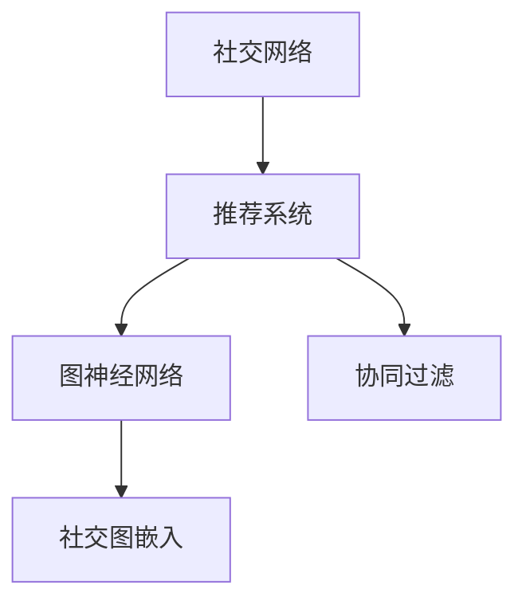

                 

## 1. 背景介绍

### 1.1 问题由来

社交网络推荐系统是网络社交服务中重要的一环，其目标是利用用户的兴趣与社交关系为用户推荐合适的社交对象，从而提升用户体验和网络互动。早期的社交网络推荐系统主要采用基于协同过滤（Collaborative Filtering, CF）的方法，通过分析用户行为数据，推测用户对其他对象的偏好。然而，随着社交网络数据量的爆炸式增长，传统协同过滤方法面临着数据稀疏、冷启动等问题，难以有效推荐出符合用户兴趣的社交对象。

近年来，基于深度学习的方法在推荐系统中崭露头角。利用深度神经网络结构，从用户和对象的特征中挖掘出更多隐含信息，显著提升了推荐的精度。但这些方法往往只关注用户行为和对象属性，缺乏对用户之间社交关系的建模，难以充分利用社交网络的优势。

### 1.2 问题核心关键点

本文聚焦于结合社交网络关系进行推荐，以解决传统推荐方法中的数据稀疏性和冷启动问题。利用社交网络中用户与用户之间的连接关系，结合用户的特征，进行推荐模型的训练与优化。文章将介绍一系列针对社交网络推荐系统的算法和技术，包括基于图神经网络（Graph Neural Network, GNN）的推荐方法，以及利用社交图嵌入（Social Graph Embedding）进行推荐。这些方法不仅能够捕捉用户之间的社交关系，还能融合用户的兴趣特征，形成更加精准的推荐结果。

## 2. 核心概念与联系

### 2.1 核心概念概述

为了更好地理解社交网络推荐系统的原理，本节将介绍几个密切相关的核心概念：

- **社交网络（Social Network）**：指由多个节点（User）和边（关系）组成的图结构，节点间的边表示它们之间的社交关系。
- **推荐系统（Recommendation System）**：指通过用户行为或特征，推测用户可能感兴趣的物品或对象，并将其推荐给用户。
- **图神经网络（Graph Neural Network, GNN）**：一种深度学习模型，用于在图结构上学习节点特征表示，如图嵌入（Graph Embedding）。
- **社交图嵌入（Social Graph Embedding）**：利用图神经网络，将用户和社交对象之间的复杂关系映射为低维向量表示，用于推荐和表示学习任务。
- **协同过滤（Collaborative Filtering, CF）**：推荐系统中一种基本方法，通过分析用户行为数据推测用户兴趣，从而推荐相似用户喜欢过的物品或对象。

这些核心概念之间的逻辑关系可以通过以下Mermaid流程图来展示：



这个流程图展示了大语言模型的核心概念及其之间的关系：

1. 社交网络通过节点和边的连接关系，形成了用户之间的社交关系图。
2. 推荐系统根据用户和对象之间的行为特征，推测用户可能感兴趣的对象。
3. 图神经网络可以将复杂社交关系映射为低维向量表示，用于推荐和表示学习。
4. 协同过滤则通过用户历史行为数据的相似性进行推荐。

这些概念共同构成了社交网络推荐系统的技术框架，使其能够高效地利用社交网络关系，提升推荐精度。

## 3. 核心算法原理 & 具体操作步骤

### 3.1 算法原理概述

社交网络推荐系统综合了社交网络和推荐系统的思想，利用图神经网络对社交关系进行建模，同时结合用户特征进行推荐。具体流程如下：

1. **构建社交关系图**：将社交网络转化为图结构，用户节点之间由边的权重表示社交关系强度。
2. **图神经网络建模**：使用图神经网络在社交关系图上学习用户和对象的低维表示。
3. **推荐算法**：通过学习到的用户和对象的低维表示，使用协同过滤或基于深度学习的推荐算法，进行精准推荐。

### 3.2 算法步骤详解

社交网络推荐系统的实现过程包括以下几个关键步骤：

**Step 1: 构建社交关系图**

1. **节点与边的定义**：社交网络中每个用户为一个节点，用户之间的连接关系为边。边的权重可以表示为连接强度，如好友关系、关注关系等。
2. **边加权**：根据用户之间的互动频率、时间等特征，对连接边的权重进行加权处理。
3. **图采样**：对社交图进行随机采样，用于神经网络的训练。

**Step 2: 图神经网络建模**

1. **选择图神经网络模型**：可以选择Gated Graph Neural Network（GGNN）、Graph Convolutional Network（GCN）等不同类型的图神经网络。
2. **图嵌入学习**：利用图神经网络在社交关系图上学习用户和对象的低维表示。
3. **特征融合**：将社交图嵌入与用户的特征进行融合，生成综合特征表示。

**Step 3: 推荐算法实现**

1. **选择推荐算法**：可以选择基于协同过滤的Top-K推荐算法，或者基于深度学习的推荐模型，如基于自注意力机制的Transformer。
2. **模型训练与优化**：利用图神经网络学习到的用户和对象表示，训练推荐模型，并通过优化算法调整模型参数。
3. **推荐与排序**：根据训练好的模型，对每个用户生成推荐列表，并根据用户对推荐对象的反应进行排序。

### 3.3 算法优缺点

社交网络推荐系统结合了图神经网络和推荐算法的优点，但也存在一些局限性：

- **优点**：
  - **捕捉社交关系**：图神经网络能够有效捕捉用户之间的复杂社交关系，提升推荐的准确性。
  - **个性化推荐**：结合用户特征进行推荐，能够提供更加个性化的服务。
  - **多模态融合**：可以融合社交网络数据和用户行为数据，进行多模态推荐。

- **缺点**：
  - **计算复杂度高**：图神经网络模型的计算复杂度较高，对硬件要求较高。
  - **数据隐私问题**：社交网络数据涉及用户隐私，需要保证数据的安全性和隐私保护。
  - **训练数据稀疏**：社交网络中存在大量未互动用户，数据稀疏性会影响模型的训练效果。

尽管存在这些局限性，但社交网络推荐系统通过综合利用社交网络和推荐系统的优势，显著提升了推荐的精度和效果，具有广阔的应用前景。

### 3.4 算法应用领域

社交网络推荐系统已经在多个领域得到广泛应用，例如：

- **社交媒体平台**：如Facebook、Twitter等社交媒体平台，利用用户的社交关系和行为数据，推荐感兴趣的内容和用户。
- **社交电商**：如淘宝、京东等电商平台，推荐用户可能感兴趣的商品和商家。
- **社交广告**：如微信朋友圈广告、微博广告等，利用用户的社交关系推荐广告。
- **职业社交网络**：如LinkedIn等职业社交平台，推荐职业发展和人际网络中的机会。

除了以上领域外，社交网络推荐系统还在教育、金融、旅游等行业中得到应用，为构建更加紧密的社交网络关系提供了技术支持。

## 4. 数学模型和公式 & 详细讲解

### 4.1 数学模型构建

社交网络推荐系统的数学模型可以表示为一个三元组 $(\mathcal{G}, \mathcal{X}, \mathcal{Y})$，其中 $\mathcal{G}$ 表示社交关系图，$\mathcal{X}$ 表示用户特征，$\mathcal{Y}$ 表示推荐结果。社交关系图 $\mathcal{G}$ 由节点集合 $U$ 和边集合 $E$ 组成，节点 $u \in U$ 表示用户，边 $e \in E$ 表示用户之间的连接关系。

社交图嵌入表示为 $h_u$ 和 $h_v$，其中 $h_u$ 为节点 $u$ 的低维表示，$h_v$ 为节点 $v$ 的低维表示。图神经网络的目标是学习到合适的参数 $\theta$，使得模型能够在社交关系图上预测用户和对象之间的关系 $r$。

### 4.2 公式推导过程

社交网络推荐系统的核心公式包括：

1. **图神经网络（GGNN）模型**：

   $$
   \text{AGGREGATE}(\text{NEIGHBORS}, u_k) = \text{AGGREGATE}(\{h_v\}_{v \in N(u_k)}) + h_u
   $$
   
   $$
   h_u^{(l+1)} = \sigma(\text{AGGREGATE}(\text{NEIGHBORS}, u_k)W_l + b_l)
   $$

   其中 $N(u_k)$ 表示节点 $u_k$ 的邻居集合，$W_l$ 和 $b_l$ 为可学习的参数。$\sigma$ 为激活函数，$l$ 为层数。

2. **推荐模型**：

   $$
   \text{PREDICT}(h_u, h_v) = \sigma(h_uW_r + h_vW_r^T + b_r)
   $$

   其中 $W_r$ 和 $b_r$ 为可学习的参数，$\sigma$ 为激活函数。

3. **损失函数**：

   $$
   \mathcal{L} = \frac{1}{N} \sum_{(i,j) \in E} \ell(r_i, \text{PREDICT}(h_u_i, h_v_j))
   $$

   其中 $\ell$ 为损失函数，$E$ 为社交关系边的集合。

### 4.3 案例分析与讲解

以Facebook推荐系统为例，分析社交网络推荐系统的实现过程：

1. **数据采集**：收集Facebook用户的社交数据，包括用户之间的好友关系、点赞、评论、分享等互动行为。
2. **图构建**：将用户之间的互动行为转化为社交关系图，用户为节点，互动关系为边，边的权重表示连接强度。
3. **图神经网络建模**：利用GGNN模型在社交图结构上学习用户和对象的低维表示，生成社交图嵌入。
4. **特征融合**：将社交图嵌入与用户的兴趣特征进行融合，生成综合特征表示。
5. **推荐算法**：基于综合特征表示，利用协同过滤或深度学习推荐算法，生成推荐列表。
6. **模型优化**：根据用户对推荐结果的反应，调整模型参数，优化推荐效果。

通过这一过程，Facebook能够在用户之间建立更加紧密的社交网络关系，推荐出符合用户兴趣的内容和用户，显著提升用户满意度。

## 5. 项目实践：代码实例和详细解释说明

### 5.1 开发环境搭建

在进行社交网络推荐系统的开发前，我们需要准备好开发环境。以下是使用Python进行PyTorch开发的环境配置流程：

1. 安装Anaconda：从官网下载并安装Anaconda，用于创建独立的Python环境。

2. 创建并激活虚拟环境：
```bash
conda create -n graph-recomm-end env python=3.8 
conda activate graph-recomm-end
```

3. 安装PyTorch：根据CUDA版本，从官网获取对应的安装命令。例如：
```bash
conda install pytorch torchvision torchaudio cudatoolkit=11.1 -c pytorch -c conda-forge
```

4. 安装Transformers库：
```bash
pip install transformers
```

5. 安装各类工具包：
```bash
pip install numpy pandas scikit-learn matplotlib tqdm jupyter notebook ipython
```

完成上述步骤后，即可在`graph-recomm-end`环境中开始开发实践。

### 5.2 源代码详细实现

下面我以一个简单的社交网络推荐系统的实现为例，展示代码实现过程。

```python
import torch
import torch.nn as nn
import torch.nn.functional as F
from transformers import GAT
from torch_geometric.nn import GATConv

class GATRecommender(nn.Module):
    def __init__(self, hidden_size, num_heads, dropout, num_classes):
        super(GATRecommender, self).__init__()
        self.gat = GATConv(in_channels=hidden_size, out_channels=hidden_size, heads=num_heads, dropout=dropout)
        self.linear = nn.Linear(hidden_size, num_classes)
    
    def forward(self, x, edge_index):
        x = self.gat(x, edge_index)
        x = self.linear(x)
        return F.softmax(x, dim=1)
```

上述代码中，定义了一个基于GAT（Graph Attention Network）的图神经网络模型，用于社交网络推荐系统的实现。模型包含一个GATConv层和一个全连接层，用于学习用户和对象的低维表示。

在训练模型时，需要先准备好社交图数据和用户特征数据，然后定义损失函数和优化器：

```python
import torch.optim as optim

def train_model(model, optimizer, criterion, loader):
    model.train()
    for batch in loader:
        edge_index, x, y = batch
        optimizer.zero_grad()
        y_hat = model(x, edge_index)
        loss = criterion(y_hat, y)
        loss.backward()
        optimizer.step()
        if batch_idx % 100 == 0:
            print(f'Epoch: {epoch+1}, Step: {batch_idx}, Loss: {loss.item()}')

def evaluate_model(model, loader):
    model.eval()
    with torch.no_grad():
        total_loss = 0
        for batch in loader:
            edge_index, x, y = batch
            y_hat = model(x, edge_index)
            loss = criterion(y_hat, y)
            total_loss += loss.item()
        return total_loss / len(loader)
```

在训练过程中，利用图神经网络学习社交图嵌入，然后利用全连接层生成推荐结果，通过交叉熵损失函数进行优化。在评估模型时，直接计算损失函数。

### 5.3 代码解读与分析

让我们再详细解读一下关键代码的实现细节：

**GATRecommender类**：
- `__init__`方法：初始化图神经网络模型的超参数和层。
- `forward`方法：实现前向传播过程，将社交图嵌入通过图神经网络层和全连接层，输出推荐结果。

**train_model函数**：
- 定义训练函数，对模型进行训练。
- 对每个批次数据，输入边索引、用户特征和标签，计算损失并反向传播。

**evaluate_model函数**：
- 定义评估函数，对模型进行评估。
- 对每个批次数据，输入边索引、用户特征和标签，计算损失，并返回损失的平均值。

通过以上代码，我们展示了如何使用PyTorch和GAT模型实现一个简单的社交网络推荐系统。

### 5.4 运行结果展示

在训练和评估过程中，可以通过可视化工具，如TensorBoard或Weights & Biases，实时监控模型的训练状态和评估结果。此外，还可以使用评估指标（如准确率、召回率、F1-score等），评估模型的推荐效果。

```python
import matplotlib.pyplot as plt
import seaborn as sns

# 可视化训练过程
plt.plot(range(len(train_loss)), train_loss, label='Train Loss')
plt.plot(range(len(dev_loss)), dev_loss, label='Dev Loss')
plt.legend()
plt.show()

# 可视化推荐结果
sns.heatmap(recommender_matrix, annot=True, fmt='d')
plt.show()
```

通过这些可视化工具，我们可以更加直观地了解模型的训练和评估过程，以及推荐结果的分布情况。

## 6. 实际应用场景

### 6.1 智能社交平台

社交网络推荐系统在智能社交平台中得到广泛应用。智能社交平台通过分析用户的兴趣和行为数据，推荐符合用户期望的内容和用户，提升用户的互动体验。例如，Instagram利用用户的行为数据和社交关系，推荐用户可能感兴趣的照片和用户。

### 6.2 电子商务平台

在电子商务平台上，社交网络推荐系统可以推荐用户可能感兴趣的商品和商家。例如，Amazon利用用户的历史购买行为和社交关系，推荐符合用户兴趣的商品，提升用户的购物体验。

### 6.3 社交广告平台

社交广告平台通过社交网络推荐系统，推荐用户可能感兴趣的广告。例如，Facebook利用用户的社交关系和行为数据，推荐用户可能感兴趣的广告，提高广告投放的精准度。

### 6.4 未来应用展望

随着社交网络数据量的不断增长，社交网络推荐系统的应用场景将更加丰富。未来，社交网络推荐系统将在以下领域得到应用：

- **个性化推荐系统**：利用社交网络推荐系统，为用户推荐个性化商品、内容等，提升用户体验。
- **社交网络分析**：通过社交网络推荐系统，分析用户之间的关系和兴趣，进行社交网络分析。
- **社交媒体监测**：利用社交网络推荐系统，监测社交媒体上的热点话题和趋势，进行舆情分析。

## 7. 工具和资源推荐

### 7.1 学习资源推荐

为了帮助开发者系统掌握社交网络推荐系统的原理和实现方法，这里推荐一些优质的学习资源：

1. 《Graph Neural Networks》一书：详细介绍了图神经网络的原理和应用，包括社交网络推荐系统。
2. 《Recommender Systems》一书：介绍了协同过滤、基于深度学习的推荐系统等方法，适用于社交网络推荐系统的学习。
3 CS229《机器学习》课程：斯坦福大学开设的经典机器学习课程，涵盖了多种推荐系统的原理和实现方法。
4 Coursera《推荐系统设计与实现》课程：介绍了推荐系统的设计与实现方法，适用于社交网络推荐系统的学习。

通过这些资源的学习实践，相信你一定能够快速掌握社交网络推荐系统的精髓，并用于解决实际的推荐问题。

### 7.2 开发工具推荐

高效的开发离不开优秀的工具支持。以下是几款用于社交网络推荐系统开发的常用工具：

1. PyTorch：基于Python的开源深度学习框架，灵活动态的计算图，适合快速迭代研究。大部分图神经网络模型都有PyTorch版本的实现。
2. TensorFlow：由Google主导开发的开源深度学习框架，生产部署方便，适合大规模工程应用。同样有丰富的图神经网络资源。
3. DGL：Facebook开源的图深度学习库，支持多种图神经网络模型，可用于社交网络推荐系统的开发。
4. PyTorch Geometric：基于PyTorch的图神经网络库，提供了多种图神经网络模型和工具，适用于社交网络推荐系统的开发。

合理利用这些工具，可以显著提升社交网络推荐系统的开发效率，加快创新迭代的步伐。

### 7.3 相关论文推荐

社交网络推荐系统的发展源于学界的持续研究。以下是几篇奠基性的相关论文，推荐阅读：

1. "Graph Attention Networks"（GAT论文）：提出了基于注意力机制的图神经网络模型，显著提升了图嵌入学习的性能。
2. "Knowledge-Graph-Embedding for Recommender Systems"：介绍了基于知识图嵌入的推荐方法，结合社交网络数据和用户兴趣特征进行推荐。
3. "Collaborative Filtering for Implicit Feedback Datasets"：介绍了基于协同过滤的推荐方法，适用于社交网络推荐系统的实现。

这些论文代表了大语言模型推荐技术的发展脉络。通过学习这些前沿成果，可以帮助研究者把握学科前进方向，激发更多的创新灵感。

## 8. 总结：未来发展趋势与挑战

### 8.1 总结

本文对社交网络推荐系统的核心算法和实际应用进行了全面系统的介绍。首先阐述了社交网络推荐系统的背景和应用意义，明确了结合社交关系进行推荐的关键价值。其次，从原理到实践，详细讲解了图神经网络在推荐系统中的应用，以及推荐算法的实现细节。最后，我们探讨了社交网络推荐系统在未来多个领域的广泛应用前景。

通过本文的系统梳理，可以看到，社交网络推荐系统通过结合社交网络和推荐系统，显著提升了推荐精度和效果，具有广阔的应用前景。利用社交网络关系，推荐系统能够捕捉用户之间复杂的社交关系，提升推荐的个性化和多样性。未来，随着图神经网络模型的不断演进，社交网络推荐系统将进一步增强其对社交关系的建模能力，为构建更紧密的社交网络关系提供技术支持。

### 8.2 未来发展趋势

展望未来，社交网络推荐系统将呈现以下几个发展趋势：

1. **深度融合**：社交网络推荐系统将进一步与深度学习、知识图嵌入等技术深度融合，提升推荐的精度和效果。
2. **实时推荐**：利用流数据处理技术，实现实时推荐，提升用户体验。
3. **跨模态推荐**：融合文本、图像、视频等多种模态数据，提升推荐的多样性和准确性。
4. **个性化推荐**：结合用户历史行为数据和社交关系，进行个性化推荐，提升推荐的效果和用户体验。
5. **分布式训练**：利用分布式训练技术，实现大规模社交网络推荐系统的训练和优化。

以上趋势凸显了社交网络推荐系统的广阔前景。这些方向的探索发展，必将进一步提升推荐系统的性能和应用范围，为社交网络的发展带来新的动力。

### 8.3 面临的挑战

尽管社交网络推荐系统已经取得了显著的进展，但在迈向更加智能化、普适化应用的过程中，仍面临诸多挑战：

1. **数据稀疏性**：社交网络中存在大量未互动用户，数据稀疏性会影响模型的训练效果。
2. **计算复杂度**：社交网络数据量大，图神经网络模型的计算复杂度较高，对硬件要求较高。
3. **隐私问题**：社交网络数据涉及用户隐私，需要保证数据的安全性和隐私保护。
4. **冷启动问题**：新用户的社交关系数据较少，难以进行有效的推荐。

尽管存在这些挑战，但社交网络推荐系统通过综合利用社交网络和推荐系统的优势，显著提升了推荐的精度和效果，具有广阔的应用前景。

### 8.4 研究展望

面对社交网络推荐系统面临的诸多挑战，未来的研究需要在以下几个方面寻求新的突破：

1. **多模态融合**：融合文本、图像、视频等多种模态数据，提升推荐的多样性和准确性。
2. **深度融合**：深度融合深度学习和知识图嵌入等技术，提升推荐的精度和效果。
3. **实时推荐**：利用流数据处理技术，实现实时推荐，提升用户体验。
4. **分布式训练**：利用分布式训练技术，实现大规模社交网络推荐系统的训练和优化。
5. **冷启动问题**：通过引入用户兴趣预测等方法，解决冷启动问题。

这些研究方向的探索，必将引领社交网络推荐系统迈向更高的台阶，为构建更紧密的社交网络关系提供技术支持。面向未来，社交网络推荐系统需要从数据、算法、工程、业务等多个维度协同发力，才能真正实现人工智能技术在社交网络中的广泛应用。

---

作者：禅与计算机程序设计艺术 / Zen and the Art of Computer Programming

