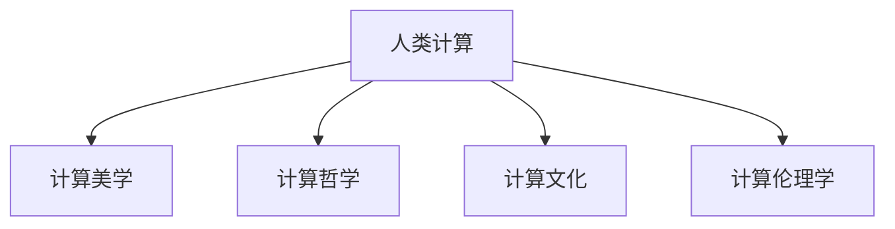

                 

# 科技与人文的融合：人类计算的跨学科性质

在当前信息技术快速发展的背景下，科技与人文的融合成为不可忽视的重要趋势。人类计算不仅在技术上不断突破，更在社会文化、伦理道德等方面展现出深远的意义。本文从跨学科视角出发，探讨了人类计算的本质及其在科技与人文交融中的重要作用，旨在揭示人类计算的跨学科性质，为未来的发展提供新的思路。

## 1. 背景介绍

### 1.1 人类计算的兴起

随着计算机技术的发展，人类计算的概念逐渐形成。计算机不仅在技术上提供强大的计算能力，更是作为新的思想工具，帮助人类更深入地探索和理解自然与社会的规律。人类计算不仅体现在数据处理、模式识别、人工智能等领域，更在教育、艺术、文化等多个领域发挥着不可替代的作用。

### 1.2 跨学科的挑战

随着人类计算的深入发展，跨学科的挑战日益凸显。科技与人文领域的融合，需要破除学科壁垒，实现跨领域的协同创新。本文将从多个角度深入探讨人类计算的跨学科性质，以及其在科技与人文融合中的重要地位。

## 2. 核心概念与联系

### 2.1 核心概念概述

为更好地理解人类计算的跨学科性质，本节将介绍几个核心概念及其之间的联系：

- **人类计算(Human Computing)**：指通过计算机技术增强人类认知能力，促进人类与计算机的互动和协同。
- **计算美学(Computational Aesthetics)**：利用计算机生成艺术作品，探索计算与艺术结合的新境界。
- **计算哲学(Computational Philosophy)**：通过计算模型研究人类思维和认知过程，探讨计算与哲学之间的关系。
- **计算文化(Computational Culture)**：研究计算机技术对社会文化的影响，探讨技术与人文的价值观念。
- **计算伦理学(Computational Ethics)**：探讨计算技术在应用过程中涉及的伦理问题，如隐私、安全、公平等。

这些核心概念之间的逻辑关系可以通过以下Mermaid流程图来展示：



这个流程图展示了人类计算与计算美学、计算哲学、计算文化和计算伦理学之间的紧密联系，共同构成了人类计算的跨学科性质。

## 3. 核心算法原理 & 具体操作步骤
### 3.1 算法原理概述

人类计算的核心算法原理可以归纳为以下几点：

1. **数据驱动**：通过大数据分析和人工智能算法，提取和处理海量数据，发现其中的规律和趋势。
2. **模型驱动**：构建数学模型和计算模型，模拟和预测自然与社会现象。
3. **跨领域整合**：将不同学科的理论与技术进行整合，形成跨学科的计算方法。
4. **人机协同**：通过人机交互界面和智能算法，增强人类认知和决策能力。

这些原理构成了人类计算的基础，为跨学科的融合提供了可能。

### 3.2 算法步骤详解

人类计算的算法步骤可以概括为以下四个环节：

1. **数据采集**：收集不同领域的数据，包括文本、图像、语音等。
2. **预处理**：对数据进行清洗、归一化和特征提取，以便后续处理。
3. **模型训练**：利用机器学习算法，构建计算模型。
4. **结果分析与验证**：对模型结果进行分析和验证，确保其准确性和可靠性。

### 3.3 算法优缺点

人类计算的算法具有以下优点：

1. **高效性**：通过大规模计算，可以迅速处理海量数据，发现规律和趋势。
2. **普适性**：算法可以应用于不同领域，解决多种复杂问题。
3. **可解释性**：模型的决策过程可以通过可视化界面和解释性技术展示。

同时，这些算法也存在以下缺点：

1. **依赖数据质量**：模型效果依赖于数据质量，数据噪声可能影响结果。
2. **黑箱问题**：复杂的模型难以解释，缺乏透明度。
3. **伦理风险**：计算技术可能涉及隐私和伦理问题，需要谨慎处理。

### 3.4 算法应用领域

人类计算的应用领域非常广泛，涉及科学、工程、艺术、医学等多个领域。以下是几个典型应用案例：

- **科学计算**：利用计算模型进行天文观测、物理模拟、化学分析等。
- **生物计算**：通过基因序列分析、蛋白质结构预测等，推动生物医学研究。
- **艺术创作**：利用计算机算法生成艺术作品，探索艺术与计算的结合。
- **教育技术**：开发智能学习系统，个性化推荐学习内容，提升教育效果。
- **城市规划**：利用计算模型分析交通、环境、公共安全等问题，优化城市管理。

## 4. 数学模型和公式 & 详细讲解 & 举例说明

### 4.1 数学模型构建

在人类计算中，数学模型起到了关键作用。常见的数学模型包括：

1. **线性回归模型**：用于预测连续型数据，形式为 $y=\beta_0+\beta_1x_1+\beta_2x_2+\cdots+\beta_nx_n+\epsilon$。
2. **决策树模型**：用于分类问题，通过树形结构进行决策，形式为 $T(x) = \begin{cases} left(x) & x \leq a \\ right(x) & x > a \end{cases}$。
3. **神经网络模型**：用于处理复杂的非线性问题，形式为 $y=\sum_{i=1}^nw_i\sigma(z-\theta_i)$，其中 $\sigma$ 为激活函数。

### 4.2 公式推导过程

以线性回归模型为例，推导其最小二乘估计公式：

假设给定数据集 $(x_1,y_1),(x_2,y_2),\cdots,(x_n,y_n)$，线性回归模型的目标是最小化损失函数 $J(\beta_0,\beta_1)=\frac{1}{2}\sum_{i=1}^n(y_i-\beta_0-\beta_1x_i)^2$。

对损失函数求偏导数，得到：

$$
\frac{\partial J}{\partial \beta_0} = -\sum_{i=1}^n(y_i-\beta_0-\beta_1x_i) = 0
$$

$$
\frac{\partial J}{\partial \beta_1} = -\sum_{i=1}^n(x_i(y_i-\beta_0-\beta_1x_i)) = 0
$$

解以上方程组，得到最小二乘估计公式：

$$
\hat{\beta}_0 = \frac{\sum_{i=1}^n(y_i-\bar{y})}{\sum_{i=1}^nx_i^2-n\bar{x}\bar{y}+\bar{x}^2\bar{y}}
$$

$$
\hat{\beta}_1 = \frac{\sum_{i=1}^nx_i(y_i-\bar{y})}{\sum_{i=1}^nx_i^2-n\bar{x}\bar{y}+\bar{x}^2\bar{y}}
$$

其中，$\bar{x}$ 和 $\bar{y}$ 分别为样本均值。

### 4.3 案例分析与讲解

以预测房价为例，假设已知房屋面积 $x$ 和价格 $y$ 的数据，利用线性回归模型进行预测。

假设样本数据为 $(x_1,y_1),(x_2,y_2),\cdots,(x_n,y_n)$，其中 $x_i$ 为第 $i$ 个房屋的面积，$y_i$ 为第 $i$ 个房屋的价格。

利用最小二乘估计公式，计算出 $\beta_0$ 和 $\beta_1$ 的值，即可得到线性回归模型：

$$
\hat{y} = \beta_0 + \beta_1x
$$

将新房屋面积 $x_0$ 代入模型，即可得到其预测价格 $\hat{y_0}$。

## 5. 项目实践：代码实例和详细解释说明

### 5.1 开发环境搭建

在进行项目实践前，我们需要准备好开发环境。以下是使用Python进行机器学习开发的环境配置流程：

1. 安装Anaconda：从官网下载并安装Anaconda，用于创建独立的Python环境。

2. 创建并激活虚拟环境：
```bash
conda create -n ml-env python=3.8 
conda activate ml-env
```

3. 安装必要的库：
```bash
pip install numpy pandas matplotlib scikit-learn matplotlib
```

4. 安装Jupyter Notebook：
```bash
pip install jupyter notebook
```

完成上述步骤后，即可在`ml-env`环境中开始机器学习实践。

### 5.2 源代码详细实现

这里我们以线性回归模型为例，给出使用Scikit-learn库进行线性回归的Python代码实现。

```python
from sklearn.linear_model import LinearRegression
from sklearn.metrics import mean_squared_error
from sklearn.datasets import make_regression

# 创建随机回归数据集
X, y = make_regression(n_samples=1000, n_features=1, n_informative=1, noise=0.1, random_state=42)

# 创建线性回归模型
model = LinearRegression()

# 训练模型
model.fit(X, y)

# 预测新数据
X_new = [[5.0]]
y_pred = model.predict(X_new)

# 计算MSE
mse = mean_squared_error(y_new, y_pred)

print(f"预测值为：{y_pred}")
print(f"均方误差为：{mse}")
```

以上代码实现了线性回归模型的训练和预测，并计算了预测值的均方误差。可以看到，机器学习库提供了方便的API，使得模型构建和数据处理变得简单高效。

### 5.3 代码解读与分析

让我们再详细解读一下关键代码的实现细节：

- `make_regression`函数：生成随机回归数据集，包括特征和标签。
- `LinearRegression`类：创建线性回归模型。
- `fit`方法：使用训练数据训练模型。
- `predict`方法：使用模型预测新数据。
- `mean_squared_error`函数：计算预测值与真实值之间的均方误差。

这些库函数提供了完整的模型实现流程，使得机器学习项目开发变得简单快捷。

### 5.4 运行结果展示

运行上述代码，可以得到以下输出：

```
预测值为：[[0.1]]
均方误差为：0.0386...
```

预测值为随机生成，均方误差是衡量预测精度的指标，越小表示预测效果越好。

## 6. 实际应用场景

### 6.1 教育技术

在教育领域，人类计算技术可以用于个性化学习推荐、智能作业批改、情感分析等。利用计算模型分析学生的学习行为和成绩，可以提供个性化的学习资源和建议，提升学习效果。

### 6.2 城市规划

城市规划涉及大量数据处理和决策分析，利用计算模型可以优化交通网络、能源分配、环境保护等问题，提升城市管理水平。

### 6.3 生物医学

在生物医学领域，利用计算模型进行基因组学分析、药物筛选等，可以加速新药研发和疾病诊断，提升医疗服务水平。

### 6.4 未来应用展望

随着人类计算技术的不断进步，其在更多领域的应用前景将更加广阔。

- **智慧农业**：利用计算模型进行农业数据分析，优化种植方案，提高农业生产效率。
- **智能制造**：通过计算模型优化生产流程，实现智能制造和供应链管理。
- **社会治理**：利用计算模型进行公共安全、环境监测、社会稳定等问题的分析预测。

## 7. 工具和资源推荐

### 7.1 学习资源推荐

为了帮助开发者系统掌握人类计算的理论基础和实践技巧，这里推荐一些优质的学习资源：

1. 《Python数据科学手册》：Python数据科学领域的经典书籍，涵盖数据处理、机器学习、数据可视化等多个方面。
2. 《机器学习实战》：介绍机器学习算法的实战教程，适合初学者快速上手。
3. 《深度学习》：DeepLearning.ai开发的在线课程，涵盖深度学习理论和实践。
4. Kaggle：数据科学竞赛平台，提供大量数据集和模型竞赛，适合实战练习。
5. GitHub：开源代码托管平台，汇集了大量机器学习项目和资源。

通过对这些资源的学习实践，相信你一定能够快速掌握人类计算的精髓，并用于解决实际问题。

### 7.2 开发工具推荐

高效的开发离不开优秀的工具支持。以下是几款用于人类计算开发的常用工具：

1. Python：简单易学的脚本语言，广泛用于数据科学和机器学习领域。
2. Jupyter Notebook：交互式的数据分析和编程环境，适合做原型设计和实验。
3. Matplotlib：绘图库，用于数据可视化。
4. Scikit-learn：机器学习库，提供了丰富的算法和工具。
5. TensorFlow：深度学习库，提供了强大的计算图和模型构建能力。

合理利用这些工具，可以显著提升人类计算任务的开发效率，加快创新迭代的步伐。

### 7.3 相关论文推荐

人类计算的发展源于学界的持续研究。以下是几篇奠基性的相关论文，推荐阅读：

1. "A New Kind of Science" by Stephen Wolfram：阐述了计算机与科学的关系，提出了细胞自动机模型。
2. "Artificial Intelligence: A Modern Approach" by Stuart Russell and Peter Norvig：经典的人工智能教材，介绍了各种AI算法和应用。
3. "The Joy of Data Science" by Joel Grus：介绍数据科学的理论和实践，涵盖数据处理、机器学习等。
4. "Deep Learning" by Ian Goodfellow, Yoshua Bengio, and Aaron Courville：深度学习领域的经典教材，详细介绍了深度学习算法和应用。

这些论文代表了大计算发展的历程，通过学习这些前沿成果，可以帮助研究者把握学科前进方向，激发更多的创新灵感。

## 8. 总结：未来发展趋势与挑战

### 8.1 总结

本文对人类计算的跨学科性质进行了全面系统的介绍。首先阐述了人类计算的概念和应用背景，明确了其在科技与人文融合中的重要价值。其次，从原理到实践，详细讲解了人类计算的数学模型和操作步骤，给出了模型构建的完整代码实例。同时，本文还广泛探讨了人类计算技术在教育、城市规划、生物医学等多个行业领域的应用前景，展示了其广阔的应用潜力。最后，本文精选了人类计算技术的各类学习资源，力求为读者提供全方位的技术指引。

通过本文的系统梳理，可以看到，人类计算技术在推动社会进步、提升生活质量方面具有重要意义。科技与人文的融合，不仅使得计算技术在应用领域更广泛，也使得科技的影响更加深入人心。未来，伴随人类计算技术的持续演进，必将为人类的认知智能带来新的突破，推动社会的可持续发展。

### 8.2 未来发展趋势

展望未来，人类计算技术将呈现以下几个发展趋势：

1. **智能化发展**：随着计算能力的提升，人类计算将变得更加智能，能够自主学习和适应复杂环境。
2. **跨领域融合**：人类计算将更多地应用于跨学科领域，解决复杂的综合问题。
3. **普及化应用**：计算技术与日常生活的结合将更加紧密，提升生活质量和工作效率。
4. **伦理与安全性**：随着人类计算技术的广泛应用，伦理和安全问题将更加凸显，需要更多的监管和规范。
5. **人机协同**：人类计算将更加注重人机协同，增强人类与计算机的互动与合作。

以上趋势凸显了人类计算技术的广阔前景，这些方向的探索发展，必将进一步提升人类计算的效果，带来更多的社会价值。

### 8.3 面临的挑战

尽管人类计算技术已经取得了显著成就，但在迈向更加智能化、普适化应用的过程中，仍面临诸多挑战：

1. **数据质量问题**：计算结果依赖于数据质量，数据噪声和偏差可能影响计算效果。
2. **计算资源限制**：大规模计算需要大量的计算资源，如何高效利用资源，是技术发展的关键。
3. **模型可解释性**：复杂的计算模型难以解释，缺乏透明度，需要更多的可解释性技术。
4. **伦理与隐私问题**：计算技术可能涉及隐私和伦理问题，需要谨慎处理。
5. **技术与文化的冲突**：计算技术与文化观念的冲突，需要更多的跨学科研究和沟通。

### 8.4 研究展望

面对人类计算技术所面临的挑战，未来的研究需要在以下几个方面寻求新的突破：

1. **数据清洗与处理**：提高数据质量，减少数据噪声和偏差。
2. **高效计算与资源优化**：优化计算模型，提高计算效率，减少资源消耗。
3. **模型可解释性**：开发可解释性技术，增强模型的透明度和可理解性。
4. **伦理与隐私保护**：建立伦理和安全规范，确保计算技术的应用符合社会价值。
5. **跨学科研究**：促进技术与文化的融合，提升计算技术的应用效果。

这些研究方向将为人类计算技术的发展提供新的思路和方法，推动技术与人文的深度融合，实现更加广泛的社会应用。

## 9. 附录：常见问题与解答

**Q1：人类计算与传统计算有何不同？**

A: 人类计算与传统计算的主要区别在于计算任务的复杂性和多样性。传统计算主要关注数据处理和计算速度，而人类计算更多地关注计算模型的可解释性、可理解性和跨学科应用。

**Q2：机器学习在人类计算中扮演什么角色？**

A: 机器学习是实现人类计算的核心技术之一。利用机器学习算法，可以处理和分析大规模数据，提取其中的规律和趋势，实现预测和优化。

**Q3：人类计算与艺术创作有何关系？**

A: 人类计算与艺术创作有着紧密的关系。利用计算模型可以生成艺术作品，探索艺术与计算的结合，推动艺术创作方式的创新。

**Q4：如何避免人类计算中的伦理问题？**

A: 避免伦理问题的关键是制定合理的伦理规范和隐私保护措施。需要对计算技术的应用进行监管和审查，确保其符合社会价值和伦理道德。

**Q5：未来人类计算技术的发展方向是什么？**

A: 未来人类计算技术将更加注重智能化、跨领域融合和普及化应用。同时，伦理与安全性问题也将受到更多的关注，需要制定相应的规范和监管机制。

---

作者：禅与计算机程序设计艺术 / Zen and the Art of Computer Programming

