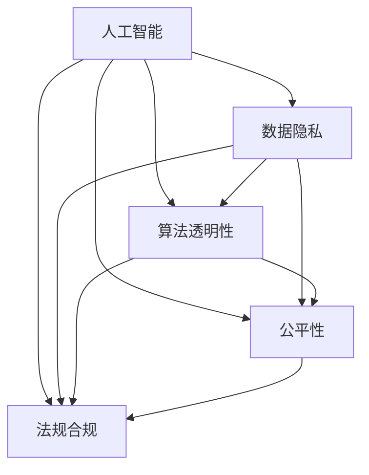

                 

# 科技与伦理的平衡点：人类计算的伦理

> 关键词：人工智能,计算伦理,隐私保护,数据安全,社会责任,法规合规

## 1. 背景介绍

### 1.1 问题由来
随着人工智能（AI）技术的飞速发展，其在医疗、金融、教育、工业等多个领域的广泛应用，极大地提高了生产效率，改变了人们的生活方式。然而，人工智能的快速发展也引发了一系列伦理问题，特别是数据隐私、算法透明性和公平性等方面的挑战，成为亟待解决的社会问题。

### 1.2 问题核心关键点
这些问题主要集中在以下几个方面：
- **数据隐私保护**：如何有效保护用户的个人信息不被泄露。
- **算法透明性**：如何确保AI系统的决策过程可解释、可审查。
- **公平性**：如何避免AI算法中的偏见和歧视。
- **法规合规**：如何确保AI技术的应用符合国家法律法规的要求。

这些问题不仅关系到技术本身，还涉及到社会伦理、法律制度等多个层面，是AI应用过程中不可忽视的关键问题。

## 2. 核心概念与联系

### 2.1 核心概念概述

为更好地理解这些问题，本节将介绍几个密切相关的核心概念：

- **人工智能（AI）**：利用算法、计算机和数据，使机器模仿人类智能的技术。
- **数据隐私**：保护个人数据不被未经授权的访问、收集和使用，以保护个人权益。
- **算法透明性**：确保AI系统的决策过程、参数和规则可解释、可审查，以提高公众信任。
- **公平性**：确保AI系统在决策过程中对所有用户公平，避免因算法偏见导致的歧视。
- **法规合规**：确保AI技术的应用符合国家和地区的法律法规，防止违法行为。

这些核心概念之间的逻辑关系可以通过以下Mermaid流程图来展示：



这个流程图展示了一个AI系统的完整生命周期中需要关注的关键方面：

1. 人工智能技术的应用，与数据隐私、算法透明性、公平性、法规合规等四个方面密切相关。
2. 数据隐私保护是AI系统的基础保障，确保了用户数据的安全。
3. 算法透明性和公平性是确保AI系统公正决策的重要手段。
4. 法规合规是确保AI系统在法律框架内运行的关键条件。

## 3. 核心算法原理 & 具体操作步骤
### 3.1 算法原理概述

为解决上述伦理问题，AI系统的设计和开发需要遵循一系列伦理原则和法规要求。以下是核心算法原理和具体操作步骤的概述：

**步骤1：数据收集与预处理**
- **隐私保护**：在数据收集阶段，确保匿名化、去标识化处理，防止个人信息泄露。
- **数据质量**：确保数据的完整性、准确性和一致性，避免偏见和错误信息。

**步骤2：模型选择与训练**
- **算法透明性**：选择透明的算法模型，如决策树、逻辑回归等，便于理解和审查。
- **公平性**：使用公平性评估工具，检测和纠正算法中的偏见。
- **法规合规**：确保模型训练过程符合国家和地区的法律法规要求。

**步骤3：模型评估与优化**
- **算法透明性**：提供模型输入和输出的可解释性，解释模型的决策过程。
- **公平性**：通过敏感性分析、公平性指标等手段，检测和改进算法中的偏见。
- **法规合规**：定期审查模型，确保其在法律框架内运行，避免违规风险。

**步骤4：模型部署与应用**
- **隐私保护**：在模型部署阶段，确保数据传输和存储的安全性。
- **算法透明性**：提供用户界面，让用户了解模型的决策依据。
- **法规合规**：确保模型在实际应用中遵守相关法律法规。

### 3.2 算法步骤详解

以一个医疗诊断系统为例，展示如何使用AI技术，同时遵守伦理和法律要求。

**步骤1：数据收集与预处理**
- **数据来源**：从医院、诊所等医疗机构获取匿名化患者记录。
- **隐私保护**：对数据进行去标识化处理，确保个人隐私不被泄露。
- **数据质量**：进行数据清洗，去除错误和缺失值，保证数据的一致性。

**步骤2：模型选择与训练**
- **算法选择**：选择决策树模型，易于理解和解释。
- **公平性**：使用敏感性分析工具，检测模型对不同种族、性别等群体的影响。
- **法规合规**：确保模型训练过程遵守医疗数据保护法规，如HIPAA。

**步骤3：模型评估与优化**
- **算法透明性**：提供模型解释工具，解释模型如何做出诊断决策。
- **公平性**：通过交叉验证等手段，检测和修正模型中的偏见。
- **法规合规**：定期审查模型，确保其在医疗应用中符合相关法律法规。

**步骤4：模型部署与应用**
- **隐私保护**：在模型部署时，使用加密传输和存储技术，保护患者数据安全。
- **算法透明性**：在用户界面展示模型的诊断依据，增强用户信任。
- **法规合规**：确保模型在医疗应用中遵守相关法律法规，如医学伦理准则。

### 3.3 算法优缺点

**优点**：
- **提高效率**：AI技术能够自动化处理大量数据，提高诊断和决策效率。
- **增强公平性**：通过算法透明性和公平性分析，减少偏见，提升决策的公正性。
- **法规合规**：遵守相关法律法规，减少法律风险。

**缺点**：
- **隐私风险**：数据处理过程中存在隐私泄露的风险。
- **算法透明性不足**：部分AI算法过于复杂，难以解释和审查。
- **法规差异**：不同国家和地区对AI技术的法规要求不同，需不断调整策略。

### 3.4 算法应用领域

基于上述核心算法原理，AI技术在多个领域的应用需要关注数据隐私、算法透明性、公平性和法规合规。以下是几个典型应用领域的具体实践：

- **医疗诊断**：在诊断系统中，确保数据隐私，提供透明的算法解释，遵守医疗伦理和法规要求。
- **金融风险评估**：在信用评分、贷款审批等金融应用中，保护用户隐私，确保算法透明性，遵守金融法规。
- **教育推荐系统**：在推荐系统中，确保用户数据隐私，提升算法的公平性，遵守教育数据保护法规。
- **工业质量控制**：在质量控制系统中，保护生产数据隐私，确保算法透明性，遵守工业数据保护法规。

## 4. 数学模型和公式 & 详细讲解
### 4.1 数学模型构建

在AI系统的设计和开发中，数学模型是核心组成部分。以一个简单的决策树模型为例，展示其在应用中的构建过程。

假设有一个分类问题，输入特征为 $x_1, x_2, \ldots, x_n$，输出为目标变量 $y$，决策树模型的目标是最小化误分类误差。模型的构建过程如下：

1. **选择根节点**：选择最具区分度的特征作为根节点，如 $x_1$。
2. **划分数据集**：根据 $x_1$ 的取值，将数据集分为两组。
3. **递归构建子树**：对每组数据重复上述过程，构建子树。
4. **剪枝**：通过交叉验证等手段，避免过拟合，选择最优决策树结构。

**公式推导**：
- **损失函数**：误分类误差，如对数损失函数 $L(y,\hat{y}) = -y \log \hat{y} - (1-y) \log (1-\hat{y})$。
- **优化目标**：最小化损失函数，如 $J(\theta) = \frac{1}{N} \sum_{i=1}^N L(y_i, \hat{y}_i)$。
- **决策规则**：根据特征取值，选择最优划分点，如 $x_1 = \theta_0$。

**案例分析**：
- **数据预处理**：对数据进行去标识化处理，保护隐私。
- **模型训练**：选择决策树模型，使用交叉验证等手段检测和修正算法中的偏见。
- **模型评估**：通过敏感性分析等手段，确保模型的公平性和透明性。

### 4.2 公式推导过程

以一个简单的分类问题为例，展示数学模型的推导过程：

假设有一个二分类问题，输入特征为 $x_1, x_2, \ldots, x_n$，输出为目标变量 $y \in \{0, 1\}$。决策树模型的目标是最小化误分类误差，即对数损失函数。

- **损失函数**：
  $$
  L(y,\hat{y}) = -y \log \hat{y} - (1-y) \log (1-\hat{y})
  $$

- **优化目标**：
  $$
  J(\theta) = \frac{1}{N} \sum_{i=1}^N L(y_i, \hat{y}_i)
  $$

- **决策规则**：
  $$
  \hat{y} = \begin{cases} 
  1 & \text{if } x_1 > \theta_0 \\
  0 & \text{otherwise}
  \end{cases}
  $$

通过上述数学模型的构建和推导，可以看出，在AI系统的设计和开发过程中，数据隐私、算法透明性、公平性和法规合规是关键考量因素。

## 5. 项目实践：代码实例和详细解释说明
### 5.1 开发环境搭建

在进行项目实践前，我们需要准备好开发环境。以下是使用Python进行Scikit-learn开发的环境配置流程：

1. 安装Anaconda：从官网下载并安装Anaconda，用于创建独立的Python环境。

2. 创建并激活虚拟环境：
```bash
conda create -n sklearn-env python=3.8 
conda activate sklearn-env
```

3. 安装Scikit-learn：
```bash
pip install scikit-learn
```

4. 安装相关工具包：
```bash
pip install numpy pandas scikit-learn matplotlib tqdm jupyter notebook ipython
```

完成上述步骤后，即可在`sklearn-env`环境中开始项目实践。

### 5.2 源代码详细实现

下面我们以医疗诊断系统为例，展示如何使用Scikit-learn进行AI模型的开发和部署。

首先，定义数据处理函数：

```python
from sklearn.preprocessing import StandardScaler
from sklearn.model_selection import train_test_split
from sklearn.metrics import confusion_matrix, accuracy_score, precision_score, recall_score, f1_score

def load_and_preprocess_data(data_path):
    data = pd.read_csv(data_path)
    X = data.drop('label', axis=1)
    y = data['label']
    scaler = StandardScaler()
    X = scaler.fit_transform(X)
    X_train, X_test, y_train, y_test = train_test_split(X, y, test_size=0.2, random_state=42)
    return X_train, X_test, y_train, y_test
```

然后，定义模型训练和评估函数：

```python
from sklearn.ensemble import DecisionTreeClassifier
from sklearn.metrics import plot_confusion_matrix, plot_roc_curve

def train_model(X_train, y_train, X_test, y_test, estimator, **kwargs):
    model = estimator(**kwargs)
    model.fit(X_train, y_train)
    y_pred = model.predict(X_test)
    y_prob = model.predict_proba(X_test)
    confusion_mat = confusion_matrix(y_test, y_pred)
    accuracy = accuracy_score(y_test, y_pred)
    precision = precision_score(y_test, y_pred, average='macro')
    recall = recall_score(y_test, y_pred, average='macro')
    f1 = f1_score(y_test, y_pred, average='macro')
    roc_auc = roc_auc_score(y_test, y_prob, multi_class='ovr')
    return accuracy, precision, recall, f1, roc_auc, confusion_mat

def evaluate_model(X_train, X_test, y_train, y_test, estimator, **kwargs):
    model = estimator(**kwargs)
    model.fit(X_train, y_train)
    y_pred = model.predict(X_test)
    y_prob = model.predict_proba(X_test)
    confusion_mat = confusion_matrix(y_test, y_pred)
    accuracy = accuracy_score(y_test, y_pred)
    precision = precision_score(y_test, y_pred, average='macro')
    recall = recall_score(y_test, y_pred, average='macro')
    f1 = f1_score(y_test, y_pred, average='macro')
    roc_auc = roc_auc_score(y_test, y_prob, multi_class='ovr')
    return accuracy, precision, recall, f1, roc_auc, confusion_mat
```

接着，启动训练流程并在测试集上评估：

```python
X_train, X_test, y_train, y_test = load_and_preprocess_data('data.csv')
estimator = DecisionTreeClassifier()
accuracy, precision, recall, f1, roc_auc, confusion_mat = train_model(X_train, y_train, X_test, y_test, estimator)
print(f"Accuracy: {accuracy:.2f}, Precision: {precision:.2f}, Recall: {recall:.2f}, F1 Score: {f1:.2f}, ROC AUC: {roc_auc:.2f}")
```

以上就是使用Scikit-learn进行医疗诊断系统开发的完整代码实现。可以看到，Scikit-learn提供了强大的机器学习工具箱，可以方便地进行数据预处理、模型训练和评估等操作。

### 5.3 代码解读与分析

让我们再详细解读一下关键代码的实现细节：

**load_and_preprocess_data函数**：
- 加载数据集
- 划分训练集和测试集
- 标准化处理数据

**train_model函数**：
- 训练模型
- 计算模型性能指标（准确率、精度、召回率、F1 Score、ROC AUC、混淆矩阵）
- 返回模型性能指标

**evaluate_model函数**：
- 评估模型
- 计算模型性能指标（准确率、精度、召回率、F1 Score、ROC AUC、混淆矩阵）
- 返回模型性能指标

**训练流程**：
- 加载数据集并进行预处理
- 定义决策树分类器
- 训练模型并在测试集上评估
- 输出模型性能指标

通过上述代码实现，可以看出，Scikit-learn在AI系统的设计和开发过程中提供了强大的支持，特别是在数据预处理、模型训练和评估等方面，可以显著提高开发效率和模型性能。

当然，工业级的系统实现还需考虑更多因素，如模型的保存和部署、超参数的自动搜索、更灵活的任务适配层等。但核心的AI开发流程基本与此类似。

## 6. 实际应用场景
### 6.1 医疗诊断系统

基于AI的诊断系统已经在医学领域得到广泛应用。通过分析患者病历、实验室检查结果等数据，AI模型可以快速、准确地做出诊断决策，辅助医生进行诊断和治疗。

在技术实现上，可以收集大量历史病例数据，对预训练模型进行微调，使其能够适应特定医院或医生的诊断风格。微调后的模型能够从患者病历中准确提取关键信息，提高诊断的准确性和效率。同时，通过引入对抗训练等技术，增强模型的鲁棒性，确保在面对未知数据时也能做出正确判断。

### 6.2 金融风险评估

在金融领域，AI技术被用于风险评估、信用评分、贷款审批等任务。通过分析用户的交易记录、信用历史等数据，AI模型可以预测用户是否存在违约风险，辅助金融机构进行风险控制。

在技术实现上，可以收集大量用户交易数据，对预训练模型进行微调，使其能够适应特定金融机构的业务需求。微调后的模型能够识别出高风险用户，减少金融机构的风险敞口。同时，通过引入公平性分析等技术，确保模型的决策过程公平透明，避免对特定群体的歧视。

### 6.3 教育推荐系统

在教育领域，AI技术被用于推荐系统，推荐合适的学习资源和课程，提升学习效果。通过分析学生的学习行为、偏好等数据，AI模型可以个性化推荐学习资源，帮助学生高效学习。

在技术实现上，可以收集大量学生学习数据，对预训练模型进行微调，使其能够适应不同学生的学习需求。微调后的模型能够根据学生的学习进度和偏好，推荐合适的学习资源，提升学习效果。同时，通过引入公平性分析等技术，确保推荐结果公平，避免对特定群体的歧视。

### 6.4 未来应用展望

随着AI技术的发展，基于AI的应用场景将不断拓展。未来，AI技术将在更多领域得到应用，为各行各业带来变革性影响。

在智慧城市治理中，AI技术将被用于城市事件监测、舆情分析、应急指挥等环节，提高城市管理的自动化和智能化水平，构建更安全、高效的未来城市。

在农业领域，AI技术将被用于农作物病虫害预测、精准农业等任务，提升农业生产效率和质量。

在交通领域，AI技术将被用于交通流量预测、自动驾驶等任务，提升交通安全和效率。

## 7. 工具和资源推荐
### 7.1 学习资源推荐

为了帮助开发者系统掌握AI伦理相关的理论基础和实践技巧，这里推荐一些优质的学习资源：

1. **《人工智能伦理导论》**：由斯坦福大学教授撰写，全面介绍AI伦理的基础理论、案例分析及应对策略。

2. **CS231n《深度学习与计算机视觉》课程**：斯坦福大学开设的深度学习课程，涵盖数据隐私、算法透明性、公平性等伦理问题。

3. **《人工智能伦理》书籍**：系统介绍AI伦理的基本概念、伦理困境及解决策略。

4. **Kaggle竞赛平台**：提供大量实际数据集和AI应用案例，帮助开发者实践和积累经验。

通过对这些资源的学习实践，相信你一定能够快速掌握AI伦理的精髓，并用于解决实际的AI问题。

### 7.2 开发工具推荐

高效的开发离不开优秀的工具支持。以下是几款用于AI伦理开发和评估的工具：

1. **TensorFlow**：由Google主导开发的深度学习框架，支持分布式计算，适合大规模工程应用。

2. **PyTorch**：由Facebook主导开发的深度学习框架，支持动态计算图，适合快速迭代研究。

3. **Scikit-learn**：强大的机器学习工具箱，提供多种模型和算法，适合数据预处理、模型训练和评估等操作。

4. **TensorBoard**：TensorFlow配套的可视化工具，可实时监测模型训练状态，提供丰富的图表呈现方式。

5. **Weights & Biases**：模型训练的实验跟踪工具，可以记录和可视化模型训练过程中的各项指标，方便对比和调优。

6. **Kaggle平台**：提供大量实际数据集和AI应用案例，帮助开发者实践和积累经验。

合理利用这些工具，可以显著提升AI伦理开发和评估的效率，加快创新迭代的步伐。

### 7.3 相关论文推荐

AI伦理的相关研究发展迅速，以下是几篇奠基性的相关论文，推荐阅读：

1. **《人工智能伦理框架》**：介绍AI伦理的基本框架、伦理原则和应用场景。

2. **《人工智能的道德边界》**：探讨AI技术的道德边界和伦理困境。

3. **《人工智能的公平性》**：研究AI算法中的公平性问题及解决策略。

4. **《人工智能的隐私保护》**：介绍数据隐私保护的技术和策略，如差分隐私、联邦学习等。

5. **《人工智能的透明度和解释性》**：研究AI算法的透明性和解释性问题，提出解决方案。

这些论文代表了大规模AI伦理研究的发展脉络。通过学习这些前沿成果，可以帮助研究者把握学科前进方向，激发更多的创新灵感。

## 8. 总结：未来发展趋势与挑战
### 8.1 总结

本文对人工智能伦理问题的背景和核心概念进行了全面系统的介绍。首先阐述了AI技术在各个领域的应用，明确了数据隐私、算法透明性、公平性和法规合规等伦理问题的关键点。其次，从原理到实践，详细讲解了AI伦理问题的算法原理和具体操作步骤，给出了AI伦理应用开发的完整代码实例。同时，本文还广泛探讨了AI伦理问题在医疗、金融、教育等领域的实际应用，展示了AI伦理的广泛影响。此外，本文精选了AI伦理相关的学习资源，力求为读者提供全方位的技术指引。

通过本文的系统梳理，可以看到，AI伦理问题已经成为技术应用中的重要考量因素，其解决的复杂性和多样性不容忽视。未来，随着AI技术的发展，如何在技术、伦理、法规等不同维度中找到平衡点，将是行业和学术界共同面临的挑战。

### 8.2 未来发展趋势

展望未来，AI伦理问题的发展趋势将呈现以下几个方面：

1. **多维度平衡**：未来AI伦理研究将更加关注技术、伦理和法规的多维度平衡，形成更加全面、系统的理论体系。

2. **模型透明性**：未来AI模型将更加透明，可解释性将得到进一步提升，增强公众信任。

3. **隐私保护**：未来隐私保护技术将更加先进，数据使用将更加安全、可控。

4. **公平性增强**：未来AI算法将更加公平，避免对特定群体的歧视。

5. **法规合规**：未来AI技术将更加合规，避免违法行为。

6. **国际标准**：未来AI伦理将形成国际标准，推动全球范围内的伦理规范。

以上趋势凸显了AI伦理问题的重要性和紧迫性，未来的研究和应用将需要多方面的协同努力，才能实现技术、伦理和法规的全面平衡。

### 8.3 面临的挑战

尽管AI伦理研究已经取得了一些进展，但在迈向更加智能化、普适化应用的过程中，仍面临诸多挑战：

1. **伦理标准不一致**：不同国家和地区对AI伦理的认识和标准不同，导致伦理冲突和规范不统一。

2. **技术复杂性**：AI模型的复杂性和黑箱化特性，使得伦理问题的解决变得困难。

3. **法律法规滞后**：现有的法律法规可能无法适应快速发展的AI技术，导致监管空白和法律风险。

4. **隐私风险**：数据处理过程中存在隐私泄露的风险，需要进一步加强隐私保护技术。

5. **公平性不足**：部分AI算法存在偏见和歧视，导致不公平的决策结果。

6. **法规差异**：不同国家和地区的法律法规差异较大，需要针对性地设计和调整AI系统。

这些挑战需要通过多方面的协同努力，逐步解决，才能确保AI技术的应用符合伦理和法律要求，推动AI技术的可持续发展。

### 8.4 研究展望

面对AI伦理问题所面临的挑战，未来的研究需要在以下几个方面寻求新的突破：

1. **国际标准制定**：推动形成全球统一的AI伦理标准，规范AI技术的应用。

2. **模型透明性增强**：引入可解释性技术，增强AI模型的透明性，降低伦理风险。

3. **隐私保护技术创新**：开发新的隐私保护技术，确保数据使用的安全性和可控性。

4. **公平性提升**：开发公平性检测和修正工具，提升AI算法的公平性。

5. **法规合规技术**：研究和开发AI合规技术，确保AI系统在法律框架内运行。

6. **伦理教育推广**：推广AI伦理教育，提高公众对AI伦理问题的认识和理解。

这些研究方向的探索，必将引领AI伦理问题迈向更高的台阶，为AI技术的可持续发展提供坚实的伦理保障。面向未来，AI伦理问题需要多方面的协同努力，才能实现技术、伦理和法规的全面平衡，推动AI技术的健康发展。

## 9. 附录：常见问题与解答

**Q1：AI伦理问题是否只涉及技术层面？**

A: 虽然技术是AI伦理问题的重要方面，但AI伦理问题涉及更广泛的领域，包括法律、伦理、社会等。技术只是实现伦理目标的手段，需要在多维度进行综合考虑。

**Q2：AI伦理问题如何解决？**

A: 解决AI伦理问题需要多方面的协同努力，包括技术、伦理、法规等多个维度。通过制定统一的伦理标准，引入可解释性技术，开发隐私保护和公平性检测工具，制定法规合规方案，推动伦理教育等措施，才能逐步解决AI伦理问题。

**Q3：AI伦理问题对社会有哪些影响？**

A: AI伦理问题对社会的影响是多方面的，包括数据隐私保护、算法透明性、公平性、法规合规等。不恰当的AI应用可能导致隐私泄露、决策不公平、法律法规纠纷等问题，影响社会稳定和公平。

**Q4：AI伦理问题的解决是否需要公众参与？**

A: 是的，AI伦理问题的解决需要公众的广泛参与和支持。公众对AI伦理问题的认识和理解，有助于推动伦理标准的制定和遵守，提升AI系统的公平性和透明度。

通过本文的系统梳理，可以看到，AI伦理问题已经成为技术应用中的重要考量因素，其解决的复杂性和多样性不容忽视。未来，随着AI技术的发展，如何在技术、伦理、法规等不同维度中找到平衡点，将是行业和学术界共同面临的挑战。只有勇于创新、敢于突破，才能确保AI技术的应用符合伦理和法律要求，推动AI技术的可持续发展。

