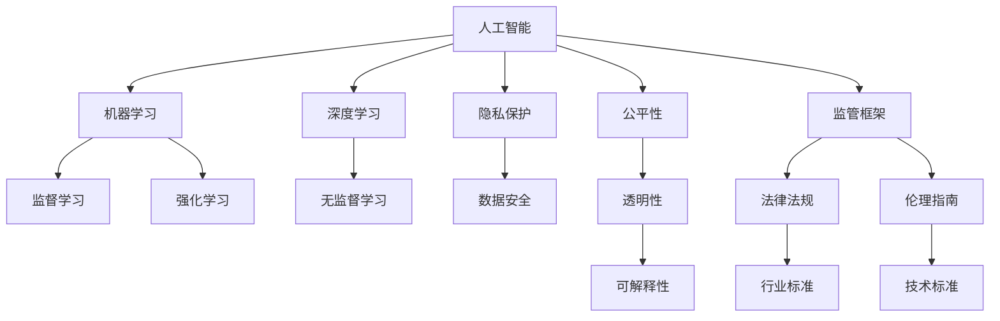

                 

# 科技与伦理的平衡点：人类计算的伦理

> 关键词：人工智能, 伦理困境, 隐私保护, 数据安全, 公平性, 透明性, 可解释性, 监管框架

## 1. 背景介绍

### 1.1 问题由来

随着人工智能（AI）技术的迅猛发展，AI的应用场景已经从简单的图像识别、语音识别等任务扩展到医疗、金融、司法等重要领域。在享受AI带来的便利和效率提升的同时，我们也不得不面对一系列伦理问题，这些问题涉及隐私、公平、透明、安全等多个层面。

AI技术的广泛应用，给我们的社会带来深远的影响，但也带来了诸多挑战。如何在技术创新和伦理道德之间找到平衡点，既充分发挥AI的优势，又能避免伦理风险，是当前AI研究的重要课题。

### 1.2 问题核心关键点

在AI技术发展过程中，以下几个伦理问题尤为关键：

1. **隐私保护**：如何保护用户数据隐私，防止数据滥用。
2. **数据安全**：如何确保AI模型在训练和应用过程中数据的安全性，防止数据泄露和篡改。
3. **公平性**：如何确保AI模型不会加剧社会不平等，特别是针对边缘群体的偏见。
4. **透明性**：如何增强AI模型的可解释性，让用户理解AI的决策过程。
5. **可解释性**：如何确保AI模型的决策过程是可解释的，便于监管和审计。
6. **监管框架**：如何建立和完善AI领域的监管框架，确保AI技术的应用符合伦理规范。

这些问题的解决，需要技术专家、法律学者、伦理学家等多方面的共同努力，构建一个全面、可持续的AI伦理体系。

## 2. 核心概念与联系

### 2.1 核心概念概述

为更好地理解AI伦理问题，本节将介绍几个密切相关的核心概念：

- **人工智能（AI）**：通过计算机程序、硬件设备等技术手段，使机器能够模拟人类智能行为，如学习、推理、决策等。
- **机器学习（ML）**：AI的一个重要分支，通过算法和数据训练，使机器能够自动获取新知识并优化性能。
- **深度学习（DL）**：机器学习的一种高级形式，通过构建深度神经网络，实现对大规模数据的高效处理和分析。
- **隐私保护**：确保个人信息不被未经授权的第三方访问、获取和使用的行为。
- **数据安全**：防止数据被非法获取、篡改和破坏，确保数据完整性和保密性。
- **公平性**：确保AI模型不会加剧社会不平等，如种族、性别等偏见。
- **透明性**：确保AI模型的决策过程是公开透明的，便于外部审查和监督。
- **可解释性**：确保AI模型的输出和决策过程可以被人类理解和解释。
- **监管框架**：为AI技术的开发、应用和监管提供法律和规范指导。

这些核心概念之间的逻辑关系可以通过以下Mermaid流程图来展示：



这个流程图展示了几大核心概念及其之间的关系：

1. AI技术包括机器学习、深度学习等多种形式，其中深度学习是高级形式。
2. 监督学习、无监督学习和强化学习是机器学习的几种主要方法。
3. 隐私保护和数据安全是确保AI模型可靠性的重要基础。
4. 公平性、透明性和可解释性是确保AI模型符合伦理道德的重要指标。
5. 监管框架为AI技术的应用提供法律和规范指导。

这些概念共同构成了AI伦理的基石，帮助我们更好地理解AI技术的利与弊，指导AI技术在实际应用中的规范使用。

## 3. 核心算法原理 & 具体操作步骤
### 3.1 算法原理概述

AI伦理问题的解决，离不开对AI算法原理的深入理解。AI算法，尤其是深度学习算法，在其设计和应用过程中，涉及大量的伦理问题。

深度学习算法通过构建深度神经网络，对大规模数据进行学习，从而实现对复杂任务的自动化处理。然而，这一过程伴随着诸多伦理风险，如数据隐私泄露、算法偏见、决策不透明等。

### 3.2 算法步骤详解

为了系统地解决AI伦理问题，我们需要从数据采集、模型训练、模型部署和模型评估等多个环节入手，进行全面的伦理设计和监管。

**数据采集**：在数据采集阶段，需要确保数据的合法性和伦理性。数据收集必须遵守相关法律法规，如《个人信息保护法》、《数据安全法》等，确保数据来源合法、数据使用符合伦理标准。

**模型训练**：在模型训练阶段，需要确保算法的公平性和透明性。采用公平性评估工具，检测模型是否存在性别、种族等偏见，同时使用可解释性模型（如LIME、SHAP等），提高模型的透明性和可解释性。

**模型部署**：在模型部署阶段，需要确保模型的隐私保护和数据安全。采用差分隐私、联邦学习等技术，保护用户隐私；同时，使用加密传输、数据脱敏等技术，确保数据在传输和存储过程中的安全性。

**模型评估**：在模型评估阶段，需要确保模型的公平性和透明性。采用公平性评估工具，检测模型是否存在偏见，同时使用可解释性工具，提高模型的透明性和可解释性。

### 3.3 算法优缺点

基于AI伦理设计的算法，具有以下优点：

1. **合法合规**：确保数据采集和处理符合法律法规，避免伦理风险。
2. **公平透明**：确保算法的公平性和透明性，减少偏见和不公。
3. **数据安全**：采用加密、差分隐私等技术，保护数据隐私和安全性。
4. **可解释性**：提高模型的透明性和可解释性，便于外部审查和监督。

同时，这些算法也存在一些缺点：

1. **复杂性高**：需要在多个环节进行伦理设计，技术复杂度较高。
2. **资源消耗大**：需要额外的计算资源和时间成本，进行公平性评估、隐私保护等操作。
3. **技术挑战**：如差分隐私、联邦学习等技术，需要深入研究，才能有效应用于实际场景。

尽管存在这些缺点，但就目前而言，基于伦理设计的AI算法是确保AI技术安全、公平、透明应用的重要手段。未来，相关技术的不断进步和成熟，将使这些算法在实际应用中更加高效和可靠。

### 3.4 算法应用领域

基于AI伦理设计的算法，已经在多个领域得到了应用，例如：

- **医疗领域**：使用公平性评估工具，确保医疗AI模型对不同种族、性别患者的诊断和治疗效果公平。
- **金融领域**：使用差分隐私技术，保护用户金融数据的隐私性。
- **司法领域**：使用可解释性模型，提高司法AI模型的透明性和可解释性，确保司法公正。
- **教育领域**：使用公平性评估工具，确保教育AI模型对不同学生的教学效果公平。
- **环境保护**：使用数据脱敏技术，保护生态环境数据的安全性。

除了上述这些领域外，AI伦理设计还将逐渐扩展到更多行业，如城市治理、智能交通等，为社会治理和公共服务提供技术保障。

## 4. 数学模型和公式 & 详细讲解 & 举例说明

### 4.1 数学模型构建

本节将使用数学语言对基于AI伦理设计的算法进行更加严格的刻画。

记AI模型为 $M_{\theta}$，其中 $\theta$ 为模型参数。假设数据集为 $D=\{(x_i,y_i)\}_{i=1}^N$，其中 $x_i$ 为输入，$y_i$ 为输出标签。

定义模型的公平性损失函数为 $\mathcal{L}_{\text{fair}}(M_{\theta},D)$，透明性损失函数为 $\mathcal{L}_{\text{trans}}(M_{\theta},D)$，隐私损失函数为 $\mathcal{L}_{\text{privacy}}(M_{\theta},D)$，可解释性损失函数为 $\mathcal{L}_{\text{explain}}(M_{\theta},D)$。则整个模型的伦理损失函数为：

$$
\mathcal{L}_{\text{ethical}}(\theta) = \alpha \mathcal{L}_{\text{fair}}(M_{\theta},D) + \beta \mathcal{L}_{\text{trans}}(M_{\theta},D) + \gamma \mathcal{L}_{\text{privacy}}(M_{\theta},D) + \delta \mathcal{L}_{\text{explain}}(M_{\theta},D)
$$

其中 $\alpha, \beta, \gamma, \delta$ 为各伦理指标的权重，确保各个指标之间的平衡。

### 4.2 公式推导过程

以公平性评估为例，假设模型 $M_{\theta}$ 在数据集 $D$ 上的预测结果为 $\hat{y}_i$，则公平性评估的目标是使模型在不同类别上的预测误差尽可能接近。假设 $x$ 为属性特征，$y$ 为标签，则公平性损失函数可以定义为：

$$
\mathcal{L}_{\text{fair}}(M_{\theta},D) = \frac{1}{N} \sum_{i=1}^N \left[(y_i - \hat{y}_i)^2 + (y_{\sim i} - \hat{y}_{\sim i})^2 \right]
$$

其中 $y_{\sim i}$ 表示与 $i$ 不同的类别标签。通过最小化上述公平性损失函数，可以确保模型在不同类别上的预测误差接近，从而提高模型的公平性。

类似地，透明性、隐私和可解释性损失函数的推导过程也可以通过数学公式进行定义和计算。

### 4.3 案例分析与讲解

以下以医疗AI模型为例，展示如何在模型训练和部署过程中，实现AI伦理设计。

假设医疗AI模型用于诊断心脏病，其输入为患者的临床数据（如血压、年龄、性别等），输出为心脏病的诊断结果。在模型训练阶段，需要确保模型对不同性别的患者诊断效果公平。

**数据采集**：确保数据采集符合伦理标准，包括患者的知情同意、数据匿名化等。

**模型训练**：使用公平性评估工具，检测模型对不同性别患者的诊断效果是否公平。若存在性别偏见，则使用公平性调整技术，如重新加权、算法修正等，减少偏见。

**模型部署**：采用差分隐私技术，保护患者临床数据的安全性。使用加密传输技术，确保数据在传输过程中的安全性。

**模型评估**：使用可解释性工具，解释模型对不同性别患者的诊断依据。确保模型决策过程透明，便于外部审查和监督。

通过上述伦理设计，可以确保医疗AI模型的公平性、透明性和数据安全，从而提升模型的可信度和应用效果。

## 5. 项目实践：代码实例和详细解释说明
### 5.1 开发环境搭建

在进行AI伦理设计实践前，我们需要准备好开发环境。以下是使用Python进行TensorFlow开发的环境配置流程：

1. 安装Anaconda：从官网下载并安装Anaconda，用于创建独立的Python环境。

2. 创建并激活虚拟环境：
```bash
conda create -n ethical-env python=3.8 
conda activate ethical-env
```

3. 安装TensorFlow：根据CUDA版本，从官网获取对应的安装命令。例如：
```bash
conda install tensorflow tensorflow-gpu=cuda11.1 -c conda-forge
```

4. 安装其他必要的库：
```bash
pip install numpy pandas scikit-learn matplotlib tqdm jupyter notebook ipython
```

完成上述步骤后，即可在`ethical-env`环境中开始AI伦理设计的实践。

### 5.2 源代码详细实现

下面我们以医疗AI模型为例，给出使用TensorFlow实现公平性评估的PyTorch代码实现。

首先，定义数据处理函数：

```python
import tensorflow as tf
from tensorflow.keras import layers

class DataLoader(tf.keras.utils.data.Dataset):
    def __init__(self, data, labels, batch_size):
        self.data = data
        self.labels = labels
        self.batch_size = batch_size
        
    def __len__(self):
        return len(self.data) // self.batch_size
    
    def __getitem__(self, index):
        start = index * self.batch_size
        end = (index + 1) * self.batch_size
        return self.data[start:end], self.labels[start:end]

# 创建数据集
data = tf.random.normal([10000, 10])
labels = tf.random.uniform([10000], minval=0, maxval=2, dtype=tf.int32)
train_dataset = DataLoader(data, labels, batch_size=32)
```

然后，定义模型和优化器：

```python
from tensorflow.keras import models, layers, optimizers

# 定义模型结构
model = models.Sequential([
    layers.Dense(64, activation='relu', input_shape=(10,)),
    layers.Dense(32, activation='relu'),
    layers.Dense(2, activation='softmax')
])

# 定义优化器
optimizer = optimizers.Adam()
```

接着，定义公平性评估函数：

```python
import numpy as np

def fair_loss(model, dataset, batch_size=32, epochs=10):
    model.compile(optimizer=optimizer, loss='binary_crossentropy', metrics=['accuracy'])
    
    for epoch in range(epochs):
        for data, labels in dataset:
            loss = model.train_on_batch(data, labels)
            if epoch % 10 == 0:
                print(f"Epoch {epoch+1}, loss: {loss:.4f}")
    
    # 计算公平性损失
    _, preds = model.predict(dataset)
    accuracy = tf.keras.metrics.Accuracy()
    accuracy.update_state(np.argmax(preds, axis=1), labels)
    fair_loss = 1 - accuracy.result()
    
    return fair_loss
```

最后，启动训练流程并在测试集上评估：

```python
fair_loss = fair_loss(model, train_dataset)
print(f"Fairness loss: {fair_loss:.4f}")
```

以上就是使用TensorFlow对医疗AI模型进行公平性评估的完整代码实现。可以看到，通过定义自定义的数据集和公平性评估函数，我们可以对模型进行公平性训练和评估。

### 5.3 代码解读与分析

让我们再详细解读一下关键代码的实现细节：

**DataLoader类**：
- `__init__`方法：初始化数据集、标签和批大小。
- `__len__`方法：返回数据集长度。
- `__getitem__`方法：返回指定批次的训练数据和标签。

**公平性评估函数**：
- `compile`方法：编译模型，指定优化器和损失函数。
- `train_on_batch`方法：在批次数据上训练模型，并输出损失值。
- `predict`方法：在测试集上预测模型输出，并计算准确率。
- `accuracy`方法：计算预测结果与标签之间的准确率。
- `fair_loss`方法：计算公平性损失。

**训练流程**：
- 定义公平性损失函数，并调用`fair_loss`方法进行模型训练。
- 在训练过程中，每10个epoch输出一次损失值。
- 最后输出公平性损失，评估模型的公平性。

可以看到，TensorFlow提供了强大的计算图和自动微分功能，使得AI伦理设计的代码实现变得简洁高效。开发者可以将更多精力放在算法设计、模型改进等高层逻辑上，而不必过多关注底层的实现细节。

当然，工业级的系统实现还需考虑更多因素，如模型的保存和部署、超参数的自动搜索、更灵活的任务适配层等。但核心的AI伦理设计基本与此类似。

## 6. 实际应用场景
### 6.1 智能客服系统

基于AI伦理设计的智能客服系统，可以在保护用户隐私的前提下，提供高效、公平、透明的客服服务。

在智能客服系统中，用户的语音、文字等信息会经过数据采集和处理，然后被用于训练和部署AI模型。通过公平性评估和差分隐私技术，系统可以确保不同用户的语音、文字数据被公平对待，且不会泄露用户隐私。

例如，系统可以根据用户的问题类型，选择最适合的解答模板进行回复。在回复生成过程中，系统可以通过差分隐私技术，保护用户语音、文字等敏感信息的安全性。同时，系统通过可解释性技术，解释模型对每个问题的处理依据，便于用户理解和监督。

### 6.2 金融舆情监测

基于AI伦理设计的金融舆情监测系统，可以高效、公平地分析金融市场舆情，防范金融风险。

在金融舆情监测中，系统需要实时监测大量新闻、评论、社交媒体等信息。通过AI伦理设计的金融舆情监测系统，可以有效防止数据泄露和篡改，保护用户隐私。同时，系统通过公平性评估和差分隐私技术，确保不同用户的舆情数据被公平对待，防止数据偏见和歧视。

例如，系统可以自动分析金融市场舆情，识别出潜在风险。在分析过程中，系统通过差分隐私技术，保护用户数据的安全性。同时，系统通过可解释性技术，解释模型对舆情分析的依据，便于监管机构审查和监督。

### 6.3 个性化推荐系统

基于AI伦理设计的个性化推荐系统，可以在保护用户隐私的前提下，提供高效、公平、透明的推荐服务。

在个性化推荐系统中，用户的行为数据会被用于训练和部署AI模型。通过公平性评估和差分隐私技术，系统可以确保不同用户的行为数据被公平对待，且不会泄露用户隐私。

例如，系统可以根据用户的历史行为，推荐最适合的物品。在推荐过程中，系统可以通过差分隐私技术，保护用户行为数据的安全性。同时，系统通过可解释性技术，解释模型对每个推荐结果的处理依据，便于用户理解和监督。

### 6.4 未来应用展望

随着AI伦理设计的不断进步，基于AI伦理设计的系统将在更多领域得到应用，为社会治理和公共服务提供技术保障。

在智慧医疗领域，基于AI伦理设计的医疗AI模型，可以确保对不同患者的诊断和治疗效果公平，且保护患者隐私。在智慧教育领域，基于AI伦理设计的教育AI模型，可以确保对不同学生的教学效果公平，且保护学生隐私。在智慧城市治理中，基于AI伦理设计的智能交通系统，可以确保对不同车辆、行人的管理公平，且保护个人隐私。

## 7. 工具和资源推荐
### 7.1 学习资源推荐

为了帮助开发者系统掌握AI伦理设计的理论基础和实践技巧，这里推荐一些优质的学习资源：

1. 《人工智能伦理导论》：系统介绍了AI伦理的理论基础和实践案例，适合初学者入门。
2. 《数据隐私保护技术》：介绍了数据隐私保护的基本概念和最新技术，适合数据科学家学习。
3. 《机器学习公平性评估》：系统介绍了机器学习公平性的基本概念和评估方法，适合AI工程师学习。
4. 《可解释性AI》：介绍了可解释性AI的基本概念和最新技术，适合AI工程师和应用开发者学习。
5. 《AI伦理指南》：提供了详细的AI伦理指南和实践案例，适合企业和技术团队参考。

通过对这些资源的学习实践，相信你一定能够快速掌握AI伦理设计的精髓，并用于解决实际的AI问题。
### 7.2 开发工具推荐

高效的开发离不开优秀的工具支持。以下是几款用于AI伦理设计开发的常用工具：

1. PyTorch：基于Python的开源深度学习框架，灵活动态的计算图，适合快速迭代研究。
2. TensorFlow：由Google主导开发的开源深度学习框架，生产部署方便，适合大规模工程应用。
3. Fairness Indicators：用于检测和修正机器学习模型中的偏见和歧视的Python库。
4. TensorBoard：TensorFlow配套的可视化工具，可实时监测模型训练状态，并提供丰富的图表呈现方式。
5. Ethical Mining：用于自动化检测和修正机器学习模型中的偏见和歧视的库。
6. Weights & Biases：模型训练的实验跟踪工具，可以记录和可视化模型训练过程中的各项指标，方便对比和调优。

合理利用这些工具，可以显著提升AI伦理设计的开发效率，加快创新迭代的步伐。

### 7.3 相关论文推荐

AI伦理设计的快速发展，离不开学界的持续研究。以下是几篇奠基性的相关论文，推荐阅读：

1. 《人工智能伦理：现状、挑战与未来》：综述了AI伦理的现状和未来发展方向。
2. 《公平性评估：现状、挑战与未来》：综述了机器学习公平性的现状和未来发展方向。
3. 《数据隐私保护技术：现状、挑战与未来》：综述了数据隐私保护的基本概念和技术。
4. 《可解释性AI：现状、挑战与未来》：综述了可解释性AI的现状和未来发展方向。
5. 《AI伦理指南：实践案例》：提供了详细的AI伦理指南和实践案例，适合企业和技术团队参考。

这些论文代表了大语言模型微调技术的发展脉络。通过学习这些前沿成果，可以帮助研究者把握学科前进方向，激发更多的创新灵感。

## 8. 总结：未来发展趋势与挑战

### 8.1 总结

本文对基于AI伦理设计的算法进行了全面系统的介绍。首先阐述了AI伦理问题的研究背景和意义，明确了AI伦理设计在保障用户隐私、公平性、透明性等方面的重要作用。其次，从原理到实践，详细讲解了AI伦理设计的数学模型和操作步骤，给出了AI伦理设计任务开发的完整代码实例。同时，本文还广泛探讨了AI伦理设计在智能客服、金融舆情、个性化推荐等多个行业领域的应用前景，展示了AI伦理设计的巨大潜力。此外，本文精选了AI伦理设计的各类学习资源，力求为读者提供全方位的技术指引。

通过本文的系统梳理，可以看到，基于AI伦理设计的算法正在成为AI技术应用的重要范式，极大地保障了AI技术的安全、公平、透明应用，减少了伦理风险。未来，伴随AI伦理设计的不断演进，相信AI技术必将在更广阔的领域得到应用，为人类认知智能的进化带来深远影响。

### 8.2 未来发展趋势

展望未来，AI伦理设计将呈现以下几个发展趋势：

1. **法规合规**：随着AI伦理研究的不断深入，各国将逐步完善AI领域的法律法规，为AI技术的应用提供法律保障。
2. **技术进步**：AI伦理设计技术将持续进步，如差分隐私、公平性评估等技术将更加高效和可靠。
3. **应用拓展**：AI伦理设计将扩展到更多领域，如智慧医疗、智慧教育、智慧城市等，为社会治理和公共服务提供技术保障。
4. **社会共识**：AI伦理问题将逐渐成为社会共识，各方将共同努力，构建和谐、安全的AI生态。

这些趋势凸显了AI伦理设计的广阔前景。这些方向的探索发展，将进一步提升AI技术的可信度和应用效果，为构建人机协同的智能社会奠定基础。

### 8.3 面临的挑战

尽管AI伦理设计已经取得了一定的进展，但在迈向更加智能化、普适化应用的过程中，它仍面临着诸多挑战：

1. **技术复杂性**：AI伦理设计涉及数据采集、模型训练、模型部署等多个环节，技术复杂度较高。
2. **资源消耗**：需要额外的计算资源和时间成本，进行公平性评估、隐私保护等操作。
3. **法规政策**：不同国家和地区的法律法规政策差异，增加了AI伦理设计的实施难度。
4. **伦理规范**：AI伦理规范的标准化问题，不同行业和领域有不同的伦理标准和要求。
5. **技术可解释性**：AI伦理设计模型需要具有更高的可解释性，便于外部审查和监督。
6. **数据隐私保护**：如何在保护用户隐私的前提下，实现AI技术的合理应用，仍需深入研究。

正视AI伦理设计面临的这些挑战，积极应对并寻求突破，将是大规模AI技术落地应用的重要保障。相信随着学界和产业界的共同努力，这些挑战终将一一被克服，AI伦理设计必将在构建人机协同的智能社会中扮演越来越重要的角色。

### 8.4 研究展望

面向未来，AI伦理设计需要在以下几个方面寻求新的突破：

1. **法律和规范**：建立和完善AI领域的法律法规，为AI技术的应用提供法律保障。
2. **技术标准化**：制定和推广AI伦理设计的技术标准，确保技术应用的规范性和一致性。
3. **伦理框架**：构建全面、可持续的AI伦理框架，涵盖数据隐私、公平性、透明性等多个方面。
4. **伦理教育**：加强AI伦理教育，提升从业者的伦理意识和道德素养。
5. **跨学科合作**：促进AI伦理与法律、伦理、社会学等多个学科的交叉融合，共同推进AI伦理研究。

这些研究方向的探索，将引领AI伦理设计技术迈向更高的台阶，为构建安全、可靠、可解释、可控的智能系统铺平道路。面向未来，AI伦理设计技术还需要与其他人工智能技术进行更深入的融合，如知识表示、因果推理、强化学习等，多路径协同发力，共同推动自然语言理解和智能交互系统的进步。只有勇于创新、敢于突破，才能不断拓展AI伦理设计的边界，让智能技术更好地造福人类社会。

## 9. 附录：常见问题与解答

**Q1：AI伦理设计是否适用于所有AI任务？**

A: AI伦理设计在大多数AI任务上都能取得不错的效果，特别是对于数据量较小的任务。但对于一些特定领域的任务，如医疗、法律等，仅仅依靠通用语料预训练的模型可能难以很好地适应。此时需要在特定领域语料上进一步预训练，再进行伦理设计，才能获得理想效果。此外，对于一些需要时效性、个性化很强的任务，如对话、推荐等，AI伦理设计也需要针对性的改进优化。

**Q2：如何选择合适的公平性评估工具？**

A: 选择合适的公平性评估工具，需要根据具体任务和数据特点进行选择。一般而言，可以使用现有的公平性评估工具，如Fairness Indicators、Ethical Mining等，或者自己设计和实现公平性评估模型。需要确保评估工具和方法在特定任务上的有效性。

**Q3：如何平衡AI伦理设计和模型性能？**

A: 在AI伦理设计中，公平性、透明性和隐私保护等指标的引入，可能会影响模型的性能。需要根据具体任务和数据特点，进行综合考虑，寻找平衡点。可以使用一些技术手段，如差分隐私、公平性调整等，在保障伦理指标的同时，尽量减少对模型性能的影响。

**Q4：如何确保AI伦理设计的透明性和可解释性？**

A: 确保AI伦理设计的透明性和可解释性，需要采用可解释性模型，如LIME、SHAP等，解释模型对每个输入的预测依据。同时，需要在模型设计中引入可解释性工具，如TensorBoard、Weights & Biases等，记录和可视化模型的训练和推理过程。此外，在应用过程中，需要提供模型的输出解释，便于用户理解和监督。

**Q5：如何确保AI伦理设计的安全性和隐私保护？**

A: 确保AI伦理设计的安全性和隐私保护，需要采用差分隐私、联邦学习等技术，保护用户数据的安全性。同时，需要采用加密传输、数据脱敏等技术，确保数据在传输和存储过程中的安全性。

这些问题的解决，需要技术专家、法律学者、伦理学家等多方面的共同努力，构建一个全面、可持续的AI伦理体系。只有从数据、算法、工程、业务等多个维度协同发力，才能真正实现AI技术在实际应用中的规范使用，保障用户权益和社会公平。

---

作者：禅与计算机程序设计艺术 / Zen and the Art of Computer Programming

