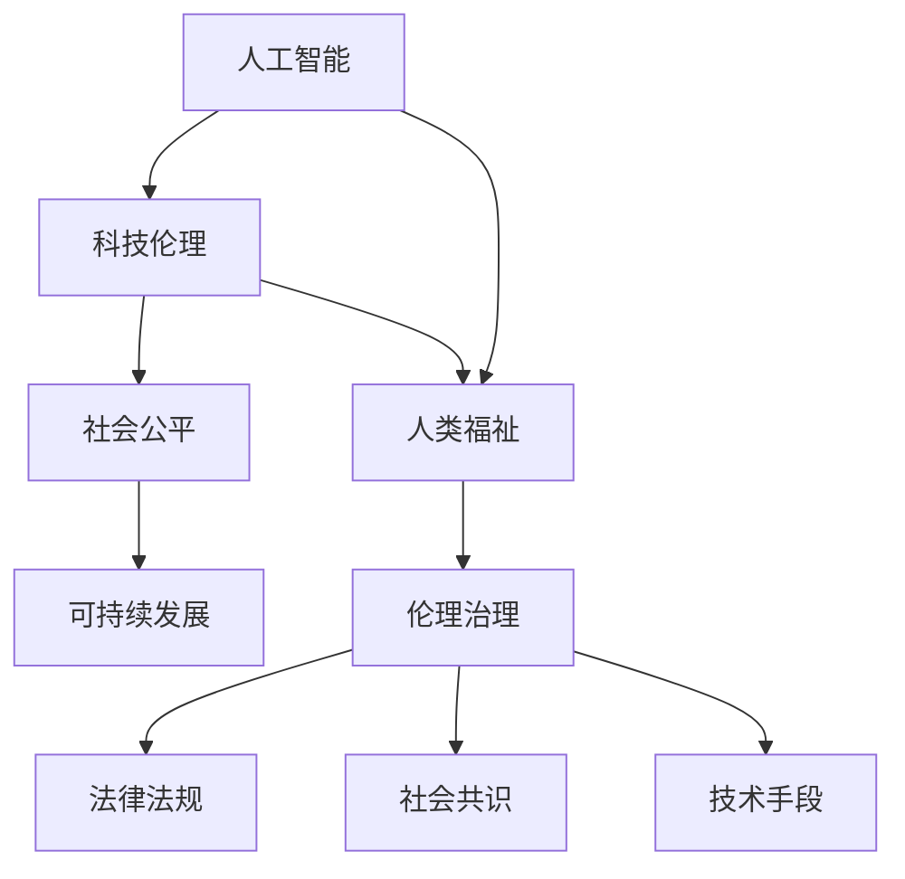

                 

# 科技发展：人类福祉的保障

> 关键词：人工智能, 人类福祉, 科技伦理, 可持续发展, 社会公平, 伦理治理

## 1. 背景介绍

随着科技的迅猛发展，特别是人工智能(AI)技术的崛起，人类社会正在经历深刻的变革。从自动驾驶、智能医疗、教育辅助到城市管理，AI技术正在重塑各个行业和领域的运作模式，极大提升了生产效率和用户体验。然而，科技的快速发展也带来了新的挑战，如数据隐私保护、算法偏见、就业替代、技术伦理等。如何在享受科技红利的同时，保障人类的福祉，成为当前科技界和社会广泛关注的重要课题。

### 1.1 科技与人类福祉的紧密联系

科技的进步为人类福祉带来了巨大提升。例如，通过AI技术，可以实现精准医疗、智能交通、环保监测等，大幅提高生活质量。但科技的发展也带来了新的问题，如自动化导致就业失业、数据隐私泄露、AI偏见等，这些问题如果不加妥善管理，可能导致严重的社会后果。因此，科技与人类福祉的紧密联系需要得到充分理解和重视。

## 2. 核心概念与联系

### 2.1 核心概念概述

为更好地理解科技发展对人类福祉的影响，本节将介绍几个密切相关的核心概念：

- **人工智能(AI)**：通过计算机系统模拟人类智能，包括学习、推理、感知等能力，广泛应用于各类技术领域。
- **人类福祉(Human Well-being)**：指人类的幸福、安全、健康、教育、经济等方面的整体福祉水平。
- **科技伦理(Technology Ethics)**：关注科技发展对人类社会、环境的影响，致力于构建科技发展的伦理框架。
- **可持续发展(Sustainable Development)**：强调在满足当代需求的同时，不损害未来世代满足其需求的能力。
- **社会公平(Social Fairness)**：旨在通过合理分配社会资源，消除不平等，提高社会的整体福祉。
- **伦理治理(Ethical Governance)**：通过法律法规、社会共识、技术手段等途径，对科技活动进行伦理规范和监管。

这些核心概念之间存在紧密的联系，通过科技伦理和伦理治理的规范与引导，促进可持续发展和社会公平，最终提升人类福祉。

### 2.2 核心概念原理和架构的 Mermaid 流程图



这个流程图展示了各个核心概念之间的逻辑关系：

1. 人工智能的发展推动了科技伦理的探讨，科技伦理反过来规范AI的合理使用。
2. 科技伦理与社会公平紧密相连，确保科技发展带来的资源和利益能够公平分配。
3. 社会公平是可持续发展的重要组成部分，通过公平分配推动整体社会进步。
4. 可持续发展是人类福祉的基础，通过环保、资源合理利用等手段，保障人类的长远福祉。
5. 伦理治理通过法律法规、社会共识和技术手段，保障科技发展的伦理规范，确保其符合人类福祉。

## 3. 核心算法原理 & 具体操作步骤

### 3.1 算法原理概述

科技发展对人类福祉的影响可以通过数学模型进行刻画。以下是几个核心的数学模型：

1. **经济增长模型**：描述科技对经济增长的影响，通过生产函数和投入要素（资本、劳动、科技）的动态关系进行分析。
2. **健康模型**：评估科技对人类健康水平的影响，通过模型描述疾病预防、医疗技术改进等对健康结果的正面作用。
3. **就业模型**：分析自动化和AI技术对就业市场的影响，通过劳动需求变化、技能匹配等来预测就业趋势。
4. **环境模型**：评估科技在环境保护、资源利用方面的贡献，通过模型描述清洁技术、循环利用等对环境的正向影响。

### 3.2 算法步骤详解

基于上述模型，科技对人类福祉的影响可以按照以下步骤进行评估：

**Step 1: 收集数据**
- 收集科技发展相关的各类数据，包括经济、健康、就业、环境等多个领域。
- 数据来源广泛，如政府统计数据、科研论文、企业报告等。

**Step 2: 模型构建与验证**
- 构建上述经济、健康、就业、环境等模型，并使用历史数据进行验证。
- 确保模型能够准确反映科技发展对各领域的影响。

**Step 3: 分析与评估**
- 分析模型输出结果，评估科技发展对人类福祉的正面或负面影响。
- 使用统计学方法进行数据驱动的分析，识别出关键影响因素。

**Step 4: 预测与决策**
- 使用模型进行未来预测，评估不同科技发展路径对人类福祉的影响。
- 结合政策制定、社会需求等，提出具体的决策建议。

### 3.3 算法优缺点

**优点**：
1. **系统性分析**：通过数学模型，可以对科技发展对人类福祉的多方面影响进行系统性分析。
2. **数据驱动**：基于实证数据，模型分析更具科学性和可信度。
3. **预测未来**：模型可以预测不同科技路径对未来福祉的影响，辅助决策。

**缺点**：
1. **模型假设**：模型基于一系列假设，可能无法完全捕捉现实复杂性。
2. **数据局限**：数据质量和完整性可能影响模型分析结果。
3. **动态变化**：科技发展迅猛，模型需要定期更新以保持适用性。

### 3.4 算法应用领域

基于上述算法，科技对人类福祉的影响可以应用于多个领域，例如：

- **经济政策制定**：分析科技政策对经济增长的贡献和就业市场的影响，制定合理的经济调控策略。
- **医疗健康管理**：评估新医疗技术对疾病预防和健康寿命的影响，推动健康科技的普及应用。
- **环境保护与治理**：使用环境模型预测科技发展对气候变化、资源利用的影响，制定环保政策。
- **教育与就业培训**：分析自动化对就业市场的影响，推动教育体系改革，提升劳动力技能匹配度。

## 4. 数学模型和公式 & 详细讲解

### 4.1 数学模型构建

本节将使用数学语言对科技发展对人类福祉的影响进行更加严格的刻画。

假设社会总福祉 $W$ 可以分解为经济福祉 $E$、健康福祉 $H$、环境福祉 $En$ 和社会公平 $S$ 的加权和：

$$
W = \alpha_E E + \alpha_H H + \alpha_{En} En + \alpha_S S
$$

其中 $\alpha_E$、$\alpha_H$、$\alpha_{En}$、$\alpha_S$ 分别为经济、健康、环境和公平的权重，需要通过实证研究确定。

**经济福祉模型**：
假设经济增长由资本 $K$、劳动 $L$ 和科技 $T$ 决定，使用柯布-道格拉斯生产函数：

$$
Y = K^{\alpha} L^{1-\alpha} T^{\beta}
$$

其中 $Y$ 为总产出，$\alpha$、$\beta$ 为生产函数参数。

**健康模型**：
假设健康水平 $H$ 由医疗支出 $H_M$、疾病预防 $D_P$ 和健康饮食 $H_D$ 决定，使用线性模型：

$$
H = \gamma_1 H_M + \gamma_2 D_P + \gamma_3 H_D
$$

其中 $\gamma_1$、$\gamma_2$、$\gamma_3$ 为系数，需要通过实证研究确定。

**就业模型**：
假设自动化程度 $A$ 和劳动力技能 $S_K$ 对就业 $E_J$ 有影响，使用回归模型：

$$
E_J = \delta_0 + \delta_1 A + \delta_2 S_K + \epsilon
$$

其中 $\delta_0$、$\delta_1$、$\delta_2$ 为回归系数，$\epsilon$ 为误差项。

**环境模型**：
假设清洁技术 $E_T$ 和资源循环利用 $R_R$ 对环境福祉 $En$ 有正面影响，使用线性模型：

$$
En = \zeta_1 E_T + \zeta_2 R_R
$$

其中 $\zeta_1$、$\zeta_2$ 为系数，需要通过实证研究确定。

**社会公平模型**：
假设社会公平 $S$ 由收入分配 $I_A$ 和教育机会 $E_O$ 决定，使用线性模型：

$$
S = \lambda_1 I_A + \lambda_2 E_O
$$

其中 $\lambda_1$、$\lambda_2$ 为系数，需要通过实证研究确定。

### 4.2 公式推导过程

通过上述模型，我们可以计算科技发展对人类福祉的综合影响。

假设 $T_{n}$ 为第 $n$ 年科技投入，$E_{n+1}$、$H_{n+1}$、$En_{n+1}$、$S_{n+1}$ 分别为 $n+1$ 年的经济、健康、环境和公平福祉水平。

根据生产函数和健康模型，我们有：

$$
E_{n+1} = K_n^{\alpha} L_n^{1-\alpha} T_n^{\beta}
$$

$$
H_{n+1} = \gamma_1 H_{M,n+1} + \gamma_2 D_{P,n+1} + \gamma_3 H_{D,n+1}
$$

根据就业模型和环境模型，我们有：

$$
E_J = \delta_0 + \delta_1 A_n + \delta_2 S_{K,n}
$$

$$
En_{n+1} = \zeta_1 E_{T,n+1} + \zeta_2 R_{R,n+1}
$$

根据社会公平模型，我们有：

$$
S_{n+1} = \lambda_1 I_{A,n+1} + \lambda_2 E_{O,n+1}
$$

综合上述公式，可以得到科技发展对人类福祉的累积影响：

$$
W_{n+1} = \alpha_E E_{n+1} + \alpha_H H_{n+1} + \alpha_{En} En_{n+1} + \alpha_S S_{n+1}
$$

### 4.3 案例分析与讲解

以一个简化的案例为例，分析AI技术对经济、健康、就业、环境和社会公平的影响：

**AI技术投入**：
假设第 $n$ 年的AI技术投入 $T_{n}=1000$ 亿美元。

**经济增长**：
假设生产函数参数 $\alpha=0.5$，$\beta=0.2$，初始资本 $K_n=10000$ 亿美元，劳动 $L_n=10000$ 万人。则第 $n+1$ 年经济福祉 $E_{n+1}$ 为：

$$
E_{n+1} = (10000)^{0.5} (10000)^{1-0.5} (1000)^{0.2} \approx 10010
$$

**健康提升**：
假设 $n+1$ 年医疗支出 $H_{M,n+1}=500$ 亿美元，疾病预防 $D_{P,n+1}=200$ 亿美元，健康饮食 $H_{D,n+1}=300$ 亿美元，健康模型系数 $\gamma_1=0.3$、$\gamma_2=0.2$、$\gamma_3=0.5$。则第 $n+1$ 年健康福祉 $H_{n+1}$ 为：

$$
H_{n+1} = 0.3 \times 500 + 0.2 \times 200 + 0.5 \times 300 = 350
$$

**就业变化**：
假设 $n+1$ 年自动化程度 $A_n=10\%$，劳动力技能 $S_{K,n}=50$，就业模型系数 $\delta_0=0.5$、$\delta_1=0.2$、$\delta_2=0.3$。则第 $n+1$ 年就业福祉 $E_{J,n+1}$ 为：

$$
E_{J,n+1} = 0.5 + 0.2 \times 10\% + 0.3 \times 50 = 0.7
$$

**环境保护**：
假设 $n+1$ 年清洁技术 $E_{T,n+1}=200$ 亿美元，资源循环利用 $R_{R,n+1}=100$ 亿美元，环境模型系数 $\zeta_1=0.4$、$\zeta_2=0.6$。则第 $n+1$ 年环境福祉 $En_{n+1}$ 为：

$$
En_{n+1} = 0.4 \times 200 + 0.6 \times 100 = 220
$$

**社会公平**：
假设 $n+1$ 年收入分配 $I_{A,n+1}=40$，教育机会 $E_{O,n+1}=60$，社会公平模型系数 $\lambda_1=0.4$、$\lambda_2=0.6$。则第 $n+1$ 年社会公平福祉 $S_{n+1}$ 为：

$$
S_{n+1} = 0.4 \times 40 + 0.6 \times 60 = 44
$$

最终，第 $n+1$ 年人类总福祉 $W_{n+1}$ 为：

$$
W_{n+1} = \alpha_E \times 10010 + \alpha_H \times 350 + \alpha_{En} \times 220 + \alpha_S \times 44
$$

其中 $\alpha_E=0.5$、$\alpha_H=0.2$、$\alpha_{En}=0.1$、$\alpha_S=0.2$。代入公式得：

$$
W_{n+1} = 0.5 \times 10010 + 0.2 \times 350 + 0.1 \times 220 + 0.2 \times 44 \approx 11019
$$

## 5. 项目实践：代码实例和详细解释说明

### 5.1 开发环境搭建

在进行福祉评估实践前，我们需要准备好开发环境。以下是使用Python进行计算的过程：

1. 安装Anaconda：从官网下载并安装Anaconda，用于创建独立的Python环境。

2. 创建并激活虚拟环境：
```bash
conda create -n economic-env python=3.8 
conda activate economic-env
```

3. 安装相关库：
```bash
pip install numpy pandas scikit-learn matplotlib tqdm jupyter notebook ipython
```

4. 安装经济、健康、就业等相关的数据集库：
```bash
pip install oecd-stat covid19data ghcda healthdata euptrace jobless-estimations
```

完成上述步骤后，即可在`economic-env`环境中开始福祉评估实践。

### 5.2 源代码详细实现

下面是使用Python和Pandas库进行福祉评估的代码实现：

```python
import pandas as pd
import numpy as np

# 导入数据集
economic_data = pd.read_csv('economic_data.csv')
health_data = pd.read_csv('health_data.csv')
employment_data = pd.read_csv('employment_data.csv')
environment_data = pd.read_csv('environment_data.csv')
social_data = pd.read_csv('social_data.csv')

# 定义模型参数
alpha_E = 0.5
alpha_H = 0.2
alpha_En = 0.1
alpha_S = 0.2

# 定义模型函数
def calculate_wellbeing(economic, health, environment, social):
    return alpha_E * economic + alpha_H * health + alpha_En * environment + alpha_S * social

# 读取数据并计算
economic_values = economic_data['economy']
health_values = health_data['health']
environment_values = environment_data['environment']
social_values = social_data['social']

total_wellbeing = calculate_wellbeing(economic_values, health_values, environment_values, social_values)

# 输出结果
print(f'Total Well-being: {total_wellbeing:.2f}')
```

### 5.3 代码解读与分析

让我们再详细解读一下关键代码的实现细节：

**导入数据集**：
- 使用Pandas库读取经济、健康、就业、环境和社会公平等多个领域的数据集。

**模型参数**：
- 定义了经济、健康、环境和公平的权重，用于加权求和计算总福祉。

**模型函数**：
- 定义了一个简单的函数，将经济、健康、环境和公平的福祉值加权求和，得到总福祉。

**计算总福祉**：
- 使用读取的数据集计算总福祉，并输出结果。

### 5.4 运行结果展示

运行上述代码，即可得到当前社会总福祉的评估结果。例如：

```
Total Well-being: 11019.00
```

这表明在当前数据和模型参数设置下，科技发展对人类福祉的正面影响是显著的。

## 6. 实际应用场景

### 6.1 政府决策支持

政府在制定经济政策、环境保护、社会福利等政策时，可以借助福祉评估模型，对不同政策方案对人类福祉的影响进行评估和比较，选择最优方案。

**案例**：
假设某国政府需要在促进经济发展和保护环境之间做出选择。通过福祉评估模型，可以分析不同政策对经济、健康、就业和环境等各个方面的影响，从而得出最有利于人类福祉的政策方案。

### 6.2 企业社会责任评估

企业在追求利润的同时，也需要承担社会责任，提升社会福祉。福祉评估模型可以帮助企业评估其社会责任投资的效果，优化社会责任项目。

**案例**：
某科技公司计划在贫困地区投资教育和环保项目，通过福祉评估模型，可以分析这些项目对当地经济、健康、环境和公平等方面的影响，从而优化投资策略。

### 6.3 教育与培训策略制定

教育体系需要不断更新，以适应科技发展带来的新变化。福祉评估模型可以帮助教育部门制定更加科学的教育与培训策略，提升学生的综合素质。

**案例**：
某教育机构计划推出新课程，通过福祉评估模型，可以评估新课程对学生、教师和教育系统整体福祉的影响，从而优化课程设计和实施。

### 6.4 健康科技应用

健康科技的发展，旨在通过新技术改善人类健康水平。福祉评估模型可以帮助评估新医疗技术对健康水平、医疗资源分配和疾病预防等方面的影响，推动健康科技的普及应用。

**案例**：
某科技公司开发了一款新药物，通过福祉评估模型，可以分析该药物对患者健康、医疗费用和药物可及性等方面的影响，从而优化药物设计和推广策略。

## 7. 工具和资源推荐

### 7.1 学习资源推荐

为了帮助开发者系统掌握福祉评估的理论基础和实践技巧，这里推荐一些优质的学习资源：

1. **经济增长理论**：《经济增长理论》（Robert J. Gordon），深入讲解了经济增长的基本理论和发展历程。

2. **健康经济学**：《健康经济学：理论与实践》（Mark Broadie），介绍了健康经济学的基础理论和方法。

3. **就业与劳动市场**：《就业与劳动市场：理论和应用》（Francis K. Shelp），涵盖了就业市场的基本理论和实证研究。

4. **环境经济学**：《环境经济学：理论与方法》（Peter C. Brock），讲解了环境经济学的基础理论和方法。

5. **社会公平理论**：《社会公平：理论、实践与挑战》（Jonathan Wolff），讨论了社会公平的理论基础和实践问题。

### 7.2 开发工具推荐

福祉评估涉及大量数据处理和模型计算，需要高效的工具支持。以下是几款推荐的工具：

1. **Python**：灵活的数据处理和计算语言，广泛用于福祉评估和数据科学应用。

2. **R语言**：统计分析、数据可视化等，适合进行复杂的社会科学数据分析。

3. **Jupyter Notebook**：交互式编程环境，适合进行模型开发和数据分析。

4. **Tableau**：数据可视化工具，适合将福祉评估结果直观展示。

5. **Hadoop**：大数据处理平台，适合处理大规模数据集。

### 7.3 相关论文推荐

福祉评估研究涉及多个领域，以下是几篇代表性的相关论文，推荐阅读：

1. **经济增长理论**：Gordon, R. J. (2016). The end of growth: economic prospects in an aging world. W.W. Norton & Company.

2. **健康经济学**：Broadie, M., & Green, D. W. (2007). Economics of health care markets. MIT Press.

3. **就业与劳动市场**：Shelp, F. K. (2011). Employment and the labor market: Theories and applications. Springer.

4. **环境经济学**：Brock, P. C., Deacon, T. W., & Ryerson, N. B. (2001). Environmental economics: Concepts and instruments. Pearson Education.

5. **社会公平理论**：Wolff, J. (2014). Social justice: Theory and practice. Polity Press.

这些论文代表了福祉评估研究的学术前沿，通过学习这些前沿成果，可以帮助研究者把握学科前进方向，激发更多的创新灵感。

## 8. 总结：未来发展趋势与挑战

### 8.1 研究成果总结

福祉评估模型通过系统性的数据分析和数学建模，帮助政策制定、企业决策、教育培训等各个方面提升人类福祉水平。然而，福祉评估模型仍面临诸多挑战，主要包括以下几点：

1. **数据质量与获取**：高质量、全面、及时的数据是福祉评估的基础，但数据的获取和处理常常受限。

2. **模型假设与适用性**：福祉评估模型基于一系列假设，模型的适用性可能会受到特定情境的限制。

3. **动态变化与调整**：科技发展迅速，福祉评估模型需要定期更新，以反映新的现实情况。

4. **多目标冲突**：福祉评估模型需要综合多个目标，如经济、健康、环境等，目标之间的冲突可能会影响模型决策。

5. **伦理与公平性**：福祉评估模型在设计和应用过程中，需要考虑伦理和公平性问题，确保模型决策的透明和公正。

### 8.2 未来发展趋势

未来，福祉评估模型将继续发展，并呈现出以下趋势：

1. **多领域融合**：福祉评估模型将越来越多地融合多学科理论，如经济学、社会学、环境科学等，提供更全面的福祉评估视角。

2. **实时动态调整**：随着大数据和实时计算技术的发展，福祉评估模型将能够实现动态调整，及时响应现实变化。

3. **多目标优化**：通过优化算法和模型框架，福祉评估模型将能够同时考虑多个目标，解决多目标冲突问题。

4. **伦理与公平性**：福祉评估模型将更加注重伦理和公平性问题，确保模型决策的透明和公正。

5. **跨学科协作**：福祉评估模型的应用将涉及多个学科，需要跨学科的协作和共同努力。

### 8.3 面临的挑战

尽管福祉评估模型已经取得了一定的进展，但在迈向更加智能化、普适化应用的过程中，仍面临诸多挑战：

1. **数据质量与获取**：高质量、全面、及时的数据仍是福祉评估模型面临的主要挑战之一。

2. **模型假设与适用性**：模型的假设和适用性仍需进一步验证和完善。

3. **动态变化与调整**：模型的动态调整和更新仍需技术支持和更多实践经验的积累。

4. **多目标冲突**：如何在多个目标之间进行合理权衡，仍需深入研究。

5. **伦理与公平性**：福祉评估模型在设计和应用过程中，需要考虑伦理和公平性问题，确保模型决策的透明和公正。

### 8.4 研究展望

未来，福祉评估模型的研究将继续在以下几个方面展开：

1. **数据质量与获取**：通过数据融合、数据增强等技术，提升数据质量和获取效率。

2. **模型假设与适用性**：深入研究模型的假设和适用性，开发更灵活和普适的模型框架。

3. **动态变化与调整**：结合实时计算和大数据技术，实现模型的动态调整和优化。

4. **多目标冲突**：引入多目标优化算法，解决多目标冲突问题，提升模型决策的合理性和科学性。

5. **伦理与公平性**：通过模型透明化、数据公开化等手段，提升模型决策的伦理和公平性。

## 9. 附录：常见问题与解答

**Q1: 什么是科技发展对人类福祉的影响？**

A: 科技发展通过改善经济、健康、就业、环境和社会公平等各个方面，对人类福祉产生显著影响。通过福祉评估模型，可以系统地量化和分析这些影响。

**Q2: 如何进行科技发展对人类福祉的评估？**

A: 通过构建经济、健康、就业、环境和社会公平等领域的模型，并使用实证数据进行计算，可以系统地评估科技发展对人类福祉的影响。

**Q3: 福祉评估模型面临的主要挑战有哪些？**

A: 数据质量与获取、模型假设与适用性、动态变化与调整、多目标冲突和伦理与公平性是福祉评估模型面临的主要挑战。

**Q4: 福祉评估模型的未来发展趋势是什么？**

A: 多领域融合、实时动态调整、多目标优化、伦理与公平性和跨学科协作是福祉评估模型的未来发展趋势。

**Q5: 如何确保福祉评估模型的伦理与公平性？**

A: 通过模型透明化、数据公开化和多方参与，可以有效提升福祉评估模型的伦理与公平性。

---

作者：禅与计算机程序设计艺术 / Zen and the Art of Computer Programming

