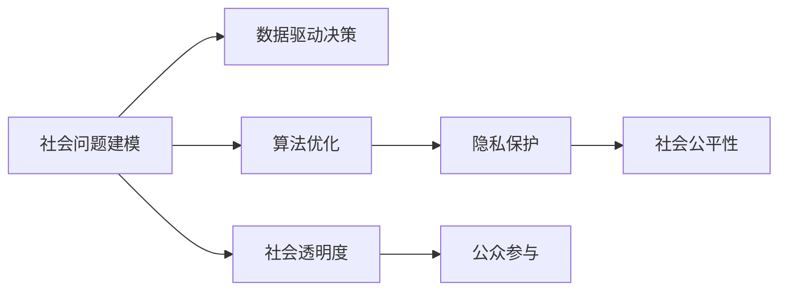

                 

# 科技向善：利用人类计算解决社会问题

> 关键词：科技伦理,人类计算,社会问题,人工智能,算法优化,智慧治理,可持续发展

## 1. 背景介绍

### 1.1 问题由来
随着科技的飞速发展，人工智能(AI)技术的不断进步，其在社会治理、环境保护、公共健康等各个领域的潜力和应用前景引起了广泛关注。然而，技术的双刃剑效应也带来了新的挑战和问题。如何在追求科技进步的同时，保障其伦理性和社会责任，成为了一个亟待解答的问题。

近年来，“科技向善”的理念被广泛提倡，即科技发展应以人的福祉为中心，解决现实问题，造福全人类。为此，研究人员和工程师们不断探索如何利用科技手段解决社会问题，并在实际应用中取得了一系列成果。本文将聚焦于人类计算这一重要方向，探讨其原理与实践，以期为解决社会问题提供新的思路和方法。

### 1.2 问题核心关键点
人类计算指的是通过计算模拟和优化人类社会活动的过程，利用AI技术对人类行为、经济、环境等进行分析和预测，为社会决策提供科学依据。其核心在于将社会问题建模为计算问题，通过算法优化来达成更好的社会治理效果。

人类计算的核心挑战在于以下几个方面：
1. 如何准确建模社会现象。社会现象的复杂性和多样性，使其建模难度大、风险高。
2. 如何设计高效的算法。社会问题通常具有动态性、不确定性，对算法的鲁棒性和可解释性要求高。
3. 如何保障数据隐私和安全。社会问题的数据往往涉及个人隐私，如何在算法设计中保障数据安全和隐私保护。
4. 如何落地应用并产生社会影响。如何将人类计算研究成果转化为实际的社会解决方案，带来正向社会影响。

这些挑战对人类计算提出了更高的要求，需要综合运用数学建模、算法设计、隐私保护、社会伦理等跨学科知识，才能实现科技向善的目标。

### 1.3 问题研究意义
在当前全球化、信息化、智能化的背景下，社会问题日趋复杂，单靠传统方法难以解决。利用人类计算，结合AI技术，可以有效提升社会治理的效率和质量，推动社会可持续发展。其研究意义主要体现在以下几个方面：

1. 提升社会治理效率。通过数据分析和建模，可以快速识别社会问题、预测发展趋势，为决策者提供科学依据。
2. 优化资源配置。在环境保护、交通管理、公共健康等领域，通过优化算法，合理配置资源，减少浪费，提高效率。
3. 促进公平与正义。通过算法公平性设计和隐私保护措施，确保技术应用中各类群体的利益平衡，避免技术加剧社会不平等。
4. 推动可持续发展。人类计算技术可以为全球环境监测、气候变化预测、自然灾害预警等提供有力支持，助力实现可持续发展目标。
5. 增强社会透明度。通过开放数据和算法，增加社会透明度，促进公众参与和监督，提升社会治理透明度和公信力。

## 2. 核心概念与联系

### 2.1 核心概念概述

为了更好地理解人类计算的核心概念，本节将介绍几个关键概念及其相互之间的联系：

- **社会问题建模**：将现实中的社会问题抽象成数学模型，通过算法求解和优化，找到最优或次优解决方案的过程。

- **算法优化**：包括机器学习、深度学习、运筹学等算法，通过数据驱动的方式，自动发现并优化解决方案，提升问题解决的效率和效果。

- **隐私保护**：在数据收集和处理过程中，采用匿名化、加密、差分隐私等手段，保护个人隐私，防止数据滥用。

- **社会公平性**：在算法设计中引入公平性原则，确保技术应用过程中各类群体公平受益，避免算法偏见和歧视。

- **数据驱动决策**：利用大数据技术，从海量数据中提取有效信息，辅助决策者进行科学决策，减少人为主观偏差。

这些核心概念之间的关系可以通过以下Mermaid流程图来展示：



这个流程图展示了社会问题建模、数据驱动决策、算法优化、隐私保护、社会公平性以及社会透明度等概念之间的逻辑关系。

## 3. 核心算法原理 & 具体操作步骤
### 3.1 算法原理概述

人类计算的算法原理主要基于数据驱动的决策过程，即通过收集和分析数据，构建数学模型，并通过算法优化找到最优或次优解决方案。其核心在于：

1. **数据收集与预处理**：从现实世界收集数据，并对数据进行清洗、标注、归一化等预处理，为建模提供高质量的数据输入。
2. **建模与优化**：构建社会问题的数学模型，并通过优化算法，自动寻找问题的最优解。常见的优化算法包括梯度下降、遗传算法、粒子群优化等。
3. **结果评估与验证**：对模型结果进行评估和验证，确保其准确性和鲁棒性，同时检测算法的公平性和隐私保护措施。
4. **实际应用与反馈**：将优化后的模型应用于实际社会问题中，评估其效果，并根据反馈进行调整和优化。

### 3.2 算法步骤详解

人类计算的算法步骤主要包括以下几个关键环节：

**Step 1: 数据收集与预处理**
- 确定需要解决的社会问题，设计数据收集方案，确保数据的全面性和代表性。
- 对数据进行清洗、去噪、归一化等预处理，去除异常值和噪声，确保数据的准确性和一致性。
- 设计合适的标注方案，对数据进行标注和分类，建立训练集、验证集和测试集。

**Step 2: 建模与算法选择**
- 选择合适的建模方法，如回归分析、分类算法、优化模型等。
- 根据问题特点和数据特征，选择适合的算法，如机器学习算法、深度学习算法、运筹学算法等。
- 设计合适的损失函数和优化目标，确保模型能够有效学习数据的规律和特征。

**Step 3: 模型训练与优化**
- 使用优化算法对模型进行训练，最小化损失函数，寻找最优解。
- 进行超参数调优，选择最佳的模型参数和超参数组合。
- 引入正则化、Dropout、Early Stopping等技术，防止过拟合，提高模型泛化能力。

**Step 4: 结果评估与验证**
- 在验证集上评估模型性能，确保其在未见数据上的表现良好。
- 对模型结果进行公平性分析，确保不同群体的利益得到平衡。
- 采用差分隐私、联邦学习等隐私保护措施，确保数据安全。

**Step 5: 实际应用与反馈**
- 将优化后的模型应用于实际社会问题中，评估其效果。
- 根据实际应用反馈，对模型进行调整和优化。
- 引入社会透明度机制，公开数据和算法，促进公众参与和监督。

### 3.3 算法优缺点

人类计算的算法具有以下优点：
1. 数据驱动的决策过程，能够更全面、客观地分析社会问题。
2. 算法优化使得问题求解高效，能够在短时间内找到可行方案。
3. 隐私保护和公平性设计，确保技术应用中的伦理性和社会责任。
4. 社会透明度增加，促进公众参与和监督，提升决策的公信力。

同时，该算法也存在以下缺点：
1. 数据质量对算法结果影响大，数据偏差可能导致模型偏见。
2. 算法复杂度高，需要专业知识和技能。
3. 数据隐私和安全风险，算法设计需要平衡数据利用和隐私保护。
4. 模型解释性不足，难以解释复杂决策过程。
5. 模型鲁棒性差，对异常数据和噪声敏感。

尽管存在这些局限性，但人类计算在解决社会问题方面依然具有重要的价值和应用前景。未来研究应致力于解决这些局限性，提升算法的可解释性和鲁棒性，同时探索新的数据源和算法，拓展人类计算的应用范围。

### 3.4 算法应用领域

人类计算的算法已在多个领域得到应用，主要包括：

1. **环境保护**：通过数据分析和建模，优化资源配置，提升环境治理效率。如水资源管理、空气质量监测、污染源追踪等。
2. **公共健康**：利用大数据分析疾病传播规律，预测疫情趋势，优化资源配置。如传染病预测、疫苗接种规划等。
3. **社会治理**：通过数据驱动决策，提升社会治理效率和公平性。如犯罪预防、公共安全、社会福利等。
4. **交通运输**：优化交通流量、减少拥堵，提升交通管理效率。如交通流量预测、智能交通管理等。
5. **城市规划**：利用数据和模型，优化城市规划和资源配置。如城市布局优化、公共服务配置等。

以上领域仅是冰山一角，人类计算在解决社会问题方面的应用前景广阔，未来还将进一步拓展到更多领域。

## 4. 数学模型和公式 & 详细讲解 & 举例说明
### 4.1 数学模型构建

社会问题通常具有复杂性和动态性，建模需要考虑多方面的因素。以下以城市交通流量预测为例，说明人类计算的建模过程。

**问题描述**：假设需要预测某一时间段内城市交通流量，可以将其建模为以下多目标优化问题：

$$
\min_{x} \left\{ \sum_{i=1}^n \ell_i(x) \right\}
$$

其中，$\ell_i(x)$ 表示第 $i$ 个目标函数的损失函数，包括流量预测误差、时间偏差、车辆数偏差等。

### 4.2 公式推导过程

以流量预测为例，可以通过交通流量预测模型进行建模和求解。假设历史流量数据为 $D=\{(x_t, y_t)\}_{t=1}^T$，其中 $x_t$ 表示时间 $t$ 的交通流量，$y_t$ 表示时间 $t$ 的实际交通流量。则流量预测问题可以建模为：

$$
\min_{\theta} \frac{1}{N} \sum_{i=1}^N \ell(D_i, \hat{y}_i)
$$

其中，$\ell$ 为损失函数，$\hat{y}_i$ 为模型预测的交通流量，$D_i$ 为实际流量数据。

为了提升预测精度，可以引入时间序列模型，如ARIMA、LSTM等，对流量数据进行建模和预测。假设使用LSTM模型进行预测，则模型结构如下：

$$
\hat{y} = f(\mathbf{X}, \theta)
$$

其中，$\mathbf{X}$ 为模型的输入特征，包括历史交通流量、天气情况、节假日等。$\theta$ 为模型的参数，$f$ 为LSTM模型的预测函数。

### 4.3 案例分析与讲解

以北京市交通流量预测为例，可以采用LSTM模型进行建模和预测。具体步骤如下：

1. 收集北京市的交通流量数据，包括历史交通流量、天气情况、节假日等。
2. 对数据进行预处理，包括归一化、去噪、特征选择等。
3. 设计LSTM模型的架构，包括输入层、LSTM层、输出层等。
4. 使用优化算法对模型进行训练，最小化预测误差。
5. 在验证集上评估模型性能，确保其泛化能力。
6. 将优化后的模型应用于实际交通流量预测中，评估其效果。

## 5. 项目实践：代码实例和详细解释说明
### 5.1 开发环境搭建

在进行人类计算的建模和预测实践前，需要准备好开发环境。以下是使用Python进行TensorFlow开发的流程：

1. 安装Anaconda：从官网下载并安装Anaconda，用于创建独立的Python环境。

2. 创建并激活虚拟环境：
```bash
conda create -n tf-env python=3.8 
conda activate tf-env
```

3. 安装TensorFlow：根据CUDA版本，从官网获取对应的安装命令。例如：
```bash
conda install tensorflow tensorflow-gpu=cuda11.1 -c conda-forge
```

4. 安装Pandas、NumPy、Matplotlib等工具包：
```bash
pip install pandas numpy matplotlib scikit-learn
```

5. 下载交通流量数据集：
```bash
wget http://www.cs.berkeley.edu/~brevoort/data/traffic-data.zip
unzip traffic-data.zip
```

完成上述步骤后，即可在`tf-env`环境中开始交通流量预测的实践。

### 5.2 源代码详细实现

以下是一个简单的LSTM模型进行北京市交通流量预测的代码实现：

```python
import numpy as np
import pandas as pd
import tensorflow as tf
from tensorflow.keras.models import Sequential
from tensorflow.keras.layers import LSTM, Dense, Dropout
from sklearn.preprocessing import MinMaxScaler

# 加载数据集
data = pd.read_csv('traffic-data.csv', parse_dates=['time'], index_col='time')
data = data.dropna().reset_index(drop=True)

# 数据预处理
scaler = MinMaxScaler(feature_range=(0, 1))
data['time'] = scaler.fit_transform(data['time'].values.reshape(-1, 1))
data[['inflow', 'outflow']] = scaler.fit_transform(data[['inflow', 'outflow']].values)

# 设计输入和输出
train_size = int(len(data) * 0.8)
test_size = len(data) - train_size
train_data, test_data = data[0:train_size], data[train_size:]

def create_dataset(data, look_back=1):
    X, Y = [], []
    for i in range(len(data)-look_back-1):
        X.append(data[i:(i+look_back), 0])
        Y.append(data[i+look_back, 0])
    return np.array(X), np.array(Y)

look_back = 10
X_train, Y_train = create_dataset(train_data, look_back)
X_test, Y_test = create_dataset(test_data, look_back)

# 设计LSTM模型
model = Sequential()
model.add(LSTM(50, input_shape=(look_back, 2), return_sequences=True))
model.add(Dropout(0.2))
model.add(LSTM(50))
model.add(Dropout(0.2))
model.add(Dense(1))

# 编译和训练模型
model.compile(loss='mse', optimizer='adam')
model.fit(X_train, Y_train, epochs=100, batch_size=32)

# 评估模型
test_pred = model.predict(X_test)
test_pred = scaler.inverse_transform(test_pred)
Y_test = scaler.inverse_transform(Y_test)

# 可视化结果
import matplotlib.pyplot as plt
plt.plot(test_pred[0], label='Predicted')
plt.plot(Y_test[0], label='Actual')
plt.legend()
plt.show()
```

### 5.3 代码解读与分析

以上代码实现了使用LSTM模型进行北京市交通流量预测的完整过程。下面对其关键部分进行详细解读：

**数据预处理**：
- 使用Pandas库加载交通流量数据集，并进行预处理，包括时间序列标准化和缺失值处理。
- 使用MinMaxScaler对数据进行归一化处理，确保数据在模型训练中的表现一致。

**数据设计**：
- 设计输入特征为前look_back个时间步的数据，输出为下一个时间步的流量数据。
- 设计LSTM模型的架构，包括输入层、LSTM层、输出层等。

**模型训练**：
- 使用TensorFlow的Keras API设计LSTM模型，并使用优化器进行训练，最小化预测误差。
- 使用测试集进行模型评估，验证模型的泛化能力。

**结果可视化**：
- 使用Matplotlib库将模型预测结果和实际流量数据进行可视化，直观展示模型效果。

通过以上代码，可以看出使用LSTM模型进行流量预测的过程，涵盖了数据预处理、模型设计、训练和评估等关键步骤。

## 6. 实际应用场景
### 6.1 智能交通管理

智能交通管理是交通流量预测的重要应用场景。通过利用LSTM等模型，可以实时预测交通流量，优化交通信号控制，减少拥堵，提升交通效率。具体实现包括：

1. 实时收集交通数据，如车辆位置、速度、交通信号等，作为模型输入。
2. 使用LSTM模型进行流量预测，生成交通流量预测曲线。
3. 根据预测曲线，优化交通信号灯的控制策略，实现交通流量的动态调控。

### 6.2 公共卫生管理

公共卫生管理是数据驱动决策的典型应用场景。通过数据分析和建模，可以预测疾病传播趋势，优化资源配置，提升公共卫生管理水平。具体实现包括：

1. 收集公共卫生数据，如病例数量、疫情分布、疫苗接种情况等。
2. 使用时间序列模型进行疾病传播趋势预测，生成预测曲线。
3. 根据预测曲线，优化资源配置，如疫苗接种、医疗资源分配等。

### 6.3 城市规划

城市规划是数据驱动决策的另一重要应用场景。通过数据分析和建模，可以优化城市资源配置，提升城市规划的科学性和合理性。具体实现包括：

1. 收集城市资源数据，如人口分布、交通流量、环境污染等。
2. 使用多目标优化模型进行城市规划设计，生成城市布局方案。
3. 根据城市布局方案，优化资源配置，如交通网络设计、公共服务配置等。

### 6.4 未来应用展望

未来，随着数据质量和计算能力的提升，人类计算的应用将更加广泛和深入，带来更多的社会变革。

1. **智能城市**：通过数据驱动的智慧城市建设，提升城市管理效率和智能化水平，推动社会可持续发展。
2. **智能医疗**：利用大数据和算法优化医疗资源配置，提升医疗服务质量和效率，促进健康中国建设。
3. **智能教育**：通过数据分析和建模，优化教育资源配置，提升教育质量和公平性，实现教育现代化。
4. **智能环保**：利用大数据和算法优化环境保护和资源配置，提升环境治理效率，助力生态文明建设。
5. **智能安全**：通过数据分析和建模，优化公共安全管理，提升社会治理水平，保障公众安全。

## 7. 工具和资源推荐
### 7.1 学习资源推荐

为了帮助开发者系统掌握人类计算的理论基础和实践技巧，这里推荐一些优质的学习资源：

1. 《Deep Learning for Social Good》课程：斯坦福大学开设的课程，介绍了数据驱动决策在公共卫生、环境保护、社会治理等领域的应用。
2. 《Human-Centered AI》书籍：吴恩达等学者共同编写的书籍，详细介绍了人类计算和数据驱动决策的基本概念和实践方法。
3. 《Data-Driven Social Science》课程：由MIT和UC Berkeley联合开设的课程，介绍了数据科学在社会科学研究中的应用。
4. 《Machine Learning in Healthcare》课程：由Johns Hopkins大学开设的课程，介绍了机器学习在医疗健康领域的应用。
5. 《Big Data and Healthcare》论文集：包含多篇大数据和机器学习在医疗健康领域的研究论文，展示了最新的研究成果和技术进展。

通过对这些资源的学习实践，相信你一定能够快速掌握人类计算的精髓，并用于解决实际的社会问题。

### 7.2 开发工具推荐

高效的开发离不开优秀的工具支持。以下是几款用于人类计算开发的常用工具：

1. TensorFlow：由Google主导开发的开源深度学习框架，生产部署方便，适合大规模工程应用。

2. PyTorch：基于Python的开源深度学习框架，灵活动态的计算图，适合快速迭代研究。

3. Scikit-learn：用于数据预处理、特征工程、模型评估等任务的机器学习库，功能强大，易于使用。

4. Pandas：用于数据处理和分析的Python库，支持高效的数据读写、清洗、转换等操作。

5. Matplotlib：用于数据可视化的Python库，支持多种图表展示方式，直观展示数据结果。

6. TensorBoard：TensorFlow配套的可视化工具，可实时监测模型训练状态，提供丰富的图表呈现方式。

合理利用这些工具，可以显著提升人类计算任务的开发效率，加快创新迭代的步伐。

### 7.3 相关论文推荐

人类计算的研究源于学界的持续研究。以下是几篇奠基性的相关论文，推荐阅读：

1. 《The Potential Impact of AI on Society》：探讨了AI技术对社会的影响，强调了技术伦理和负责任创新的重要性。

2. 《Data-Driven Social Science: Review of Empirical Research》：综述了数据科学在社会科学领域的研究成果和技术进展。

3. 《Human-Centered AI: Bridging the Gap Between Humans and Machines》：讨论了AI技术的社会影响和伦理责任，提出了“人类中心”的设计原则。

4. 《Machine Learning in Healthcare: Promises and Challenges》：讨论了机器学习在医疗健康领域的应用前景和挑战。

5. 《AI for Social Good: Opportunities and Challenges》：探讨了AI技术在公共卫生、环境保护、教育等领域的潜在应用。

这些论文代表了大数据和算法在解决社会问题方面的发展脉络。通过学习这些前沿成果，可以帮助研究者把握学科前进方向，激发更多的创新灵感。

## 8. 总结：未来发展趋势与挑战
### 8.1 总结

本文对人类计算的原理与实践进行了全面系统的介绍。首先阐述了人类计算的背景和意义，明确了其在解决社会问题方面的重要价值。其次，从原理到实践，详细讲解了数据驱动决策的数学模型和算法步骤，给出了模型开发的完整代码实例。同时，本文还广泛探讨了人类计算在智能交通、公共卫生、城市规划等多个领域的应用前景，展示了其在社会治理中的巨大潜力。此外，本文精选了人类计算学习的各类资源，力求为开发者提供全方位的技术指引。

通过本文的系统梳理，可以看到，人类计算作为解决社会问题的重要手段，正日益受到广泛关注。通过数据驱动决策，可以有效提升社会治理的效率和公平性，推动可持续发展。未来，随着数据质量和计算能力的提升，人类计算的应用将更加广泛和深入，为社会治理带来更多创新和突破。

### 8.2 未来发展趋势

展望未来，人类计算的研究和应用将呈现以下几个发展趋势：

1. **跨学科融合**：人类计算将进一步融合计算机科学、社会科学、经济学、环境科学等多学科知识，形成更加综合和全面的解决方案。
2. **数据质量提升**：大数据技术和数据治理措施将进一步提升数据质量，减少数据偏差，提高模型预测的准确性和公平性。
3. **模型优化和解释**：更加高效和可解释的模型将逐步取代传统黑盒模型，提升决策的透明性和可解释性。
4. **隐私保护加强**：数据隐私和安全保护技术将进一步发展，保障数据在模型训练和应用中的安全性和隐私性。
5. **智能决策支持**：通过数据驱动决策，优化资源配置和政策制定，提升社会治理的智能化水平。
6. **社会责任提升**：在模型设计和应用中，更加注重社会公平和伦理责任，推动科技向善。

这些趋势展示了人类计算技术在解决社会问题方面的广阔前景。这些方向的探索发展，必将进一步提升人类计算技术的社会价值和应用范围。

### 8.3 面临的挑战

尽管人类计算在解决社会问题方面取得了显著进展，但在迈向更加智能化、普适化应用的过程中，它仍面临诸多挑战：

1. **数据质量和多样性**：数据质量差、数据偏差、数据不完整等问题，会导致模型预测结果不准确，影响决策效果。
2. **算法复杂性**：人类计算算法复杂度高，需要专业知识和技能，增加了模型开发和应用的难度。
3. **隐私和安全风险**：数据隐私和安全保护技术仍需不断完善，防止数据滥用和泄露。
4. **模型可解释性**：数据驱动模型往往难以解释其内部工作机制，导致决策缺乏透明度和信任度。
5. **公平性和偏见**：模型设计和应用中需避免算法偏见和歧视，确保各类群体的利益平衡。
6. **伦理和社会责任**：在模型设计和应用中需考虑伦理和社会责任，防止技术滥用和负面影响。

这些挑战对人类计算提出了更高的要求，需要从技术、伦理、社会等多个方面进行综合应对，才能真正实现科技向善的目标。

### 8.4 研究展望

面对人类计算面临的挑战，未来的研究需要在以下几个方面寻求新的突破：

1. **数据增强技术**：通过数据增强和合成数据生成技术，提升数据质量和多样性，减少数据偏差。
2. **模型可解释性**：引入因果分析和博弈论工具，增强模型解释性和透明度，提升决策信任度。
3. **隐私保护技术**：采用差分隐私、联邦学习等技术，保障数据隐私和安全，防止数据滥用。
4. **算法优化**：开发更加高效和可解释的模型，提升模型预测精度和公平性。
5. **社会伦理研究**：在模型设计和应用中，引入社会伦理和公平性原则，确保技术应用的社会责任和伦理导向。
6. **多学科融合**：结合计算机科学、社会科学、经济学、环境科学等多学科知识，形成更加全面和综合的解决方案。

这些研究方向的探索，必将引领人类计算技术迈向更高的台阶，为解决社会问题提供更加科学、合理、高效的解决方案。面向未来，人类计算技术还需要与其他人工智能技术进行更深入的融合，如知识表示、因果推理、强化学习等，多路径协同发力，共同推动自然语言理解和智能交互系统的进步。只有勇于创新、敢于突破，才能不断拓展人类计算技术的边界，让智能技术更好地造福人类社会。

## 9. 附录：常见问题与解答

**Q1：人类计算是否适用于所有社会问题？**

A: 人类计算适用于绝大多数社会问题，特别是那些具有显著数据特征和规律的问题。但对于一些特定领域的复杂问题，如法律、伦理等，仍需结合专业知识和经验，进行针对性设计和分析。

**Q2：如何选择合适的模型和算法？**

A: 选择合适的模型和算法需要综合考虑问题的特点、数据的质量和规模、计算资源等因素。一般建议从简单的模型和算法开始尝试，逐步优化，最终选择最优解。常用的模型和算法包括线性回归、决策树、随机森林、深度学习、强化学习等。

**Q3：数据隐私和安全如何保障？**

A: 数据隐私和安全保障可以从以下几个方面入手：
1. 数据匿名化处理，去除个人标识信息。
2. 采用差分隐私技术，限制数据分析结果对个体数据的依赖。
3. 引入联邦学习技术，在模型训练过程中不共享原始数据。
4. 加强数据存储和传输的安全措施，防止数据泄露和攻击。

**Q4：模型公平性和偏见如何避免？**

A: 模型公平性和偏见避免可以从以下几个方面入手：
1. 在数据预处理阶段，进行数据去偏处理，去除数据中的偏见。
2. 在设计算法时，引入公平性约束，如Bias-Correcting Fairness等。
3. 对模型进行公平性评估，确保不同群体的利益得到平衡。
4. 定期监测和调整模型，避免模型随着时间的推移产生偏见。

这些措施可以显著降低模型偏见和歧视的风险，确保模型公平性和可靠性。

**Q5：如何评估和验证模型效果？**

A: 模型评估和验证可以通过以下步骤进行：
1. 在验证集上评估模型性能，确保其在未见数据上的表现良好。
2. 对模型结果进行公平性分析，确保不同群体的利益得到平衡。
3. 采用差分隐私、联邦学习等隐私保护措施，确保数据安全。
4. 根据实际应用反馈，对模型进行调整和优化。

通过这些评估和验证步骤，可以全面了解模型的表现，确保其适用于实际应用。

---

作者：禅与计算机程序设计艺术 / Zen and the Art of Computer Programming

