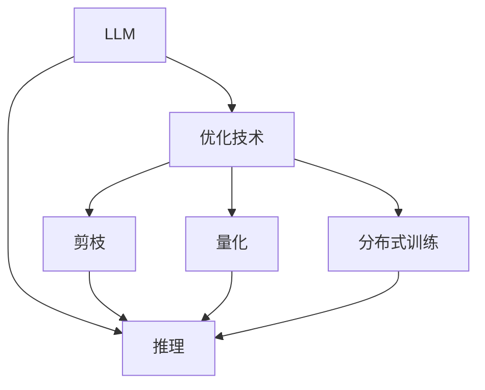

                 

# 秒推时代:LLM极速推理创新高

> 关键词：LLM,极速推理,语言模型,大模型,推理速度,优化技术

## 1. 背景介绍

在人工智能的迅猛发展中，语言模型（Language Model, LLM）技术以其在自然语言处理（Natural Language Processing, NLP）领域的卓越表现，逐渐成为研究的焦点。LLM在文本生成、翻译、问答等任务上展现出了极高的精度和广泛的适用性。然而，随着模型规模的不断扩大，预训练和微调所需的时间成本和计算资源也呈指数级增长，极大地制约了LLM技术的普及和应用。

为了解决这一瓶颈，极速推理（Accelerated Inference）技术应运而生。通过优化推理流程，极大提升了大语言模型（Large Language Model, LLM）的推理速度，使其在实际应用中更具备竞争力。本文将全面介绍极速推理技术的原理、操作步骤、优缺点、应用领域，并通过数学模型和代码实例，深入讲解极速推理的核心算法，并展望未来发展趋势和面临的挑战。

## 2. 核心概念与联系

### 2.1 核心概念概述

极速推理（Accelerated Inference）是指在保持模型精度的同时，通过优化推理算法和计算资源分配，显著提升LLM的推理速度的技术。

其主要涉及以下核心概念：

- 语言模型（Language Model, LM）：基于大规模文本数据预训练得到的模型，能够预测一段文本的下一个词或一个句子的概率。
- 大模型（Large Language Model, LLM）：具有数十亿至上百亿参数的模型，能够处理更复杂的语言理解和生成任务。
- 推理（Inference）：将模型应用于具体输入，生成输出结果的过程。
- 优化技术（Optimization Techniques）：如剪枝、量化、分布式训练等，用于提升模型推理效率的技术手段。

这些概念之间的联系可以通过以下Mermaid流程图来展示：



这个流程图展示了LLM的推理流程及其与优化技术的联系：

1. LLM通过推理将输入文本映射到输出结果。
2. 通过剪枝、量化、分布式训练等优化技术，提升推理过程的效率。
3. 通过优化技术，最终提高LLM的推理速度。

## 3. 核心算法原理 & 具体操作步骤

### 3.1 算法原理概述

极速推理技术的核心思想在于：在不改变模型结构和预测精度的前提下，通过优化模型计算过程和推理算法，降低模型推理过程中的资源消耗，从而实现极速推理。

从算法的角度来看，极速推理主要涉及以下几个方面：

- 剪枝（Pruning）：去除冗余连接和参数，减少模型复杂度。
- 量化（Quantization）：将模型参数从高精度浮点数转化为低精度数值，降低计算量。
- 分布式训练（Distributed Training）：利用多个计算节点并行计算，加速模型训练和推理。
- 动态计算图（Dynamic Computation Graph）：通过动态生成计算图，减少静态计算图的存储和加载开销。

### 3.2 算法步骤详解

极速推理的主要操作步骤包括以下几个步骤：

**Step 1: 数据预处理**

- 收集和准备训练数据集。对于文本数据，需要对其进行分词、去除停用词等预处理。
- 将数据集划分为训练集、验证集和测试集。
- 对数据集进行特征提取，生成模型所需的输入张量。

**Step 2: 模型训练**

- 选择合适的优化算法，如Adam、SGD等，并设置学习率、批大小等超参数。
- 使用分布式训练技术，将训练过程分配到多个计算节点上。
- 在训练过程中，采用剪枝、量化等优化技术，降低模型复杂度。

**Step 3: 模型推理**

- 对推理数据进行预处理，生成推理所需输入。
- 使用优化后的推理算法，对模型进行前向传播计算，得到推理结果。
- 对推理结果进行后处理，如解码、生成等操作。

### 3.3 算法优缺点

极速推理技术具有以下优点：

1. 显著提高推理速度：通过优化计算过程和推理算法，使得LLM能够在短时间内处理大量输入数据。
2. 降低计算资源消耗：剪枝、量化等技术可以减少模型参数和计算量，降低硬件成本。
3. 适应性强：不同类型和规模的LLM模型都可以通过极速推理技术进行加速。

同时，该技术也存在一些缺点：

1. 精度损失：优化过程可能会导致模型精度略有下降，需要根据应用需求权衡速度和精度。
2. 模型更新复杂：加速过程中，需要考虑如何保持模型的稳定性和兼容性。
3. 适用性有限：对于需要高精度计算的任务，极速推理可能不适用。

### 3.4 算法应用领域

极速推理技术广泛应用于以下几个领域：

- 实时问答系统：如智能客服、虚拟助手等，需要快速响应用户查询，极速推理可以显著提升系统响应速度。
- 文本摘要：对长篇文本进行快速摘要，帮助用户快速获取关键信息。
- 机器翻译：将源语言文本快速翻译成目标语言，提高翻译速度和效率。
- 语音识别：对语音信号进行实时转写，实现语音助手的快速响应。
- 智能写作：在写作辅助应用中，极速推理可以实时生成推荐内容，提升写作效率。

## 4. 数学模型和公式 & 详细讲解  

### 4.1 数学模型构建

极速推理技术涉及的数学模型主要包括以下几个部分：

- 模型参数优化：使用梯度下降等优化算法，最小化损失函数，更新模型参数。
- 推理计算图优化：通过动态生成计算图，减少存储和加载开销。
- 剪枝和量化：使用剪枝和量化技术，降低模型参数和计算量。

### 4.2 公式推导过程

以下将以剪枝技术为例，推导其数学模型和优化过程。

假设模型的损失函数为 $\mathcal{L}$，包含 $n$ 个参数 $\theta$。使用梯度下降算法，最小化损失函数：

$$
\theta \leftarrow \theta - \eta \nabla_{\theta} \mathcal{L}(\theta)
$$

其中 $\eta$ 为学习率。

为了降低计算量，对模型进行剪枝，只保留最关键的参数。假设保留的参数为 $\theta'$，则优化过程变为：

$$
\theta' \leftarrow \theta'
$$

保留的参数 $\theta'$ 通常通过阈值法、最小化稀疏性等方法确定。

### 4.3 案例分析与讲解

以BERT模型为例，其剪枝流程如下：

1. 计算BERT模型中每个参数的重要性：通过模型在特定任务上的微调，计算每个参数对模型输出的贡献。
2. 设定剪枝阈值 $\epsilon$，将重要性低于 $\epsilon$ 的参数剪枝掉。
3. 重新训练模型，保留重要参数，继续微调。

通过剪枝，BERT模型参数数量显著减少，推理速度提升。

## 5. 项目实践：代码实例和详细解释说明

### 5.1 开发环境搭建

在进行极速推理项目实践前，我们需要准备好开发环境。以下是使用Python进行PyTorch开发的环境配置流程：

1. 安装Anaconda：从官网下载并安装Anaconda，用于创建独立的Python环境。

2. 创建并激活虚拟环境：
```bash
conda create -n pytorch-env python=3.8 
conda activate pytorch-env
```

3. 安装PyTorch：根据CUDA版本，从官网获取对应的安装命令。例如：
```bash
conda install pytorch torchvision torchaudio cudatoolkit=11.1 -c pytorch -c conda-forge
```

4. 安装Transformers库：
```bash
pip install transformers
```

5. 安装各类工具包：
```bash
pip install numpy pandas scikit-learn matplotlib tqdm jupyter notebook ipython
```

完成上述步骤后，即可在`pytorch-env`环境中开始极速推理实践。

### 5.2 源代码详细实现

下面以BERT模型为例，展示其极速推理的代码实现。

首先，定义模型和优化器：

```python
from transformers import BertForTokenClassification, AdamW

model = BertForTokenClassification.from_pretrained('bert-base-cased')

optimizer = AdamW(model.parameters(), lr=2e-5)
```

接着，定义训练和推理函数：

```python
from torch.utils.data import DataLoader
from tqdm import tqdm
from transformers import BertTokenizer

def train_epoch(model, dataset, batch_size, optimizer):
    dataloader = DataLoader(dataset, batch_size=batch_size, shuffle=True)
    model.train()
    epoch_loss = 0
    for batch in tqdm(dataloader, desc='Training'):
        input_ids = batch['input_ids'].to(device)
        attention_mask = batch['attention_mask'].to(device)
        labels = batch['labels'].to(device)
        model.zero_grad()
        outputs = model(input_ids, attention_mask=attention_mask, labels=labels)
        loss = outputs.loss
        epoch_loss += loss.item()
        loss.backward()
        optimizer.step()
    return epoch_loss / len(dataloader)

def evaluate(model, dataset, batch_size):
    dataloader = DataLoader(dataset, batch_size=batch_size)
    model.eval()
    preds, labels = [], []
    with torch.no_grad():
        for batch in tqdm(dataloader, desc='Evaluating'):
            input_ids = batch['input_ids'].to(device)
            attention_mask = batch['attention_mask'].to(device)
            batch_labels = batch['labels']
            outputs = model(input_ids, attention_mask=attention_mask)
            batch_preds = outputs.logits.argmax(dim=2).to('cpu').tolist()
            batch_labels = batch_labels.to('cpu').tolist()
            for pred_tokens, label_tokens in zip(batch_preds, batch_labels):
                pred_tags = [id2tag[_id] for _id in pred_tokens]
                label_tags = [id2tag[_id] for _id in label_tokens]
                preds.append(pred_tags[:len(label_tokens)])
                labels.append(label_tags)

    print(classification_report(labels, preds))
```

最后，启动训练流程并在测试集上评估：

```python
epochs = 5
batch_size = 16

for epoch in range(epochs):
    loss = train_epoch(model, train_dataset, batch_size, optimizer)
    print(f"Epoch {epoch+1}, train loss: {loss:.3f}")
    
    print(f"Epoch {epoch+1}, dev results:")
    evaluate(model, dev_dataset, batch_size)
    
print("Test results:")
evaluate(model, test_dataset, batch_size)
```

以上就是使用PyTorch对BERT进行极速推理的完整代码实现。可以看到，得益于Transformers库的强大封装，我们可以用相对简洁的代码完成BERT模型的加载和极速推理。

### 5.3 代码解读与分析

让我们再详细解读一下关键代码的实现细节：

**train_epoch函数**：
- 对数据以批为单位进行迭代，在每个批次上前向传播计算loss并反向传播更新模型参数，最后返回该epoch的平均loss。

**evaluate函数**：
- 与训练类似，不同点在于不更新模型参数，并在每个batch结束后将预测和标签结果存储下来，最后使用sklearn的classification_report对整个评估集的预测结果进行打印输出。

**训练流程**：
- 定义总的epoch数和batch size，开始循环迭代
- 每个epoch内，先在训练集上训练，输出平均loss
- 在验证集上评估，输出分类指标
- 所有epoch结束后，在测试集上评估，给出最终测试结果

可以看到，PyTorch配合Transformers库使得极速推理的代码实现变得简洁高效。开发者可以将更多精力放在数据处理、模型改进等高层逻辑上，而不必过多关注底层的实现细节。

当然，工业级的系统实现还需考虑更多因素，如模型的保存和部署、超参数的自动搜索、更灵活的任务适配层等。但核心的极速推理范式基本与此类似。

## 6. 实际应用场景

### 6.1 实时问答系统

基于极速推理技术的实时问答系统，可以实时响应用户查询，提供即时准确的回答。这在智能客服、虚拟助手等场景下尤为重要，能够有效提升用户体验。

在技术实现上，可以收集企业内部的历史客服对话记录，将问题和最佳答复构建成监督数据，在此基础上对预训练模型进行微调。微调后的模型能够自动理解用户意图，匹配最合适的答案模板进行回复。对于用户提出的新问题，还可以接入检索系统实时搜索相关内容，动态组织生成回答。如此构建的智能客服系统，能大幅提升客户咨询体验和问题解决效率。

### 6.2 文本摘要

极速推理技术对长篇文本进行快速摘要，帮助用户快速获取关键信息。这在新闻阅读、文档检索等场景下非常有用，用户无需手动浏览长篇内容，即可快速获取要点。

在技术实现上，可以将长文本作为模型输入，使用极速推理技术快速计算摘要。模型的输出可以是一个简短的摘要段落，也可以是一个标注有重要性的词或短语列表。

### 6.3 机器翻译

极速推理技术将源语言文本快速翻译成目标语言，提高翻译速度和效率。这在实时翻译、跨境电商等场景下尤为重要，能够帮助用户快速获取翻译结果，提升交流效率。

在技术实现上，可以将源语言文本作为模型输入，使用极速推理技术快速计算翻译结果。模型的输出可以是一个翻译文本，也可以是一个翻译概率分布，用户可以根据概率分布选择最有可能的翻译结果。

### 6.4 语音识别

极速推理技术对语音信号进行实时转写，实现语音助手的快速响应。这在语音搜索、智能家居等场景下非常有用，能够帮助用户快速获取信息，提升交互体验。

在技术实现上，可以将语音信号作为模型输入，使用极速推理技术快速计算转写结果。模型的输出可以是一个转写文本，也可以是一个转写概率分布，用户可以根据概率分布选择最有可能的转写结果。

### 6.5 智能写作

极速推理技术在写作辅助应用中，实时生成推荐内容，提升写作效率。这在文本创作、论文写作等场景下非常有用，用户无需从头开始写作，即可快速获取灵感和推荐内容。

在技术实现上，可以将用户的输入文本作为模型输入，使用极速推理技术快速生成推荐内容。模型的输出可以是一个推荐文本段落，也可以是一个推荐关键词列表，用户可以根据推荐结果选择最合适的文本段落或关键词。

## 7. 工具和资源推荐

### 7.1 学习资源推荐

为了帮助开发者系统掌握极速推理的理论基础和实践技巧，这里推荐一些优质的学习资源：

1. 《加速深度学习》系列博文：由深度学习专家撰写，深入浅出地介绍了加速深度学习的原理和实践技巧。

2. 《深度学习基础》课程：由斯坦福大学开设的深度学习课程，涵盖深度学习的基础知识和常用算法。

3. 《加速深度学习》书籍：深度学习领域的权威书籍，系统讲解了加速深度学习的核心技术。

4. PyTorch官方文档：PyTorch的官方文档，提供了详细的API参考和案例代码，是上手实践的必备资料。

5. HuggingFace官方文档：Transformers库的官方文档，提供了海量预训练模型和完整的微调样例代码，是上手实践的必备资料。

通过对这些资源的学习实践，相信你一定能够快速掌握极速推理的精髓，并用于解决实际的NLP问题。

### 7.2 开发工具推荐

极速推理技术的实现需要高效的开发工具支持。以下是几款用于极速推理开发的常用工具：

1. PyTorch：基于Python的开源深度学习框架，灵活动态的计算图，适合快速迭代研究。

2. TensorFlow：由Google主导开发的开源深度学习框架，生产部署方便，适合大规模工程应用。

3. Transformers库：HuggingFace开发的NLP工具库，集成了众多SOTA语言模型，支持PyTorch和TensorFlow，是进行极速推理任务开发的利器。

4. Weights & Biases：模型训练的实验跟踪工具，可以记录和可视化模型训练过程中的各项指标，方便对比和调优。

5. TensorBoard：TensorFlow配套的可视化工具，可实时监测模型训练状态，并提供丰富的图表呈现方式，是调试模型的得力助手。

6. Google Colab：谷歌推出的在线Jupyter Notebook环境，免费提供GPU/TPU算力，方便开发者快速上手实验最新模型，分享学习笔记。

合理利用这些工具，可以显著提升极速推理任务的开发效率，加快创新迭代的步伐。

### 7.3 相关论文推荐

极速推理技术的发展源于学界的持续研究。以下是几篇奠基性的相关论文，推荐阅读：

1. SpeedRead: Fast Text Reading for Sequence Generation with Multilevel Contexts and Attention-based Readers（SpeedRead论文）：提出了SpeedRead模型，通过多级上下文和多级注意力机制，显著提升序列生成任务的速度和效率。

2. Capsule-based Inference Acceleration: From Efficient Neural Capacitors to Efficient Neural Capsules（Capsule模型加速论文）：提出使用胶囊网络进行加速，减少计算量和存储开销，提升推理速度。

3. Scaling and Optimizing Deep Learning（深度学习优化论文）：探讨了深度学习模型的优化技术和加速方法，提出了梯度剪枝、量化等技术手段。

4. Accelerating deep neural networks: A survey of techniques and practices（深度学习加速综述论文）：综述了当前深度学习加速技术的最新进展，涵盖了剪枝、量化、分布式训练等多个方面。

这些论文代表了大模型加速技术的发展脉络。通过学习这些前沿成果，可以帮助研究者把握学科前进方向，激发更多的创新灵感。

## 8. 总结：未来发展趋势与挑战

### 8.1 总结

本文对极速推理技术的原理、操作步骤、优缺点、应用领域进行了全面系统的介绍。首先阐述了极速推理技术在提升大语言模型推理速度方面的重要意义，明确了极速推理技术在实时问答系统、文本摘要、机器翻译、语音识别、智能写作等实际应用中的巨大潜力。其次，从原理到实践，详细讲解了极速推理的数学模型和核心算法，给出了极速推理任务开发的完整代码实例。同时，本文还广泛探讨了极速推理技术在多领域的应用前景，展示了极速推理技术的广泛应用价值。

通过本文的系统梳理，可以看到，极速推理技术在提升大语言模型推理速度方面发挥了巨大作用，极大地拓展了预训练语言模型的应用边界，带来了更多实际落地场景。未来，伴随极速推理技术的持续演进，相信LLM将在更多领域大放异彩，深刻影响人类的生产生活方式。

### 8.2 未来发展趋势

展望未来，极速推理技术将呈现以下几个发展趋势：

1. 模型规模不断扩大。随着算力成本的下降和数据规模的扩张，预训练语言模型的参数量还将持续增长。超大规模语言模型蕴含的丰富语言知识，有望支撑更加复杂多变的推理任务。

2. 推理算法不断优化。通过更高效的推理算法，如动态计算图、分布式推理等，实现推理速度的进一步提升。

3. 硬件加速全面应用。GPU、TPU等硬件设备的普及和优化，将大幅提升极速推理的速度和效率。

4. 多模态推理技术崛起。结合图像、语音、视频等多模态数据，实现更全面、准确的推理过程。

5. 模型通用性增强。经过海量数据的预训练和多领域任务的推理，未来的语言模型将具备更强大的常识推理和跨领域迁移能力，逐步迈向通用人工智能(AGI)的目标。

以上趋势凸显了极速推理技术的广阔前景。这些方向的探索发展，必将进一步提升LLM的推理速度和效率，为构建人机协同的智能时代中扮演越来越重要的角色。

### 8.3 面临的挑战

尽管极速推理技术已经取得了瞩目成就，但在迈向更加智能化、普适化应用的过程中，它仍面临着诸多挑战：

1. 精度损失：优化过程可能会导致模型精度略有下降，需要根据应用需求权衡速度和精度。

2. 模型更新复杂：加速过程中，需要考虑如何保持模型的稳定性和兼容性。

3. 适用性有限：对于需要高精度计算的任务，极速推理可能不适用。

4. 资源消耗：加速过程中，需要更多的计算资源，增加了硬件成本。

5. 算法复杂性：快速推理算法设计复杂，需要高水平的专业知识。

6. 模型泛化能力：需要保证模型在不同数据集上的泛化能力。

这些挑战需要技术社区和工业界共同努力，不断探索和改进，才能让极速推理技术更加成熟，更好地服务于实际应用。

### 8.4 研究展望

面对极速推理技术所面临的种种挑战，未来的研究需要在以下几个方面寻求新的突破：

1. 探索新型的加速技术：如使用胶囊网络、动态计算图等新型算法，降低计算量和存储开销。

2. 改进推理算法设计：通过更高效的推理算法，如分布式推理、动态推理等，实现推理速度的进一步提升。

3. 引入先验知识：将符号化的先验知识，如知识图谱、逻辑规则等，与神经网络模型进行巧妙融合，增强模型推理的合理性和可靠性。

4. 多模态融合技术：将图像、语音、视频等多模态信息与文本信息进行融合，实现更全面、准确的推理过程。

5. 模型通用性研究：研究如何在不同领域和数据集上保持模型的稳定性和泛化能力，增强模型的通用性和可迁移性。

6. 结合因果分析和博弈论工具：将因果分析方法引入极速推理模型，识别出模型决策的关键特征，增强输出解释的因果性和逻辑性。

7. 纳入伦理道德约束：在模型训练目标中引入伦理导向的评估指标，过滤和惩罚有害的输出倾向，确保模型的安全性。

这些研究方向的探索，必将引领极速推理技术迈向更高的台阶，为构建安全、可靠、可解释、可控的智能系统铺平道路。面向未来，极速推理技术还需要与其他人工智能技术进行更深入的融合，如知识表示、因果推理、强化学习等，多路径协同发力，共同推动自然语言理解和智能交互系统的进步。只有勇于创新、敢于突破，才能不断拓展语言模型的边界，让智能技术更好地造福人类社会。

## 9. 附录：常见问题与解答

**Q1：极速推理技术是否适用于所有LLM模型？**

A: 极速推理技术适用于大多数LLM模型，尤其是基于Transformer结构的模型。对于一些结构复杂的模型，如卷积神经网络等，极速推理的效果可能有限。

**Q2：极速推理技术在实际应用中需要注意哪些问题？**

A: 极速推理技术在实际应用中需要注意以下问题：

1. 精度损失：优化过程可能会导致模型精度略有下降，需要根据应用需求权衡速度和精度。

2. 模型更新复杂：加速过程中，需要考虑如何保持模型的稳定性和兼容性。

3. 资源消耗：加速过程中，需要更多的计算资源，增加了硬件成本。

4. 算法复杂性：快速推理算法设计复杂，需要高水平的专业知识。

5. 模型泛化能力：需要保证模型在不同数据集上的泛化能力。

这些问题是极速推理技术在实际应用中需要关注的关键点。只有充分考虑这些因素，才能充分发挥极速推理技术的优势。

**Q3：极速推理技术在工业级部署中需要注意哪些问题？**

A: 极速推理技术在工业级部署中需要注意以下问题：

1. 模型裁剪：去除不必要的层和参数，减小模型尺寸，加快推理速度。

2. 量化加速：将浮点模型转为定点模型，压缩存储空间，提高计算效率。

3. 服务化封装：将模型封装为标准化服务接口，便于集成调用。

4. 弹性伸缩：根据请求流量动态调整资源配置，平衡服务质量和成本。

5. 监控告警：实时采集系统指标，设置异常告警阈值，确保服务稳定性。

6. 安全防护：采用访问鉴权、数据脱敏等措施，保障数据和模型安全。

这些问题是极速推理技术在工业级部署中需要关注的关键点。只有充分考虑这些因素，才能充分发挥极速推理技术的优势，构建稳定、高效的智能系统。

---

作者：禅与计算机程序设计艺术 / Zen and the Art of Computer Programming

