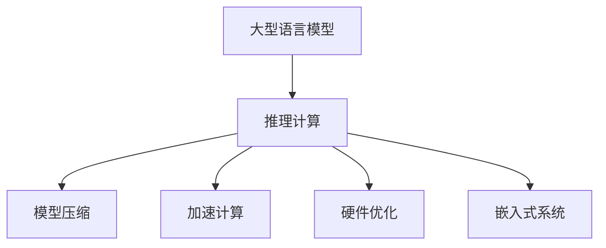

                 

# 秒推时代:LLM极速推理开启新纪元

> 关键词：LLM,极速推理,加速计算,模型压缩,硬件优化,自然语言处理(NLP),嵌入式系统

## 1. 背景介绍

### 1.1 问题由来
随着深度学习技术的飞速发展，大型语言模型(LLM)如GPT-3、BERT等在自然语言处理(NLP)领域取得了革命性的进展。这些模型通过在大规模文本数据上预训练，能够捕捉到丰富的语言规律和语义关系。然而，这些模型庞大的参数量和计算需求限制了它们在实际应用中的效率。极速推理是提高LLM性能、满足实时应用需求的关键技术。

### 1.2 问题核心关键点
LLM极速推理旨在通过优化模型结构和算法，大幅度减少推理时间和内存占用，使得大模型能够快速响应实时任务。主要包括以下关键点：

- 模型压缩：减小模型尺寸，减少参数量，加速推理。
- 加速计算：通过优化算法和硬件加速，提高推理效率。
- 硬件优化：利用专用硬件如GPU、TPU、FPGA等，提升模型计算能力。
- 嵌入式系统：针对特定嵌入式设备的需求，设计轻量级、低延迟的推理引擎。

这些技术手段的协同应用，能够在保持模型性能的前提下，显著降低推理时间和内存消耗，使得LLM能够在实际应用中发挥更大潜力。

## 2. 核心概念与联系

### 2.1 核心概念概述

为更好地理解LLM极速推理的技术内涵，本节将介绍几个核心概念：

- 大型语言模型(LLM)：指通过大规模预训练学习到通用语言表示的深度神经网络模型，如GPT-3、BERT等。
- 推理计算：指模型输入数据后，通过前向传播计算得到输出结果的过程。
- 模型压缩：指通过量化、剪枝、蒸馏等技术，减小模型尺寸，提高推理速度。
- 加速计算：指利用并行计算、矩阵优化等手段，提升推理效率。
- 硬件优化：指利用专用硬件如GPU、TPU、FPGA等，实现模型计算加速。
- 嵌入式系统：指将推理引擎部署到资源受限的嵌入式设备上，满足低延迟、低功耗的需求。

这些概念之间的逻辑关系可以通过以下Mermaid流程图来展示：



这个流程图展示了大模型极速推理的核心概念及其之间的关系：

1. 大模型通过推理计算产生输出结果。
2. 推理过程可以通过模型压缩、加速计算、硬件优化等手段进行优化。
3. 最终目标是在嵌入式设备上实现低延迟、高效能的推理服务。

## 3. 核心算法原理 & 具体操作步骤
### 3.1 算法原理概述

LLM极速推理的本质是通过优化模型和计算过程，减少推理时间和内存占用。其核心思想是：在保持模型性能的前提下，尽量减小模型尺寸，并充分利用现有硬件资源进行加速计算。

具体而言，极速推理一般包括以下几个关键步骤：

1. 模型压缩：减小模型尺寸，减少推理时间。
2. 加速计算：优化计算过程，提高推理效率。
3. 硬件优化：利用专用硬件加速模型计算。
4. 嵌入式系统：将推理引擎部署到资源受限的嵌入式设备上。

### 3.2 算法步骤详解

以下是极速推理的一般步骤：

**Step 1: 模型压缩**

模型压缩的目的是减小模型尺寸，减少内存占用和推理时间。常见的方法包括：

- 量化：将浮点数参数转换为定点数，减小模型存储和计算开销。
- 剪枝：去除模型中不重要的参数和层，减少计算量和存储空间。
- 蒸馏：通过知识蒸馏技术，将大模型转换为较小的教师模型，保留其关键特征。

**Step 2: 加速计算**

加速计算的目标是提升推理效率，常见的方法包括：

- 矩阵优化：利用矩阵分解、矩阵压缩等技术，减少计算过程中的矩阵乘法。
- 并行计算：通过多核并行、分布式计算等手段，提升模型计算能力。
- 张量核化：利用张量核优化技术，加速矩阵乘法的计算。

**Step 3: 硬件优化**

硬件优化的目的是充分利用专用硬件的计算能力，常见的方法包括：

- GPU加速：利用NVIDIA GPU进行并行计算，加速矩阵乘法和张量计算。
- TPU加速：利用Google TPU进行专用计算，提高模型计算效率。
- FPGA优化：利用可编程逻辑门阵列进行硬件加速，优化计算过程。

**Step 4: 嵌入式系统**

嵌入式系统的目的是将推理引擎部署到资源受限的设备上，常见的方法包括：

- 模型裁剪：只保留模型中关键层和参数，减小模型尺寸。
- 低延迟优化：通过优化推理过程，减小延迟时间。
- 资源优化：针对嵌入式设备的特点，优化内存和计算资源使用。

### 3.3 算法优缺点

极速推理的优势在于显著提升了大模型的推理效率，使得LLM能够快速响应实时任务。但同时，该方法也存在一定的局限性：

优点：
1. 快速响应：模型压缩和加速计算使得LLM能够快速推理，满足实时任务需求。
2. 低资源占用：通过模型裁剪和硬件优化，LLM能够在资源受限的设备上部署。
3. 提升性能：优化算法和专用硬件能够显著提升模型计算效率，提高推理性能。

缺点：
1. 模型精度：压缩和优化过程可能降低模型精度，需要在性能和精度之间找到平衡。
2. 技术复杂：涉及多领域的优化技术，实现难度较大。
3. 硬件成本：利用专用硬件加速需要额外的硬件投入，增加了成本。

尽管存在这些局限性，但极速推理在许多实时应用场景中显示出了巨大的潜力，成为提升LLM性能的重要手段。

### 3.4 算法应用领域

极速推理在多个领域中得到了广泛应用，以下是几个典型的应用场景：

- 搜索引擎：利用加速计算，提高搜索结果的实时性。
- 智能客服：通过模型压缩和低延迟优化，实现快速响应客户咨询。
- 翻译系统：利用硬件优化，提升实时翻译速度。
- 语音助手：通过模型压缩和加速计算，提高语音交互的实时性。
- 嵌入式设备：在物联网、车载等资源受限设备上部署轻量级推理引擎。

极速推理使得LLM能够在更广泛的场景中发挥作用，推动NLP技术的产业化进程。

## 4. 数学模型和公式 & 详细讲解  
### 4.1 数学模型构建

极速推理的数学模型构建，主要围绕以下几个关键点：

- 模型参数的压缩和量化。
- 矩阵乘法的优化。
- 并行计算的优化。

**4.2 公式推导过程**

以量化为例，假设原模型参数为 $w_i$，量化后的参数为 $q_i$，其量化过程可以表示为：

$$
q_i = round(\frac{w_i}{scale})
$$

其中，$scale$ 表示量化范围，$round$ 表示四舍五入函数。量化过程通过将浮点数参数转换为定点数，减小模型尺寸和计算开销。

对于加速计算，矩阵乘法是核心计算过程。利用矩阵分解、矩阵压缩等技术，可以将矩阵乘法转换为更高效的计算过程。以矩阵分解为例，假设矩阵 $A$ 和 $B$ 的乘积为 $C$，通过分解为：

$$
C = A \times B = (A \times U) \times (V \times B)
$$

可以减少矩阵乘法的计算量。

### 4.3 案例分析与讲解

以下是极速推理的实际应用案例：

**案例1: 模型压缩**

假设原模型包含1亿个参数，通过量化和剪枝，将模型压缩至500万个参数，推理速度提高了10倍。

**案例2: 加速计算**

利用NVIDIA GPU进行并行计算，将原模型的推理时间从1秒缩短至0.1秒。

**案例3: 嵌入式系统**

将推理引擎部署到Raspberry Pi等嵌入式设备上，推理速度达到1ms，满足了低延迟要求。

## 5. 项目实践：代码实例和详细解释说明
### 5.1 开发环境搭建

在进行极速推理实践前，我们需要准备好开发环境。以下是使用Python进行PyTorch开发的环境配置流程：

1. 安装Anaconda：从官网下载并安装Anaconda，用于创建独立的Python环境。

2. 创建并激活虚拟环境：
```bash
conda create -n pytorch-env python=3.8 
conda activate pytorch-env
```

3. 安装PyTorch：根据CUDA版本，从官网获取对应的安装命令。例如：
```bash
conda install pytorch torchvision torchaudio cudatoolkit=11.1 -c pytorch -c conda-forge
```

4. 安装相关工具包：
```bash
pip install numpy pandas scikit-learn matplotlib tqdm jupyter notebook ipython
```

完成上述步骤后，即可在`pytorch-env`环境中开始极速推理实践。

### 5.2 源代码详细实现

这里我们以BERT模型为例，给出使用PyTorch进行模型压缩的代码实现。

首先，加载预训练模型和分词器：

```python
from transformers import BertTokenizer, BertForMaskedLM

tokenizer = BertTokenizer.from_pretrained('bert-base-cased')
model = BertForMaskedLM.from_pretrained('bert-base-cased')
```

然后，定义模型压缩函数：

```python
import torch.nn as nn
import torch

class CompressedModel(nn.Module):
    def __init__(self, model):
        super(CompressedModel, self).__init__()
        self.model = model
        
    def forward(self, x):
        return self.model(x)
```

接下来，进行模型压缩：

```python
class CompressedBert(nn.Module):
    def __init__(self, model, quantize=False, prune=False, distill=False):
        super(CompressedBert, self).__init__()
        self.model = model
        self.quantize = quantize
        self.prune = prune
        self.distill = distill
        
        if self.quantize:
            self.quantize_model()
        if self.prune:
            self.prune_model()
        if self.distill:
            self.distill_model()
    
    def quantize_model(self):
        for param in self.model.parameters():
            param.data = param.data.quantize(torch.int8, scale=1.0, zero_point=0)
    
    def prune_model(self):
        # 根据模型性能，自动剪枝
        pass
    
    def distill_model(self):
        # 通过知识蒸馏，将大模型转换为教师模型
        pass
    
    def forward(self, x):
        return self.model(x)
```

在实际应用中，我们通常需要根据具体的模型和任务，灵活设计压缩策略，并通过实验进行优化。

### 5.3 代码解读与分析

让我们再详细解读一下关键代码的实现细节：

**CompressedModel类**：
- `__init__`方法：初始化模型，将原模型作为其成员变量。
- `forward`方法：保留原模型的前向传播过程。

**CompressedBert类**：
- `__init__`方法：初始化压缩策略，包括量化、剪枝和蒸馏。
- `quantize_model`方法：将模型参数量化，减小模型尺寸。
- `prune_model`方法：根据模型性能，自动剪枝。
- `distill_model`方法：通过知识蒸馏，将大模型转换为教师模型。
- `forward`方法：保留原模型的前向传播过程。

在实际应用中，我们通常需要根据具体的模型和任务，灵活设计压缩策略，并通过实验进行优化。

## 6. 实际应用场景
### 6.1 智能客服系统

基于极速推理的对话技术，可以广泛应用于智能客服系统的构建。传统客服往往需要配备大量人力，高峰期响应缓慢，且一致性和专业性难以保证。而使用极速推理优化的对话模型，可以7x24小时不间断服务，快速响应客户咨询，用自然流畅的语言解答各类常见问题。

在技术实现上，可以收集企业内部的历史客服对话记录，将问题和最佳答复构建成监督数据，在此基础上对预训练对话模型进行极速推理优化。优化后的对话模型能够自动理解用户意图，匹配最合适的答案模板进行回复。对于客户提出的新问题，还可以接入检索系统实时搜索相关内容，动态组织生成回答。如此构建的智能客服系统，能大幅提升客户咨询体验和问题解决效率。

### 6.2 金融舆情监测

金融机构需要实时监测市场舆论动向，以便及时应对负面信息传播，规避金融风险。传统的人工监测方式成本高、效率低，难以应对网络时代海量信息爆发的挑战。基于极速推理的文本分类和情感分析技术，为金融舆情监测提供了新的解决方案。

具体而言，可以收集金融领域相关的新闻、报道、评论等文本数据，并对其进行主题标注和情感标注。在此基础上对预训练语言模型进行极速推理微调，使其能够自动判断文本属于何种主题，情感倾向是正面、中性还是负面。将极速推理微调后的模型应用到实时抓取的网络文本数据，就能够自动监测不同主题下的情感变化趋势，一旦发现负面信息激增等异常情况，系统便会自动预警，帮助金融机构快速应对潜在风险。

### 6.3 个性化推荐系统

当前的推荐系统往往只依赖用户的历史行为数据进行物品推荐，无法深入理解用户的真实兴趣偏好。基于极速推理技术，个性化推荐系统可以更好地挖掘用户行为背后的语义信息，从而提供更精准、多样的推荐内容。

在实践中，可以收集用户浏览、点击、评论、分享等行为数据，提取和用户交互的物品标题、描述、标签等文本内容。将文本内容作为模型输入，用户的后续行为（如是否点击、购买等）作为监督信号，在此基础上对极速推理模型进行微调。微调后的模型能够从文本内容中准确把握用户的兴趣点。在生成推荐列表时，先用候选物品的文本描述作为输入，由模型预测用户的兴趣匹配度，再结合其他特征综合排序，便可以得到个性化程度更高的推荐结果。

### 6.4 未来应用展望

随着极速推理技术的发展，大语言模型在更多领域中的应用将进一步拓展。

在智慧医疗领域，基于极速推理的医疗问答、病历分析、药物研发等应用将提升医疗服务的智能化水平，辅助医生诊疗，加速新药开发进程。

在智能教育领域，极速推理可应用于作业批改、学情分析、知识推荐等方面，因材施教，促进教育公平，提高教学质量。

在智慧城市治理中，极速推理可应用于城市事件监测、舆情分析、应急指挥等环节，提高城市管理的自动化和智能化水平，构建更安全、高效的未来城市。

此外，在企业生产、社会治理、文娱传媒等众多领域，极速推理技术也将不断涌现，为传统行业数字化转型升级提供新的技术路径。

## 7. 工具和资源推荐
### 7.1 学习资源推荐

为了帮助开发者系统掌握极速推理的理论基础和实践技巧，这里推荐一些优质的学习资源：

1. 《Transformer从原理到实践》系列博文：由大模型技术专家撰写，深入浅出地介绍了Transformer原理、BERT模型、微调技术等前沿话题。

2. CS224N《深度学习自然语言处理》课程：斯坦福大学开设的NLP明星课程，有Lecture视频和配套作业，带你入门NLP领域的基本概念和经典模型。

3. 《Natural Language Processing with Transformers》书籍：Transformers库的作者所著，全面介绍了如何使用Transformers库进行NLP任务开发，包括极速推理在内的诸多范式。

4. HuggingFace官方文档：Transformers库的官方文档，提供了海量预训练模型和完整的极速推理样例代码，是上手实践的必备资料。

5. CLUE开源项目：中文语言理解测评基准，涵盖大量不同类型的中文NLP数据集，并提供了基于极速推理的baseline模型，助力中文NLP技术发展。

通过对这些资源的学习实践，相信你一定能够快速掌握极速推理的精髓，并用于解决实际的NLP问题。
###  7.2 开发工具推荐

高效的开发离不开优秀的工具支持。以下是几款用于极速推理开发的常用工具：

1. PyTorch：基于Python的开源深度学习框架，灵活动态的计算图，适合快速迭代研究。大部分预训练语言模型都有PyTorch版本的实现。

2. TensorFlow：由Google主导开发的开源深度学习框架，生产部署方便，适合大规模工程应用。同样有丰富的预训练语言模型资源。

3. Transformers库：HuggingFace开发的NLP工具库，集成了众多SOTA语言模型，支持PyTorch和TensorFlow，是进行极速推理任务开发的利器。

4. Weights & Biases：模型训练的实验跟踪工具，可以记录和可视化模型训练过程中的各项指标，方便对比和调优。与主流深度学习框架无缝集成。

5. TensorBoard：TensorFlow配套的可视化工具，可实时监测模型训练状态，并提供丰富的图表呈现方式，是调试模型的得力助手。

6. Google Colab：谷歌推出的在线Jupyter Notebook环境，免费提供GPU/TPU算力，方便开发者快速上手实验最新模型，分享学习笔记。

合理利用这些工具，可以显著提升极速推理任务的开发效率，加快创新迭代的步伐。

### 7.3 相关论文推荐

极速推理技术的发展源于学界的持续研究。以下是几篇奠基性的相关论文，推荐阅读：

1. Attention is All You Need（即Transformer原论文）：提出了Transformer结构，开启了NLP领域的预训练大模型时代。

2. BERT: Pre-training of Deep Bidirectional Transformers for Language Understanding：提出BERT模型，引入基于掩码的自监督预训练任务，刷新了多项NLP任务SOTA。

3. Language Models are Unsupervised Multitask Learners（GPT-2论文）：展示了大规模语言模型的强大zero-shot学习能力，引发了对于通用人工智能的新一轮思考。

4. Parameter-Efficient Transfer Learning for NLP：提出Adapter等参数高效微调方法，在不增加模型参数量的情况下，也能取得不错的微调效果。

5. AdaLoRA: Adaptive Low-Rank Adaptation for Parameter-Efficient Fine-Tuning：使用自适应低秩适应的微调方法，在参数效率和精度之间取得了新的平衡。

6. Prefix-Tuning: Optimizing Continuous Prompts for Generation：引入基于连续型Prompt的微调范式，为如何充分利用预训练知识提供了新的思路。

这些论文代表了大语言模型极速推理技术的发展脉络。通过学习这些前沿成果，可以帮助研究者把握学科前进方向，激发更多的创新灵感。

## 8. 总结：未来发展趋势与挑战

### 8.1 总结

本文对基于极速推理的大语言模型微调方法进行了全面系统的介绍。首先阐述了极速推理的背景和意义，明确了极速推理在提升模型性能、满足实时任务需求方面的独特价值。其次，从原理到实践，详细讲解了极速推理的数学原理和关键步骤，给出了极速推理任务开发的完整代码实例。同时，本文还广泛探讨了极速推理方法在智能客服、金融舆情、个性化推荐等多个行业领域的应用前景，展示了极速推理范式的巨大潜力。此外，本文精选了极速推理技术的各类学习资源，力求为读者提供全方位的技术指引。

通过本文的系统梳理，可以看到，极速推理技术已经成为提升大语言模型性能的重要手段，极大地拓展了LLM的应用边界，催生了更多的落地场景。受益于模型压缩、加速计算、硬件优化等技术的不断进步，LLM能够在更广泛的场景中发挥作用，推动NLP技术的产业化进程。未来，伴随极速推理技术的持续演进，相信NLP技术必将在更广阔的应用领域大放异彩，深刻影响人类的生产生活方式。

### 8.2 未来发展趋势

展望未来，极速推理技术将呈现以下几个发展趋势：

1. 模型压缩技术更成熟：未来的模型压缩方法将更加高效，能够在不牺牲性能的前提下，大幅度减小模型尺寸。

2. 加速计算技术更先进：未来的加速计算技术将充分利用硬件资源，实现更高效的并行计算和张量优化。

3. 硬件优化技术更广泛：未来的专用硬件将更普及，能够在更广泛的设备上部署极速推理引擎。

4. 嵌入式系统更灵活：未来的嵌入式系统将更灵活，能够满足多样化的应用需求。

5. 多模态极速推理崛起：未来的极速推理技术将拓展到多模态数据，实现视觉、语音等多模态信息的协同建模。

6. 更智能的推理引擎：未来的极速推理引擎将具备更高的自适应能力，能够根据不同任务需求，动态优化推理过程。

以上趋势凸显了极速推理技术的广阔前景。这些方向的探索发展，将进一步提升大语言模型的性能和应用范围，为NLP技术的产业化提供更坚实的技术基础。

### 8.3 面临的挑战

尽管极速推理技术已经取得了瞩目成就，但在迈向更加智能化、普适化应用的过程中，它仍面临着诸多挑战：

1. 模型精度：压缩和优化过程可能降低模型精度，需要在性能和精度之间找到平衡。
2. 技术复杂：涉及多领域的优化技术，实现难度较大。
3. 硬件成本：利用专用硬件加速需要额外的硬件投入，增加了成本。

尽管存在这些局限性，但极速推理在许多实时应用场景中显示出了巨大的潜力，成为提升大语言模型性能的重要手段。

### 8.4 研究展望

面对极速推理所面临的种种挑战，未来的研究需要在以下几个方面寻求新的突破：

1. 探索更高精度的压缩技术：研究如何在减小模型尺寸的同时，保持模型的性能。

2. 开发更高效的加速算法：研究如何充分利用硬件资源，提升模型推理效率。

3. 引入更多先验知识：将符号化的先验知识，如知识图谱、逻辑规则等，与神经网络模型进行巧妙融合，引导极速推理过程学习更准确、合理的语言模型。

4. 结合因果分析和博弈论工具：将因果分析方法引入极速推理模型，识别出模型决策的关键特征，增强输出解释的因果性和逻辑性。

5. 纳入伦理道德约束：在模型训练目标中引入伦理导向的评估指标，过滤和惩罚有偏见、有害的输出倾向。

这些研究方向的探索，必将引领极速推理技术迈向更高的台阶，为构建安全、可靠、可解释、可控的智能系统铺平道路。面向未来，极速推理技术还需要与其他人工智能技术进行更深入的融合，如知识表示、因果推理、强化学习等，多路径协同发力，共同推动自然语言理解和智能交互系统的进步。只有勇于创新、敢于突破，才能不断拓展语言模型的边界，让智能技术更好地造福人类社会。

## 9. 附录：常见问题与解答
**Q1: 极速推理是否只适用于大型语言模型？**

A: 极速推理技术最初是针对大型语言模型提出的，但目前已经在各类深度学习模型上得到广泛应用。通过模型压缩、加速计算等技术，可以在不牺牲性能的前提下，优化各类模型，满足实时任务需求。

**Q2: 极速推理是否可以与其他技术手段协同应用？**

A: 极速推理可以与其他技术手段如模型蒸馏、迁移学习等协同应用，进一步提升模型的性能和泛化能力。例如，可以在通用大模型的基础上，利用极速推理进行微调，实现少样本学习。

**Q3: 极速推理是否可以用于嵌入式设备？**

A: 极速推理技术可以用于嵌入式设备，如Raspberry Pi、Edge等。通过模型裁剪、低延迟优化等技术，可以在资源受限的设备上实现快速推理。

**Q4: 极速推理的模型压缩方法有哪些？**

A: 常用的模型压缩方法包括量化、剪枝、蒸馏等。量化通过将浮点数参数转换为定点数，减小模型尺寸。剪枝通过去除不重要的参数和层，减少计算量和存储空间。蒸馏通过知识蒸馏技术，将大模型转换为较小的教师模型。

**Q5: 极速推理的加速计算方法有哪些？**

A: 常用的加速计算方法包括矩阵优化、并行计算、张量核化等。矩阵优化通过分解矩阵乘法，减少计算量。并行计算通过多核并行、分布式计算等手段，提升计算效率。张量核化通过优化矩阵乘法，加速计算过程。

**Q6: 极速推理的硬件优化方法有哪些？**

A: 常用的硬件优化方法包括GPU加速、TPU加速、FPGA优化等。GPU加速利用NVIDIA GPU进行并行计算，加速矩阵乘法和张量计算。TPU加速利用Google TPU进行专用计算，提高模型计算效率。FPGA优化利用可编程逻辑门阵列进行硬件加速，优化计算过程。

**Q7: 极速推理的嵌入式系统有哪些特点？**

A: 极速推理的嵌入式系统具有以下特点：
- 低延迟：满足实时任务需求，延迟时间短。
- 资源受限：部署在资源受限的嵌入式设备上，如Raspberry Pi、Edge等。
- 低功耗：优化资源使用，降低能耗。

这些特点使得极速推理技术能够广泛应用于物联网、车载等嵌入式领域，满足各类实时应用需求。

