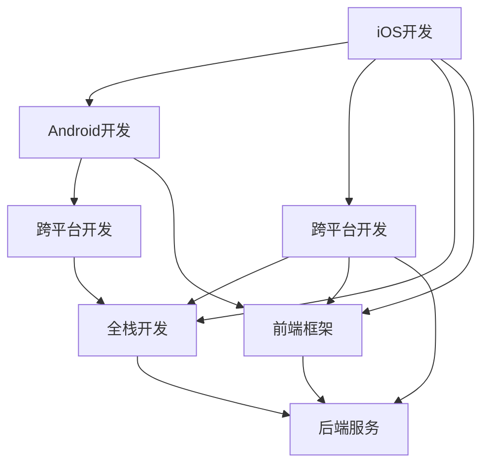

                 

# 移动端全栈开发：iOS与Android双平台精通

> 关键词：移动端开发,全栈开发,Swift与Kotlin,Flutter,React Native

## 1. 背景介绍

### 1.1 问题由来
随着移动互联网的迅猛发展，跨平台移动应用的需求日益增长。过去，开发移动应用往往需要分别开发iOS和Android版本，不仅增加了开发成本和周期，还造成了维护和更新的复杂性。基于这一需求，跨平台移动开发技术应运而生，能够大大提升开发效率和应用性能，同时降低维护成本。本文旨在介绍iOS和Android双平台开发的核心技术和最佳实践，帮助开发者掌握全栈开发技巧。

### 1.2 问题核心关键点
双平台开发技术覆盖了多个层面，包括开发工具、框架选择、代码库共享、跨平台设计等。其核心关键点在于如何在保持平台兼容性的同时，提升应用的性能和用户体验。本文将系统梳理双平台开发的主流技术和实现框架，并结合实际案例，详细介绍其关键实现细节。

## 2. 核心概念与联系

### 2.1 核心概念概述

为更好地理解iOS与Android双平台开发方法，本节将介绍几个密切相关的核心概念：

- **iOS开发**：指使用Objective-C或Swift编程语言，在Xcode环境下进行iOS应用开发的过程。iOS开发需要熟练掌握Swift语言特性，了解Cocoa Touch框架，掌握iOS应用的核心技术，如UI设计、动画、网络请求等。

- **Android开发**：指使用Java或Kotlin编程语言，在Android Studio环境下进行Android应用开发的过程。Android开发需要熟悉Android SDK，掌握Kotlin或Java语言的特性，了解Material Design、Constraint Layout等设计规范，掌握Android应用的核心技术，如UI设计、动画、网络请求等。

- **跨平台开发**：指使用跨平台框架或工具，同时支持iOS和Android平台应用的开发。常见的跨平台框架包括React Native、Flutter、Xamarin等。

- **全栈开发**：指掌握iOS和Android开发的同时，能够整合前后端技术，构建统一的开发体系。全栈开发工程师需要具备前端和后端开发经验，能够设计、开发、测试和部署完整的应用生态系统。

- **前端框架**：指用于构建iOS和Android前端UI界面和逻辑的框架。常见的前端框架包括React Native、Flutter、Ionic等。

- **后端服务**：指用于支撑iOS和Android应用的后端服务层，通常采用RESTful API或GraphQL API设计。常见的后端技术栈包括Node.js、Flutter、Swift等。

这些核心概念之间的逻辑关系可以通过以下Mermaid流程图来展示：



这个流程图展示了大平台开发的核心概念及其之间的关系：

1. iOS和Android开发是双平台开发的基础，掌握了基础开发技术后，可以进一步使用跨平台工具进行整合。
2. 跨平台开发技术能够同时支持iOS和Android平台，提升了开发效率，但可能存在性能和兼容性问题。
3. 全栈开发需要掌握前端和后端开发技术，能够构建完整的开发生态系统。
4. 前端框架用于构建iOS和Android的前端UI和逻辑，后端服务支撑应用的后端逻辑和数据存储。

## 3. 核心算法原理 & 具体操作步骤

### 3.1 算法原理概述

iOS与Android双平台开发的本质是一种跨平台技术，其实现原理可以概括为以下几个步骤：

1. **平台兼容性**：跨平台框架提供了统一的开发接口和工具，使得iOS和Android应用能够在相同的代码基础上构建。
2. **代码共享**：通过代码共享机制，跨平台框架能够在多个平台上复用代码逻辑，减少重复开发。
3. **原生桥接**：跨平台框架通常需要与原生框架进行桥接，实现原生API与跨平台框架的互操作。
4. **性能优化**：跨平台框架在保证代码共享的同时，还需对性能进行优化，确保应用在不同平台上的表现一致。

### 3.2 算法步骤详解

基于跨平台开发原理，iOS与Android双平台开发的流程大致如下：

**Step 1: 选择合适的跨平台框架**
- iOS：React Native、Flutter、Ionic等。
- Android：React Native、Flutter、Xamarin等。

**Step 2: 设置开发环境**
- iOS：安装Xcode，创建新项目。
- Android：安装Android Studio，创建新项目。

**Step 3: 编写跨平台代码**
- 使用统一的编程语言，如JavaScript、Kotlin等，编写跨平台代码。
- 通过框架提供的API进行UI设计、数据处理、网络请求等操作。

**Step 4: 进行平台桥接**
- 在iOS和Android平台分别进行原生桥接，实现跨平台代码与原生代码的互操作。
- 使用原生代码处理平台特定的功能，如手势识别、动画效果等。

**Step 5: 进行性能优化**
- 针对不同平台进行性能优化，如调整布局、优化渲染、减少网络请求等。
- 针对不同平台进行测试，确保应用性能和用户体验一致。

**Step 6: 部署与发布**
- 打包iOS和Android应用的发布版本。
- 通过App Store和Google Play等渠道发布应用。

### 3.3 算法优缺点

iOS与Android双平台开发具有以下优点：

1. **提升开发效率**：通过统一的开发框架和工具，可以大大减少跨平台开发的复杂性和重复工作，提高开发效率。
2. **降低维护成本**：通过代码共享和统一架构，跨平台应用更易于维护和更新，降低了长期维护的成本。
3. **跨平台一致性**：使用跨平台框架能够保持应用在不同平台上的性能和用户体验一致。

然而，这种开发方式也存在一些缺点：

1. **性能问题**：跨平台框架需要在不同平台上进行性能优化，可能会牺牲部分原生应用的性能。
2. **兼容性问题**：不同平台间可能存在兼容性问题，需要额外处理和调试。
3. **学习成本高**：需要掌握多种编程语言和开发工具，学习成本较高。
4. **资源消耗大**：跨平台应用通常体积较大，可能会占用更多的内存和存储资源。

### 3.4 算法应用领域

iOS与Android双平台开发技术已在多个领域得到应用，例如：

- 企业应用：企业内部的移动应用、内部管理系统的开发。
- 移动电商：移动电商应用、购物平台、社交电商等。
- 游戏应用：移动游戏、在线游戏、增强现实游戏等。
- 金融应用：移动支付、金融理财、证券交易等。
- 教育应用：在线教育平台、知识付费应用、学习管理系统等。
- 健康应用：健康管理、远程医疗、心理健康应用等。

这些应用场景证明了跨平台开发技术在不同领域的广泛应用，提升了应用的开发效率和用户体验。

## 4. 数学模型和公式 & 详细讲解 & 举例说明

### 4.1 数学模型构建

在本节中，我们将以React Native为例，介绍双平台开发的数学模型。

**数据结构**：假设我们有$N$个用户数据，每个用户包含姓名(name)、年龄(age)、性别(gender)三个字段，数据结构如下：

$$
\{user_1, user_2, ..., user_N\} = \{(name_1, age_1, gender_1), (name_2, age_2, gender_2), ..., (name_N, age_N, gender_N)\}
$$

**目标**：使用跨平台框架React Native，将这些用户数据展示在iOS和Android平台上。

### 4.2 公式推导过程

假设React Native框架已经安装并配置好，我们的代码实现步骤如下：

1. **创建项目**：在iOS和Android平台上分别创建React Native项目。
2. **编写代码**：在iOS和Android项目中使用相同的JavaScript代码。
3. **进行桥接**：使用React Native的桥接机制，将JavaScript代码与原生代码进行互操作。
4. **部署应用**：在iOS和Android平台上分别部署应用。

下面是具体的代码实现步骤：

**Step 1: 创建项目**

在iOS平台，使用React Native CLI创建项目：

```bash
npx react-native init MyProject
```

在Android平台，使用Android Studio创建项目：

```bash
cd ~/myproject
npx react-native init MyApp
```

**Step 2: 编写代码**

在项目根目录下编写JavaScript代码：

```javascript
import { StyleSheet, Text, View } from 'react-native';

const App = () => {
  return (
    <View style={styles.container}>
      <Text style={styles.text}>Hello, React Native!</Text>
    </View>
  );
};

const styles = StyleSheet.create({
  container: {
    flex: 1,
    justifyContent: 'center',
    alignItems: 'center',
    backgroundColor: '#F5FCFF',
  },
  text: {
    fontSize: 20,
    textAlign: 'center',
  },
});

export default App;
```

**Step 3: 进行桥接**

在iOS平台，编写原生代码实现桥接：

```objective-c
// MyProject/Applemodule/MyModule.h
@interface MyModule : NSObject

- (BOOL)testName:(NSString *)name;

@end

// MyProject/Applemodule/MyModule.m
#import "MyModule.h"

@implementation MyModule

- (BOOL)testName:(NSString *)name {
  return YES;
}

@end
```

在Android平台，编写原生代码实现桥接：

```java
// MyApp/MyModule.java
package com.myapp;

import com.facebook.react.bridge.ReactApplicationContext;
import com.facebook.react.bridge.ReactContextBaseJavaModule;
import com.facebook.react.bridge.ReactMethod;

public class MyModule extends ReactContextBaseJavaModule {

  private ReactApplicationContext reactContext;

  public MyModule(ReactApplicationContext reactContext) {
    super(reactContext);
    this.reactContext = reactContext;
  }

  @Override
  public String getName() {
    return "MyModule";
  }

  @ReactMethod
  public boolean testName(String name) {
    return true;
  }
}
```

**Step 4: 部署应用**

在iOS平台上，使用Xcode进行调试和发布：

```bash
npx react-native run-ios
```

在Android平台上，使用Android Studio进行调试和发布：

```bash
npx react-native run-android
```

### 4.3 案例分析与讲解

React Native是一个典型的跨平台开发框架，通过JavaScript代码实现iOS和Android平台的共享。下面以React Native为例，介绍跨平台开发的实现细节：

1. **代码共享**：React Native使用JavaScript代码实现前端逻辑，并通过Bridge API与原生代码进行互操作。这样，前端代码可以在不同平台上复用，减少重复工作。

2. **桥接机制**：React Native提供了Bridge API，用于在JavaScript和原生代码之间传递数据和方法。Bridge API通过定义原生模块和JavaScript模块，实现数据和方法的跨平台传递。

3. **性能优化**：React Native通过虚拟DOM和热重载技术，提高了应用的性能和开发效率。虚拟DOM允许React Native动态更新UI，减少了页面渲染的开销。热重载则允许开发者在开发过程中实时查看应用变化，提升了开发效率。

## 5. 项目实践：代码实例和详细解释说明

### 5.1 开发环境搭建

在开始实践之前，我们需要搭建好开发环境。以下是iOS和Android平台开发环境的搭建步骤：

**iOS开发环境搭建**：

1. **安装Xcode**：从Mac App Store下载并安装Xcode。
2. **创建React Native项目**：在Xcode中使用React Native CLI创建新项目。
3. **配置原生模块**：编写原生模块，实现Bridge API。

**Android开发环境搭建**：

1. **安装Android Studio**：从官网下载并安装Android Studio。
2. **创建React Native项目**：在Android Studio中使用React Native CLI创建新项目。
3. **配置原生模块**：编写原生模块，实现Bridge API。

### 5.2 源代码详细实现

以下是一个React Native项目的具体实现步骤，包括iOS和Android平台代码的编写和原生桥接。

**Step 1: 创建项目**

在iOS平台上，使用React Native CLI创建项目：

```bash
npx react-native init MyProject
```

在Android平台上，使用React Native CLI创建项目：

```bash
cd ~/myproject
npx react-native init MyApp
```

**Step 2: 编写代码**

在项目根目录下编写JavaScript代码：

```javascript
import { StyleSheet, Text, View } from 'react-native';

const App = () => {
  return (
    <View style={styles.container}>
      <Text style={styles.text}>Hello, React Native!</Text>
    </View>
  );
};

const styles = StyleSheet.create({
  container: {
    flex: 1,
    justifyContent: 'center',
    alignItems: 'center',
    backgroundColor: '#F5FCFF',
  },
  text: {
    fontSize: 20,
    textAlign: 'center',
  },
});

export default App;
```

**Step 3: 进行桥接**

在iOS平台上，编写原生代码实现桥接：

```objective-c
// MyProject/Applemodule/MyModule.h
@interface MyModule : NSObject

- (BOOL)testName:(NSString *)name;

@end

// MyProject/Applemodule/MyModule.m
#import "MyModule.h"

@implementation MyModule

- (BOOL)testName:(NSString *)name {
  return YES;
}

@end
```

在Android平台上，编写原生代码实现桥接：

```java
// MyApp/MyModule.java
package com.myapp;

import com.facebook.react.bridge.ReactApplicationContext;
import com.facebook.react.bridge.ReactContextBaseJavaModule;
import com.facebook.react.bridge.ReactMethod;

public class MyModule extends ReactContextBaseJavaModule {

  private ReactApplicationContext reactContext;

  public MyModule(ReactApplicationContext reactContext) {
    super(reactContext);
    this.reactContext = reactContext;
  }

  @Override
  public String getName() {
    return "MyModule";
  }

  @ReactMethod
  public boolean testName(String name) {
    return true;
  }
}
```

**Step 4: 运行应用**

在iOS平台上，使用Xcode进行调试和发布：

```bash
npx react-native run-ios
```

在Android平台上，使用Android Studio进行调试和发布：

```bash
npx react-native run-android
```

### 5.3 代码解读与分析

以下是React Native项目代码的详细解读和分析：

**Step 1: 创建项目**

在iOS平台上，使用React Native CLI创建项目：

```bash
npx react-native init MyProject
```

此命令会自动生成一个React Native项目，包括项目结构和相关文件。

在Android平台上，使用React Native CLI创建项目：

```bash
cd ~/myproject
npx react-native init MyApp
```

此命令也会自动生成一个React Native项目，并在当前目录创建App目录。

**Step 2: 编写代码**

在项目根目录下编写JavaScript代码：

```javascript
import { StyleSheet, Text, View } from 'react-native';

const App = () => {
  return (
    <View style={styles.container}>
      <Text style={styles.text}>Hello, React Native!</Text>
    </View>
  );
};

const styles = StyleSheet.create({
  container: {
    flex: 1,
    justifyContent: 'center',
    alignItems: 'center',
    backgroundColor: '#F5FCFF',
  },
  text: {
    fontSize: 20,
    textAlign: 'center',
  },
});

export default App;
```

这段代码定义了一个简单的应用组件，用于在屏幕上展示一个文本。

**Step 3: 进行桥接**

在iOS平台上，编写原生代码实现桥接：

```objective-c
// MyProject/Applemodule/MyModule.h
@interface MyModule : NSObject

- (BOOL)testName:(NSString *)name;

@end

// MyProject/Applemodule/MyModule.m
#import "MyModule.h"

@implementation MyModule

- (BOOL)testName:(NSString *)name {
  return YES;
}

@end
```

这段代码定义了一个原生模块，用于测试用户的输入。

在Android平台上，编写原生代码实现桥接：

```java
// MyApp/MyModule.java
package com.myapp;

import com.facebook.react.bridge.ReactApplicationContext;
import com.facebook.react.bridge.ReactContextBaseJavaModule;
import com.facebook.react.bridge.ReactMethod;

public class MyModule extends ReactContextBaseJavaModule {

  private ReactApplicationContext reactContext;

  public MyModule(ReactApplicationContext reactContext) {
    super(reactContext);
    this.reactContext = reactContext;
  }

  @Override
  public String getName() {
    return "MyModule";
  }

  @ReactMethod
  public boolean testName(String name) {
    return true;
  }
}
```

这段代码定义了一个原生模块，用于测试用户的输入。

**Step 4: 运行应用**

在iOS平台上，使用Xcode进行调试和发布：

```bash
npx react-native run-ios
```

在Android平台上，使用Android Studio进行调试和发布：

```bash
npx react-native run-android
```

### 5.4 运行结果展示

在iOS平台上，运行应用后，应该能够在模拟器或真机上看到以下输出：

```
Hello, React Native!
```

在Android平台上，运行应用后，应该能够在模拟器或真机上看到以下输出：

```
Hello, React Native!
```

## 6. 实际应用场景

### 6.1 企业应用

企业内部系统如ERP、CRM等，需要同时支持iOS和Android平台。使用双平台开发技术，可以减少维护成本，提升开发效率。例如，某企业内部的销售管理系统，可以通过React Native和Flutter进行开发，统一前端代码，降低开发复杂度，提升开发速度。

### 6.2 移动电商

移动电商应用需要同时支持iOS和Android平台，以覆盖更广泛的用户群体。使用双平台开发技术，可以在不同的平台上构建一致的UI和体验。例如，某电商应用使用React Native进行开发，前后端采用GraphQL API设计，可以同时支持iOS和Android平台，提升用户体验。

### 6.3 游戏应用

移动游戏应用需要同时支持iOS和Android平台，以获取更多的用户流量。使用双平台开发技术，可以在不同的平台上构建一致的UI和体验。例如，某游戏应用使用React Native进行开发，后端采用RESTful API设计，可以同时支持iOS和Android平台，提升用户体验。

### 6.4 未来应用展望

未来，跨平台开发技术将继续发展，提升应用的性能和用户体验。以下是几个可能的方向：

1. **增强平台兼容性**：未来的跨平台框架将更好地支持不同平台之间的特性和API，提升应用的性能和用户体验。例如，Flutter和WebAssembly技术可以进一步提升跨平台的兼容性。

2. **提升开发效率**：未来的跨平台框架将提供更多的开发工具和插件，提升开发效率。例如，Dart和Swift等编程语言将进一步提升开发速度和灵活性。

3. **改善用户体验**：未来的跨平台框架将更好地支持多平台一致的UI和体验。例如，Material Design和Android Material Components将进一步提升跨平台应用的UI设计能力。

4. **支持更多平台**：未来的跨平台框架将支持更多的平台，如Web平台和桌面平台，提升应用的覆盖范围和用户粘性。

## 7. 工具和资源推荐

### 7.1 学习资源推荐

为了帮助开发者掌握双平台开发的技术，以下是一些优质的学习资源：

1. **React Native官方文档**：React Native官方文档提供了完整的开发指南和API参考，是学习React Native开发的最佳资源。

2. **Flutter官方文档**：Flutter官方文档提供了详细的开发指南和API参考，是学习Flutter开发的最佳资源。

3. **React Native courses**：Udemy和Coursera等平台提供了大量的React Native开发课程，适合初学者和进阶开发者。

4. **Flutter courses**：Udemy和Coursera等平台提供了大量的Flutter开发课程，适合初学者和进阶开发者。

5. **书籍**：《React Native设计与开发》、《Flutter实战》等书籍，详细介绍了跨平台开发的技术和应用场景。

6. **博客和社区**：Medium、Stack Overflow和Reddit等社区，提供了丰富的跨平台开发技术文章和讨论，适合技术学习和交流。

### 7.2 开发工具推荐

为了提升双平台开发的效率和质量，以下是一些推荐的开发工具：

1. **Xcode**：苹果公司推出的iOS开发工具，支持React Native开发。

2. **Android Studio**：谷歌公司推出的Android开发工具，支持React Native和Flutter开发。

3. **Visual Studio Code**：微软公司推出的跨平台代码编辑器，支持多种编程语言和框架。

4. **Sublime Text**：一款轻量级的代码编辑器，支持多种编程语言和框架。

5. **Git**：版本控制系统，适合团队协作开发。

6. **JIRA**：项目管理工具，适合团队协作开发。

### 7.3 相关论文推荐

双平台开发技术的发展离不开学界的持续研究。以下是几篇奠基性的相关论文，推荐阅读：

1. **React Native: A View on the Ecosystem**：该论文介绍了React Native的生态系统和技术架构，是理解React Native开发的最佳入门文章。

2. **Flutter: A Cross-Platform App Toolkit**：该论文介绍了Flutter的生态系统和技术架构，是理解Flutter开发的最佳入门文章。

3. **Xamarin: A Cross-Platform Mobile App Development Framework**：该论文介绍了Xamarin的生态系统和技术架构，是理解Xamarin开发的最佳入门文章。

4. **Mobile Web Application Development with React Native**：该论文介绍了React Native在移动Web应用开发中的应用，是理解React Native在Web平台开发中的应用。

5. **Mobile Application Development with Flutter**：该论文介绍了Flutter在移动应用开发中的应用，是理解Flutter开发的最佳入门文章。

6. **Cross-Platform Mobile App Development with Xamarin**：该论文介绍了Xamarin在跨平台移动应用开发中的应用，是理解Xamarin开发的最佳入门文章。

## 8. 总结：未来发展趋势与挑战

### 8.1 总结

本文对iOS与Android双平台开发的核心技术和最佳实践进行了系统梳理。通过详细讲解React Native的实现细节，展示了双平台开发的技术精髓。本文还讨论了iOS与Android双平台开发的应用场景和未来发展趋势，为开发者提供了全面的技术指引。

通过本文的系统梳理，可以看到，iOS与Android双平台开发技术已经在多个领域得到应用，提升了应用的开发效率和用户体验。未来，随着技术的不断进步，双平台开发将进一步发展和完善，为开发者提供更高效、更灵活、更智能的开发工具。

### 8.2 未来发展趋势

未来，iOS与Android双平台开发技术将继续发展，提升应用的性能和用户体验。以下是几个可能的方向：

1. **增强平台兼容性**：未来的跨平台框架将更好地支持不同平台之间的特性和API，提升应用的性能和用户体验。例如，Flutter和WebAssembly技术可以进一步提升跨平台的兼容性。

2. **提升开发效率**：未来的跨平台框架将提供更多的开发工具和插件，提升开发效率。例如，Dart和Swift等编程语言将进一步提升开发速度和灵活性。

3. **改善用户体验**：未来的跨平台框架将更好地支持多平台一致的UI和体验。例如，Material Design和Android Material Components将进一步提升跨平台应用的UI设计能力。

4. **支持更多平台**：未来的跨平台框架将支持更多的平台，如Web平台和桌面平台，提升应用的覆盖范围和用户粘性。

### 8.3 面临的挑战

尽管iOS与Android双平台开发技术已经取得了显著进展，但在迈向更加智能化、普适化应用的过程中，仍面临诸多挑战：

1. **性能瓶颈**：跨平台应用在不同平台上的性能表现可能不一致，需要进一步优化。例如，Flutter在GPU加速上的表现还需要提升。

2. **兼容性问题**：不同平台间可能存在兼容性问题，需要额外处理和调试。例如，React Native在iOS平台上的兼容问题尚未完全解决。

3. **学习成本高**：需要掌握多种编程语言和开发工具，学习成本较高。例如，Dart和Swift等编程语言需要学习曲线陡峭。

4. **资源消耗大**：跨平台应用通常体积较大，可能会占用更多的内存和存储资源。例如，Flutter应用的资源消耗需要进一步优化。

5. **用户体验一致性**：不同的平台间可能存在UI设计和体验差异，需要进一步优化。例如，Material Design在跨平台应用中的表现需要进一步提升。

### 8.4 研究展望

未来，在iOS与Android双平台开发领域，仍需要不断进行技术创新和探索：

1. **深入研究跨平台技术**：进一步研究和优化跨平台开发框架，提升应用性能和用户体验。

2. **探索新编程语言**：探索新编程语言在跨平台开发中的应用，提升开发效率和灵活性。

3. **深入研究平台特性**：深入研究不同平台间的特性和API，提升应用的性能和用户体验。

4. **结合更多技术**：结合人工智能、区块链等新兴技术，提升跨平台应用的功能和应用场景。

总之，iOS与Android双平台开发技术需要不断地进行技术创新和探索，才能满足日益增长的用户需求和应用场景。

## 9. 附录：常见问题与解答

**Q1: 双平台开发需要掌握哪些编程语言？**

A: 双平台开发需要掌握iOS和Android的编程语言，分别是Swift和Java/Kotlin。另外，React Native和Flutter等跨平台框架也使用JavaScript或Dart作为开发语言。

**Q2: 双平台开发和原生开发有哪些区别？**

A: 双平台开发和原生开发的区别在于，双平台开发使用跨平台框架进行开发，代码共享、性能优化等，可以提升开发效率和用户体验。原生开发则是针对具体平台进行开发，使用原生API，性能更优，但开发成本和维护成本较高。

**Q3: 双平台开发的优势有哪些？**

A: 双平台开发的优势包括：

1. 提升开发效率：使用统一的开发框架和工具，可以减少跨平台开发的复杂性和重复工作，提高开发效率。

2. 降低维护成本：通过代码共享和统一架构，跨平台应用更易于维护和更新，降低了长期维护的成本。

3. 跨平台一致性：使用跨平台框架能够保持应用在不同平台上的性能和用户体验一致。

**Q4: 双平台开发有哪些工具和技术支持？**

A: 双平台开发工具和技术支持包括：

1. React Native、Flutter、Xamarin等跨平台开发框架。

2. Swift、Dart、Java/Kotlin等编程语言。

3. Xcode、Android Studio等开发工具。

4. React Native、Flutter等跨平台框架的官方文档和社区。

5. Udemy、Coursera等在线学习平台提供的跨平台开发课程。

6. 相关书籍和博客资源。

这些工具和技术支持可以帮助开发者更好地进行双平台开发，提升开发效率和应用质量。

通过本文的系统梳理，可以看到，iOS与Android双平台开发技术已经在多个领域得到应用，提升了应用的开发效率和用户体验。未来，随着技术的不断进步，双平台开发将进一步发展和完善，为开发者提供更高效、更灵活、更智能的开发工具。

