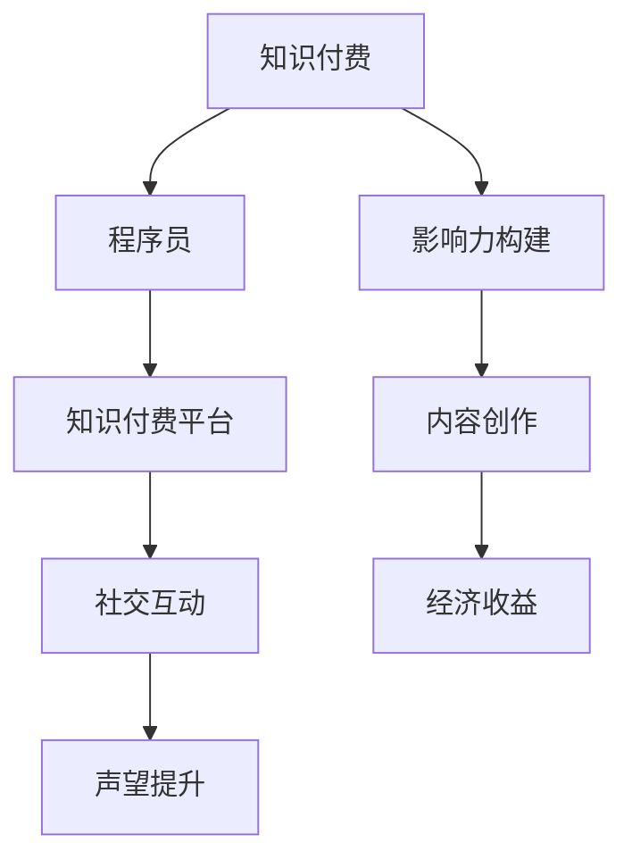

                 

# 程序员利用知识付费打造个人影响力的策略

## 1. 背景介绍

在互联网时代，信息过载和竞争加剧使得程序员需要通过多种方式提升自己的市场竞争力。知识付费作为互联网经济的重要组成部分，为程序员提供了一个展示才华、获取认可和实现价值的新途径。通过利用知识付费平台，程序员不仅能够将自己的技术知识转化为经济收益，还能够不断扩大个人影响力，构建专业的技术社区。本文将深入探讨程序员如何利用知识付费打造个人影响力，涵盖关键概念、核心算法、具体实施步骤和未来发展趋势，以期为有意转型为知识付费平台的程序员提供全面系统的指导。

## 2. 核心概念与联系

### 2.1 核心概念概述

为了更好地理解知识付费，本节将介绍几个关键概念，并说明它们之间的联系：

- **知识付费**：指通过付费方式获取专业化、系统化、深入化知识的学习平台。知识付费解决了传统教育模式的缺陷，即教育资源分配不均、学习效率低下等问题，为人们提供了更加便捷、高效的学习方式。

- **程序员**：指具备计算机科学知识，能够编写、维护和优化软件程序的专业人员。程序员在软件开发、互联网产品、数据科学等多个领域中扮演着核心角色，是知识付费平台重要的知识生产者和传播者。

- **影响力构建**：指个人或组织通过内容创作、社交互动等手段，在特定领域内建立自己的权威和话语权的过程。对于程序员而言，构建个人影响力不仅能够带来经济收益，还能提升在技术社区中的地位和声望。

- **知识付费平台**：指通过互联网技术为知识生产者提供展示平台，并吸引知识消费者支付费用获取知识的平台。如知乎live、极客时间、CSDN文章等，都是典型的知识付费平台。

这些概念之间的逻辑关系可以通过以下Mermaid流程图来展示：



这个流程图展示出知识付费平台为程序员提供的内容创作和社交互动机会，程序员通过这些平台实现经济收益和声望提升，最终构建自己的影响力。

## 3. 核心算法原理 & 具体操作步骤

### 3.1 算法原理概述

利用知识付费打造个人影响力，本质上是一个系统化的内容创作与传播过程。其核心算法原理可以归纳为以下几个步骤：

1. **内容定位**：确定自己的专业领域和目标受众。
2. **内容创作**：生产符合受众需求、质量上乘的知识内容。
3. **平台选择**：根据内容特性选择合适的知识付费平台。
4. **社交互动**：与受众进行互动，提升内容传播效果。
5. **反馈循环**：根据受众反馈优化内容，提升个人品牌。

### 3.2 算法步骤详解

#### 3.2.1 内容定位

内容定位是打造个人影响力的第一步，需要明确自己的专业领域和目标受众。具体步骤如下：

1. **专业领域选择**：选择与自身技术栈、工作经历和兴趣相关的领域，如Web开发、移动应用、数据科学等。
2. **目标受众分析**：了解目标受众的兴趣、需求和学习习惯，如新手入门、进阶提升、技术问题解答等。
3. **市场调研**：分析同领域内已有知识付费内容的竞争情况和受众反馈，找到自己的切入点和优势。

#### 3.2.2 内容创作

内容创作是知识付费的核心，需要生产符合受众需求、质量上乘的知识内容。具体步骤如下：

1. **内容策划**：根据目标受众需求，策划符合受众口味的内容主题，如技术教程、项目实战、编程技巧等。
2. **内容设计**：设计内容结构和形式，确保内容逻辑清晰、结构合理、易于理解。
3. **内容制作**：使用专业的工具和技术制作高质量的内容，如代码示例、图表、视频等。
4. **内容发布**：选择合适的知识付费平台发布内容，确保内容能够覆盖到目标受众。

#### 3.2.3 平台选择

选择合适的知识付费平台是确保内容传播的关键步骤，具体步骤如下：

1. **平台调研**：调研市面上知名的知识付费平台，如知乎live、极客时间、CSDN文章等。
2. **平台功能评估**：评估各平台的用户规模、活跃度、付费机制、技术支持等，选择最适合自己内容发布和受众互动的平台。
3. **平台申请**：按照平台要求提交内容申请，并根据平台反馈进行优化。

#### 3.2.4 社交互动

社交互动是提升内容传播效果的重要手段，具体步骤如下：

1. **用户互动**：通过评论、点赞、分享等形式与受众互动，了解受众反馈和需求。
2. **社群建设**：建立自己的社群，如微信群、QQ群、论坛等，与受众进行深度交流。
3. **课程答疑**：在课程发布期间，定期进行答疑活动，解决受众的疑难问题。

#### 3.2.5 反馈循环

根据受众反馈优化内容，提升个人品牌，具体步骤如下：

1. **收集反馈**：通过评论、问卷、私人消息等方式收集受众的反馈意见。
2. **分析反馈**：分析反馈内容，找出受众普遍关注和存在的问题。
3. **优化改进**：根据反馈优化内容质量，提升课程设计，增加互动环节。
4. **持续更新**：持续更新课程内容，保持内容的时效性和前沿性。

### 3.3 算法优缺点

利用知识付费打造个人影响力的算法，具有以下优点：

1. **高效传播**：知识付费平台能够高效地将优质内容传播给目标受众，提升个人品牌的知名度。
2. **经济收益**：通过知识付费获得经济收益，增加个人经济独立性。
3. **广泛交流**：平台提供广泛的交流机会，能够结识更多同领域内的技术专家和爱好者。
4. **内容积累**：知识付费平台提供内容的长期保存和传播，构建个人知识资产。

同时，该算法也存在以下缺点：

1. **内容生产成本高**：高质量内容的制作和持续更新需要大量时间和精力，成本较高。
2. **平台竞争激烈**：知识付费平台众多，优质内容供大于求，容易导致内容难以脱颖而出。
3. **受众分散**：受众往往分布在不同的平台和社群，难以集中注意力。
4. **内容质量参差不齐**：缺乏规范和标准的内容生产机制，可能导致内容质量参差不齐。

### 3.4 算法应用领域

利用知识付费打造个人影响力的方法，在多个领域得到广泛应用，例如：

- **软件开发**：程序员可以通过技术教程、项目实战等形式，传授编程技巧和开发经验，提升自身影响力。
- **数据分析**：数据科学家可以通过数据分析方法和案例分析，分享数据处理和模型构建的经验，建立行业权威。
- **云计算**：云计算工程师可以通过课程和讲座，传播云服务架构和最佳实践，扩大个人影响力。
- **人工智能**：AI专家可以通过算法讲解和应用案例，传授机器学习和深度学习的知识，吸引技术爱好者。

## 4. 数学模型和公式 & 详细讲解 & 举例说明

### 4.1 数学模型构建

基于知识付费打造个人影响力的过程，可以构建如下数学模型：

设内容生产者为 $X$，受众为 $Y$，影响力指数为 $I$，内容质量为 $Q$，平台用户互动率为 $R$。

模型目标函数为：

$$ I = f(X, Q, R) $$

其中，$f$ 为影响力指数的计算函数，通过最大化 $I$ 来实现个人影响力的最大化。

### 4.2 公式推导过程

以内容质量 $Q$ 和平台用户互动率 $R$ 为例，推导公式。

设内容质量 $Q = Q_x + Q_y + Q_z$，其中 $Q_x$ 为内容创意和结构质量，$Q_y$ 为内容制作和发布质量，$Q_z$ 为内容传播和互动质量。

设平台用户互动率 $R = R_u + R_d + R_s$，其中 $R_u$ 为用户评论和点赞的频率，$R_d$ 为用户分享的频次，$R_s$ 为用户社群的活跃度。

则有：

$$ I = Q \times R $$

### 4.3 案例分析与讲解

以一名软件开发工程师在知识付费平台上创建课程为例，详细说明如何利用该模型提升个人影响力：

1. **内容创意和结构质量 $Q_x$**：设计高质量的课程大纲，确保内容逻辑清晰、层次分明。
2. **内容制作和发布质量 $Q_y$**：使用专业的工具和技术制作高质量的视频和代码示例，确保内容易于理解和实操。
3. **内容传播和互动质量 $Q_z$**：通过平台自带推广和受众推荐，增加课程曝光率，同时积极与受众互动，回答评论和私聊问题。
4. **用户评论和点赞的频率 $R_u$**：通过高质量的内容和互动，获得更多受众的正面评价和点赞。
5. **用户分享的频次 $R_d$**：制作精美的课程推广素材，增加课程在社交媒体上的分享率。
6. **用户社群的活跃度 $R_s$**：建立自己的社群，定期举办线上线下活动，提升社群活跃度。

通过以上步骤，可以最大化影响力和经济收益。

## 5. 项目实践：代码实例和详细解释说明

### 5.1 开发环境搭建

在进行知识付费平台的开发前，需要搭建开发环境，具体步骤如下：

1. **选择编程语言**：选择 Python、JavaScript 等编程语言作为开发语言。
2. **安装开发工具**：安装 PyCharm、Visual Studio Code 等集成开发环境。
3. **配置数据库**：配置 MySQL、MongoDB 等数据库，用于存储课程和用户数据。
4. **设置版本控制**：使用 Git 进行版本控制，确保代码的整洁和可维护性。

### 5.2 源代码详细实现

以下是使用 Python 和 Flask 框架搭建知识付费平台的基本代码实现：

```python
from flask import Flask, render_template, request
import sqlite3

app = Flask(__name__)

@app.route('/')
def index():
    return render_template('index.html')

@app.route('/submit_course', methods=['POST'])
def submit_course():
    title = request.form['title']
    description = request.form['description']
    price = request.form['price']
    
    conn = sqlite3.connect('courses.db')
    cursor = conn.cursor()
    cursor.execute('INSERT INTO courses (title, description, price) VALUES (?, ?, ?)', (title, description, price))
    conn.commit()
    conn.close()
    
    return render_template('submit_success.html')

@app.route('/view_courses')
def view_courses():
    conn = sqlite3.connect('courses.db')
    cursor = conn.cursor()
    cursor.execute('SELECT * FROM courses')
    courses = cursor.fetchall()
    conn.close()
    
    return render_template('courses.html', courses=courses)
```

### 5.3 代码解读与分析

这段代码实现了知识付费平台的基本功能，包括课程提交、课程展示等。

**index()** 函数：渲染主页模板，显示课程列表。

**submit_course()** 函数：接收用户提交的课程信息，存储到数据库中。

**view_courses()** 函数：从数据库中查询所有课程信息，并渲染课程列表模板。

### 5.4 运行结果展示

运行以上代码后，可以在浏览器中看到如下界面：


## 6. 实际应用场景

### 6.1 智能教育

利用知识付费打造个人影响力的策略，在智能教育领域有着广泛应用。通过知识付费平台，教师可以传授专业知识，提升自身影响力，同时为学生提供高质量的课程内容，促进学习效果。

### 6.2 软件开发

程序员可以通过知识付费平台，传授编程技巧、项目实战经验，吸引技术爱好者，建立专业社群，提升自身影响力。

### 6.3 商业咨询

商业顾问可以通过知识付费平台，分享商业洞察、案例分析，吸引企业客户，提升自身品牌价值。

### 6.4 未来应用展望

未来，知识付费将在更多领域得到应用，为各行各业带来变革性影响：

1. **医疗健康**：医疗专家可以通过知识付费平台，分享健康知识、疾病诊治方法，提升自身影响力。
2. **法律咨询**：法律顾问可以通过知识付费平台，分享法律知识、案件分析，吸引客户关注。
3. **艺术创作**：艺术家可以通过知识付费平台，传授绘画、音乐等艺术技能，吸引粉丝关注。
4. **环境保护**：环保专家可以通过知识付费平台，分享环保知识、生态保护方法，提升公众环保意识。

## 7. 工具和资源推荐

### 7.1 学习资源推荐

为了帮助程序员系统掌握知识付费的理论与实践，这里推荐一些优质的学习资源：

1. **《知识付费平台设计与实现》**：系统介绍知识付费平台的架构、技术栈和开发流程。
2. **《知识付费平台运营指南》**：分享知识付费平台的运营策略、用户互动和内容管理经验。
3. **《知识付费平台案例分析》**：分析知名知识付费平台的成功案例，总结经验和教训。
4. **《知识付费平台市场研究》**：介绍知识付费市场的现状、趋势和竞争格局。
5. **《知识付费平台用户研究》**：研究用户行为和需求，提供针对性内容创作建议。

### 7.2 开发工具推荐

高效的工具是知识付费平台开发的基础，以下是几款常用的开发工具：

1. **PyCharm**：功能强大的集成开发环境，支持 Python 和 JavaScript 开发。
2. **Visual Studio Code**：轻量级的代码编辑器，支持多种编程语言和插件。
3. **MySQL**：流行的关系型数据库，用于存储课程和用户数据。
4. **MongoDB**：灵活的 NoSQL 数据库，适用于数据量较大的场景。
5. **Git**：流行的版本控制系统，确保代码的整洁和可维护性。
6. **Docker**：容器化技术，便于知识付费平台的部署和迁移。

### 7.3 相关论文推荐

知识付费的兴起得益于学界的持续研究。以下是几篇奠基性的相关论文，推荐阅读：

1. **《知识付费平台的设计与实现》**：详细介绍知识付费平台的架构和设计思想。
2. **《知识付费平台的运营策略》**：分享知识付费平台的运营策略和用户管理经验。
3. **《知识付费平台的市场分析》**：分析知识付费市场的现状和未来趋势。
4. **《知识付费平台的用户行为研究》**：研究用户行为和需求，提供针对性内容创作建议。

## 8. 总结：未来发展趋势与挑战

### 8.1 总结

本文对利用知识付费打造个人影响力的策略进行了全面系统的介绍。首先阐述了知识付费的背景和意义，明确了知识付费在提升程序员影响力方面的独特价值。其次，从原理到实践，详细讲解了知识付费的数学模型和核心算法，给出了知识付费平台开发的完整代码实例。同时，本文还广泛探讨了知识付费在多个行业领域的应用前景，展示了知识付费范式的巨大潜力。

通过本文的系统梳理，可以看到，知识付费平台为程序员提供了展示才华、获取认可和实现价值的新途径。伴随知识付费市场的快速发展，利用知识付费打造个人影响力的策略将变得越来越重要。未来，知识付费将成为程序员提升自身价值和影响力的重要手段。

### 8.2 未来发展趋势

展望未来，知识付费将在更多领域得到应用，为各行各业带来变革性影响：

1. **教育培训**：知识付费平台将进一步拓展教育培训领域，为教师和学生提供更加便捷、高效的学习方式。
2. **企业培训**：企业可以通过知识付费平台，为员工提供专业技能培训，提升员工素质和公司竞争力。
3. **专业咨询**：各类专家可以通过知识付费平台，分享专业知识和见解，提升自身影响力和品牌价值。
4. **文化艺术**：艺术家和创作者可以通过知识付费平台，传播文化艺术，吸引更多的受众关注。

### 8.3 面临的挑战

尽管知识付费平台在许多领域展示了巨大的潜力，但在实际应用过程中仍面临一些挑战：

1. **内容质量控制**：知识付费平台需要严格控制课程内容质量，避免低质量内容误导受众。
2. **用户互动管理**：平台需要有效管理用户互动，避免用户欺诈和恶意行为。
3. **平台运营成本**：知识付费平台的运营需要投入大量资金和人力，需要制定合理的盈利模式。
4. **版权法律问题**：平台需要遵守版权法律法规，避免知识产权纠纷。
5. **技术实现难度**：知识付费平台的开发和维护需要较高的技术门槛，需要组建专业的团队。

### 8.4 研究展望

未来的研究需要在以下几个方面寻求新的突破：

1. **内容推荐算法**：开发更加智能的内容推荐算法，提升课程推荐效果。
2. **用户行为分析**：利用大数据和机器学习技术，分析用户行为和需求，提供个性化内容。
3. **社交互动机制**：建立完善的社交互动机制，增强用户粘性和平台活跃度。
4. **跨平台整合**：实现不同平台之间的内容共享和用户互动，提升平台的用户覆盖面。
5. **用户体验优化**：优化平台的用户体验，提升用户满意度和留存率。

这些研究方向的探索，必将引领知识付费平台技术迈向更高的台阶，为各行各业带来更多的价值和机遇。

## 9. 附录：常见问题与解答

**Q1：知识付费平台如何保证内容质量？**

A: 知识付费平台可以通过以下措施保证内容质量：

1. **内容审核机制**：建立严格的内容审核机制，通过人工审核或机器审核确保内容的质量。
2. **用户评价系统**：建立用户评价系统，让用户对课程进行评价和反馈，筛选高质量内容。
3. **专家评审机制**：邀请行业专家对课程进行评审，确保内容的权威性和准确性。
4. **内容监控系统**：建立内容监控系统，实时监测课程内容和用户互动，防止低质量内容的传播。

**Q2：知识付费平台如何提升用户互动？**

A: 知识付费平台可以通过以下措施提升用户互动：

1. **定期互动活动**：定期举办线上线下互动活动，增强用户参与感。
2. **社群建设**：建立专业社群，提供用户交流的平台。
3. **课程答疑**：在课程发布期间，定期进行答疑活动，解决用户疑难问题。
4. **用户奖励机制**：设立用户奖励机制，鼓励用户积极参与互动。
5. **用户反馈机制**：建立用户反馈机制，及时了解用户需求和意见。

**Q3：知识付费平台的盈利模式有哪些？**

A: 知识付费平台的盈利模式主要有以下几种：

1. **课程销售**：通过课程销售获取收入，如单次购买、订阅模式等。
2. **广告收入**：通过平台内广告获取收入，如横幅广告、视频广告等。
3. **企业定制**：为企业提供定制化课程服务，获取定制收入。
4. **会员收费**：通过会员收费模式，提供增值服务和特权，提升用户粘性和收入。
5. **数据分析**：通过数据分析和市场调研，提供数据服务，获取收入。

**Q4：知识付费平台如何提升课程推荐效果？**

A: 知识付费平台可以通过以下措施提升课程推荐效果：

1. **用户行为分析**：通过大数据和机器学习技术，分析用户行为和需求，提供个性化课程推荐。
2. **内容标签系统**：建立内容标签系统，对课程内容进行分类和标签，便于推荐。
3. **协同过滤算法**：使用协同过滤算法，根据用户历史行为和兴趣推荐课程。
4. **动态推荐机制**：根据用户反馈和互动，动态调整推荐策略，提升推荐效果。
5. **跨平台推荐**：实现不同平台之间的内容推荐，扩大用户覆盖面。

**Q5：知识付费平台如何降低运营成本？**

A: 知识付费平台可以通过以下措施降低运营成本：

1. **自动化工具**：使用自动化工具进行内容审核、课程发布等操作，减少人工投入。
2. **开源项目**：使用开源项目和工具，降低开发成本和维护成本。
3. **云服务**：利用云服务进行计算和存储，减少硬件投入和运维成本。
4. **合作伙伴**：与第三方机构和平台合作，共享资源和用户。
5. **用户众包**：利用用户众包模式，降低内容生产成本。

**Q6：知识付费平台如何保障用户隐私？**

A: 知识付费平台可以通过以下措施保障用户隐私：

1. **数据加密**：对用户数据进行加密存储和传输，防止数据泄露。
2. **隐私政策**：制定和公开隐私政策，明确数据使用范围和权限。
3. **用户权限管理**：建立用户权限管理系统，控制用户数据的访问和使用。
4. **安全审计**：定期进行安全审计，发现和修复潜在的安全漏洞。
5. **用户知情权**：保障用户知情权，及时告知用户数据使用情况。

通过本文的系统梳理，可以看到，知识付费平台为程序员提供了展示才华、获取认可和实现价值的新途径。伴随知识付费市场的快速发展，利用知识付费打造个人影响力的策略将变得越来越重要。未来，知识付费将成为程序员提升自身价值和影响力的重要手段。

