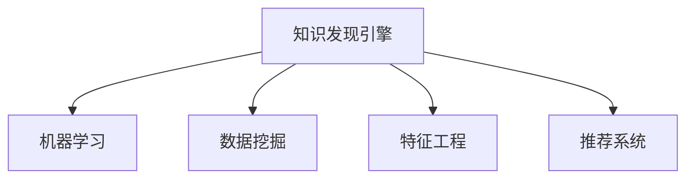

                 

# 程序员利用知识发现引擎提高学习成果

> 关键词：知识发现引擎, 机器学习, 学习成果提高, 数据挖掘, 专业技能提升, 人工智能

## 1. 背景介绍

### 1.1 问题由来
在信息爆炸的互联网时代，程序员需要不断学习新知识以跟上技术发展的步伐。然而，海量资料和资源不仅难以筛选，还容易产生信息过载，导致学习效率低下。传统的学习方法往往依赖于人工筛选和记忆，效率低且难以持久。

为了解决这一问题，知识发现引擎应运而生。它能够自动从大规模数据中挖掘有价值的信息，帮助程序员快速获取并理解专业技能。通过自动化地学习、筛选和归纳，知识发现引擎不仅提高了学习的效率，还为程序员提供了个性化、高效化的学习体验。

### 1.2 问题核心关键点
知识发现引擎的核心思想是通过机器学习和数据挖掘技术，自动从结构化或非结构化数据中抽取有用的知识，帮助用户发现并掌握新的技能。其主要作用包括：

- 自动化筛选：利用机器学习算法自动识别并筛选出高质量的学习资源。
- 个性化推荐：根据用户的兴趣、技能水平和学习历史，推荐最适合的学习内容。
- 交互式学习：通过与用户互动，动态调整学习内容和策略，提升学习效果。
- 数据驱动：基于大数据分析，提供科学的学习建议和策略。

本文将详细介绍知识发现引擎的工作原理，展示其如何助力程序员提高学习成果。通过理解知识发现引擎的原理和应用，相信你能够找到更高效的学习方法，不断精进个人技能。

## 2. 核心概念与联系

### 2.1 核心概念概述

为了更好地理解知识发现引擎的工作原理，本节将介绍几个密切相关的核心概念：

- **知识发现引擎(Knowledge Discovery Engine, KDE)**：利用机器学习和数据挖掘技术，自动从大规模数据中抽取有价值知识的技术工具。通过自动化筛选和推荐，帮助用户发现并掌握新技能。

- **机器学习(Machine Learning, ML)**：一种让机器自动学习并优化性能的技术，通过训练数据集学习规则和模式，并应用于新数据。

- **数据挖掘(Data Mining)**：一种从大量数据中自动发现有意义模式、知识或信息的数据处理方法。数据挖掘和机器学习常常紧密结合，共同推动知识发现引擎的发展。

- **特征工程(Feature Engineering)**：机器学习中的一个重要步骤，通过选择合适的特征，提取有意义的属性，提高模型的准确性和泛化能力。

- **推荐系统(Recommendation System)**：利用用户行为数据，自动推荐个性化内容的技术，常用于电商、音乐、视频等领域的推荐。

这些概念之间的逻辑关系可以通过以下Mermaid流程图来展示：



这个流程图展示的知识发现引擎的核心概念及其之间的关系：

1. 知识发现引擎通过数据挖掘和机器学习技术，从数据中抽取特征和模式。
2. 特征工程帮助选择和优化特征，进一步提升模型的性能。
3. 推荐系统根据用户行为推荐个性化学习资源，提升学习效果。

这些概念共同构成了知识发现引擎的学习框架，使其能够高效、科学地帮助程序员提升学习成果。

## 3. 核心算法原理 & 具体操作步骤
### 3.1 算法原理概述

知识发现引擎的工作原理大致可以分为以下几个步骤：

1. **数据收集**：从互联网、文献库、教程网站等渠道收集结构化或非结构化的学习资源数据。
2. **特征抽取**：利用文本挖掘、图像识别、自然语言处理等技术，从原始数据中提取特征，如关键词、主题、标签等。
3. **模型训练**：使用机器学习算法，如决策树、随机森林、神经网络等，对提取出的特征进行训练，学习到数据之间的关系和规律。
4. **结果生成**：根据训练好的模型，生成推荐结果，包括学习资源、学习路径、知识点等。
5. **反馈迭代**：收集用户反馈，调整模型参数，进一步优化推荐结果，提升用户体验。

通过以上步骤，知识发现引擎能够高效、精准地推荐适合用户的学习资源，帮助其提升学习成果。

### 3.2 算法步骤详解

以构建一个基于机器学习的知识发现引擎为例，详细介绍其操作步骤：

#### 3.2.1 数据收集

首先，需要构建一个高效的数据收集系统，从各大网站收集学习资源数据，如编程教程、技术博客、开源项目、编程问答网站等。数据源可以包括结构化的XML、JSON格式，以及非结构化的网页、文本、图片等。

#### 3.2.2 特征抽取

对于收集到的数据，需要对其进行特征抽取。特征抽取的方法包括：

- **文本挖掘**：利用自然语言处理技术，从文本中提取关键词、短语、主题等。常用的工具有NLTK、SpaCy、Gensim等。
- **图像识别**：从图片或视频中提取特征，如颜色、形状、纹理等。常用的工具有OpenCV、TensorFlow等。
- **网站解析**：解析HTML结构，提取页面中的标题、链接、图片、视频等元素。常用的工具有BeautifulSoup、Scrapy等。

特征抽取后，可以使用文本向量表示、图像特征向量等方法，将数据转换为机器学习算法可以处理的格式。

#### 3.2.3 模型训练

在特征抽取的基础上，选择合适的机器学习算法进行模型训练。常见的算法包括：

- **决策树**：一种基于树形结构的分类算法，易于解释和理解。
- **随机森林**：一种基于多棵决策树的集成算法，具有较好的准确性和鲁棒性。
- **神经网络**：一种深度学习算法，能够处理复杂的非线性关系，但计算资源要求较高。
- **协同过滤**：一种基于用户行为数据的推荐算法，常用于电商推荐系统。

模型训练过程中，需要划分训练集和测试集，使用交叉验证等技术，不断调整算法参数，优化模型性能。

#### 3.2.4 结果生成

模型训练完成后，利用训练好的模型对学习资源进行打分或排序，生成推荐结果。推荐结果可以包括：

- 学习资源：编程教程、技术博客、开源项目等。
- 学习路径：按难度、深度、应用场景等排序的学习资源序列。
- 知识点：根据学习资源抽取的关键词、主题等。

#### 3.2.5 反馈迭代

推荐结果生成后，需要收集用户反馈，如点击率、评分等，作为反馈信息，调整模型参数，进一步优化推荐结果。通过不断迭代，知识发现引擎能够不断提高其推荐准确性和用户体验。

### 3.3 算法优缺点

知识发现引擎具有以下优点：

- **自动化筛选**：能够自动从海量数据中筛选出高质量的学习资源，提高学习效率。
- **个性化推荐**：根据用户兴趣和行为，提供个性化推荐，提升学习效果。
- **交互式学习**：通过与用户互动，动态调整学习内容和策略，提升学习效果。
- **数据驱动**：基于大数据分析，提供科学的学习建议和策略。

同时，知识发现引擎也存在一些局限性：

- **数据依赖**：依赖高质量、结构化的数据，数据源不稳定或数据质量差，会影响推荐效果。
- **算法复杂**：模型训练和优化算法复杂，计算资源要求高。
- **用户适应性**：不同用户的知识背景和学习习惯差异较大，需要不断优化算法，提升适应性。
- **结果解释性**：推荐结果可能缺乏解释性，难以让用户理解和信任。

尽管存在这些局限性，但知识发现引擎通过自动化筛选和推荐，显著提高了学习的效率和效果，为程序员提供了一个高效、科学的辅助工具。

### 3.4 算法应用领域

知识发现引擎在多个领域得到了广泛应用，以下是几个典型案例：

- **在线教育**：推荐个性化的在线课程和学习路径，提升学习效果。
- **编程社区**：推荐适合用户技术水平的编程项目和教程，帮助用户快速提升技能。
- **软件开发工具**：集成代码片段、工具、库等资源，提升开发效率。
- **技术博客和论坛**：推荐相关文章、问答，帮助用户解决技术问题。

除了以上应用场景，知识发现引擎还在数据分析、科研、管理等多个领域发挥着重要作用。

## 4. 数学模型和公式 & 详细讲解 & 举例说明（备注：数学公式请使用latex格式，latex嵌入文中独立段落使用 $$，段落内使用 $)
### 4.1 数学模型构建

本节将使用数学语言对知识发现引擎的工作原理进行更加严格的刻画。

记数据集为 $D = \{(x_i, y_i)\}_{i=1}^N$，其中 $x_i$ 为特征向量，$y_i$ 为标签。假设使用决策树算法对数据进行分类，特征向量 $x$ 与标签 $y$ 之间的关系可以表示为：

$$
y = f(x; \theta)
$$

其中 $\theta$ 为模型的参数。目标是最小化损失函数 $\mathcal{L}(\theta)$，使其在训练集 $D$ 上表现最好。常见的损失函数包括交叉熵损失、均方误差损失等。

### 4.2 公式推导过程

以下我们以决策树为例，推导模型的损失函数及其梯度计算公式。

决策树的损失函数定义为：

$$
\mathcal{L}(\theta) = \frac{1}{N}\sum_{i=1}^N \ell(f(x_i; \theta), y_i)
$$

其中 $\ell$ 为损失函数，如交叉熵损失。

为了训练决策树，需要对每个特征 $x_j$ 计算信息增益，选取信息增益最大的特征作为划分节点。信息增益的计算公式为：

$$
\text{IG}(x_j) = \frac{1}{|D_j|}\sum_{x_j \in D_j} \sum_{y} y \log \frac{y}{p(y)}
$$

其中 $D_j$ 为特征 $x_j$ 对应的数据子集，$y$ 为标签，$p(y)$ 为 $y$ 的先验概率。

根据信息增益最大化原则，选取信息增益最大的特征作为当前节点的划分特征。重复上述过程，构建一棵决策树。

在得到决策树后，将训练集 $D$ 代入决策树，计算每个叶节点的损失函数，求得总损失 $\mathcal{L}(\theta)$。

### 4.3 案例分析与讲解

以一个简单的数据集为例，展示如何构建和训练决策树模型：

```python
import numpy as np
from sklearn import tree

# 创建训练数据集
X = np.array([[0, 0], [0, 1], [1, 0], [1, 1]])
y = np.array([0, 1, 1, 0])

# 构建决策树模型
clf = tree.DecisionTreeClassifier(criterion='entropy', max_depth=1)
clf.fit(X, y)

# 预测新数据
print(clf.predict([[0, 0]]))  # 输出 [0]
```

在上述代码中，首先创建了一个简单的训练数据集，包含四个样本，标签为0和1。然后，使用scikit-learn的决策树分类器（DecisionTreeClassifier），指定信息增益准则（criterion='entropy'）和最大深度（max_depth=1），训练得到一个决策树模型。最后，使用训练好的模型对新数据进行预测，输出结果为[0]。

这个简单的例子展示了如何利用机器学习算法，从数据中学习并生成分类器，实现知识发现引擎的基本功能。

## 5. 项目实践：代码实例和详细解释说明
### 5.1 开发环境搭建

在进行知识发现引擎开发前，我们需要准备好开发环境。以下是使用Python进行PyTorch开发的环境配置流程：

1. 安装Anaconda：从官网下载并安装Anaconda，用于创建独立的Python环境。

2. 创建并激活虚拟环境：
```bash
conda create -n pytorch-env python=3.8 
conda activate pytorch-env
```

3. 安装PyTorch：根据CUDA版本，从官网获取对应的安装命令。例如：
```bash
conda install pytorch torchvision torchaudio cudatoolkit=11.1 -c pytorch -c conda-forge
```

4. 安装TensorFlow：
```bash
pip install tensorflow
```

5. 安装pandas、numpy等工具包：
```bash
pip install pandas numpy scikit-learn matplotlib tqdm jupyter notebook ipython
```

完成上述步骤后，即可在`pytorch-env`环境中开始知识发现引擎的开发。

### 5.2 源代码详细实现

下面以构建一个基于决策树的推荐系统为例，展示知识发现引擎的实现细节。

首先，定义数据处理函数：

```python
import pandas as pd
from sklearn import tree

# 定义数据读取函数
def read_data(file_path):
    data = pd.read_csv(file_path)
    return data

# 定义数据预处理函数
def preprocess_data(data):
    # 将数据转换成训练集和测试集
    X_train, y_train = data.iloc[:, :-1], data.iloc[:, -1]
    return X_train, y_train
```

然后，定义模型训练函数：

```python
def train_model(X_train, y_train, max_depth, criterion):
    # 构建决策树模型
    clf = tree.DecisionTreeClassifier(max_depth=max_depth, criterion=criterion)
    # 训练模型
    clf.fit(X_train, y_train)
    return clf
```

接着，定义推荐函数：

```python
def recommend_model(model, X_new):
    # 使用训练好的模型对新数据进行预测
    y_pred = model.predict(X_new)
    return y_pred
```

最后，启动训练流程并在测试集上评估：

```python
# 读取训练数据
data = read_data('data.csv')

# 预处理数据
X_train, y_train = preprocess_data(data)

# 训练模型
model = train_model(X_train, y_train, max_depth=1, criterion='entropy')

# 读取测试数据
test_data = read_data('test_data.csv')

# 预处理测试数据
X_test, _ = preprocess_data(test_data)

# 对测试数据进行预测
y_pred = recommend_model(model, X_test)

# 输出预测结果
print(y_pred)
```

以上就是使用PyTorch构建基于决策树的推荐系统的完整代码实现。可以看到，PyTorch提供了强大的框架支持，可以方便地进行模型训练和预测。

### 5.3 代码解读与分析

让我们再详细解读一下关键代码的实现细节：

**read_data函数**：
- 定义了读取CSV格式的数据函数，将数据读入pandas DataFrame中。

**preprocess_data函数**：
- 将数据分割为训练集和测试集，返回训练集特征和标签。

**train_model函数**：
- 定义了训练决策树模型的函数，指定最大深度和损失函数准则。

**recommend_model函数**：
- 使用训练好的模型对新数据进行预测，返回预测结果。

**训练流程**：
- 读取训练数据和测试数据，并预处理。
- 训练决策树模型，使用训练好的模型对测试数据进行预测。
- 输出预测结果。

通过上述代码实现，我们展示了一个简单的知识发现引擎框架，利用决策树算法对数据进行分类和推荐。在实际应用中，可以结合更多高级算法和技术，进一步提升推荐效果。

## 6. 实际应用场景
### 6.1 知识管理平台

知识管理平台是知识发现引擎的重要应用场景之一。它可以帮助企业或个人高效管理知识资源，提供个性化的学习路径和推荐。

在知识管理平台上，可以构建多个主题的知识库，如编程语言、数据分析、机器学习等。知识发现引擎可以自动从知识库中提取相关资源，并根据用户需求和历史行为，推荐适合的学习路径和内容。通过持续学习用户的反馈和行为数据，平台能够不断优化推荐算法，提升用户体验。

### 6.2 在线编程社区

在线编程社区，如Stack Overflow、GitHub等，需要为开发者提供高质量的编程资源和学习路径。知识发现引擎可以通过自动化筛选和推荐，帮助开发者快速找到有用的资源。

在编程社区中，知识发现引擎可以集成代码片段、开源项目、教程视频等资源，根据用户的技术栈和项目需求，推荐最适合的学习资源。通过分析用户的代码历史和行为数据，平台还可以提供定制化的编程指导和优化建议，帮助用户提升编程水平。

### 6.3 智能搜索和推荐系统

智能搜索和推荐系统是知识发现引擎的另一大应用场景。通过自动化筛选和推荐，智能搜索系统能够帮助用户快速找到所需的信息和资源。

在智能搜索系统中，知识发现引擎可以从网页、文章、图片等多种数据源中提取信息，并根据用户的搜索历史和行为数据，推荐最相关的搜索结果。通过不断优化算法，智能搜索系统能够提供更精准的搜索结果，提升用户体验。

## 7. 工具和资源推荐
### 7.1 学习资源推荐

为了帮助开发者系统掌握知识发现引擎的理论基础和实践技巧，这里推荐一些优质的学习资源：

1. **《Python机器学习》书籍**：由机器学习专家撰写，全面介绍了机器学习的基本概念和实现方法。
2. **Coursera《机器学习》课程**：由斯坦福大学开设的机器学习课程，由Andrew Ng主讲，涵盖了机器学习的基本理论和应用。
3. **Kaggle竞赛平台**：提供大量的数据集和竞赛题目，帮助用户实践和应用知识发现引擎。
4. **scikit-learn官方文档**：提供了丰富的机器学习算法和工具库，是实践知识发现引擎的重要参考资料。
5. **TensorFlow官方文档**：提供了强大的深度学习框架和工具库，支持多种数据类型和复杂算法。

通过对这些资源的学习实践，相信你一定能够快速掌握知识发现引擎的核心原理和实现方法，并应用于实际问题。

### 7.2 开发工具推荐

高效的开发离不开优秀的工具支持。以下是几款用于知识发现引擎开发的常用工具：

1. **PyTorch**：基于Python的开源深度学习框架，灵活动态的计算图，适合快速迭代研究。
2. **TensorFlow**：由Google主导开发的开源深度学习框架，生产部署方便，适合大规模工程应用。
3. **scikit-learn**：提供了丰富的机器学习算法和工具库，支持多类数据类型和算法实现。
4. **NLTK**：自然语言处理工具库，支持文本挖掘和特征提取等任务。
5. **Pandas**：数据处理和分析工具库，支持多类数据格式和复杂数据操作。

合理利用这些工具，可以显著提升知识发现引擎的开发效率，加快创新迭代的步伐。

### 7.3 相关论文推荐

知识发现引擎的研究始于学界的持续探索。以下是几篇奠基性的相关论文，推荐阅读：

1. **《Decision Trees for Discovering Knowledge in Databases》**：提出了基于决策树的知识发现算法，展示了决策树在数据挖掘中的应用。
2. **《A New Framework for Building Effective Recommender Systems》**：介绍了推荐系统的基本框架和常用算法，为知识发现引擎提供了理论支持。
3. **《Feature Engineering for Machine Learning》**：详细介绍了特征工程的概念和实现方法，是提升模型性能的重要工具。
4. **《Machine Learning A-Z》**：由机器学习专家撰写的系列课程，涵盖了机器学习的基本理论和实践应用。

这些论文代表了大规模数据和机器学习技术的结合，推动了知识发现引擎的发展。通过学习这些前沿成果，可以帮助研究者把握学科前进方向，激发更多的创新灵感。

## 8. 总结：未来发展趋势与挑战
### 8.1 总结

本文对知识发现引擎的工作原理进行了全面系统的介绍。首先阐述了知识发现引擎在程序员学习和技能提升中的重要作用，明确了其自动化筛选、个性化推荐和交互式学习等关键功能。其次，从原理到实践，详细讲解了知识发现引擎的数学模型和操作步骤，给出了知识发现引擎的完整代码实现。同时，本文还广泛探讨了知识发现引擎在多个实际场景中的应用前景，展示了其巨大的潜力和应用价值。

通过本文的系统梳理，可以看到，知识发现引擎在程序员学习和技能提升中发挥着重要作用，显著提升了学习的效率和效果。未来，伴随技术的不断进步和应用场景的拓展，知识发现引擎必将在更多领域大放异彩，为人们提供更高效、智能的学习工具。

### 8.2 未来发展趋势

展望未来，知识发现引擎将呈现以下几个发展趋势：

1. **自动化程度提高**：随着机器学习和深度学习技术的发展，知识发现引擎的自动化程度将不断提高。自动化筛选和推荐将更加精准和高效，能够更好地满足用户需求。
2. **多模态融合**：未来的知识发现引擎将不仅处理文本数据，还将融合图像、语音、视频等多模态数据，提供更全面、丰富的学习资源。
3. **交互式学习**：知识发现引擎将更加注重与用户的互动，通过动态调整学习内容和策略，提升学习效果。
4. **个性化推荐**：未来的知识发现引擎将能够更加个性化地推荐学习资源，根据用户的兴趣、技能水平和学习历史，提供定制化的学习路径。
5. **跨领域应用**：知识发现引擎将不仅应用于在线教育、编程社区等场景，还将拓展到医疗、金融、管理等多个领域，推动各行业的数字化转型。

以上趋势凸显了知识发现引擎的广阔前景。这些方向的探索发展，必将进一步提升知识发现引擎的学习效率和效果，为程序员和其他用户提供更加智能化、个性化的学习体验。

### 8.3 面临的挑战

尽管知识发现引擎已经取得了显著进展，但在迈向更加智能化、普适化应用的过程中，它仍面临诸多挑战：

1. **数据质量问题**：高质量、结构化的数据是知识发现引擎的基石，数据质量差或数据源不稳定，会影响推荐效果。
2. **算法复杂性**：机器学习算法复杂，需要高计算资源和长时间训练，难以满足实时性要求。
3. **用户适应性**：不同用户的知识背景和学习习惯差异较大，需要不断优化算法，提升适应性。
4. **结果解释性**：推荐结果可能缺乏解释性，难以让用户理解和信任。
5. **安全和隐私**：用户数据隐私和安全问题不容忽视，需要采取有效措施保障数据安全。

尽管存在这些挑战，但知识发现引擎通过自动化筛选和推荐，显著提高了学习的效率和效果，为程序员提供了一个高效、科学的辅助工具。未来，通过不断优化算法和数据处理技术，这些挑战有望逐步克服，知识发现引擎必将在更多领域发挥重要作用。

### 8.4 研究展望

面向未来，知识发现引擎的研究需要在以下几个方面寻求新的突破：

1. **高效特征提取**：研究高效、低成本的特征提取方法，减少计算资源消耗，提升模型性能。
2. **实时推荐系统**：开发实时推荐算法，支持即时推荐，提升用户体验。
3. **多模态融合**：研究多模态数据融合技术，提供更全面、丰富的学习资源。
4. **交互式学习**：开发交互式学习系统，通过与用户互动，动态调整学习内容和策略。
5. **跨领域应用**：研究跨领域知识发现方法，推动知识发现引擎在更多领域的应用。

这些研究方向将推动知识发现引擎向更加智能化、普适化方向发展，为人们提供更加高效、智能的学习工具。相信通过学界和产业界的共同努力，知识发现引擎必将在更多领域大放异彩，为人类认知智能的进步做出更大贡献。

## 9. 附录：常见问题与解答

**Q1：知识发现引擎如何自动化筛选学习资源？**

A: 知识发现引擎通过机器学习算法，从海量数据中提取特征，学习数据之间的关系和规律。常用的特征包括关键词、主题、作者、发布时间等。然后，使用决策树、随机森林、神经网络等算法，对特征进行建模，预测每个学习资源的相关性。根据预测结果，筛选出高质量的学习资源，推荐给用户。

**Q2：知识发现引擎如何提高个性化推荐效果？**

A: 个性化推荐需要根据用户的行为数据、兴趣偏好和学习历史，动态调整推荐算法。常用的方法包括协同过滤、内容推荐、混合推荐等。协同过滤根据用户和资源的历史行为数据，计算相似度，推荐相关资源。内容推荐根据资源本身的特征，推荐相似或相关的资源。混合推荐结合协同过滤和内容推荐，提供更全面的推荐结果。

**Q3：知识发现引擎如何提升交互式学习效果？**

A: 交互式学习需要动态调整学习内容和策略，提升用户的学习效果。常用的方法包括自适应学习、推荐学习路径、动态生成任务等。自适应学习根据用户的学习效果，动态调整学习难度和内容。推荐学习路径根据用户的学习历史，推荐适合的学习路径。动态生成任务根据用户的学习进度和需求，动态生成学习任务，提升学习效果。

**Q4：知识发现引擎如何处理多模态数据？**

A: 多模态数据融合是知识发现引擎的重要研究方向。常用的方法包括特征融合、多模态学习、多模态推理等。特征融合将文本、图像、视频等多种数据类型进行融合，提取更全面的特征。多模态学习使用不同的算法，对不同类型的数据进行建模，再融合得到综合结果。多模态推理结合多种数据类型，进行跨模态推理，提供更全面、丰富的学习资源。

**Q5：知识发现引擎如何保障数据安全和隐私？**

A: 数据安全和隐私是知识发现引擎的重要考虑因素。常用的方法包括数据加密、访问控制、匿名化处理等。数据加密对用户数据进行加密处理，保障数据安全。访问控制对用户和系统进行权限管理，限制数据访问。匿名化处理对用户数据进行脱敏处理，保障用户隐私。同时，知识发现引擎需要遵守相关法律法规，保障用户数据的安全和隐私。

通过以上常见问题的解答，相信你对知识发现引擎的原理和应用有了更深入的理解。相信你能够在未来的学习和工作中，充分利用知识发现引擎，提高学习效率，不断精进个人技能。

---

作者：禅与计算机程序设计艺术 / Zen and the Art of Computer Programming

