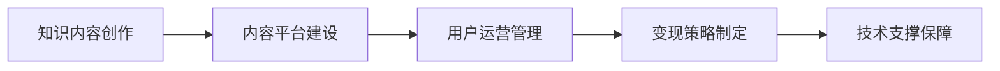

                 

## 1. 背景介绍

随着知识经济的崛起，互联网技术的发展，越来越多有志之士选择利用业余时间开展知识付费项目，既充实自我，又创造财富。本文旨在为有意涉足知识付费领域的程序员提供一个详细的项目启动攻略，以期帮助大家在副业之路上实现价值最大化。

### 1.1 项目背景
知识付费的兴起，离不开互联网技术尤其是人工智能、大数据、区块链等技术的支持。程序员作为这一领域的中坚力量，拥有丰富的技术积累和编程经验，可以借助自身优势，开发出具备高质量内容的知识付费项目，吸引用户，创造收入。

### 1.2 项目趋势
1. **个人品牌建设**：随着用户对内容质量的要求提升，拥有个人品牌的专业知识付费者更具竞争力。
2. **泛化与细化**：知识付费项目不再局限于专业课程，涉及更多生活技能、兴趣爱好等领域，满足用户多样化需求。
3. **互动与社区**：通过互动问答、社区交流等方式，增强用户粘性，构建生态系统。
4. **多元变现**：除了课程收入，还可以通过直播、咨询、产品推荐等方式实现多元化收入。

## 2. 核心概念与联系

### 2.1 核心概念概述

在知识付费项目中，程序员可以围绕以下几个核心概念进行构建：

- **知识内容创作**：将自身技术经验转化为系统化、有价值的知识内容。
- **内容平台建设**：搭建平台，提供课程、直播、问答等多种内容形式。
- **用户运营管理**：设计用户管理机制，建立良好的用户关系。
- **变现策略制定**：制定合理的收费机制，吸引用户付费。
- **技术支撑保障**：确保平台稳定运行，用户体验良好。

### 2.2 核心概念原理和架构的 Mermaid 流程图



这个流程图示意了知识付费项目的基本结构：先创作内容，再搭建平台，接着运营用户，最后实现变现，同时提供技术保障。各环节相互关联，形成一个完整的知识付费生态。

## 3. 核心算法原理 & 具体操作步骤

### 3.1 算法原理概述

知识付费项目开发本质上是一个系统化的工程，涉及内容、平台、用户、运营等多个方面。其核心算法和步骤包括以下几个方面：

1. **内容生成**：通过自我学习或社区协作，生成高质量的内容。
2. **平台搭建**：使用现有的技术栈，如React、Vue.js等，快速搭建平台。
3. **用户管理**：使用用户身份认证、权限控制等机制，管理用户行为。
4. **变现逻辑**：设计合理的计费方式，如单次购买、订阅模式等。
5. **数据分析**：通过用户行为数据，优化内容和运营策略。

### 3.2 算法步骤详解

以下是知识付费项目开发的主要步骤：

**Step 1: 内容创作**

- 确定主题：选择与自身技术积累相符合，同时市场有需求的领域。
- 内容设计：设计课程框架、课时内容、教学方式等。
- 内容制作：录制视频、编写文章、制作PPT等，确保内容质量。
- 内容审核：邀请专家评审，确保内容准确无误。

**Step 2: 平台搭建**

- 选择技术栈：基于React或Vue.js搭建前端，后端可使用Node.js、Django等。
- 数据库设计：设计用户信息、课程信息、支付信息等数据库表。
- 前后端对接：实现API接口，确保前后端数据同步。
- 接口测试：对API进行单元测试和集成测试，确保系统稳定。

**Step 3: 用户管理**

- 用户注册：提供邮箱、手机号等多种注册方式。
- 用户认证：实施身份认证和权限控制，确保用户信息安全。
- 社区功能：设计用户评论、点赞、分享等互动功能。
- 用户反馈：收集用户意见，优化内容和平台。

**Step 4: 变现逻辑**

- 选择合适的计费模式：如课程单次购买、订阅包月、免费+付费模式等。
- 设置合理的价格：调研市场，确定课程价格。
- 支付集成：集成支付平台，如支付宝、微信支付等。
- 订单管理：实现订单生成、查询、退款等功能。

**Step 5: 数据分析**

- 数据收集：记录用户行为数据，如登录、学习、购买等。
- 数据清洗：去除噪声数据，保留有用信息。
- 数据可视化：使用工具如Tableau、Power BI等，进行数据可视化分析。
- 策略优化：根据分析结果，优化内容和运营策略。

### 3.3 算法优缺点

**优点**：
1. **高效性**：基于现有技术栈，可以快速搭建平台，进入市场。
2. **灵活性**：内容形式多样，可以灵活适应不同用户需求。
3. **易操作性**：所需技术门槛相对较低，普通程序员亦可胜任。

**缺点**：
1. **内容同质化**：若缺乏创新，可能导致内容重复，难以吸引用户。
2. **竞争激烈**：知识付费市场竞争激烈，需要不断提升内容质量和服务。
3. **技术依赖**：平台稳定性和安全性依赖于技术实现，技术漏洞可能带来风险。

### 3.4 算法应用领域

知识付费项目的应用领域非常广泛，以下是一些典型的应用场景：

1. **技术课程**：针对特定技术领域，提供深入浅出的教学视频和文章。
2. **职业规划**：提供职业发展、面试技巧、简历优化等指导。
3. **兴趣教育**：提供编程、音乐、绘画等兴趣爱好的教学。
4. **健康生活**：提供健身、饮食、睡眠等健康生活指导。
5. **财务管理**：提供理财、投资、税务等财务管理知识。

## 4. 数学模型和公式 & 详细讲解 & 举例说明

### 4.1 数学模型构建

知识付费项目的数学模型可以简单表示为：

$$
R = \text{内容质量} \times \text{平台流量} \times \text{变现转化率} \times \text{复购率}
$$

其中，内容质量是基础，平台流量是关键，变现转化率和复购率是保证盈利的重要因素。

### 4.2 公式推导过程

- **内容质量**：内容质量越高，用户黏性越强，复购率越高。
- **平台流量**：平台流量越大，潜在用户越多，转化率越高。
- **变现转化率**：用户购买课程的转化率，与课程价格、内容价值等因素有关。
- **复购率**：用户后续购买的频率，与平台粘性、内容更新等因素有关。

通过以上公式，可以系统地分析知识付费项目的盈利潜力，并进行优化。

### 4.3 案例分析与讲解

- **案例一**：某程序员利用自身数据分析经验，创建了一个数据分析课程平台。通过优化课程内容、提升平台流量、设置合理的课程价格，以及提供免费试用、积分兑换等激励措施，最终实现了较高的变现率和复购率。
- **案例二**：某IT公司内部培训部门，利用员工专家的技术积累，搭建了一个内部知识分享平台。通过建立知识分享激励机制，整合内外资源，实现了技术知识的高效传播和应用。

## 5. 项目实践：代码实例和详细解释说明

### 5.1 开发环境搭建

**环境要求**：

- 编程语言：Python
- 框架：React、Vue.js、Node.js
- 数据库：MySQL、MongoDB
- 版本控制：Git

**安装步骤**：

1. 安装Node.js和npm，搭建前端开发环境。
2. 安装Python和pip，搭建后端开发环境。
3. 安装MySQL/MongoDB，搭建数据库环境。
4. 安装Git，搭建版本控制环境。

### 5.2 源代码详细实现

**前端框架**：

- React或Vue.js
- 示例代码：

```javascript
import React, { Component } from 'react';

class CourseList extends Component {
  render() {
    return (
      <div>
        {this.props.courses.map(course => (
          <div key={course.id}>
            <h2>{course.name}</h2>
            <p>{course.description}</p>
            <button onClick={() => this.props.onSelectCourse(course.id)}>Select</button>
          </div>
        ))}
      </div>
    );
  }
}

export default CourseList;
```

**后端框架**：

- Node.js + Express
- 示例代码：

```javascript
const express = require('express');
const app = express();
const port = 3000;

app.get('/api/courses', (req, res) => {
  // 查询数据库，返回课程列表
  res.send(courses);
});

app.listen(port, () => {
  console.log(`Server running at http://localhost:${port}/`);
});
```

### 5.3 代码解读与分析

**前端部分**：

- 使用React构建课程列表组件，动态渲染课程信息。
- 通过事件监听，处理用户选择课程的操作。

**后端部分**：

- 使用Express搭建API接口，处理课程列表的查询请求。
- 通过数据库查询，返回课程列表数据。

### 5.4 运行结果展示

- 前端展示：课程列表页面，用户可以选择感兴趣的课程。
- 后端展示：API接口，返回课程列表数据，响应前端请求。

## 6. 实际应用场景

### 6.1 个人品牌建设

程序员可以利用自身技术背景，创建个人品牌，通过知识付费实现品牌价值。例如，某程序员擅长编程面试，可以开设编程面试课程，并在平台上传自己的技术文章和面试经验分享，逐步建立自己的个人品牌，吸引用户关注。

### 6.2 行业技术分享

大型企业或技术团队，可以整合内部技术专家资源，创建企业内部知识分享平台，提高技术传播效率，同时通过知识付费，激励专家分享知识，实现技术和知识的双重价值。

### 6.3 兴趣生活教育

针对特定兴趣领域，如编程、音乐、绘画等，创建知识付费项目，吸引具有相同兴趣的用户，提供高质量的教学内容，满足其学习需求。

### 6.4 未来应用展望

1. **智能化推荐**：利用AI技术，实现内容推荐，提高用户粘性和满意度。
2. **跨平台整合**：将知识付费内容整合到社交媒体、博客平台，实现多渠道分发。
3. **交互式学习**：开发互动性强的学习工具，如编程练习、在线问答等，提升用户学习体验。
4. **虚拟教室**：构建虚拟教室，实现实时互动和在线直播，拓展用户学习方式。

## 7. 工具和资源推荐

### 7.1 学习资源推荐

- **React官方文档**：React官方文档，详细介绍了React的核心概念和使用方法。
- **Node.js官方文档**：Node.js官方文档，全面介绍Node.js环境搭建和核心API。
- **Django官方文档**：Django官方文档，详细介绍了Django的Web开发框架。
- **Coursera课程**：Coursera上相关课程，系统学习编程技术、数据科学等内容。
- **Udemy课程**：Udemy上相关课程，提供丰富的实战案例和技术讲解。

### 7.2 开发工具推荐

- **Visual Studio Code**：一款高效的前端开发工具，支持多种语言和框架。
- **GitHub**：一个版本控制平台，方便代码管理和协作。
- **Postman**：一个API测试工具，便于快速测试和调试API接口。
- **Jest**：一款JavaScript测试框架，支持单元测试和集成测试。
- **Webpack**：一个打包工具，支持模块化构建，提高项目部署效率。

### 7.3 相关论文推荐

- **编程语言和软件工程领域论文**：如Github的开源论文库，收录了大量前沿技术论文。
- **Web开发领域论文**：如ACM数字图书馆，提供多种Web开发技术的论文。
- **人工智能领域论文**：如arXiv论文库，收录了大量AI领域的最新研究成果。

## 8. 总结：未来发展趋势与挑战

### 8.1 总结

本文通过系统梳理知识付费项目开发流程，介绍了程序员如何利用自身技术优势，开展副业，实现自我增值。通过创作高质量内容、搭建高效平台、优化用户运营、设计合理的变现策略和技术保障，可以在知识付费领域取得成功。

### 8.2 未来发展趋势

1. **人工智能的结合**：知识付费与AI技术的结合，实现智能推荐、个性化学习等，提升用户体验。
2. **数据驱动运营**：利用大数据分析用户行为，优化内容和运营策略，实现精准营销。
3. **多元化收入**：通过广告、付费会员、内容版权等多元化的收入方式，实现盈利。
4. **社区化运营**：构建社区平台，促进用户互动，提高用户粘性和平台活力。
5. **国际化拓展**：面向全球市场，拓展知识付费内容和用户，实现全球化发展。

### 8.3 面临的挑战

1. **内容竞争激烈**：知识付费市场竞争激烈，内容同质化严重，需要不断创新和优化。
2. **用户留存困难**：用户粘性不足，流失率高，需要持续提升内容和平台质量。
3. **技术依赖性强**：平台稳定性和安全性依赖于技术实现，需要不断优化技术架构。
4. **版权和法律问题**：内容版权和法律问题复杂，需要合法合规运营。
5. **用户隐私保护**：用户隐私和数据安全问题突出，需要严格遵守相关法律法规。

### 8.4 研究展望

1. **内容智能生成**：利用AI技术，实现内容自动生成，提升创作效率。
2. **用户行为分析**：通过大数据分析，深入了解用户需求，提供更加个性化的服务。
3. **多渠道分发**：将知识付费内容分发到更多平台，实现多渠道用户覆盖。
4. **跨领域整合**：将知识付费与教育、娱乐、健康等领域的资源整合，提供综合解决方案。
5. **区块链技术**：利用区块链技术，实现内容版权保护和交易透明化。

## 9. 附录：常见问题与解答

**Q1: 如何选择合适的技术栈进行知识付费平台搭建？**

A: 选择合适的技术栈需要考虑以下因素：

1. **技术栈熟悉度**：选择自己熟悉的技术栈，降低开发难度。
2. **性能需求**：根据项目需求，选择适合的前后端技术栈，如React、Vue.js、Node.js等。
3. **可扩展性**：选择具有良好可扩展性的技术栈，便于未来业务扩展。
4. **社区支持**：选择有活跃社区支持的技术栈，便于快速解决问题。

**Q2: 知识付费项目如何设计合适的变现策略？**

A: 设计合适的变现策略需要考虑以下因素：

1. **用户需求**：根据用户需求，选择合适的变现模式，如单次购买、订阅模式等。
2. **内容价值**：根据内容价值，设置合理的课程价格，确保用户能够接受。
3. **激励措施**：通过积分兑换、会员特权等激励措施，吸引用户付费。
4. **持续优化**：根据用户反馈，不断优化课程内容和变现策略，提高用户满意度。

**Q3: 知识付费项目如何优化内容质量？**

A: 优化内容质量需要考虑以下因素：

1. **内容设计**：设计合理的内容框架，确保课程内容系统化、连贯性。
2. **内容制作**：录制高质量的视频、编写详细的文章，确保内容质量。
3. **内容审核**：邀请专家评审课程内容，确保内容准确无误。
4. **内容更新**：定期更新课程内容，确保内容的时效性和前瞻性。

**Q4: 如何处理知识付费平台的安全性和隐私保护？**

A: 处理平台安全性和隐私保护需要考虑以下因素：

1. **数据加密**：对用户数据进行加密处理，保护用户隐私。
2. **权限控制**：实施严格的权限控制，防止非法访问。
3. **安全审计**：定期进行安全审计，发现并修复安全漏洞。
4. **合规性**：遵守相关法律法规，保护用户数据安全。

---

作者：禅与计算机程序设计艺术 / Zen and the Art of Computer Programming

