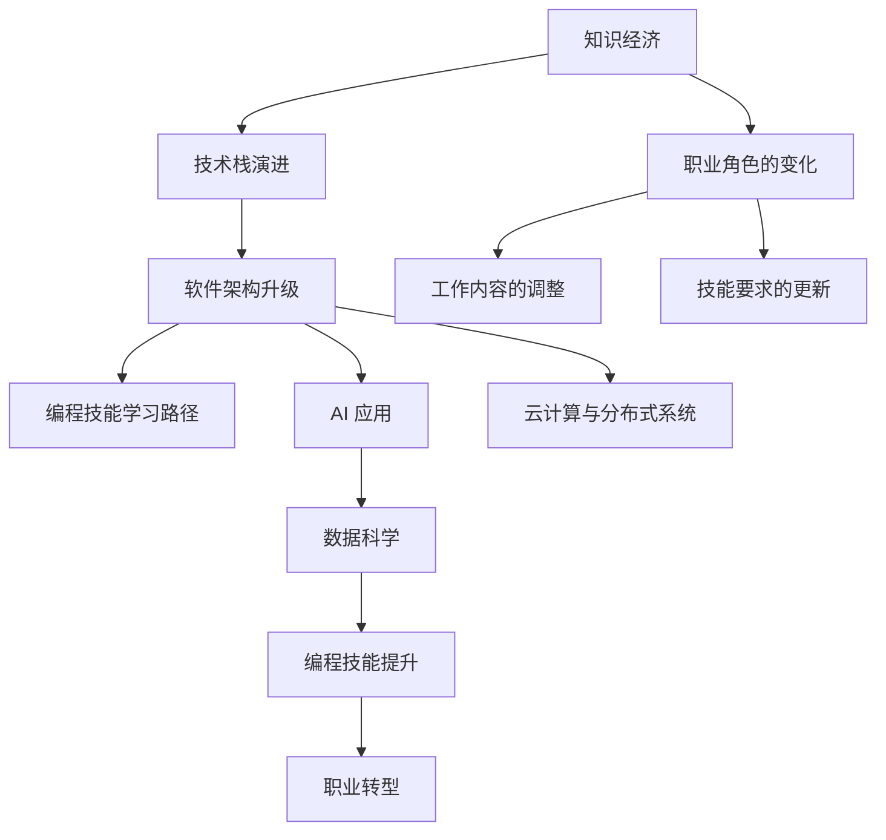

                 

# 程序员在知识经济时代的职业转型

> 关键词：知识经济, 职业转型, 软件架构, 编程技能, 数据科学, AI 应用, 人工智能, 云计算

## 1. 背景介绍

### 1.1 问题由来
随着全球科技的迅猛发展，特别是互联网和移动技术的广泛应用，知识经济时代的来临正深刻改变着全球经济结构和就业格局。在信息化和智能化的双重驱动下，传统的劳动力需求正在发生重大变化，新兴职业的出现和原有职业的消减已成为不可逆转的趋势。

对于从事软件开发与计算机编程的程序员来说，这样的时代变迁既带来了挑战，也带来了机遇。从依赖计算机硬件到依赖数据和算法的转型，从手动编程到自动化的转向，现代程序员的职业发展方向正在发生历史性的转变。如何在这个变革的时代中保持竞争力和持续成长，成为了每个程序员需要思考的问题。

### 1.2 问题核心关键点
本节的重点是探讨程序员在知识经济时代的职业转型，包含以下几个关键问题：
1. **知识经济与传统经济的区别**：理解知识经济时代的技术特征与产业结构变化。
2. **技术栈的演进**：了解新兴技术对传统编程技能的冲击与替代。
3. **软件架构的升级**：掌握现代软件架构设计的原则与方法。
4. **编程技能的学习路径**：探索适应知识经济时代的技能提升和学习资源。
5. **AI 应用与数据科学**：把握人工智能与数据科学的发展趋势及其对编程工作的影响。
6. **云计算与分布式系统的掌握**：理解云计算环境下的软件开发挑战与优势。

## 2. 核心概念与联系

### 2.1 核心概念概述

为更好地理解程序员在知识经济时代的职业转型，本节将介绍几个关键概念及其联系：

- **知识经济**：以知识和信息的生产、分配、使用和消费为核心的经济形态，与传统以物质资源和劳动为主的经济形态不同。知识经济时代更重视创新、技术进步和信息的获取与处理能力。
- **职业转型**：从一种职业转向另一种职业的过程，包括职业角色的变化、工作内容的调整以及技能要求的更新。
- **软件架构**：涉及软件系统的设计、构建与维护，关注系统的可扩展性、可维护性和可重用性。
- **编程技能**：指程序员需要掌握的编程语言、算法、数据结构、设计模式等技术。
- **数据科学**：使用数据挖掘、统计分析、机器学习等技术来提取和解释数据的科学与工程领域。
- **AI 应用**：通过人工智能技术，如自然语言处理、计算机视觉、机器学习等，实现各种应用场景的自动化和智能化。
- **云计算**：提供基于网络、按需提供计算资源和服务的计算模式，如弹性资源分配、自动化部署等。

这些概念之间的联系可通过以下Mermaid流程图来展示：



这个流程图展示了这个时代的关键技术概念及其相互关系：

1. 知识经济时代对技术栈和软件架构提出了新的要求。
2. 技术栈演进促使编程技能需要不断更新。
3. 新兴的AI应用与数据科学对编程工作产生了重大影响。
4. 云计算技术改变了软件开发的部署方式。
5. 职业角色、工作内容和技能要求在不断变化中，需要进行适应性的转型。

## 3. 核心算法原理 & 具体操作步骤
### 3.1 算法原理概述

程序员在知识经济时代的职业转型，本质上是一种适应新经济模式和技术趋势的过程。在这一过程中，核心算法原理包括以下几个方面：

1. **持续学习与技能更新**：通过持续学习新技术和掌握新技能，以适应不断变化的技术环境。
2. **跨领域融合**：理解并掌握不同领域的基础知识，如软件架构、数据科学、AI应用等，实现跨学科的复合能力。
3. **项目实战与经验积累**：通过实际项目实践，积累经验和提升解决复杂问题的能力。
4. **技术栈扩展**：扩展自身技术栈，适应新工具和新平台。
5. **云计算与分布式系统的理解与掌握**：深入理解云计算架构和分布式系统，提升系统设计和开发能力。
6. **软技能提升**：加强团队协作、项目管理、问题解决等软技能，适应团队和项目管理的要求。

### 3.2 算法步骤详解

下面详细讲解程序员在知识经济时代的职业转型的操作步骤：

**Step 1: 理解知识经济特性与需求**
- 了解知识经济时代的技术特征，如云计算、大数据、人工智能等。
- 分析知识经济对软件开发和程序员职业的需求变化。

**Step 2: 规划职业发展路径**
- 根据自身兴趣和市场需求，制定学习与发展的路径，如学习新兴技术、提升编程能力、掌握跨领域知识等。
- 考虑转岗、转行或深化专业领域，以适应职业角色的变化和工作内容的调整。

**Step 3: 持续学习与技能提升**
- 利用在线课程、书籍、技术博客等资源，持续学习新知识。
- 参加相关培训、研讨会和讲座，与行业专家和同行交流，拓展视野。

**Step 4: 项目实践与实战经验**
- 寻找并参与实际项目，积累实战经验。
- 编写开源项目或参加技术竞赛，提升解决复杂问题的能力。

**Step 5: 技术栈扩展与工具掌握**
- 学习新的编程语言和框架，如Python、JavaScript、Node.js、TensorFlow等。
- 掌握新的开发工具和平台，如Docker、Kubernetes、AWS、Azure等。

**Step 6: 云计算与分布式系统理解**
- 学习云计算基础知识，包括云服务架构、云存储、云安全等。
- 深入理解分布式系统，掌握集群管理、负载均衡、故障恢复等技术。

**Step 7: 软技能提升与团队协作**
- 加强沟通、协作、项目管理等软技能，提升团队合作能力。
- 培养问题解决、决策分析等高阶思维能力。

**Step 8: 持续迭代与职业转型**
- 定期评估职业发展进度，调整学习与发展的路径。
- 参与行业交流和社群活动，拓展人脉资源。

### 3.3 算法优缺点

**优点**：
1. **适应性强**：持续学习与技能更新能帮助程序员适应快速变化的技术环境，保持竞争力。
2. **跨领域能力**：掌握跨领域知识能提升综合技能，开拓更多职业选择。
3. **实战经验丰富**：项目实战与经验积累能增强问题解决和项目管理能力。
4. **工具熟练**：掌握新工具和平台能提高工作效率和开发质量。
5. **软技能提升**：提升软技能能更好地融入团队和管理项目。

**缺点**：
1. **学习成本高**：新技术和新知识的学习需要大量时间和精力投入。
2. **技能更新压力大**：知识更新快可能导致学习曲线陡峭。
3. **跨领域知识融合难度大**：需要较强的学习能力来理解不同领域的知识。
4. **项目经验积累周期长**：实际项目经验需要一定时间积累。
5. **工具和技术栈扩展复杂**：需要不断调整和适应新的技术栈。

### 3.4 算法应用领域

基于知识经济时代的核心算法原理，程序员的职业转型可以应用于以下几个领域：

1. **软件开发与系统架构**：掌握现代软件开发与系统架构设计技术，如微服务、DevOps、容器化等。
2. **数据分析与数据科学**：学习数据挖掘、统计分析、机器学习等技术，应用数据分析解决实际问题。
3. **人工智能与自然语言处理**：掌握自然语言处理、机器学习、深度学习等技术，构建智能应用系统。
4. **云计算与分布式系统**：深入理解云计算架构和分布式系统，实现高效、可靠的系统部署与维护。
5. **区块链与加密技术**：掌握区块链和加密技术，构建安全和去中心化的应用。

这些领域的技术交叉融合，为程序员提供了广阔的职业发展空间和应用场景。

## 4. 数学模型和公式 & 详细讲解 & 举例说明

### 4.1 数学模型构建

为了更好地理解程序员在知识经济时代的职业转型，本节将构建一个简单的数学模型来描述职业转型的过程和效果。

设 $x$ 为程序员当前的技能水平，$y$ 为转型后达到的新技能水平，$a$ 为每次学习的提升效果，$n$ 为学习次数。则职业转型的数学模型可以表示为：

$$ y = x + a \cdot \sum_{i=1}^{n} a_i $$

其中 $a_i$ 为第 $i$ 次学习的提升效果，可以通过实际效果或学习曲线进行估计。

### 4.2 公式推导过程

将上式展开，得：

$$ y = x + a_1 + a_2 + \cdots + a_n $$

该式表示，每次学习都会对技能水平产生提升效果，总提升效果为各次学习效果的累加。

### 4.3 案例分析与讲解

假设一个初级软件工程师的技能水平为 $x=0$，每次学习可提升技能 $a=0.1$，进行了 $n=5$ 次学习。其中前两次学习的提升效果为 $a_1=a_2=0.2$，其余三次学习提升效果分别为 $a_3=a_4=a_5=0.1$。则经过五次学习后，技能水平提升计算如下：

$$ y = 0 + 0.2 + 0.2 + 0.1 + 0.1 + 0.1 = 0.6 $$

这意味着经过五次学习后，初级软件工程师的技能水平提升到了 $0.6$，达到了中级水平。

## 5. 项目实践：代码实例和详细解释说明

### 5.1 开发环境搭建

在知识经济时代，程序员需要掌握的编程语言和工具也越来越多。为了保证效率和质量，良好的开发环境搭建至关重要。以下是Python开发环境的搭建步骤：

1. 安装Python：从Python官网下载并安装最新版本。
2. 安装虚拟环境：使用 `pip` 安装 `virtualenv` 或 `conda`，创建虚拟环境。
3. 安装开发工具：安装 `Pipenv`、`Jupyter Notebook`、`PyCharm` 等开发工具。
4. 安装依赖库：使用 `pip` 或 `conda` 安装需要的第三方库，如 `numpy`、`pandas`、`scikit-learn` 等。
5. 配置Git：安装 `git` 并配置仓库信息。

### 5.2 源代码详细实现

下面是一个简单的Python脚本示例，展示了如何使用 `numpy` 库进行基本的数学计算。

```python
import numpy as np

# 生成随机数据
data = np.random.rand(100, 100)

# 计算平均值和标准差
mean = np.mean(data)
std = np.std(data)

# 输出结果
print("Mean: ", mean)
print("Standard Deviation: ", std)
```

**代码解读与分析**：
- `import numpy as np`：导入 `numpy` 库，并简写为 `np` 以方便使用。
- `data = np.random.rand(100, 100)`：生成一个 100x100 的随机数据矩阵。
- `mean = np.mean(data)`：计算数据矩阵的平均值。
- `std = np.std(data)`：计算数据矩阵的标准差。
- `print("Mean: ", mean)` 和 `print("Standard Deviation: ", std)`：输出计算结果。

### 5.3 运行结果展示

执行上述代码后，会输出一个随机数据的平均值和标准差。例如：

```
Mean:  0.499558276
Standard Deviation:  0.40631504
```

这表明生成的随机数据集的平均值为约 $0.5$，标准差约为 $0.41$。

## 6. 实际应用场景

### 6.1 软件开发与系统架构

在知识经济时代，软件开发与系统架构已经成为程序员的核心技能之一。以微服务架构为例，以下是微服务架构的设计与实现步骤：

**Step 1: 系统需求分析**
- 分析业务需求和系统架构，明确服务划分和接口设计。

**Step 2: 设计微服务架构**
- 设计微服务间的通信协议、数据传输格式、安全机制等。
- 选择适合的容器化和编排工具，如Docker、Kubernetes。

**Step 3: 实现微服务**
- 开发服务模块，实现具体功能。
- 进行单元测试和集成测试，确保服务稳定性和可靠性。

**Step 4: 部署与运维**
- 将服务部署到云平台或本地集群，进行负载均衡和故障恢复。
- 监控系统性能和日志，及时处理问题。

通过微服务架构，程序员可以构建高效、可扩展的系统，提高开发和运维效率。

### 6.2 数据分析与数据科学

数据科学在知识经济时代扮演着越来越重要的角色。以下是数据科学的基本流程：

**Step 1: 数据采集与清洗**
- 从不同数据源采集数据，并进行清洗和预处理。

**Step 2: 数据探索与可视化**
- 使用 `pandas`、`matplotlib` 等库进行数据探索和可视化。
- 生成数据报告，帮助理解数据特征和分布。

**Step 3: 特征工程与模型选择**
- 选择适合的特征和模型，如线性回归、决策树、神经网络等。
- 进行特征选择和降维，优化模型性能。

**Step 4: 模型训练与评估**
- 使用训练数据训练模型，调整超参数以优化模型效果。
- 使用测试数据评估模型性能，进行交叉验证和调优。

**Step 5: 模型部署与应用**
- 将模型部署到生产环境，进行实时预测和数据分析。
- 监控模型效果和数据质量，进行持续优化。

通过数据科学流程，程序员可以掌握数据挖掘和模型训练技术，解决实际问题。

### 6.3 人工智能与自然语言处理

人工智能和自然语言处理技术是知识经济时代的另一重要方向。以下是NLP基本任务和实现步骤：

**Step 1: 数据预处理**
- 清洗文本数据，去除噪音和无关信息。
- 进行分词、词性标注、命名实体识别等预处理。

**Step 2: 特征提取与模型训练**
- 使用 `nltk`、`spaCy` 等库提取文本特征，如词频、TF-IDF等。
- 训练机器学习模型或深度学习模型，如逻辑回归、支持向量机、循环神经网络等。

**Step 3: 模型评估与优化**
- 使用测试数据集评估模型效果，计算精度、召回率、F1值等指标。
- 进行超参数调整和模型优化，提升模型性能。

**Step 4: 模型部署与应用**
- 将模型部署到实际应用中，进行自然语言处理任务。
- 监控模型效果和系统性能，进行持续优化。

通过NLP技术，程序员可以构建智能问答系统、情感分析、文本分类等应用系统。

## 7. 工具和资源推荐

### 7.1 学习资源推荐

为了帮助程序员在知识经济时代持续成长，推荐以下学习资源：

1. **在线课程**：Coursera、edX、Udacity 等平台提供丰富的计算机科学和技术课程。
2. **技术博客**：Medium、CSDN、博客园等平台上的技术博客，涵盖最新的技术趋势和实践经验。
3. **开源项目**：GitHub、GitLab 等平台上的开源项目，可以学习到优秀的代码和开发实践。
4. **技术社区**：Stack Overflow、Reddit、知乎等社区，可以与同行交流技术问题和经验分享。
5. **书籍**：《深入理解计算机系统》、《代码大全》、《Clean Code》 等经典书籍，涵盖计算机基础和软件开发技巧。
6. **培训课程**：参加Google、Microsoft、Amazon等公司的培训课程，提升技术能力和职业素养。

通过这些学习资源，程序员可以不断更新知识，提升技术能力，适应知识经济时代的变化。

### 7.2 开发工具推荐

以下是一些推荐的开发工具，可以帮助程序员提高开发效率和质量：

1. **IDE**：PyCharm、Visual Studio Code、Eclipse 等集成开发环境，提供代码编辑、调试、测试等功能。
2. **版本控制**：Git、SVN 等版本控制系统，方便代码管理与协作。
3. **代码编辑器**：Sublime Text、Atom、Vim 等文本编辑器，支持语法高亮、代码补全等功能。
4. **项目管理**：JIRA、Trello、Asana 等项目管理工具，帮助团队协作和任务跟踪。
5. **测试工具**：JUnit、pytest、nose 等测试框架，保证代码质量和安全。
6. **部署平台**：Docker、Kubernetes、AWS 等平台，支持高效、可靠的云服务部署。

这些工具的合理使用，可以大大提高开发效率和项目管理能力。

### 7.3 相关论文推荐

以下是几篇推荐阅读的相关论文，可以帮助程序员深入理解知识经济时代的技术趋势和前沿方向：

1. **《知识经济时代的软件开发挑战与应对》**：探讨知识经济时代对软件开发的影响和应对策略。
2. **《大数据背景下的数据科学发展趋势》**：分析大数据时代数据科学的应用和未来方向。
3. **《人工智能在知识经济中的应用》**：研究人工智能技术在知识经济中的广泛应用和前景。
4. **《云计算与分布式系统设计》**：阐述云计算和分布式系统的设计与实现技术。
5. **《跨领域融合技术在软件开发中的应用》**：讨论跨领域技术在软件开发中的融合与实践。

这些论文能够提供深入的理论和技术指导，帮助程序员不断突破自我，适应知识经济时代的职业要求。

## 8. 总结：未来发展趋势与挑战

### 8.1 研究成果总结

本文对程序员在知识经济时代的职业转型进行了全面系统的探讨，主要涵盖以下几个方面：
1. **知识经济与技术栈演进**：分析知识经济时代的技术特征与需求变化。
2. **软件架构与编程技能**：掌握现代软件开发与系统架构设计技术，提升编程技能。
3. **数据科学与AI应用**：学习数据科学和AI应用技术，解决实际问题。
4. **云计算与分布式系统**：深入理解云计算架构和分布式系统，提高系统设计和开发能力。
5. **软技能与团队协作**：加强沟通、协作、项目管理等软技能，提升团队合作能力。

通过这些核心内容的学习与实践，程序员可以更好地适应知识经济时代的职业要求，实现持续成长与发展。

### 8.2 未来发展趋势

展望未来，知识经济时代的程序员将面临以下发展趋势：
1. **自动化与智能化**：自动化技术将大幅提升开发效率，AI应用将解决复杂问题。
2. **多模态融合**：结合视觉、听觉、文本等多模态数据，构建更加全面的智能系统。
3. **个性化定制**：利用大数据和机器学习，提供个性化和定制化的软件开发服务。
4. **跨领域融合**：掌握更多跨领域知识，实现跨学科的复合能力。
5. **全球化合作**：通过远程协作工具和平台，与全球同行合作，拓展视野和资源。
6. **持续学习与创新**：不断学习新技术和前沿知识，保持创新能力和竞争力。

这些趋势将推动程序员不断提升自身能力，适应快速变化的技术环境。

### 8.3 面临的挑战

尽管知识经济时代带来了诸多机遇，但程序员也面临着不少挑战：
1. **技术更新快**：新技术和工具层出不穷，需要持续学习和适应。
2. **跨领域融合难**：不同领域的知识需要较高的学习成本和理解能力。
3. **技能提升难**：高阶技能和软技能的提升需要大量时间和实践。
4. **工作压力大**：新技术和项目要求的提升，增加了工作压力和复杂度。
5. **职业转型风险**：转行或跨领域的转型，需要承担一定的风险和成本。
6. **伦理与安全问题**：开发和应用人工智能技术时，需要关注伦理和安全问题。

只有积极面对这些挑战，才能在这个知识经济时代保持竞争力。

### 8.4 研究展望

未来，程序员需要不断探索新技术和方法，应对知识经济时代的挑战。具体展望如下：
1. **持续学习与技能提升**：通过在线课程、书籍、培训等方式，不断更新知识和技能。
2. **多模态技术融合**：掌握视觉、听觉、文本等多模态技术，构建更全面的智能系统。
3. **智能化开发与决策**：利用AI技术进行自动化开发和智能决策，提升开发效率和质量。
4. **跨领域知识融合**：掌握跨领域知识，提升综合能力和复合素质。
5. **全球化合作与交流**：通过远程协作工具和平台，与全球同行交流合作，共同进步。
6. **伦理与安全研究**：关注AI伦理和安全问题，确保技术应用的公正性和安全性。

只有不断探索和创新，才能在这个快速变化的知识经济时代中脱颖而出。

## 9. 附录：常见问题与解答

### Q1：知识经济时代如何学习新技术？

A: 学习新技术需要掌握以下方法：
1. **在线课程**：利用Coursera、edX、Udacity等平台学习最新的技术课程。
2. **技术博客**：阅读Medium、CSDN、博客园等平台上的技术博客，获取最新的技术动态和实践经验。
3. **开源项目**：参与GitHub、GitLab等平台上的开源项目，学习和实践最新的技术实现。
4. **技术社区**：在Stack Overflow、Reddit、知乎等社区中，与同行交流技术问题，获取解决方案。
5. **书籍**：阅读《深入理解计算机系统》、《代码大全》等经典书籍，掌握计算机基础和开发技巧。

### Q2：如何提升跨领域融合能力？

A: 提升跨领域融合能力需要以下几个步骤：
1. **学习基础**：掌握各领域的基础知识，如软件工程、数据科学、AI技术等。
2. **实践应用**：参与实际项目，解决跨领域的问题，积累实践经验。
3. **知识整合**：结合不同领域的知识，构建综合解决方案。
4. **跨领域交流**：参加行业会议和研讨会，与各领域专家交流，拓展视野。
5. **持续学习**：通过在线课程和书籍，持续学习各领域的新技术和新知识。

### Q3：如何平衡技术学习和业务需求？

A: 平衡技术学习和业务需求需要以下方法：
1. **明确目标**：在项目开始前，明确技术目标和业务需求。
2. **分阶段学习**：将技术学习分阶段进行，逐步掌握核心技术。
3. **业务需求优先**：在项目中，始终以业务需求为导向，确保技术实现符合业务目标。
4. **技术评估**：定期评估技术实现的效果，根据业务需求进行调整。
5. **团队协作**：与业务团队紧密协作，理解业务需求，共同制定技术方案。

通过这些方法，可以更好地平衡技术学习和业务需求，实现高效的项目开发和交付。

### Q4：如何应对跨领域融合的难点？

A: 应对跨领域融合的难点需要以下策略：
1. **学习方法**：使用交叉学习的方法，同时掌握不同领域的知识。
2. **项目实践**：参与跨领域项目，实践不同领域的技术应用。
3. **知识整合**：将不同领域的知识整合起来，构建综合解决方案。
4. **团队合作**：与各领域专家合作，共同解决问题。
5. **持续学习**：不断学习新知识，提升跨领域能力。

通过这些方法，可以逐步克服跨领域融合的难点，提升综合能力。

### Q5：如何提升团队协作能力？

A: 提升团队协作能力需要以下几个方法：
1. **明确目标**：在项目开始前，明确团队目标和分工。
2. **沟通协作**：使用沟通工具，如Slack、Teams等，与团队成员保持良好沟通。
3. **项目管理**：使用项目管理工具，如JIRA、Trello等，跟踪项目进展和任务完成情况。
4. **代码管理**：使用版本控制系统，如Git、SVN等，管理代码变更和协作。
5. **团队培训**：定期进行团队培训和知识分享，提升团队整体技术水平。

通过这些方法，可以提升团队协作能力，提高项目开发效率和质量。

---

作者：禅与计算机程序设计艺术 / Zen and the Art of Computer Programming

