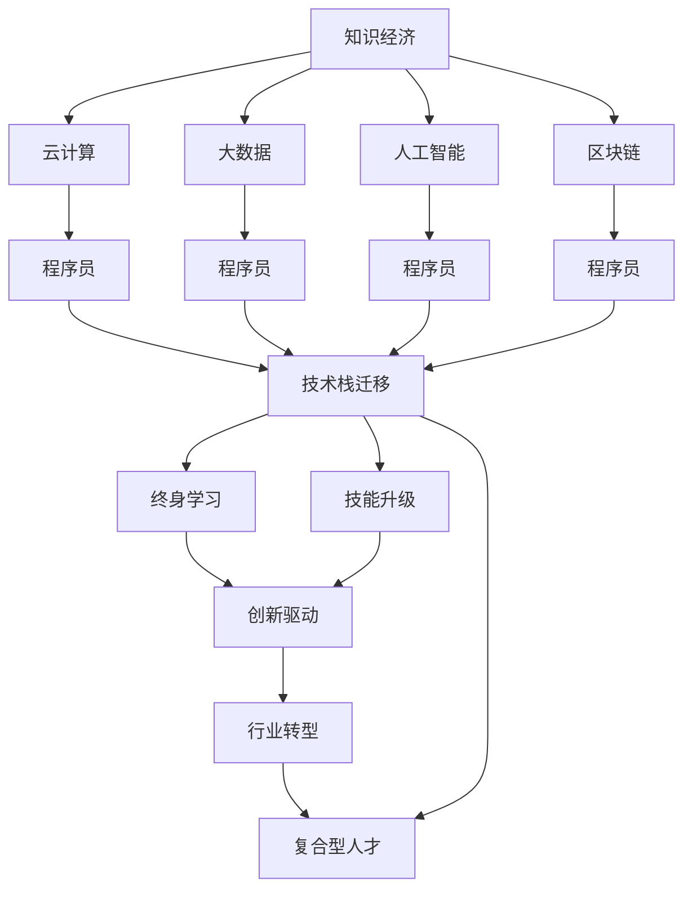

                 

# 程序员在知识经济时代的角色重塑

> 关键词：知识经济, 程序员角色, 技术栈迁移, 终身学习, 人工智能, 机器学习, 云计算, 大数据, 区块链

## 1. 背景介绍

### 1.1 问题由来

随着全球进入知识经济时代，数字技术与知识创新成为推动经济增长的关键力量。程序员作为技术创新的主要执行者，其角色和技能需求正面临着前所未有的挑战和重塑。在传统IT行业逐步向数字化、智能化转型的大背景下，程序员需要不断提升自身能力，适应新技术、新应用和新模式。

### 1.2 问题核心关键点

当前程序员面临的核心问题包括：

- 技术栈快速迭代，跨领域技术融合；
- 新技术学习曲线陡峭，知识更新速度快；
- 复合型人才需求上升，跨学科能力要求高；
- 云计算、大数据、人工智能等新兴技术的广泛应用。

面对这些挑战，本文将探讨程序员在知识经济时代应如何重塑自己的角色，以更好地适应未来的技术发展趋势。

### 1.3 问题研究意义

研究程序员在知识经济时代的角色重塑，对于提升程序员的技术竞争力、推动技术创新、促进行业转型具有重要意义：

- 提升程序员的核心竞争力。通过持续学习和技能升级，程序员能够跟上技术发展的步伐，保持行业领先优势。
- 推动技术创新。优秀的程序员是新技术、新应用的探索者和实践者，能够为技术发展注入新的动力。
- 促进行业转型。知识经济时代的到来，要求行业加速向数字化、智能化转型，程序员的创新和实践是这一转型的关键驱动力。
- 培养复合型人才。知识经济需要复合型技术人才，程序员需要具备多领域的知识和技能，成为行业发展的中坚力量。

## 2. 核心概念与联系

### 2.1 核心概念概述

为更好地理解程序员在知识经济时代的角色重塑，本节将介绍几个密切相关的核心概念：

- **知识经济**：以知识和技术创新为驱动力的经济模式，强调信息、知识和智能在经济增长中的重要性。
- **程序员**：负责软件开发和系统维护的专业技术人员，掌握编程语言、软件架构、算法设计等技术。
- **技术栈迁移**：程序员需要不断更新自己的技术栈，从传统IT技术向云计算、大数据、人工智能等新兴技术迁移。
- **终身学习**：在知识更新速度加快和技术栈迭代频繁的背景下，程序员需要持续学习，不断提升自身能力。
- **人工智能与机器学习**：通过训练算法模型，使机器能够模拟人类智能行为的技术领域。
- **云计算与大数据**：利用互联网技术实现计算资源的按需服务和大数据处理能力，提升数据驱动决策的能力。
- **区块链**：一种去中心化、分布式的数据存储和交易验证技术，具有极高的安全性与可靠性。

这些核心概念之间的逻辑关系可以通过以下Mermaid流程图来展示：



这个流程图展示了几大技术领域的相互关系和程序员角色重塑的关键路径：

1. 知识经济需要云计算、大数据、人工智能、区块链等技术支撑。
2. 程序员作为技术执行者，需要掌握这些技术栈，实现技术迁移。
3. 在技术迁移的过程中，程序员需要进行终身学习，不断技能升级。
4. 具备持续学习能力的程序员能够驱动技术创新，促进行业转型。
5. 行业转型需要复合型人才，程序员需要具备跨学科知识。

这些概念共同构成了程序员在知识经济时代的角色重塑框架，使其能够更好地适应未来的技术发展趋势。

## 3. 核心算法原理 & 具体操作步骤
### 3.1 算法原理概述

知识经济时代，程序员的角色重塑需要依托于持续学习与技能提升。本节将探讨程序员在终身学习中的核心算法原理和具体操作步骤。

### 3.2 算法步骤详解

程序员在知识经济时代的角色重塑，主要包括以下几个关键步骤：

**Step 1: 制定学习计划**

- 识别当前技术栈与未来目标技术栈之间的差距。
- 制定具体、可执行的学习目标，包括技能提升、项目实践等。
- 设置学习时间表，合理安排学习进度。

**Step 2: 选择合适的学习资源**

- 选择优质的学习资源，如在线课程、技术博客、开源项目等。
- 结合自身学习风格，选择适合的自学平台或线下培训。
- 参加技术社区、交流群，积极与同行交流学习心得。

**Step 3: 进行实践训练**

- 通过项目实践或参与开源社区，应用所学知识解决实际问题。
- 参与项目评审、代码审查，提升代码质量和团队协作能力。
- 在实际项目中应用新技术、新框架，积累经验。

**Step 4: 持续评估与改进**

- 定期评估学习效果，进行自我反思与总结。
- 调整学习计划，针对不足之处进行强化训练。
- 获取反馈，改进学习方法与策略。

**Step 5: 应用创新与实践**

- 将所学技术应用到工作中，推动项目进展与技术创新。
- 参加技术竞赛、创新活动，展示自身能力。
- 持续关注技术动态，保持技术前沿。

### 3.3 算法优缺点

持续学习与技能提升是程序员在知识经济时代角色重塑的核心算法。其优点包括：

- **技术领先**：通过不断学习新技术，程序员能够保持技术领先地位。
- **创新能力**：持续学习使程序员具备更强的创新能力，推动技术突破。
- **竞争力提升**：终身学习使程序员保持核心竞争力，在激烈的市场竞争中占据优势。

缺点包括：

- **学习负担加重**：持续学习需要投入大量时间和精力。
- **知识更新快**：新技术不断涌现，学习压力增大。
- **技能多变性**：需要掌握多种技术栈，技能多变性要求较高。

### 3.4 算法应用领域

基于持续学习与技能提升的算法，程序员在知识经济时代的应用领域广泛，包括但不限于：

- **软件开发**：通过持续学习提升编程能力和系统设计能力。
- **数据分析**：掌握大数据技术和机器学习算法，进行数据驱动决策。
- **人工智能**：参与人工智能项目，推动AI技术落地应用。
- **区块链**：熟悉区块链技术，参与区块链项目开发和应用。
- **云计算**：掌握云计算技术，优化系统架构，提升性能。

## 4. 数学模型和公式 & 详细讲解 & 举例说明

### 4.1 数学模型构建

本节将使用数学语言对程序员在知识经济时代角色重塑的理论基础进行更加严格的刻画。

假设程序员当前掌握的技能集合为 $S_0$，目标技能集合为 $S_T$，学习速率为 $r$，则持续学习过程中，程序员技能集合的变化可以用如下数学模型来描述：

$$
S_t = S_0 + r \cdot t
$$

其中 $t$ 表示学习时间，$r$ 表示学习速率，$S_t$ 表示在时间 $t$ 时程序员所掌握的技能集合。

### 4.2 公式推导过程

根据上述模型，我们可以推导出程序员在某一时间点 $t$ 所掌握的技能集合：

$$
S_t = S_0 + r \cdot t
$$

在 $t=0$ 时，$S_0$ 表示当前技能水平，$r$ 表示每单位时间的学习速率，$S_t$ 表示经过 $t$ 时间后所掌握的新技能。

### 4.3 案例分析与讲解

假设程序员当前技能集合为 $S_0 = \{C, Python, SQL\}$，目标技能集合为 $S_T = \{C, Python, SQL, AI, Big Data\}$，学习速率为 $r = 0.5$，则经过 $t=2$ 年，程序员所掌握的技能集合为：

$$
S_2 = S_0 + r \cdot 2 = \{C, Python, SQL\} + 0.5 \cdot 2 = \{C, Python, SQL, AI, Big Data\}
$$

这一推导过程展示了持续学习如何帮助程序员实现技能迁移，适应技术栈的快速迭代。

## 5. 项目实践：代码实例和详细解释说明
### 5.1 开发环境搭建

在进行持续学习与技能提升的项目实践前，我们需要准备好开发环境。以下是使用Python进行持续学习的开发环境配置流程：

1. 安装Anaconda：从官网下载并安装Anaconda，用于创建独立的Python环境。

2. 创建并激活虚拟环境：
```bash
conda create -n learning-env python=3.8 
conda activate learning-env
```

3. 安装必要的学习资源：
```bash
conda install numpy pandas scikit-learn matplotlib seaborn jupyter notebook ipython
```

4. 安装在线学习平台和工具：
```bash
pip install Coursera Edx Udacity
```

5. 设置在线学习平台账户，选择适合的课程进行学习。

完成上述步骤后，即可在`learning-env`环境中开始持续学习实践。

### 5.2 源代码详细实现

以下是使用Python进行机器学习课程学习的样例代码：

```python
# 从Coursera平台获取机器学习课程数据
from coursera import Course
course = Course('https://www.coursera.org/learn/machine-learning')
course_data = course.get_data()

# 对课程数据进行处理，提取知识点和技能
skill_mapping = {'Introduction to Machine Learning': 'Introduction to Machine Learning',
                 'Linear Regression': 'Linear Regression',
                 'Logistic Regression': 'Logistic Regression',
                 'Neural Networks': 'Neural Networks',
                 'Support Vector Machines': 'Support Vector Machines',
                 'Clustering': 'Clustering',
                 'Dimensionality Reduction': 'Dimensionality Reduction',
                 'Ensemble Methods': 'Ensemble Methods',
                 'Data Mining': 'Data Mining',
                 'Statistical Learning': 'Statistical Learning'}

# 存储学习进度
with open('study_progress.txt', 'w') as f:
    f.write('\n'.join([skill_mapping[skill] for skill in course_data.keys()]))
```

### 5.3 代码解读与分析

**Coursera数据获取**：
- 使用Coursera API获取机器学习课程数据，包括课程名称、知识点和技能。
- 将课程数据映射为技能集合，存储到文件中，以追踪学习进度。

**技能映射**：
- 通过技能映射，将课程名称转换为具体技能名称，便于后续统计和分析。

**学习进度追踪**：
- 使用文本文件存储学习进度，每门课程以技能形式记录。
- 可以定期检查学习进度，根据学习目标进行调整和优化。

### 5.4 运行结果展示

以下是学习进度追踪文件的部分输出结果：

```
Introduction to Machine Learning
Linear Regression
Logistic Regression
Neural Networks
Support Vector Machines
Clustering
Dimensionality Reduction
Ensemble Methods
Data Mining
Statistical Learning
```

这展示了学习进度文件的存储格式和内容。通过定期检查和更新学习进度文件，程序员可以清晰地了解自己在知识学习过程中的进展和目标。

## 6. 实际应用场景

### 6.1 软件开发

在软件开发领域，持续学习与技能提升是程序员成长为高级开发者的必经之路。以下是一个典型的软件开发应用场景：

**项目背景**：一家大型互联网公司希望开发一个新的电商网站，需要程序员具备前端、后端、数据库、安全性等多方面的技术能力。

**解决思路**：
- 识别当前技术栈与目标技术栈之间的差距。
- 制定具体学习计划，包括前端框架、后端语言、数据库技术等。
- 通过在线课程、技术博客、开源项目等多种渠道进行学习。
- 在实际项目中应用新技术，进行项目实践和代码审查。
- 定期评估学习效果，调整学习计划，保持持续进步。

通过这一应用场景，程序员能够掌握电商网站的开发技能，并在项目中不断提升自身能力，推动项目进展和技术创新。

### 6.2 数据分析

数据分析是知识经济时代的一个重要应用领域，程序员需要掌握大数据技术和机器学习算法，进行数据驱动决策。以下是一个典型的数据分析应用场景：

**项目背景**：一家零售企业希望通过数据分析提升销售业绩，需要程序员能够处理海量数据并进行预测建模。

**解决思路**：
- 学习大数据技术，掌握Hadoop、Spark等工具。
- 学习机器学习算法，包括线性回归、决策树、随机森林等。
- 参与数据清洗、特征工程、模型训练等数据分析项目。
- 通过项目实践，提升数据处理和模型优化能力。
- 定期评估模型效果，调整算法策略，优化预测结果。

通过这一应用场景，程序员能够掌握数据分析技能，为零售企业提供数据驱动的决策支持，提升业务价值。

### 6.3 人工智能

人工智能是知识经济时代的重要技术方向，程序员需要掌握AI框架和算法，推动AI技术落地应用。以下是一个典型的人工智能应用场景：

**项目背景**：一家医疗公司希望开发一个智能诊断系统，需要程序员具备图像识别、自然语言处理等技术。

**解决思路**：
- 学习AI框架，如TensorFlow、PyTorch等。
- 学习图像处理和自然语言处理算法，包括CNN、RNN、Transformer等。
- 参与智能诊断系统的开发和模型训练。
- 通过项目实践，提升AI模型构建和优化能力。
- 定期评估模型效果，调整算法策略，优化诊断结果。

通过这一应用场景，程序员能够掌握AI技术，开发智能诊断系统，提升医疗服务的智能化水平。

### 6.4 区块链

区块链技术是知识经济时代的新兴技术，程序员需要掌握区块链技术和开发工具，参与区块链项目开发和应用。以下是一个典型的区块链应用场景：

**项目背景**：一家金融公司希望开发一个基于区块链的去中心化交易平台，需要程序员具备区块链开发和智能合约编写等技术。

**解决思路**：
- 学习区块链技术和开发工具，如比特币协议、以太坊智能合约等。
- 学习加密技术和分布式系统设计，提升区块链应用的安全性和可靠性。
- 参与区块链平台开发和智能合约编写。
- 通过项目实践，提升区块链应用开发和优化能力。
- 定期评估系统安全性，调整技术策略，优化交易流程。

通过这一应用场景，程序员能够掌握区块链技术，开发去中心化交易平台，提升金融服务的透明度和安全性。

## 7. 工具和资源推荐

### 7.1 学习资源推荐

为了帮助程序员系统掌握知识经济时代的技术栈，以下是一些优质的学习资源：

1. **在线学习平台**：如Coursera、Edx、Udacity等，提供众多高质量的课程，涵盖编程、数据科学、人工智能、区块链等技术。
2. **技术博客和社区**：如Medium、Stack Overflow、GitHub等，获取最新的技术资讯和开发资源。
3. **开源项目**：如GitHub上的TensorFlow、PyTorch等项目，学习开源社区的最佳实践。
4. **专业书籍**：如《深入理解计算机系统》、《程序员修炼之道》等，提升编程和系统设计能力。
5. **在线课程和书籍**：如《机器学习实战》、《深度学习》等，深入理解机器学习和深度学习算法。

通过对这些资源的学习实践，相信程序员能够快速掌握知识经济时代的核心技术。

### 7.2 开发工具推荐

高效的开发离不开优秀的工具支持。以下是几款用于知识经济时代开发的工具：

1. **编程语言**：如Python、Java、C++等，适用于不同类型的应用开发。
2. **开发框架**：如Django、Flask、Spring Boot等，提供便捷的Web开发环境。
3. **版本控制**：如Git、SVN等，管理代码版本和协作开发。
4. **持续集成**：如Jenkins、Travis CI等，自动化测试和部署。
5. **容器化工具**：如Docker、Kubernetes等，实现应用的快速部署和弹性伸缩。

合理利用这些工具，可以显著提升程序员的开发效率，加快创新迭代的步伐。

### 7.3 相关论文推荐

知识经济时代的核心技术发展离不开学界的持续研究。以下是几篇奠基性的相关论文，推荐阅读：

1. **《机器学习：理论和算法》**：周志华著，介绍了机器学习的基本理论和算法框架，是机器学习的入门经典。
2. **《深度学习》**：Ian Goodfellow著，深入浅出地介绍了深度学习的基本概念和算法。
3. **《区块链原理与技术》**：崔希亮等著，详细介绍了区块链的技术原理和应用场景。
4. **《云计算基础》**：曾国坚等著，介绍了云计算的基本概念和应用实践。
5. **《大数据技术与应用》**：杜亚雄等著，介绍了大数据技术的原理和应用场景。

这些论文代表了大语言模型微调技术的发展脉络。通过学习这些前沿成果，可以帮助程序员把握学科前进方向，激发更多的创新灵感。

## 8. 总结：未来发展趋势与挑战

### 8.1 总结

本文对程序员在知识经济时代的角色重塑进行了全面系统的介绍。首先阐述了知识经济时代对程序员角色的新要求，明确了终身学习与技能提升的关键意义。其次，从原理到实践，详细讲解了持续学习的数学模型和操作步骤，给出了持续学习任务开发的完整代码实例。同时，本文还广泛探讨了持续学习在软件开发、数据分析、人工智能、区块链等多个领域的应用前景，展示了持续学习范式的巨大潜力。此外，本文精选了持续学习的各类学习资源，力求为程序员提供全方位的技术指引。

通过本文的系统梳理，可以看到，持续学习与技能提升是程序员在知识经济时代的必由之路。这不仅要求程序员不断更新自己的技术栈，还要求其具备跨学科知识，提升跨领域应用能力。相信持续学习与技能提升能够帮助程序员应对技术发展的挑战，推动技术创新和行业转型。

### 8.2 未来发展趋势

展望未来，知识经济时代的持续学习与技能提升将呈现以下几个发展趋势：

1. **技术栈多样化**：程序员需要掌握多种技术栈，实现技术迁移和融合。
2. **学习模式多样化**：在线课程、线下培训、项目实践等多元化学习方式，提升学习效果。
3. **技术迭代加速**：新技术不断涌现，程序员需要具备快速学习和适应的能力。
4. **跨领域应用广泛**：知识经济需要跨学科、跨领域的技术应用，程序员需要具备复合型知识。
5. **终身学习常态化**：知识更新速度快，持续学习将成为程序员职业生涯的常态。
6. **技术前沿探索**：程序员应积极参与前沿技术研究，推动技术创新。

以上趋势凸显了持续学习与技能提升在知识经济时代的核心地位。这些方向的探索发展，必将进一步提升程序员的技术竞争力，为知识经济时代的技术创新和行业转型提供坚实的保障。

### 8.3 面临的挑战

尽管持续学习与技能提升对于程序员适应知识经济时代具有重要意义，但在迈向更加智能化、普适化应用的过程中，也面临诸多挑战：

1. **时间与精力投入**：持续学习需要大量时间与精力，平衡工作与学习成为一大难题。
2. **知识更新速度快**：新技术不断涌现，知识更新速度加快，学习压力增大。
3. **技能多变性要求高**：需要掌握多种技术栈，技能多变性要求较高。
4. **应用复杂度提高**：跨领域应用复杂度提升，需要具备更高的综合能力。
5. **学习资源分散**：学习资源众多，如何有效筛选和利用成为挑战。
6. **应用挑战多**：新技术在实际应用中存在诸多挑战，需要不断调试和优化。

这些挑战凸显了持续学习与技能提升的复杂性和难度，需要程序员具备坚韧的毅力和系统的规划。

### 8.4 研究展望

面对持续学习与技能提升所面临的挑战，未来的研究需要在以下几个方面寻求新的突破：

1. **高效学习资源整合**：开发智能化学习平台，自动推荐学习资源，提高学习效率。
2. **跨领域技术融合**：研究跨学科技术融合方法，提升技术应用能力。
3. **技术栈迁移优化**：研究技术栈迁移策略，降低迁移成本，提升迁移效率。
4. **学习路径规划**：开发学习路径规划工具，帮助程序员制定科学的学习计划。
5. **技术应用优化**：研究技术应用优化方法，提升技术应用效果。
6. **学习效果评估**：开发学习效果评估工具，评估学习效果，调整学习策略。

这些研究方向将为程序员提供更加高效、科学、系统的学习支持，助力其在知识经济时代实现角色的重塑和能力的提升。

## 9. 附录：常见问题与解答

**Q1: 如何在知识经济时代保持持续学习的动力？**

A: 保持持续学习的动力可以从以下几个方面入手：
1. **设定目标**：明确学习目标，将其分解为可执行的小目标，逐步实现。
2. **奖励机制**：设定学习奖励，完成学习任务后给予奖励，提升学习动力。
3. **社区支持**：加入技术社区、学习群，与同行交流学习心得，共同进步。
4. **定期回顾**：定期回顾学习进度，总结经验，调整学习计划。
5. **分享成果**：将学习成果分享至博客、社区，获得认可和鼓励。

通过这些方法，程序员可以保持持续学习的动力，不断提升自己的技术能力。

**Q2: 如何高效利用在线学习资源？**

A: 高效利用在线学习资源需要以下策略：
1. **选择优质资源**：选择知名平台上的高质量课程，如Coursera、Edx等。
2. **制定学习计划**：根据学习目标制定学习计划，合理安排时间。
3. **主动学习**：积极参与课程讨论、项目实践，提升学习效果。
4. **及时反馈**：及时查看课程反馈和作业成绩，及时调整学习策略。
5. **多种方式学习**：结合视频、文字、项目实践等多种方式进行学习，提高学习效率。

通过这些策略，程序员可以最大化利用在线学习资源，快速提升技术能力。

**Q3: 如何应对知识更新速度快的挑战？**

A: 应对知识更新速度快的挑战需要以下方法：
1. **持续学习**：保持持续学习的习惯，不断更新技术栈。
2. **学习社区**：加入技术社区，及时获取最新技术动态。
3. **技术博客**：关注技术博客，获取最新的技术资讯。
4. **开源项目**：参与开源项目，了解最新技术应用。
5. **培训和研讨会**：参加技术培训和研讨会，了解最新技术趋势。

通过这些方法，程序员可以及时获取最新技术动态，保持技术领先地位。

**Q4: 如何提高技术栈迁移的效率？**

A: 提高技术栈迁移的效率需要以下方法：
1. **评估差距**：识别当前技术栈与目标技术栈之间的差距，制定详细迁移计划。
2. **循序渐进**：将迁移过程分解为小步骤，逐步实现技术栈迁移。
3. **学习工具**：利用学习工具，如Coursera、Udacity等，快速掌握新技能。
4. **项目实践**：在实际项目中应用新技能，积累实践经验。
5. **技能复用**：将已有技能与新技能相结合，提高迁移效率。

通过这些方法，程序员可以高效实现技术栈迁移，提升技术应用能力。

---

作者：禅与计算机程序设计艺术 / Zen and the Art of Computer Programming

