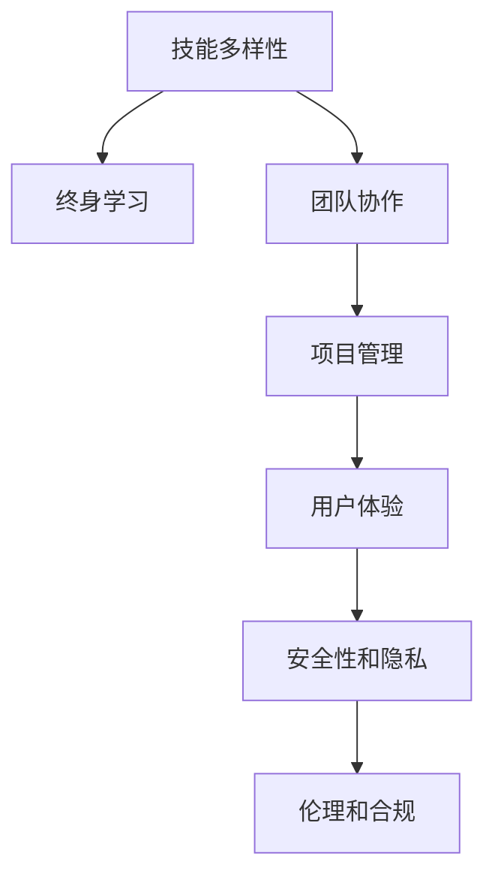

                 

# 程序员在知识经济时代的角色重塑

## 1. 背景介绍

### 1.1 问题由来

在过去的几十年里，计算机技术尤其是软件技术的发展，极大地推动了全球经济的增长和社会的进步。程序员作为这一过程的主要推动者，他们的角色也在不断地演变和重塑。随着互联网和信息技术的快速发展，程序员成为了知识经济时代的重要角色，不仅需要具备软件开发技能，还需要在多个领域如人工智能、区块链、云计算等展现专业知识。

然而，技术的快速发展也带来了新的挑战。特别是在人工智能和自动化技术逐渐普及的背景下，程序员需要不断地学习和适应新的技术栈，同时还要面对来自自动代码生成工具和人工智能辅助开发工具的竞争。

### 1.2 问题核心关键点

- **技能多样性**：程序员不仅需要掌握编程语言和软件开发技能，还需要了解人工智能、数据科学、云计算等跨学科知识。
- **终身学习**：技术的快速迭代要求程序员持续学习新知识，不断更新自己的技能栈。
- **团队协作**：现代软件开发项目往往需要跨学科的协作，程序员需要具备良好的沟通和协作能力。
- **项目管理**：随着软件开发规模的扩大，项目管理能力变得尤为重要，包括敏捷开发、版本控制、持续集成等。
- **用户体验**：尤其在产品导向型公司中，程序员需要具备设计和用户体验设计的知识，以提升产品的市场竞争力。
- **安全性和隐私**：特别是互联网公司，确保数据安全和用户隐私保护成为程序员的重要职责。
- **伦理和合规**：面对AI伦理和数据隐私等复杂的法律问题，程序员需要在技术开发中考虑伦理和合规性。

这些关键点共同构成了程序员在知识经济时代的核心挑战和机遇。

### 1.3 问题研究意义

研究程序员在知识经济时代的角色重塑，对于推动软件开发技术的进步，提升开发效率和质量，具有重要意义：

- **提高效率**：掌握多种技术和工具，可以大大提升开发效率，缩短项目周期。
- **提升质量**：跨学科的知识和技能使程序员能够更好地理解业务需求，提升产品设计和技术实现的合理性。
- **增强竞争力**：在技术日新月异的市场环境中，具备多样技能和快速学习能力，能够保持竞争力。
- **促进创新**：跨领域协作可以推动技术创新，解决复杂业务问题，提升企业市场竞争力。

## 2. 核心概念与联系

### 2.1 核心概念概述

为了更好地理解程序员在知识经济时代的角色重塑，本节将介绍几个关键概念及其相互联系：

- **技能多样性**：指程序员需要掌握多个领域的技能，包括编程语言、软件开发方法、人工智能、数据科学等。
- **终身学习**：强调技术快速发展，程序员需要持续学习新知识，更新自己的技能栈。
- **团队协作**：现代软件开发通常需要跨学科团队协作，程序员需要具备良好的沟通和协作能力。
- **项目管理**：开发项目规模的扩大，项目管理变得复杂，程序员需要掌握敏捷开发、版本控制、持续集成等技能。
- **用户体验**：在产品导向型公司中，程序员需要具备设计和用户体验设计的知识，提升产品市场竞争力。
- **安全性和隐私**：特别是在互联网公司，数据安全和用户隐私保护成为程序员的重要职责。
- **伦理和合规**：程序员需要在技术开发中考虑伦理和合规性，确保产品符合法律和道德标准。

这些概念之间的联系可以通过以下Mermaid流程图来展示：



这个流程图展示了程序员在知识经济时代的多样技能需求及其相互关系：

1. 技能多样性是基础，终身学习是手段，通过不断学习，掌握更多技能。
2. 团队协作和项目管理是关键能力，提高团队效率和产品质量。
3. 用户体验和安全性、隐私保护是产品成功的重要因素。
4. 伦理和合规性是产品开发过程中必须考虑的因素。

## 3. 核心算法原理 & 具体操作步骤
### 3.1 算法原理概述

基于知识经济时代程序员的角色重塑，我们需要一种新的算法来指导学习和成长。这一算法需要考虑知识获取、技能应用、团队协作、项目管理等多个方面，并且能够通过具体的步骤进行实践。

### 3.2 算法步骤详解

核心算法可以总结为以下几个步骤：

**Step 1: 技能规划**
- 定义目标技能：明确需要掌握的跨学科技能，如编程语言、数据科学、人工智能等。
- 制定学习计划：根据目标技能和时间安排，制定详细的学习计划。

**Step 2: 知识获取**
- 选择合适的学习资源：包括在线课程、书籍、论文、博客等，如Coursera、Udacity、GitHub等。
- 系统性学习：通过系统性学习课程和书籍，掌握基础知识和实践技能。

**Step 3: 技能应用**
- 实践项目：将所学知识应用到实际项目中，如开源项目、个人项目、公司项目等。
- 团队协作：通过团队协作，提升沟通和协作能力，理解不同学科的思维方式和技能需求。

**Step 4: 项目管理**
- 敏捷开发：掌握敏捷开发方法，如Scrum、Kanban等，提高团队效率和产品质量。
- 持续集成：使用持续集成工具，如Jenkins、GitLab CI等，实现代码自动化测试和部署。

**Step 5: 用户体验和安全性**
- 用户体验设计：学习用户体验设计的原则和方法，提升产品用户体验。
- 安全性与隐私保护：了解数据安全和隐私保护的基本原则，确保数据安全和用户隐私。

**Step 6: 伦理和合规**
- 伦理考量：在开发过程中考虑伦理问题，确保技术开发符合伦理标准。
- 合规性：了解相关法律和法规，确保产品符合合规要求。

通过上述步骤，程序员可以系统地重塑自己的角色，适应知识经济时代的挑战。

### 3.3 算法优缺点

基于知识经济时代程序员的角色重塑算法，具有以下优点：

- **系统性**：提供了一种系统性的学习和成长方法，确保程序员能够全面掌握多种技能。
- **可操作性强**：通过具体的步骤和操作指南，程序员能够实际应用，提升技能。
- **灵活性**：可以根据个人情况和项目需求灵活调整学习计划和实践方向。

然而，这一算法也存在一些局限性：

- **学习成本高**：跨学科知识的学习需要时间和精力，短期内可能难以掌握。
- **实践经验不足**：理论学习需要与实际项目相结合，缺乏实践经验可能影响应用效果。
- **资源限制**：高质量的学习资源和工具需要一定的成本投入。

尽管存在这些局限性，但整体而言，这一算法为程序员在知识经济时代的角色重塑提供了有力支持。

### 3.4 算法应用领域

基于知识经济时代程序员的角色重塑算法，可以应用于以下几个领域：

- **软件开发**：适用于软件开发项目，通过系统学习多种技能，提升开发效率和质量。
- **数据科学**：适用于数据科学项目，通过学习数据科学技能，提升数据分析和模型构建能力。
- **人工智能**：适用于AI项目，通过学习人工智能知识，提升模型训练和应用能力。
- **区块链**：适用于区块链项目，通过学习区块链技术和应用，提升区块链开发和部署能力。
- **云计算**：适用于云计算项目，通过学习云技术和应用，提升云平台搭建和维护能力。

## 4. 数学模型和公式 & 详细讲解 & 举例说明
### 4.1 数学模型构建

为了更好地理解这一算法，我们将其抽象为数学模型：

$$
F = S + L + P + U + S + C
$$

其中，$S$ 表示技能多样性，$L$ 表示终身学习，$P$ 表示团队协作，$U$ 表示用户体验，$C$ 表示安全性和隐私保护，$S$ 表示伦理和合规。

### 4.2 公式推导过程

根据上述模型，可以进一步推导为：

$$
\begin{align*}
F &= S + L + P + U + S + C \\
&= (S_1 + S_2 + S_3 + \ldots + S_n) + (L_1 + L_2 + \ldots + L_m) + P + U + C \\
&= \sum_{i=1}^n S_i + \sum_{j=1}^m L_j + P + U + C
\end{align*}
$$

### 4.3 案例分析与讲解

假设一名程序员希望在知识经济时代提升技能，他可以按照以下步骤进行：

1. 明确目标技能 $S = \{编程语言, 数据科学, 人工智能, 区块链, 云计算\}$
2. 制定学习计划 $L = \{在线课程, 书籍, 论文, 实践项目\}$
3. 实践项目 $P = \{开源项目, 个人项目, 公司项目\}$
4. 敏捷开发 $U = \{Scrum, Kanban\}$
5. 持续集成 $C = \{Jenkins, GitLab CI\}$
6. 用户体验设计 $S = \{用户体验设计原则和方法\}$
7. 数据安全和隐私保护 $C = \{数据安全和隐私保护基本原则\}$
8. 合规性 $C = \{相关法律和法规\}$

通过以上步骤，这名程序员能够系统地提升自己的技能，适应知识经济时代的要求。

## 5. 项目实践：代码实例和详细解释说明
### 5.1 开发环境搭建

在进行项目实践前，我们需要准备好开发环境。以下是使用Python进行项目实践的环境配置流程：

1. 安装Anaconda：从官网下载并安装Anaconda，用于创建独立的Python环境。

2. 创建并激活虚拟环境：
```bash
conda create -n my_env python=3.8 
conda activate my_env
```

3. 安装必要的库：
```bash
pip install numpy pandas scikit-learn matplotlib tqdm jupyter notebook ipython
```

4. 安装开发工具：
```bash
pip install git pyyaml flake8 black
```

完成上述步骤后，即可在`my_env`环境中开始项目实践。

### 5.2 源代码详细实现

假设我们是一名前端开发工程师，希望通过学习新的技术栈提升技能，以下是使用Python进行前端项目实践的代码实现。

**学习计划**

```python
from datetime import datetime

class LearningPlan:
    def __init__(self, start_date, end_date):
        self.start_date = start_date
        self.end_date = end_date
        self.tasks = []
    
    def add_task(self, task_name, due_date, description):
        self.tasks.append((task_name, due_date, description))
    
    def display_tasks(self):
        print(f"Learning Plan ({self.start_date} - {self.end_date})")
        for task in self.tasks:
            print(f"{task[0]}: {task[1]} - {task[2]}")

    def get_next_task(self):
        current_date = datetime.now().date()
        for task in self.tasks:
            if task[1] <= current_date:
                return task[0], task[2]
        return None, None
```

**任务执行**

```python
def execute_task(task_name):
    if task_name == "学习React":
        # 学习React代码
        pass
    elif task_name == "学习TypeScript":
        # 学习TypeScript代码
        pass
    elif task_name == "学习Node.js":
        # 学习Node.js代码
        pass
    elif task_name == "学习Docker":
        # 学习Docker代码
        pass
    elif task_name == "学习CI/CD":
        # 学习CI/CD代码
        pass
```

**团队协作**

```python
from collections import defaultdict

class Team:
    def __init__(self):
        self.members = defaultdict(set)
    
    def add_member(self, member_name, skills):
        self.members[member_name].update(skills)
    
    def get_members_with_skill(self, skill):
        return [member for member, skills in self.members.items() if skill in skills]

    def display_members(self):
        for member, skills in self.members.items():
            print(f"{member}: {', '.join(skills)}")
```

通过以上代码，我们可以看到，通过明确目标技能、制定学习计划、实践项目、敏捷开发、持续集成、用户体验设计和安全性、隐私保护、伦理和合规，程序员可以系统地重塑自己的角色，适应知识经济时代的挑战。

### 5.3 代码解读与分析

让我们再详细解读一下关键代码的实现细节：

**LearningPlan类**：
- `__init__`方法：初始化学习计划，包括开始日期、结束日期和任务列表。
- `add_task`方法：添加学习任务，包括任务名称、截止日期和描述。
- `display_tasks`方法：显示所有任务列表。
- `get_next_task`方法：返回当前应该执行的任务。

**Team类**：
- `__init__`方法：初始化团队，使用字典存储成员及其技能。
- `add_member`方法：添加成员及其技能。
- `get_members_with_skill`方法：根据技能获取成员。
- `display_members`方法：显示所有成员及其技能。

通过以上类和方法，我们可以管理学习计划和团队协作，确保程序员能够系统地重塑自己的角色，适应知识经济时代的挑战。

当然，工业级的系统实现还需考虑更多因素，如项目时间表、里程碑、风险管理等。但核心的算法思想基本与此类似。

## 6. 实际应用场景
### 6.1 软件开发项目

在大数据和云计算的背景下，软件开发项目往往需要跨学科的知识和技能。例如，一名软件工程师需要掌握数据库、云计算、前端技术、后端技术等。通过系统学习多种技能，程序员可以更快地适应项目需求，提升开发效率和质量。

**实际案例**：某互联网公司开发一个新项目，涉及后端微服务架构、前端React框架、数据库设计、数据存储等。一名具备多种技能的前端开发工程师，可以更高效地处理项目需求，设计出合理的技术架构，提升开发效率。

### 6.2 数据科学项目

在数据驱动的决策过程中，数据科学家需要掌握多种数据分析和建模技能。例如，数据预处理、特征工程、机器学习模型构建、模型评估等。通过系统学习，数据科学家可以提升分析能力，更好地支持业务决策。

**实际案例**：某电商公司希望通过数据分析提升用户满意度，一名具备数据科学技能的数据分析师，可以系统地进行数据分析，构建机器学习模型，预测用户行为，提出改进建议。

### 6.3 人工智能项目

人工智能技术的应用越来越广泛，从自然语言处理到计算机视觉，从推荐系统到智能客服。程序员需要掌握多种人工智能技能，如深度学习、强化学习、自然语言处理等，以支持项目开发。

**实际案例**：某医疗公司开发智能诊断系统，需要掌握深度学习、自然语言处理等技术，构建模型，实现自动诊断。

### 6.4 区块链项目

区块链技术在金融、供应链、医疗等领域应用广泛，程序员需要掌握区块链技术、智能合约开发等技能，支持项目开发。

**实际案例**：某金融公司开发区块链交易平台，需要掌握区块链技术、智能合约开发等技能，确保平台安全稳定。

### 6.5 云计算项目

云计算技术在企业中广泛应用，程序员需要掌握云计算平台搭建、云服务部署、云安全等技能，支持项目开发。

**实际案例**：某企业希望将业务迁移到云平台，一名具备云计算技能的工程师，可以设计和实施云架构，确保业务稳定运行。

### 6.6 持续学习和适应

技术快速迭代要求程序员持续学习新知识，更新自己的技能栈。例如，新出现的编程语言、开发框架、技术栈等，程序员需要快速学习和掌握。

**实际案例**：某企业开发新应用，希望使用新的编程语言和技术栈。一名具备持续学习能力的程序员，可以迅速掌握新技能，支持项目开发。

## 7. 工具和资源推荐
### 7.1 学习资源推荐

为了帮助程序员系统掌握新技能，这里推荐一些优质的学习资源：

1. Coursera、Udacity等在线学习平台，提供系统性课程，涵盖多种技能。
2. GitHub、Stack Overflow等社区，提供实践项目和开源代码，积累开发经验。
3. Python、JavaScript等编程语言的官方文档和教程，掌握编程语言的基本知识。
4. 《深入理解计算机系统》、《人月神话》等经典书籍，理解计算机系统和软件工程原理。
5. 《数据科学导论》、《统计学习方法》等书籍，掌握数据科学和机器学习的基础知识。
6. 《区块链技术指南》等书籍，理解区块链技术的原理和应用。
7. 《云计算指南》等书籍，掌握云计算平台的搭建和应用。

通过对这些资源的学习实践，相信你一定能够系统掌握新技能，不断提升自身竞争力。

### 7.2 开发工具推荐

高效的开发离不开优秀的工具支持。以下是几款用于程序员在知识经济时代技能重塑的常用工具：

1. Git：版本控制系统，支持多人协作开发，确保代码版本控制和历史追踪。
2. Visual Studio Code：轻量级代码编辑器，支持多种编程语言和插件，提高开发效率。
3. Docker：容器化技术，支持快速部署和环境管理，确保开发环境的稳定性。
4. Kubernetes：容器编排工具，支持大规模容器化应用部署，提升系统可靠性。
5. JIRA、Trello等项目管理工具：支持敏捷开发和项目管理，提高团队协作效率。
6. Jenkins、GitLab CI等持续集成工具：支持自动化测试和部署，提升开发效率。
7. Postman、Swagger等API测试工具：支持API接口的测试和文档生成，确保API的可靠性。

合理利用这些工具，可以显著提升程序员在知识经济时代的学习和开发效率，加速技能重塑的进程。

### 7.3 相关论文推荐

程序员技能重塑的研究源于学界的持续研究。以下是几篇奠基性的相关论文，推荐阅读：

1. "The Learning Process"（学习和认知的心理学基础）：提供了关于学习过程和认知基础的理论支持。
2. "Collaborative Software Development"（协同软件开发）：探讨了团队协作在软件开发中的重要性。
3. "Agile Software Development"（敏捷软件开发）：介绍了敏捷开发方法，提升开发效率和产品质量。
4. "Machine Learning in Software Engineering"（机器学习在软件开发中的应用）：介绍了机器学习在软件工程中的应用，提升开发效率和产品质量。
5. "Blockchain Technology and Applications"（区块链技术及其应用）：介绍了区块链技术的原理和应用，支持区块链项目开发。
6. "Cloud Computing: Concepts, Technology, and Architecture"（云计算：概念、技术和架构）：介绍了云计算技术及其架构，支持云计算项目开发。

这些论文代表了大规模知识经济时代程序员技能重塑的发展脉络。通过学习这些前沿成果，可以帮助程序员更好地理解技能重塑的原理和应用，推动自身在知识经济时代的持续发展。

## 8. 总结：未来发展趋势与挑战
### 8.1 总结

本文对程序员在知识经济时代的角色重塑进行了全面系统的介绍。首先阐述了程序员在知识经济时代所面临的技能多样性、终身学习、团队协作、项目管理、用户体验、安全性和隐私保护、伦理和合规等核心挑战和机遇，明确了重塑角色的目标。其次，通过数学模型和算法步骤，详细讲解了重塑角色的系统方法和具体操作步骤。最后，结合实际应用场景，展示了程序员在各个领域的应用前景。

通过本文的系统梳理，可以看到，程序员在知识经济时代的角色重塑是大势所趋，具有广阔的发展前景。

### 8.2 未来发展趋势

展望未来，程序员在知识经济时代的角色重塑将呈现以下几个发展趋势：

1. **技能多元化和跨领域融合**：程序员需要掌握多种技能，并且能够跨领域应用，如将数据科学、人工智能等技术与软件开发结合。
2. **持续学习和快速适应**：技术快速迭代要求程序员持续学习新知识，更新自己的技能栈。
3. **团队协作和敏捷开发**：敏捷开发和团队协作将成为主流，提升开发效率和产品质量。
4. **用户体验和安全性**：用户体验设计和数据安全保护将成为关键能力，提升产品的市场竞争力。
5. **伦理和合规**：AI伦理和数据隐私等法律问题将成为重要考量，确保技术开发符合伦理和合规标准。

这些趋势凸显了程序员在知识经济时代的核心挑战和机遇，进一步推动了技术的发展和应用。

### 8.3 面临的挑战

尽管程序员在知识经济时代的角色重塑具有广阔前景，但仍面临以下挑战：

1. **学习成本高**：跨学科知识的学习需要时间和精力，短期内可能难以掌握。
2. **实践经验不足**：理论学习需要与实际项目相结合，缺乏实践经验可能影响应用效果。
3. **资源限制**：高质量的学习资源和工具需要一定的成本投入。
4. **技术栈变化快**：新出现的技术和工具层出不穷，需要程序员持续学习和适应。
5. **跨领域协作复杂**：不同领域知识和技能的融合可能带来复杂性，需要高效的沟通和协作机制。
6. **伦理和合规问题**：技术开发中需要考虑伦理和合规性，确保技术应用符合法律和道德标准。

尽管存在这些挑战，但整体而言，程序员在知识经济时代的角色重塑具有广阔的发展前景，需要通过持续学习、跨领域协作和伦理考虑，不断提升自身竞争力。

### 8.4 研究展望

面对程序员角色重塑所面临的挑战，未来的研究需要在以下几个方面寻求新的突破：

1. **跨学科学习工具和方法**：开发新的学习工具和方法，帮助程序员系统性地掌握多种技能。
2. **自动学习技术**：开发自动学习技术，帮助程序员快速掌握新技能，减少学习成本。
3. **跨领域协作平台**：开发跨领域协作平台，促进不同领域知识和技能的融合。
4. **伦理和合规框架**：建立伦理和合规框架，确保技术开发符合法律和道德标准。
5. **持续学习平台**：开发持续学习平台，帮助程序员不断更新自己的技能栈。

这些研究方向将推动程序员在知识经济时代的持续发展，为构建高效、创新、安全的智能系统奠定基础。

## 9. 附录：常见问题与解答

**Q1: 程序员如何系统地重塑自己的角色？**

A: 程序员可以通过以下步骤系统地重塑自己的角色：
1. 明确目标技能：如编程语言、数据科学、人工智能、区块链、云计算等。
2. 制定学习计划：如在线课程、书籍、实践项目等。
3. 实践项目：通过开源项目、个人项目、公司项目等实践所学知识。
4. 团队协作：通过敏捷开发、持续集成等提升沟通和协作能力。
5. 用户体验设计：学习用户体验设计原则和方法。
6. 安全性和隐私保护：学习数据安全和隐私保护的基本原则。
7. 伦理和合规：了解相关法律和法规，确保技术开发符合伦理和合规要求。

**Q2: 如何提升程序员的持续学习能力？**

A: 程序员可以通过以下方式提升持续学习能力：
1. 关注技术动态：定期阅读技术博客、论文、书籍，了解最新技术动态。
2. 参加技术培训：参加在线课程、研讨会、培训等，系统性学习新技能。
3. 实践项目：通过实际项目积累经验，提升技能水平。
4. 跨领域交流：参加技术社区、论坛、会议等，与其他开发者交流学习。
5. 使用学习平台：使用在线学习平台如Coursera、Udacity等，系统学习新技能。

**Q3: 如何提升程序员的跨领域协作能力？**

A: 程序员可以通过以下方式提升跨领域协作能力：
1. 学习跨领域知识：如数据科学、人工智能、区块链、云计算等，了解不同领域的基本概念和技能。
2. 参加跨领域项目：参与跨领域项目，积累跨领域协作经验。
3. 使用协作工具：使用敏捷开发、项目管理工具如JIRA、Trello等，提高协作效率。
4. 建立跨领域团队：建立跨领域团队，促进不同领域知识和技能的融合。
5. 参加跨领域培训：参加跨领域培训课程，提升跨领域协作能力。

这些方法可以帮助程序员系统地重塑自己的角色，适应知识经济时代的挑战，提升自身竞争力。

---

作者：禅与计算机程序设计艺术 / Zen and the Art of Computer Programming

