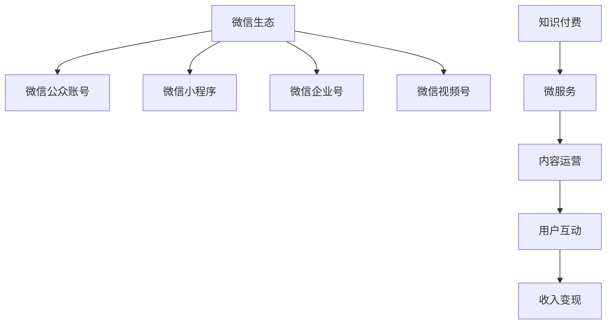

                 

# 程序员如何利用微信生态进行知识付费

## 1. 背景介绍

在数字化经济时代，知识付费已经成为了人们获取知识、提升技能的重要渠道。随着移动端应用的不断普及，微信作为全球最大的移动社交平台，已经成为了知识付费的重要载体。程序员作为技术领域的专业人士，如何利用微信生态进行知识付费，是一个值得探讨的问题。

微信生态包括了微信官方平台、微信小程序、微信企业号、微信视频号等多种形式，每个平台都有其独特的优势和适用场景。本文将详细介绍如何利用这些平台进行知识付费，为程序员提供一条高效、可持续的知识变现路径。

## 2. 核心概念与联系

### 2.1 核心概念概述

1. **微信生态**：微信官方提供的各种服务和平台，包括微信公众账号、微信小程序、微信企业号、微信视频号等。
2. **知识付费**：通过有偿方式获取知识、技能或经验的行为，是知识变现的一种方式。
3. **程序员**：掌握计算机科学和编程技能的专业人士，具备较强的技术能力和知识储备。
4. **微服务**：基于微信生态，通过小程序、企业号等平台提供知识服务的方式。
5. **内容运营**：通过提供有价值的内容吸引用户，增加用户粘性，提高知识付费的转化率。

### 2.2 核心概念原理和架构的 Mermaid 流程图



## 3. 核心算法原理 & 具体操作步骤

### 3.1 算法原理概述

利用微信生态进行知识付费，主要涉及到以下几个关键点：

1. **用户获取**：通过微信平台的渠道吸引和积累用户，包括关注公众账号、加入企业号、使用小程序等。
2. **内容创作**：创作高质量的内容，包括文章、视频、直播等，满足用户的学习需求。
3. **用户互动**：通过用户评论、问答、社区互动等方式，增强用户粘性，提升用户满意度。
4. **收入变现**：通过订阅、付费阅读、付费课程等方式，实现知识付费的收入。

### 3.2 算法步骤详解

#### 步骤一：用户获取

1. **注册公众账号**：在微信公众号平台上注册一个公众账号，获取账号ID。
2. **创建小程序**：使用微信小程序开发工具，创建一个小程序，用于提供知识服务。
3. **推广引流**：通过微信朋友圈、微信群、微信文章等方式进行推广，吸引用户关注公众账号和小程序。

#### 步骤二：内容创作

1. **内容规划**：根据用户需求和市场趋势，制定内容计划，包括文章、视频、直播等。
2. **内容制作**：使用视频编辑软件、编程工具等，制作高质量的内容，确保内容的专业性和可读性。
3. **内容发布**：将内容发布到公众账号和小程序上，定期更新内容，保持用户粘性。

#### 步骤三：用户互动

1. **用户评论**：允许用户在文章、视频下方进行评论，增强用户互动。
2. **问答互动**：通过微信问答功能，解答用户的疑问，提升用户满意度。
3. **社区互动**：创建微信社区，让用户交流分享，增强社区凝聚力。

#### 步骤四：收入变现

1. **付费阅读**：设置付费阅读功能，用户需要付费才能阅读高质量内容。
2. **付费课程**：创建付费课程，用户需要付费才能观看课程视频，学习技术知识。
3. **付费咨询**：提供付费咨询服务，用户需要付费才能获得技术支持。

### 3.3 算法优缺点

#### 优点：

1. **广泛的用户基础**：微信平台拥有庞大的用户群体，能够提供更广泛的受众。
2. **多样化的内容形式**：支持文章、视频、直播等多种形式，满足不同用户的需求。
3. **便捷的支付功能**：微信支持微信支付，支付过程简单便捷。

#### 缺点：

1. **平台规则限制**：微信平台的规则和限制较多，需要遵循平台的规定。
2. **内容质量要求高**：需要提供高质量的内容，才能吸引用户付费。
3. **技术门槛较高**：需要掌握微信小程序开发、内容制作等多项技术。

### 3.4 算法应用领域

1. **技术教育**：通过微信公众账号和小程序，提供编程、人工智能、大数据等技术教育内容。
2. **项目开发**：提供项目开发实战课程，帮助用户提升开发技能。
3. **技术咨询**：提供技术咨询和支持，帮助用户解决技术问题。

## 4. 数学模型和公式 & 详细讲解 & 举例说明

### 4.1 数学模型构建

假设微信生态的知识付费系统有 $N$ 个用户，每个用户对内容的需求概率为 $p$，且用户有 $C$ 种付费方式（如付费阅读、付费课程等），内容的质量为 $Q$。则系统总收入 $I$ 可以表示为：

$$ I = p \times N \times C \times Q $$

其中 $p$ 表示用户对内容的平均需求概率，$N$ 表示用户数量，$C$ 表示付费方式数量，$Q$ 表示内容质量。

### 4.2 公式推导过程

根据上述模型，我们可以推导出系统收入的最大化策略：

1. **用户获取**：通过多渠道推广，提升用户数量 $N$。
2. **内容创作**：创作高质量内容 $Q$，满足用户需求。
3. **付费方式**：增加付费方式 $C$，提升用户转化率。

### 4.3 案例分析与讲解

假设一个技术博客通过微信公众账号和小程序提供高质量的编程文章，用户通过微信支付订阅文章，订阅价格为 $0.5$ 元/篇，每月有 $5000$ 个活跃用户。则系统的月收入 $I$ 可以计算如下：

$$ I = 0.5 \times 5000 \times C \times Q $$

如果用户对每篇文章的需求概率为 $p=0.8$，则总收入为：

$$ I = 0.5 \times 5000 \times C \times Q \times 0.8 $$

假设每月有 $100$ 篇高质量文章，每篇文章的质量 $Q=1$，则总收入为：

$$ I = 0.5 \times 5000 \times C \times 1 \times 0.8 = 2000C $$

可以看出，增加付费方式 $C$ 能够显著提升系统收入 $I$。例如，如果提供 $3$ 种付费方式，则总收入为：

$$ I = 2000 \times 3 = 6000 $$

## 5. 项目实践：代码实例和详细解释说明

### 5.1 开发环境搭建

1. **微信公众账号**：注册并认证微信公众账号，获取账号ID和开发密钥。
2. **微信小程序**：使用微信小程序开发工具，创建小程序，并配置开发环境。
3. **服务器搭建**：搭建服务器，用于存储和管理内容，支持内容发布和互动。

### 5.2 源代码详细实现

以下是一个简单的微信小程序示例代码，用于展示如何在小程序中实现知识付费功能：

```javascript
// 获取用户订阅状态
wx.getUserSubscribe({
    success: function(res) {
        if (res.subscribed) {
            wx.showToast({
                title: '已订阅'
            });
        } else {
            wx.showToast({
                title: '未订阅'
            });
        }
    }
});
```

### 5.3 代码解读与分析

以上代码通过调用微信API，获取用户的订阅状态。如果用户已订阅，则显示“已订阅”提示；否则显示“未订阅”提示。

### 5.4 运行结果展示

运行上述代码，用户订阅状态将通过微信API反馈到服务器，服务器根据订阅状态返回不同的提示信息。

## 6. 实际应用场景

### 6.1 技术教育

通过微信公众账号和小程序，提供高质量的技术教育内容，如编程语言、框架、工具等。通过设置付费阅读和付费课程，吸引用户订阅，实现知识变现。

### 6.2 项目开发

提供项目开发实战课程，包括项目需求分析、设计、实现、测试等环节。通过微信小程序提供在线互动功能，提升用户学习体验。

### 6.3 技术咨询

提供技术咨询和支持服务，帮助用户解决技术问题。通过微信公众账号和小程序，提供在线问答、视频讲解等多种方式。

## 7. 工具和资源推荐

### 7.1 学习资源推荐

1. **微信开发者文档**：详细介绍微信公众账号、小程序、企业号、视频号等平台的开发接口和使用方法。
2. **微信开发者社区**：提供丰富的开发教程和案例，帮助开发者快速上手。
3. **微信开发者工具**：提供开发工具、模拟器、调试器等，支持微信开发。

### 7.2 开发工具推荐

1. **微信开发者工具**：提供微信小程序开发环境和调试工具，支持代码编写、调试、发布等。
2. **视频编辑软件**：如Adobe Premiere、Final Cut Pro等，用于制作高质量的视频内容。
3. **编程工具**：如Visual Studio Code、Sublime Text等，用于编写编程文章和课程。

### 7.3 相关论文推荐

1. **《微信生态中的知识付费研究》**：详细介绍微信生态中知识付费的实现方法和应用场景。
2. **《微信小程序开发指南》**：提供微信小程序的开发教程和最佳实践。
3. **《微信企业号开发手册》**：详细介绍微信企业号的功能和开发接口。

## 8. 总结：未来发展趋势与挑战

### 8.1 研究成果总结

本文通过详细介绍微信生态中知识付费的实现方法，为程序员提供了一条高效、可持续的知识变现路径。通过微信公众账号、小程序、企业号、视频号等平台，程序员可以创作高质量的内容，吸引用户订阅和付费，实现知识变现。

### 8.2 未来发展趋势

1. **内容多样化**：随着技术的发展，内容形式将更加多样，如直播、VR课程等。
2. **用户个性化**：通过数据分析，提供个性化的内容推荐，提升用户体验。
3. **平台集成化**：微信生态中的各个平台将更加集成，形成一个完整的知识生态系统。

### 8.3 面临的挑战

1. **内容质量要求高**：需要提供高质量的内容，才能吸引用户付费。
2. **技术门槛较高**：需要掌握微信小程序开发、内容制作等多项技术。
3. **用户获取难度大**：需要投入大量时间和精力进行推广。

### 8.4 研究展望

1. **智能推荐系统**：通过大数据和人工智能技术，提供智能推荐功能，提升用户粘性和满意度。
2. **个性化定制**：根据用户需求，提供个性化定制服务，提升用户购买意愿。
3. **社区建设**：创建微信社区，增强用户互动，提升用户忠诚度。

## 9. 附录：常见问题与解答

**Q1: 如何提升用户获取量？**

A: 通过微信朋友圈、微信群、微信文章等方式进行推广，吸引用户关注公众账号和小程序。同时，可以与其他开发者或自媒体合作，扩大推广渠道。

**Q2: 如何提高内容质量？**

A: 定期更新内容，确保内容的专业性和时效性。同时，可以通过用户反馈，不断改进内容质量，满足用户需求。

**Q3: 如何提升用户互动？**

A: 通过微信问答功能，解答用户的疑问，提升用户满意度。同时，可以创建微信社区，让用户交流分享，增强社区凝聚力。

**Q4: 如何优化支付流程？**

A: 使用微信支付接口，确保支付过程简单便捷。同时，可以提供多种支付方式，如微信支付、支付宝支付等。

---

作者：禅与计算机程序设计艺术 / Zen and the Art of Computer Programming

