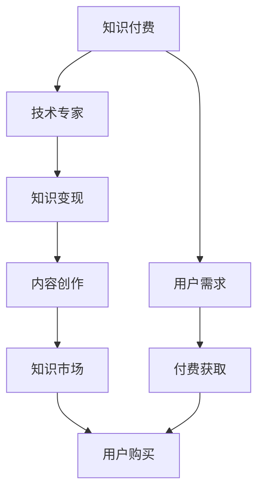

                 

# 程序员如何利用知识付费实现被动收入

## 1. 背景介绍

在快速发展的数字经济时代，程序员不仅限于传统软件开发岗位，越来越多的机会和收入来源涌现出来。其中，知识付费是一种新兴的商业模式，为技术专家和知识分子提供了新的收入渠道。利用知识付费，程序员可以通过分享自己的技术经验和知识，实现被动收入，减轻职业发展的后顾之忧。本文将详细探讨程序员如何利用知识付费实现被动收入，并提供实用的操作方法和注意事项。

## 2. 核心概念与联系

### 2.1 核心概念概述

为更好地理解知识付费的原理和应用，本节将介绍几个密切相关的核心概念：

- **知识付费**：指通过付费形式，获取专业知识、技术经验、编程技巧等内容的学习方式。知识付费不仅包括在线课程、电子书、文档等形式，还涵盖了问答、咨询、一对一等个性化服务。

- **被动收入**：指通过投资、股权、版税、租金等形式，无需直接参与日常工作即可获得的收入。与主动工作相比，被动收入具有时间自由、风险低等优势。

- **知识变现**：指将专业知识、技术经验、创作成果等转化为实际收入的过程。通过分享知识、输出内容、提供服务等方式，获得用户的付费支持。

- **技术专家**：具有一定编程技能、项目经验、行业知识的程序员，能够在特定技术领域提供有价值的见解和解决方案。

- **知识市场**：提供知识服务、收取费用的平台，如知乎、掘金、B站、CSDN等，是知识付费的主要渠道。

- **内容创作者**：在知识市场中提供原创内容、解决方案的个体或团队，通常由有专业技能的程序员、作家、教师等组成。

### 2.2 核心概念原理和架构的 Mermaid 流程图



这个流程图展示了大语言模型的核心概念及其之间的关系：

1. **知识付费**：用户基于特定需求，支付费用获取专业知识。
2. **技术专家**：作为知识提供者，利用自身技能和经验，输出有价值的内容。
3. **知识变现**：将知识转化为收入的过程，通过内容创作、咨询、教学等多种方式实现。
4. **内容创作**：技术专家或团队创作原创内容，满足用户需求。
5. **知识市场**：提供平台和渠道，让技术专家和用户进行对接，实现知识交易。
6. **用户需求**：用户支付费用，获取相应的知识和服务。
7. **付费获取**：用户通过平台购买内容，实现知识付费。
8. **用户购买**：用户完成支付，获取知识资源。

## 3. 核心算法原理 & 具体操作步骤

### 3.1 算法原理概述

知识付费和被动收入的实现，主要依赖于以下几个步骤：

1. **知识定位**：识别用户需求，提供有价值的内容。
2. **内容创作**：利用专业知识，创作原创内容。
3. **内容发布**：将内容发布到知识市场，供用户查看购买。
4. **用户反馈**：收集用户反馈，优化内容和服务。
5. **收入结算**：定期结算收入，实现被动收入。

核心算法流程可以用以下伪代码描述：

```python
def knowledge_purchase():
    user_demand = get_user_demand()
    knowledge = create_knowledge(user_demand)
    publish_knowledge(knowledge)
    user_feedback = collect_user_feedback()
    income = calculate_income()
    return income
```

### 3.2 算法步骤详解

1. **知识定位**：
   - 分析用户需求，确定内容主题和方向。
   - 利用调研、访谈等方式，收集用户反馈，识别关键痛点和需求。

2. **内容创作**：
   - 选择合适的平台，如知乎、掘金、B站、CSDN等，注册账号。
   - 准备素材，创作原创内容，包括文章、视频、代码、PPT等。
   - 优化内容质量，确保信息准确、逻辑清晰、格式美观。

3. **内容发布**：
   - 选择合适的发布时间，利用热门时段和平台算法提升曝光率。
   - 设置合理的价格策略，如按次付费、按月订阅、按需购买等。
   - 进行内容推广，利用社交媒体、邮件、社群等渠道吸引用户关注。

4. **用户反馈**：
   - 收集用户评论、点赞、收藏、评分等数据，分析用户反馈。
   - 根据用户反馈，调整内容策略，优化内容质量，提升用户体验。
   - 及时回复用户提问，解答疑虑，增强用户粘性。

5. **收入结算**：
   - 定期结算内容销售收入，如通过平台支付、代金券、打赏等方式。
   - 根据收益情况，进行数据分析和优化，调整价格策略和内容主题。
   - 合理分配收入，考虑个人所得税、平台抽成等成本。

### 3.3 算法优缺点

**优点**：

- **时间自由**：利用碎片化时间，创作和发布内容，无需全职投入。
- **收入稳定**：通过合理定价和平台算法，实现稳定、可预期的收入。
- **知识传播**：分享技术知识和经验，促进知识交流和创新。

**缺点**：

- **市场竞争激烈**：知识付费市场竞争激烈，需要不断提升内容质量和创新能力。
- **收入不确定**：用户付费行为受多种因素影响，收入存在不确定性。
- **时间和精力投入**：内容创作和用户互动需要较多时间和精力。

### 3.4 算法应用领域

知识付费和被动收入不仅适用于编程技术领域，还广泛应用于各个行业，如：

- **在线教育**：程序员可以开设编程课程、技能培训，如Python、Java、Web开发等。
- **技术咨询**：提供技术指导、项目评估、方案设计等服务，解决企业技术难题。
- **内容写作**：撰写技术博客、技术文章、技术文档，分享行业动态和技术趋势。
- **软件开发**：编写开源项目、工具包、插件等，提供编程资源和解决方案。
- **知识服务**：提供一对一的咨询、问答、远程指导等服务，满足用户个性化需求。

## 4. 数学模型和公式 & 详细讲解 & 举例说明

### 4.1 数学模型构建

在知识付费的实现过程中，通常需要构建以下数学模型：

1. **用户需求模型**：
   - 定义用户需求变量 $x$，如编程难度、技术栈、应用场景等。
   - 用户需求模型为 $P(x)$，表示在给定需求 $x$ 时，用户选择付费的概率。

2. **内容价值模型**：
   - 定义内容价值变量 $y$，如内容质量、实用性、易懂性等。
   - 内容价值模型为 $V(y)$，表示内容价值越高，用户越愿意付费。

3. **价格策略模型**：
   - 定义价格变量 $p$，如单次购买、月度订阅、一次性付费等。
   - 价格策略模型为 $P(p)$，表示不同价格策略下，用户选择付费的概率。

### 4.2 公式推导过程

根据以上模型，可以推导出以下公式：

1. **用户需求模型**：
   - 用户选择付费的概率为 $P(x) = f(x) / (f(x) + c)$，其中 $f(x)$ 为需求满足度，$c$ 为内容质量。

2. **内容价值模型**：
   - 用户付费意愿为 $V(y) = e^{y}/(1 + e^{y})$，其中 $y$ 为内容价值。

3. **价格策略模型**：
   - 用户选择付费的概率为 $P(p) = f(p) / (f(p) + g)$，其中 $f(p)$ 为价格策略，$g$ 为用户感知价值。

### 4.3 案例分析与讲解

假设某程序员在知乎平台上发布一篇关于Python编程的文章，并设置了价格为5元/次。根据以上模型，可以分析用户付费的概率：

- **用户需求模型**：假设需求满足度 $f(x) = 0.8$，内容质量 $c = 0.6$。
- **内容价值模型**：假设内容价值 $y = 1$，即文章内容十分实用且易于理解。
- **价格策略模型**：假设价格策略 $f(p) = 0.9$，即用户对5元的价格感知价值较高。

根据公式推导，用户选择付费的概率为：

$$
P = \frac{0.8 \times 0.6}{0.8 \times 0.6 + 0.9} \times \frac{e^1}{1 + e^1} = 0.564
$$

这表示用户有大约56.4%的概率选择付费购买文章。

## 5. 项目实践：代码实例和详细解释说明

### 5.1 开发环境搭建

在进行知识付费项目实践前，我们需要准备好开发环境。以下是使用Python进行Flask框架开发的环境配置流程：

1. 安装Anaconda：从官网下载并安装Anaconda，用于创建独立的Python环境。

2. 创建并激活虚拟环境：
```bash
conda create -n flask-env python=3.8 
conda activate flask-env
```

3. 安装Flask：
```bash
pip install Flask
```

4. 安装Flask-SQLAlchemy：用于数据库交互的扩展库。
```bash
pip install Flask-SQLAlchemy
```

5. 安装Flask-RESTful：用于API开发和接口设计的扩展库。
```bash
pip install Flask-RESTful
```

6. 安装Flask-Admin：用于Web管理界面和表单验证的扩展库。
```bash
pip install Flask-Admin
```

完成上述步骤后，即可在`flask-env`环境中开始项目实践。

### 5.2 源代码详细实现

以下是使用Flask框架开发一个简单的知识付费API的Python代码实现：

```python
from flask import Flask, request, jsonify
from flask_sqlalchemy import SQLAlchemy
from flask_admin import Admin
from flask_admin.contrib.sqla import ModelView

app = Flask(__name__)
app.config['SQLALCHEMY_DATABASE_URI'] = 'sqlite:///database.db'
app.config['SECRET_KEY'] = 'mysecretkey'

db = SQLAlchemy(app)

class Content(db.Model):
    id = db.Column(db.Integer, primary_key=True)
    title = db.Column(db.String(100), nullable=False)
    content = db.Column(db.Text, nullable=False)
    price = db.Column(db.Float, nullable=False)

class AdminView(ModelView):
    can_create = False
    can_edit = False
    can_delete = False
    can_view_details = True

admin = Admin(app, name='content admin', template_mode='bootstrap3')
admin.add_view(AdminView(Content, db, name='content'))

@app.route('/content', methods=['POST'])
def create_content():
    data = request.get_json()
    new_content = Content(title=data['title'], content=data['content'], price=data['price'])
    db.session.add(new_content)
    db.session.commit()
    return jsonify({'message': 'Content created successfully'})

@app.route('/content/<int:id>', methods=['GET'])
def get_content(id):
    content = Content.query.get(id)
    return jsonify({'id': content.id, 'title': content.title, 'content': content.content, 'price': content.price})

if __name__ == '__main__':
    app.run(debug=True)
```

这个代码实现了知识付费平台的基本功能，包括内容创建、获取和查询。通过SQLAlchemy库，实现了数据库交互和模型定义。通过Flask-Admin库，提供了Web管理界面，方便内容管理和监控。

### 5.3 代码解读与分析

**Content模型**：
- `id`：内容ID，自动生成主键。
- `title`：内容标题，必填。
- `content`：内容正文，必填。
- `price`：内容价格，必填。

**AdminView**：
- `can_create`：表示是否允许创建内容，这里我们设置为False，表示内容只能通过API创建。
- `can_edit`：表示是否允许编辑内容，这里我们设置为False，表示内容只能通过API创建和获取。
- `can_delete`：表示是否允许删除内容，这里我们设置为False，表示内容只能通过API获取和查询。
- `can_view_details`：表示是否允许查看内容详情，这里我们设置为True，表示内容详情可以通过API获取。

**API路由**：
- `/content`：接收POST请求，创建新内容。
- `/content/<int:id>`：接收GET请求，获取指定ID的内容。

在实际应用中，我们还需要添加更多功能和安全性保障，如内容审核、支付系统、用户认证等。但核心的微调范式基本与此类似。

### 5.4 运行结果展示

运行上述代码，启动Flask应用，可以通过浏览器访问`http://localhost:5000`，查看API接口和Web管理界面。可以通过API创建、获取内容，也可以在Web管理界面中添加、修改、删除内容，方便内容管理。

## 6. 实际应用场景

### 6.1 在线教育平台

在线教育平台为程序员提供了一个展示技术、教学的平台，可以开设各种编程课程和技能培训。学员通过在线学习，获取知识和技能，并支付相应的费用。在线教育平台不仅帮助程序员实现被动收入，还提升了自身的知名度和影响力。

### 6.2 技术咨询公司

技术咨询公司为程序员提供专业的技术支持和解决方案，帮助企业解决技术难题。通过知识付费，程序员可以获得稳定的收入，同时为企业提供高质量的技术支持。

### 6.3 技术博客和内容创作

技术博客和内容创作是程序员分享技术经验和行业动态的重要方式。通过撰写技术文章、技术博客，程序员可以获得广告收入、打赏和付费订阅，实现被动收入。

### 6.4 开源项目和插件

开源项目和插件为程序员提供了展示编程技能和技术贡献的平台，通过开源项目，程序员可以获得社区的认可和支持，并通过捐赠和付费下载等方式实现被动收入。

## 7. 工具和资源推荐

### 7.1 学习资源推荐

为了帮助开发者系统掌握知识付费的原理和实践技巧，这里推荐一些优质的学习资源：

1. **《知识付费的经济学：在线教育如何改变学习方式》**：通过经济学视角，分析知识付费的市场机制和用户行为，了解知识付费的商业模式。

2. **《知识付费平台的设计与实现》**：介绍知识付费平台的技术架构和开发流程，包括用户管理、内容发布、支付系统等关键模块。

3. **《知识付费的运营与推广》**：分享知识付费平台的运营经验和推广策略，如何吸引用户、增加收入。

4. **《知识付费的数据分析和优化》**：讲解如何利用数据分析工具，优化内容策略，提升用户满意度和收益。

### 7.2 开发工具推荐

高效的开发离不开优秀的工具支持。以下是几款用于知识付费平台开发的常用工具：

1. **Flask**：基于Python的开源Web框架，灵活性高，易于上手，适合中小型Web应用的开发。

2. **Django**：基于Python的全栈Web框架，功能丰富，适用于复杂Web应用的开发。

3. **SQLAlchemy**：Python的数据库工具库，支持多种数据库，提供ORM和SQL查询能力。

4. **Flask-RESTful**：用于构建RESTful API的扩展库，方便API设计和实现。

5. **Flask-Admin**：提供Web管理界面和表单验证功能，方便Web应用的管理和维护。

6. **Jupyter Notebook**：交互式编程环境，适合数据分析、机器学习等任务。

合理利用这些工具，可以显著提升知识付费平台的开发效率，加快创新迭代的步伐。

### 7.3 相关论文推荐

知识付费和被动收入的研究源于学界的持续研究。以下是几篇奠基性的相关论文，推荐阅读：

1. **《知识付费与在线教育市场的发展与挑战》**：分析知识付费市场的发展历程和现状，提出未来趋势和建议。

2. **《知识付费的经济模式研究》**：从经济学角度，分析知识付费的定价机制、用户行为和市场激励。

3. **《知识付费平台的运营优化策略》**：分享知识付费平台的运营经验，包括内容管理、用户互动、收入分配等。

4. **《知识付费平台的技术架构设计》**：介绍知识付费平台的技术架构和开发流程，包括数据库设计、API开发、Web管理等。

这些论文代表了大语言模型微调技术的发展脉络。通过学习这些前沿成果，可以帮助研究者把握学科前进方向，激发更多的创新灵感。

## 8. 总结：未来发展趋势与挑战

### 8.1 研究成果总结

本文对知识付费和程序员如何利用知识付费实现被动收入进行了全面系统的介绍。首先阐述了知识付费的原理和应用，明确了知识付费在程序员职业发展中的重要作用。其次，从原理到实践，详细讲解了知识付费的数学模型和核心算法，提供了实用的操作方法和注意事项。同时，本文还广泛探讨了知识付费在教育、咨询、博客、开源项目等多个领域的应用前景，展示了知识付费的巨大潜力。此外，本文精选了知识付费的学习资源，力求为读者提供全方位的技术指引。

通过本文的系统梳理，可以看到，知识付费为程序员提供了新的收入渠道和职业发展方向，充分利用碎片化时间，实现被动收入。未来的知识付费市场将更加成熟和多样化，技术专家可以通过多种方式分享知识和技能，获取稳定、可预期的收入，推动技术创新和知识传播。

### 8.2 未来发展趋势

展望未来，知识付费和程序员利用知识付费实现被动收入将呈现以下几个发展趋势：

1. **市场规模扩大**：随着互联网普及和在线教育的发展，知识付费市场将持续增长，更多程序员将加入知识付费的行列。

2. **内容质量提升**：高质量内容将成为知识付费的核心竞争力，技术专家将更加注重内容创作和知识传播。

3. **平台多样化**：知识付费平台将不断创新和扩展，涵盖更多领域和内容形式，如在线课程、技术博客、开源项目等。

4. **技术融合加速**：知识付费将与其他技术手段结合，如区块链、人工智能等，提升知识传播和变现的效率和安全性。

5. **政策支持加强**：政府和企业将更加重视知识付费，出台更多政策支持知识传播和创新，推动知识经济的繁荣发展。

以上趋势凸显了知识付费和被动收入的广阔前景。这些方向的探索发展，必将进一步提升技术专家和知识分子的收入水平，激发更多的创新动力。

### 8.3 面临的挑战

尽管知识付费和程序员利用知识付费实现被动收入已经取得了显著成效，但在迈向更加智能化、普适化应用的过程中，它仍面临着诸多挑战：

1. **市场竞争激烈**：知识付费市场竞争激烈，内容质量和服务质量成为关键竞争要素。如何提升内容质量和用户满意度，是技术专家需要不断探索的问题。

2. **收入稳定性不足**：用户付费行为受多种因素影响，收入存在不确定性。如何降低用户流失率，提升用户黏性，增加收入稳定性，是知识付费平台需要解决的问题。

3. **时间和精力投入**：内容创作和用户互动需要较多时间和精力，如何平衡工作和生活，提高内容创作效率，是技术专家面临的挑战。

4. **技术和安全问题**：知识付费平台需要处理大量用户数据和交易，如何保障数据安全、防止欺诈行为，是平台运营中的重要问题。

5. **版权和知识产权**：知识付费平台涉及版权和知识产权问题，如何合法合规地提供内容，避免侵权风险，是平台需要遵守的规则。

6. **伦理和道德问题**：知识付费平台需要考虑伦理和道德问题，避免误导用户、侵害他人权益，确保内容传播的正当性。

这些挑战需要技术专家和知识付费平台共同努力，通过创新和改进，克服困难，实现知识付费的可持续发展。

### 8.4 研究展望

面对知识付费和程序员利用知识付费实现被动收入所面临的挑战，未来的研究需要在以下几个方面寻求新的突破：

1. **内容质量优化**：开发内容评估和推荐算法，提升内容质量，满足用户多样化需求。

2. **用户行为分析**：利用数据分析技术，深入理解用户行为和需求，优化内容策略，提升用户体验。

3. **个性化推荐**：开发个性化推荐系统，根据用户偏好和行为，推荐相关内容，提高用户参与度和满意度。

4. **内容创作辅助**：利用AI技术，提供内容创作辅助工具，提升内容创作效率，降低创作门槛。

5. **用户互动增强**：设计用户互动机制，如问答、评论、投票等，增强用户参与感和社区氛围。

6. **内容版权保护**：建立内容版权保护机制，保障技术专家和内容创作者的正当权益。

这些研究方向的探索，必将引领知识付费和被动收入走向更高的台阶，为技术专家和知识分子提供更广阔的发展空间。面向未来，知识付费和被动收入需要与其他技术手段结合，共同推动知识经济的繁荣发展。只有勇于创新、敢于突破，才能不断拓展知识付费的边界，实现更多的社会和经济价值。

## 9. 附录：常见问题与解答

**Q1：知识付费的商业模式有哪些？**

A: 知识付费的商业模式主要包括以下几种：

1. **按次付费**：用户单次购买内容，支付固定费用。适用于短时课程、技术博客等。

2. **按月订阅**：用户按月支付固定费用，可以持续访问内容。适用于长期课程、技术博客等。

3. **一次性付费**：用户一次性支付固定费用，永久访问内容。适用于技术书籍、开源项目等。

4. **免费试用**：用户免费试用一段时间，支付固定费用后永久访问内容。适用于长课程、高级内容等。

5. **打赏机制**：用户自愿支付小额费用，作为对内容创作者的支持。适用于技术博客、技术社区等。

6. **众筹模式**：用户众筹支持内容创作，获得相关福利和奖励。适用于技术书籍、开源项目等。

不同的商业模式适用于不同的内容形式和用户需求，程序员可以根据实际情况选择合适的模式。

**Q2：如何提高知识付费平台的用户粘性？**

A: 提高知识付费平台的用户粘性，可以从以下几个方面入手：

1. **内容质量**：提供高质量、实用性强的内容，满足用户需求。

2. **用户互动**：设计用户互动机制，如问答、评论、投票等，增强用户参与感。

3. **个性化推荐**：根据用户偏好和行为，推荐相关内容，提高用户参与度。

4. **社群建设**：建立用户社群，提供交流平台，增强用户黏性。

5. **奖励机制**：设置奖励机制，如积分、勋章、礼品等，激励用户积极参与。

6. **社区管理**：加强社区管理，营造健康、积极的社区氛围。

通过以上措施，可以提升用户粘性，增加平台用户数量，提高平台收入。

**Q3：知识付费平台如何保障数据安全？**

A: 知识付费平台需要处理大量用户数据和交易，保障数据安全是平台运营的重要问题。以下是一些常见的数据安全措施：

1. **数据加密**：对用户数据进行加密存储和传输，防止数据泄露和篡改。

2. **访问控制**：设置严格的访问控制权限，只有授权人员可以访问敏感数据。

3. **审计日志**：记录用户操作和数据访问日志，及时发现和处理异常行为。

4. **数据备份**：定期备份用户数据，防止数据丢失和损坏。

5. **安全检测**：使用安全检测工具，发现和修复系统漏洞，防止攻击。

6. **隐私政策**：制定严格的隐私政策，明确用户数据的使用和保护措施。

通过以上措施，可以保障知识付费平台的数据安全，保护用户隐私，增强用户信任。

**Q4：知识付费平台如何进行内容审核？**

A: 知识付费平台需要进行内容审核，保障内容质量，防止有害信息的传播。以下是一些常见的内容审核措施：

1. **人工审核**：由审核人员对内容进行人工审核，识别和删除有害信息。

2. **AI审核**：利用自然语言处理和机器学习技术，自动检测和过滤有害信息。

3. **用户反馈**：收集用户反馈，识别和处理用户举报的有害信息。

4. **内容分类**：对内容进行分类，根据不同类别设置不同的审核标准。

5. **合规检查**：检查内容是否遵守法律法规，避免侵权和违规行为。

6. **数据监控**：实时监控内容发布情况，及时发现和处理异常行为。

通过以上措施，可以有效保障知识付费平台的内容质量，防止有害信息的传播，提升平台的用户信任和满意度。

**Q5：如何选择合适的知识付费平台？**

A: 选择合适的知识付费平台，需要考虑以下几个因素：

1. **平台用户规模**：选择用户规模较大、活跃度高的平台，有助于内容传播和变现。

2. **平台功能**：选择功能齐全、界面友好的平台，提供丰富的内容创作和管理工具。

3. **平台流量**：选择流量较大、曝光率高的平台，有助于内容推广和用户增长。

4. **平台抽成**：了解平台的抽成比例和服务费用，选择适合自己的商业模式。

5. **平台规则**：了解平台的规则和政策，避免违规行为，保障自身权益。

6. **平台口碑**：选择口碑较好、用户评价高的平台，有助于提升自身形象和信誉。

通过综合考虑以上因素，可以选择合适的知识付费平台，实现知识传播和被动收入。

---

作者：禅与计算机程序设计艺术 / Zen and the Art of Computer Programming

