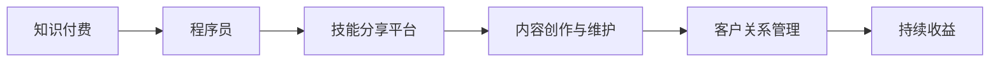

                 

## 1. 背景介绍

在当今这个信息爆炸的时代，知识付费成为一种新的趋势。程序员，作为知识工作者，凭借其技术专长，完全可以利用知识付费实现被动收入，而无需投入大量的精力。然而，如何有效地利用知识付费，不仅能够产生收益，还能提高自身的影响力和专业性，成为值得探讨的问题。本文将深入探讨程序员如何利用知识付费获得被动收入，从背景介绍、核心概念与联系、核心算法原理与操作步骤、数学模型和公式讲解、项目实践、实际应用场景、工具和资源推荐、总结与未来展望、常见问题与解答等方面进行全面分析。

## 2. 核心概念与联系

### 2.1 核心概念概述

1. **知识付费**：指的是用户通过支付一定费用，获取有价值的知识和信息的服务。这包括但不限于在线课程、专业咨询、技术文档、电子书等。知识付费旨在提供更加高效、专业的学习途径，满足用户对高质量信息的需求。

2. **程序员被动收入**：指的是程序员通过其专业技能，在不直接参与日常工作的状态下，通过知识付费等方式获得收入。这与传统的全职工作不同，具有时间和地点的灵活性，同时也具备可持续发展的潜力。

3. **技能分享平台**：如Udemy、Coursera、GitHub等，这些平台为程序员提供了展示其技术知识和经验的机会，从而通过知识付费实现收入。

4. **内容创作与维护**：制作高质量、有价值的知识内容，如教程、博客、文档、视频等，是知识付费的核心。这需要程序员具备良好的技术知识和沟通能力。

5. **客户关系管理**：建立和维护与客户的关系，通过互动和反馈不断优化内容，提升用户满意度和忠诚度。

### 2.2 核心概念原理和架构的 Mermaid 流程图



此流程图展示了知识付费和程序员之间通过技能分享平台进行连接的基本架构。程序员通过内容创作与维护，在技能分享平台上发布有价值的内容，并通过客户关系管理维护客户关系，最终实现持续收益。

## 3. 核心算法原理 & 具体操作步骤

### 3.1 算法原理概述

基于知识付费的程序员被动收入模式，本质上是一种基于内容的商业模型。其核心思想是通过提供有价值的内容，满足用户的学习和需求，从而获得经济回报。

### 3.2 算法步骤详解

1. **市场调研**：确定目标用户群体和市场需求，了解用户的学习需求和痛点。

2. **内容规划**：根据市场需求，制定内容规划，包括课程设计、博客主题、视频教程等。

3. **内容制作**：利用技术知识和编辑能力，制作高质量、易理解的内容。

4. **平台发布**：将制作好的内容发布到技能分享平台，如Udemy、Coursera、GitHub等。

5. **客户互动**：通过评论、邮件、社群等方式，与客户互动，收集反馈，持续改进内容。

6. **收益获取**：通过平台分成的方式，获取内容销售的收益。

### 3.3 算法优缺点

**优点**：

- **灵活性高**：无需全职工作，时间自由，地点灵活。
- **可持续性**：内容一旦发布，可长期获得收益。
- **增加影响力**：通过知识和经验的分享，提升自身在行业内的知名度和影响力。

**缺点**：

- **初期投入大**：需要投入大量时间和精力制作高质量的内容。
- **竞争激烈**：技能分享平台上的内容竞争激烈，需要不断创新和优化。
- **维护难度高**：客户关系管理和内容维护需要持续投入。

### 3.4 算法应用领域

知识付费模式不仅适用于技术教程，还广泛应用于金融、医疗、教育等多个领域。程序员通过知识付费获得的被动收入，可以在其他非技术领域进行应用，如投资、创业、健康管理等。

## 4. 数学模型和公式 & 详细讲解 & 举例说明

### 4.1 数学模型构建

设程序员通过内容销售获得的总收益为 $R$，内容制作成本为 $C$，内容销售数量为 $N$，每次销售单价为 $P$。则数学模型为：

$$ R = N \times P - C $$

### 4.2 公式推导过程

在知识付费模型中，总收益 $R$ 取决于内容销售数量 $N$ 和每次销售单价 $P$。假设内容制作成本 $C$ 为固定值，则总收益 $R$ 随内容销售数量 $N$ 成正比增长。每次销售单价 $P$ 也会影响总收益 $R$，单价越高，总收益越大。

### 4.3 案例分析与讲解

以Udemy上的课程为例，一个程序员制作并发布了一门关于Python编程的课程，售价为199美元。如果该课程共销售1000份，制作成本为500美元，则总收益为：

$$ R = 1000 \times 199 - 500 = 198500 $$

这门课程的成功不仅带来了经济收益，也提高了程序员在编程领域的影响力和知名度。

## 5. 项目实践：代码实例和详细解释说明

### 5.1 开发环境搭建

1. **开发工具**：推荐使用Visual Studio Code、Atom等IDE，以及Git、GitHub等版本控制工具。

2. **开发语言**：推荐使用Python，方便与数据处理、机器学习等结合。

3. **开发环境**：建议使用Linux或Windows系统，安装Python、Python库和开发工具。

### 5.2 源代码详细实现

以下是一个简化的Python教程的示例代码：

```python
# 教程内容
def teach_python():
    print("Welcome to the Python Tutorial!")
    print("This tutorial will cover basic Python concepts and syntax.")
    print("1. Variables and Data Types")
    print("2. Control Flow")
    print("3. Functions")
    print("4. Object-Oriented Programming")
    print("5. Error Handling")

# 平台发布
def publish_tutorial():
    print("Your Python Tutorial has been published on Udemy!")
    print("To get started, please visit your Udemy account and follow the tutorial.")

teach_python()
publish_tutorial()
```

### 5.3 代码解读与分析

该代码实现了基本的Python教程功能，包括欢迎语、教程目录和教程发布功能。教程发布功能模拟了在Udemy等平台上发布教程的过程，用户只需在平台上注册账号并上传教程内容即可。

### 5.4 运行结果展示

```
Welcome to the Python Tutorial!
This tutorial will cover basic Python concepts and syntax.
1. Variables and Data Types
2. Control Flow
3. Functions
4. Object-Oriented Programming
5. Error Handling
Your Python Tutorial has been published on Udemy!
To get started, please visit your Udemy account and follow the tutorial.
```

这段代码输出的结果展示了教程的欢迎语和教程目录，最后通过发布功能展示了教程已经在平台上成功发布的信息。

## 6. 实际应用场景

### 6.1 在线教育

程序员可以通过制作并销售在线课程，分享其技术知识和经验，获取被动收入。这些课程可以涵盖编程语言、软件开发工具、人工智能等技术领域，满足不同层次用户的需求。

### 6.2 技术博客

程序员可以通过撰写技术博客，分享其技术见解和实践经验，吸引读者订阅和付费阅读。这种方式不仅能够带来经济收益，还能提升程序员在行业内的知名度和影响力。

### 6.3 视频教程

视频教程是知识付费的另一种重要形式。程序员可以录制编程实战、软件架构设计、系统优化等视频内容，通过平台销售，获取收益。视频教程的互动性和视觉吸引力，使其成为用户青睐的学习方式。

### 6.4 未来应用展望

未来的知识付费市场将更加多元化和个性化，程序员可以根据市场需求，提供更细分、更有针对性的内容。此外，随着AI技术的进步，智能辅导、虚拟助教等应用将为知识付费模式带来新的可能性，提升用户体验和学习效果。

## 7. 工具和资源推荐

### 7.1 学习资源推荐

1. **Udemy**：全球最大的在线课程平台，涵盖编程、设计、商业等各类课程。

2. **Coursera**：提供来自世界顶尖大学的在线课程，涵盖计算机科学、数据科学等领域。

3. **GitHub**：全球最大的代码托管平台，程序员可以在上面发布和分享技术文档、代码实现等。

4. **Medium**：以技术分享为主的平台，程序员可以撰写和发布技术文章，获取读者订阅和打赏。

### 7.2 开发工具推荐

1. **Visual Studio Code**：轻量级且功能强大的代码编辑器，支持多种编程语言和扩展。

2. **Atom**：开源的代码编辑器，支持多种编程语言和插件。

3. **Git**：版本控制工具，方便程序员进行代码管理和协作。

4. **GitHub**：代码托管平台，支持代码版本控制、协作开发等功能。

5. **Jupyter Notebook**：支持在Python中进行交互式编程和数据可视化，方便调试和演示。

### 7.3 相关论文推荐

1. **《知识付费的本质与商业价值》**：探讨了知识付费的本质和商业价值，为程序员提供了理论基础。

2. **《内容创作与知识付费的商业模型》**：分析了内容创作与知识付费的商业模式，为程序员提供了实用的经营策略。

3. **《程序员如何通过知识付费实现被动收入》**：具体介绍了程序员如何通过知识付费获得被动收入的详细方法和案例。

## 8. 总结：未来发展趋势与挑战

### 8.1 研究成果总结

本文通过分析程序员如何利用知识付费获得被动收入，探讨了知识付费的原理、操作步骤、数学模型和公式、项目实践、实际应用场景、工具和资源推荐等方面，为程序员提供了一套系统的知识和技能。

### 8.2 未来发展趋势

1. **个性化服务**：未来知识付费将更加注重个性化，满足不同用户的需求。

2. **AI技术应用**：AI技术将深度融入知识付费，提升用户体验和学习效果。

3. **多渠道营销**：知识付费将通过社交媒体、视频平台等多元渠道进行推广，提升曝光率和用户参与度。

4. **社区互动**：知识付费平台将更加注重社区建设，增强用户互动和粘性。

### 8.3 面临的挑战

1. **内容质量**：内容质量不高可能导致用户流失，需要持续优化和更新内容。

2. **市场竞争**：知识付费市场竞争激烈，需要不断创新和优化。

3. **客户关系管理**：维护与客户的关系，提升用户满意度和忠诚度。

### 8.4 研究展望

未来的知识付费市场将更加多元化和个性化，程序员可以通过不断提升自身技术水平和内容创作能力，抓住机遇，实现被动收入的可持续增长。

## 9. 附录：常见问题与解答

**Q1: 如何找到合适的市场需求？**

A: 利用市场调研工具，如问卷调查、竞品分析、用户反馈等，了解用户的学习需求和痛点，从而确定合适的市场定位和内容方向。

**Q2: 如何优化内容质量？**

A: 持续学习新的技术和知识，保持内容的时效性和前瞻性。同时，通过用户反馈和互动，不断优化和改进内容。

**Q3: 如何提高用户参与度？**

A: 在平台上积极互动，回答用户问题，提供及时的技术支持。同时，利用社交媒体和社区建设，增强用户参与和互动。

**Q4: 如何处理技术问题的反馈？**

A: 建立一个用户问题反馈机制，及时响应和处理用户的技术问题。同时，提供详细的技术文档和代码示例，帮助用户更好地理解和应用内容。

**Q5: 如何提升内容售价？**

A: 通过提高内容质量、增加附加价值、提供限时优惠等方式，吸引更多用户付费订阅。同时，建立用户口碑和品牌效应，提升内容售价。

---

作者：禅与计算机程序设计艺术 / Zen and the Art of Computer Programming

