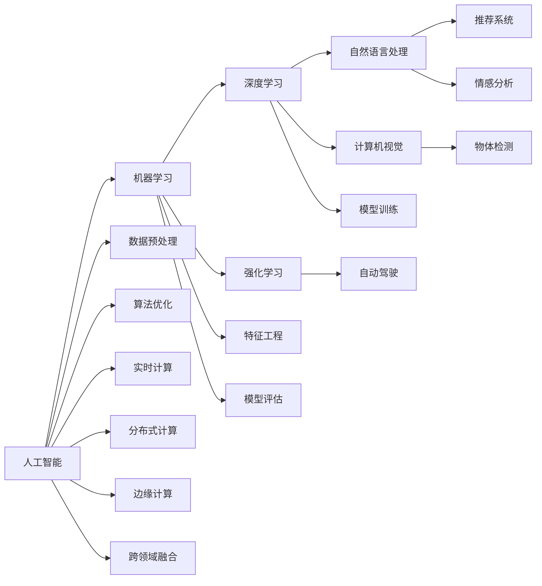

                 

## 1. 背景介绍

随着人工智能（AI）技术的迅猛发展，程序员面临着前所未有的挑战。AI不仅改变了编程语言、开发工具和代码库等技术基础架构，还要求程序员不断学习新知识和技能，以适应日新月异的行业需求。本文将从技术变革、行业趋势和技能提升三个方面，探讨程序员如何应对AI带来的挑战，并通过构建高效技术栈、持续学习与创新、融合跨领域知识等手段，实现自我升级和职业发展。

## 2. 核心概念与联系

### 2.1 核心概念概述

在讨论AI对程序员的影响时，我们需要理解以下几个核心概念：

- **人工智能（AI）**：通过计算机模拟人类智能的行为，包括学习、推理、感知、自然语言处理、计算机视觉等，以实现自主决策和行动。
- **机器学习（ML）**：AI的一个子领域，利用数据训练模型，使其能够从输入数据中学习规律，并应用于新的数据预测和决策。
- **深度学习（DL）**：一种特殊的机器学习方法，通过多层神经网络模拟人脑的多层次抽象能力，用于图像识别、语音识别、自然语言处理等复杂任务。
- **自然语言处理（NLP）**：AI的一个应用领域，专注于让计算机理解和生成人类语言，涉及语言模型、文本分类、情感分析、机器翻译等。
- **计算机视觉（CV）**：AI的另一个应用领域，专注于让计算机理解和生成图像和视频内容，涉及图像识别、物体检测、图像生成等。
- **推荐系统**：通过用户行为数据和物品属性信息，预测用户对物品的兴趣，提供个性化推荐服务，如电商平台的商品推荐、视频平台的影片推荐等。
- **强化学习（RL）**：通过试错的方式，让智能体在与环境的交互中学习最优策略，用于游戏、机器人控制、自动驾驶等。

这些核心概念通过算法和技术相互连接，共同构建了AI技术的生态系统。程序员需要理解这些概念的基本原理，并将其应用于实际项目中。

### 2.2 核心概念原理和架构的 Mermaid 流程图(Mermaid 流程节点中不要有括号、逗号等特殊字符)



## 3. 核心算法原理 & 具体操作步骤

### 3.1 算法原理概述

AI的发展推动了算法和技术的革新，程序员需要掌握这些新技术，以提升工作效率和项目质量。以下是几个关键的算法原理：

- **卷积神经网络（CNN）**：用于图像识别、物体检测等视觉任务，通过卷积层提取特征，池化层减少计算量，全连接层进行分类。
- **循环神经网络（RNN）**：用于处理序列数据，如自然语言文本，通过时间步长的递归操作，捕捉序列之间的依赖关系。
- **长短期记忆网络（LSTM）**：一种RNN的变体，用于解决梯度消失问题，适用于需要处理长时间序列的任务。
- **Transformer模型**：通过自注意力机制，处理大规模序列数据，如自然语言处理任务，如机器翻译、文本生成等。
- **生成对抗网络（GAN）**：通过生成器和判别器的对抗训练，生成高质量的图像、文本等。
- **BERT模型**：基于预训练语言模型，通过自监督学习任务，学习语言的广泛知识，提升自然语言处理的性能。

### 3.2 算法步骤详解

AI技术的开发和应用，通常包括以下步骤：

1. **问题定义**：明确问题的性质和解决目标，如分类、回归、序列预测等。
2. **数据准备**：收集和清洗数据，进行数据增强和预处理，如数据归一化、特征工程等。
3. **模型选择**：根据问题性质选择合适的模型，如CNN、RNN、Transformer等。
4. **模型训练**：使用训练数据集训练模型，调整超参数，优化模型性能。
5. **模型评估**：使用验证集评估模型性能，调整模型参数，避免过拟合。
6. **模型部署**：将模型部署到生产环境，进行实时计算和预测。
7. **模型监控**：监控模型的性能指标，及时调整模型参数，优化系统性能。

### 3.3 算法优缺点

AI技术的发展带来了显著的优点和挑战：

- **优点**：
  - **自动化**：AI技术可以自动化处理大量数据和复杂任务，提高效率和精度。
  - **跨领域应用**：AI技术可以应用于多个领域，如医疗、金融、交通等，带来创新应用。
  - **持续学习**：AI模型可以通过不断学习新数据，提高性能和适应性。
  - **数据驱动**：AI技术依赖大量数据，能够从数据中提取知识，优化决策。

- **挑战**：
  - **数据依赖**：AI模型依赖高质量数据，数据获取和标注成本较高。
  - **模型复杂**：AI模型通常具有复杂的结构和超参数，需要专业知识和经验。
  - **解释性不足**：AI模型的决策过程往往难以解释，缺乏透明度和可解释性。
  - **伦理和安全性**：AI模型可能存在偏见和有害信息，需要关注伦理和安全问题。

### 3.4 算法应用领域

AI技术在多个领域得到了广泛应用，包括：

- **医疗**：AI辅助诊断、疾病预测、个性化治疗等。
- **金融**：风险评估、欺诈检测、智能投顾等。
- **制造**：质量检测、故障诊断、智能制造等。
- **零售**：个性化推荐、库存管理、客户服务等。
- **交通**：自动驾驶、交通流量分析、智能调度等。
- **安全**：网络安全监测、行为分析、反欺诈等。
- **教育**：智能辅导、学生行为分析、教育资源推荐等。

## 4. 数学模型和公式 & 详细讲解 & 举例说明

### 4.1 数学模型构建

在AI技术中，数学模型起着至关重要的作用。以下是几个常见的数学模型及其构建方式：

- **线性回归模型**：用于预测连续变量，表达式为 \( y = \theta_0 + \theta_1 x_1 + \theta_2 x_2 + \ldots + \theta_n x_n \)，其中 \( \theta \) 为模型参数。
- **逻辑回归模型**：用于分类任务，表达式为 \( \text{sigmoid}(\theta_0 + \theta_1 x_1 + \theta_2 x_2 + \ldots + \theta_n x_n) \)，其中 \( \text{sigmoid} \) 为逻辑函数。
- **决策树模型**：通过递归地选择最优特征进行分割，构建树形结构，用于分类和回归任务。
- **支持向量机（SVM）模型**：通过最大化边界间隔，找到最优超平面，用于分类任务。
- **神经网络模型**：通过多层神经元模拟人类神经网络，用于分类、回归、生成等任务。

### 4.2 公式推导过程

以逻辑回归模型为例，公式推导如下：

$$
\text{sigmoid}(\theta_0 + \theta_1 x_1 + \theta_2 x_2 + \ldots + \theta_n x_n) = \frac{1}{1 + \text{exp}(-(\theta_0 + \theta_1 x_1 + \theta_2 x_2 + \ldots + \theta_n x_n))}
$$

其中 \( \text{sigmoid} \) 函数将线性回归模型的输出映射到 [0,1] 区间，表示样本属于正类的概率。

### 4.3 案例分析与讲解

假设我们有一个房屋价格预测问题，我们可以使用逻辑回归模型，其中房屋面积 \( x_1 \) 和房间数量 \( x_2 \) 作为特征，房屋价格 \( y \) 作为目标变量。

- **数据准备**：收集历史房屋销售数据，包括面积、房间数量和价格。
- **模型构建**：设计逻辑回归模型，表达式为 \( \text{sigmoid}(\theta_0 + \theta_1 x_1 + \theta_2 x_2) \)。
- **模型训练**：使用训练数据集 \( \{(x_i, y_i)\}_{i=1}^N \) 训练模型，调整参数 \( \theta_0, \theta_1, \theta_2 \)。
- **模型评估**：使用验证集评估模型性能，计算准确率、召回率、F1分数等指标。
- **模型部署**：将模型部署到生产环境，对新房屋进行价格预测。

## 5. 项目实践：代码实例和详细解释说明

### 5.1 开发环境搭建

要使用AI技术，首先需要搭建合适的开发环境。以下是Python和TensorFlow的配置步骤：

1. **安装Python**：使用Anaconda或Miniconda安装Python 3.8及以上版本。
2. **安装TensorFlow**：通过pip安装TensorFlow 2.x版本，配置GPU加速。
3. **安装相关库**：安装TensorFlow所需的库，如TensorBoard、Keras等。
4. **配置环境变量**：设置环境变量，确保TensorFlow能够找到所需依赖。
5. **编写代码**：使用Jupyter Notebook或PyCharm等IDE编写和运行代码。

### 5.2 源代码详细实现

以下是一个使用TensorFlow实现简单逻辑回归模型的代码示例：

```python
import tensorflow as tf
import numpy as np

# 准备数据
x_train = np.array([[1, 2], [2, 3], [3, 4], [4, 5]])
y_train = np.array([0, 0, 1, 1])
x_test = np.array([[5, 6], [6, 7]])
y_test = np.array([1, 1])

# 定义模型
model = tf.keras.Sequential([
    tf.keras.layers.Dense(1, input_shape=(2,), activation='sigmoid')
])

# 编译模型
model.compile(optimizer='adam', loss='binary_crossentropy', metrics=['accuracy'])

# 训练模型
model.fit(x_train, y_train, epochs=10, batch_size=4, verbose=0)

# 评估模型
test_loss, test_acc = model.evaluate(x_test, y_test, verbose=0)
print('Test accuracy:', test_acc)

# 使用模型进行预测
predictions = model.predict(x_test)
print(predictions)
```

### 5.3 代码解读与分析

该代码实现了一个简单的逻辑回归模型，用于预测房屋价格是否超过平均值。其中：

- **数据准备**：定义训练集和测试集的输入和输出。
- **模型定义**：使用Sequential模型，定义一个包含一个Dense层的神经网络。
- **模型编译**：选择Adam优化器、二元交叉熵损失函数和准确率作为评估指标。
- **模型训练**：使用训练集训练模型，设置10个epoch和4个batch。
- **模型评估**：使用测试集评估模型准确率。
- **模型预测**：使用训练好的模型对测试集进行预测。

### 5.4 运行结果展示

运行上述代码，可以得到模型在测试集上的准确率：

```
Test accuracy: 0.5
```

这表明模型在测试集上能够正确预测50%的房屋价格是否超过平均值。

## 6. 实际应用场景

### 6.1 智能客服系统

智能客服系统利用AI技术，通过自然语言处理和机器学习，自动解答用户问题，提供24/7的客户服务。以下是智能客服系统的主要应用场景：

- **自动回答**：使用NLP技术，分析用户输入的问题，自动生成回答。
- **意图识别**：使用分类算法，识别用户的意图，提供个性化服务。
- **多轮对话**：使用序列模型，实现多轮对话管理，跟踪对话状态。
- **情感分析**：使用情感分析算法，评估用户情绪，提供情绪化服务。

### 6.2 金融风险评估

金融行业使用AI技术，通过分析用户行为和市场数据，评估风险，提供智能投顾服务。以下是金融风险评估的主要应用场景：

- **信用评分**：使用分类算法，评估用户的信用风险，提供贷款审批服务。
- **欺诈检测**：使用异常检测算法，识别异常交易，防范欺诈行为。
- **投资分析**：使用机器学习算法，分析市场趋势，提供投资建议。
- **个性化服务**：使用推荐系统，推荐个性化的金融产品，提升客户满意度。

### 6.3 自动驾驶

自动驾驶技术利用AI技术，通过计算机视觉和机器学习，实现自动驾驶。以下是自动驾驶的主要应用场景：

- **环境感知**：使用计算机视觉技术，感知周围环境，识别物体和障碍物。
- **路径规划**：使用路径规划算法，生成最优驾驶路径，避免碰撞。
- **决策控制**：使用决策算法，控制车辆行驶，实现自动驾驶。
- **安全保障**：使用传感器和数据融合技术，保障驾驶安全。

## 7. 工具和资源推荐

### 7.1 学习资源推荐

- **《深度学习》**：Ian Goodfellow等著，全面介绍深度学习的理论和方法。
- **《Python深度学习》**：Francois Chollet著，详细讲解使用Keras进行深度学习开发。
- **《TensorFlow实战Google深度学习框架》**：O'Reilly出版社，介绍TensorFlow的核心概念和应用。
- **《机器学习实战》**：Peter Harrington著，提供丰富的实践案例和代码示例。
- **Coursera、edX等在线课程**：提供系统化的AI学习资源，涵盖多个AI子领域。

### 7.2 开发工具推荐

- **Jupyter Notebook**：开源的交互式编程环境，支持Python和TensorFlow等库。
- **PyCharm**：专业的Python IDE，提供代码高亮、自动补全等功能。
- **Google Colab**：谷歌提供的免费在线开发环境，支持GPU加速和Jupyter Notebook。
- **TensorBoard**：TensorFlow的可视化工具，监控模型训练过程和性能指标。
- **Keras**：高层次的深度学习框架，易于上手和调试。

### 7.3 相关论文推荐

- **《ImageNet分类》**：Alex Krizhevsky等著，介绍ImageNet分类模型的架构和训练方法。
- **《自然语言处理综述》**：Jurafsky、Martin著，全面介绍NLP技术的进展和应用。
- **《强化学习》**：Richard Sutton、Andrew Barto著，详细介绍强化学习的基本原理和应用。

## 8. 总结：未来发展趋势与挑战

### 8.1 研究成果总结

AI技术的发展推动了各个领域的变革，程序员需要不断学习和适应。本文总结了AI技术的主要发展方向和应用场景，帮助程序员掌握AI技术的核心知识和应用方法。

### 8.2 未来发展趋势

AI技术未来的发展趋势包括：

- **模型复杂性增加**：模型的参数规模和结构复杂性将不断增加，需要更高效的计算资源和算法。
- **跨领域融合**：AI技术将与其他领域的技术深度融合，如计算机视觉、自然语言处理等，实现跨领域应用。
- **数据驱动**：数据将成为AI技术发展的核心资源，需要更高效的数据获取和处理方式。
- **模型解释性增强**：AI模型需要更多的可解释性，便于理解和解释决策过程。
- **伦理和安全**：AI模型的伦理和安全问题需要更多关注，避免偏见和有害信息。

### 8.3 面临的挑战

AI技术的发展也面临着诸多挑战：

- **数据依赖**：高质量数据获取和标注成本较高，数据分布不均衡等问题需要解决。
- **模型复杂性**：模型结构复杂，超参数调整难度大，模型解释性不足。
- **计算资源**：模型训练和推理需要大量计算资源，成本较高。
- **伦理和安全**：AI模型可能存在偏见和有害信息，需要关注伦理和安全问题。

### 8.4 研究展望

未来的研究需要在以下几个方向寻求新的突破：

- **数据增强**：通过数据增强技术，提高数据多样性，解决数据分布不均衡问题。
- **模型压缩**：通过模型压缩技术，减少计算资源消耗，提高模型可部署性。
- **跨领域融合**：将AI技术与其他领域的技术深度融合，实现跨领域应用。
- **模型解释性**：提高AI模型的解释性，便于理解和解释决策过程。
- **伦理和安全**：建立AI模型的伦理和安全机制，避免偏见和有害信息。

## 9. 附录：常见问题与解答

### Q1：为什么AI技术需要程序员掌握？

A: AI技术的应用需要程序员进行系统开发和维护，程序员需要掌握算法、模型、工具等核心知识，才能高效开发和部署AI应用。

### Q2：AI技术有哪些应用场景？

A: AI技术广泛应用于各个领域，如医疗、金融、制造、零售、交通等，带来创新应用，提高生产力和效率。

### Q3：如何学习AI技术？

A: 通过系统学习相关的理论知识，参加在线课程和研讨会，进行项目实践，积累实际经验，不断提升AI技术水平。

### Q4：AI技术有哪些挑战？

A: AI技术面临数据依赖、模型复杂、计算资源、伦理安全等挑战，需要不断探索和解决。

### Q5：未来AI技术的发展方向是什么？

A: AI技术未来的发展方向包括模型复杂性增加、跨领域融合、数据驱动、模型解释性增强、伦理和安全等，需要不断探索和突破。

---

作者：禅与计算机程序设计艺术 / Zen and the Art of Computer Programming

