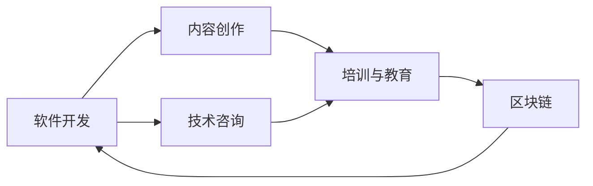

                 

## 1. 背景介绍

在技术日新月异的今天，仅仅依靠单一的编程工作收入已经不再能满足大部分程序员的财务需求。为应对这种变化，越来越多的程序员开始探索多元化收入结构，利用自身在编程和软件开发方面的优势，创造更多的收入来源。本文将探讨如何通过技术手段建立多元化收入结构，涵盖内容创作、软件销售、技术咨询与培训、区块链等新兴领域。

## 2. 核心概念与联系

### 2.1 核心概念概述

- **多元收入结构（Diversified Income Structure）**：即通过多个渠道创造收入，而不是依赖单一工资。这包括但不限于软件开发、内容创作、教学、咨询、区块链等。

- **内容创作（Content Creation）**：通过写博客、制作视频、开发应用程序等方式分享知识和技术，创造内容收入。

- **软件开发（Software Development）**：开发和销售应用程序、工具、插件等，通过技术实现商业价值。

- **技术咨询（Technical Consultation）**：提供企业技术解决方案，如架构设计、性能优化、系统维护等。

- **培训与教育（Training and Education）**：开设在线课程、开办培训营、编写技术书籍等，传授编程技能。

- **区块链（Blockchain）**：参与智能合约开发、数字货币交易、去中心化应用（DApp）开发等，探索区块链的商业机会。

这些概念之间并非独立存在，而是相辅相成。例如，编程技能的学习和应用往往相互促进；内容创作可以提升个人品牌，从而带来更多的咨询和培训机会；区块链技术为软件开发提供了一种新的实现方式。

### 2.2 核心概念原理和架构的 Mermaid 流程图

此流程图展示了核心概念之间的相互联系：

- **软件开发**提供了基础技术能力，支撑内容创作和咨询服务。
- **内容创作**提升个人品牌，吸引更多技术咨询和培训需求。
- **技术咨询**在解决实际问题中不断深化技能，反馈到软件开发中。
- **培训与教育**将知识传递给他人，进一步巩固自身技能。
- **区块链**提供新领域的应用机会，验证和拓展现有技能。

## 3. 核心算法原理 & 具体操作步骤

### 3.1 算法原理概述

建立一个多元化收入结构，其核心在于不断学习、适应新环境，并通过技术手段创造附加值。这一过程可以简化为以下算法：

1. **输入**：已有技能、兴趣、市场需求、市场趋势。
2. **处理**：选择合适的细分市场，进行技能提升和市场调研。
3. **输出**：多元化收入结构。

这一过程包含以下几个步骤：

1. **识别机会**：利用技术分析和市场需求调研，识别新的收入机会。
2. **技能提升**：通过自学、课程学习、实践操作等方式提升相关技能。
3. **产品开发**：开发相关产品或服务，如应用程序、在线课程、技术咨询方案等。
4. **市场推广**：通过社交媒体、博客、视频分享等方式推广产品或服务。
5. **收入多样化**：通过多种渠道获取收入，如广告收入、订阅费、培训费等。

### 3.2 算法步骤详解

#### 步骤1：识别机会

- **市场需求调研**：利用大数据和市场分析工具，如Google Trends、GitHub Trending等，了解当前技术趋势和热门话题。
- **竞争对手分析**：分析行业内的成功案例，识别潜在的盈利模式。

#### 步骤2：技能提升

- **在线学习**：通过Coursera、Udacity、edX等平台，系统学习新技能。
- **实践操作**：通过开源项目、内部项目等实践新技能，巩固学习成果。
- **持续学习**：订阅技术博客、观看技术视频，保持知识更新。

#### 步骤3：产品开发

- **应用程序开发**：使用开发框架如React、Flutter、Vue.js等，开发应用程序。
- **在线课程创建**：使用视频编辑工具如Adobe Premiere、Loom等，创建教学视频。
- **技术咨询方案**：为中小企业提供定制化的技术解决方案，如软件开发、系统架构设计等。

#### 步骤4：市场推广

- **内容创作**：撰写博客、制作视频，分享技术见解和项目经验。
- **社交媒体**：在LinkedIn、GitHub、Twitter等平台上分享作品，吸引关注。
- **邮件营销**：通过邮件列表定期发布内容，维护客户关系。

#### 步骤5：收入多样化

- **广告收入**：在内容作品中插入广告，如Google AdSense、Facebook Ads等。
- **订阅费**：开设付费课程、技术咨询，收取订阅费。
- **咨询服务费**：提供项目咨询和技术支持，收取咨询服务费。

### 3.3 算法优缺点

#### 优点

- **灵活性强**：能够根据市场趋势和自身兴趣调整收入来源。
- **风险分散**：多个收入来源互相支持，减少单一收入来源的风险。
- **个人品牌提升**：通过内容创作和培训教育，提升个人品牌影响力。

#### 缺点

- **时间和精力投入高**：多元化收入结构需要大量的时间和精力进行技能提升和市场推广。
- **初期投入高**：如开发工具、学习平台、广告费用等前期投入较高。
- **市场需求变化快**：需要不断适应市场变化，更新技能和产品。

### 3.4 算法应用领域

多元化收入结构可以在多个领域应用：

- **软件开发**：通过应用开发和工具销售创造收入。
- **内容创作**：通过博客、视频分享、在线课程等分享技术知识。
- **技术咨询**：为企业提供定制化的技术解决方案。
- **区块链**：参与智能合约开发、数字货币交易等新兴应用。
- **教育培训**：开设在线课程、开办培训营，传授编程技能。

## 4. 数学模型和公式 & 详细讲解 & 举例说明

### 4.1 数学模型构建

为简化计算，我们将多元化收入结构模型简化为以下数学模型：

设 $I_t$ 为第 $t$ 年总收入， $C_t$ 为第 $t$ 年总成本， $R_t$ 为第 $t$ 年收入增长率， $D_t$ 为第 $t$ 年收入波动率， $P_t$ 为第 $t$ 年收入期望值， $N_t$ 为第 $t$ 年收入来源数。则：

$$
I_t = \sum_{i=1}^{N_t} P_{ti}
$$

其中 $P_{ti}$ 为第 $i$ 个收入来源在第 $t$ 年的收入期望值。

### 4.2 公式推导过程

假设 $N_t$ 个收入来源的增长率满足正态分布，波动率也满足正态分布，则收入期望值 $P_t$ 可以表示为：

$$
P_t = \sum_{i=1}^{N_t} P_{ti}
$$

进一步简化为：

$$
P_t = \sum_{i=1}^{N_t} \mathbb{E}[r_i]
$$

其中 $r_i$ 为第 $i$ 个收入来源的增长率。

### 4.3 案例分析与讲解

#### 案例1：内容创作者

某内容创作者通过博客和视频分享获得收入，增长率为 $r_1 = 0.1$，波动率为 $\sigma_1 = 0.2$。若每年发布 $n_1 = 100$ 篇博客，每篇博客广告收入期望为 $E_1 = 100$ 美元，则年收入期望值 $P_1$ 为：

$$
P_1 = 100 \times 0.1 = 100 \text{ 美元}
$$

若 $P_1$ 的波动率为 $\sigma_1 = 0.2$，则 $P_1$ 的标准差为：

$$
\sigma_1 = 100 \times 0.2 = 20 \text{ 美元}
$$

#### 案例2：软件开发者

某软件开发者通过开发并销售应用程序获得收入，增长率为 $r_2 = 0.08$，波动率为 $\sigma_2 = 0.1$。若每年开发 $n_2 = 5$ 个应用程序，每个应用程序收入期望为 $E_2 = 5000$ 美元，则年收入期望值 $P_2$ 为：

$$
P_2 = 5 \times 5000 \times 0.08 = 2000 \text{ 美元}
$$

若 $P_2$ 的波动率为 $\sigma_2 = 0.1$，则 $P_2$ 的标准差为：

$$
\sigma_2 = 5 \times 5000 \times 0.1 = 2500 \text{ 美元}
$$

## 5. 项目实践：代码实例和详细解释说明

### 5.1 开发环境搭建

为便于项目实践，可采用以下开发环境搭建步骤：

1. **安装开发工具**：如Python、Java、JavaScript等。
2. **配置开发环境**：如使用JDK、Node.js等。
3. **选择开发框架**：如React、Flutter、Vue.js等。
4. **设置版本控制**：如使用Git进行代码管理。
5. **部署平台**：如AWS、Azure、Google Cloud等。

### 5.2 源代码详细实现

#### 项目1：内容创作

1. **博客系统搭建**：
   - 使用WordPress或Jekyll搭建博客平台。
   - 开发API接口，支持文章发布、评论回复等功能。

2. **视频制作**：
   - 使用Adobe Premiere或Loom制作技术视频。
   - 将视频上传至YouTube或Bilibili平台，并嵌入博客中。

#### 项目2：软件开发

1. **开发框架选择**：
   - 根据项目需求选择React、Flutter或Vue.js等开发框架。
   - 使用相关开发工具进行项目搭建和功能实现。

2. **应用程序开发**：
   - 实现应用程序核心功能，如登录、注册、文章阅读等。
   - 开发后台管理系统，进行用户管理和文章发布。

#### 项目3：技术咨询

1. **市场需求调研**：
   - 分析行业需求，确定技术服务方向。
   - 制定技术咨询方案，明确服务内容和收费标准。

2. **客户维护**：
   - 通过LinkedIn、GitHub等平台寻找潜在客户。
   - 通过邮件、电话等方式联系客户，提供咨询服务。

### 5.3 代码解读与分析

#### 博客系统搭建

1. **API接口设计**：
   - 设计RESTful API接口，支持文章发布、评论回复、用户管理等功能。
   - 使用RESTful框架如Spring Boot或Flask实现API接口。

2. **前端开发**：
   - 使用React或Vue.js开发前端界面，支持博客文章的展示和评论功能。
   - 使用Git进行代码版本控制，保证开发进度和代码质量。

#### 应用程序开发

1. **核心功能实现**：
   - 使用React或Flutter开发核心功能，如登录、注册、文章阅读等。
   - 使用第三方API，如GitHub API、Twitter API等，获取相关数据。

2. **用户管理**：
   - 开发后台管理系统，实现用户注册、登录、文章发布等功能。
   - 使用数据库如MySQL或MongoDB进行用户和文章数据的存储。

#### 技术咨询

1. **市场需求调研**：
   - 使用Google Trends、GitHub Trending等工具进行市场分析。
   - 制定技术咨询方案，明确服务内容和收费标准。

2. **客户维护**：
   - 通过LinkedIn、GitHub等平台寻找潜在客户。
   - 通过邮件、电话等方式联系客户，提供咨询服务。

### 5.4 运行结果展示

#### 内容创作

1. **博客平台**：在博客上发布技术文章，定期更新。
2. **视频平台**：在YouTube或Bilibili上发布技术视频，吸引观众关注。

#### 软件开发

1. **应用程序**：开发并发布应用程序，获取用户下载。
2. **收入来源**：通过应用内广告和订阅费获得收入。

#### 技术咨询

1. **客户服务**：通过LinkedIn、GitHub等平台寻找客户。
2. **咨询收入**：收取技术咨询费，提供定制化技术服务。

## 6. 实际应用场景

### 6.1 软件开发

软件开发在传统程序员收入结构中占据重要位置。通过开发和销售应用程序，程序员可以创造稳定的收入来源。例如，某程序员通过开发并销售一款天气应用程序，每月获得固定收入。

#### 实际应用示例

1. **天气应用程序**：开发并销售一款天气预报应用程序，每月获得1000美元的稳定收入。

2. **工具插件**：开发并销售技术工具插件，通过插件销售获得收入。

#### 实际应用场景

1. **企业开发项目**：为企业开发定制化技术解决方案，提供技术咨询和维护服务。

2. **开源项目**：通过开源项目展示技术能力，获得社区贡献和支持。

### 6.2 内容创作

内容创作是通过分享技术知识和经验，创造内容收入的过程。通过内容创作，程序员可以提升个人品牌，吸引更多关注。

#### 实际应用示例

1. **博客和视频**：通过博客和视频分享技术知识，获得广告收入和粉丝打赏。

2. **技术书籍**：编写技术书籍，通过出版社或自出版平台获得收入。

#### 实际应用场景

1. **技术培训**：开设技术培训课程，收取培训费。

2. **在线讲座**：通过在线讲座分享技术经验，吸引观众付费观看。

### 6.3 技术咨询

技术咨询是通过为企业提供技术解决方案，创造咨询收入的过程。通过技术咨询，程序员可以发挥技术专长，获得额外的收入。

#### 实际应用示例

1. **企业技术咨询**：为中小企业提供技术解决方案，收取咨询服务费。

2. **项目合作**：与企业合作，共同开发技术产品。

#### 实际应用场景

1. **项目管理**：参与企业项目管理和技术规划，提供专业指导。

2. **性能优化**：优化企业系统性能，提高系统稳定性。

### 6.4 区块链

区块链是近年来新兴的技术领域，为程序员提供了新的收入来源。通过参与智能合约开发、数字货币交易等，程序员可以探索区块链的商业机会。

#### 实际应用示例

1. **智能合约开发**：开发智能合约，参与区块链项目。

2. **数字货币交易**：通过数字货币交易平台进行交易，获取收益。

#### 实际应用场景

1. **去中心化应用（DApp）**：开发去中心化应用，参与区块链生态系统。

2. **加密货币挖矿**：通过加密货币挖矿获得收益。

## 7. 工具和资源推荐

### 7.1 学习资源推荐

1. **《编程之美》系列书籍**：深入浅出地介绍了编程和软件开发的基本原理和实践技巧。

2. **Coursera和Udacity在线课程**：提供系统化的编程和软件开发课程，涵盖多种技术和工具。

3. **Hacker News和Stack Overflow**：获取最新编程技术和行业动态。

4. **GitHub和GitLab**：找到开源项目和社区资源，学习编程技能。

5. **Kaggle**：参与数据科学和机器学习竞赛，提升数据处理和算法设计能力。

### 7.2 开发工具推荐

1. **开发框架**：
   - **React**：用于开发前端Web应用程序。
   - **Flutter**：用于开发移动应用程序。
   - **Vue.js**：用于开发Web应用程序。

2. **版本控制工具**：
   - **Git**：用于代码版本管理和协作。

3. **云计算平台**：
   - **AWS**：提供广泛的云服务，支持开发和部署。
   - **Azure**：提供全面的云服务，支持开发和部署。
   - **Google Cloud**：提供多样化的云服务，支持开发和部署。

### 7.3 相关论文推荐

1. **《软件技术创新与实践》**：介绍软件开发的最新技术和实践，提供丰富的案例和分析。

2. **《区块链技术与应用》**：介绍区块链技术的原理、应用和未来发展方向，提供前沿技术和实践经验。

3. **《人工智能与自动化》**：介绍人工智能技术和自动化工具，提供最新的研究进展和应用场景。

4. **《计算机程序设计艺术》**：深入探讨程序设计和软件开发的基本原理，提供系统的理论基础和实践经验。

## 8. 总结：未来发展趋势与挑战

### 8.1 研究成果总结

本文介绍了如何通过技术手段建立多元化收入结构，涵盖了内容创作、软件开发、技术咨询、区块链等多个领域。通过系统化的分析和实践，提供了一套完整的框架和方法。

### 8.2 未来发展趋势

未来的发展趋势如下：

1. **人工智能与多元收入结合**：随着人工智能技术的成熟，程序员可以通过AI技术提升内容创作和软件开发效率，探索新的收入来源。

2. **区块链与多元收入结合**：区块链技术的发展将带来新的收入机会，程序员可以探索智能合约开发、数字货币交易等新领域。

3. **跨领域技术结合**：跨领域技术结合将带来新的应用场景，程序员可以通过跨领域技术提升自身价值，创造更多收入来源。

### 8.3 面临的挑战

多元收入结构面临的挑战包括：

1. **时间和精力投入高**：需要不断学习和实践新技能，投入大量时间和精力。

2. **市场需求变化快**：需要不断适应市场变化，更新技能和产品。

3. **初期投入高**：如开发工具、学习平台、广告费用等前期投入较高。

### 8.4 研究展望

未来的研究展望如下：

1. **自动化工具的提升**：开发更多自动化工具，提升内容创作和软件开发效率。

2. **人工智能的结合**：通过AI技术提升内容创作和软件开发效果，探索新的收入来源。

3. **跨领域技术的结合**：探索跨领域技术结合带来的新应用场景，提升多元收入结构的广度和深度。

## 9. 附录：常见问题与解答

**Q1：多元化收入结构是否适用于所有程序员？**

A: 多元化收入结构适合有一定编程和软件开发基础的程序员。但需要根据自身兴趣和市场需求，选择适合的收入来源。

**Q2：如何平衡工作和多元化收入结构？**

A: 合理规划时间，将多元化收入结构融入日常生活和工作。如在通勤时间学习新技能，利用周末时间开发新项目。

**Q3：如何选择适合的收入来源？**

A: 结合自身兴趣和市场需求，选择适合的技能方向和收入来源。可通过调研市场需求、分析竞争对手等方式进行选择。

**Q4：多元化收入结构的风险如何控制？**

A: 多元化收入结构风险控制需要合理分配资源，避免单一收入来源的风险。可通过分散投资、合理预算等方式进行控制。

**Q5：如何提升个人品牌？**

A: 通过内容创作、技术分享等方式提升个人品牌。积极参与开源项目、技术社区，展示自身技术能力。

---

作者：禅与计算机程序设计艺术 / Zen and the Art of Computer Programming

