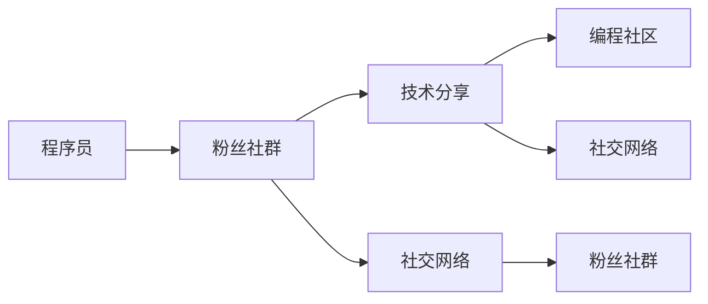

                 

# 程序员如何建立自己的粉丝社群

> 关键词：粉丝社群，程序员，社交网络，技术分享，编程社区

## 1. 背景介绍

在互联网时代，技术的发展速度惊人，新技术、新工具层出不穷。对于程序员而言，保持对新技术的敏感度和掌握新工具的方法，已经成为其职业发展的重要部分。然而，如何有效地获取和分享技术信息，一直是摆在每个程序员面前的难题。粉丝社群作为技术交流和知识共享的重要平台，为程序员们提供了一个理想的互动环境。本文将深入探讨程序员如何建立自己的粉丝社群，并介绍几种成功建立粉丝社群的策略。

## 2. 核心概念与联系

### 2.1 核心概念概述

- **粉丝社群**：指围绕某个共同兴趣或专业领域，由一群志同道合的人组成的在线或线下组织。在这些社群中，成员之间可以自由交流、分享知识、互相帮助，共同进步。

- **程序员**：指通过编写代码解决实际问题的专业人士，通常具备计算机科学、软件工程等相关知识背景。程序员在粉丝社群中不仅分享知识，也寻求解决问题的方法和资源。

- **社交网络**：指人们通过网络平台进行互动、交流、分享信息的虚拟社区。社交网络为程序员建立粉丝社群提供了便利的技术和平台支持。

- **技术分享**：程序员通过技术分享，展示自身技术实力，获取同行认可，同时也能从其他成员那里学到新知识，激发创新灵感。

- **编程社区**：指围绕编程主题建立的网络社群，通常由技术爱好者和专业人士组成，旨在促进技术交流和知识共享。

这些概念之间的逻辑关系可以通过以下Mermaid流程图来展示：

这个流程图展示了程序员通过社交网络和编程社区，建立粉丝社群的过程，以及技术分享在其中扮演的重要角色。

## 3. 核心算法原理 & 具体操作步骤

### 3.1 算法原理概述

建立粉丝社群的核心在于找到一个或多个共同兴趣点，吸引志同道合的人聚集起来。这些兴趣点可以是编程语言、开发框架、技术栈、行业应用等。通过在社交网络平台上进行技术分享、交流和讨论，逐步建立起一个活跃的社群。

### 3.2 算法步骤详解

#### 步骤1: 确定兴趣点和目标群体

确定一个明确的兴趣点，并了解目标群体是谁。这可能包括学生、初级开发者、中级开发者、高级开发者等不同层次的成员。了解目标群体的需求和兴趣，有助于制定有效的社群运营策略。

#### 步骤2: 选择合适的社交网络平台

根据兴趣点和目标群体选择合适的社交网络平台。如GitHub、Stack Overflow、LinkedIn、Reddit、Twitter等。这些平台提供了丰富的技术交流和知识共享功能。

#### 步骤3: 创建社群账号和页面

在选定的社交网络平台上创建社群账号和页面。账号可以是个人或组织的，但最好使用代表社群特点和兴趣的昵称。页面应包含社群的简介、目标、活动计划等关键信息。

#### 步骤4: 发布内容和技术分享

定期发布高质量的技术分享内容，如技术文章、代码示例、教程、视频等。内容应具有教育意义，同时也要与社群的兴趣点紧密相关。

#### 步骤5: 互动和交流

积极与社群成员互动，回答问题、讨论问题，鼓励成员参与技术分享和交流。通过互动，建立社群成员之间的信任和合作关系。

#### 步骤6: 组织活动和项目

组织线上或线下的技术分享活动、编程比赛、项目开发等，提高社群的活跃度和凝聚力。项目可以是开源软件、技术博客、技术白皮书等，以展示社群的技术实力。

#### 步骤7: 评估和优化

定期评估社群的活动效果和成员反馈，总结经验教训，优化社群运营策略。通过不断的改进，提升社群的吸引力和影响力。

### 3.3 算法优缺点

#### 优点

1. **知识共享和交流**：社群为成员提供了一个自由交流和分享知识的环境，促进技术学习和创新。
2. **快速解决问题**：通过社群交流，程序员可以快速获得帮助，解决实际问题。
3. **品牌推广**：通过技术分享和社群活动，程序员可以提升自身品牌，吸引更多技术爱好者加入。

#### 缺点

1. **时间和精力投入**：建立和运营社群需要大量的时间和精力，对于繁忙的程序员而言可能难以兼顾。
2. **内容质量控制**：为了保持社群的高质量，需要严格筛选和审核内容，这可能影响成员的积极性。
3. **成员流失**：成员兴趣点变化或平台迁移，可能导致社群成员流失，影响社群的稳定性。

### 3.4 算法应用领域

粉丝社群不仅限于技术领域，还可以应用于教育、音乐、艺术等多个领域。以下是几个成功建立粉丝社群的实际应用案例：

1. **开源项目**：如GitHub上的开源项目，通过技术分享和社区协作，吸引大量开发者参与贡献。
2. **技术博客**：如Medium、CSDN等平台上的技术博客，通过持续发布高质量内容，吸引大量读者和同行关注。
3. **编程社区**：如Stack Overflow、Reddit等社区，通过讨论和问题解答，形成活跃的编程学习氛围。

## 4. 数学模型和公式 & 详细讲解 & 举例说明

### 4.1 数学模型构建

假设有一个粉丝社群$G$，成员数量为$N$，其兴趣点为$I$。社群的活跃度$A$与成员数量$N$、内容质量$Q$、互动频率$F$成正比，与内容审核时间$T$、成员流失率$L$成反比。数学模型为：

$$
A = k \cdot N \cdot Q \cdot F / (T \cdot L)
$$

其中$k$为常数，代表其他相关因素的影响。

### 4.2 公式推导过程

将模型简化，忽略其他因素，只考虑成员数量$N$、内容质量$Q$、互动频率$F$、成员流失率$L$的影响。推导如下：

$$
\frac{dA}{dt} = k \cdot \left( \frac{dN}{dt} + \frac{dQ}{dt} + \frac{dF}{dt} - \frac{dL}{dt} \right)
$$

即社群的活跃度随时间的变化，由成员增长、内容质量提升、互动增加和成员流失四个因素决定。

### 4.3 案例分析与讲解

以GitHub上的OpenAI的GPT-3项目为例，分析其社群活跃度的提升过程。项目通过定期发布新功能和优化指南，提升内容质量$Q$；通过组织线上技术分享会，增加互动频率$F$；通过开源协议，吸引更多开发者参与，增加成员数量$N$。同时，项目也通过GitHub Issues进行问题跟踪，确保内容质量，控制成员流失率$L$。

## 5. 项目实践：代码实例和详细解释说明

### 5.1 开发环境搭建

建立一个粉丝社群需要一定的技术基础，以下是搭建开发环境的详细步骤：

1. **选择平台**：选择GitHub或Stack Overflow作为平台。
2. **创建账号**：注册GitHub或Stack Overflow账号，并创建社群页面。
3. **安装开发工具**：安装Git、IDE、版本控制系统等开发工具。
4. **搭建服务器**：如果需要线下的技术分享会，搭建服务器和投影设备。

### 5.2 源代码详细实现

以GitHub上的OpenAI的GPT-3项目为例，其社群构建的源代码实现包括以下几个步骤：

1. **创建项目仓库**：在GitHub上创建项目仓库，包含项目代码、文档、README文件等。
2. **发布内容**：定期发布代码更新、技术文章、视频教程等。
3. **组织活动**：通过GitHub Issues或Discussion功能，组织技术分享会、问题讨论等。
4. **互动交流**：积极回答社区成员的问题，参与讨论，提供技术支持。

### 5.3 代码解读与分析

以GitHub上的OpenAI的GPT-3项目为例，其源代码实现分为以下几个模块：

- **代码模块**：包含项目代码和文档，分为不同目录和文件，便于组织和阅读。
- **README文件**：包含项目简介、贡献指南、联系方式等关键信息。
- **技术文章模块**：包含技术文章和教程，定期更新，提供教育价值。
- **活动模块**：包含技术分享会的日程安排、参与人员、讨论主题等。

### 5.4 运行结果展示

以GitHub上的OpenAI的GPT-3项目为例，其运行结果展示包括：

- **代码更新日志**：展示每次代码更新的版本和主要变化。
- **技术文章阅读量**：展示技术文章的阅读次数和评论数量，了解社区活跃度。
- **活动参与度**：展示技术分享会的参与人数和互动次数，评估活动效果。

## 6. 实际应用场景

### 6.1 开源项目

开源项目通过技术分享和社区协作，吸引大量开发者参与贡献。例如，OpenAI的GPT-3项目，通过定期发布新功能和优化指南，提升内容质量，增加成员数量，成为业内知名的技术社群。

### 6.2 技术博客

技术博客通过持续发布高质量内容，吸引大量读者和同行关注。例如，Medium上的LeetCode专栏，通过分享LeetCode题目解析和算法优化技巧，吸引了大量程序员关注和参与讨论。

### 6.3 编程社区

编程社区通过讨论和问题解答，形成活跃的编程学习氛围。例如，Stack Overflow和Reddit上的编程讨论，通过问题解答和技术分享，形成了丰富的编程学习资源。

### 6.4 未来应用展望

未来，随着技术的发展和社交网络的普及，粉丝社群将变得更加多样化、专业化。以下是几个未来应用展望：

1. **多平台集成**：社群可以集成多种社交平台，如Twitter、LinkedIn等，提供更丰富的交流渠道。
2. **个性化推荐**：通过数据分析，为成员提供个性化的内容推荐，提升社群活跃度。
3. **虚拟现实技术**：利用虚拟现实技术，组织线上技术分享会、编程比赛等，增强互动体验。
4. **区块链技术**：利用区块链技术，实现社群成员身份认证和内容版权保护，提升社群信任度。

## 7. 工具和资源推荐

### 7.1 学习资源推荐

以下是几个推荐的粉丝社群学习资源：

1. **《程序员如何建立自己的粉丝社群》在线课程**：详细介绍粉丝社群的构建和运营策略，提供实际案例分析。
2. **GitHub官方文档**：详细介绍了GitHub平台的使用方法和社群构建技巧。
3. **Stack Overflow官方指南**：详细介绍了Stack Overflow平台的使用方法和社群运营策略。

### 7.2 开发工具推荐

以下是几个推荐的粉丝社群开发工具：

1. **GitHub**：提供强大的版本控制和协作功能，适合技术项目的开发和管理。
2. **Stack Overflow**：提供丰富的技术讨论和问题解答功能，适合技术交流和知识分享。
3. **Discord**：提供实时沟通和语音功能，适合组织技术分享会和编程比赛。

### 7.3 相关论文推荐

以下是几个推荐的相关论文：

1. **《粉丝社群在编程学习中的应用》**：详细探讨了粉丝社群在编程学习中的应用效果和方法。
2. **《开源项目的社群构建和运营》**：详细介绍了开源项目的社群构建和运营策略，提供了实际案例分析。
3. **《技术社区的互动模式研究》**：详细分析了技术社区的互动模式和交流方式，提供了数据分析和建议。

## 8. 总结：未来发展趋势与挑战

### 8.1 研究成果总结

本文详细探讨了程序员如何建立自己的粉丝社群，并介绍了几种成功建立粉丝社群的策略。通过案例分析和技术分享，展示了粉丝社群在技术学习和知识共享中的重要作用。

### 8.2 未来发展趋势

未来，粉丝社群将在技术学习、知识共享、品牌推广等方面发挥更大的作用。以下是几个未来发展趋势：

1. **多平台集成**：社群可以集成多种社交平台，提供更丰富的交流渠道。
2. **个性化推荐**：通过数据分析，为成员提供个性化的内容推荐，提升社群活跃度。
3. **虚拟现实技术**：利用虚拟现实技术，组织线上技术分享会、编程比赛等，增强互动体验。
4. **区块链技术**：利用区块链技术，实现社群成员身份认证和内容版权保护，提升社群信任度。

### 8.3 面临的挑战

尽管粉丝社群在技术学习和知识共享中发挥着重要作用，但建立和运营社群也面临一些挑战：

1. **时间和精力投入**：建立和运营社群需要大量的时间和精力，对于繁忙的程序员而言可能难以兼顾。
2. **内容质量控制**：为了保持社群的高质量，需要严格筛选和审核内容，这可能影响成员的积极性。
3. **成员流失**：成员兴趣点变化或平台迁移，可能导致社群成员流失，影响社群的稳定性。

### 8.4 研究展望

未来的研究需要在以下几个方面寻求新的突破：

1. **自动化内容审核**：利用机器学习技术，自动筛选和审核社群内容，提升内容质量。
2. **社区智能推荐**：利用智能推荐算法，为成员提供个性化的内容推荐，提升社群活跃度。
3. **虚拟现实技术应用**：利用虚拟现实技术，提供沉浸式的技术分享和交流体验。
4. **区块链技术应用**：利用区块链技术，实现社群成员身份认证和内容版权保护，提升社群信任度。

## 9. 附录：常见问题与解答

**Q1：如何确保社群内容的高质量？**

A: 建立严格的审核机制，通过人工和机器结合的方式，筛选和审核内容。同时，鼓励成员自发监督和反馈，提升内容质量。

**Q2：如何保持社群成员的活跃度？**

A: 定期发布高质量的技术分享内容，组织线上或线下的技术分享会和编程比赛，增加互动频率。同时，利用数据分析，为成员提供个性化的内容推荐，提升成员的参与度。

**Q3：如何吸引更多成员加入社群？**

A: 通过社交媒体宣传，利用技术分享和案例分析，展示社群的实力和价值。同时，邀请行业专家和知名开发者加入，提升社群的影响力。

**Q4：如何平衡社群运营的时间和精力？**

A: 利用自动化工具和智能推荐算法，提升社群运营效率。同时，鼓励社区成员自发参与管理和运营，分担社群维护工作。

**Q5：如何应对社群成员流失？**

A: 建立长期的社群运营策略，定期评估和优化社群运营效果。同时，提供多样化的交流方式和活动形式，满足不同成员的需求。

---

作者：禅与计算机程序设计艺术 / Zen and the Art of Computer Programming

