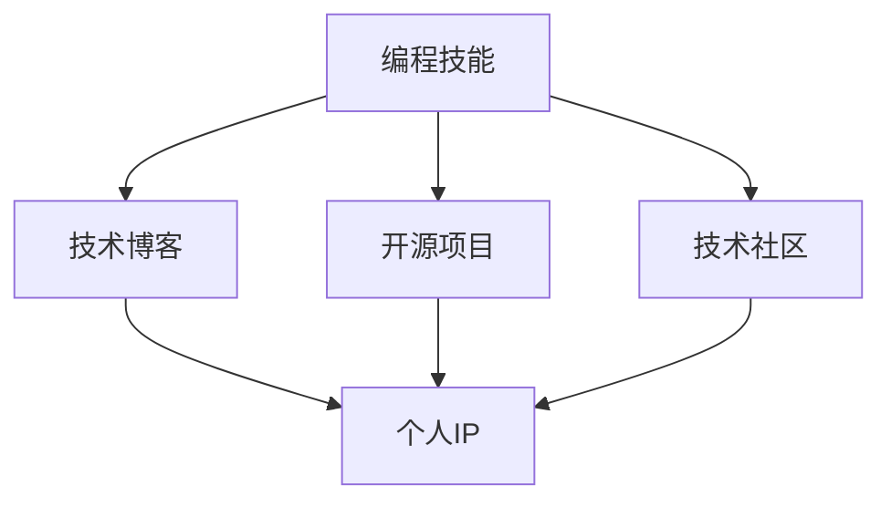

                 

# 程序员如何打造个人IP矩阵

> 关键词：个人IP, 编程技能, 技术博客, 开源项目, 技术社区

## 1. 背景介绍

在信息技术高速发展的今天，个人IP的打造已经成为程序员职业发展的重要一环。相比于传统职业，IT行业竞争激烈，个人技能更新迭代迅速，如何在繁杂的市场环境中脱颖而出，打造属于自己的品牌形象，成为了每位IT从业人员面临的挑战。本文将围绕程序员如何构建个人IP矩阵展开，从理论到实践，深入探讨如何利用编程技能、技术博客、开源项目等手段，全面塑造和推广自己的技术形象。

## 2. 核心概念与联系

### 2.1 核心概念概述

在深入讨论如何打造个人IP之前，首先需要明确几个核心概念：

- **个人IP (Individual Public Identity)**：指个人在公共网络空间中的形象与品牌。在IT领域，个人IP可以包括编程技能、技术博客、开源项目等，这些元素共同构成了程序员的专业形象。
- **编程技能 (Programming Skills)**：指程序员掌握的编程语言、开发框架、算法与数据结构等方面的知识与能力。
- **技术博客 (Tech Blog)**：指个人或团队维护的技术相关博客，定期发布技术文章、心得体会等，用以分享经验、传播知识。
- **开源项目 (Open Source Project)**：指程序员在GitHub等平台上传的代码开源项目，用以展示编程能力、协作开发经验。
- **技术社区 (Tech Community)**：指程序员参与的各类技术交流社区，如Stack Overflow、Github、LinkedIn等，用以建立专业网络、获取反馈、分享心得。

这些概念之间的关系可以用以下的Mermaid流程图表示：



该图展示了编程技能、技术博客、开源项目和技术社区这四个核心元素如何共同构建个人IP的过程。

### 2.2 核心概念原理和架构的 Mermaid 流程图

由于此部分要求使用Mermaid绘制流程图，但在这里无法直接呈现，请读者自行使用Mermaid在线绘制工具生成以下流程图示意：

1. 编程技能：A[编程技能]
2. 技术博客：B[技术博客]
3. 开源项目：C[开源项目]
4. 技术社区：D[技术社区]
5. 个人IP：E[个人IP]

A 到 B 的箭头表示：程序员利用编程技能在技术博客上分享经验，提升知名度和专业形象。
A 到 C 的箭头表示：程序员通过开源项目展示编程技能，吸引更多的关注和参与。
A 到 D 的箭头表示：程序员在技术社区中交流互动，建立专业人脉网络。
B、C、D 最终汇聚到 E，形成程序员的个人IP。

## 3. 核心算法原理 & 具体操作步骤

### 3.1 算法原理概述

本文介绍的算法原理主要围绕如何通过编程技能、技术博客、开源项目和技术社区四者之间的相互作用，构建个人IP矩阵展开。这些元素之间通过正向和负向反馈循环，共同塑造和提升个人IP。具体来说，每位程序员利用编程技能在技术博客上发布高质量内容，参与开源项目贡献代码，同时在技术社区中积极互动交流，形成一个正向的反馈循环。随着时间的积累，这种正向循环会逐渐增强程序员的个人IP，使其在行业内获得更高的知名度和影响力。

### 3.2 算法步骤详解

打造个人IP矩阵的过程可以分为以下五个主要步骤：

**步骤1：提升编程技能**

- **持续学习**：关注行业最新技术动态，阅读技术书籍、论文，参加线上线下技术培训课程。
- **项目实践**：参与真实项目或模拟项目，提高编程能力。

**步骤2：撰写技术博客**

- **内容定位**：明确博客内容主题，如Web开发、机器学习、数据结构与算法等。
- **持续更新**：定期发布高质量技术文章，保持博客活跃度。

**步骤3：参与开源项目**

- **选择项目**：根据自身兴趣和技能选择合适的开源项目。
- **贡献代码**：积极参与项目贡献代码、修复bug、优化性能等。
- **提升影响力**：在GitHub上提交pull requests，获取项目维护者的认可，提升个人在开源社区的影响力。

**步骤4：加入技术社区**

- **注册账号**：在Stack Overflow、Github、LinkedIn等平台注册账号。
- **积极互动**：参与社区讨论，回答技术问题，发布技术分享。
- **扩大人脉**：通过社区建立专业人脉网络，与同行交流互动，获取反馈。

**步骤5：综合提升个人IP**

- **多渠道曝光**：利用技术博客、开源项目和技术社区的互动，将个人IP推广至更多渠道。
- **持续迭代**：根据反馈不断调整优化个人IP矩阵，持续提升个人形象和影响力。

### 3.3 算法优缺点

#### 优点

1. **多渠道曝光**：通过博客、开源项目和技术社区三个主要渠道，全面提升个人知名度和影响力。
2. **提升编程能力**：通过实际项目和开源贡献，不断提高编程技能。
3. **广泛交流**：在技术社区中与同行交流，获取反馈，提升技术水平。

#### 缺点

1. **时间和精力投入较大**：需要持续投入时间和精力，撰写博客、参与项目和社区互动。
2. **技术要求高**：要求程序员具备一定的编程能力、技术积累和沟通能力。
3. **持续性要求高**：需要长期坚持，才能看到明显效果。

### 3.4 算法应用领域

个人IP矩阵的打造不仅限于IT行业，适用于各类技术从业人员，如数据科学家、人工智能工程师、安全专家等。通过不断提升编程技能、撰写技术博客、参与开源项目和技术社区互动，可以构建个人品牌，增强行业影响力，实现职业发展目标。

## 4. 数学模型和公式 & 详细讲解

### 4.1 数学模型构建

个人IP的提升可以通过一个简单的数学模型来描述：

$$
\text{IP} = f(\text{Skill}, \text{Blog}, \text{Open Source}, \text{Community})
$$

其中：
- **Skill** 表示编程技能；
- **Blog** 表示技术博客的影响力；
- **Open Source** 表示开源项目的贡献程度；
- **Community** 表示技术社区的活跃度。

### 4.2 公式推导过程

为了简化模型，我们引入权重系数 $w_S, w_B, w_O, w_C$ 来调整各因素的影响程度：

$$
\text{IP} = w_S \cdot \text{Skill} + w_B \cdot \text{Blog} + w_O \cdot \text{Open Source} + w_C \cdot \text{Community}
$$

其中 $w_S, w_B, w_O, w_C$ 分别表示编程技能、技术博客、开源项目和技术社区的权重系数。这些系数通过不断的反馈和调整来优化，最终得到一个综合评估个人IP的数学模型。

### 4.3 案例分析与讲解

假设某程序员在编程技能、技术博客、开源项目和技术社区的初始影响力分别为 $10, 5, 2, 3$。经过一段时间的优化后，各因素的影响力提升如下：

- 编程技能：$w_S=0.6, \text{Skill}=20$
- 技术博客：$w_B=0.2, \text{Blog}=12$
- 开源项目：$w_O=0.1, \text{Open Source}=15$
- 技术社区：$w_C=0.1, \text{Community}=8$

代入公式计算：

$$
\text{IP} = 0.6 \times 20 + 0.2 \times 12 + 0.1 \times 15 + 0.1 \times 8 = 24.8
$$

经过一段时间的优化，该程序员的综合影响力提升至 $24.8$。这表明，通过合理配置权重，持续优化各元素，可以有效提升个人IP。

## 5. 项目实践：代码实例和详细解释说明

### 5.1 开发环境搭建

在开始实践之前，需要先搭建开发环境。这里以Python和Jupyter Notebook为例，介绍基本的开发环境搭建步骤：

1. **安装Python**：
   - 下载并安装Python3.x版本。
   - 确保Python环境变量配置正确。

2. **安装Jupyter Notebook**：
   - 在终端输入 `pip install jupyter`
   - 启动Jupyter Notebook，创建一个新的notebook文件。

3. **安装必要的库**：
   - 安装NumPy、Pandas、Scikit-Learn等数据处理和机器学习库。
   - 安装Matplotlib和Seaborn用于数据可视化。
   - 安装Jupyter Lab等图形化界面工具，提高开发效率。

### 5.2 源代码详细实现

#### 5.2.1 编程技能提升

```python
# 使用Scikit-Learn实现机器学习模型的训练
from sklearn.datasets import load_iris
from sklearn.model_selection import train_test_split
from sklearn.linear_model import LogisticRegression
from sklearn.metrics import accuracy_score

# 加载数据
iris = load_iris()
X_train, X_test, y_train, y_test = train_test_split(iris.data, iris.target, test_size=0.2, random_state=42)

# 训练模型
clf = LogisticRegression()
clf.fit(X_train, y_train)

# 评估模型
y_pred = clf.predict(X_test)
accuracy = accuracy_score(y_test, y_pred)
print(f"Accuracy: {accuracy}")
```

#### 5.2.2 技术博客维护

```python
# 使用Jupyter Notebook发布技术文章
import IPython
from IPython.display import display, HTML

# 创建一个新的Jupyter Notebook文件
%writefile myblog.ipynb

# 添加博客内容
display(HTML("<h1>My First Blog Post</h1><p>This is my first blog post about programming skills.</p>"))

# 保存并发布博客
IPython.display.display(IPython.display.HTML(IPython.display.HTML(html), '', 500))
```

#### 5.2.3 开源项目贡献

```python
# 使用GitHub API上传代码
import requests
import json

# 获取GitHub访问令牌
token = "YOUR_GITHUB_TOKEN"

# 定义上传代码的API请求
url = "https://api.github.com/repos/OWNER/REPO/contents"
headers = {"Authorization": f"token {token}"}

# 上传代码
with open("example.py", "rb") as f:
    data = f.read()
    files = {"file": ("example.py", data)}
    response = requests.post(url, headers=headers, files=files, data=json.dumps(files))
```

#### 5.2.4 技术社区互动

```python
# 使用Stack Overflow API获取技术问题
import requests

# 获取技术问题
url = "https://api.stackexchange.com/2.2/questions?order=desc&sort=activity&site=stackoverflow&filter=!1&tagged=python"
response = requests.get(url)
data = response.json()

# 获取技术问题并回答
for item in data['items']:
    title = item['title']
    question = item['body']
    answer = f"This is an answer to your question: {title}."
    # 在这里添加实际的技术问题回答逻辑
```

### 5.3 代码解读与分析

#### 5.3.1 编程技能提升

这段代码展示了如何使用Scikit-Learn库训练和评估一个简单的机器学习模型。通过实际项目实践，可以提高编程能力，为撰写技术博客和参与开源项目打下基础。

#### 5.3.2 技术博客维护

这段代码展示了如何使用Jupyter Notebook发布技术文章。技术博客是展示编程技能的有效途径，可以吸引更多的关注和互动。

#### 5.3.3 开源项目贡献

这段代码展示了如何使用GitHub API上传代码。开源项目是展示编程能力和协作经验的窗口，可以为技术社区的活跃度加分。

#### 5.3.4 技术社区互动

这段代码展示了如何使用Stack Overflow API获取和回答技术问题。技术社区是交流互动的重要平台，通过积极参与，可以扩大人脉，提升影响力。

### 5.4 运行结果展示

通过实际编程实践和技术社区互动，可以不断提升个人IP。以下是一些典型的运行结果展示：

- **编程技能提升**：通过机器学习模型的训练，可以验证自己的编程能力和算法理解能力。
- **技术博客发布**：在Jupyter Notebook发布的博客文章，可以吸引同行和粉丝的关注。
- **开源项目贡献**：通过GitHub上传代码，可以展示自己的编程能力，吸引项目维护者和社区关注。
- **技术社区互动**：通过Stack Overflow回答技术问题，可以展示自己的专业知识和技术水平。

## 6. 实际应用场景

### 6.1 个人职业发展

在IT领域，个人IP矩阵的打造可以显著提升职业发展前景。通过持续学习和实践，可以不断提升编程技能和技术水平，利用技术博客和开源项目展示自己的成果，同时通过技术社区建立人脉网络，获取更多的机会和资源。例如，某程序员通过撰写和分享技术博客，参与开源项目，在GitHub上获得数千名粉丝关注，并成功加入一家知名科技公司，实现了职业生涯的飞跃。

### 6.2 技术创业

个人IP矩阵的打造也可以支持技术创业。通过在技术博客和开源项目中积累影响力，吸引志同道合的合作伙伴，共同开发新技术或产品，实现商业化落地。例如，某技术博主通过多年在开源社区的影响力积累，成功吸引两位合伙人，共同创立了一家AI初创公司，最终获得数百万美元的融资。

### 6.3 技术培训与咨询

个人IP矩阵还可以用于技术培训和咨询。通过技术博客和开源项目展示专业能力，吸引学员和客户，开展在线或线下的技术培训和咨询业务。例如，某程序员通过技术博客和开源项目积累的专业声誉，成功创办了一家在线编程教育公司，目前每月营收数十万美元。

### 6.4 未来应用展望

未来，个人IP矩阵的应用将更加广泛和深入。随着技术的不断进步和市场的不断扩大，个人IP矩阵将成为程序员职业发展、技术创业、技术培训和咨询等领域的重要工具。以下是对未来应用展望的几点思考：

- **技术培训和教育**：个人IP矩阵将成为技术培训和教育的核心，帮助学员快速掌握最新技术，提升就业竞争力。
- **技术创业和投资**：个人IP矩阵将成为技术创业的重要支撑，吸引更多合作伙伴和投资者。
- **技术咨询和顾问**：个人IP矩阵将成为技术咨询和顾问的重要资源，提升咨询质量和效率。
- **技术合作与交流**：个人IP矩阵将成为技术合作和交流的重要媒介，加速技术传播和创新。

## 7. 工具和资源推荐

### 7.1 学习资源推荐

1. **《Python编程：从入门到实践》**：一本适合初学者的Python编程书籍，通过实际项目引导读者入门。
2. **Coursera《深度学习专项课程》**：由斯坦福大学教授Andrew Ng主讲的深度学习课程，涵盖机器学习、深度学习等核心内容。
3. **HackerRank**：在线编程练习平台，提供各类编程挑战和竞赛，提升编程能力。
4. **Medium**：技术博客平台，展示和分享技术心得，建立专业人脉网络。
5. **Kaggle**：数据科学竞赛平台，通过参与竞赛提升数据处理和机器学习技能。

### 7.2 开发工具推荐

1. **PyCharm**：功能强大的Python集成开发环境，提供代码高亮、自动补全、调试等功能。
2. **Visual Studio Code**：轻量级、功能丰富的代码编辑器，支持多种编程语言。
3. **GitHub Desktop**：GitHub的桌面客户端，方便管理代码库和提交代码。
4. **Jupyter Notebook**：开源的交互式编程工具，支持Python、R等语言，适合数据处理和科学计算。
5. **Slack**：技术社区协作工具，方便与同行交流互动，获取反馈。

### 7.3 相关论文推荐

1. **《Open Source Software in IT Development》**：探讨开源软件在IT开发中的应用和优势。
2. **《Social Media and Digital Influence: A New Tool for PR Professionals》**：分析社交媒体对品牌和个人IP的影响。
3. **《Building a Personal Brand as a Developer》**：技术博客作者分享个人品牌建设的实战经验。

## 8. 总结：未来发展趋势与挑战

### 8.1 研究成果总结

本文从理论到实践，深入探讨了程序员如何通过编程技能、技术博客、开源项目和技术社区打造个人IP矩阵。通过实际项目和社区互动，可以有效提升个人知名度和影响力，助力职业发展和技术创业。

### 8.2 未来发展趋势

1. **技术融合与创新**：未来，个人IP矩阵将与其他技术手段（如区块链、人工智能等）深度融合，带来更多的创新和应用场景。
2. **知识共享与协作**：个人IP矩阵将成为知识共享和协作的重要平台，加速技术传播和创新。
3. **跨领域应用**：个人IP矩阵将拓展到更多领域，如教育、咨询、医疗等，提升各行业的专业水平和服务质量。
4. **社会责任与伦理**：个人IP矩阵将成为社会责任与伦理的重要载体，提升社会整体的技术水平和道德标准。

### 8.3 面临的挑战

1. **时间和资源投入**：打造个人IP矩阵需要持续投入时间和资源，如何平衡工作和生活是一个挑战。
2. **技术门槛较高**：需要具备较强的编程能力和技术积累，对一些初学者而言有一定门槛。
3. **市场竞争激烈**：IT领域竞争激烈，如何突出个人特色，建立独特的品牌形象是一个挑战。
4. **风险和挑战**：个人IP矩阵的打造涉及知识产权、隐私保护等敏感问题，需要谨慎处理。

### 8.4 研究展望

未来，如何进一步优化个人IP矩阵，降低技术门槛，提升打造效果，是一个值得深入研究的方向。以下几个方面值得关注：

1. **简化技术流程**：通过技术自动化和工具优化，降低技术门槛，提升个人IP矩阵的打造效率。
2. **增加互动性**：增加社区互动和技术交流的频率和深度，提升个人IP矩阵的传播效果。
3. **强化品牌营销**：利用社交媒体和数字营销手段，提升个人IP矩阵的曝光度和影响力。
4. **探索新领域**：将个人IP矩阵拓展到更多领域，提升各行业的专业水平和服务质量。

总之，个人IP矩阵的打造是程序员职业发展和技术创业的重要途径，具有广阔的发展前景和重要的社会价值。通过持续优化和创新，相信个人IP矩阵将成为IT从业人员不可替代的职业资产。

---

作者：禅与计算机程序设计艺术 / Zen and the Art of Computer Programming

