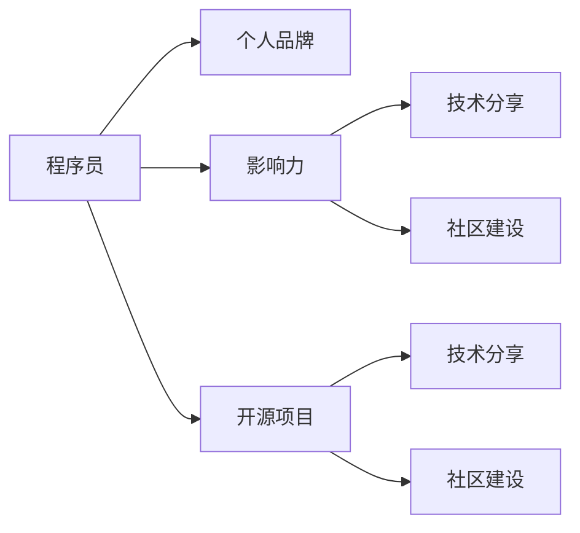

                 

# 程序员如何打造个人影响力生态

> 关键词：程序员、个人品牌、影响力、社区建设、技术分享、开源项目、网络影响力

## 1. 背景介绍

在当今快速变化的技术环境中，程序员不仅需要具备高超的技术能力，还需要善于利用各种平台和工具来提升个人影响力。影响力不仅能带来职业发展的机会，还能为技术社区贡献正能量，促进知识的传播和分享。本文旨在探讨程序员如何通过技术分享、参与开源项目、建立个人品牌等方式，打造属于自己的个人影响力生态。

## 2. 核心概念与联系

### 2.1 核心概念概述

为更好地理解本文讨论的内容，下面将介绍几个关键概念：

- **程序员**：指从事软件开发、系统架构、算法研究等技术工作的人员。
- **个人品牌**：指个人在职业领域中的名声和声誉，包括技术能力、工作态度、职业道德等方面。
- **影响力**：指个人通过某种方式对他人产生影响的能力，可以是技术传播、知识分享、社区参与等。
- **社区建设**：指在技术领域内建立和维护一个有价值、有活力的社区，促进技术交流和合作。
- **技术分享**：指通过博客、视频、代码贡献等方式，将技术知识和经验分享给其他人。
- **开源项目**：指由程序员共同开发和维护的代码库，旨在促进技术交流和合作。

这些概念之间的逻辑关系可以通过以下Mermaid流程图来展示：



这个流程图展示了这个生态中各个概念之间的联系：

1. 程序员通过技术分享和参与社区建设来提升个人品牌。
2. 个人品牌提升后，个人影响力增大，能更有效地分享技术知识和参与社区活动。
3. 技术分享和开源项目都是社区建设的重要组成部分，可以进一步提升个人影响力。

## 3. 核心算法原理 & 具体操作步骤

### 3.1 算法原理概述

构建个人影响力生态的算法原理，可以抽象为以下几个步骤：

1. **定位个人品牌**：明确自己的技术兴趣和专长，确定目标受众和影响力传播的渠道。
2. **知识积累与分享**：通过阅读、实践和学习，积累技术知识和经验，通过技术博客、视频教程、开源代码等方式分享。
3. **参与社区活动**：加入技术社区，积极参与讨论、回答问题、组织活动，建立自己在社区中的声誉。
4. **建立关系网**：利用社交媒体、博客、LinkedIn等平台建立和维护个人关系网，扩大影响力。

### 3.2 算法步骤详解

以下详细介绍每个步骤的详细步骤：

**Step 1: 定位个人品牌**
- **确定专长领域**：选择最感兴趣和擅长的技术领域，如编程语言、框架、算法等。
- **明确目标受众**：确定目标受众，如初级开发者、中级开发者、架构师等。
- **选择传播渠道**：选择最合适的传播渠道，如个人博客、技术社区、视频平台等。

**Step 2: 知识积累与分享**
- **持续学习**：通过阅读书籍、论文、官方文档等方式不断学习新技术和知识。
- **实践与探索**：通过项目开发、代码练习等方式，深入理解技术原理和实现细节。
- **撰写技术博客**：将学习心得和技术实践撰写成博客，定期更新，形成系统化知识体系。
- **制作技术视频**：录制技术讲解视频，通过视频平台（如YouTube、Bilibili）分享，吸引更多观众。
- **贡献开源项目**：参与或主导开源项目，通过代码贡献和社区讨论，展示技术能力和团队合作精神。

**Step 3: 参与社区活动**
- **加入技术社区**：选择活跃的技术社区，如Stack Overflow、GitHub、Kaggle等，积极参与讨论和交流。
- **回答问题**：在社区中主动回答问题，解决其他开发者遇到的问题，展示技术能力。
- **组织活动**：发起或参与技术分享会、代码评审会、编程马拉松等活动，扩大影响力。
- **建立社交网络**：通过社交媒体、博客、LinkedIn等平台，与同行建立联系，分享经验和见解。

**Step 4: 建立关系网**
- **维护社交媒体**：定期在社交媒体（如Twitter、Weibo）发布技术心得和最新动态，与受众互动。
- **建立LinkedIn**：创建完整的LinkedIn个人资料，展示技术项目、教育背景和技能特长。
- **参与线下活动**：参加技术会议、黑客松、技术聚会等线下活动，面对面交流。

### 3.3 算法优缺点

构建个人影响力生态的算法具有以下优点：

1. **知识传播**：通过技术分享和社区参与，促进知识的传播和共享。
2. **提升技能**：在分享和讨论过程中，不断提升自己的技术能力和表达能力。
3. **建立声誉**：通过持续的贡献和分享，建立自己在技术社区中的声誉。

同时，该算法也存在以下缺点：

1. **时间成本高**：技术分享和社区参与需要大量时间和精力投入。
2. **竞争激烈**：技术社区中的竞争激烈，需要持续输出高质量的内容。
3. **心理压力**：在公众面前分享技术内容，可能会带来一定的心理压力。

尽管存在这些缺点，但总体而言，构建个人影响力生态对职业发展和技术进步具有显著的推动作用。

### 3.4 算法应用领域

构建个人影响力生态的方法可以广泛应用于技术领域，例如：

- **软件开发**：通过博客和技术分享，展示自己的编程技能和项目经验。
- **数据分析**：参与开源数据分析项目，分享数据分析方法和经验。
- **人工智能**：在AI社区中积极贡献代码和论文，参与技术讨论和竞赛。
- **网络安全**：参与网络安全项目，分享安全漏洞分析和防护方法。
- **区块链**：通过技术分享和开源项目，推广区块链技术应用。

## 4. 数学模型和公式 & 详细讲解 & 举例说明

### 4.1 数学模型构建

构建个人影响力生态的数学模型，可以抽象为以下几个变量：

- $P$：个人品牌影响力
- $K$：知识积累量
- $S$：技术分享次数
- $C$：社区参与度
- $N$：社交网络规模

则影响力生态的数学模型可以表示为：

$$ P = f(K, S, C, N) $$

其中 $f$ 是一个非线性函数，代表知识积累、技术分享、社区参与和社交网络对影响力的综合影响。

### 4.2 公式推导过程

为简化模型，我们假设 $f$ 函数为加权求和形式：

$$ P = \alpha K + \beta S + \gamma C + \delta N $$

其中 $\alpha, \beta, \gamma, \delta$ 为权重系数，表示知识积累、技术分享、社区参与和社交网络对影响力的相对重要性。

### 4.3 案例分析与讲解

以一个成功的技术博主为例，分析其影响力生态的构建过程：

- **知识积累**：博主持续阅读和实践最新的编程语言和技术框架，积累丰富的技术知识和经验。
- **技术分享**：博主通过博客和视频分享技术心得和项目经验，建立系统化的知识体系。
- **社区参与**：博主积极参与Stack Overflow、GitHub等技术社区的讨论和问题解答，建立自己在社区中的声誉。
- **社交网络**：博主通过Twitter、LinkedIn等社交媒体平台，与同行建立联系，扩大影响力。

通过分析该博主的案例，可以看到其影响力生态的构建是一个系统工程，各个因素相互促进，共同提升了其个人品牌和影响力。

## 5. 项目实践：代码实例和详细解释说明

### 5.1 开发环境搭建

为了高效地进行技术分享和社区参与，需要搭建一套开发环境。以下是基本的开发环境配置步骤：

1. **选择开发工具**：
   - 开发语言：如Python、Java、C++等。
   - 开发框架：如Flask、Django、Spring等。
   - 编辑器：如Visual Studio Code、Sublime Text、Atom等。

2. **配置版本控制**：
   - 选择版本控制系统：如Git、SVN等。
   - 配置Git仓库，确保代码的及时备份和共享。

3. **安装依赖包**：
   - 使用包管理工具：如pip、npm等。
   - 安装项目依赖包和库，确保代码能够顺利运行。

4. **搭建开发服务器**：
   - 使用容器化工具：如Docker、Kubernetes等。
   - 搭建开发服务器，确保代码的快速部署和测试。

### 5.2 源代码详细实现

以下是一个简单的技术博客系统实现示例：

```python
# 示例代码：使用Flask框架搭建技术博客系统

from flask import Flask, render_template, request
import os

app = Flask(__name__)

@app.route('/')
def home():
    return render_template('index.html')

@app.route('/blog')
def blog():
    blog_list = []
    # 从本地文件夹中读取博客文章列表
    for filename in os.listdir('blog'):
        with open(os.path.join('blog', filename), 'r') as f:
            blog_list.append(f.read())
    return render_template('blog.html', blog_list=blog_list)

if __name__ == '__main__':
    app.run(debug=True)
```

### 5.3 代码解读与分析

这段代码使用Flask框架，搭建了一个简单的技术博客系统，主要功能包括：

- 首页：显示欢迎信息。
- 博客列表：从本地文件夹中读取博客文章，显示博客列表。
- 文章详情：通过请求参数获取博客文章的详细信息，显示文章内容。

通过这个简单的博客系统，程序员可以方便地分享自己的技术心得和项目经验，同时收集读者的反馈和评论。

### 5.4 运行结果展示

运行上述代码，启动本地服务器，访问 `http://localhost:5000`，即可在浏览器中看到博客系统的首页。点击博客链接，可以查看所有博客文章列表，点击具体文章链接，可以查看文章详情。

## 6. 实际应用场景

### 6.1 软件开发

通过构建技术博客和开源项目，程序员可以展示自己的编程技能和项目经验，吸引同行关注。例如，使用GitHub托管开源项目，定期发布项目进展和代码更新，参与社区讨论和问题解答，建立自己在社区中的声誉。

### 6.2 数据分析

通过技术分享和社区参与，数据分析师可以推广数据分析方法和技术，提升自己在数据科学社区的影响力。例如，在Kaggle平台上参与数据分析竞赛，分享分析思路和代码，参与社区讨论，与同行建立联系。

### 6.3 人工智能

在AI社区中，通过技术分享和开源项目，AI研究员可以展示自己的研究成果和应用场景，提升自己在AI领域的影响力。例如，使用GitHub托管开源模型和代码，定期发布技术博客和研究论文，参与AI社区的讨论和活动，建立自己的学术声誉。

### 6.4 网络安全

网络安全工程师可以通过技术分享和社区参与，推广安全漏洞分析和防护方法，提升自己在网络安全社区的影响力。例如，在Stack Overflow和GitHub上发布安全漏洞分析和防护技术文章，参与社区讨论和问题解答，建立自己的技术声誉。

### 6.5 区块链

区块链开发者可以通过技术分享和社区参与，推广区块链技术应用，提升自己在区块链领域的影响力。例如，使用GitHub托管区块链项目和代码，定期发布技术博客和研究论文，参与区块链社区的讨论和活动，建立自己的技术声誉。

## 7. 工具和资源推荐

### 7.1 学习资源推荐

为了帮助程序员提升技术能力和构建影响力，这里推荐一些优质的学习资源：

1. **在线课程**：
   - Coursera：提供大量计算机科学和数据科学的在线课程，包括编程语言、算法、数据结构等。
   - Udacity：提供编程和人工智能相关的课程，注重实践和项目实战。

2. **技术博客**：
   - Medium：技术社区，发布大量技术文章和博客，涵盖各种技术领域。
   - InfoQ：技术新闻网站，提供最新技术动态和最佳实践。

3. **技术社区**：
   - Stack Overflow：程序员问答社区，提供丰富的技术讨论和问题解答。
   - GitHub：开源代码托管平台，提供丰富的开源项目和代码贡献机会。

### 7.2 开发工具推荐

为了高效地进行技术开发和社区参与，推荐以下开发工具：

1. **编辑器**：
   - Visual Studio Code：轻量级代码编辑器，支持多种编程语言和插件扩展。
   - Sublime Text：功能丰富的文本编辑器，支持多平台。

2. **版本控制**：
   - Git：主流的版本控制系统，支持分布式协作和版本管理。
   - SVN：集中式版本控制系统，适合团队协作。

3. **项目管理**：
   - Jira：项目管理工具，支持任务分配、进度跟踪和协作。
   - Trello：看板式项目管理工具，支持任务分类和进度跟踪。

### 7.3 相关论文推荐

以下是几篇关于构建个人影响力生态的论文，推荐阅读：

1. **"Social Media Marketing for Technology Startups"**：研究技术创业公司在社交媒体上的营销策略，分析如何通过社交媒体提升品牌影响力和用户互动。
2. **"Personal Branding Strategies for Programmers"**：探讨程序员如何通过技术分享和社区参与，建立个人品牌和影响力。
3. **"The Impact of Open Source on Developer Communities"**：研究开源项目对开发者社区的影响，分析开源项目如何促进技术交流和合作。

## 8. 总结：未来发展趋势与挑战

### 8.1 总结

本文系统介绍了程序员如何通过技术分享、参与开源项目、建立个人品牌等方式，构建属于自己的个人影响力生态。通过定位个人品牌、积累知识、分享技术、参与社区活动和建立关系网，程序员可以有效地提升个人影响力和职业发展。

### 8.2 未来发展趋势

展望未来，构建个人影响力生态的技术和工具将不断进步，带来更多机遇和挑战：

1. **技术进步**：随着AI、大数据等新技术的发展，技术分享和社区参与的方式将更加多样化。
2. **社会媒体**：社交媒体平台将成为技术分享和社区建设的重要渠道，带来更多曝光和互动机会。
3. **开源文化**：开源文化将进一步普及，开源项目将获得更多关注和贡献，促进技术交流和合作。
4. **多元化**：技术社区和影响力生态将更加多元化，涵盖更多技术领域和应用场景。

### 8.3 面临的挑战

尽管技术分享和社区参与带来了诸多机遇，但也面临以下挑战：

1. **时间成本**：技术分享和社区参与需要大量时间和精力投入。
2. **质量控制**：需要确保技术分享和开源项目的质量，避免低质量内容影响声誉。
3. **心理压力**：在公众面前分享技术内容，可能会带来一定的心理压力。

### 8.4 研究展望

未来的研究将在以下几个方面寻求新的突破：

1. **自动化工具**：开发自动化工具，帮助程序员更高效地进行技术分享和社区参与。
2. **内容推荐**：利用机器学习推荐技术内容，提高技术分享的有效性和覆盖范围。
3. **社区治理**：研究和探索社区治理机制，确保社区的健康发展和良性互动。
4. **知识图谱**：构建技术知识图谱，帮助程序员快速获取和共享知识。

通过不断探索和创新，构建个人影响力生态将变得更加高效和智能化，程序员可以更加轻松地实现职业发展和技术进步。

## 9. 附录：常见问题与解答

**Q1：如何选择适合自己的技术分享平台？**

A: 选择技术分享平台时，可以考虑以下几个因素：
1. 受众群体：选择适合自己受众的平台，如开发者社区、博客平台等。
2. 内容形式：选择适合自己内容形式的平台，如视频、博客、开源代码等。
3. 曝光机会：选择曝光机会较多的平台，如GitHub、Medium等。

**Q2：如何在技术社区中建立声誉？**

A: 在技术社区中建立声誉需要持续的努力和互动：
1. 积极回答问题：主动回答问题，展示自己的技术能力。
2. 贡献代码和文档：参与开源项目，贡献代码和文档，展示技术实力。
3. 参与讨论和活动：参与技术讨论和社区活动，与同行建立联系。

**Q3：如何处理技术分享中的负面评论？**

A: 处理负面评论需要冷静和专业：
1. 分析和回应：分析负面评论的原因，有针对性地回应和解释。
2. 积极改进：根据负面评论提出改进建议，提升技术分享质量。
3. 心理调节：保持冷静和专业，避免情绪化回应。

**Q4：如何在社交媒体上提升影响力？**

A: 在社交媒体上提升影响力需要持续的互动和分享：
1. 定期发布内容：定期发布技术文章和动态，保持活跃度。
2. 互动和回复：与关注者互动和回复，建立良好关系。
3. 关注和参与：关注同行和技术大咖，积极参与讨论和活动。

通过不断优化和调整，程序员可以更有效地构建个人影响力生态，实现职业发展和技术进步。

---

作者：禅与计算机程序设计艺术 / Zen and the Art of Computer Programming

