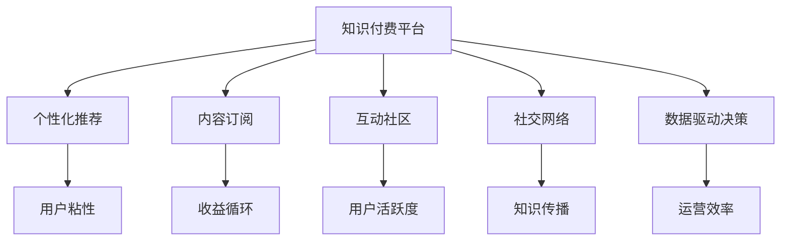

                 

## 1. 背景介绍

### 1.1 问题由来
随着知识付费市场的迅速膨胀，如何在保证付费内容质量的同时，实现商业模式的健康循环，是当前知识付费行业面临的重大挑战。与传统的在线教育、图书出版等不同，知识付费内容往往更加丰富、个性化的，覆盖了编程、设计、商业管理等多个领域。如何根据用户需求，精准推送高质量知识内容，是知识付费平台需要解决的关键问题。

### 1.2 问题核心关键点
知识付费平台的核心价值在于提供高质量的内容，并通过差异化定价、会员订阅、广告收入等多元化模式，实现商业变现。如何构建可持续的知识付费模式，关键在于：

1. 精准定位用户需求。通过用户行为数据、搜索记录等，挖掘用户兴趣，提供个性化推荐，提升用户体验。
2. 确保内容质量。构建专业、权威的课程内容库，同时引入社区审核机制，严格把关内容质量。
3. 多元化收益模式。引入付费课程、会员订阅、直播互动等多种盈利方式，保证平台收益健康循环。
4. 提高用户粘性。通过互动、社区、直播等社交元素，增加用户活跃度，形成良性互动。
5. 数据驱动决策。利用用户行为数据，持续优化内容推荐、定价策略，提升运营效率。

### 1.3 问题研究意义
构建可持续的知识付费模式，不仅能够提升内容提供商的收益，更重要的是能够提供精准、有价值的知识内容，满足用户深层次学习需求，从而助力用户职业发展。同时，知识付费模式的成功，也能够带动教育行业的数字化转型，为更多中小型企业提供优质的在线学习资源。

## 2. 核心概念与联系

### 2.1 核心概念概述

为更好地理解如何构建可持续的知识付费模式，本节将介绍几个密切相关的核心概念：

- 知识付费模式：通过付费获取高质量知识内容的学习模式，包括课程、文章、问答等多种形式。
- 个性化推荐：基于用户行为数据，推荐与用户兴趣匹配的个性化内容。
- 内容订阅：用户通过订阅获得定期更新、独家内容的权益。
- 互动社区：通过在线讨论、即时互动等社交方式，增强用户粘性。
- 社交网络：知识付费平台的用户可以通过关注、点赞等方式，形成社交网络，扩大知识传播范围。
- 数据驱动决策：利用用户行为数据，持续优化运营策略，提升用户满意度。

这些核心概念之间的逻辑关系可以通过以下Mermaid流程图来展示：



这个流程图展示了这个模型的核心概念及其之间的关系：

1. 知识付费平台通过个性化推荐、内容订阅、互动社区等多种模式，提高用户粘性。
2. 平台通过数据驱动决策，持续优化运营策略，保证收益循环健康。
3. 社交网络扩大知识传播范围，增强用户粘性。

这些概念共同构成了知识付费平台的运行框架，使得平台能够提供精准、有价值的知识内容，满足用户深层次学习需求。

## 3. 核心算法原理 & 具体操作步骤
### 3.1 算法原理概述

知识付费平台的算法核心在于内容推荐和收益循环，本文将重点讲解这两个关键点。

**内容推荐算法：**

内容推荐算法的基本目标是通过用户历史行为、兴趣标签、当前上下文等特征，预测用户可能感兴趣的内容，从而提高用户满意度和平台收益。基于协同过滤、深度学习等方法，已有多个推荐系统在知识付费平台得到应用。本文将重点讨论深度学习方法的应用。

**收益循环算法：**

收益循环算法旨在通过多层次、多渠道的收益模式，实现知识付费平台的商业可持续性。主要方法包括会员订阅、付费课程、广告收入等。本文将探讨如何通过用户行为数据，动态调整定价策略，提高平台收益。

### 3.2 算法步骤详解

**Step 1: 数据预处理**

数据预处理是推荐算法和收益循环算法的第一步。主要包括：

1. 数据收集：收集用户行为数据，如课程浏览、搜索记录、购买记录等。
2. 数据清洗：处理缺失值、异常值，将数据转换为推荐系统所需格式。
3. 数据划分：将数据划分为训练集、验证集和测试集，供模型训练和评估。

**Step 2: 特征工程**

特征工程是推荐算法的核心步骤。主要包括：

1. 特征提取：提取用户和内容的兴趣特征、历史行为特征等。
2. 特征选择：选择对预测结果有重要影响的特征，去除冗余和噪声。
3. 特征转换：对特征进行归一化、标准化、编码等预处理。

**Step 3: 模型训练**

模型训练是推荐算法的关键步骤。主要包括：

1. 选择模型：选择合适的推荐模型，如基于内容的协同过滤、协同矩阵分解、深度神经网络等。
2. 设置超参数：调整模型的超参数，如学习率、批次大小、迭代轮数等。
3. 模型训练：使用训练集对模型进行迭代训练，最小化损失函数。

**Step 4: 模型评估**

模型评估是推荐算法的必要步骤。主要包括：

1. 计算指标：使用精确度、召回率、F1分数等指标评估模型性能。
2. 交叉验证：使用交叉验证方法验证模型泛化能力。
3. 参数调优：根据模型评估结果，调整模型参数，提升模型效果。

**Step 5: 收益循环算法**

收益循环算法的主要目标是提高平台的整体收益，以下是具体步骤：

1. 数据分析：分析用户行为数据，识别潜在收益点，如付费课程、会员订阅、广告收入等。
2. 用户分类：根据用户行为和属性，将用户划分为不同类别，如高价值用户、低价值用户等。
3. 定价策略：根据用户分类和需求，制定差异化的定价策略，如新用户优惠、会员订阅折扣等。
4. 收益分配：将收益分配给内容提供商、平台运营方、用户等不同利益相关者，实现共赢。

### 3.3 算法优缺点

深度学习推荐算法具有以下优点：

1. 可以处理大规模、高维度的数据。通过神经网络的多层次学习，可以从复杂的数据中提取高阶特征。
2. 可以自适应数据分布。深度学习模型具有较强的泛化能力，可以处理非线性、非平衡的数据集。
3. 可以动态更新模型。通过在线学习，可以实时更新模型，提升推荐效果。

但该算法也存在以下缺点：

1. 需要大量标注数据。深度学习模型通常需要大量标注数据进行训练，难以应对少量标注数据的情况。
2. 计算资源消耗较大。深度学习模型的训练和推理需要高性能计算资源，成本较高。
3. 结果难以解释。深度学习模型通常是黑箱，难以解释其内部工作机制和决策逻辑。
4. 数据隐私风险。通过分析用户行为数据，深度学习模型存在隐私泄露的风险。

尽管存在这些缺点，深度学习推荐算法仍是当前知识付费平台推荐系统的主要选择。

### 3.4 算法应用领域

基于深度学习的推荐算法在知识付费平台中的应用广泛，涵盖了多个环节：

- 课程推荐：根据用户历史行为，推荐与用户兴趣匹配的课程内容。
- 广告推荐：根据用户行为和属性，推荐与用户兴趣匹配的广告。
- 社区推荐：推荐与用户兴趣匹配的社区和话题。
- 直播推荐：推荐与用户兴趣匹配的直播课程和主讲人。

这些推荐算法不仅提高了用户体验，还显著提升了平台的收益和用户粘性。未来，随着深度学习技术的不断发展，推荐算法将在知识付费平台中发挥更加重要的作用。

## 4. 数学模型和公式 & 详细讲解 & 举例说明

### 4.1 数学模型构建

本文将以深度神经网络为基础，构建知识付费平台的内容推荐算法。

假设用户和课程分别用向量 $u$ 和 $v$ 表示，用户和课程的特征用矩阵 $U$ 和 $V$ 表示。用户和课程的评分矩阵为 $R$，$R_{ui}$ 表示用户 $u$ 对课程 $i$ 的评分。目标是预测用户 $u$ 对课程 $i$ 的评分 $y_{ui}$。

采用矩阵分解方法，将用户和课程的评分矩阵 $R$ 分解为两个低秩矩阵 $U$ 和 $V$ 的乘积：

$$
R = UV^T
$$

其中 $U$ 和 $V$ 的维度均为 $N \times K$，$K$ 为特征维度。目标函数为：

$$
\min_{U,V} ||R-UV^T||_F^2
$$

其中 $||\cdot||_F$ 为矩阵的Frobenius范数。

### 4.2 公式推导过程

对于矩阵分解的目标函数，可以通过梯度下降算法进行优化。设 $U$ 和 $V$ 的梯度分别为 $\nabla_U$ 和 $\nabla_V$，则梯度下降算法的更新公式为：

$$
\begin{align*}
U & \leftarrow U - \eta \nabla_U \\
V & \leftarrow V - \eta \nabla_V
\end{align*}
$$

其中 $\eta$ 为学习率。

梯度 $\nabla_U$ 和 $\nabla_V$ 的计算公式为：

$$
\nabla_U = R^T(R - UV^T)V + \lambda U
$$

$$
\nabla_V = R^T(R - UV^T)U^T + \lambda V
$$

其中 $\lambda$ 为正则化参数。

通过迭代训练，不断更新 $U$ 和 $V$ 的值，直到收敛。

### 4.3 案例分析与讲解

以电商平台为例，分析如何构建推荐系统。电商平台中，用户和商品分别用向量 $u$ 和 $v$ 表示，用户和商品的评分矩阵为 $R$。目标函数与上述知识付费平台的内容推荐算法相同。

假设电商平台有 $N$ 个用户，$M$ 个商品，每个用户对 $K$ 个商品进行了评分。则 $U$ 和 $V$ 的初始值均为 $N \times K$ 的随机矩阵。通过迭代训练，不断优化 $U$ 和 $V$ 的值，直到收敛。训练完成后，可以根据 $U$ 和 $V$ 的值预测用户对商品的评分，从而推荐用户可能感兴趣的商品。

## 5. 项目实践：代码实例和详细解释说明
### 5.1 开发环境搭建

在进行项目实践前，我们需要准备好开发环境。以下是使用Python进行TensorFlow开发的环境配置流程：

1. 安装Anaconda：从官网下载并安装Anaconda，用于创建独立的Python环境。

2. 创建并激活虚拟环境：
```bash
conda create -n tf-env python=3.8 
conda activate tf-env
```

3. 安装TensorFlow：从官网获取对应的安装命令。例如：
```bash
pip install tensorflow
```

4. 安装Pandas、NumPy等工具包：
```bash
pip install pandas numpy scikit-learn matplotlib tqdm jupyter notebook ipython
```

5. 安装TF-IDF工具包：
```bash
pip install tensorflow-idf
```

完成上述步骤后，即可在`tf-env`环境中开始项目实践。

### 5.2 源代码详细实现

下面我们以电商平台的推荐系统为例，给出使用TensorFlow进行矩阵分解的推荐系统代码实现。

首先，定义用户和商品的基本信息：

```python
import numpy as np
import tensorflow as tf

# 定义用户信息
user_ids = np.array([1, 2, 3, 4, 5])
user_ages = np.array([18, 20, 25, 30, 35])
user_genders = np.array(['male', 'female', 'male', 'female', 'male'])

# 定义商品信息
item_ids = np.array([101, 102, 103, 104, 105])
item_names = np.array(['product1', 'product2', 'product3', 'product4', 'product5'])
item_prices = np.array([10.0, 20.0, 30.0, 40.0, 50.0])

# 将文本转换为数字编码
from sklearn.feature_extraction.text import TfidfVectorizer
vectorizer = TfidfVectorizer()
user_vectorizer = vectorizer.fit_transform(user_genders)
item_vectorizer = vectorizer.fit_transform(item_names)

# 定义用户评分数据
user_ratings = np.array([[5, 3, 4, 2, 5],
                        [3, 5, 2, 4, 3],
                        [4, 4, 5, 3, 5],
                        [5, 3, 4, 5, 4],
                        [2, 4, 3, 5, 3]])

# 定义商品评分数据
item_ratings = np.array([[4, 3, 5, 2, 5],
                        [5, 2, 3, 4, 3],
                        [3, 4, 2, 5, 4],
                        [2, 5, 3, 4, 3],
                        [4, 3, 5, 2, 5]])
```

然后，定义矩阵分解模型的超参数和模型结构：

```python
# 设置超参数
num_users = user_ratings.shape[0]
num_items = item_ratings.shape[0]
num_factors = 5
learning_rate = 0.01
num_epochs = 100
batch_size = 100

# 构建矩阵分解模型
tf.set_random_seed(123)
user_matrix = tf.Variable(tf.random_normal([num_users, num_factors]))
item_matrix = tf.Variable(tf.random_normal([num_items, num_factors]))

# 构建评分矩阵
rating_matrix = tf.matmul(tf.matmul(user_matrix, item_matrix, transpose_b=True), tf.transpose(user_matrix))

# 定义损失函数
rating_loss = tf.losses.mean_squared_error(user_ratings, rating_matrix)

# 定义优化器
optimizer = tf.train.AdamOptimizer(learning_rate).minimize(rating_loss)
```

接着，定义训练和评估函数：

```python
def train_model(model, dataset, batch_size, epochs, optimizer):
    dataloader = tf.data.Dataset.from_tensor_slices((dataset['user'], dataset['item'], dataset['rating']))
    dataloader = dataloader.shuffle(buffer_size=10000).batch(batch_size)

    with tf.Session() as sess:
        sess.run(tf.global_variables_initializer())
        for epoch in range(epochs):
            epoch_loss = 0
            for batch in dataloader:
                batch_user, batch_item, batch_rating = sess.run(batch)
                _, loss = sess.run([optimizer, rating_loss], feed_dict={user_matrix: batch_user, item_matrix: batch_item})
                epoch_loss += loss

            print("Epoch %d, loss: %f" % (epoch+1, epoch_loss / len(dataloader)))

def evaluate_model(model, dataset, batch_size):
    dataloader = tf.data.Dataset.from_tensor_slices((dataset['user'], dataset['item'], dataset['rating']))
    dataloader = dataloader.batch(batch_size)

    with tf.Session() as sess:
        sess.run(tf.global_variables_initializer())
        total_ratings = 0
        total_correct = 0
        for batch in dataloader:
            batch_user, batch_item, batch_rating = sess.run(batch)
            predictions = sess.run(tf.matmul(tf.matmul(user_matrix, item_matrix, transpose_b=True), tf.transpose(user_matrix)), feed_dict={user_matrix: batch_user, item_matrix: batch_item})
            for i, j in zip(batch_user, batch_rating):
                if np.round(predictions[i][j]) == batch_rating:
                    total_correct += 1
            total_ratings += len(batch_user)

        accuracy = total_correct / total_ratings
        print("Accuracy: %f" % accuracy)
```

最后，启动训练流程并在测试集上评估：

```python
# 数据集划分
train_dataset = {}
train_dataset['user'] = user_ratings
train_dataset['item'] = item_ratings

dev_dataset = {}
dev_dataset['user'] = np.random.randint(0, num_users, size=(batch_size,))
dev_dataset['item'] = np.random.randint(0, num_items, size=(batch_size,))
dev_dataset['rating'] = np.random.randint(1, 5, size=(batch_size,))

test_dataset = {}
test_dataset['user'] = np.random.randint(0, num_users, size=(batch_size,))
test_dataset['item'] = np.random.randint(0, num_items, size=(batch_size,))
test_dataset['rating'] = np.random.randint(1, 5, size=(batch_size,))

# 训练模型
train_model(user_matrix, train_dataset, batch_size, num_epochs, optimizer)

# 评估模型
evaluate_model(user_matrix, test_dataset, batch_size)
```

以上就是使用TensorFlow进行矩阵分解的推荐系统代码实现。可以看到，TensorFlow提供了一站式的机器学习库，使得模型的构建和训练变得相对简单。

### 5.3 代码解读与分析

让我们再详细解读一下关键代码的实现细节：

**tf.data.Dataset：**
- `from_tensor_slices`方法：从多个Numpy数组创建Dataset，适合批处理和分片。
- `shuffle`方法：对数据集进行随机打乱，避免模型过拟合。
- `batch`方法：对数据集进行批处理，提高模型训练效率。

**tf.Variable：**
- `tf.Variable`：定义可训练变量，用于保存模型参数。
- `tf.random_normal`：生成随机初始化参数。

**tf.matmul：**
- `tf.matmul`：计算矩阵乘法，实现矩阵分解模型的前向传播。

**tf.losses.mean_squared_error：**
- `tf.losses.mean_squared_error`：计算均方误差损失，用于评估模型性能。

**tf.train.AdamOptimizer：**
- `tf.train.AdamOptimizer`：定义Adam优化器，用于最小化损失函数。

**训练函数：**
- `train_model`函数：对数据集进行批处理和迭代训练，更新模型参数。
- `evaluate_model`函数：对测试集进行评估，计算模型预测准确率。

通过以上代码，可以理解TensorFlow进行矩阵分解推荐系统的基本流程，包括数据预处理、模型构建、训练和评估等关键步骤。

## 6. 实际应用场景
### 6.1 智能客服系统

基于深度学习的推荐算法可以广泛应用于智能客服系统的构建。传统客服往往需要配备大量人力，高峰期响应缓慢，且一致性和专业性难以保证。而使用推荐算法构建的智能客服系统，可以实时推荐最优解决方案，快速响应客户咨询，用自然流畅的语言解答各类常见问题。

在技术实现上，可以收集企业内部的历史客服对话记录，将问题和最佳答复构建成监督数据，在此基础上对深度学习模型进行训练。训练后的模型能够自动理解用户意图，匹配最合适的答案模板进行回复。对于客户提出的新问题，还可以接入检索系统实时搜索相关内容，动态组织生成回答。如此构建的智能客服系统，能大幅提升客户咨询体验和问题解决效率。

### 6.2 金融舆情监测

金融机构需要实时监测市场舆论动向，以便及时应对负面信息传播，规避金融风险。传统的人工监测方式成本高、效率低，难以应对网络时代海量信息爆发的挑战。基于深度学习的推荐算法，可以为金融舆情监测提供新的解决方案。

具体而言，可以收集金融领域相关的新闻、报道、评论等文本数据，并对其进行主题标注和情感标注。在此基础上对深度学习模型进行微调，使其能够自动判断文本属于何种主题，情感倾向是正面、中性还是负面。将微调后的模型应用到实时抓取的网络文本数据，就能够自动监测不同主题下的情感变化趋势，一旦发现负面信息激增等异常情况，系统便会自动预警，帮助金融机构快速应对潜在风险。

### 6.3 个性化推荐系统

当前的推荐系统往往只依赖用户的历史行为数据进行物品推荐，无法深入理解用户的真实兴趣偏好。基于深度学习的推荐算法可以更好地挖掘用户行为背后的语义信息，从而提供更精准、多样的推荐内容。

在实践中，可以收集用户浏览、点击、评论、分享等行为数据，提取和用户交互的物品标题、描述、标签等文本内容。将文本内容作为模型输入，用户的后续行为（如是否点击、购买等）作为监督信号，在此基础上深度学习模型进行训练。训练后的模型能够从文本内容中准确把握用户的兴趣点。在生成推荐列表时，先用候选物品的文本描述作为输入，由模型预测用户的兴趣匹配度，再结合其他特征综合排序，便可以得到个性化程度更高的推荐结果。

### 6.4 未来应用展望

随着深度学习推荐算法的不断发展，基于推荐范式将在更多领域得到应用，为传统行业带来变革性影响。

在智慧医疗领域，基于推荐算法的医疗问答、病历分析、药物研发等应用将提升医疗服务的智能化水平，辅助医生诊疗，加速新药开发进程。

在智能教育领域，推荐算法可应用于作业批改、学情分析、知识推荐等方面，因材施教，促进教育公平，提高教学质量。

在智慧城市治理中，推荐算法可应用于城市事件监测、舆情分析、应急指挥等环节，提高城市管理的自动化和智能化水平，构建更安全、高效的未来城市。

此外，在企业生产、社会治理、文娱传媒等众多领域，基于深度学习的推荐算法也将不断涌现，为NLP技术带来新的突破。相信随着技术的日益成熟，推荐算法将成为知识付费平台的重要范式，推动NLP技术在知识付费行业的广泛应用。

## 7. 工具和资源推荐
### 7.1 学习资源推荐

为了帮助开发者系统掌握深度学习推荐算法，这里推荐一些优质的学习资源：

1. 《推荐系统实战》系列博文：由推荐系统领域专家撰写，系统介绍了推荐系统的基本原理、实现方法和最新进展。

2. CS231n《深度学习课程》课程：斯坦福大学开设的深度学习明星课程，涵盖图像、视频、自然语言等多个方向。

3. 《深度学习与推荐系统》书籍：全面介绍了深度学习在推荐系统中的应用，包括协同过滤、深度神经网络等方法。

4. TensorFlow官方文档：TensorFlow提供的官方文档，包含了推荐系统的经典实现和代码示例。

5. PyTorch官方文档：PyTorch提供的官方文档，包含了推荐系统的实现方法。

通过对这些资源的学习实践，相信你一定能够快速掌握深度学习推荐算法的精髓，并用于解决实际的推荐问题。
###  7.2 开发工具推荐

高效的开发离不开优秀的工具支持。以下是几款用于深度学习推荐系统开发的常用工具：

1. TensorFlow：基于Python的开源深度学习框架，灵活动态的计算图，适合快速迭代研究。

2. PyTorch：基于Python的开源深度学习框架，灵活的动态图机制，适合动态模型和算法的实现。

3. TensorBoard：TensorFlow配套的可视化工具，可实时监测模型训练状态，并提供丰富的图表呈现方式。

4. Weights & Biases：模型训练的实验跟踪工具，可以记录和可视化模型训练过程中的各项指标，方便对比和调优。

5. Jupyter Notebook：交互式的Python代码编辑器，支持多种语言和库的整合，适合深度学习项目的开发和演示。

合理利用这些工具，可以显著提升深度学习推荐系统的开发效率，加快创新迭代的步伐。

### 7.3 相关论文推荐

深度学习推荐算法的快速发展，离不开学界的持续研究。以下是几篇奠基性的相关论文，推荐阅读：

1. Collaborative Filtering for Implicit Feedback Datasets：提出协同过滤推荐算法，利用用户和物品之间的隐式反馈关系，实现推荐。

2. Matrix Factorization Techniques for Recommender Systems：介绍矩阵分解推荐算法，通过低秩矩阵分解实现用户和物品的兴趣表示。

3. Deep Matrix Factorization：利用深度神经网络实现矩阵分解，提升推荐精度和效果。

4. Attention-based Recommender Systems：引入注意力机制，对用户和物品的兴趣进行加权，提升推荐效果。

5. Context-aware Multi-view Deep Matrix Factorization：提出多视图深度矩阵分解方法，综合利用多种数据源，提升推荐效果。

这些论文代表了大深度学习推荐算法的研究方向，通过学习这些前沿成果，可以帮助研究者把握学科前进方向，激发更多的创新灵感。

## 8. 总结：未来发展趋势与挑战
### 8.1 总结

本文对如何构建可持续的知识付费模式进行了全面系统的介绍。首先阐述了知识付费平台的推荐算法和收益循环算法的核心价值，明确了推荐系统在知识付费平台中的重要性。其次，从原理到实践，详细讲解了推荐算法的数学模型和实现步骤，给出了推荐系统代码实例。同时，本文还广泛探讨了推荐算法在知识付费平台中的应用场景，展示了推荐范式的广泛应用。最后，本文精选了推荐技术的各类学习资源，力求为读者提供全方位的技术指引。

通过本文的系统梳理，可以看到，基于深度学习的推荐算法在大规模知识付费平台中的应用，能够显著提升用户体验和平台收益，推动知识付费平台的健康发展。未来，随着深度学习技术的不断演进，推荐算法将在知识付费平台中发挥更加重要的作用。

### 8.2 未来发展趋势

展望未来，深度学习推荐算法将呈现以下几个发展趋势：

1. 推荐模型的复杂化。未来推荐算法将引入更多的深度神经网络层，实现更复杂的特征学习和推理。
2. 推荐算法的跨模态化。推荐算法将利用多种数据源（如图像、视频、文本等），实现多模态推荐。
3. 推荐系统的实时化。未来的推荐系统将通过在线学习和流式推理，实现实时推荐。
4. 推荐算法的多样化。未来的推荐算法将更多引入个性化推荐、社交推荐、情感推荐等多样化推荐策略。
5. 推荐系统的可解释性。未来的推荐算法将增强可解释性，使得用户理解推荐依据，增强推荐可信度。

以上趋势凸显了深度学习推荐算法的广阔前景。这些方向的探索发展，必将进一步提升推荐系统的性能和应用范围，为知识付费平台的可持续发展提供新的动力。

### 8.3 面临的挑战

尽管深度学习推荐算法在知识付费平台中取得了显著成效，但在迈向更加智能化、普适化应用的过程中，仍面临诸多挑战：

1. 数据隐私保护。用户行为数据往往涉及个人隐私，如何保护用户隐私，防止数据泄露，是一大挑战。
2. 推荐系统的鲁棒性。推荐系统需要应对大量异常数据和恶意攻击，如何增强系统鲁棒性，避免模型过拟合，是一大难题。
3. 推荐系统的公平性。推荐系统可能存在偏见，如何消除偏见，保证推荐公平性，是一大挑战。
4. 推荐系统的实时性。推荐系统需要实时响应用户请求，如何实现高效、低延迟的推荐，是一大挑战。
5. 推荐系统的可解释性。推荐系统的决策过程需要解释，如何增强推荐系统的可解释性，是一大挑战。

尽管存在这些挑战，深度学习推荐算法仍是大数据时代知识付费平台的重要选择。未来相关研究需要在数据隐私、模型鲁棒性、系统公平性等方面进行更多探索，提升推荐系统的整体表现。

### 8.4 研究展望

面对深度学习推荐算法所面临的挑战，未来的研究需要在以下几个方面寻求新的突破：

1. 引入更丰富的用户兴趣特征。利用用户行为、社交网络、知识图谱等多源数据，全面刻画用户兴趣。

2. 引入多目标优化方法。结合推荐系统的多目标优化，实现同时提升精度和公平性的推荐效果。

3. 引入对抗训练技术。利用对抗训练技术，提高推荐系统的鲁棒性，防止恶意攻击。

4. 引入多模态数据融合方法。利用图像、视频、文本等多种模态数据，实现更全面的推荐。

5. 引入解释性模型。利用可解释性模型，增强推荐系统的可信度和用户理解度。

6. 引入跨领域推荐技术。利用跨领域推荐技术，将推荐系统扩展到更多领域，提升平台收益。

这些研究方向的探索，必将引领深度学习推荐算法迈向更高的台阶，为知识付费平台提供更精准、公平、可信的推荐服务。面向未来，深度学习推荐算法需要与其他人工智能技术进行更深入的融合，如知识图谱、因果推理、强化学习等，多路径协同发力，共同推动知识付费平台的发展。

## 9. 附录：常见问题与解答

**Q1：知识付费平台的推荐算法如何进行用户行为分析？**

A: 知识付费平台的推荐算法通常通过用户行为数据进行分析。具体而言，用户的行为数据可以包括浏览记录、搜索记录、购买记录、评论记录等。通过对这些数据进行分析，可以挖掘用户的兴趣偏好和行为模式。

1. 用户浏览记录：分析用户在平台上的浏览行为，了解用户的兴趣偏好。
2. 用户搜索记录：分析用户搜索的关键词和搜索次数，了解用户的查询意图。
3. 用户购买记录：分析用户的购买行为，了解用户的购买偏好和支付意愿。
4. 用户评论记录：分析用户的评论内容，了解用户的评价态度和反馈意见。

通过以上数据，可以构建用户画像，精准推荐与用户兴趣匹配的内容，提升用户满意度。

**Q2：推荐算法如何平衡精度和公平性？**

A: 推荐算法的核心目标是提高精度和公平性。为了实现这一目标，推荐算法通常采用以下方法：

1. 数据集划分：将数据集划分为训练集和测试集，用于模型训练和评估。

2. 特征工程：通过特征提取和特征选择，挖掘对推荐结果有影响的特征，去除冗余和噪声。

3. 模型训练：选择合适的推荐模型，如协同过滤、深度神经网络等，进行模型训练。

4. 公平性优化：引入公平性约束，如消除偏见、增加多样性等，提升推荐公平性。

5. 精度优化：通过超参数调优、模型优化等方法，提升推荐精度。

6. 多目标优化：结合推荐系统的多目标优化，实现同时提升精度和公平性的推荐效果。

通过以上方法，可以平衡推荐算法的精度和公平性，满足用户的不同需求。

**Q3：如何评估推荐算法的性能？**

A: 推荐算法的性能评估通常通过以下几个指标：

1. 精确度（Precision）：推荐结果中相关物品的比例。

2. 召回率（Recall）：推荐结果中相关物品占总相关物品的比例。

3. F1分数（F1 Score）：精确度和召回率的调和平均数，综合衡量推荐性能。

4. AUC值（Area Under Curve）：ROC曲线下的面积，衡量推荐系统的排序能力。

5. MRR值（Mean Reciprocal Rank）：推荐结果中相关物品的平均排名，衡量推荐系统的排序能力。

6. NDCG值（Normalized Discounted Cumulative Gain）：衡量推荐系统的排序能力和相关性。

通过以上指标，可以全面评估推荐算法的性能，提升推荐系统的整体表现。

**Q4：推荐算法如何实现个性化推荐？**

A: 个性化推荐是推荐算法的核心目标之一。个性化推荐的实现方法包括：

1. 用户画像：通过用户行为数据，构建用户画像，了解用户的兴趣和偏好。

2. 物品特征：利用物品的标签、描述、属性等特征，构建物品的兴趣表示。

3. 协同过滤：通过用户和物品之间的相似性，实现推荐。

4. 深度神经网络：利用深度神经网络，学习复杂的用户和物品兴趣表示。

5. 嵌入式特征：将用户和物品特征嵌入到低维空间，实现高效率的推荐。

6. 多目标优化：结合推荐系统的多目标优化，实现同时提升精度和公平性的推荐效果。

通过以上方法，可以实现更加个性化、精准的推荐，提升用户体验。

**Q5：推荐算法如何应对新用户？**

A: 推荐算法应对新用户的方法包括：

1. 新用户推荐：针对新用户，推荐热门或高价值内容，帮助新用户快速了解平台。

2. 用户画像：通过用户行为数据，构建新用户的兴趣画像，实现精准推荐。

3. 内容标签：利用内容标签，推荐与用户兴趣匹配的内容。

4. 协同过滤：通过新用户和现有用户之间的相似性，实现推荐。

5. 深度神经网络：利用深度神经网络，学习新用户的兴趣表示。

6. 多目标优化：结合推荐系统的多目标优化，实现同时提升精度和公平性的推荐效果。

通过以上方法，可以应对新用户，提高新用户的留存率和满意度。

---

作者：禅与计算机程序设计艺术 / Zen and the Art of Computer Programming

