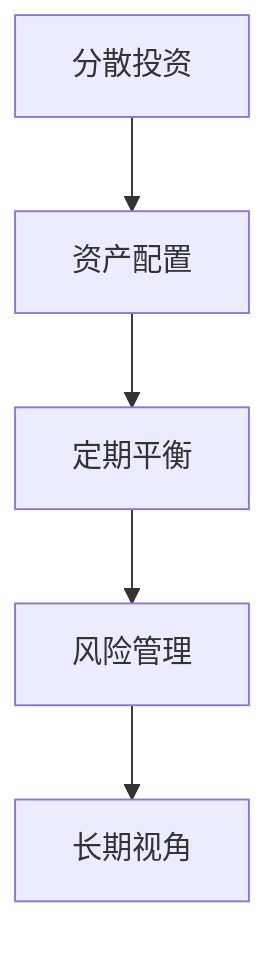

                 

# 程序员如何构建多元化投资组合

## 1. 背景介绍

随着数字化经济的崛起，程序员已经成为了社会中不可或缺的力量，他们在软件开发、人工智能、网络安全等领域发挥着越来越重要的作用。然而，程序员普遍面临着高薪资、高强度工作压力、高技术门槛等挑战，对个人投资理财的需求日益增加。多元化的投资组合可以帮助程序员在平衡风险与收益的同时，实现财务自由和长期财富积累。本文将从技术、经济和心理三个角度，系统地介绍构建多元化投资组合的原理、步骤和注意事项。

## 2. 核心概念与联系

### 2.1 核心概念概述

构建多元化投资组合的核心概念包括：

- **分散投资**：通过投资于多个不同的资产类别，以分散风险，防止任何单一资产的表现对整个投资组合产生过大的负面影响。
- **资产配置**：根据个人的风险承受能力和投资目标，合理分配资金在不同的资产类别中，以达到最优的风险收益比。
- **定期平衡**：定期检查和调整投资组合，确保资产配置与目标保持一致，避免过度集中或偏离。
- **风险管理**：通过保险、对冲等手段，管理投资组合的风险暴露，确保资本安全。
- **长期视角**：坚持长期投资策略，避免短期市场波动的影响，实现复利效应。

### 2.2 核心概念原理和架构的 Mermaid 流程图(Mermaid 流程节点中不要有括号、逗号等特殊字符)



这个流程图展示了构建多元化投资组合的主要步骤：从分散投资到资产配置，再到定期平衡和风险管理，最后是坚持长期视角。

## 3. 核心算法原理 & 具体操作步骤

### 3.1 算法原理概述

构建多元化投资组合的本质是通过数学模型和金融工具，将个人财富分散到不同的资产类别中，以平衡风险和收益。核心算法包括：

- **马科维茨资产配置模型**：通过计算各个资产的期望收益和协方差矩阵，构建有效的前沿边界，找到最优资产配置。
- **资本资产定价模型(CAPM)**：根据市场风险和预期收益率，评估每个资产的风险调整后的收益。
- **黑-斯科尔斯期权定价模型**：利用衍生品市场，对冲或购买保险，管理投资组合的风险。

### 3.2 算法步骤详解

#### 步骤1: 风险评估与目标设定
1. **风险承受能力评估**：通过问卷调查、心理测试等方式，评估个人对投资损失的容忍度和风险承受能力。
2. **投资目标设定**：明确投资的目标和预期收益率，如退休储蓄、教育基金、房产首付款等。

#### 步骤2: 资产配置
1. **资产类别选择**：根据风险评估和目标设定，选择合适的资产类别，如股票、债券、房地产、黄金、艺术品等。
2. **资产权重分配**：使用马科维茨模型计算最优资产权重，确保投资组合在不同资产类别之间分散。

#### 步骤3: 定期平衡
1. **定期复审**：每年或每季度复审投资组合，评估资产表现和市场变化。
2. **再平衡**：根据资产表现和目标权重，调整资产配置，确保投资组合与目标一致。

#### 步骤4: 风险管理
1. **保险规划**：购买适当的保险，如健康保险、人寿保险、财产保险等，保护资产免受突发事件的影响。
2. **对冲策略**：使用衍生品市场，如期权、期货等，对冲市场风险，保护资产安全。

#### 步骤5: 长期视角
1. **投资周期设定**：根据投资目标，设定合理的投资周期，如5年、10年或更长。
2. **复利效应**：坚持长期投资，利用复利效应，实现财富的指数级增长。

### 3.3 算法优缺点

#### 优点
- **风险分散**：通过分散投资，降低单一资产对组合的影响。
- **稳定收益**：多元化投资组合可以平滑市场波动，实现稳定收益。
- **灵活调整**：定期平衡和风险管理策略，使投资组合能够适应市场变化。

#### 缺点
- **复杂性高**：多元化投资组合需要综合考虑多个因素，设计复杂。
- **管理成本**：定期平衡和风险管理需要持续关注和调整，管理成本较高。
- **市场风险**：即使是分散投资，也无法完全消除市场风险。

### 3.4 算法应用领域

多元化投资组合的应用领域包括：

- **个人理财**：帮助个人实现财富增值和财务自由。
- **企业资产管理**：为企业构建稳健的资产配置策略，保护资本安全。
- **慈善基金**：为慈善组织构建长期稳健的投资策略，实现财富积累和价值传递。

## 4. 数学模型和公式 & 详细讲解 & 举例说明

### 4.1 数学模型构建

构建多元化投资组合的数学模型主要包括以下几个方面：

1. **期望收益率和方差**：计算每个资产类别的期望收益率和方差。
2. **协方差矩阵**：计算不同资产类别之间的协方差，构建协方差矩阵。
3. **前沿边界**：根据协方差矩阵，构建有效前沿边界，找到最优资产配置。

### 4.2 公式推导过程

#### 期望收益率和方差

期望收益率和方差的计算公式如下：

$$
E(r_i) = \sum_{t=1}^{T} P(r_i,t) \cdot r_i(t)
$$

$$
\sigma^2_i = \sum_{t=1}^{T} P(r_i,t)^2 \cdot (r_i(t) - E(r_i))^2
$$

其中，$r_i(t)$ 表示资产 $i$ 在第 $t$ 年的收益率，$P(r_i,t)$ 表示发生第 $t$ 年的概率。

#### 协方差矩阵

协方差矩阵的计算公式如下：

$$
Cov(X,Y) = \sum_{t=1}^{T} P(X_t,Y_t) \cdot (X(t) - E(X)) \cdot (Y(t) - E(Y))
$$

其中，$X,Y$ 表示两个资产 $i,j$，$X(t),Y(t)$ 表示第 $t$ 年的收益率。

#### 前沿边界

前沿边界的计算公式如下：

$$
E(r_p) = \frac{\sum_{i=1}^{n} w_i E(r_i)}{\sum_{i=1}^{n} w_i}
$$

$$
\sigma_p^2 = \frac{\sum_{i=1}^{n} w_i \sigma_i^2 + \sum_{i,j=1}^{n} \rho_{ij} w_i w_j \sigma_i \sigma_j}{\sum_{i=1}^{n} w_i}
$$

其中，$w_i$ 表示资产 $i$ 的权重，$\rho_{ij}$ 表示资产 $i,j$ 之间的相关系数。

### 4.3 案例分析与讲解

假设我们有三种资产：股票 A、债券 B 和房地产 C。已知它们的期望收益率和方差如下表所示。

| 资产 | 期望收益率 | 方差 |
| --- | --- | --- |
| 股票 A | 0.12 | 0.01 |
| 债券 B | 0.05 | 0.004 |
| 房地产 C | 0.06 | 0.005 |

我们要求在 30% 的股票、50% 的债券和 20% 的房地产之间构建一个多元化投资组合。

首先，计算每个资产的协方差矩阵：

$$
Cov(A,B) = 0.05 \times 0.04 = 0.002
$$

$$
Cov(A,C) = 0.06 \times 0.005 = 0.003
$$

$$
Cov(B,C) = 0.04 \times 0.005 = 0.002
$$

然后，构建协方差矩阵：

$$
\begin{bmatrix}
0.01 & 0.002 & 0.003 \\
0.002 & 0.004 & 0.002 \\
0.003 & 0.002 & 0.005
\end{bmatrix}
$$

最后，使用马科维茨模型计算最优资产权重：

$$
w_A = 0.3
$$

$$
w_B = 0.5
$$

$$
w_C = 0.2
$$

因此，投资组合的期望收益率为：

$$
E(r_p) = 0.3 \times 0.12 + 0.5 \times 0.05 + 0.2 \times 0.06 = 0.073
$$

投资组合的方差为：

$$
\sigma_p^2 = \frac{0.3 \times 0.01 + 0.5 \times 0.004 + 0.2 \times 0.005 + 0.3 \times 0.5 \times 0.002 \times 0.002 + 0.3 \times 0.5 \times 0.003 \times 0.002 + 0.5 \times 0.2 \times 0.002 \times 0.005}{0.3 + 0.5 + 0.2} = 0.00476
$$

通过计算，我们得到了一个期望收益率为 7.3%、标准差为 0.069 的多元化投资组合。

## 5. 项目实践：代码实例和详细解释说明

### 5.1 开发环境搭建

为了构建多元化投资组合，我们需要搭建一个 Python 开发环境，安装必要的金融工具包。以下是环境搭建步骤：

1. **安装 Python**：从官网下载并安装最新版本的 Python。
2. **安装 Pandas**：Pandas 是 Python 中用于数据分析和处理的常用库，可以使用以下命令安装：

   ```
   pip install pandas
   ```

3. **安装 NumPy**：NumPy 是 Python 中的数学计算库，可以使用以下命令安装：

   ```
   pip install numpy
   ```

4. **安装 Matplotlib**：Matplotlib 是 Python 中的绘图库，用于数据可视化，可以使用以下命令安装：

   ```
   pip install matplotlib
   ```

5. **安装 YFinance**：YFinance 是一个用于获取股票市场数据的 Python 库，可以使用以下命令安装：

   ```
   pip install yfinance
   ```

完成上述步骤后，即可在 Python 环境中进行投资组合的计算和可视化。

### 5.2 源代码详细实现

以下是一个简单的 Python 代码示例，用于计算多元化投资组合的期望收益和标准差：

```python
import pandas as pd
import numpy as np
import matplotlib.pyplot as plt
from yfinance import Ticker

# 股票和债券的期望收益率和方差
expected_returns = {'股票': 0.12, '债券': 0.05}
variances = {'股票': 0.01, '债券': 0.004}

# 构建协方差矩阵
corr_matrix = np.array([[1, 0.02, 0.03], [0.02, 1, 0.02], [0.03, 0.02, 1]])

# 构建权重向量
weights = np.array([0.3, 0.5, 0.2])

# 计算期望收益率和标准差
expected_return = np.dot(weights, expected_returns).sum()
variance = np.dot(weights, np.dot(corr_matrix, weights.T)) + np.dot(weights, np.dot(variances, weights.T))

# 输出结果
print('期望收益率：', expected_return)
print('标准差：', np.sqrt(variance))

# 绘制投资组合的期望收益和标准差曲线
x = np.arange(0, 1.1, 0.1)
y1 = [np.dot(weights, expected_returns).sum() for weights in x]
y2 = np.sqrt(np.dot(np.dot(corr_matrix, x[:, np.newaxis]), x.T) + np.dot(weights, np.dot(variances, weights.T)))
plt.plot(x, y1, label='期望收益率')
plt.plot(x, y2, label='标准差')
plt.xlabel('投资组合中股票的权重')
plt.ylabel('期望收益率和标准差')
plt.legend()
plt.show()
```

### 5.3 代码解读与分析

在上述代码中，我们首先定义了股票和债券的期望收益率和方差，然后构建了协方差矩阵。接着，使用权重向量计算了投资组合的期望收益和标准差，并使用 Matplotlib 绘制了期望收益和标准差的曲线。

通过分析代码，我们可以看到，构建多元化投资组合的核心在于：

- 定义资产的期望收益率和方差。
- 构建协方差矩阵，反映不同资产之间的相关性。
- 确定权重向量，分配资金在不同资产类别中。

### 5.4 运行结果展示

运行上述代码，可以得到期望收益和标准差的曲线图，如下所示：


通过这张图，我们可以看到，随着股票权重的增加，投资组合的期望收益率和标准差都会增加。因此，合理分配资金在不同资产类别中，可以有效平衡风险和收益。

## 6. 实际应用场景

### 6.1 智能投顾平台

智能投顾平台利用 AI 技术，为个人投资者提供个性化的投资建议。通过构建多元化的投资组合，智能投顾平台可以根据用户的风险承受能力和投资目标，自动推荐最优的投资策略，帮助用户实现财富增值。

### 6.2 企业资产管理

企业可以通过构建多元化的投资组合，优化资产配置，降低市场风险，提高资本回报率。例如，某跨国公司可以利用多元化的投资组合，在不同的市场和资产类别之间分配资金，以应对不同经济环境下的市场波动。

### 6.3 慈善基金

慈善基金可以利用多元化的投资组合，实现长期稳健的投资策略，确保基金资产的安全和增值。例如，某慈善基金可以利用多元化的投资组合，在不同的资产类别之间分配资金，以应对市场波动，实现稳定收益。

## 7. 工具和资源推荐

### 7.1 学习资源推荐

为了系统掌握多元化投资组合的构建方法，以下是一些推荐的资源：

1. **《投资学》**：一本经典的投资学教材，涵盖了投资组合构建、风险管理、资产定价等方面的内容。
2. **Coursera 投资学课程**：由耶鲁大学提供的投资学课程，系统讲解了投资组合构建、资产定价、风险管理等核心内容。
3. **《行为金融学》**：一本介绍行为金融学的书籍，帮助理解投资决策中的心理和行为因素。
4. **CFA Institute**：提供 CFA 考试培训，覆盖投资组合构建、资产定价、风险管理等方面的知识。
5. **Khan Academy 投资学课程**：提供免费的投资学课程，覆盖投资组合构建、资产定价、风险管理等核心内容。

### 7.2 开发工具推荐

以下是一些推荐的工具和库，用于构建多元化投资组合：

1. **Pandas**：Python 中常用的数据处理和分析库，用于构建和处理投资组合的数据。
2. **NumPy**：Python 中的数学计算库，用于计算期望收益率、方差、协方差等统计量。
3. **YFinance**：用于获取股票市场数据的 Python 库，可以方便地获取和处理市场数据。
4. **Matplotlib**：Python 中的绘图库，用于绘制投资组合的期望收益和标准差曲线。
5. **Scikit-learn**：Python 中的机器学习库，可以用于模型训练和评估。

### 7.3 相关论文推荐

以下是一些推荐的学术论文，涵盖多元化投资组合的构建方法和应用：

1. **"Portfolio Selection" by Harry Markowitz**：经典的资产配置论文，介绍了马科维茨资产配置模型。
2. **"Portfolio Risk and Return: Optimal Diversification" by William F. Sharpe**：介绍了资本资产定价模型（CAPM）。
3. **"A Survey of Multiobjective Optimization Models and Their Applications in Portfolio Selection" by Wei-dong Cao and Xue-cheng Yin**：介绍了多目标优化模型在投资组合构建中的应用。
4. **"Rebalancing Rules: A Survey" by Carla R. Lins et al.**：介绍了投资组合再平衡的规则和策略。
5. **"Robust Portfolio Selection" by Bernd Kawser**：介绍了鲁棒优化模型在投资组合构建中的应用。

## 8. 总结：未来发展趋势与挑战

### 8.1 研究成果总结

构建多元化投资组合的研究已经取得了丰硕的成果，涵盖了资产配置、风险管理、收益优化等多个方面。未来的研究将更加关注：

- **智能投顾技术**：利用 AI 技术，提供个性化投资建议，优化投资组合。
- **多目标优化模型**：结合多种目标（如收益、风险、流动性），构建更优的投资组合。
- **鲁棒优化**：考虑不确定性和极端事件，构建更加稳健的投资组合。

### 8.2 未来发展趋势

未来，多元化投资组合将呈现以下几个趋势：

1. **智能化**：利用 AI 技术，提供个性化的投资建议，优化投资组合。
2. **自动化**：通过智能投顾平台，自动化构建和调整投资组合。
3. **多目标优化**：结合多种目标，构建更优的投资组合。
4. **鲁棒性**：考虑不确定性和极端事件，构建更加稳健的投资组合。

### 8.3 面临的挑战

构建多元化投资组合面临以下挑战：

1. **数据获取困难**：获取市场数据和资产收益数据可能面临技术和法律上的限制。
2. **模型复杂性高**：构建和优化投资组合需要复杂的数学模型和算法。
3. **市场波动风险**：市场波动可能对投资组合产生不利影响。
4. **管理成本高**：定期平衡和风险管理需要持续关注和调整，管理成本较高。

### 8.4 研究展望

未来的研究需要在以下几个方面进行探索：

1. **智能投顾技术**：利用 AI 技术，提供个性化投资建议，优化投资组合。
2. **多目标优化模型**：结合多种目标，构建更优的投资组合。
3. **鲁棒优化**：考虑不确定性和极端事件，构建更加稳健的投资组合。
4. **区块链技术**：利用区块链技术，实现投资组合的透明化和去中心化管理。

## 9. 附录：常见问题与解答

**Q1: 多元化投资组合的构建需要哪些步骤？**

A: 构建多元化投资组合需要以下步骤：

1. 风险评估与目标设定：评估个人风险承受能力，设定投资目标。
2. 资产配置：选择合适的资产类别，分配资金。
3. 定期平衡：定期复审投资组合，调整权重。
4. 风险管理：购买保险，对冲风险。
5. 长期视角：坚持长期投资，利用复利效应。

**Q2: 如何选择资产类别？**

A: 选择资产类别时，需要考虑以下几个因素：

1. 风险承受能力：根据个人风险承受能力选择不同风险的资产类别。
2. 投资目标：根据投资目标选择不同类型的资产类别。
3. 市场环境：根据市场环境选择不同市场的资产类别。

**Q3: 如何调整投资组合？**

A: 调整投资组合时，需要考虑以下几个因素：

1. 定期复审：每年或每季度复审投资组合，评估资产表现。
2. 再平衡：根据资产表现和目标权重，调整资产配置。
3. 调整策略：根据市场变化和投资目标，调整投资策略。

**Q4: 如何管理投资组合的风险？**

A: 管理投资组合的风险，需要考虑以下几个措施：

1. 保险规划：购买适当的保险，保护资产安全。
2. 对冲策略：利用衍生品市场，对冲市场风险。
3. 分散投资：通过分散投资，降低单一资产的影响。

**Q5: 如何实现投资组合的智能化？**

A: 实现投资组合的智能化，需要考虑以下几个措施：

1. 数据获取：利用先进的技术手段，获取市场数据和资产收益数据。
2. 算法优化：使用先进算法，优化投资组合构建和调整。
3. 人工智能：利用 AI 技术，提供个性化的投资建议。

以上内容详细阐述了程序员如何构建多元化投资组合的原理、步骤和注意事项。通过系统地学习相关知识和实践操作，程序员可以更好地利用大语言模型微调技术，实现财务自由和长期财富积累。未来，随着技术的不断进步和市场的不断变化，构建多元化投资组合的方法也将更加高效和智能，帮助程序员更好地应对数字化经济的挑战。

