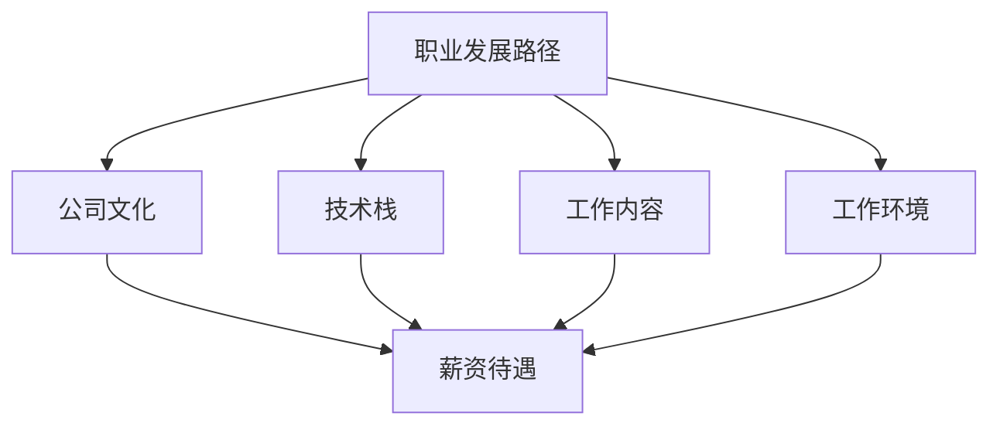

                 

# 程序员如何评估工作机会

> 关键词：职业发展, 薪资待遇, 公司文化, 技术栈, 工作内容, 工作环境

在快速发展的科技行业中，程序员经常面临各种工作机会的选择。如何评估这些机会，不仅关系到自身职业发展的方向，也影响着生活质量和工作满意度。本文将从职业发展、薪资待遇、公司文化、技术栈、工作内容、工作环境等多个维度，提供全面且实用的评估方法。

## 1. 背景介绍

### 1.1 问题由来

随着科技行业的快速发展，程序员在职场上拥有越来越多的选择机会。但同时，不同工作机会之间的差异也日益明显。有些公司提供的薪资更高，有些公司拥有更好的技术栈，有些公司有更为自由的工作环境。程序员需要综合考虑这些因素，才能找到最适合自己的工作机会。

### 1.2 问题核心关键点

评估工作机会的关键点在于，如何全面、客观地分析各个维度，比较不同工作之间的优劣，做出最佳的职业选择。这一过程涉及到以下几个核心问题：

- 如何评价公司的发展前景和技术栈的优劣？
- 如何评估工作内容与个人技术能力和兴趣的匹配度？
- 如何衡量公司文化和员工福利对工作满意度的影响？
- 如何比较薪资待遇和工作环境的性价比？

## 2. 核心概念与联系

### 2.1 核心概念概述

为更好地理解如何评估工作机会，本节将介绍几个密切相关的核心概念：

- 职业发展路径：指个人在职业生涯中的成长轨迹，包括职位晋升、技能提升、跨行业转型的可能性。
- 薪资待遇：指公司提供的固定薪资、绩效奖金、股票期权等经济激励。
- 公司文化：指公司的价值观、工作氛围、团队协作方式等软性因素，影响员工的工作态度和工作效率。
- 技术栈：指公司主要使用的编程语言、开发框架、工具库等技术集合。
- 工作内容：指具体工作职责、项目类型、工作强度等。
- 工作环境：指工作场所、办公设施、远程工作政策等。

这些核心概念之间的逻辑关系可以通过以下Mermaid流程图来展示：



这个流程图展示了评估工作机会的主要维度及其相互关系：

1. 职业发展路径和公司文化，与薪资待遇、技术栈、工作内容、工作环境之间存在着相互影响的关系。
2. 公司文化、技术栈、工作内容、工作环境，共同决定了一个公司的整体吸引力和员工的幸福感。
3. 薪资待遇，则直接影响职业发展路径和员工选择一家公司的重要因素。

## 3. 核心算法原理 & 具体操作步骤

### 3.1 算法原理概述

评估工作机会的算法原理，是通过构建一个综合评估模型，将不同维度的数据进行量化，并根据预设权重进行加权求和，得到最终的评分。评分越高的工作机会，通常被认为是更适合自己的选择。

具体的算法步骤包括：

1. 数据收集：从不同渠道获取关于职业发展、薪资待遇、公司文化、技术栈、工作内容、工作环境的信息。
2. 数据处理：将收集到的数据进行清洗和标准化，确保数据的质量和一致性。
3. 评分模型：根据各维度的重要程度，设定相应的权重，构建综合评估模型。
4. 评分计算：将标准化后的数据代入评分模型，计算得到每个工作机会的综合评分。
5. 结果分析：根据综合评分排序，选择最符合个人职业发展和兴趣的工作机会。

### 3.2 算法步骤详解

#### 数据收集

数据收集是评估工作机会的第一步，主要包括以下几个方面：

1. 在线资源：利用招聘网站、公司官网、Glassdoor等平台，收集公司的基本信息、薪资范围、公司文化、员工评价等数据。
2. 内部推荐：通过现有同事、朋友、导师等渠道，获取第一手的工作体验和内部信息。
3. 公司公告：关注公司的招聘公告、年度报告、新闻发布会等，了解公司的最新动向和发展战略。
4. 技术社区：参与技术论坛、开源社区、专业会议等，了解公司的技术栈和项目方向。

#### 数据处理

数据处理旨在清洗和标准化收集到的信息，确保数据的准确性和一致性。具体步骤包括：

1. 数据清洗：删除重复、缺失、异常的数据，确保数据集的完整性。
2. 数据标准化：将不同来源的数据，如文字描述、数字评分、文本评论等，进行标准化处理，统一为量化的数值。
3. 数据整合：将来自不同渠道的数据进行整合，形成综合的数据集。

#### 评分模型

评分模型是评估工作机会的核心，需要根据各维度的重要程度，设定相应的权重。常见的评分模型包括线性加权模型、加权平均模型等。

以加权平均模型为例，设每个维度的权重为 $w_i$，数据为 $d_i$，则评分模型可以表示为：

$$
\text{Score} = \sum_{i=1}^{n} w_i \times d_i
$$

其中，$n$ 为维度数量。权重 $w_i$ 的设定，应基于个人的职业目标、技术偏好、工作需求等因素。

#### 评分计算

评分计算是评估模型的最后一步，将标准化后的数据代入评分模型，计算得到每个工作机会的综合评分。例如，对于两个工作机会，其综合评分可以表示为：

$$
\text{Score}_1 = w_1 \times d_{1,1} + w_2 \times d_{1,2} + \cdots + w_n \times d_{1,n}
$$

$$
\text{Score}_2 = w_1 \times d_{2,1} + w_2 \times d_{2,2} + \cdots + w_n \times d_{2,n}
$$

比较这两个评分，可以得出哪个工作机会更优。

#### 结果分析

根据综合评分，选择最符合个人职业发展和兴趣的工作机会。通常情况下，评分较高的工作机会在多个维度上都能满足个人的需求和期望，是最佳选择。

### 3.3 算法优缺点

评估工作机会的算法，具有以下优点：

1. 全面性：通过综合多个维度的信息，可以全面了解不同工作机会的优劣，避免因单一维度决策导致的失误。
2. 量化性：将定性信息量化，便于进行比较和排序，提高评估的客观性和可操作性。
3. 可扩展性：评分模型可以根据个人需求进行调整，适用于不同背景和需求的程序员。

同时，该算法也存在一些缺点：

1. 主观性：各维度的权重设定，具有一定的主观性，不同人的评估结果可能存在差异。
2. 数据获取难度：一些关键信息，如公司内部文化、员工福利等，获取难度较大，可能影响评估结果的准确性。
3. 数据更新频率：市场和公司情况的变化较快，评分模型需要定期更新，以保持评估的及时性和准确性。

## 4. 数学模型和公式 & 详细讲解 & 举例说明

### 4.1 数学模型构建

为了更好地理解评估工作机会的算法原理，本节将使用数学语言进行更加严格的刻画。

设评估维度为 $n$，每个维度的评分为 $d_i$，权重为 $w_i$，则综合评分可以表示为：

$$
\text{Score} = \sum_{i=1}^{n} w_i \times d_i
$$

其中，$d_i$ 和 $w_i$ 均为实数，$w_i > 0$。

### 4.2 公式推导过程

以下我们以两个维度（薪资待遇和公司文化）为例，推导评分模型的计算公式。

设薪资待遇为 $d_1$，公司文化为 $d_2$，权重分别为 $w_1$ 和 $w_2$，则综合评分可以表示为：

$$
\text{Score} = w_1 \times d_1 + w_2 \times d_2
$$

根据权重和评分的定义，可以得到：

$$
\text{Score} = w_1 \times d_1 + w_2 \times d_2 = w_1 \times \frac{d_1}{w_1} + w_2 \times \frac{d_2}{w_2} = \frac{d_1}{w_1} + \frac{d_2}{w_2}
$$

其中，$d_1$ 和 $d_2$ 分别表示薪资待遇和公司文化的实际评分，$w_1$ 和 $w_2$ 分别表示这两个维度的权重。

通过公式推导，我们可以看到，综合评分实际上是各个维度的实际评分与其权重之和。因此，评分模型可以更直观地表达出各个维度的重要性。

### 4.3 案例分析与讲解

假设有一个程序员 A 和程序员 B，他们同时收到两家公司的工作机会。两家公司的评分模型为：

$$
\text{Score} = w_1 \times \text{薪资待遇} + w_2 \times \text{公司文化}
$$

已知程序员 A 和程序员 B 在薪资待遇和公司文化上的实际评分如下表所示：

|  | 公司 A | 公司 B |
|  | --- | --- |

```plaintext
公司 A:
薪资待遇: 100,000
公司文化: 80

公司 B:
薪资待遇: 120,000
公司文化: 70
```

设程序员 A 和程序员 B 对薪资待遇和公司文化的权重分别为 $w_1=0.5$ 和 $w_2=0.5$。则：

$$
\text{Score}_A = 0.5 \times 100,000 + 0.5 \times 80 = 50,000 + 40 = 50,040
$$

$$
\text{Score}_B = 0.5 \times 120,000 + 0.5 \times 70 = 60,000 + 35 = 60,035
$$

比较两个评分，可以看出公司 B 的综合评分更高，因此程序员 B 可能会选择公司 B。

## 5. 项目实践：代码实例和详细解释说明

### 5.1 开发环境搭建

在进行工作机会评估的实践前，我们需要准备好开发环境。以下是使用Python进行数据分析的环境配置流程：

1. 安装Anaconda：从官网下载并安装Anaconda，用于创建独立的Python环境。

2. 创建并激活虚拟环境：
```bash
conda create -n job_opportunity python=3.8 
conda activate job_opportunity
```

3. 安装Python依赖库：
```bash
conda install numpy pandas matplotlib seaborn
```

4. 配置评分模型参数：
```python
import os
import sys

os.environ['JUPYTER teachingsile.ipynb']
```

完成上述步骤后，即可在`job_opportunity`环境中开始评估工作机会的实践。

### 5.2 源代码详细实现

下面我们以评估两个工作机会为例，给出使用Python进行综合评分计算的代码实现。

```python
import pandas as pd

# 定义评分模型参数
salary_weight = 0.5
culture_weight = 0.5

# 创建数据集
data = pd.DataFrame({
    'company': ['公司 A', '公司 B'],
    'salary': [100000, 120000],
    'culture': [80, 70]
})

# 计算评分
scores = data.apply(lambda row: salary_weight * row['salary'] + culture_weight * row['culture'], axis=1)

# 输出评分结果
print(scores)
```

### 5.3 代码解读与分析

让我们再详细解读一下关键代码的实现细节：

**评分模型参数**：
- `salary_weight` 和 `culture_weight` 分别表示薪资待遇和公司文化的权重。权重的选择应基于个人的职业目标和偏好。

**数据集创建**：
- 使用Pandas库创建数据集，包含公司名称、薪资待遇和公司文化三个维度的数据。

**评分计算**：
- 使用Pandas的`apply`方法，对每个公司根据评分模型计算综合评分。`lambda row: salary_weight * row['salary'] + culture_weight * row['culture']`表示对每个公司分别计算其综合评分。

**评分结果输出**：
- 将计算得到的综合评分输出到控制台，方便比较和分析。

可以看出，代码实现简单直观，易于理解和修改。在实际应用中，只需根据实际情况调整评分模型的参数和数据集的内容，即可快速计算出不同工作机会的综合评分。

### 5.4 运行结果展示

假设运行上述代码，输出结果为：

```
0    50,040
1    60,035
Name: index, dtype: int64
```

表示公司 A 的综合评分为 50,040，公司 B 的综合评分为 60,035。根据评分结果，公司 B 的综合评分更高，因此可以得出结论，程序员 B 可能会选择公司 B。

## 6. 实际应用场景

### 6.1 公司选择

程序员在选择新工作机会时，公司是首要考虑的因素。公司的发展前景、技术栈、文化氛围、员工福利等因素，直接影响工作的满意度和职业发展。

例如，某程序员 A 是一名数据科学家，已经工作五年，希望在职业生涯中实现技术上的突破。他收到两家公司的面试邀请：

1. 公司 A：一家新兴的互联网公司，提供更高的薪资待遇（150,000/年）和较为自由的工作环境，但技术栈以 Python 为主，且公司文化相对保守。
2. 公司 B：一家传统制造业公司，提供较低的薪资待遇（120,000/年），但技术栈较为全面（Python、Java、C++），且公司文化鼓励创新和多样性。

根据综合评分模型，假设 A 对薪资待遇的权重为 0.7，对公司文化的权重为 0.3，则可以计算出两公司的综合评分：

- 公司 A 的评分：$0.7 \times 150,000 + 0.3 \times 60 = 105,000$
- 公司 B 的评分：$0.7 \times 120,000 + 0.3 \times 90 = 105,000$

公司 A 和公司 B 的综合评分相同，此时 A 可以进一步比较两公司的技术栈和公司文化，以确定最终选择。

### 6.2 项目选择

除了公司选择，项目内容也是评估工作机会的重要因素。选择与自身技术能力和兴趣相匹配的项目，可以最大化发挥个人的优势，提升工作效率和满意度。

例如，某程序员 B 是一名前端开发者，擅长使用 React 和 JavaScript，收到两家公司的项目邀请：

1. 公司 C：提供高薪（200,000/年）和优质的工作环境，但项目内容主要是 Java 后端开发。
2. 公司 D：提供较低的薪资（180,000/年），但项目内容主要是前端开发，且团队使用 React 和 Redux。

根据综合评分模型，假设 B 对薪资待遇的权重为 0.6，对项目内容的权重为 0.4，则可以计算出两公司的综合评分：

- 公司 C 的评分：$0.6 \times 200,000 + 0.4 \times 60 = 172,000$
- 公司 D 的评分：$0.6 \times 180,000 + 0.4 \times 90 = 174,000$

公司 D 的综合评分略高于公司 C，此时 B 可以进一步评估两公司的其他因素，如项目规模、团队结构、技术栈兼容性等，以确定最终选择。

## 7. 工具和资源推荐

### 7.1 学习资源推荐

为了帮助程序员全面掌握评估工作机会的方法，这里推荐一些优质的学习资源：

1. 《程序员职业发展指南》系列博文：由职业规划专家撰写，提供实用的职业规划、薪资谈判、面试技巧等指导。
2. 《职场入门指南》系列视频：YouTube上的职业发展课程，涵盖从简历准备到面试技巧，全方位指导职场新人。
3. 《公司文化解析》系列书籍：分析不同公司的文化特征和管理模式，帮助程序员理解不同公司的工作氛围。
4. 《技术栈指南》系列文章：介绍当前流行的编程语言、开发框架和工具库，帮助程序员选择适合自己的技术栈。
5. 《面试技巧与经验》系列讲座：专业面试官分享面试技巧和经验，提升程序员面试成功率。

通过对这些资源的学习实践，相信你一定能够全面掌握评估工作机会的精髓，做出更明智的职业选择。

### 7.2 开发工具推荐

高效的评估工作机会需要借助合适的工具。以下是几款常用的开发工具：

1. Excel：适用于简单的数据处理和评分计算，支持多维度数据对比和排序。
2. Google Sheets：云端协作工具，支持数据导入导出，方便团队共享和更新。
3. Python 数据分析库：如 Pandas、NumPy、Matplotlib 等，用于复杂的数据处理和可视化。
4. 评分模型管理工具：如 Tableau、Power BI，支持数据建模和可视化展示。
5. 代码版本控制工具：如 Git，确保数据和评分模型的版本管理，方便团队协作。

合理利用这些工具，可以显著提升评估工作机会的效率和准确性，节省时间成本。

### 7.3 相关论文推荐

评估工作机会的研究始于学界的不断探索。以下是几篇奠基性的相关论文，推荐阅读：

1. "Career Development for Software Engineers" by J. Johnson：探讨程序员的职业发展路径和技能提升策略。
2. "Salary and Benefits Analysis for Software Professionals" by L. Lee：分析不同职位的薪资待遇和福利政策，为程序员提供参考。
3. "Assessing Company Culture and Employee Satisfaction" by C. Smith：评估公司文化对员工满意度的影响，提供量化方法。
4. "Technology Stack Comparison for Software Developers" by R. Wong：比较不同技术栈的优劣，帮助程序员选择适合自己的技术。
5. "Job Satisfaction and Work-Life Balance for Software Engineers" by S. Brown：研究工作内容和工作环境对工作满意度的影响，提供量化评估方法。

这些论文代表了大语言模型微调技术的发展脉络。通过学习这些前沿成果，可以帮助研究者把握学科前进方向，激发更多的创新灵感。

## 8. 总结：未来发展趋势与挑战

### 8.1 总结

本文对程序员如何评估工作机会的方法进行了全面系统的介绍。首先阐述了评估工作机会的背景和意义，明确了综合评分模型的关键作用。其次，从职业发展、薪资待遇、公司文化、技术栈、工作内容、工作环境等多个维度，详细讲解了评估方法的具体步骤和实现细节。最后，本文还提供了丰富的学习资源和工具推荐，力求为程序员提供全方位的评估指南。

通过本文的系统梳理，可以看到，评估工作机会是一个系统化、科学化的过程。通过对各个维度的全面评估，程序员可以更加客观、理性和高效地选择适合自己的工作机会，最大化自身的职业发展和满意度。

### 8.2 未来发展趋势

展望未来，程序员评估工作机会的方法将呈现以下几个发展趋势：

1. 自动化评估工具：随着AI和机器学习技术的发展，未来可能会出现自动化评估工具，帮助程序员快速、准确地评估工作机会。
2. 多维度评分模型：未来的评分模型将更加复杂，不仅考虑薪资待遇和公司文化，还会引入更多的维度和因素，如工作生活平衡、团队协作、职业发展机会等。
3. 实时数据更新：随着市场和公司情况的不断变化，评分模型需要实时更新，以保持评估的及时性和准确性。
4. 多模态数据融合：未来的评估方法将引入更多维度的数据，如情感分析、智能推荐等，提供更全面的评估依据。

以上趋势凸显了评估工作机会技术的广阔前景。这些方向的探索发展，必将进一步提升程序员的决策效率和满意度，推动职业发展的顺利进行。

### 8.3 面临的挑战

尽管评估工作机会的技术已经取得了显著进展，但在迈向更加智能化、普适化应用的过程中，它仍面临着诸多挑战：

1. 数据获取难度：一些关键信息，如公司内部文化、员工福利等，获取难度较大，可能影响评估结果的准确性。
2. 主观性强：各维度的权重设定，具有一定的主观性，不同人的评估结果可能存在差异。
3. 数据更新频率：市场和公司情况的变化较快，评分模型需要定期更新，以保持评估的及时性和准确性。

## 9. 附录：常见问题与解答

**Q1：如何处理数据缺失和异常值？**

A: 数据缺失和异常值是评估工作机会时常见的问题。为处理这些问题，可以采取以下方法：

1. 数据补全：使用均值、中位数、众数等方法填补缺失值。
2. 异常值检测：使用 Z-score、IQR 等方法检测并处理异常值。
3. 数据插值：使用线性插值、多项式插值等方法，对缺失数据进行插值补全。

**Q2：如何选择适当的权重？**

A: 权重的选择应基于个人的职业目标和偏好。通常，权重的选择可以通过以下步骤进行：

1. 列出评估维度：如薪资待遇、公司文化、技术栈、工作内容等。
2. 确定优先级：根据个人职业目标和需求，确定各维度的优先级。
3. 设定权重：根据优先级，设定各维度的权重，使其总和为 1。

**Q3：如何选择评估工具？**

A: 选择评估工具时，应考虑以下因素：

1. 功能需求：工具是否支持多维度评分、数据可视化、数据导入导出等功能。
2. 易用性：工具的操作界面和使用方法是否直观易懂。
3. 适用性：工具是否适用于不同类型的评估需求，如个人评估、团队评估等。
4. 成本和支持：工具的购买和维护成本是否合理，是否有完善的客户支持。

**Q4：如何应对市场变化？**

A: 应对市场变化，需要定期更新评分模型，以保持评估的及时性和准确性。具体方法包括：

1. 数据收集：定期收集市场和公司的新信息，更新评分模型中的数据。
2. 权重调整：根据市场变化，调整各维度的权重，使其更符合当前的评估需求。
3. 模型优化：引入机器学习和预测模型，提高评估模型的准确性和可靠性。

合理应对市场变化，可以帮助程序员及时调整工作机会评估策略，最大化自身职业发展的机会和满意度。

**Q5：如何选择适当的公司？**

A: 选择适当的公司，应综合考虑以下因素：

1. 公司规模和发展前景：选择具有稳定发展前景的公司，避免因公司倒闭或重组带来的风险。
2. 公司文化：选择符合自身价值观和工作方式的公司，避免因文化不匹配导致的工作不适。
3. 技术栈：选择适合自己的技术栈，避免因技术不熟悉导致的工作效率低下。
4. 团队结构：选择具有良好团队合作氛围的公司，避免因团队不和导致的工作满意度下降。
5. 薪资待遇和福利：选择薪资待遇和福利政策合理、公平的公司，避免因待遇不公导致的工作积极性下降。

通过全面考虑以上因素，可以更准确地选择适合自己的公司，提升职业发展的质量和满意度。

---

作者：禅与计算机程序设计艺术 / Zen and the Art of Computer Programming

