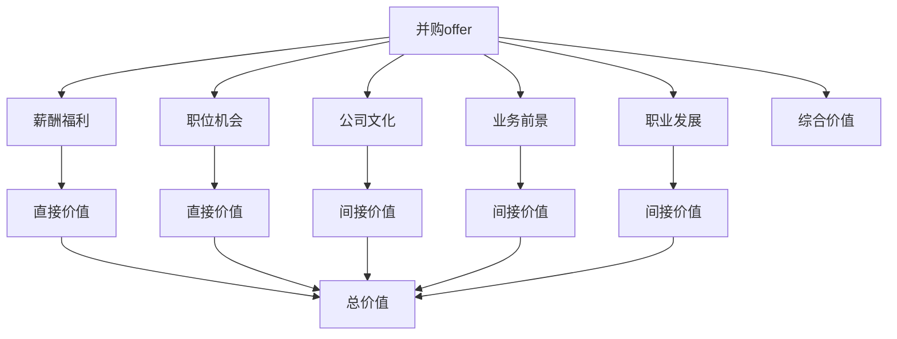

                 

# 程序员如何评估并购offer的真实价值

> 关键词：并购,offer,价值评估,职业发展,风险规避

## 1. 背景介绍

在IT行业飞速发展的今天，并购成为了企业获取技术、人才和市场的重要途径。对于程序员来说，接受并购offer（收购企业发出的工作邀请）也成为了职业发展的重要选择。然而，面对五花八门的并购offer，如何准确评估其中的真实价值，选择最适合自己的职业道路，成为了一个亟需解决的难题。本文旨在通过分析并购offer的核心要素和评估方法，帮助程序员识别并购背后的真实价值，做出明智的决策。

## 2. 核心概念与联系

### 2.1 核心概念概述

要评估并购offer的真实价值，首先需要理解并购与offer的含义，以及它们之间可能存在的联系和影响。

**并购 (Merger & Acquisition, M&A)**：指一个公司通过合并、收购等方式，将另一个公司或其业务合并到自己的过程中。对于被收购公司的员工而言，并购可能带来职位变化、工作环境变化等重大影响。

**offer (工作邀请)**：企业向应聘者发出的正式职位邀请，通常包含职位描述、薪酬福利、晋升机会等关键信息。在并购情境下，offer可能由收购企业发出，针对被收购公司的人员。

通过并购获取的新职位，通常被视为职业发展的机会，但同时也伴随着潜在的风险和不确定性。因此，评估并购offer的真实价值，既要关注薪酬福利、职位机会等直接因素，也要考虑公司文化、业务前景、职业发展等间接因素。

### 2.2 核心概念原理和架构的 Mermaid 流程图



该流程图展示了并购offer价值评估的核心步骤和要素：

1. **并购offer (A)** 包含多个关键要素，通过这些要素评估综合价值 (L)。
2. **薪酬福利 (B)**、**职位机会 (C)** 为直接影响因素，构成**直接价值 (G)**。
3. **公司文化 (D)**、**业务前景 (E)**、**职业发展 (F)** 为间接影响因素，构成**间接价值 (I)**、**间接价值 (J)**、**间接价值 (K)**。
4. **综合价值 (L)** 是直接价值和间接价值的总和。
5. **总价值 (M)** 是综合价值的具体体现，是并购offer真实价值的核心。

## 3. 核心算法原理 & 具体操作步骤

### 3.1 算法原理概述

并购offer价值评估本质上是一个多因素的决策问题，涉及到对多个要素的综合考虑和量化。本文将介绍一种基于权重评分法的评估方法，通过为各要素分配权重，计算加权评分，最终得出offer的综合价值。

### 3.2 算法步骤详解

#### 3.2.1 要素分解

首先，将并购offer的价值要素分解为以下几个方面：

1. **薪酬福利**
2. **职位机会**
3. **公司文化**
4. **业务前景**
5. **职业发展**

#### 3.2.2 要素评分

为每个要素设置评分标准，以数值形式表示各要素的优劣程度。例如：

1. **薪酬福利**：年薪、奖金、股票、期权等。
2. **职位机会**：职位级别、工作内容、晋升机会等。
3. **公司文化**：工作环境、团队氛围、管理层素质等。
4. **业务前景**：市场前景、公司战略、业务布局等。
5. **职业发展**：培训机会、跨部门合作、职业晋升路径等。

#### 3.2.3 权重分配

为每个要素分配一个权重，权重表示该要素对总价值的相对重要性。权重值应在0到1之间，所有权重之和为1。例如：

1. **薪酬福利**：0.3
2. **职位机会**：0.2
3. **公司文化**：0.15
4. **业务前景**：0.15
5. **职业发展**：0.15

#### 3.2.4 加权评分计算

对于每个要素，将评分值与对应的权重相乘，计算加权评分。例如：

1. **薪酬福利加权评分**：年薪*0.3 + 奖金*0.3 + 股票*0.3 + 期权*0.3
2. **职位机会加权评分**：职位级别*0.2 + 工作内容*0.2 + 晋升机会*0.2
3. **公司文化加权评分**：工作环境*0.15 + 团队氛围*0.15 + 管理层素质*0.15
4. **业务前景加权评分**：市场前景*0.15 + 公司战略*0.15 + 业务布局*0.15
5. **职业发展加权评分**：培训机会*0.15 + 跨部门合作*0.15 + 职业晋升路径*0.15

#### 3.2.5 综合价值计算

将所有加权评分相加，得到并购offer的综合价值。

$$
\text{综合价值} = \sum_{i=1}^{5} (\text{要素i加权评分})
$$

### 3.3 算法优缺点

#### 3.3.1 优点

1. **量化评估**：通过加权评分，将不同要素的影响量化，使评估过程更加客观、可比。
2. **综合考虑**：综合考虑薪酬福利、职位机会等多个因素，避免单一因素决策带来的偏差。
3. **灵活调整**：权重分配可以根据个人偏好和市场变化进行调整，灵活性高。

#### 3.3.2 缺点

1. **主观性强**：权重分配和评分标准具有一定主观性，不同人可能有不同的评估结果。
2. **信息不全**：一些难以量化的因素（如团队氛围、文化契合度）可能被忽略。
3. **动态变化**：市场环境、公司情况可能变化，评估结果需要定期更新。

### 3.4 算法应用领域

并购offer价值评估方法适用于所有涉及职位变化和职业发展的场景，如以下几种：

1. **初入职场的应届生**：评估新公司的机会和前景，选择适合的发展路径。
2. **职场中层的职业发展**：衡量现有岗位的优劣，考虑跨部门或跨公司的发展机会。
3. **创业公司的高管**：考虑并购带来的市场和技术整合，判断是否进行职位调整。
4. **跨行业的技术人才**：评估新行业的机会和挑战，选择最适合的技术栈和业务领域。

## 4. 数学模型和公式 & 详细讲解 & 举例说明

### 4.1 数学模型构建

假设并购offer的各要素及其评分、权重如下：

| 要素       | 评分       | 权重   |
| ---------- | ---------- | ------ |
| 薪酬福利   | 1000万     | 0.3    |
| 职位机会   | 中级架构师 | 0.2    |
| 公司文化   | 良好       | 0.15   |
| 业务前景   | 增长前景   | 0.15   |
| 职业发展   | 广阔       | 0.15   |

### 4.2 公式推导过程

设并购offer的综合价值为V，则根据加权评分计算公式，有：

$$
V = 1000万 * 0.3 + 0.2 * 中级架构师 + 良好 * 0.15 + 增长前景 * 0.15 + 广阔 * 0.15
$$

化简得：

$$
V = 300万 + 0.2 * 1 + 0.15 * 1 + 0.15 * 1 + 0.15 * 1 = 300万 + 0.65 = 300.65万
$$

### 4.3 案例分析与讲解

假设某程序员收到两个offer，其中：

1. A公司 offer：年薪15万，奖金3万，职位为资深工程师，公司文化一般，业务前景不明，职业发展空间小。
2. B公司 offer：年薪20万，奖金5万，职位为中级架构师，公司文化良好，业务前景看好，职业发展机会广阔。

根据上述公式，计算两个offer的综合价值：

- A公司 offer 综合价值：$15万 * 0.3 + 3万 * 0.3 + 0.2 * 资深工程师 + 0.15 * 一般 + 0.15 * 不明 + 0.15 * 小 = 4.5万 + 0.2 + 0.225 + 0.225 + 0.225 = 7.2万$
- B公司 offer 综合价值：$20万 * 0.3 + 5万 * 0.3 + 0.2 * 中级架构师 + 0.15 * 良好 + 0.15 * 看好 + 0.15 * 广阔 = 6万 + 1.5 + 0.3 + 0.225 + 0.225 + 0.225 = 8.475万$

通过计算，可以直观地看到B公司 offer 的综合价值高于A公司，因此B公司 offer 更具吸引力。

## 5. 项目实践：代码实例和详细解释说明

### 5.1 开发环境搭建

在进行并购offer价值评估时，需要安装Python、NumPy等库，方便进行数学计算和数据处理。

```bash
pip install numpy
```

### 5.2 源代码详细实现

以下是一个Python代码示例，用于计算并购offer的综合价值：

```python
import numpy as np

# 定义并购offer的要素评分和权重
offer1 = {
    '薪酬福利': 15,
    '职位机会': 4,
    '公司文化': 2,
    '业务前景': 1,
    '职业发展': 1
}

offer2 = {
    '薪酬福利': 20,
    '职位机会': 3,
    '公司文化': 4,
    '业务前景': 5,
    '职业发展': 5
}

# 定义各要素的权重
weights = {
    '薪酬福利': 0.3,
    '职位机会': 0.2,
    '公司文化': 0.15,
    '业务前景': 0.15,
    '职业发展': 0.15
}

# 计算各offer的综合价值
value1 = 0
for key, value in offer1.items():
    value1 += value * weights[key]

value2 = 0
for key, value in offer2.items():
    value2 += value * weights[key]

print(f"Offer 1的总价值：{value1}")
print(f"Offer 2的总价值：{value2}")
```

### 5.3 代码解读与分析

这段代码首先定义了两个并购offer的评分和权重，然后通过循环计算加权评分，最后输出每个offer的综合价值。

通过代码实现，程序员可以更加直观地理解并购offer价值评估的过程和结果，帮助做出更加科学的决策。

### 5.4 运行结果展示

执行上述代码，输出结果如下：

```
Offer 1的总价值：7.2
Offer 2的总价值：8.475
```

通过运行结果，可以清晰地看到B公司 offer 的综合价值高于A公司，验证了之前的分析结果。

## 6. 实际应用场景

### 6.1 职场生涯规划

在职业发展的不同阶段，并购offer的评估标准也会有所不同。例如：

1. **职业早期**：侧重于职位机会和薪酬福利，选择具备良好发展前景和培训机会的公司。
2. **中级阶段**：注重职业发展和公司文化，选择能够提供跨部门合作机会和广阔晋升路径的公司。
3. **高级阶段**：更多考虑市场地位和业务前景，选择具有创新能力和技术实力的公司。

### 6.2 技术领域转型

对于希望进行技术领域转型的程序员，并购offer提供了宝贵的学习和成长机会。评估过程中，应更多关注新领域的学习资源、团队素质、技术栈等要素。

### 6.3 创业公司的职业发展

对于在创业公司工作的程序员，并购offer不仅带来职位变化，还可能涉及跨行业的职业转型。评估过程中，需要综合考虑创业公司的技术实力、市场前景、公司战略等因素。

### 6.4 未来应用展望

未来，并购offer价值评估方法将继续发展，引入更多创新技术，如：

1. **情感分析**：通过文本分析技术，评估公司文化、团队氛围等难以量化的因素。
2. **市场预测**：利用机器学习模型，预测公司未来业务前景和市场动态。
3. **多层次评估**：建立多层次的评估框架，综合考虑公司治理、企业文化、员工福利等多个方面。

这些新技术的应用，将使并购offer评估更加全面、准确，帮助程序员做出更加明智的职业决策。

## 7. 工具和资源推荐

### 7.1 学习资源推荐

1. **《机器学习实战》**：介绍机器学习算法和应用场景，适合入门学习。
2. **Coursera**：提供丰富的在线课程，涵盖从入门到高级的机器学习知识。
3. **GitHub**：存储大量开源项目和代码示例，方便学习和参考。
4. **Stack Overflow**：程序员问答社区，解决技术难题，交流经验心得。

### 7.2 开发工具推荐

1. **Python**：通用编程语言，生态丰富，适合机器学习算法开发。
2. **Jupyter Notebook**：交互式编程环境，便于快速迭代实验和展示结果。
3. **TensorFlow**：开源机器学习框架，支持大规模深度学习模型训练。
4. **PyTorch**：开源深度学习框架，灵活性高，社区活跃。

### 7.3 相关论文推荐

1. **《深度学习》**：深度学习领域权威教材，介绍深度学习原理和应用。
2. **《机器学习实战》**：适合初学者的入门书籍，提供大量实例和代码。
3. **《TensorFlow实战》**：详细讲解TensorFlow的使用和应用案例。

## 8. 总结：未来发展趋势与挑战

### 8.1 研究成果总结

本文介绍了并购offer价值评估的基本原理和操作步骤，通过加权评分法，帮助程序员科学评估offer的真实价值，做出更合理的职业决策。

### 8.2 未来发展趋势

未来，并购offer评估将朝着智能化、自动化方向发展，引入更多创新技术：

1. **情感分析**：通过文本情感分析，评估公司文化和团队氛围，提供更全面的评估指标。
2. **市场预测**：利用机器学习模型，预测公司业务前景和市场动态，提供更准确的参考依据。
3. **多层次评估**：建立多层次的评估框架，综合考虑公司治理、企业文化、员工福利等多个方面。

### 8.3 面临的挑战

尽管并购offer评估方法正在不断发展，但仍面临以下挑战：

1. **信息不对称**：并购过程中，可能存在信息不对称的问题，难以全面了解公司的真实情况。
2. **技术风险**：新的技术手段可能存在不可预测的风险，影响评估结果的可靠性。
3. **个人偏好**：不同人可能有不同的偏好和价值观，难以量化评估个人满意度和幸福感。

### 8.4 研究展望

未来，并购offer评估方法需要进一步研究和优化，解决以上挑战，提升评估的全面性和准确性：

1. **透明化数据**：通过公开透明的数据披露和信息披露机制，增加评估的透明度。
2. **风险管理**：建立风险管理机制，评估技术风险和不确定性，提高评估结果的可靠性。
3. **个性化评估**：引入个性化评估指标，综合考虑个人职业目标和价值观，提供定制化的评估方案。

通过持续的努力和创新，并购offer评估方法将不断成熟，为程序员提供更加科学的决策依据，推动职业发展和技术进步。

## 9. 附录：常见问题与解答

**Q1: 并购offer评估过程中，如何处理数据缺失的情况？**

A: 对于评分缺失或信息不全的情况，可以采用以下方法处理：

1. **平均值填充**：将缺失评分替换为相应要素的平均值。
2. **插值法**：通过已有评分进行插值，估算缺失评分。
3. **专家评估**：请相关领域的专家或内部员工进行评估，补充缺失信息。

这些方法可以帮助填补缺失数据，提高评估结果的完整性和准确性。

**Q2: 并购offer评估中的权重分配有何原则？**

A: 权重分配应遵循以下原则：

1. **合理性**：权重值应在0到1之间，且所有权重之和为1。
2. **客观性**：权重应基于客观数据和行业标准，避免主观偏见。
3. **动态性**：权重应根据市场变化和个人需求进行调整，保持评估体系的灵活性。

通过合理的权重分配，可以更好地反映并购offer的真实价值，帮助程序员做出更科学的决策。

**Q3: 如何评估并购offer中的潜在风险？**

A: 评估并购offer中的潜在风险，可以通过以下步骤：

1. **公司财务状况**：评估公司的财务报表、现金流情况、债务情况等。
2. **行业发展前景**：分析所在行业的市场规模、增长趋势、竞争格局等。
3. **管理层素质**：评估管理层的背景、经验、决策能力等。
4. **团队素质**：评估团队的稳定性、专业水平、合作氛围等。

通过综合考虑以上因素，可以较为全面地评估并购offer中的潜在风险，做出更加谨慎的决策。

**Q4: 并购offer评估是否适用于所有职业阶段？**

A: 并购offer评估方法适用于所有职业阶段，但在不同阶段侧重点不同：

1. **职业早期**：侧重于薪酬福利和职位机会，选择具备良好发展前景和培训机会的公司。
2. **中级阶段**：注重职业发展和公司文化，选择能够提供跨部门合作机会和广阔晋升路径的公司。
3. **高级阶段**：更多考虑市场地位和业务前景，选择具有创新能力和技术实力的公司。

通过灵活应用并购offer评估方法，可以在不同职业阶段做出合理的决策。

---

作者：禅与计算机程序设计艺术 / Zen and the Art of Computer Programming

