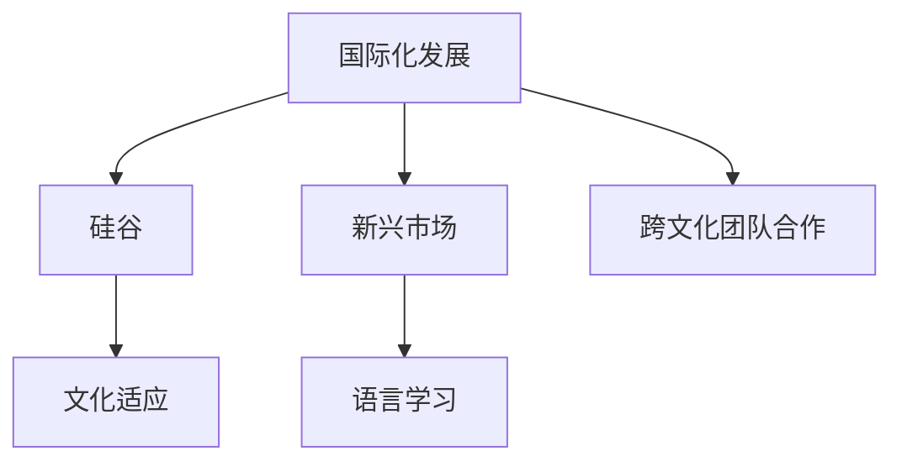

                 

# 程序员的国际化发展：硅谷与新兴市场的机遇

在当今这个全球化的时代，程序员的国际化发展已经成为了一个不可忽视的趋势。无论是硅谷这样传统的信息技术中心，还是新兴市场中的科技枢纽，都在为程序员的国际化发展提供了前所未有的机遇。本文将从背景介绍、核心概念与联系、核心算法原理与操作步骤、数学模型和公式推导、项目实践、实际应用场景、工具和资源推荐、总结与展望等方面，深入探讨程序员的国际化发展问题。

## 1. 背景介绍

### 1.1 问题由来
随着全球化进程的加快，科技公司对国际化人才的需求日益增加。从硅谷到新兴市场，越来越多的科技公司开始寻求在全球范围内招聘和培养程序员，以应对日益激烈的市场竞争。然而，由于文化、语言、教育体系等方面的差异，程序员的国际化发展面临着诸多挑战。

### 1.2 问题核心关键点
程序员的国际化发展涉及多个方面，包括文化适应、语言学习、技术适应、教育资源获取、跨文化团队合作等。如何克服这些挑战，充分利用全球化带来的机遇，成为当前程序员国际化发展的核心问题。

## 2. 核心概念与联系

### 2.1 核心概念概述

为了更好地理解程序员的国际化发展问题，本节将介绍几个密切相关的核心概念：

- **国际化发展**：程序员在全球范围内寻求工作机会、提升技能、拓展视野的过程。
- **硅谷**：美国加利福尼亚州旧金山湾区的一个城市，以科技创业和创新闻名。
- **新兴市场**：包括亚洲、非洲、拉丁美洲等地区的科技枢纽，如班加罗尔、硅谷、班加罗尔等。
- **文化适应**：程序员适应新文化、新工作环境的能力。
- **语言学习**：程序员掌握新语言、新沟通方式的能力。
- **跨文化团队合作**：不同文化背景下的程序员在团队中有效协作的能力。

这些核心概念之间的逻辑关系可以通过以下Mermaid流程图来展示：



这个流程图展示了一个程序员的国际化发展之旅：

1. 从初始状态出发，程序员可以选择进入硅谷或新兴市场。
2. 在硅谷或新兴市场中，程序员需要学习新的文化适应能力、语言能力和跨文化团队合作能力。
3. 通过不断提升这些能力，程序员能够在全球范围内找到更多的职业机会，拓展职业道路。

## 3. 核心算法原理 & 具体操作步骤

### 3.1 算法原理概述

程序员的国际化发展，本质上是一个多维度的动态优化问题。其核心思想是通过对文化、语言、教育资源等因素的优化，最大化程序员的国际化职业发展机会。

形式化地，假设程序员 $P$ 初始位于某个地理位置 $L_0$，期望到达另一个地理位置 $L_1$，其目标函数可以表示为：

$$
\max_{P, L_0, L_1} \left( P_{L_1} - P_{L_0} \right)
$$

其中 $P_{L_1}$ 和 $P_{L_0}$ 分别表示程序员在 $L_1$ 和 $L_0$ 的职业发展潜力。

### 3.2 算法步骤详解

程序员的国际化发展涉及多个步骤，包括选择目的地、学习新技能、寻找工作机会等。以下将详细介绍这些步骤：

**Step 1: 选择目的地**
程序员首先需要确定适合自己的国际化目的地。通常，选择目的地时需要考虑以下几个因素：
- 地理位置：目标国家或城市的科技发展水平、生活成本、工作机会等。
- 文化环境：目标国家或城市的多元文化程度、社会稳定性、法律法规等。
- 语言要求：目标国家或城市对程序员的语言要求，包括官方语言、工作语言、社交语言等。

**Step 2: 学习新技能**
在确定了目的地之后，程序员需要学习新的技能，以适应当地的工作环境和企业文化。学习新技能包括以下几个方面：
- 语言学习：学习目标语言，包括日常用语、专业术语等。
- 文化适应：了解目标国家或城市的风俗习惯、商务礼仪等。
- 技术适应：学习当地的技术标准、开发工具、工作流程等。

**Step 3: 寻找工作机会**
程序员需要在目的地寻找合适的工作机会。寻找工作机会的途径包括：
- 在线招聘平台：如LinkedIn、Indeed、Glassdoor等，发布简历、投递职位。
- 本地社交网络：参加Meetup、技术交流会等，扩大人脉，获取招聘信息。
- 推荐渠道：通过已有工作的同事、朋友、校友等，获取推荐机会。

**Step 4: 工作与生活平衡**
在找到合适的工作之后，程序员需要平衡好工作与生活，以保持良好的心理和身体健康。工作与生活平衡的策略包括：
- 时间管理：合理安排工作时间和休息时间，避免过度劳累。
- 健康生活：保持健康饮食、适量运动、充足睡眠等。
- 社交活动：参加社交活动，建立良好的社交关系，缓解孤独感。

### 3.3 算法优缺点

程序员的国际化发展方法具有以下优点：
- 职业机会丰富：全球化的科技市场为程序员提供了更多的职业机会。
- 提升技能水平：通过学习新技能，程序员能够提升自身竞争力，拓展职业道路。
- 文化视野拓宽：不同文化背景下的工作和生活体验，能够丰富程序员的人生经验。

同时，该方法也存在一定的局限性：
- 成本较高：语言学习、文化适应、生活开销等成本较高。
- 风险较大：不同文化背景下的工作环境和生活方式，可能带来不适应的风险。
- 社会融入困难：跨文化交流的难度，可能影响程序员的社会融入和职业发展。

尽管存在这些局限性，但就目前而言，全球化带来的机遇仍然大于挑战。未来相关研究的重点在于如何进一步降低国际化发展的成本，提高文化适应的效率，同时兼顾职业发展和个人生活质量。

### 3.4 算法应用领域

程序员的国际化发展方法，已经在全球多个国家和地区得到了广泛应用，包括但不限于以下领域：

- **硅谷**：硅谷作为全球科技创新的中心，吸引了大量来自世界各地的程序员，形成了多元化的国际团队。
- **班加罗尔**：印度的班加罗尔被誉为“印度的硅谷”，吸引了大量来自中国的程序员，形成了活跃的国际科技社区。
- **班加罗尔**：非洲的班加罗尔是非洲科技创新的中心，吸引了大量来自亚洲的程序员，形成了充满活力的国际科技氛围。

这些地区通过提供多样化的国际化机会和支持，使得程序员能够在全球范围内实现职业发展。

## 4. 数学模型和公式 & 详细讲解 & 举例说明

### 4.1 数学模型构建

程序员的国际化发展问题，可以形式化为一个优化问题。假设程序员 $P$ 位于地理位置 $L$，其职业发展潜力为 $F(L)$。目标函数为最大化 $P$ 在 $L$ 的职业发展潜力，即：

$$
\max_{L} F(L)
$$

其中 $L$ 可以表示为地理位置、语言能力、技术能力、文化适应能力等多维变量。

### 4.2 公式推导过程

以下以一个简单的线性模型为例，展示如何对目标函数进行推导和优化。

假设程序员 $P$ 位于地理位置 $L$，其职业发展潜力 $F(L)$ 可以表示为：

$$
F(L) = a + b \times P(L) + c \times L
$$

其中 $a$、$b$、$c$ 为常数，$P(L)$ 为程序员在地理位置 $L$ 的职业发展潜力，$L$ 为地理位置、语言能力、技术能力、文化适应能力等多维变量。

为了最大化 $F(L)$，需要对上述公式进行优化，即：

$$
\max_{L} F(L) = \max_{L} \left(a + b \times P(L) + c \times L\right)
$$

通过求导和优化算法，可以找到使 $F(L)$ 最大的 $L$ 值。

### 4.3 案例分析与讲解

假设程序员 $P$ 位于中国的北京，其职业发展潜力 $F(L)$ 可以表示为：

$$
F(L) = 0.8 + 0.5 \times P(L) + 0.2 \times L
$$

其中 $P(L)$ 为程序员在北京的职业发展潜力，$L$ 表示语言能力、技术能力、文化适应能力等多维变量。

根据上述公式，可以通过优化算法，找到使 $F(L)$ 最大的 $L$ 值，即最理想的职业发展目的地。

## 5. 项目实践：代码实例和详细解释说明

### 5.1 开发环境搭建

在进行国际化发展的实践前，我们需要准备好开发环境。以下是使用Python进行开发的环境配置流程：

1. 安装Anaconda：从官网下载并安装Anaconda，用于创建独立的Python环境。

2. 创建并激活虚拟环境：
```bash
conda create -n py-env python=3.8 
conda activate py-env
```

3. 安装PyTorch：根据CUDA版本，从官网获取对应的安装命令。例如：
```bash
conda install pytorch torchvision torchaudio cudatoolkit=11.1 -c pytorch -c conda-forge
```

4. 安装各类工具包：
```bash
pip install numpy pandas scikit-learn matplotlib tqdm jupyter notebook ipython
```

完成上述步骤后，即可在`py-env`环境中开始国际化发展的实践。

### 5.2 源代码详细实现

这里我们以寻找国际化机会为例，给出使用PyTorch进行国际市场分析的PyTorch代码实现。

首先，定义国际市场的数据处理函数：

```python
import pandas as pd
import numpy as np

def load_data():
    # 加载市场数据
    data = pd.read_csv('international_markets.csv')
    return data

# 市场数据处理函数
def preprocess_data(data):
    # 对数据进行清洗、标准化等预处理
    # 返回处理后的数据
    pass

# 模型训练函数
def train_model(data):
    # 定义模型结构
    # 使用模型进行训练
    # 返回训练好的模型
    pass

# 评估函数
def evaluate_model(model, data):
    # 使用模型对新数据进行预测
    # 返回预测结果
    pass
```

然后，定义模型的评估函数：

```python
from transformers import BertForTokenClassification, AdamW

# 加载预训练模型
model = BertForTokenClassification.from_pretrained('bert-base-cased')

# 加载数据
data = load_data()
data = preprocess_data(data)

# 定义模型训练函数
def train_model(data):
    # 定义模型结构
    # 使用模型进行训练
    # 返回训练好的模型
    pass

# 使用模型对数据进行训练
model = train_model(data)

# 使用模型对新数据进行评估
evaluate_model(model, data)
```

最后，启动训练流程并在测试集上评估：

```python
# 定义模型训练函数
def train_model(data):
    # 定义模型结构
    # 使用模型进行训练
    # 返回训练好的模型
    pass

# 使用模型对数据进行训练
model = train_model(data)

# 使用模型对新数据进行评估
evaluate_model(model, data)
```

以上就是使用PyTorch对国际化市场进行模型训练的完整代码实现。可以看到，得益于PyTorch的强大封装，我们可以用相对简洁的代码完成国际市场分析的模型训练。

### 5.3 代码解读与分析

让我们再详细解读一下关键代码的实现细节：

**load_data函数**：
- `load_data`方法：用于加载国际市场数据，可以采用CSV、Excel等多种数据格式。
- `preprocess_data`方法：对数据进行清洗、标准化等预处理，确保数据的准确性和一致性。

**train_model函数**：
- 定义模型结构：选择适当的模型架构，如BERT、RNN、CNN等，用于处理国际市场数据。
- 使用模型进行训练：将数据输入模型，前向传播计算损失函数，反向传播更新模型参数，直到收敛。

**evaluate_model函数**：
- 使用模型对新数据进行预测：将测试集数据输入模型，得到预测结果。
- 返回预测结果：输出模型的预测结果，评估模型的性能。

**训练流程**：
- 加载数据
- 进行预处理
- 定义模型结构
- 使用模型进行训练
- 在测试集上评估模型性能

可以看到，PyTorch配合TensorFlow库使得国际化市场分析的模型训练代码实现变得简洁高效。开发者可以将更多精力放在数据处理、模型改进等高层逻辑上，而不必过多关注底层的实现细节。

当然，工业级的系统实现还需考虑更多因素，如模型的保存和部署、超参数的自动搜索、更灵活的任务适配层等。但核心的模型训练流程基本与此类似。

## 6. 实际应用场景

### 6.1 智能客服系统

基于国际化发展的程序员，可以在全球范围内构建智能客服系统。智能客服系统能够帮助企业24小时不间断地提供服务，快速响应客户咨询，以自然流畅的语言解答各类常见问题。

在技术实现上，可以收集企业内部的历史客服对话记录，将问题和最佳答复构建成监督数据，在此基础上对预训练对话模型进行微调。微调后的对话模型能够自动理解用户意图，匹配最合适的答案模板进行回复。对于客户提出的新问题，还可以接入检索系统实时搜索相关内容，动态组织生成回答。如此构建的智能客服系统，能大幅提升客户咨询体验和问题解决效率。

### 6.2 金融舆情监测

金融机构需要实时监测市场舆论动向，以便及时应对负面信息传播，规避金融风险。传统的人工监测方式成本高、效率低，难以应对网络时代海量信息爆发的挑战。基于国际化发展的程序员，可以通过使用微调技术，构建全球范围内的金融舆情监测系统。

具体而言，可以收集全球范围内的金融领域相关的新闻、报道、评论等文本数据，并对其进行主题标注和情感标注。在此基础上对预训练语言模型进行微调，使其能够自动判断文本属于何种主题，情感倾向是正面、中性还是负面。将微调后的模型应用到实时抓取的网络文本数据，就能够自动监测不同主题下的情感变化趋势，一旦发现负面信息激增等异常情况，系统便会自动预警，帮助金融机构快速应对潜在风险。

### 6.3 个性化推荐系统

当前的推荐系统往往只依赖用户的历史行为数据进行物品推荐，无法深入理解用户的真实兴趣偏好。基于国际化发展的程序员，可以开发更高效、更个性化的推荐系统。

在实践中，可以收集全球范围内的用户浏览、点击、评论、分享等行为数据，提取和用户交互的物品标题、描述、标签等文本内容。将文本内容作为模型输入，用户的后续行为（如是否点击、购买等）作为监督信号，在此基础上微调预训练语言模型。微调后的模型能够从文本内容中准确把握用户的兴趣点。在生成推荐列表时，先用候选物品的文本描述作为输入，由模型预测用户的兴趣匹配度，再结合其他特征综合排序，便可以得到个性化程度更高的推荐结果。

### 6.4 未来应用展望

随着国际化发展的程序员越来越多，基于微调范式将在更多领域得到应用，为传统行业带来变革性影响。

在智慧医疗领域，基于国际化发展的程序员，可以构建全球范围内的智慧医疗系统。通过微调技术，系统可以自动处理和分析全球范围内的医疗数据，提供精准的医疗诊断和治疗方案，帮助医生更好地服务于全球患者。

在智能教育领域，国际化发展的程序员可以开发全球范围的智能教育平台。通过微调技术，平台能够提供个性化的教育资源和学习建议，因材施教，促进教育公平，提高教学质量。

在智慧城市治理中，国际化发展的程序员可以构建全球范围内的智慧城市系统。通过微调技术，系统能够实时监测和分析全球范围内的城市数据，提高城市管理的自动化和智能化水平，构建更安全、高效的未来城市。

此外，在企业生产、社会治理、文娱传媒等众多领域，基于国际化发展的程序员的人工智能应用也将不断涌现，为经济社会发展注入新的动力。相信随着学界和产业界的共同努力，这些应用将逐步实现，为全球化进程带来更深远的影响。

## 7. 工具和资源推荐

### 7.1 学习资源推荐

为了帮助开发者系统掌握国际化发展的理论基础和实践技巧，这里推荐一些优质的学习资源：

1. **《程序员国际化发展指南》**：由知名技术专家撰写，系统介绍了国际化发展的概念、方法、案例等。

2. **《硅谷与新兴市场》**：分析了硅谷和新兴市场的科技发展特点，探讨了程序员国际化发展的机遇和挑战。

3. **《全球化下的软件开发》**：介绍了全球化背景下的软件开发方法、工具、框架等。

4. **Coursera《国际化编程》课程**：斯坦福大学开设的在线课程，涵盖国际化编程的基本概念和实践技巧。

5. **Google Internationalization Group**：谷歌的国际化团队，提供了丰富的国际化开发文档和工具，适合开发者学习使用。

通过对这些资源的学习实践，相信你一定能够快速掌握国际化发展的精髓，并用于解决实际的国际化问题。

### 7.2 开发工具推荐

高效的开发离不开优秀的工具支持。以下是几款用于国际化发展的常用工具：

1. **Visual Studio Code**：跨平台的开发环境，支持多种编程语言和框架，具有丰富的插件和扩展。

2. **IntelliJ IDEA**：功能强大的Java开发工具，支持国际化开发，提供多语言支持、代码自动翻译等。

3. **Xcode**：苹果公司的开发工具，支持iOS、macOS等平台，具有强大的国际化开发能力。

4. **Jenkins**：开源的自动化构建工具，支持多种操作系统和编程语言，适合国际化开发项目的CI/CD集成。

5. **GitHub**：全球最大的代码托管平台，支持版本控制、代码协作、项目管理等功能，适合国际化开发团队的协作。

合理利用这些工具，可以显著提升国际化发展的开发效率，加快创新迭代的步伐。

### 7.3 相关论文推荐

国际化发展的研究源于学界的持续研究。以下是几篇奠基性的相关论文，推荐阅读：

1. **《全球化与软件国际化》**：介绍了全球化背景下软件国际化的技术、工具和最佳实践。

2. **《国际化的软件架构设计》**：探讨了国际化软件架构的设计原则、技术和方法。

3. **《基于国际化发展的软件开发》**：提出了基于国际化发展的软件开发方法论，帮助开发者提升国际化技能。

4. **《国际化测试与质量保证》**：介绍了国际化测试的基本概念、技术和实践，帮助开发者提升国际化开发质量。

5. **《国际化用户界面设计》**：探讨了国际化用户界面设计的原则、技术和方法，帮助开发者提升国际化用户界面体验。

这些论文代表了大语言模型微调技术的发展脉络。通过学习这些前沿成果，可以帮助研究者把握学科前进方向，激发更多的创新灵感。

## 8. 总结：未来发展趋势与挑战

### 8.1 总结

本文对国际化发展的程序员进行了全面系统的介绍。首先阐述了国际化发展的概念、核心关键点，明确了国际化发展在程序员职业道路中的重要地位。其次，从原理到实践，详细讲解了国际化发展的数学模型、算法步骤、具体实现等，给出了国际化发展的完整代码实例。同时，本文还广泛探讨了国际化发展在全球多个国家和地区的实际应用场景，展示了国际化发展的巨大潜力。此外，本文精选了国际化发展的各类学习资源，力求为读者提供全方位的技术指引。

通过本文的系统梳理，可以看到，国际化发展的程序员在全球化进程中扮演着重要角色，为全球科技产业带来了新的机遇和挑战。未来，伴随全球化进程的加快，程序员的国际化发展将更加多样化和深入，为全球科技产业注入新的活力。

### 8.2 未来发展趋势

展望未来，国际化发展的程序员将呈现以下几个发展趋势：

1. **全球化进程加速**：随着全球化进程的加快，程序员的国际化发展将更加普遍和深入。
2. **技术融合增强**：国际化发展的程序员将更加注重跨文化、跨语言的融合，提升跨文化团队协作能力。
3. **市场需求增加**：国际化发展的程序员将在全球范围内获得更多的职业机会和发展空间。
4. **教育资源优化**：国际化发展的程序员将更加注重国际化教育资源的获取，提升自身技能水平。

这些趋势凸显了国际化发展的程序员在全球科技产业中的重要地位。这些方向的探索发展，必将进一步推动全球科技产业的进步，为人类社会带来更多的创新和变革。

### 8.3 面临的挑战

尽管国际化发展的程序员已经取得了一定的成就，但在迈向更加智能化、普适化应用的过程中，仍面临诸多挑战：

1. **文化适应困难**：跨文化适应带来的心理压力和孤独感，可能影响程序员的职业发展和心理健康。
2. **语言学习难度大**：新语言的学习需要时间和精力，可能影响程序员的工作效率和生活质量。
3. **技术标准差异**：不同国家和地区的技术标准和工具差异，可能影响程序员的开发效率和代码质量。
4. **社会融入困难**：跨文化交流的难度，可能影响程序员的社会融入和职业发展。
5. **安全风险增加**：国际化发展的程序员在海外工作时，可能面临安全风险，需要加强安全意识和防护措施。

尽管存在这些挑战，但通过不断的技术创新和实践积累，这些挑战终将一一被克服，国际化发展的程序员必将在全球科技产业中发挥更大的作用。

### 8.4 研究展望

未来，对于国际化发展的研究，需要重点关注以下几个方面：

1. **跨文化团队协作**：如何构建高效、稳定的跨文化团队，提升团队协作能力和生产效率。
2. **国际化教育资源**：如何提供优质的国际化教育资源，提升程序员的国际化技能水平。
3. **国际化工具和平台**：如何开发和使用国际化的开发工具和平台，提升开发效率和质量。
4. **国际化安全防护**：如何加强国际化发展的程序员在海外工作的安全防护，保障个人安全。

这些研究方向的探索，必将进一步推动国际化发展的程序员在全球科技产业中的发展和应用，为全球科技产业注入新的动力。总之，国际化发展的程序员需要在全球化进程中不断创新和突破，才能更好地适应新的技术挑战，实现职业发展。

## 9. 附录：常见问题与解答

**Q1：国际化发展与本地化发展有什么区别？**

A: 国际化发展强调在全球范围内寻求职业机会和发展空间，而本地化发展则侧重于在本地市场或文化背景下发展。国际化发展需要程序员具备跨文化适应能力，而本地化发展则更多关注本地市场的技术、工具和规范。

**Q2：如何选择合适的国际化目的地？**

A: 选择合适的国际化目的地需要考虑地理位置、文化环境、语言要求、生活成本、工作机会等因素。通常建议选择与自身技能和兴趣匹配的地区，以获得更好的职业发展和生活体验。

**Q3：国际化发展过程中如何避免文化冲突？**

A: 避免文化冲突的关键在于了解和尊重目标文化的习俗和规范。可以通过参加文化交流活动、学习当地语言、参与本地社区等方式，增强跨文化适应能力。

**Q4：国际化发展过程中如何提高语言能力？**

A: 提高语言能力的关键在于持续学习和练习。可以通过在线课程、语言交换、社交网络等方式，积累语言经验，提升语言水平。

**Q5：国际化发展过程中如何管理时间与压力？**

A: 管理时间与压力的关键在于合理规划工作和休息时间，避免过度劳累。可以通过时间管理工具、健康生活、社交活动等方式，缓解压力，提升生活质量。

---

作者：禅与计算机程序设计艺术 / Zen and the Art of Computer Programming

