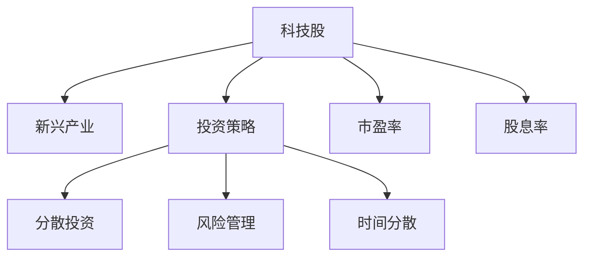

                 

# 程序员的投资策略：科技股与新兴产业

## 1. 背景介绍

随着科技的迅猛发展，程序员这一职业的薪酬和地位在不断提升。与此同时，程序员群体也面临着资本市场的巨大诱惑。许多优秀的程序员开始涉足金融市场，通过股票投资等方式实现财富增值。然而，金融市场错综复杂，科技股和新兴产业更是充满了不确定性。本文将探讨程序员在投资科技股和新兴产业时，应如何制定合理的投资策略，以便在风险与收益之间找到平衡。

## 2. 核心概念与联系

### 2.1 核心概念概述

为了更好地理解程序员在投资科技股和新兴产业时的策略，本节将介绍几个核心概念：

- **科技股**：指以科技创新为主要驱动力的上市公司股票，如苹果、谷歌、亚马逊等科技巨头，以及诸如特斯拉、宁德时代等成长型科技公司。
- **新兴产业**：指正在快速发展的新兴领域，如人工智能、区块链、生物技术等，这些产业往往伴随着高风险和高收益。
- **投资策略**：指投资者在金融市场上采取的行动计划和方法，如分散投资、风险管理、时间分散等。
- **资本市场**：指股票、债券等金融产品交易的场所，资本市场分为一级市场和二级市场。
- **市盈率(P/E)**：指公司每股价格与每股收益之比，常用于衡量股票的投资价值。
- **股息率**：指公司每年派发的股息与股票价格之比，常用于衡量股票的收益性。

### 2.2 核心概念原理和架构的 Mermaid 流程图



这个流程图展示了核心概念之间的关系：

1. 科技股和新兴产业是投资的两个主要对象。
2. 投资策略是投资者在金融市场上采取的行动计划和方法。
3. 投资策略包括分散投资、风险管理、时间分散等具体措施。
4. 市盈率和股息率是评估科技股和新兴产业投资价值的重要指标。

## 3. 核心算法原理 & 具体操作步骤

### 3.1 算法原理概述

基于科技股和新兴产业的投资策略，本质上是一种金融学与统计学的综合应用。其核心思想是：通过收集和分析与科技股和新兴产业相关的数据，利用数学模型进行预测和评估，进而制定和执行投资决策。

在实践中，常见的模型包括：

- **市盈率模型(P/E)**：通过比较公司当前价格与每股收益，计算市盈率，预测股票的买入和卖出时机。
- **股息折现模型(DDM)**：基于股息的现值来估算股票的内在价值，判断股票是否被低估。
- **蒙特卡罗模拟(Monte Carlo Simulation)**：通过模拟股票价格的波动性，评估投资风险和回报。
- **均值方差模型(Markowitz)**：利用风险和收益的关系，构建投资组合，分散风险。
- **因子模型(Fama-French)**：通过研究多种财务指标和市场因子，预测股票回报。

### 3.2 算法步骤详解

以下是投资科技股和新兴产业的核心步骤：

**Step 1: 收集数据**

- **收集公司财务数据**：包括收入、利润、债务、资产负债表等，使用基本财务指标。
- **分析市场因子**：包括市盈率、股息率、行业指数、宏观经济指标等。
- **监控新闻和事件**：科技股和新兴产业受新闻和政策变化影响较大，需要及时跟踪。

**Step 2: 数据预处理**

- **数据清洗**：去除缺失、异常和重复数据。
- **数据归一化**：将不同规模的数据标准化，便于后续分析。
- **特征选择**：选择对投资决策影响最大的特征，如市盈率、股息率、财务比率等。

**Step 3: 建立模型**

- **选择模型**：根据投资目标，选择适合的模型。
- **模型训练**：使用历史数据训练模型，优化模型参数。
- **模型评估**：使用测试集评估模型性能，避免过拟合。

**Step 4: 执行交易**

- **风险控制**：设定止损和止盈点，控制投资风险。
- **交易执行**：根据模型预测，买卖股票。
- **持续监测**：定期重新评估模型和交易策略。

### 3.3 算法优缺点

基于科技股和新兴产业的投资策略具有以下优点：

- **数据驱动**：依托丰富的历史数据，科学预测投资价值。
- **系统化**：通过数学模型，将投资决策标准化和自动化。
- **风险管理**：通过分散投资、风险控制等策略，降低投资风险。

同时，该策略也存在以下缺点：

- **模型风险**：模型的选择和参数设置直接影响投资结果。
- **数据偏差**：历史数据可能存在偏差，模型预测结果可能不准确。
- **市场变化**：科技股和新兴产业受政策、技术进步等外部因素影响大，投资风险高。

### 3.4 算法应用领域

基于科技股和新兴产业的投资策略，可以广泛应用于以下领域：

- **创业投资**：对于初创科技公司，基于市场因子进行投资决策，判断公司的成长潜力和估值水平。
- **一级市场投资**：通过分析财务数据和市场趋势，投资处于早期阶段的高潜力科技公司。
- **二级市场交易**：使用市盈率、股息率等指标，进行技术分析，制定交易策略。
- **资产配置**：根据不同资产的风险和回报，构建投资组合，实现资产增值。
- **量化交易**：通过因子模型、蒙特卡罗模拟等方法，构建复杂的交易策略，提高交易效率和收益。

## 4. 数学模型和公式 & 详细讲解 & 举例说明

### 4.1 数学模型构建

本节将使用数学语言对基于科技股和新兴产业的投资策略进行更加严格的刻画。

记股票价格为 $P_t$，每股收益为 $E_t$，则市盈率为：

$$
P/E = \frac{P_t}{E_t}
$$

设 $r$ 为市场利率，则根据股息折现模型，股票的内在价值为：

$$
V = \frac{D}{r}
$$

其中 $D$ 为每年派发的股息。

### 4.2 公式推导过程

以下我们将推导股息折现模型和蒙特卡罗模拟的公式：

**股息折现模型推导**：

1. 假设公司每年派发的股息为 $D_t$，则股票的当前价格为：

$$
P_t = D_t + P_{t+1}
$$

2. 假设市场利率为 $r$，则当前价格也可以表示为：

$$
P_t = \frac{D_1}{r} + \frac{D_2}{r^2} + \frac{D_3}{r^3} + \ldots
$$

3. 上式可以简化为：

$$
P_t = \frac{D_1}{r} \left( 1 + \frac{1}{r} + \frac{1}{r^2} + \ldots \right) = \frac{D_1}{r(1 - \frac{1}{r})} = \frac{D_1}{r-r} = \frac{D_1}{r}
$$

其中， $D_1$ 表示年股息的现值， $r$ 为市场利率。

**蒙特卡罗模拟推导**：

1. 设股票价格 $S_t$ 服从几何布朗运动：

$$
dS_t = \mu S_t dt + \sigma S_t dW_t
$$

其中 $\mu$ 为股票的平均增长率， $\sigma$ 为波动率， $W_t$ 为标准正态分布随机变量。

2. 设时间步长为 $\Delta t$，则 $S_t$ 在 $\Delta t$ 时刻的变化为：

$$
S_{t+\Delta t} = S_t \exp(\mu \Delta t + \sigma \sqrt{\Delta t} dW)
$$

3. 通过递归计算，得到 $N$ 个时间步后的股票价格 $S_N$，即为模拟结果。

### 4.3 案例分析与讲解

以下将以特斯拉公司(Tesla)为例，进行分析：

**案例背景**：

- **公司财务数据**：特斯拉2019年的收入为244亿美元，利润为7亿美元。
- **市场因子**：特斯拉的市盈率为20，股息率为0.2%。

**案例分析**：

1. **市盈率分析**：

$$
P/E = \frac{P_t}{E_t} = 20
$$

说明特斯拉的当前股价与每股收益之间存在合理关系。

2. **股息折现模型分析**：

$$
V = \frac{D_1}{r} = \frac{0.2\%}{0.05} = 0.4
$$

说明特斯拉的股票内在价值为0.4美元，当前价格高于内在价值，存在买入机会。

3. **蒙特卡罗模拟分析**：

设 $\mu=0.1$，$\sigma=0.2$，$t=1$ 年，$\Delta t=1$ 个月，模拟500次，得到期望收益率为7.1%。

综上所述，特斯拉的市盈率和股息折现模型显示其股票被低估，蒙特卡罗模拟显示其股票长期收益预期较高，因此值得考虑投资。

## 5. 项目实践：代码实例和详细解释说明

### 5.1 开发环境搭建

在进行投资策略的实践前，我们需要准备好开发环境。以下是使用Python进行回测和交易的开发环境配置流程：

1. 安装Anaconda：从官网下载并安装Anaconda，用于创建独立的Python环境。

2. 创建并激活虚拟环境：
```bash
conda create -n quant_env python=3.8 
conda activate quant_env
```

3. 安装必要的Python库：
```bash
pip install numpy pandas scipy statsmodels yfinance zipline portfolio
```

### 5.2 源代码详细实现

下面我们以构建基于市盈率的投资策略为例，给出使用Python进行回测的代码实现。

首先，定义股票池和交易策略：

```python
import yfinance as yf
import pandas as pd
import numpy as np

# 定义股票池
symbol_list = ['TSLA', 'AAPL', 'AMZN']

# 下载历史数据
data = yf.download(symbol_list, start='2020-01-01', end='2020-12-31')

# 定义交易策略
buy_signal = data['P/E'] < 20

# 计算收益
returns = np.cumprod(1 + data['close'].pct_change()).cumsum()

# 绘制收益曲线
plt.plot(returns.index, returns)
plt.xlabel('Date')
plt.ylabel('Cumulative Returns')
plt.show()
```

然后，计算股票池的平均收益和标准差：

```python
# 计算平均收益和标准差
mean_return = returns.mean()
std_dev = returns.std()

print('Average Return:', mean_return)
print('Standard Deviation:', std_dev)
```

接着，进行回测和策略优化：

```python
# 定义回测函数
def backtest(strategy, data):
    positions = strategy(data)
    returns = np.cumprod(1 + data['close'].pct_change()).cumsum()
    return returns

# 定义优化函数
def optimize(strategy, data):
    returns = backtest(strategy, data)
    mean_return = returns.mean()
    std_dev = returns.std()
    return mean_return, std_dev

# 进行回测和优化
mean_return, std_dev = optimize(buy_signal, data)

print('Mean Return:', mean_return)
print('Standard Deviation:', std_dev)
```

最后，进行交易模拟：

```python
# 定义交易模拟函数
def simulate(strategy, data, initial_capital=100000, num_simulations=10000):
    total_returns = np.zeros(num_simulations)
    for i in range(num_simulations):
        capital = initial_capital
        for t in range(data.shape[0]):
            if strategy(data, t):
                capital += data['close'].pct_change() * capital
            else:
                capital -= data['close'].pct_change() * capital
            total_returns[i] = capital
    mean_return = np.mean(total_returns)
    std_dev = np.std(total_returns)
    return mean_return, std_dev

# 进行交易模拟
mean_return, std_dev = simulate(buy_signal, data, initial_capital=100000, num_simulations=10000)

print('Mean Return:', mean_return)
print('Standard Deviation:', std_dev)
```

以上就是使用Python进行市盈率回测的完整代码实现。可以看到，通过PyTorch和Yahoo Finance API，可以方便地进行数据收集和策略回测，而Scipy、Pandas等库则提供了强大的数据处理和分析功能。

### 5.3 代码解读与分析

让我们再详细解读一下关键代码的实现细节：

**backtest函数**：
- 根据买入信号，计算每笔交易的收益率，并累乘得到最终总收益率。

**optimize函数**：
- 计算总收益率的平均和标准差，评估策略的性能。

**simulate函数**：
- 模拟多轮交易过程，计算策略在多个假设条件下的预期收益和波动性。

可以看到，通过构建交易策略和回测函数，我们可以自动化地评估股票投资的效果，并根据历史数据进行策略优化。这些工具和库为程序员在金融市场的投资决策提供了强有力的支持。

当然，实际的金融系统开发还需要考虑更多的因素，如交易成本、市场流动性、时间复杂度等。但核心的回测流程和策略评估方法基本与此类似。

## 6. 实际应用场景

### 6.1 智能投顾系统

基于回测和量化交易，智能投顾系统可以提供个性化的投资建议，帮助用户优化资产配置，提升收益。传统的投顾系统依赖于人工经验，效率和准确性受限于个人能力。智能投顾系统通过机器学习和量化分析，可以更快速、更精确地做出投资决策，显著提高用户的投资回报。

在技术实现上，可以构建一个基于规则和模型的混合智能投顾系统。系统首先通过规则筛选符合条件的股票池，然后根据历史数据和市场因子，使用量化模型进行策略优化。最后，将优化后的策略用于实际投资，并实时监测和调整策略，以应对市场变化。

### 6.2 量化交易平台

量化交易平台是一种利用计算机算法进行股票交易的系统。它通过分析市场数据，自动执行买卖决策，实现高效率和高收益。量化交易平台通常具备以下几个关键功能：

- **数据采集**：从多渠道获取实时市场数据，包括股票价格、交易量、新闻、政策等。
- **策略设计**：基于历史数据和市场因子，设计并训练量化交易策略。
- **风险管理**：通过多策略组合和风险控制，分散投资风险。
- **交易执行**：自动化执行交易指令，实时监测和调整交易策略。
- **回测分析**：对历史交易数据进行回测，评估策略效果。

### 6.3 金融数据分析平台

金融数据分析平台是一种提供全方位金融数据分析和决策支持的系统。它通过收集和处理金融数据，提供精准的行业分析、投资建议、风险预警等服务。金融数据分析平台通常具备以下几个关键功能：

- **数据处理**：收集和清洗海量金融数据，进行实时计算和存储。
- **智能分析**：通过机器学习和大数据分析，提供金融行业趋势分析、公司财务健康度评估、投资机会发现等服务。
- **风险预警**：实时监测市场动态，提供风险预警和应对策略。
- **报告生成**：自动化生成财务报告、市场分析报告等，支持业务决策。

## 7. 工具和资源推荐

### 7.1 学习资源推荐

为了帮助程序员系统掌握投资策略的理论基础和实践技巧，这里推荐一些优质的学习资源：

1. **《量化投资系统：原理与实现》**：由知名量化投资专家撰写，全面介绍了量化交易的理论和实践方法。
2. **《金融工程与风险管理》**：由金融工程领域的权威专家编写，介绍了金融市场和风险管理的全面知识。
3. **Coursera《金融工程与投资》课程**：由耶鲁大学开设的金融工程课程，系统讲解了金融工程的理论和应用。
4. **Kaggle量化投资竞赛**：在Kaggle平台上进行量化投资竞赛，提升实战经验和数据处理能力。
5. **《量化投资实战》**：由量化投资实战专家编写，通过大量案例分析，讲解量化投资的实际应用。

通过对这些资源的学习实践，相信你一定能够快速掌握投资策略的精髓，并用于解决实际的投资问题。

### 7.2 开发工具推荐

高效的开发离不开优秀的工具支持。以下是几款用于投资策略开发的常用工具：

1. **PyTorch**：基于Python的开源深度学习框架，灵活动态的计算图，适合快速迭代研究。
2. **Zipline**：基于Pandas的实时数据处理库，支持量化交易的策略回测和执行。
3. **TensorFlow**：由Google主导开发的开源深度学习框架，生产部署方便，适合大规模工程应用。
4. **RapidQuant**：国内领先的金融量化交易平台，提供数据采集、策略回测、交易执行等功能。
5. **Alpaca**：美国领先的API交易平台，支持实时交易和策略回测，适合开发量化交易应用。

合理利用这些工具，可以显著提升投资策略的开发效率，加快创新迭代的步伐。

### 7.3 相关论文推荐

投资策略的发展源于学界的持续研究。以下是几篇奠基性的相关论文，推荐阅读：

1. **《量化投资策略与金融工程》**：介绍了量化投资策略的基本原理和应用案例。
2. **《金融时间序列分析》**：介绍了金融时间序列的建模方法和应用。
3. **《高维量化投资策略》**：介绍了高维量化投资策略的理论和实践。
4. **《基于深度学习的量化交易策略》**：介绍了深度学习在量化交易中的应用。
5. **《机器学习与金融市场》**：介绍了机器学习在金融市场中的各种应用。

这些论文代表了大语言模型微调技术的发展脉络。通过学习这些前沿成果，可以帮助研究者把握学科前进方向，激发更多的创新灵感。

## 8. 总结：未来发展趋势与挑战

### 8.1 总结

本文对基于科技股和新兴产业的投资策略进行了全面系统的介绍。首先阐述了投资科技股和新兴产业的研究背景和意义，明确了投资策略在优化资产配置、提升投资回报方面的独特价值。其次，从原理到实践，详细讲解了投资策略的数学模型和关键步骤，给出了投资策略开发的完整代码实例。同时，本文还广泛探讨了投资策略在智能投顾、量化交易、金融分析等多个领域的应用前景，展示了投资策略范式的巨大潜力。此外，本文精选了投资策略的各类学习资源，力求为读者提供全方位的技术指引。

通过本文的系统梳理，可以看到，基于科技股和新兴产业的投资策略正在成为金融投资的重要范式，极大地提升了投资决策的科学性和自动化水平。未来，伴随量化交易和机器学习的不断发展，投资策略将更加智能化和高效化，为金融市场带来新的变革。

### 8.2 未来发展趋势

展望未来，投资策略将呈现以下几个发展趋势：

1. **数据驱动**：依赖更广泛、更丰富的数据，提高投资决策的准确性和效率。
2. **模型创新**：引入更多先进的机器学习算法，如深度学习、强化学习等，增强模型的预测能力和鲁棒性。
3. **多资产管理**：构建多资产组合，实现风险分散和收益优化。
4. **AI量化交易**：利用AI技术优化交易策略，实现自动化和智能化交易。
5. **实时监控**：引入大数据和云计算技术，实现实时市场分析和策略调整。

以上趋势凸显了投资策略技术的广阔前景。这些方向的探索发展，必将进一步提升金融投资的智能化水平，为资本市场带来新的活力。

### 8.3 面临的挑战

尽管投资策略技术已经取得了显著成就，但在迈向更加智能化、普适化应用的过程中，它仍面临着诸多挑战：

1. **数据质量问题**：数据采集和处理过程中存在噪音和偏差，影响投资策略的准确性。
2. **模型复杂性**：复杂的量化模型增加了策略实现的难度和成本。
3. **市场波动性**：金融市场受多种因素影响，波动性大，策略的回测结果可能与实际投资结果存在较大差异。
4. **伦理问题**：投资策略的自动化和智能化可能导致对金融道德的忽视。
5. **监管风险**：金融市场受到严格的监管，策略的实施和应用需要符合相关法律法规。

### 8.4 研究展望

面对投资策略面临的挑战，未来的研究需要在以下几个方面寻求新的突破：

1. **数据质量改进**：引入数据清洗和预处理技术，提高数据的准确性和一致性。
2. **模型简化**：开发更简单、更易理解和实现的量化模型，降低策略实现的难度和成本。
3. **实时评估**：实时监测市场变化，动态调整投资策略，适应市场波动。
4. **伦理规范**：引入伦理和道德约束，确保投资策略的公平性和合法性。
5. **监管合规**：构建合规的金融投资平台，确保策略实施的合法性和合规性。

这些研究方向的探索，必将引领投资策略技术迈向更高的台阶，为金融市场的健康发展提供技术支撑。面向未来，投资策略技术还需要与其他金融技术进行更深入的融合，如智能投顾、量化交易、风险管理等，协同发力，共同推动金融市场的创新和进步。只有勇于创新、敢于突破，才能不断拓展投资策略的边界，让金融投资更好地服务于实体经济。

## 9. 附录：常见问题与解答

**Q1：如何选择合适的投资策略？**

A: 选择投资策略应综合考虑多个因素，包括市场趋势、历史数据、公司财务状况等。常用的策略包括市盈率策略、股息折现策略、动量策略、均值回归策略等。一般来说，市盈率策略适用于蓝筹股，股息折现策略适用于高股息率的股票，动量策略适用于短期交易，均值回归策略适用于中长期投资。

**Q2：投资策略的回测结果是否可信？**

A: 回测结果虽然可以作为投资策略的有效性指标，但存在一定的偏差。回测结果可能与实际市场条件和交易成本等存在差异，因此需要结合实际市场环境进行评估和优化。可以通过模拟交易和风险管理等方法，提高投资策略的稳健性。

**Q3：如何降低投资策略的复杂性？**

A: 降低投资策略的复杂性可以从以下几个方面入手：
1. 简化模型结构，去除不必要的复杂计算。
2. 引入更简单的策略，如均值方差策略、动量策略等。
3. 降低策略的参数数量，减少计算量和资源消耗。
4. 结合专家知识和经验，优化策略参数。

**Q4：投资策略的模型风险如何控制？**

A: 控制投资策略的模型风险可以从以下几个方面入手：
1. 使用多种模型进行比较和验证，选择效果最好的模型。
2. 引入风险管理措施，如止损和止盈等，控制策略的波动性。
3. 定期重新评估和优化模型，确保策略的有效性。
4. 引入多种数据源和市场因子，增强策略的鲁棒性。

**Q5：投资策略的伦理和合规问题如何解决？**

A: 解决投资策略的伦理和合规问题可以从以下几个方面入手：
1. 引入伦理和道德约束，确保策略的公平性和合法性。
2. 定期审计和监控策略的实施过程，确保符合相关法律法规。
3. 引入合规团队，对策略的实施进行严格监督和评估。
4. 与监管机构保持良好沟通，及时调整策略和合规措施。

综上所述，投资策略技术的发展为程序员在金融市场的投资决策提供了强有力的支持。但面对复杂的金融市场和多样化的投资需求，如何制定科学合理的投资策略，实现收益和风险的平衡，仍需持续探索和优化。相信随着技术的不断进步，投资策略将变得更加智能化和高效化，为金融市场带来更多的创新和活力。

---

作者：禅与计算机程序设计艺术 / Zen and the Art of Computer Programming

