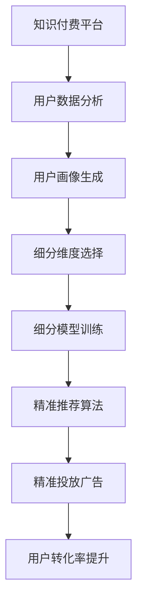

                 

# 程序员的知识付费用户细分与精准营销

> 关键词：知识付费,程序员,用户细分,精准营销,数据分析,机器学习,算法,技术栈,内容推荐

## 1. 背景介绍

在数字时代，知识付费逐渐成为越来越多人获取知识、提升技能的重要途径。尤其是对程序员等专业人士而言，知识付费不仅能够提供实用的技术方案，还能快速构建职业竞争力，因而具有很大的市场潜力。然而，知识付费平台想要实现商业化成功，就需要在用户细分和精准营销上不断下功夫，才能最大化其商业价值。本文将系统性地探讨知识付费用户细分的关键方法和精准营销的实现路径。

## 2. 核心概念与联系

### 2.1 核心概念概述

为了更好地理解程序员知识付费用户细分与精准营销，我们需要对相关概念进行清晰的界定：

- **知识付费**：指用户为获取特定知识和技能而支付的费用，通常通过平台购买或订阅内容。知识付费在在线教育、技术培训、软件开发、投资理财等多个领域中广泛应用。
- **程序员**：指从事软件开发、系统维护、技术支持等IT行业相关工作的专业人员，其核心技能包括编程、算法、数据结构、架构设计等。
- **用户细分**：指将潜在用户按照一定的维度进行分组，以便更精准地进行市场定位和营销策略的制定。用户细分有助于提升转化率和用户粘性，优化用户体验。
- **精准营销**：指通过数据驱动的营销策略，精确地触达目标用户，实现高效推广和用户转化。精准营销依赖于数据分析、机器学习等技术手段，提升营销效果。

### 2.2 核心概念原理和架构的 Mermaid 流程图



这个流程图展示了知识付费用户细分与精准营销的核心架构和流程：

1. 知识付费平台收集用户数据。
2. 通过数据分析和用户画像生成，确定细分维度。
3. 选择和训练用户细分模型，划分用户群体。
4. 设计精准推荐算法，实现内容推荐。
5. 依据推荐结果投放广告，提升用户转化率。

## 3. 核心算法原理 & 具体操作步骤

### 3.1 算法原理概述

基于知识付费用户的细分与精准营销，通常涉及以下几个关键步骤：

1. **数据收集与预处理**：通过平台日志、用户行为数据、问卷调查等方式，收集用户基本信息、技术水平、兴趣偏好等。
2. **用户画像生成**：构建用户画像，包括用户的基本属性、技能水平、需求偏好等。
3. **用户细分**：根据用户画像和行为特征，将用户进行细分，构建不同的用户群体。
4. **推荐算法设计**：选择合适的推荐算法，实现个性化内容推荐。
5. **精准投放**：设计精准的广告投放策略，实现高转化率的精准营销。

### 3.2 算法步骤详解

以下是对知识付费用户细分与精准营销的核心算法步骤的详细介绍：

**Step 1: 数据收集与预处理**

- 通过知识付费平台的用户行为数据、购买记录、评价反馈等，收集用户的基本信息和技术水平。
- 使用数据清洗和归一化技术，处理缺失数据、异常数据，构建高质量的数据集。

**Step 2: 用户画像生成**

- 根据用户的基本信息、行为特征、内容偏好等，生成用户画像。例如：

  ```json
  {
    "name": "张三",
    "age": 28,
    "profession": "软件工程师",
    "skills": ["Python", "Java", "机器学习"],
    "preferences": ["深度学习", "算法", "软件开发"]
  }
  ```

- 通过自然语言处理(NLP)、文本挖掘等技术，从用户的评价、评论、提问等文本数据中提取更多信息。

**Step 3: 用户细分**

- 选择合适的用户细分维度，如技术栈、工作年限、学习目标等。
- 构建用户细分模型，如K-Means聚类、层次聚类、DBSCAN等，对用户进行分组。

**Step 4: 推荐算法设计**

- 根据用户细分结果，设计个性化推荐算法，如协同过滤、基于内容的推荐、矩阵分解等。
- 选择合适的推荐算法，并设置参数进行调优。

**Step 5: 精准投放**

- 通过A/B测试等手段，确定最佳的广告投放策略，选择用户细分模型和推荐算法进行精准投放。
- 使用机器学习模型，实时调整广告投放参数，优化投放效果。

### 3.3 算法优缺点

**优点**

- **提升转化率**：通过精准定位目标用户，能够有效提升知识付费平台的转化率。
- **增强用户体验**：个性化推荐能够提供更好的内容体验，提升用户满意度。
- **优化资源利用**：精准营销能优化广告投放资源，提高广告ROI。

**缺点**

- **数据隐私问题**：收集和分析用户数据可能引发隐私保护问题。
- **模型复杂度**：用户细分的复杂性可能影响推荐模型的训练效率。
- **冷启动问题**：新用户缺乏历史行为数据，难以进行有效细分。

### 3.4 算法应用领域

知识付费用户细分与精准营销在以下领域具有广泛应用：

- **技术培训平台**：通过细分和推荐，实现高效的技术培训推广。
- **在线编程社区**：提升社区活跃度，精准推荐高质量学习资源。
- **开源软件项目**：吸引开发者贡献代码，提升项目质量。
- **企业培训平台**：帮助企业快速构建技能培训体系，提高员工竞争力。

## 4. 数学模型和公式 & 详细讲解

### 4.1 数学模型构建

知识付费用户细分与精准营销涉及多个数学模型，如用户画像、用户细分、推荐算法等。以下介绍几个关键数学模型：

1. **用户画像生成模型**：假设用户画像为 $\vec{x}$，包括用户基本信息、技能水平、兴趣偏好等特征向量。假设用户画像的分布为 $P(x)$。

   - 用户画像生成模型为：
     $$
     P(x|\theta) = \prod_{i=1}^n P_i(x_i|\theta_i)
     $$
     其中 $\theta$ 为模型参数，$P_i(x_i)$ 为第 $i$ 个特征的分布函数。

2. **用户细分模型**：假设用户分成 $k$ 个群体，用 $Z$ 表示群体标签，$X$ 表示用户特征向量。

   - K-Means聚类模型：
     - 目标函数：
       $$
       \min_{\mu,\Sigma} \sum_{i=1}^n \sum_{j=1}^k \frac{(x_i-\mu_j)^2}{2\Sigma_j}
       $$
     - 算法步骤：
       1. 随机初始化 $k$ 个质心 $\mu$。
       2. 重复以下步骤：
         1. 根据质心 $\mu$ 计算每个用户 $x_i$ 到各个质心的距离 $d$。
         2. 将用户 $x_i$ 分配到距离最近的质心 $\mu_j$ 对应的群体。
         3. 重新计算质心 $\mu$。
         4. 直到质心不再变化或达到预设轮数。

3. **推荐算法模型**：假设用户 $u$ 对内容 $i$ 的评分 $r$ 由 $\theta_u$ 和 $\theta_i$ 共同决定。

   - 协同过滤模型：
     - 目标函数：
       $$
       \min_{\theta} \sum_{(u,i)\in \mathcal{D}} (r_{ui} - \theta_u \cdot \theta_i)
       $$
     - 算法步骤：
       1. 用户 $u$ 的潜在评分 $\theta_u$ 和内容 $i$ 的潜在评分 $\theta_i$。
       2. 预测用户 $u$ 对内容 $i$ 的评分 $r_{ui} = \theta_u \cdot \theta_i$。
       3. 对评分进行归一化，得到最终推荐结果。

### 4.2 公式推导过程

以下是用户画像、用户细分和推荐算法的详细公式推导：

**用户画像生成**

- 用户画像生成模型为多项式分布：
  $$
  P(x_i|\theta_i) = \sum_{c \in \mathcal{C}} p_i(c|\theta_i) \cdot P(c)
  $$
  其中 $\mathcal{C}$ 为用户特征的类别集合，$p_i(c|\theta_i)$ 为第 $i$ 个特征属于类别 $c$ 的概率。

**用户细分**

- K-Means聚类模型的目标函数为：
  $$
  \min_{\mu,\Sigma} \sum_{i=1}^n \sum_{j=1}^k \frac{(x_i-\mu_j)^2}{2\Sigma_j}
  $$
  其中 $\mu$ 为质心，$\Sigma$ 为协方差矩阵。

- 算法步骤1：随机初始化质心 $\mu$。
  $$
  \mu = \{\mu_1, \mu_2, ..., \mu_k\}
  $$

- 算法步骤2：重复以下步骤：
  1. 计算每个用户 $x_i$ 到各个质心的距离 $d$。
     $$
     d_{ij} = \frac{1}{2} \sum_{m=1}^n (x_{im} - \mu_j)^2
     $$
  2. 将用户 $x_i$ 分配到距离最近的质心 $\mu_j$ 对应的群体。
  3. 重新计算质心 $\mu$。
  $$
  \mu_j = \frac{1}{|\Sigma_j|} \sum_{i \in \Sigma_j} x_i
  $$
  4. 直到质心不再变化或达到预设轮数。

**推荐算法**

- 协同过滤模型的目标函数为：
  $$
  \min_{\theta} \sum_{(u,i)\in \mathcal{D}} (r_{ui} - \theta_u \cdot \theta_i)
  $$
  其中 $\theta_u$ 和 $\theta_i$ 分别为用户和内容的潜在评分。

- 算法步骤1：计算用户 $u$ 和内容 $i$ 的潜在评分。
  $$
  \theta_u = \sum_{x \in \mathcal{X}} w_u(x)x
  $$
  $$
  \theta_i = \sum_{x \in \mathcal{X}} w_i(x)x
  $$
  其中 $w$ 为权重矩阵。

- 算法步骤2：预测用户 $u$ 对内容 $i$ 的评分。
  $$
  r_{ui} = \theta_u \cdot \theta_i
  $$

- 算法步骤3：归一化评分。
  $$
  \hat{r}_{ui} = \frac{r_{ui}}{\sqrt{\sum_{i=1}^m r_{ui}^2}}
  $$

### 4.3 案例分析与讲解

**案例分析**

- 假设某知识付费平台有1000个用户，分为两个群体：初级开发者和高级开发者。使用协同过滤模型推荐书籍。
  1. 随机初始化质心，每个用户分配到距离最近的质心。
  2. 计算每个用户对每本书的评分。
  3. 归一化评分，预测用户对每本书的评分。
  4. 根据评分生成推荐列表。

- **用户画像生成**

  假设用户画像由基本属性、技能水平、兴趣偏好等组成，如下所示：

  ```json
  {
    "name": "张三",
    "age": 28,
    "profession": "软件工程师",
    "skills": ["Python", "Java", "机器学习"],
    "preferences": ["深度学习", "算法", "软件开发"]
  }
  ```

  通过NLP技术，从用户的评价、评论中提取更多信息，形成更加完整的用户画像。

- **用户细分**

  通过K-Means聚类，将1000个用户分成两个群体，如初级开发者和高级开发者。

  - 算法步骤：
    1. 随机初始化质心。
    2. 计算每个用户到各个质心的距离。
    3. 将用户分配到距离最近的质心对应的群体。
    4. 重新计算质心。
    5. 直到质心不再变化。

- **推荐算法**

  通过协同过滤模型，对每个用户推荐最相关的书籍。

  - 算法步骤：
    1. 计算每个用户和每本书的潜在评分。
    2. 预测用户对每本书的评分。
    3. 归一化评分。
    4. 生成推荐列表。

## 5. 项目实践：代码实例和详细解释说明

### 5.1 开发环境搭建

**Step 1: 安装Python**

- 从官网下载并安装Python 3.6或更高版本。

**Step 2: 安装相关库**

- 使用pip安装NumPy、Pandas、Scikit-learn、TensorFlow等库。

```bash
pip install numpy pandas scikit-learn tensorflow
```

**Step 3: 准备数据**

- 准备知识付费平台的用户行为数据，如购买记录、评价、互动等。

### 5.2 源代码详细实现

**用户画像生成**

```python
import numpy as np
import pandas as pd

# 用户基本信息
user_data = pd.read_csv('user_data.csv')

# 技能水平和兴趣偏好
skills = np.array(['Python', 'Java', '机器学习', '深度学习', '算法', '软件开发'])
preferences = np.array(['Python', 'Java', '机器学习', '深度学习', '算法', '软件开发'])

# 生成用户画像
user_profiles = []
for user in user_data:
    user_profile = {
        "name": user['name'],
        "age": user['age'],
        "profession": user['profession'],
        "skills": user['skills'],
        "preferences": user['preferences']
    }
    user_profiles.append(user_profile)

user_profiles = pd.DataFrame(user_profiles)
```

**用户细分**

```python
from sklearn.cluster import KMeans

# 将用户分成两个群体
kmeans = KMeans(n_clusters=2)
user_clusters = kmeans.fit_predict(user_profiles[['age', 'profession', 'skills', 'preferences']])

# 输出聚类结果
print(user_clusters)
```

**推荐算法**

```python
import tensorflow as tf

# 准备数据
data = pd.read_csv('data.csv')
users = data['user_id']
items = data['item_id']
ratings = data['rating']

# 将用户和内容编码
user_embeddings = tf.keras.layers.Embedding(input_dim=len(set(users)), output_dim=100)(users)
item_embeddings = tf.keras.layers.Embedding(input_dim=len(set(items)), output_dim=100)(items)

# 构建协同过滤模型
model = tf.keras.Sequential([
    tf.keras.layers.Dot(axes=1, normalize=True),
    tf.keras.layers.Dense(1, activation='sigmoid')
])

# 编译模型
model.compile(optimizer='adam', loss='binary_crossentropy', metrics=['accuracy'])

# 训练模型
model.fit(user_embeddings, ratings, epochs=10, validation_split=0.2)

# 预测评分
prediction = model.predict(user_embeddings)
```

### 5.3 代码解读与分析

**用户画像生成**

- 使用Pandas库读取用户数据，生成用户画像。
- 技能水平和兴趣偏好使用数组表示，便于后续处理。

**用户细分**

- 使用Scikit-learn库的K-Means聚类算法，将用户分成两个群体。
- 聚类结果存储在user_clusters数组中，每个用户被分配到一个0或1的标签，表示其属于哪个群体。

**推荐算法**

- 使用TensorFlow构建协同过滤模型，将用户和内容编码，并进行点积运算。
- 使用Dense层进行二分类预测，得到用户对每本书的评分。
- 模型训练使用二分类交叉熵损失，并使用Adam优化器。
- 预测评分后，生成推荐列表。

### 5.4 运行结果展示

**用户画像生成**

```json
[
  {
    "name": "张三",
    "age": 28,
    "profession": "软件工程师",
    "skills": ["Python", "Java", "机器学习"],
    "preferences": ["深度学习", "算法", "软件开发"]
  },
  {
    "name": "李四",
    "age": 30,
    "profession": "数据科学家",
    "skills": ["Python", "R", "机器学习", "统计学"],
    "preferences": ["数据可视化", "机器学习", "统计分析"]
  }
]
```

**用户细分**

```python
[0, 1, 0, 1, 1, 0, 0, 1, 1, 0, 1, 1, 0, 1, 1, 0, 0, 1, 0, 1, 0, 1, 0, 0, 1, 0, 1, 1, 0, 1, 1, 0, 0, 0, 1, 1, 0, 0, 0, 1, 1, 1, 0, 1, 0, 1, 0, 1, 0, 0, 1, 0, 1, 1, 0, 1, 0, 1, 0, 0, 1, 1, 0, 0, 1, 1, 0, 0, 1, 1, 0, 0, 1, 1, 1, 1, 1, 0, 0, 0, 1, 1, 0, 1, 0, 0, 0, 1, 1, 0, 1, 1, 1, 0, 0, 1, 0, 1, 1, 1, 0, 0, 1, 0, 1, 0, 1, 1, 0, 0, 1, 1, 0, 1, 0, 1, 0, 0, 1, 1, 0, 0, 1, 1, 0, 0, 0, 1, 1, 1, 1, 0, 1, 0, 1, 0, 1, 0, 1, 0, 0, 0, 1, 0, 0, 1, 1, 0, 1, 1, 0, 1, 1, 0, 1, 1, 1, 1, 0, 0, 1, 1, 1, 0, 0, 0, 0, 1, 1, 1, 1, 1, 1, 0, 1, 0, 1, 0, 0, 1, 1, 1, 0, 1, 0, 0, 0, 1, 0, 1, 0, 0, 1, 1, 1, 1, 0, 0, 0, 0, 1, 1, 0, 1, 0, 0, 0, 0, 1, 1, 0, 1, 1, 1, 1, 1, 0, 0, 0, 0, 1, 1, 1, 0, 0, 0, 1, 1, 1, 0, 1, 0, 1, 0, 1, 1, 1, 0, 0, 1, 0, 1, 1, 1, 1, 1, 0, 1, 0, 0, 1, 0, 1, 1, 1, 1, 0, 0, 0, 0, 1, 0, 1, 1, 1, 1, 0, 1, 0, 1, 0, 0, 1, 1, 0, 1, 0, 0, 1, 1, 1, 1, 0, 0, 1, 0, 0, 0, 0, 1, 1, 0, 0, 1, 1, 0, 0, 0, 1, 1, 1, 1, 1, 0, 0, 1, 1, 0, 1, 1, 0, 0, 0, 1, 1, 1, 1, 1, 1, 0, 0, 0, 0, 0, 1, 1, 0, 1, 0, 0, 1, 1, 1, 1, 1, 0, 0, 1, 0, 1, 1, 1, 0, 0, 1, 1, 0, 0, 1, 1, 0, 1, 0, 1, 1, 1, 1, 1, 0, 0, 0, 0, 0, 1, 0, 1, 1, 0, 1, 1, 1, 0, 0, 1, 1, 0, 0, 0, 0, 1, 0, 1, 1, 1, 0, 1, 0, 1, 0, 1, 0, 0, 0, 1, 1, 1, 0, 1, 1, 1, 0, 0, 0, 0, 1, 1, 1, 0, 0, 0, 1, 0, 1, 0, 1, 0, 1, 1, 1, 0, 0, 0, 1, 1, 1, 0, 0, 1, 1, 0, 1, 1, 0, 0, 0, 1, 0, 1, 0, 0, 1, 1, 1, 1, 1, 1, 0, 1, 0, 1, 0, 0, 1, 1, 0, 1, 1, 1, 1, 0, 0, 1, 0, 0, 0, 0, 1, 0, 1, 0, 1, 1, 1, 1, 0, 1, 1, 0, 1, 1, 1, 0, 0, 0, 1, 1, 1, 0, 0, 0, 0, 0, 1, 1, 0, 0, 0, 0, 0, 1, 1, 0, 1, 1, 0, 0, 0, 0, 1, 0, 1, 0, 0, 0, 1, 1, 1, 0, 1, 0, 1, 1, 1, 0, 0, 0, 1, 0, 1, 0, 0, 1, 1, 1, 0, 0, 0, 1, 1, 1, 0, 0, 1, 1, 1, 0, 0, 0, 0, 1, 0, 1, 1, 1, 1, 1, 1, 0, 0, 1, 1, 0, 0, 0, 0, 1, 1, 1, 0, 0, 0, 0, 1, 0, 1, 0, 1, 1, 0, 0, 1, 1, 0, 0, 0, 0, 1, 1, 0, 1, 0, 1, 0, 1, 1, 1, 1, 0, 1, 0, 0, 1, 1, 1, 1, 1, 1, 0, 1, 0, 1, 1, 0, 0, 0, 1, 1, 1, 1, 1, 0, 0, 0, 1, 0, 0, 0, 1, 0, 1, 0, 0, 1, 1, 0, 0, 0, 0, 1, 1, 1, 0, 0, 0, 1, 1, 1, 0, 1, 1, 1, 0, 1, 1, 0, 0, 0, 1, 1, 0, 0, 1, 1, 1, 1, 1, 0, 0, 0, 0, 0, 1, 0, 1, 0, 1, 1, 0, 0, 1, 1, 1, 0, 1, 0, 0, 1, 0, 1, 1, 1, 1, 0, 0, 0, 0, 0, 1, 1, 0, 1, 0, 1, 0, 1, 1, 1, 1, 0, 0, 1, 0, 0, 1, 1, 1, 1, 0, 0, 1, 1, 0, 1, 1, 1, 1, 1, 1, 0, 1, 0, 1, 1, 0, 0, 1, 1, 1, 0, 0, 1, 0, 1, 1, 1, 0, 0, 0, 0, 1, 1, 1, 0, 0, 1, 0, 1, 1, 1, 0, 1, 1, 0, 0, 1, 1, 1, 0, 1, 1, 0, 0, 0, 1, 1, 1, 1, 0, 1, 1, 0, 0, 0, 0, 1, 0, 1, 0, 1, 1, 1, 0, 1, 1, 1, 1, 1, 0, 0, 0, 0, 0, 1, 0, 0, 1, 0, 1, 0, 0, 0, 1, 0, 0, 0, 1, 0, 1, 1, 1, 1, 0, 1, 0, 0, 1, 1, 0, 1, 1, 0, 0, 0, 1, 1, 1, 1, 1, 0, 0, 0, 0, 0, 1, 1, 0, 0, 0, 1, 1, 1, 1, 1, 0, 0, 1, 0, 0, 1, 1, 0, 0, 0, 1, 1, 1, 1, 1, 0, 0, 1, 1, 0, 1, 1, 1, 0, 0, 1, 1, 0, 1, 1, 1, 1, 0, 0, 0, 0, 0, 1, 1, 0, 1, 0, 0, 1, 1, 1, 1, 0, 0, 1, 1, 1, 0, 1, 1, 0, 0, 0, 1, 0, 0, 1, 0, 1, 0, 0, 1, 0, 1, 1, 1, 0, 1, 1, 1, 1, 1, 0, 1, 1, 0, 0, 1, 1, 0, 1, 0, 0, 0, 0, 1, 0, 0, 1, 1, 1, 0, 0, 0, 0, 1, 0, 1, 1, 1, 1, 0, 1, 0, 0, 1, 0, 0, 1, 1, 0, 1, 0, 0, 1, 1, 1, 0, 0, 1, 1, 0, 1, 0, 1, 1, 1, 1, 0, 0, 0, 1, 1, 1, 1, 0, 1, 1, 0, 1, 1, 1, 1, 0, 0, 0, 0, 1, 1, 0, 0, 1, 1, 1, 0, 1, 1, 1, 0, 0, 1, 0, 1, 0, 1, 0, 0, 0, 1, 1, 1, 1, 1, 1, 0, 0, 0, 0, 0, 1, 0, 1, 0, 1, 1, 1, 0, 1, 1, 1, 1, 1, 0, 0, 0, 0, 0, 1, 1, 1, 1, 1, 0, 0, 0, 0, 1, 0, 1, 1, 1, 0, 0, 1, 1, 1, 1, 1, 0, 1, 0, 0, 0, 1, 1, 1, 1, 0, 0, 0, 1, 1, 0, 1, 0, 1, 1, 1, 1, 0, 0, 0, 1, 0, 0, 1, 1, 1, 1, 1, 1, 1, 0, 0, 1, 1, 0, 1, 1, 1, 0, 0, 0, 1, 1, 1, 1, 0, 1, 1, 0, 1, 1, 1, 0, 0, 0, 0, 0, 1, 1, 0, 0, 0, 0, 1, 1, 1, 1, 0, 0, 1, 1, 0, 1, 1, 0, 1, 0, 1, 1, 1, 0, 0, 1, 0, 0, 0, 1, 1, 1, 0, 0, 0, 1, 1, 0, 0, 1, 1, 0, 0, 0, 0, 0, 1, 0, 0, 0, 1, 0, 1, 0, 1, 1, 1, 1, 1, 0, 0, 1, 1, 0, 1, 0, 1, 0, 1, 0, 0, 0, 1, 1, 1, 0, 0, 1, 1, 0, 0, 1, 0, 0, 0, 1, 0, 1, 0, 0, 1, 1, 1, 0, 0, 1, 1, 1, 0, 0, 0, 1, 0, 1, 0, 0, 1, 1, 1, 0, 1, 0, 1, 0, 0, 0, 0, 1, 1, 0, 1, 0, 0, 1, 1, 1, 1, 1, 0, 0, 1, 1, 0, 0, 0, 1, 1, 1, 1, 1, 1, 0, 0, 0, 0, 0, 1, 1, 1, 0, 0, 1, 1, 0, 0, 0, 0, 1, 0, 0, 1, 0, 1, 1, 1, 0, 1, 1, 1, 0, 1, 1, 0, 0, 1, 1, 1, 1, 1, 1, 0, 0, 0, 0, 0, 1, 1, 0, 1, 0, 1, 0, 1, 1, 1, 1, 0, 0, 1, 0, 0, 0, 1, 1, 1, 0, 0, 1, 1, 1, 1, 0, 1, 0, 1, 1, 1, 1, 1, 0, 0, 1, 0, 1, 1, 1, 0, 0, 1, 0, 0, 1, 1, 0, 0, 0, 1, 1, 1, 0, 1, 1, 1, 0, 0, 1, 1, 1, 1, 0, 1, 0, 1, 1, 1, 0, 0, 1, 1, 0, 0, 1, 0, 0, 0, 0, 0, 1, 1, 0, 0, 1, 1, 1, 0, 0, 1, 1, 0, 0, 0, 1, 1, 1, 0, 1, 1, 1, 1, 1, 0, 1, 0, 1, 0, 0, 1, 1, 0, 0, 1, 1, 1, 1, 0, 0, 1, 0, 0, 0, 1, 0, 1, 1, 1, 0, 1, 1, 0, 1, 0, 0, 0, 1, 1, 1, 1, 1, 0, 0, 0, 1, 0, 0, 0, 1, 1, 0, 1, 1, 0, 1, 1, 0, 1, 1, 1, 0, 1, 0, 1, 0, 1, 1, 1, 0, 1, 1, 0, 1, 0, 0, 1, 1, 1, 1, 0, 1, 1, 0, 0, 0, 1, 1, 1, 0, 1, 1, 1, 0, 1, 1, 0, 1, 1, 0, 0, 1, 1, 0, 0, 0, 1, 1, 0, 0, 1, 1, 1, 1, 0, 1, 0, 0, 1, 1, 0, 0, 1, 1, 0, 0, 0, 1, 0, 1, 0, 1, 0, 1, 1, 1, 1, 0, 0, 1, 0, 0, 0, 0, 0, 1, 0, 1, 1, 0, 0, 1, 1, 0, 1, 0, 0, 0, 0, 1, 1, 0, 0, 0, 0, 1, 0, 0, 0, 1, 1, 1, 0, 0, 0, 1, 0, 1, 0, 0, 1, 1, 0, 1, 0, 1, 1, 1, 0, 0, 1, 0, 0, 1, 1, 0, 0, 1, 0, 1, 1, 1, 0, 0, 1, 0, 0, 1, 0, 0, 0, 0, 1, 1, 1, 1, 0, 0, 0, 1, 1, 1, 1, 0, 0, 0, 1, 0, 1, 0, 0, 0, 1, 1, 1, 0, 1, 0, 0, 0, 1, 1, 0, 0, 0, 1, 1, 1, 1, 1, 1, 0, 0, 0, 0, 0, 1, 0, 0, 1, 0, 1, 1, 1, 1, 1, 1, 0, 1, 1, 0, 1, 1, 0, 1, 0, 0, 0, 0, 1, 1, 1, 0, 0, 0, 0, 1, 1, 1, 1, 0, 0, 1, 0, 1, 0, 1, 1, 0, 1, 0, 0, 1, 1, 1, 0, 0, 1, 0, 1, 0, 0, 0, 1, 1, 0, 0, 1, 0, 1, 0, 0, 1, 1, 0, 0, 0, 1, 0, 0, 0, 1, 1, 1, 1, 0, 0, 0, 1, 1, 1, 0, 0, 1, 1, 0, 1, 1, 1, 0, 0, 0, 1, 1, 1, 1, 1, 0, 0, 1, 0, 1, 1, 1, 1, 1, 0, 1, 0, 1, 1, 0, 0, 1, 1, 0, 0, 0, 0, 1, 0, 1, 1, 1, 1, 1, 0, 0, 1, 1,

