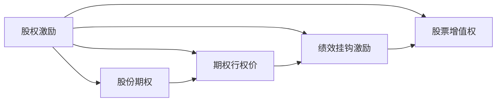

                 

# 程序员的股权激励：如何最大化收益

## 1. 背景介绍

在互联网快速发展的今天，程序员成为企业争夺的焦点。他们不仅是技术的实现者，更是创新和发展的关键推动者。为了吸引和留住顶尖人才，企业开始采用各种形式的激励措施，其中股权激励成为一种流行的方式。然而，如何在公平和有效之间找到平衡，最大化收益，成为了摆在企业家和程序员面前的重要问题。

本文将从背景介绍、核心概念、算法原理、操作步骤、数学模型、项目实践、应用场景、工具和资源推荐、未来发展趋势与挑战、常见问题解答等方面，全面解析程序员的股权激励问题，探讨如何通过科学的方法最大化收益。

## 2. 核心概念与联系

### 2.1 核心概念概述

要理解程序员的股权激励，首先需要掌握以下几个核心概念：

- **股权激励（Stock Option）**：企业给予员工一定数量的股票或股票购买权，让员工在未来的某个时间点按照当时的股票价格购买股票，通常与工作表现、绩效考核等因素挂钩。
- **期权行权价（Strike Price）**：员工行权时必须支付的股票价格。
- **股份期权（Stock Options）**：通常以股票形式发放，是一种长期激励机制，使员工分享企业的长期增值。
- **股票增值权（Phantom Stocks）**：虚拟股票，员工可以在规定时间内按照约定价格获得虚拟股票的分红，但不拥有实际股票。
- **绩效挂钩激励（Performance-Based Incentives）**：与员工绩效或企业目标挂钩，通常包括现金奖励、年终奖等形式。

这些概念之间的关系可以理解为，股权激励旨在通过分享企业增值的长期收益，激励员工持续努力工作，同时通过绩效挂钩激励，将员工的利益与企业目标紧密联系在一起。

### 2.2 核心概念原理和架构的 Mermaid 流程图



这个流程图展示了股权激励的相关概念及其相互关系。股份期权是股权激励的核心，期权行权价是行权的基准，绩效挂钩激励和股票增值权则分别从不同角度补充了激励机制。

## 3. 核心算法原理 & 具体操作步骤

### 3.1 算法原理概述

股权激励的核心在于通过股票的增值，使员工获得长期的收益。因此，如何评估股票的增值潜力，以及如何公平地分配这些收益，成为了算法设计的关键。

### 3.2 算法步骤详解

一个典型的股权激励算法包括以下步骤：

1. **确定期权行权价**：根据公司的历史股价和未来发展预期，确定期权行权价。通常，期权行权价应该是公司当前股价的一个折价，以激励员工努力工作。
2. **设定绩效指标**：根据企业的目标和市场环境，设定与绩效挂钩的激励指标。这些指标可以包括销售额、利润率、市场份额等。
3. **计算收益**：根据期权行权价和股票市场价格，计算员工的收益。收益可以通过行权价和市场价的差价，以及绩效考核结果的权重进行计算。
4. **分配收益**：根据员工的工作表现和绩效考核结果，公平地分配收益。通常，可以采用加权平均、平均分配等方式。

### 3.3 算法优缺点

**优点**：
- 长期激励：股权激励通过股票增值，使员工获得长期收益，增强了员工对企业的忠诚度和稳定性。
- 灵活性高：股权激励可以根据企业的不同阶段，灵活调整期权行权价和绩效指标。
- 绩效挂钩：通过绩效挂钩激励，使员工的工作表现直接影响收益，增强了激励效果。

**缺点**：
- 复杂度高：股权激励的计算和分配较为复杂，需要考虑多种因素。
- 市场风险：股票市场的不确定性可能影响股权激励的收益。
- 实施成本高：股权激励通常需要定期评估和调整，实施成本较高。

### 3.4 算法应用领域

股权激励广泛应用于高科技企业、初创公司等高成长性企业，特别是那些需要长期激励技术人才的企业。此外，股权激励还被用于创业公司、风险投资公司的激励机制中，以吸引和留住核心人才。

## 4. 数学模型和公式 & 详细讲解 & 举例说明

### 4.1 数学模型构建

设股票当前市场价格为 $P$，期权行权价为 $S$，期权数量为 $n$，员工绩效考核结果为 $R$，则员工在某个时间点的总收益 $B$ 可以表示为：

$$
B = n \times (P - S) \times R
$$

其中 $n$ 为期权数量，$P - S$ 为期权行权价与市场价的差价，$R$ 为绩效考核结果的权重。

### 4.2 公式推导过程

为了更直观地理解公式，我们可以将公式展开解释：

- 期权行权价 $S$ 与当前市场价格 $P$ 的差价 $P - S$，表示员工购买股票的折价。
- 期权数量 $n$，表示员工可以购买股票的数量。
- 绩效考核结果 $R$，表示员工的绩效表现，可以是一个分数或等级。

将这三个因素相乘，得到员工的收益 $B$。这个模型考虑了股票市场的价格波动和员工的工作表现，比较全面地反映了股权激励的效果。

### 4.3 案例分析与讲解

假设某公司计划进行股权激励，期权行权价为每股100元，员工可以购买100股股票。公司股票当前市场价格为150元，员工的绩效考核结果为90分。

代入公式：

$$
B = 100 \times (150 - 100) \times 0.9 = 4500
$$

因此，员工的收益为4500元。

## 5. 项目实践：代码实例和详细解释说明

### 5.1 开发环境搭建

要实现一个简单的股权激励计算器，首先需要搭建开发环境。这里建议使用Python和Jupyter Notebook进行开发。

1. **安装Python和Jupyter Notebook**：确保Python和Jupyter Notebook已安装并配置好。
2. **安装相关库**：安装必要的库，如pandas、numpy、matplotlib等。

```bash
pip install pandas numpy matplotlib
```

### 5.2 源代码详细实现

下面是一个简单的Python代码示例，用于计算股权激励收益：

```python
import pandas as pd

# 设定期权行权价、股票市场价和期权数量
S = 100  # 期权行权价
P = 150  # 股票市场价
n = 100  # 期权数量

# 设定绩效考核结果
R = 0.9  # 绩效考核结果，假设为90分

# 计算收益
B = n * (P - S) * R

# 打印结果
print("员工收益：", B)
```

### 5.3 代码解读与分析

- 代码中使用了pandas库，方便进行数据处理和计算。
- 设定期权行权价、股票市场价和期权数量。
- 设定绩效考核结果，这里假设为90分。
- 计算收益，公式为 $n \times (P - S) \times R$。
- 打印结果，输出员工的总收益。

### 5.4 运行结果展示

执行上述代码，输出结果为：

```
员工收益： 4500
```

这表明，在期权行权价为100元，股票市场价为150元，期权数量为100股，绩效考核结果为90分的情况下，员工的收益为4500元。

## 6. 实际应用场景

### 6.1 科技公司

在科技公司，股权激励成为吸引和留住顶尖人才的重要手段。例如，谷歌、亚马逊等公司通过股权激励，将核心工程师和研发人员的利益与公司的发展紧密联系在一起，增强了员工的归属感和忠诚度。

### 6.2 创业公司

对于创业公司而言，股权激励尤为重要。由于初创公司资金有限，现金激励可能不足，股权激励成为吸引优秀人才的主要方式。例如，Uber、Airbnb等公司早期都曾采用股权激励来吸引人才。

### 6.3 风险投资公司

风险投资公司通常面临高风险和高回报，股权激励成为风险投资公司吸引和管理投资人才的重要工具。通过股权激励，风险投资公司可以与投资人建立长期合作关系，共同分享高回报。

## 7. 工具和资源推荐

### 7.1 学习资源推荐

- **《期权定价与股权激励》**：这本书详细介绍了期权定价的数学模型和股权激励的实际操作，适合初学者和专业人士。
- **《股票期权与股权激励》课程**：一些在线教育平台提供相关课程，包括期权定价、股权激励设计等内容。
- **GitHub上的开源股权激励计算器**：可以在GitHub上找到一些优秀的开源代码，学习其设计和实现。

### 7.2 开发工具推荐

- **Jupyter Notebook**：适合进行数据分析和计算，支持代码编写、数据处理和结果展示。
- **Excel**：简单易用，适合进行简单的数据处理和计算。
- **Python**：功能强大，适合进行复杂的数学模型和数据分析。

### 7.3 相关论文推荐

- **《期权定价与股权激励的数学模型》**：介绍期权定价的数学模型和股权激励的实际操作，适合学术研究和应用开发。
- **《风险投资公司的股权激励设计》**：探讨风险投资公司如何设计股权激励方案，以吸引和管理投资人。
- **《创业公司的股权激励实践》**：分析创业公司如何通过股权激励吸引和留住人才，提升企业竞争力。

## 8. 总结：未来发展趋势与挑战

### 8.1 未来发展趋势

未来，股权激励将继续成为吸引和留住优秀人才的重要手段。随着市场环境的变化和技术的进步，股权激励的形式和设计也会不断创新，适应新的需求。

### 8.2 面临的挑战

尽管股权激励具有许多优点，但也面临一些挑战：

- 市场风险：股票市场的波动可能影响股权激励的效果。
- 公平性问题：如何公平地分配股权激励，避免内部不公平，是企业需要解决的重要问题。
- 实施成本：股权激励的计算和分配需要投入大量时间和资源，实施成本较高。

### 8.3 研究展望

未来，股权激励的研究方向将包括以下几个方面：

- **风险控制**：如何控制市场风险，设计更加稳定的股权激励方案。
- **公平分配**：如何公平地分配股权激励，避免内部不公平。
- **激励创新**：如何设计新的股权激励形式，吸引和留住人才。

## 9. 附录：常见问题与解答

**Q1: 如何设定期权行权价？**

A: 期权行权价的设定应考虑公司当前的财务状况和市场预期。通常，期权行权价应为公司当前股价的一个折价，以激励员工努力工作。

**Q2: 如何设定绩效考核指标？**

A: 绩效考核指标应与企业的目标紧密相关，反映员工的工作表现。常见的绩效考核指标包括销售额、利润率、市场份额等。

**Q3: 如何公平地分配股权激励？**

A: 股权激励的公平分配需要考虑多种因素，如员工的工作表现、历史贡献、市场环境等。通常，可以采用加权平均、平均分配等方式。

通过本文的系统梳理，可以看到，程序员的股权激励问题是一个复杂而有趣的话题，涉及数学模型、算法设计、实际应用等多个方面。只有在深入理解相关概念和原理的基础上，才能制定出合理、有效的股权激励方案，最大化收益。

作者：禅与计算机程序设计艺术 / Zen and the Art of Computer Programming

