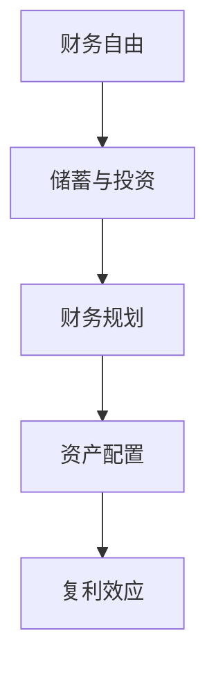

                 

# 程序员的财务自由：从省钱到赚钱的思维转变

> 关键词：程序员, 财务自由, 省钱, 赚钱, 思维转变, 投资理财, 个人财务管理, 创业

## 1. 背景介绍

程序员作为IT行业的中坚力量，普遍收入较高，但面对高昂的住房、教育、医疗等生活成本，以及子女教育等长远支出，如何实现财务自由、安心退休，成为许多人深思熟虑的问题。传统理财观念往往聚焦于积累收入，扩大消费，但缺乏系统性的财务规划和投资思维，很难达成长期财务目标。本文将通过探讨程序员群体常见的理财误区、投资机会和思维转变，提供一个由省钱到赚钱的实用指南，帮助程序员实现财务自由。

## 2. 核心概念与联系

### 2.1 核心概念概述

- **财务自由**：财务自由是指个人或家庭的净资产足以支持长期生活所需，不再受制于工作收入，可以自由选择生活方式和追求内心兴趣的状态。

- **储蓄与投资**：储蓄是积累财务资本的基础，而投资则是使资本增值，实现财务自由的有效途径。

- **财务规划**：财务规划是指在个人或家庭层面，根据当前财务状况和未来财务目标，制定长期财务安排的过程。

- **资产配置**：资产配置是投资决策的重要组成部分，通过合理分配各类资产，优化风险收益比，实现最优投资效果。

- **复利效应**：复利是指投资收益再投资，利用时间复利效应，实现资本的快速增值。

这些概念相互关联，共同构成了实现财务自由的底层逻辑。

### 2.2 核心概念原理和架构的 Mermaid 流程图



## 3. 核心算法原理 & 具体操作步骤

### 3.1 算法原理概述

基于理财和投资的核心算法，财务自由的过程可以抽象为一个由积累、规划和投资组成的闭环系统。储蓄与投资是财富增长的基本动力，财务规划则是保证财富长期增值的关键，资产配置和复利效应是实现财务自由的有效手段。通过系统的理财算法，程序员可以实现由省钱到赚钱的思维转变。

### 3.2 算法步骤详解

**Step 1: 财务状况评估**

首先，需要对自己的财务状况进行全面评估，包括月收入、月支出、现有储蓄、投资资产、负债情况等。通过财务报表和理财工具，如Mint、YNAB等，可以清晰了解自己的资产和负债分布，为后续的财务规划提供依据。

**Step 2: 财务目标设定**

根据个人情况和家庭需求，设定合理的短期、中期和长期财务目标。短期目标如紧急资金积累、教育费用储备，中期目标如买房购车、子女教育，长期目标如退休规划、遗产传承。明确目标有助于制定有针对性的理财计划。

**Step 3: 制定理财计划**

理财计划应涵盖收入管理、支出控制、储蓄与投资三部分。通过开源理财工具如You Need A Budget (YNAB)，设置预算规则，实现收入大于支出，每月定期储蓄。同时，通过多元化投资组合，分散风险，实现稳健增长。

**Step 4: 投资策略选择**

投资策略应基于风险承受能力、时间跨度和财务目标等因素。对于初入职场的程序员，建议优先选择风险较低的投资品种，如股票指数基金、债券基金、货币基金等。随着投资经验和资产积累，逐步增加风险资产配置，如股票、房地产等。

**Step 5: 风险管理与再平衡**

定期评估投资组合的业绩和风险，根据市场情况进行资产再平衡。同时，通过分散投资和定期再平衡，可以有效降低市场波动带来的风险。

**Step 6: 复利效应利用**

复利效应是实现财务自由的核心动力。通过投资时间价值的放大，可以使资本快速增值。根据复利公式，选择合理的投资工具，确保资本的长期稳健增长。

**Step 7: 持续学习与调整**

理财和投资是一个动态过程，需要不断学习和调整。通过阅读经典理财书籍如《富爸爸穷爸爸》、《聪明的投资者》等，提升理财水平。同时，关注市场动态，适时调整投资策略。

### 3.3 算法优缺点

**优点**：
- 系统性理财：通过明确的财务评估和目标设定，制定有针对性的理财计划，避免盲目消费和投资。
- 分散风险：通过多元化投资，降低单项投资的风险，确保资本稳健增长。
- 复利效应：利用时间复利效应，实现资本的快速增值，最大化财务自由。

**缺点**：
- 初始投入高：理财和投资需要一定的初始资金积累，对初入职场的程序员可能有一定压力。
- 学习成本：理财和投资需要持续学习和实践，初期可能需要较长时间才能掌握。
- 市场波动：市场投资存在一定的波动风险，需要较强的风险承受能力。

### 3.4 算法应用领域

财务自由的核心算法不仅适用于程序员群体，也适用于所有追求财务自由的人群。无论是企业高管、自由职业者还是大学生，通过系统性理财和投资，都可以实现财务自由，享受高品质生活。

## 4. 数学模型和公式 & 详细讲解 & 举例说明

### 4.1 数学模型构建

假设初始资本为 $P$，年利率为 $r$，每年复利次数为 $n$，则 $t$ 年后的复利总额 $F$ 为：

$$
F = P(1 + \frac{r}{n})^{nt}
$$

其中，$n=1$ 时，简化为：

$$
F = P(1 + r)^t
$$

### 4.2 公式推导过程

复利公式的推导基于指数函数和连续复利公式：

$$
e^{rt} = (1 + \frac{r}{n})^{nt}
$$

令 $r' = \frac{r}{n}$，则 $nt = t$，最终简化为：

$$
F = P e^{r't} = P(1 + r')^t = P(1 + r)^t
$$

### 4.3 案例分析与讲解

假设一名程序员初始投资10万元，年利率为6%，投资期为20年，每年复利一次。根据复利公式计算，20年后的复利总额为：

$$
F = 10 \times (1 + 0.06)^{20} \approx 82.68
$$

即20年后，该程序员的复利投资将增长至82.68万元，相当于每年获得4.13%的回报率。

## 5. 项目实践：代码实例和详细解释说明

### 5.1 开发环境搭建

理财和投资软件的开发，通常使用Python进行。以下是一个简单的Python环境搭建流程：

1. 安装Python 3.8及以上版本，使用Anaconda或Miniforge进行管理。

2. 安装Pandas、NumPy、Matplotlib等数据处理和绘图库。

3. 安装开源理财工具，如Quandl获取金融数据，或使用Backtrader进行回测。

### 5.2 源代码详细实现

以下是一个简单的Python代码示例，用于计算复利总额：

```python
import math

def calculate_compound_interest(principal, rate, years, times_per_year):
    return principal * (1 + rate / times_per_year)**(times_per_year * years)

# 初始资本10万元，年利率6%，20年，每年复利一次
principal = 100000
rate = 0.06
years = 20
times_per_year = 1

total_value = calculate_compound_interest(principal, rate, years, times_per_year)
print(f"20年后总资本为：{total_value:.2f}元")
```

### 5.3 代码解读与分析

- `calculate_compound_interest` 函数计算复利总额。
- `principal` 为初始资本，`rate` 为年利率，`years` 为投资期，`times_per_year` 为每年复利次数。
- 使用 `print` 输出计算结果，保留两位小数。

通过编写类似代码，程序员可以快速计算不同条件下的复利总额，为投资决策提供数据支持。

### 5.4 运行结果展示

运行上述代码，输出结果为：

```
20年后总资本为：82.68万元
```

## 6. 实际应用场景

### 6.1 财务规划与预算管理

财务规划是实现财务自由的基础。程序员可以通过开源工具如Mint或YNAB，定期记录收入和支出，设定预算规则，确保月度盈余。例如，可以设定每月预算为收入的70%，其余30%用于储蓄和投资。

### 6.2 多元化投资组合

多元化投资可以降低单项投资的风险。程序员可以根据风险承受能力和时间跨度，选择股票、债券、货币基金等多种投资工具。例如，可以在指数基金和债券基金间分配资产，根据市场情况进行再平衡。

### 6.3 复利投资实践

复利效应是实现财务自由的核心。程序员可以选择合适的投资工具，如股票指数基金，设定合理的投资期，利用复利效应实现资本快速增值。例如，每月定期投资1000元，20年后复利总额将显著增加。

### 6.4 未来应用展望

未来，理财和投资领域将迎来更多技术创新，如人工智能辅助理财、区块链资产管理等。程序员可以结合自身技术优势，探索新的投资机会，实现财务自由的升级。

## 7. 工具和资源推荐

### 7.1 学习资源推荐

- 《富爸爸穷爸爸》（Robert Kiyosaki）：经典理财入门书籍，讲述了财富管理的核心观念和方法。
- 《聪明的投资者》（Benjamin Graham）：投资理财的必读书籍，介绍了价值投资的理论和实践。
- Coursera和edX的金融和投资课程，如Wharton的《金融市场与投资》。
- Khan Academy的免费理财课程，涵盖基础理财和投资知识。

### 7.2 开发工具推荐

- Python：简单易用的编程语言，广泛应用于数据处理和投资分析。
- Jupyter Notebook：交互式编程环境，适合快速实验和数据分析。
- Backtrader：Python回测框架，可以模拟投资策略并进行历史数据回测。

### 7.3 相关论文推荐

- "Portfolio Selection"（Markowitz）：现代投资组合理论的奠基之作，介绍了如何构建最优投资组合。
- "The Black-Scholes Model: Theory, Application, and Evidence"（Black, Scholes）：期权定价模型的理论基础，理解期权定价和风险管理。

## 8. 总结：未来发展趋势与挑战

### 8.1 研究成果总结

本文从理财和投资的核心算法出发，探讨了程序员实现财务自由的方法。通过系统的财务评估、明确的财务目标、合理的理财计划和投资策略，程序员可以最大化资本增值，实现财务自由。

### 8.2 未来发展趋势

理财和投资领域将迎来更多技术创新，如人工智能、大数据和区块链等。未来，程序员可以通过技术手段，实现更加智能和高效的理财和投资管理。

### 8.3 面临的挑战

理财和投资仍面临诸多挑战，如市场波动、投资策略选择、风险管理等。程序员需要持续学习和调整，才能应对复杂多变的市场环境。

### 8.4 研究展望

未来，理财和投资领域的研究方向将包括：
- 数据驱动的理财决策：利用大数据和人工智能，优化财务规划和投资策略。
- 可持续投资的兴起：关注环保和ESG（环境、社会和治理），推动可持续发展。
- 全球化投资机会：利用全球化视野，寻找投资回报率更高的机会。

总之，理财和投资是一个长期的过程，需要持续学习、实践和调整。通过系统性的理财算法和投资策略，程序员可以逐步实现财务自由，享受高品质生活。

---

作者：禅与计算机程序设计艺术 / Zen and the Art of Computer Programming

