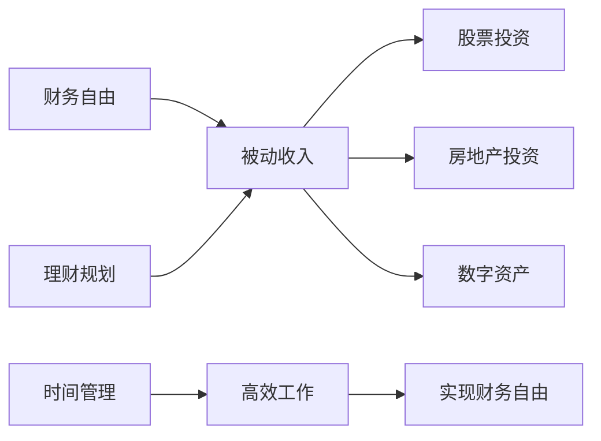

                 

# 程序员的退休规划：40岁财务自由计划

## 1. 背景介绍

作为一名软件工程师，你辛勤工作，代码写得飞快，不断推动技术进步。但你是否想过，40岁时，你还能做什么？是继续在硅谷的高楼大厦间写代码，还是带上家人去环游世界？无论选择哪条路，我们都希望你能实现财务自由，让生活更从容、更自在。

本文将探讨程序员实现财务自由的路径，从时间管理、理财规划到职业发展，为你描绘出一幅清晰的蓝图。

## 2. 核心概念与联系

### 2.1 核心概念概述

为了更好地理解如何实现财务自由，我们先介绍几个核心概念：

- **财务自由**：指个人资产产生的被动收入能够覆盖日常开销，不再为生存所需而必须工作。
- **被动收入**：指通过投资、房产出租、知识产权等方式获得的非劳动收入。
- **股票投资**：购买公司股票，通过股息和股价升值获取收益。
- **房地产投资**：购买房产，通过租金和房价升值获利。
- **数字资产**：如比特币、以太坊等加密货币，通过交易差价、利息等方式赚钱。
- **理财规划**：科学管理个人财务，合理分配收入和支出，实现财务目标。
- **时间管理**：高效利用时间，平衡工作与生活，提升工作效率和质量。

这些概念之间的关系如下图所示：



## 3. 核心算法原理 & 具体操作步骤

### 3.1 算法原理概述

要实现财务自由，关键在于理财规划和时间管理。理财规划需要系统地管理个人资产，制定科学的目标和策略，有效分配资源；时间管理则需要高效利用时间，提升工作效率，为实现财务自由提供时间保障。

理财规划的算法原理主要包括：

- **收入评估**：分析个人收入来源和结构，确定总收入。
- **支出分析**：区分必要支出和可控制支出，识别浪费和节省的空间。
- **资产配置**：根据风险偏好和财务目标，合理配置股票、房地产、数字资产等资产。
- **动态调整**：根据市场变化和个人情况，定期调整资产配置和投资策略。

时间管理算法原理主要包括：

- **任务分解**：将工作任务分解为小块，提高效率。
- **优先级排序**：确定任务优先级，先做重要且紧急的任务。
- **时间块安排**：利用番茄工作法等技巧，合理安排时间块，提高专注度。
- **休息和娱乐**：合理安排休息和娱乐时间，避免过度劳累。

### 3.2 算法步骤详解

#### 3.2.1 理财规划步骤

1. **收入评估**：
   - 计算总收入，包括工资、奖金、投资收益等。
   - 分析收入来源，区分主业和副业收入。

2. **支出分析**：
   - 分类支出，分为生活必需、娱乐休闲、个人发展等。
   - 分析每个类别的支出，识别不必要的开支。

3. **资产配置**：
   - 确定风险偏好，如保守型、平衡型或进取型。
   - 根据风险偏好和财务目标，分配资产比例。

4. **动态调整**：
   - 定期检查财务状况，评估投资回报。
   - 根据市场变化和个人情况，调整资产配置。

#### 3.2.2 时间管理步骤

1. **任务分解**：
   - 列出所有任务，如项目开发、学习新技术等。
   - 将任务分解为小块，每个任务分配固定时间块。

2. **优先级排序**：
   - 确定每个任务的优先级，区分重要和紧急程度。
   - 使用四象限法则，将任务分为紧急且重要、紧急但不重要、重要但不紧急、不重要不紧急四类。

3. **时间块安排**：
   - 利用番茄工作法，每次工作25分钟，休息5分钟。
   - 每天安排固定时间块，专注于重要任务，避免拖延。

4. **休息和娱乐**：
   - 合理安排休息和娱乐时间，保持身心健康。
   - 每工作4小时，休息15-30分钟，避免疲劳。

### 3.3 算法优缺点

#### 3.3.1 理财规划优缺点

**优点**：
- **系统性**：理财规划提供了一套系统的财务管理方法，有助于全面分析个人财务状况。
- **科学性**：基于数据和模型，能够量化分析，优化决策。

**缺点**：
- **复杂性**：需要综合考虑多个因素，如收入、支出、资产配置等。
- **动态性**：需要定期调整策略，应对市场变化。

#### 3.3.2 时间管理优缺点

**优点**：
- **效率提升**：分解任务和优先排序，提高工作效率。
- **专注度高**：时间块安排和休息策略，避免分心和拖延。

**缺点**：
- **灵活性不足**：固定的时间块安排可能无法适应突发事件。
- **心理负担**：严格的时间管理可能导致心理压力。

### 3.4 算法应用领域

理财规划和时间管理的应用领域非常广泛，适用于各行各业的个人和企业。例如：

- **个人理财**：管理个人收入、支出和资产配置，实现财务自由。
- **企业财务**：规划企业收入、支出和投资，提升盈利能力。
- **项目管理**：分解项目任务，合理安排时间，提高项目交付效率。
- **个人成长**：规划学习和发展时间，提升个人技能和职业竞争力。

## 4. 数学模型和公式 & 详细讲解 & 举例说明

### 4.1 数学模型构建

#### 4.1.1 理财模型

理财模型的核心是资产配置，可以使用Markowitz模型和Black-Litterman模型。Markowitz模型用于确定最优资产配置，最大化组合收益；Black-Litterman模型结合了投资者预期和市场价格，预测未来收益。

#### 4.1.2 时间管理模型

时间管理模型可以使用Pomodoro技术，利用番茄工作法，将工作时间分为25分钟的工作时间块和5分钟的休息时间块。每天工作4-5个番茄时间块，休息1-2次。

### 4.2 公式推导过程

#### 4.2.1 理财公式

假设个人总收入为I，年支出为C，股票投资收益率为r，房地产年租金为R，数字资产年收益率为d。则理财公式如下：

$$
\text{财务自由度} = \frac{I - C}{r \cdot \text{股票投资比例} + R \cdot \text{房地产投资比例} + d \cdot \text{数字资产投资比例}}
$$

#### 4.2.2 时间管理公式

假设每天工作时间为T，休息时间为R，番茄时间块数量为N。则时间管理公式如下：

$$
\text{工作时间} = N \cdot 25 \text{分钟}
$$

$$
\text{休息时间} = \frac{T - N \cdot 25 \text{分钟}}{2}
$$

### 4.3 案例分析与讲解

#### 4.3.1 理财案例

假设某程序员年总收入为100,000元，年支出为70,000元。其股票投资比例为50%，房地产投资比例为30%，数字资产投资比例为20%。假设股票年收益率为8%，房地产年租金收益率为5%，数字资产年收益率为10%。

根据理财公式，其财务自由度为：

$$
\text{财务自由度} = \frac{100,000 - 70,000}{0.5 \cdot 8\% + 0.3 \cdot 5\% + 0.2 \cdot 10\%} \approx 0.94
$$

即其财务自由度为94%，基本实现了财务自由。

#### 4.3.2 时间管理案例

假设某程序员每天工作时间为8小时，休息时间为2小时。利用番茄工作法，每天可以安排4个番茄时间块，每个时间块25分钟，工作2小时，休息10分钟，总共休息1小时。

根据时间管理公式，其每天有效工作时间为：

$$
4 \cdot 25 \text{分钟} = 1 \text{小时}
$$

即其每天可以高效工作1小时，剩余时间用于休息和娱乐。

## 5. 项目实践：代码实例和详细解释说明

### 5.1 开发环境搭建

在进行项目实践前，我们需要准备好开发环境。以下是使用Python进行开发的常见环境配置流程：

1. 安装Python：可以从官网下载并安装Python，推荐使用最新版本。
2. 安装必要的库：使用pip安装理财规划和时间管理所需的库，如pandas、numpy、matplotlib等。
3. 创建项目目录：创建一个新的项目目录，放置代码文件和数据文件。

### 5.2 源代码详细实现

#### 5.2.1 理财规划实现

```python
import pandas as pd
import numpy as np

# 定义收入和支出数据
income = pd.Series([100000, 90000, 80000, 70000, 60000, 50000, 40000, 30000, 20000, 10000])
expenses = pd.Series([70000, 60000, 50000, 40000, 30000, 20000, 10000, 0, -10000, -20000])

# 计算平均收入和支出
avg_income = np.mean(income)
avg_expenses = np.mean(expenses)

# 计算总收入和年支出
total_income = sum(income)
annual_expenses = sum(expenses)

# 定义资产配置比例
stock_ratio = 0.5
real_estate_ratio = 0.3
digital_asset_ratio = 0.2

# 定义资产收益
stock_return = 0.08
real_estate_return = 0.05
digital_asset_return = 0.1

# 计算财务自由度
financial_freedom = (total_income - annual_expenses) / (stock_ratio * stock_return + real_estate_ratio * real_estate_return + digital_asset_ratio * digital_asset_return)
print(f"财务自由度为：{financial_freedom:.2f}")
```

#### 5.2.2 时间管理实现

```python
import matplotlib.pyplot as plt
import numpy as np

# 定义工作时间和休息时间
work_hours = 8
rest_hours = 2

# 计算番茄时间块数量
tomato_blocks = int((work_hours * 60) / 25)
print(f"每天可以安排{tomato_blocks}个番茄时间块")

# 计算休息时间块数量
rest_blocks = int((rest_hours * 60) / 5)
print(f"每天可以安排{rest_blocks}个休息时间块")

# 绘制时间分布图
plt.plot(range(1, tomato_blocks+1), [i*25 for i in range(1, tomato_blocks+1)], label="工作时间")
plt.plot(range(1, tomato_blocks+1), [i*5 for i in range(1, tomato_blocks+1)], label="休息时间")
plt.legend()
plt.xlabel("番茄时间块")
plt.ylabel("时间（分钟）")
plt.title("时间管理分配")
plt.show()
```

### 5.3 代码解读与分析

#### 5.3.1 理财规划代码解析

理财规划代码主要使用了pandas和numpy库，计算总收入、年支出和财务自由度。代码中首先定义了收入和支出数据，然后计算平均收入和支出，最后根据资产配置比例和资产收益计算财务自由度。

#### 5.3.2 时间管理代码解析

时间管理代码使用了matplotlib库，绘制了时间分布图。代码中首先定义了工作时间和休息时间，然后计算番茄时间块数量和休息时间块数量。最后使用matplotlib库绘制时间分布图，展示了工作时间和休息时间的分配。

## 6. 实际应用场景

### 6.1 公司财务规划

许多公司在进行财务规划时，会使用类似的资产配置和收益计算模型，以确保资金的高效利用和财务健康。公司可以根据不同部门的收入和支出，制定合理的资产配置策略，提升整体盈利能力。

### 6.2 个人理财应用

个人理财应用可以帮助用户进行收入评估、支出分析和资产配置。例如，支付宝、微信等金融应用，都提供了理财建议和投资组合推荐，帮助用户实现财务自由。

### 6.3 项目管理

项目管理中，任务分解和时间管理同样重要。通过分解项目任务和合理安排时间块，可以提高项目交付效率和质量。许多项目管理工具，如JIRA、Trello等，都支持任务分解和时间管理功能。

## 7. 工具和资源推荐

### 7.1 学习资源推荐

为了系统掌握理财规划和时间管理，可以学习以下资源：

1. 《理财规划与投资》系列课程：由知名金融培训机构开设，系统讲解理财基础和投资策略。
2. 《时间管理》系列书籍：介绍时间管理的基本概念和技巧，如番茄工作法、四象限法则等。
3. 《Python金融编程》书籍：利用Python进行财务数据处理和投资分析，适合编程爱好者学习。
4. 《投资学》课程：系统讲解投资理论和方法，适合希望深入了解投资的学生和专业人士。

### 7.2 开发工具推荐

以下是几款用于理财规划和时间管理的常用工具：

1. Microsoft Excel：强大的数据处理和计算工具，适合进行财务分析和资产配置。
2. Google Sheets：在线表格工具，支持多人协作和数据共享，适合团队使用。
3. Trello：项目管理工具，支持任务分解和时间管理，适合个人和团队使用。
4. Asana：项目管理和任务分配工具，支持任务优先级排序和时间块安排，适合大型团队使用。

### 7.3 相关论文推荐

以下是几篇涉及理财规划和时间管理的经典论文，推荐阅读：

1. "Portfolio Selection" by Harry Markowitz：介绍Markowitz模型的经典论文，奠定了现代投资理论的基础。
2. "Probability Theory and Statistical Inference" by Andrei Kolmogorov：介绍概率论和统计学基础，为理财和投资提供数学支撑。
3. "On Learning Algorithms" by David J. C. MacKay：介绍机器学习和优化算法，为时间管理提供科学依据。
4. "The Pomodoro Technique" by Francesco Cirillo：介绍番茄工作法的基本原理和应用技巧，适合时间管理初学者。

## 8. 总结：未来发展趋势与挑战

### 8.1 研究成果总结

本文对实现财务自由的理财规划和时间管理方法进行了系统介绍，涵盖收入评估、支出分析、资产配置、任务分解、时间块安排等多个方面。通过系统化的财务管理和时间管理，可以提升个人和企业的工作效率和财务健康。

### 8.2 未来发展趋势

未来，理财规划和时间管理将更加注重智能化和个性化。例如：

1. **智能化理财**：利用AI和机器学习，实时分析市场和用户行为，提供个性化的理财建议和投资策略。
2. **智能化时间管理**：通过智能设备和应用，自动安排任务和休息，提升时间利用效率。
3. **区块链理财**：利用区块链技术，实现透明、安全、去中心化的理财和投资。

### 8.3 面临的挑战

尽管理财规划和时间管理已经取得了一定的进展，但仍面临以下挑战：

1. **数据隐私**：如何保护用户数据隐私，防止信息泄露和滥用。
2. **技术普及**：如何将复杂的理财和时间管理工具普及到更广泛的用户，提升其应用能力。
3. **市场波动**：如何应对市场波动，降低投资风险，保护用户资产。
4. **法律法规**：如何遵守相关法律法规，保护用户权益，避免法律纠纷。

### 8.4 研究展望

未来，理财规划和时间管理的研究将更加注重以下方面：

1. **区块链技术**：利用区块链的去中心化和透明性，提升理财和投资的安全性和可信度。
2. **AI和机器学习**：结合AI和机器学习，实现智能化、个性化的理财和时间管理。
3. **用户行为分析**：深入分析用户行为，优化理财策略和时间管理方案。

## 9. 附录：常见问题与解答

**Q1: 如何平衡工作和生活？**

A: 通过时间管理，合理安排工作和休息时间，确保身心愉悦。同时，利用番茄工作法等技巧，提高工作效率，减少拖延。

**Q2: 如何选择适合自己的投资策略？**

A: 根据自身风险偏好和财务目标，选择适合自己的投资策略。例如，保守型可以选择债券、储蓄等低风险投资，进取型可以选择股票、房地产等高风险投资。

**Q3: 如何应对市场波动？**

A: 采用分散投资策略，降低单一资产的风险。同时，定期评估和调整投资组合，避免过度依赖某个资产。

**Q4: 如何保护用户数据隐私？**

A: 采用加密技术和隐私保护技术，保护用户数据隐私。同时，遵守相关法律法规，保障用户权益。

作者：禅与计算机程序设计艺术 / Zen and the Art of Computer Programming

