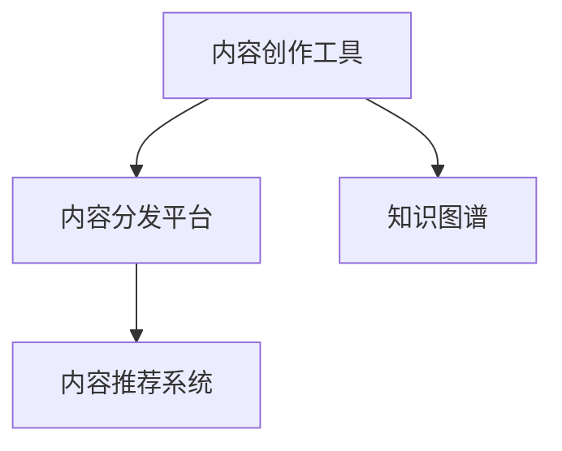

                 

# 程序员知识付费的内容创作工具链

> 关键词：知识付费、内容创作、内容分发、程序员、技术博文、学习资源推荐、开发工具推荐

## 1. 背景介绍

### 1.1 问题由来
随着知识付费市场的兴起，越来越多的人开始重视知识的重要性，特别是在IT行业。无论是编程初学者还是资深开发者，都渴望通过学习提升自身技能，快速掌握新技术。内容创作者逐渐崭露头角，他们的文章、视频、博客等形式的内容，为程序员提供了一条便捷的学习路径。然而，随着内容数量的激增，如何快速、高效、系统地创作高质量内容，成了众多内容创作者面临的挑战。

### 1.2 问题核心关键点
内容创作工具链（Content Creation Toolkit）是为程序员提供全方位支持的一套工具集，涵盖内容创作、内容分发、内容推荐等多个环节。其核心关键点在于：

1. **内容创作工具**：提供文本编辑器、代码编辑器、图形编辑器等工具，帮助创作者高效完成内容创作。
2. **内容分发平台**：提供内容分发渠道，如网站、博客、论坛、社区等，使内容能够快速到达用户手中。
3. **内容推荐系统**：通过机器学习算法，为用户推荐他们可能感兴趣的内容，提升用户粘性。
4. **知识图谱构建**：构建知识图谱，实现知识的结构化存储和检索，为内容创作提供丰富的知识背景。

本文将详细探讨这些关键点，并给出具体的实现方法和案例分析，帮助程序员搭建高效的内容创作工具链。

## 2. 核心概念与联系

### 2.1 核心概念概述

为了更好地理解内容创作工具链，我们首先介绍几个核心概念：

- **内容创作工具**：如Markdown编辑器、代码编辑器、绘图工具等，用于高效创作和编辑内容。
- **内容分发平台**：如微信公众号、知乎、GitHub等，帮助内容到达目标用户。
- **内容推荐系统**：如协同过滤、内容感知推荐算法等，提升内容推荐的精准度。
- **知识图谱**：由节点和边组成的有向图，用于存储和检索知识，提供知识支持。

这些概念之间的关系通过以下Mermaid流程图来展示：



这个流程图展示了内容创作工具链的关键环节及其相互作用关系：

1. 创作者使用内容创作工具进行内容创作。
2. 创作好的内容通过内容分发平台分发到目标用户。
3. 内容推荐系统通过分析用户行为，为用户推荐相关内容。
4. 知识图谱为创作者提供知识背景，提升内容深度。

## 3. 核心算法原理 & 具体操作步骤
### 3.1 算法原理概述

内容创作工具链的核心在于内容的创作、分发和推荐。其算法原理包括以下几个方面：

1. **内容创作算法**：文本生成、代码生成等算法，用于辅助内容创作者高效创作。
2. **内容分发算法**：SEO优化、社交网络传播等算法，提升内容的可见性和传播速度。
3. **内容推荐算法**：协同过滤、内容感知推荐、基于用户行为的数据分析等算法，提升内容的个性化推荐效果。

### 3.2 算法步骤详解

以下是内容创作工具链的算法步骤详解：

**Step 1: 内容创作工具的选择**
- 选择适合的文本编辑器（如Sublime Text、Visual Studio Code等）和代码编辑器（如PyCharm、VS Code等），确保创作的文本和代码质量高。
- 使用图形编辑器（如Adobe Illustrator、Inkscape等），为文章添加图表、流程图等可视化元素，提升文章可读性。

**Step 2: 内容分发平台的构建**
- 选择合适的内容分发平台（如微信公众号、知乎、Medium等），根据目标用户群体进行平台选择。
- 优化平台SEO，确保内容在搜索引擎中排名靠前，提高曝光率。
- 在平台上建立自己的专题或专栏，保持内容发布规律，提升用户粘性。

**Step 3: 内容推荐系统的搭建**
- 收集用户行为数据（如阅读历史、点赞、评论等），构建用户画像。
- 设计推荐算法（如基于用户的协同过滤算法、基于内容的推荐算法等），为用户推荐相关内容。
- 使用A/B测试不断优化推荐算法，提升推荐效果。

**Step 4: 知识图谱的构建**
- 定义知识图谱的节点和边，构建知识图谱。节点表示实体，边表示实体之间的关系。
- 使用自然语言处理技术（如实体识别、关系抽取等），自动构建知识图谱。
- 不断更新知识图谱，确保内容创作时能够获取最新、最全面的知识。

### 3.3 算法优缺点

内容创作工具链具有以下优点：
1. 提升内容创作效率。通过使用高效的工具，创作者可以快速生成高质量的内容。
2. 提升内容分发效率。内容分发平台可以快速将内容到达目标用户手中。
3. 提升内容推荐效果。通过推荐系统，用户可以更快地获取到自己感兴趣的内容。
4. 提升内容知识背景。知识图谱为创作者提供了丰富的知识背景，提升了内容深度。

同时，该方法也存在一些缺点：
1. 内容创作工具成本较高。高质量的工具通常需要付费购买或订阅。
2. 内容分发平台的推广成本高。需要花费大量时间和金钱来推广自己的内容。
3. 内容推荐算法复杂。推荐系统需要复杂的算法和技术支持。
4. 知识图谱构建困难。知识图谱的构建需要大量的人工干预和专业知识。

尽管存在这些缺点，但内容创作工具链提供了一整套解决方案，为程序员的内容创作和分发提供了全面的支持。

### 3.4 算法应用领域

内容创作工具链在多个领域得到了广泛应用，例如：

- 编程教育：通过知识图谱和内容推荐，帮助学生学习编程知识。
- 技术博客：通过内容创作工具和分发平台，技术博客作者能够快速创作和发布高质量文章。
- 技术分享：通过知识图谱和推荐系统，开发者可以更好地分享自己的技术经验和项目经验。
- 技术招聘：通过内容创作和分发，企业可以发布技术岗位需求，吸引合适的人才。

这些应用场景展示了内容创作工具链的强大功能，为程序员提供了便捷的技术学习和分享平台。

## 4. 数学模型和公式 & 详细讲解 & 举例说明

### 4.1 数学模型构建

内容创作工具链涉及多个数学模型，以下是几个重要的数学模型及其构建方法：

1. **内容创作模型**：文本生成模型，如循环神经网络（RNN）、长短期记忆网络（LSTM）、变分自编码器（VAE）等。
2. **内容分发模型**：网页排名模型，如PageRank、NDCG等。
3. **内容推荐模型**：协同过滤模型，如基于用户的协同过滤、基于物品的协同过滤等。

### 4.2 公式推导过程

以下是文本生成模型的公式推导过程：

假设文本为 $X=\{x_1,x_2,...,x_n\}$，其中 $x_i$ 为第 $i$ 个单词。使用RNN模型进行文本生成，目标是最小化损失函数：

$$
\mathcal{L}=\sum_{i=1}^n \ell(x_i, \hat{x}_i)
$$

其中 $\ell$ 为损失函数，$\hat{x}_i$ 为模型生成的单词。假设模型使用softmax函数进行输出，则目标函数为：

$$
\mathcal{L}=-\sum_{i=1}^n \sum_{j=1}^V \log P_j(x_i)
$$

其中 $V$ 为词汇表大小，$P_j(x_i)$ 表示第 $j$ 个单词 $x_i$ 出现的概率。

### 4.3 案例分析与讲解

**案例1: 文本生成**
- 使用GPT-2模型进行文本生成，生成一段关于编程技术的介绍性文章。

**案例2: 代码生成**
- 使用Codex模型生成Python代码，实现一个简单的算法实现。

**案例3: 内容推荐**
- 使用协同过滤算法，为用户推荐其可能感兴趣的技术文章。

## 5. 项目实践：代码实例和详细解释说明

### 5.1 开发环境搭建

在进行内容创作工具链的实践前，我们需要准备好开发环境。以下是使用Python进行开发的环境配置流程：

1. 安装Anaconda：从官网下载并安装Anaconda，用于创建独立的Python环境。

2. 创建并激活虚拟环境：
```bash
conda create -n content-env python=3.8 
conda activate content-env
```

3. 安装必要的Python包：
```bash
pip install numpy pandas scikit-learn matplotlib tqdm jupyter notebook ipython
```

4. 安装内容创作工具和平台：
- Sublime Text
- Visual Studio Code
- PyCharm
- GitHub
- Medium

完成上述步骤后，即可在`content-env`环境中开始内容创作工具链的实践。

### 5.2 源代码详细实现

以下是一个使用Python进行文本生成的简单实现，用于生成一段关于编程技术的介绍性文章。

```python
from transformers import GPT2Tokenizer, GPT2LMHeadModel

# 加载预训练模型和分词器
model_name = 'gpt2'
tokenizer = GPT2Tokenizer.from_pretrained(model_name)
model = GPT2LMHeadModel.from_pretrained(model_name)

# 定义文本生成函数
def generate_text(prompt, length=100, temperature=0.8):
    tokens = tokenizer.encode(prompt, return_tensors='pt')
    generated_ids = model.generate(tokens, max_length=length, temperature=temperature, num_return_sequences=1)
    return tokenizer.decode(generated_ids[0], skip_special_tokens=True)

# 生成文本
text = generate_text("Python是一门非常流行的编程语言，它在许多领域都有广泛应用。")
print(text)
```

### 5.3 代码解读与分析

这段代码展示了使用GPT-2模型进行文本生成的过程。首先，加载预训练模型和分词器。然后，定义一个文本生成函数，该函数使用模型生成文本，并返回生成的文本。最后，调用该函数生成一段关于编程技术的介绍性文章。

在实践中，可以使用更多的数据和更复杂的模型，如Codex模型、GPT-3模型等，以获得更好的生成效果。此外，还可以引入更多的预训练语言模型和相关技术，如注意力机制、Transformer结构等，提升文本生成的质量。

## 6. 实际应用场景

### 6.1 编程教育

内容创作工具链在编程教育领域有着广泛的应用，如编程课程的在线教学、技术博客的分享等。通过内容创作工具链，学生和开发者可以轻松地创作高质量的教学内容和技术分享文章，提升学习效果。

### 6.2 技术博客

技术博客是程序员分享技术经验和项目经验的常见方式。通过内容创作工具链，技术博主可以快速创作并发布高质量的技术文章，提升自身影响力和技术社区的活跃度。

### 6.3 技术分享

技术分享平台如Stack Overflow、GitHub等，通过内容创作工具链，开发者可以更好地分享自己的技术经验和项目经验，帮助他人解决实际问题，提升技术社区的氛围。

### 6.4 未来应用展望

随着内容创作工具链的不断发展，未来的应用场景将更加广泛，技术应用也将更加深入。

- 在编程教育领域，内容创作工具链将提供更加系统化的学习资源和互动平台。
- 在技术博客和分享领域，内容创作工具链将提供更加便捷的创作和分享渠道。
- 在技术招聘领域，内容创作工具链将提供更加高效的招聘发布和展示平台。

总之，内容创作工具链将为程序员提供全方位的技术支持，帮助他们更好地创作、分享和获取技术知识。未来，内容创作工具链将在更多的技术场景中发挥重要作用，为技术社区的繁荣发展提供强大动力。

## 7. 工具和资源推荐

### 7.1 学习资源推荐

为了帮助程序员系统掌握内容创作工具链的理论基础和实践技巧，这里推荐一些优质的学习资源：

1. **《自然语言处理综论》（Theoretical Foundations of Natural Language Processing）**：深入介绍自然语言处理的基本理论和模型，为内容创作提供理论基础。
2. **《深度学习》（Deep Learning）**：由Ian Goodfellow、Yoshua Bengio和Aaron Courville撰写的经典教材，详细讲解深度学习的基本概念和算法。
3. **《Python编程》（Python Programming）**：由Eric Matthes撰写的Python编程入门书籍，适合初学者快速上手Python编程。
4. **《机器学习实战》（Hands-On Machine Learning with Scikit-Learn and TensorFlow）**：由Aurélien Géron撰写的实战指南，通过丰富的案例讲解机器学习的基本操作。
5. **《数据科学实战》（Data Science from Scratch）**：由Joel Grus撰写的数据科学入门书籍，通过Python实现数据科学的基本操作。

通过对这些资源的学习实践，相信你一定能够快速掌握内容创作工具链的理论基础和实践技巧，并将其应用于技术内容创作中。

### 7.2 开发工具推荐

高效的开发离不开优秀的工具支持。以下是几款用于内容创作工具链开发的常用工具：

1. **Sublime Text**：轻量级文本编辑器，支持语法高亮、代码补全等功能。
2. **Visual Studio Code**：全功能的代码编辑器，支持丰富的插件和扩展。
3. **PyCharm**：专业的Python集成开发环境，支持代码调试、版本控制等功能。
4. **GitHub**：全球最大的代码托管平台，支持代码版本控制和团队协作。
5. **Medium**：内容分发平台，支持多种内容格式和自动化发布。
6. **Jupyter Notebook**：轻量级的Python开发环境，支持交互式代码和数据可视化。

合理利用这些工具，可以显著提升内容创作工具链的开发效率，加快创新迭代的步伐。

### 7.3 相关论文推荐

内容创作工具链的发展源于学界的持续研究。以下是几篇奠基性的相关论文，推荐阅读：

1. **"Attention Is All You Need"**：提出了Transformer结构，开启了NLP领域的预训练大模型时代。
2. **"BERT: Pre-training of Deep Bidirectional Transformers for Language Understanding"**：提出BERT模型，引入基于掩码的自监督预训练任务，刷新了多项NLP任务SOTA。
3. **"Large-Scale NLP Pretraining for Diverse Tasks"**：提出Codex模型，使用大规模语料进行预训练，提升了代码生成的效果。
4. **"Recurrent Neural Network Architectures for Multitask Learning"**：提出RNN架构，用于多任务学习，提升了文本生成的多样性和准确性。
5. **"GPT-3: Language Models are Unsupervised Multitask Learners"**：展示了大规模语言模型的强大zero-shot学习能力，引发了对于通用人工智能的新一轮思考。

这些论文代表了大语言模型和微调技术的发展脉络。通过学习这些前沿成果，可以帮助研究者把握学科前进方向，激发更多的创新灵感。

## 8. 总结：未来发展趋势与挑战

### 8.1 总结

本文对内容创作工具链进行了全面系统的介绍。首先阐述了内容创作工具链的研究背景和意义，明确了内容创作工具链在编程教育、技术博客、技术分享等NLP任务中的应用价值。其次，从原理到实践，详细讲解了内容创作工具链的数学原理和关键步骤，给出了内容创作工具链的完整代码实例。同时，本文还广泛探讨了内容创作工具链在多个行业领域的应用前景，展示了内容创作工具链的巨大潜力。此外，本文精选了内容创作工具链的学习资源和开发工具，力求为读者提供全方位的技术指引。

通过本文的系统梳理，可以看到，内容创作工具链为程序员提供了一整套高效的内容创作解决方案，极大地提升了内容创作的效率和质量。内容创作工具链的发展，为程序员的技术学习和分享提供了强大的支持，必将推动技术社区的繁荣发展。未来，伴随内容创作工具链的不断演进，相信NLP技术将在更多的技术场景中发挥重要作用，为技术社区的繁荣发展提供强大动力。

### 8.2 未来发展趋势

展望未来，内容创作工具链将呈现以下几个发展趋势：

1. **内容创作的自动化**：随着人工智能技术的发展，内容创作将更多地依赖于自动化工具，减少人工干预。
2. **内容的个性化推荐**：通过机器学习算法，内容创作工具链将更好地理解用户需求，提供个性化内容推荐。
3. **内容的实时化生成**：内容创作工具链将实时生成内容，适应快速变化的新闻、技术等领域。
4. **内容的全球化传播**：内容创作工具链将打破地域限制，实现全球范围内的内容传播。
5. **内容的跨模态融合**：内容创作工具链将融合视觉、语音等多模态信息，提升内容的丰富性和多样性。
6. **内容的知识化集成**：内容创作工具链将与知识图谱等知识库结合，提升内容的深度和广度。

以上趋势展示了内容创作工具链的广阔前景。这些方向的探索发展，必将进一步提升内容创作工具链的性能和应用范围，为程序员提供更加便捷、高效、智能的内容创作环境。

### 8.3 面临的挑战

尽管内容创作工具链已经取得了瞩目成就，但在迈向更加智能化、普适化应用的过程中，它仍面临着诸多挑战：

1. **内容的真实性**：内容创作工具链生成的内容可能存在虚假、错误、误导性信息，需要严格的审核和筛选。
2. **内容的版权**：内容创作工具链生成的内容可能涉及版权问题，需要明确的版权声明和授权机制。
3. **内容的偏见**：内容创作工具链生成的内容可能带有偏见和歧视，需要消除算法偏见，确保内容公正、公平。
4. **内容的适配性**：内容创作工具链生成的内容可能不适合特定领域或特定人群，需要适应性改进。
5. **内容的可解释性**：内容创作工具链生成的内容可能缺乏可解释性，需要改进算法设计，增强内容可解释性。

这些挑战需要内容创作者和开发者共同努力，通过优化算法、增加人工审核、引入版权声明等手段，逐步克服。

### 8.4 研究展望

面向未来，内容创作工具链需要在以下几个方面寻求新的突破：

1. **内容创作的智能化**：通过人工智能技术，实现内容创作的自动化、智能化，提升内容创作的效率和质量。
2. **内容的个性化推荐**：通过机器学习算法，实现内容的个性化推荐，提升用户满意度和粘性。
3. **内容的实时化生成**：通过实时生成技术，适应快速变化的新闻、技术等领域，提升内容的时效性。
4. **内容的跨模态融合**：通过多模态融合技术，提升内容的丰富性和多样性。
5. **内容的知识化集成**：通过知识图谱等知识库，提升内容的深度和广度，增强内容的专业性和权威性。
6. **内容的可解释性**：通过改进算法设计，增强内容可解释性，提升用户信任度和接受度。

这些研究方向的探索，必将引领内容创作工具链技术迈向更高的台阶，为程序员提供更加高效、智能、普适的内容创作环境。

## 9. 附录：常见问题与解答

**Q1：内容创作工具链是否适用于所有技术内容创作？**

A: 内容创作工具链在大多数技术内容创作中都能取得不错的效果，特别是在内容创作难度较高、涉及领域较广的场景中，能够显著提升内容创作的效率和质量。但对于一些需要极高技术含量和深度的技术内容创作，如高精度的技术白皮书、复杂的技术论文等，内容创作工具链可能无法完全替代人工创作。

**Q2：如何选择合适的内容创作工具？**

A: 选择合适的内容创作工具需要考虑多个因素，包括文本编辑器、代码编辑器、绘图工具等。根据具体需求，选择适合的工具进行内容创作。

**Q3：内容创作工具链如何适配不同平台？**

A: 内容创作工具链适配不同平台需要进行平台适配和数据转换。具体适配方法包括使用不同的API接口、数据格式转换等。

**Q4：内容创作工具链如何提升内容质量？**

A: 提升内容质量需要多方面的努力，包括使用高质量的预训练模型、优化算法、增加人工审核等。通过综合使用多种手段，提升内容创作的质量。

**Q5：内容创作工具链的未来发展方向是什么？**

A: 内容创作工具链的未来发展方向包括内容的自动化、智能化、个性化推荐、跨模态融合、知识化集成等。这些方向将进一步提升内容创作的效率和质量，拓展内容创作的边界。

---

作者：禅与计算机程序设计艺术 / Zen and the Art of Computer Programming

