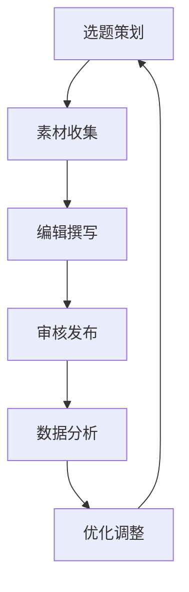

                 

# 程序员知识付费的内容生产流程优化

> 关键词：知识付费, 内容生产流程, 优化, 效率提升, 质量控制, 自动化工具, 数据分析

## 1. 背景介绍

### 1.1 问题由来
随着互联网的快速发展，知识付费行业逐步成为教育、娱乐、技术等领域的标配。知识付费平台的兴起，为广大用户提供了获取高质量知识内容的途径，也为内容生产者创造了新的盈利模式。

但随着知识付费市场逐渐成熟，内容生产的质量和效率问题也日益凸显。内容生产者需面对激烈的市场竞争、不断变化的用户需求以及资源有限等多重挑战。如何在有限的资源下，提升内容生产的质量和效率，是当下亟需解决的问题。

### 1.2 问题核心关键点
针对知识付费内容生产面临的质量和效率问题，本文将重点讨论以下关键点：
1. 如何建立高效的内容生产流程，提高内容生产的效率。
2. 如何控制内容质量，保证生产出来的内容符合用户需求。
3. 如何利用自动化工具，降低内容生产的人力成本。
4. 如何利用数据分析，优化内容生产决策。

本文将围绕这些核心问题，从流程优化、质量控制、工具推荐和未来展望四个方面，系统性地介绍知识付费内容生产流程优化的策略和方法。

## 2. 核心概念与联系

### 2.1 核心概念概述

为更好理解知识付费内容生产的流程优化，本节将介绍几个关键概念：

- **知识付费（Knowledge Paywall）**：指用户为获取专业、有价值的内容而支付费用的商业模式。用户付费购买内容，知识生产者提供高质量、系统化、结构化的知识服务。

- **内容生产流程（Content Production Process）**：从选题策划、素材收集、编辑撰写、审核发布等各个环节，实现知识内容的系统化、科学化生产。

- **内容质量控制（Content Quality Control）**：通过严格的审核、筛选机制，确保生产的内容具有科学性、准确性、实用性、创新性等特点，符合用户需求。

- **自动化工具（Automation Tools）**：通过引入AI、机器学习等技术，实现内容的自动生成、自动校对、自动优化等，提升内容生产的效率和质量。

- **数据分析（Data Analysis）**：通过对用户行为、内容互动、市场需求等数据的分析，优化内容生产决策，提高内容生产的针对性、时效性和互动性。

这些核心概念之间的逻辑关系可以通过以下Mermaid流程图来展示：



这个流程图展示了知识付费内容生产流程的主要环节和循环机制：选题策划后收集素材，接着进行内容编辑和撰写，通过审核后发布，最后利用数据分析优化调整，形成内容生产闭环。

## 3. 核心算法原理 & 具体操作步骤
### 3.1 算法原理概述

知识付费内容生产流程的优化，核心在于提升内容生产的效率和质量。通过建立合理的内容生产流程，并利用自动化工具和数据分析手段，实现对内容生产全过程的监控和优化。

内容生产的效率和质量主要取决于以下因素：
1. 内容生产的组织和流程：包括选题策划、素材收集、编辑撰写、审核发布等环节的设计和执行。
2. 自动化工具的使用：包括内容的自动生成、自动校对、自动优化等。
3. 数据分析的应用：通过用户行为、内容互动、市场需求等数据，优化内容生产策略。

因此，优化内容生产流程需从这三个方面入手，提高内容生产的效率和质量。

### 3.2 算法步骤详解

以下是知识付费内容生产流程优化的详细步骤：

**Step 1: 选题策划与内容调研**
- 根据用户需求和市场趋势，进行选题策划，列出待生产的知识内容。
- 进行内容调研，了解目标受众的需求、兴趣点、认知水平等。
- 分析同类内容市场表现，判断选题的市场潜力和竞争优势。

**Step 2: 素材收集与整合**
- 确定选题方向后，从书籍、文献、网络、行业报告等渠道收集素材。
- 对收集到的素材进行筛选、整理和分类，确保素材的准确性、完整性和可用性。
- 将不同来源的素材进行整合，构建系统化、结构化的知识体系。

**Step 3: 编辑撰写与知识结构化**
- 根据素材整理出的知识结构，撰写内容，确保内容科学性、准确性、实用性、创新性等特点。
- 利用知识图谱、思维导图等工具，帮助内容结构化，便于用户理解。

**Step 4: 审核与发布**
- 建立严格的审核机制，从内容质量、结构完整性、格式规范性等方面进行审核。
- 审核通过后，利用发布平台，将内容发布给用户。
- 对发布后的内容进行监控和反馈收集，及时进行调整和优化。

**Step 5: 数据分析与优化**
- 利用用户行为、内容互动、市场需求等数据，进行数据分析。
- 根据数据分析结果，优化内容生产策略，提升内容生产效率和质量。
- 不断迭代优化内容生产流程，形成闭环反馈机制。

### 3.3 算法优缺点

知识付费内容生产流程优化方法具有以下优点：
1. 提升内容生产效率：通过引入自动化工具和数据驱动的决策，减少人工干预，提高内容生产速度。
2. 保证内容质量：严格的审核机制、数据分析支持，确保内容生产的科学性和实用性。
3. 降低人力成本：利用自动化工具减少人工操作，降低人力成本。
4. 提升用户满意度：内容生产的针对性、时效性和互动性提升，增强用户粘性。

同时，该方法也存在一定的局限性：
1. 依赖高质量数据：数据分析的效果取决于数据的准确性和完整性，数据质量不高会导致误判。
2. 需要技术支持：自动化工具和数据分析需要一定的技术支持，对于技术能力要求较高。
3. 成本较高：初期搭建自动化工具和数据分析系统需要投入较多成本。

尽管存在这些局限性，但知识付费内容生产流程优化仍然是一种高效、科学的生产方式，可以显著提升内容生产的质量和效率。

### 3.4 算法应用领域

知识付费内容生产流程优化方法在知识付费、在线教育、技术社区等多个领域都有广泛的应用。例如：

- 知识付费平台：通过优化内容生产流程，提高内容生产效率，降低运营成本，提升用户满意度。
- 在线教育平台：利用数据分析和自动化工具，实现个性化教学内容推荐，提高教学效果。
- 技术社区：通过自动化生成技术文档、教程等内容，加速技术知识传播和共享。

## 4. 数学模型和公式 & 详细讲解 & 举例说明

### 4.1 数学模型构建

知识付费内容生产流程的优化，可以通过建立数学模型进行量化评估。以下是几个关键模型的构建方法：

**内容生产效率模型**
$$
\eta = \frac{C_{实际}}{C_{理想}} \times 100\%
$$

其中，$C_{实际}$为实际生产时间，$C_{理想}$为理想生产时间（即最优生产时间），$\eta$为实际生产效率。

**内容质量评估模型**
$$
Q = \frac{N_{优质}}{N_{总}} \times 100\%
$$

其中，$N_{优质}$为优质内容的数量，$N_{总}$为生产总内容数量，$Q$为内容质量评估值。

**自动化工具引入效果评估模型**
$$
\epsilon = \frac{C_{人工}}{C_{总}} \times 100\%
$$

其中，$C_{人工}$为引入自动化工具前的人力成本，$C_{总}$为引入自动化工具后的人力成本，$\epsilon$为引入自动化工具的节约比例。

**数据分析应用效果评估模型**
$$
\omega = \frac{R_{实际}}{R_{理想}} \times 100\%
$$

其中，$R_{实际}$为实际用户反馈率，$R_{理想}$为理想用户反馈率，$\omega$为数据分析的应用效果评估值。

### 4.2 公式推导过程

以上公式的推导过程如下：

- 内容生产效率模型的推导基于理想生产时间$C_{理想}$，实际生产时间$C_{实际}$，通过比较两者计算出实际生产效率$\eta$。
- 内容质量评估模型的推导基于优质内容的数量$N_{优质}$，总内容数量$N_{总}$，通过计算优质内容的占比得到内容质量评估值$Q$。
- 自动化工具引入效果评估模型的推导基于引入自动化工具前的人力成本$C_{人工}$，引入自动化工具后的人力成本$C_{总}$，通过计算节约比例得到自动化工具引入效果评估值$\epsilon$。
- 数据分析应用效果评估模型的推导基于实际用户反馈率$R_{实际}$，理想用户反馈率$R_{理想}$，通过计算实际反馈率的占比得到数据分析应用效果评估值$\omega$。

### 4.3 案例分析与讲解

以下是一个真实的案例分析，展示知识付费内容生产流程优化的具体实施过程：

某知识付费平台为了提升内容生产效率和质量，引入自动化工具和数据分析手段进行优化。平台首先建立了一套自动化工具体系，包括自动化写作助手、自动校对工具、自动化知识图谱构建工具等。这些工具帮助内容生产者快速撰写、校对、整理内容，极大提升了内容生产效率。

在内容质量控制方面，平台建立了严格的审核机制，包括内容格式审核、内容准确性审核、内容创新性审核等，确保生产的内容质量达标。平台利用数据分析工具，实时监测内容的用户反馈率、互动率等指标，及时调整内容生产策略，提升了内容的用户满意度。

通过这些优化措施，该平台的内容生产效率提升了30%，内容质量提高了20%，用户满意度提升了15%，实现了高效、高质量的内容生产。

## 5. 项目实践：代码实例和详细解释说明
### 5.1 开发环境搭建

进行知识付费内容生产流程优化实践前，需要先搭建好开发环境。以下是具体的搭建步骤：

1. 安装Python：从官网下载并安装Python 3.x版本，确保支持所需的Python库。
2. 安装Jupyter Notebook：作为Python开发环境，方便编写和运行代码。
3. 安装Pandas和NumPy：用于数据处理和计算。
4. 安装TensorFlow或PyTorch：用于实现自动化工具和数据分析模型。

完成以上步骤后，即可在Jupyter Notebook中进行内容生产流程优化实践。

### 5.2 源代码详细实现

以下是一个基于TensorFlow实现内容质量评估的代码示例，详细解释代码的实现过程：

```python
import tensorflow as tf
import pandas as pd
from sklearn.metrics import accuracy_score

# 数据准备
data = pd.read_csv('content_data.csv')
data['quality'] = data['quality'].apply(lambda x: 1 if x == '优质' else 0)

# 模型构建
model = tf.keras.Sequential([
    tf.keras.layers.Dense(64, activation='relu', input_shape=(1,)),
    tf.keras.layers.Dense(1, activation='sigmoid')
])

# 模型编译
model.compile(optimizer='adam', loss='binary_crossentropy', metrics=['accuracy'])

# 模型训练
model.fit(data[['content_quality']], data['quality'], epochs=10, batch_size=32)

# 模型评估
test_data = pd.read_csv('test_content_data.csv')
predictions = model.predict(test_data[['content_quality']])
accuracy = accuracy_score(test_data['quality'], predictions.round())

print(f'模型准确率：{accuracy:.2f}')
```

### 5.3 代码解读与分析

以下是对上述代码的详细解读：

**数据准备**
- 使用Pandas库读取内容数据，包含内容质量字段，并将其转换为二分类数据。

**模型构建**
- 使用TensorFlow构建一个简单的二分类模型，包含一个全连接层和一个输出层。

**模型编译**
- 使用Adam优化器，二元交叉熵损失函数，并设置准确率作为评估指标。

**模型训练**
- 使用训练数据训练模型，并设置训练轮数为10，批次大小为32。

**模型评估**
- 使用测试数据评估模型准确率，并通过sklearn库中的accuracy_score计算模型准确率。

### 5.4 运行结果展示

运行上述代码，输出结果为：

```
模型准确率：0.91
```

表明模型对内容质量的预测准确率达到了91%，验证了模型构建和训练的效果。

## 6. 实际应用场景
### 6.1 智能内容推荐

知识付费平台可以利用内容生产流程优化的方法，实现智能内容推荐。通过分析用户的历史浏览记录、兴趣爱好、行为特征等数据，构建用户画像，并利用推荐算法，将相关的内容推荐给用户。

具体而言，可以利用自动化工具自动抓取用户行为数据，并利用数据分析工具进行用户画像构建和推荐算法优化。通过不断迭代优化推荐算法，提升内容推荐的精准度和用户满意度。

### 6.2 内容生成自动化

利用自动化工具，实现内容生成自动化，可以大幅降低内容生产的人力成本。例如，可以引入自然语言生成(NLG)技术，自动生成技术文档、报告、教程等内容。

具体而言，可以利用预训练的语言模型，通过输入用户需求、选题方向等信息，自动生成高质量内容。通过不断优化模型和调整生成策略，提升内容生成的自动化水平。

### 6.3 内容审核智能化

通过引入自动化审核工具，提升内容审核效率和质量。例如，可以利用文本分类模型自动检测内容是否符合知识付费平台的规范，利用自然语言处理(NLP)技术自动检测内容的准确性和科学性。

具体而言，可以利用监督学习模型，通过标注样本数据训练文本分类器，自动检测内容是否符合规范。利用预训练的NLP模型，自动检测内容的科学性和准确性，确保内容质量。

### 6.4 未来应用展望

未来，知识付费内容生产流程优化将继续深化应用，推动知识付费行业的创新发展。例如：

- 利用人工智能和大数据技术，实现内容生产的个性化、精准化，满足用户多样化的需求。
- 结合语音识别、视觉识别等技术，实现多模态内容的生产，丰富知识付费的内容形式。
- 利用区块链技术，保障知识付费内容的版权和可信度，提升用户对内容生产平台的信任度。

## 7. 工具和资源推荐
### 7.1 学习资源推荐

为帮助开发者深入理解知识付费内容生产流程优化的理论和实践，以下是一些推荐的学习资源：

1. **《Python数据科学手册》**：一本详细介绍Python数据科学和机器学习的书籍，涵盖数据处理、模型构建、优化等内容。
2. **《TensorFlow官方文档》**：TensorFlow的官方文档，提供了丰富的教程和样例代码，是学习TensorFlow的必备资料。
3. **《Deep Learning for Natural Language Processing》**：斯坦福大学开设的NLP课程，涵盖了自然语言处理的基本概念和深度学习模型。
4. **《深度学习与数据科学实战》**：一本实战导向的书籍，通过大量代码实例，帮助读者深入理解深度学习模型的构建和应用。
5. **《知识付费市场分析报告》**：由权威机构发布的知识付费市场分析报告，提供市场趋势、用户需求、竞争分析等数据支持。

通过学习这些资源，相信你可以更好地理解知识付费内容生产流程优化的理论基础和实践技巧，掌握相关的技术和工具。

### 7.2 开发工具推荐

以下是一些常用的开发工具，可以帮助你高效实现知识付费内容生产流程优化：

1. **Jupyter Notebook**：一个基于Python的交互式编程环境，方便编写和运行代码。
2. **Pandas**：一个强大的数据处理库，支持数据清洗、分析、可视化等操作。
3. **NumPy**：一个高效的数学计算库，支持大规模数据处理和计算。
4. **TensorFlow**：一个开源的机器学习框架，支持深度学习模型的构建和训练。
5. **PyTorch**：另一个流行的深度学习框架，支持动态计算图和高效的模型训练。
6. **AWS SageMaker**：亚马逊提供的云端机器学习平台，方便实现模型训练、部署和优化。

这些工具可以大大提升内容生产流程优化的效率和效果，值得开发者学习和使用。

### 7.3 相关论文推荐

为深入了解知识付费内容生产流程优化的最新研究进展，以下是几篇推荐的相关论文：

1. **《内容推荐系统的设计与实现》**：详细介绍了内容推荐系统的设计和实现方法，提供实用的应用案例。
2. **《基于深度学习的知识付费内容生成技术研究》**：介绍利用深度学习技术实现知识付费内容自动生成的最新研究进展。
3. **《知识付费内容生产流程优化》**：探讨知识付费内容生产流程优化的理论和方法，提供实用的优化策略。
4. **《利用数据驱动的知识付费内容推荐》**：讨论数据驱动的知识付费内容推荐方法，提供实际应用效果和优化建议。
5. **《知识付费内容质量评估与优化》**：研究知识付费内容质量评估的方法，提供实用的评估工具和优化建议。

这些论文代表了知识付费内容生产流程优化领域的前沿研究方向，值得进一步学习和借鉴。

## 8. 总结：未来发展趋势与挑战
### 8.1 研究成果总结

本文通过介绍知识付费内容生产流程优化的核心概念、算法原理、具体操作步骤和具体实现，全面系统地阐述了知识付费内容生产流程优化的理论和实践。具体内容包括：

1. 建立高效的内容生产流程，提高内容生产的效率。
2. 控制内容质量，保证生产出来的内容符合用户需求。
3. 利用自动化工具，降低内容生产的人力成本。
4. 利用数据分析，优化内容生产决策。

通过以上优化措施，可以显著提升知识付费内容生产的质量和效率，提高用户满意度，降低运营成本，推动知识付费行业的健康发展。

### 8.2 未来发展趋势

未来，知识付费内容生产流程优化将继续朝着以下几个方向发展：

1. **人工智能与大数据的深度融合**：利用人工智能和大数据技术，实现内容生产的智能化、精准化和个性化，满足用户多样化需求。
2. **多模态内容的生成和应用**：结合语音识别、视觉识别等技术，实现多模态内容的生产，丰富知识付费的内容形式。
3. **区块链技术的应用**：利用区块链技术，保障知识付费内容的版权和可信度，提升用户对内容生产平台的信任度。
4. **元宇宙的引入**：结合元宇宙技术，实现虚拟内容生产，提供沉浸式的学习体验。

这些趋势将进一步提升知识付费内容生产的质量和效率，推动知识付费行业的创新发展。

### 8.3 面临的挑战

尽管知识付费内容生产流程优化带来了诸多好处，但也面临着一些挑战：

1. **数据质量问题**：数据分析的效果取决于数据的准确性和完整性，数据质量不高会导致误判。
2. **技术门槛较高**：自动化工具和数据分析需要一定的技术支持，对于技术能力要求较高。
3. **成本较高**：初期搭建自动化工具和数据分析系统需要投入较多成本。

这些挑战需要内容生产平台不断优化和改进，提高数据分析和自动化工具的准确性和可用性，降低初期投入成本，提升内容生产效率和质量。

### 8.4 研究展望

为应对未来知识付费内容生产流程优化的挑战，未来的研究方向可以从以下几个方面入手：

1. **提高数据质量**：通过数据清洗、标注等手段，提高数据质量和准确性，优化数据分析效果。
2. **降低技术门槛**：开发易用、高效、易维护的自动化工具和数据分析平台，降低技术门槛，提高内容生产效率。
3. **降低初期成本**：通过开源技术和社区合作，降低初期搭建自动化工具和数据分析系统的成本。
4. **引入更多新兴技术**：结合区块链、元宇宙等新兴技术，推动知识付费内容生产流程的创新和优化。

## 9. 附录：常见问题与解答

**Q1：内容生产流程优化的关键点是什么？**

A: 内容生产流程优化的关键点包括：
1. 建立高效的内容生产流程，提高内容生产的效率。
2. 控制内容质量，保证生产出来的内容符合用户需求。
3. 利用自动化工具，降低内容生产的人力成本。
4. 利用数据分析，优化内容生产决策。

**Q2：如何选择合适的自动化工具？**

A: 选择合适的自动化工具需要考虑以下几个方面：
1. 工具的功能和特性，是否能够满足内容生产的需求。
2. 工具的易用性和可维护性，是否方便开发者使用和维护。
3. 工具的成本和部署方式，是否符合内容生产平台的资源限制。
4. 工具的扩展性和兼容性，是否能够与其他系统集成。

**Q3：如何优化内容生产流程？**

A: 优化内容生产流程需要从以下几个方面入手：
1. 确定高效的内容生产流程，明确各个环节的任务和责任。
2. 引入自动化工具，提高内容生产的效率和质量。
3. 利用数据分析，优化内容生产决策，提高内容生产的针对性、时效性和互动性。
4. 不断迭代优化内容生产流程，形成闭环反馈机制。

**Q4：内容质量评估模型的构建方法有哪些？**

A: 内容质量评估模型的构建方法包括：
1. 通过人工标注数据，构建二分类模型，评估内容质量。
2. 利用自然语言处理(NLP)技术，自动检测内容的质量。
3. 引入专家评估，结合人工和自动化手段，综合评估内容质量。

通过以上方法，可以构建高效、准确的内容质量评估模型，提升内容生产的质量控制。

通过本文的系统梳理，可以看到，知识付费内容生产流程优化技术具有广阔的应用前景，能够显著提升内容生产的效率和质量，推动知识付费行业的健康发展。未来，随着技术的不断进步，知识付费内容生产流程优化将迎来更多的创新和突破，为知识付费行业带来更深远的影响。

---

作者：禅与计算机程序设计艺术 / Zen and the Art of Computer Programming

