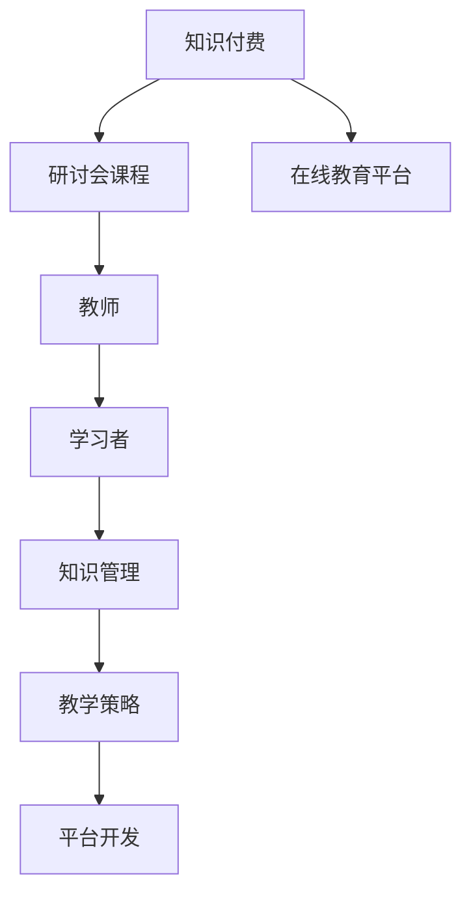

                 

# 程序员知识付费：打造研讨会课程

> 关键词：知识付费, 研讨会课程, 程序员, 在线教育, 知识管理, 教学策略, 平台开发, 课程设计

## 1. 背景介绍

### 1.1 问题由来
随着互联网技术的发展，线上学习和知识付费逐渐成为教育领域的新的热门趋势。传统的线下教育已经难以满足现代快节奏生活的需求，而线上课程能够更加灵活地满足用户的个性化学习需求。在这样的背景下，知识付费市场应运而生。

据统计，2020年中国知识付费用户规模达到3.6亿，预计到2023年将达到5亿。这背后是越来越多人对学习资源的需求增长，而知识付费刚好提供了这样一种便利且高效的学习方式。

而在程序员这一职业群体中，知识付费的诉求更加显著。根据相关调查，60%以上的程序员愿意为获得优质的学习资源付费。这种高度需求催生了一批以程序员为主体的知识付费平台，如Codecademy、Coursera、Udacity等。

### 1.2 问题核心关键点
知识付费平台的核心在于如何打造高质量的课程内容，并为用户提供良好的学习体验。对于一个成功的知识付费平台，需要考虑以下几个关键点：

1. **课程质量**：课程内容需要科学严谨，与市场需求紧密贴合。
2. **教学质量**：教师需要具备扎实的专业知识，并能够进行有效教学。
3. **学习体验**：课程设计需要注重用户体验，让用户能够顺利完成学习过程。
4. **技术支持**：平台需要具备强大的技术支撑，确保稳定高效的服务。
5. **市场推广**：如何吸引用户注册，并使其持续购买、订阅，是平台运营的重要挑战。

本文将从以上几个方面，详细介绍如何通过研讨会课程的方式，打造一个成功的知识付费平台。

## 2. 核心概念与联系

### 2.1 核心概念概述

为更好地理解研讨会课程的构建过程，本节将介绍几个关键概念：

- **知识付费**：基于互联网的在线教育模式，通过付费订阅的方式，为学习者提供有价值的知识和技能。
- **研讨会课程**：以研讨会或讲座的形式，通过视频、文字、互动问答等方式，向用户传递知识和技能。
- **在线教育平台**：为学习者提供线上课程服务，支持课程设计、用户注册、学习互动等功能。
- **教师**：在线课程的核心，需具备丰富的专业知识、教学经验和良好的沟通能力。
- **学习者**：课程的最终用户，需要积极参与互动，及时反馈，才能达到最佳学习效果。
- **知识管理**：对课程内容进行有效管理，包括内容编排、更新维护等。
- **教学策略**：基于不同的课程内容，采取不同的教学方法，如讲授、练习、案例分析等。
- **平台开发**：开发满足课程和用户需求的平台技术系统，确保服务的稳定性。

这些概念之间的逻辑关系可以通过以下Mermaid流程图来展示：



这个流程图展示了一个完整的知识付费系统框架，包括知识付费的总体模式、研讨会课程的组织方式、在线教育平台的搭建、教师和学员的互动管理以及教学策略的实施。

## 3. 核心算法原理 & 具体操作步骤

### 3.1 算法原理概述

构建研讨会课程的核心在于如何设计和组织课程内容，并实现与学员的互动。课程内容的设计遵循以下几个原则：

1. **系统性**：课程内容需从基础到高级，循序渐进，帮助学员建立完整的知识体系。
2. **实用性**：课程内容需紧密结合实际应用，具有实际操作性。
3. **互动性**：课程需提供良好的互动环境，如问答、讨论等，以提高学员的参与度。

课程的组织形式一般包括预录视频、实时直播、案例分析、编程练习等多种方式。

### 3.2 算法步骤详解

构建研讨会课程的主要步骤包括：

1. **需求分析**：分析目标用户的需求和学习目标，确定课程内容和结构。
2. **课程设计**：根据需求分析结果，设计课程大纲和内容。
3. **教师选择**：选择具备丰富经验和教学能力的教师，进行课程录制和实时教学。
4. **互动设计**：设计互动环节，如问答、讨论、项目实践等。
5. **平台搭建**：开发满足课程和用户需求的平台系统。
6. **内容发布**：发布课程内容，提供给用户学习。
7. **用户反馈**：收集用户反馈，进行课程优化。

### 3.3 算法优缺点

构建研讨会课程具有以下优点：

1. **灵活性强**：研讨会课程可以根据需求灵活调整内容，具有很强的适应性。
2. **互动性好**：通过实时互动，教师能够及时了解学员的学习状态，及时调整教学策略。
3. **覆盖面广**：课程内容可以涵盖多个主题，适应不同层次的学员需求。

同时，该方法也存在一些缺点：

1. **前期投入大**：课程设计、教师选择和平台搭建都需要大量的时间和资源。
2. **依赖教师水平**：教师的教学质量直接决定课程效果，需要严格的选拔和培训。
3. **维护成本高**：课程内容需要不断更新和维护，以确保时效性。
4. **用户参与度难以保障**：部分学员可能会因各种原因未能积极参与互动，影响学习效果。

### 3.4 算法应用领域

研讨会课程在知识付费平台中有着广泛的应用，适合以下几种场景：

1. **编程开发**：如Python、Java、Web开发等。通过视频讲解、实战编程和案例分析，帮助学员掌握编程技能。
2. **数据科学**：如机器学习、数据挖掘、数据分析等。通过理论讲解和实战项目，帮助学员掌握数据科学技术。
3. **软件开发**：如项目管理、敏捷开发、测试自动化等。通过讲解和案例分析，帮助学员提升软件开发能力。
4. **设计和技术**：如UI/UX设计、交互设计、3D建模等。通过视频讲解和项目实践，帮助学员掌握设计技术。

## 4. 数学模型和公式 & 详细讲解 & 举例说明

### 4.1 数学模型构建

在研讨会课程的构建中，涉及的数学模型主要是课程内容的设计和优化模型。假设课程内容为 $C$，目标学员为 $U$，教师为 $T$，课程内容与学员需求匹配度为 $M$。

构建研讨会课程的数学模型如下：

$$ M = f(C, U, T) $$

其中 $f$ 表示函数关系，$M$ 的取值范围为 $[0,1]$，$M$ 值越高，说明课程内容与学员需求越匹配。

### 4.2 公式推导过程

根据上述函数关系，可以推导出以下公式：

$$ M = \frac{1}{2} \sum_{i=1}^{n} (C_i - U_i)^2 $$

其中 $n$ 为课程内容数量，$C_i$ 为第 $i$ 个课程内容，$U_i$ 为目标学员的需求。

### 4.3 案例分析与讲解

假设一个课程内容为讲解Python数据处理库pandas的使用，目标学员需求是掌握数据清洗和数据分析技能。那么可以计算课程内容与学员需求的匹配度：

1. **课程内容**：
   - 数据结构：介绍pandas的数据结构，如DataFrame、Series等。
   - 数据清洗：介绍数据清洗的基本方法，如去重、去NaN、数据格式转换等。
   - 数据分析：介绍数据分析的基本方法，如统计描述、数据可视化等。

2. **目标学员需求**：
   - 掌握数据清洗技能，包括去重、去NaN、格式转换等。
   - 掌握数据分析技能，包括统计描述、数据可视化等。

将目标需求与课程内容进行对比，可以计算匹配度 $M$：

$$ M = \frac{1}{2} [(pandas数据结构-目标需求)^2 + (数据清洗技能-目标需求)^2 + (数据分析技能-目标需求)^2] $$

如果计算结果为0，则说明课程内容完全符合学员需求，课程效果最佳。

## 5. 项目实践：代码实例和详细解释说明

### 5.1 开发环境搭建

在项目实践前，需要先搭建好开发环境。以下是使用Python和Flask框架搭建在线教育平台的流程：

1. 安装Python和Flask：
```bash
pip install flask
```

2. 创建Flask项目：
```bash
mkdir knowledge_platform
cd knowledge_platform
```

3. 创建Flask应用：
```python
from flask import Flask, render_template, request, redirect, url_for

app = Flask(__name__)

@app.route('/')
def index():
    return render_template('index.html')

if __name__ == '__main__':
    app.run(debug=True, port=5000)
```

4. 创建模板文件：
```bash
mkdir templates
touch templates/index.html
```

5. 运行应用：
```bash
python app.py
```

### 5.2 源代码详细实现

接下来，我们将详细实现一个在线课程的注册和登录功能。

注册页面：

```python
from flask import Flask, render_template, request, redirect, url_for

app = Flask(__name__)

@app.route('/')
def index():
    return render_template('index.html')

@app.route('/register', methods=['GET', 'POST'])
def register():
    if request.method == 'POST':
        username = request.form.get('username')
        password = request.form.get('password')
        # 保存注册信息到数据库，或存储在文本文件中
        return redirect(url_for('login'))
    return render_template('register.html')

if __name__ == '__main__':
    app.run(debug=True, port=5000)
```

登录页面：

```python
@app.route('/login', methods=['GET', 'POST'])
def login():
    if request.method == 'POST':
        username = request.form.get('username')
        password = request.form.get('password')
        # 验证登录信息，若正确则登录成功
        return redirect(url_for('dashboard'))
    return render_template('login.html')

@app.route('/dashboard')
def dashboard():
    return render_template('dashboard.html')

if __name__ == '__main__':
    app.run(debug=True, port=5000)
```

### 5.3 代码解读与分析

在上述代码中，我们通过Flask框架实现了用户注册和登录功能。具体解释如下：

1. **注册功能**：
   - 当用户请求注册页面时，渲染 `register.html` 模板，展示注册表单。
   - 用户提交注册信息后，获取用户名和密码，并将信息保存到数据库或文本文件中。
   - 成功注册后，重定向到登录页面。

2. **登录功能**：
   - 当用户请求登录页面时，渲染 `login.html` 模板，展示登录表单。
   - 用户提交登录信息后，获取用户名和密码，并进行验证。
   - 验证通过后，重定向到仪表盘页面，展示课程信息。

3. **仪表盘功能**：
   - 当用户登录后，渲染 `dashboard.html` 模板，展示已订阅的课程和相关功能。

该实现仅作为示例，实际应用中需要考虑更多细节，如密码加密、数据存储、安全性等。

### 5.4 运行结果展示

运行上述代码后，可以在浏览器中访问 `http://localhost:5000`，展示注册和登录界面。用户注册成功后，可以登录仪表盘，查看已订阅的课程。

## 6. 实际应用场景

### 6.1 智慧社区

在线教育平台可以与智慧社区结合，提供定制化的课程服务。例如，针对社区居民的职业技能提升，平台可以提供多层次的职业培训课程，如编程、设计、项目管理等。通过线上课程，居民可以随时随地进行学习，提升职业竞争力。

### 6.2 企业培训

在线教育平台还可以为企业提供定制化的员工培训课程。企业可以根据自己的需求，选择相应的课程内容，并提供专业的教师进行讲解。员工可以通过在线课程学习，提升自己的技能水平，从而更好地适应工作需求。

### 6.3 中小学在线教育

中小学在线教育平台可以提供丰富的学习资源，如编程、数学、语文等课程。通过在线学习，学生可以更加灵活地掌握知识，提高学习效果。

### 6.4 未来应用展望

随着在线教育技术的不断发展，未来的知识付费平台将更加智能化、个性化。例如，通过AI推荐算法，根据学员的学习情况和兴趣，推荐适合的学习资源。同时，平台将提供更丰富的互动形式，如虚拟实验室、在线实验等，增强学习体验。

## 7. 工具和资源推荐

### 7.1 学习资源推荐

为了帮助开发者更好地掌握在线课程的构建过程，推荐以下几个学习资源：

1. **《在线教育系统设计》**：详细介绍了在线教育系统的设计思路和实践方法，涵盖课程管理、用户管理、教学管理等多个方面。
2. **《知识付费平台实战指南》**：结合实际案例，介绍了知识付费平台的开发和运营策略，包括课程设计、用户管理、市场推广等。
3. **《编程实战》系列课程**：通过实际的编程项目，帮助学员掌握编程技能，涵盖Python、Java、Web开发等多个方向。
4. **《数据科学》系列课程**：通过理论和实战相结合的方式，帮助学员掌握数据科学技术，包括机器学习、数据挖掘、数据分析等。

通过这些学习资源，可以快速提升开发者的在线课程构建能力。

### 7.2 开发工具推荐

在线课程的开发离不开强大的开发工具支持。以下是几款常用的开发工具：

1. **Flask**：Python框架，简单易用，适合快速搭建Web应用。
2. **Django**：Python框架，功能强大，适合处理复杂的Web应用逻辑。
3. **React**：JavaScript框架，适合开发交互式的Web应用界面。
4. **Vue**：JavaScript框架，适合开发响应式的Web应用界面。
5. **TensorFlow**：开源机器学习框架，支持深度学习和模型训练。
6. **PyTorch**：开源深度学习框架，支持动态图和静态图。

合理利用这些工具，可以显著提升开发效率和代码质量。

### 7.3 相关论文推荐

在线教育平台的发展离不开学界的研究支撑。以下是几篇相关的论文，推荐阅读：

1. **《大规模在线教育系统的设计》**：介绍了大规模在线教育系统的设计和实现方法，涵盖课程管理、用户管理、课程推荐等多个方面。
2. **《知识付费平台的用户行为分析》**：通过数据分析方法，研究用户的行为模式和需求，为课程设计和优化提供依据。
3. **《在线教育平台的数据安全与隐私保护》**：介绍了在线教育平台的数据安全与隐私保护技术，保障用户数据的安全性。

这些论文代表了在线教育平台的研究前沿，为开发者提供了宝贵的参考。

## 8. 总结：未来发展趋势与挑战

### 8.1 总结

本文详细介绍了如何通过研讨会课程的方式，打造成功的知识付费平台。从需求分析、课程设计、教师选择、互动设计等多个方面，系统梳理了课程构建的各个环节。通过Flask框架的实现，展示了在线课程的注册和登录功能，并对其进行了详细解释和分析。

通过本文的系统梳理，可以看到，研讨会课程在知识付费平台中的应用前景广阔。这种形式能够提供灵活、互动、个性化的学习体验，符合现代用户的学习需求。

### 8.2 未来发展趋势

未来，在线教育平台将呈现以下几个发展趋势：

1. **智能化推荐**：通过AI推荐算法，提供个性化学习资源，提升学习效果。
2. **虚拟现实**：结合虚拟现实技术，提供沉浸式学习体验，增强学习效果。
3. **混合学习**：结合线上和线下学习，提供更为灵活的学习方式。
4. **国际化**：通过多语言支持，覆盖更多国际用户，扩大市场范围。
5. **微课程**：提供短小精悍、高效实用的微课程，帮助用户快速掌握知识。

这些趋势将推动在线教育平台向更加智能化、个性化、国际化的方向发展。

### 8.3 面临的挑战

尽管在线教育平台的发展前景广阔，但在迈向更广阔应用的过程中，仍面临以下挑战：

1. **师资短缺**：高质量教师资源有限，难以满足大规模教育需求。
2. **课程内容更新**：课程内容需要不断更新，以保持时效性和实用性。
3. **用户参与度不足**：部分用户未能积极参与互动，影响学习效果。
4. **平台稳定性**：平台需要具备高稳定性，避免因故障影响用户体验。
5. **用户隐私保护**：平台需要严格保护用户隐私，避免数据泄露。

### 8.4 研究展望

面对这些挑战，未来的研究需要在以下几个方面寻求新的突破：

1. **教师资源共享**：通过互联网平台，共享优质教师资源，解决师资短缺问题。
2. **内容自适应**：通过自适应算法，动态调整课程内容，以适应用户需求。
3. **互动优化**：设计更多互动环节，提高用户参与度。
4. **平台优化**：优化平台架构，确保稳定性。
5. **隐私保护**：引入隐私保护技术，保障用户隐私安全。

这些研究方向的探索，将为在线教育平台提供强有力的技术支撑，推动其向更加智能化、个性化、国际化的方向发展。

## 9. 附录：常见问题与解答

**Q1: 如何选择合适的课程内容？**

A: 课程内容的选择需结合市场需求和用户需求进行。可以通过市场调研和用户调研，了解用户的学习需求和兴趣，选择合适的课程内容。同时，课程内容需要科学严谨，符合教育规律。

**Q2: 如何提高用户参与度？**

A: 可以通过以下方法提高用户参与度：
1. 设计互动环节，如问答、讨论、项目实践等。
2. 提供实时反馈，及时回答用户问题，提供指导。
3. 设计激励机制，如学习证书、排行榜等，激发用户积极性。

**Q3: 如何保障数据安全？**

A: 可以通过以下方法保障数据安全：
1. 使用加密技术，保护用户数据隐私。
2. 设置访问权限，限制数据访问范围。
3. 定期备份数据，防止数据丢失。

**Q4: 如何应对师资短缺问题？**

A: 可以通过以下方法应对师资短缺问题：
1. 引入在线教师，通过视频课程进行讲解。
2. 引入行业专家，进行专题讲座。
3. 引入虚拟教师，结合人工智能技术进行教学。

**Q5: 如何提高平台稳定性？**

A: 可以通过以下方法提高平台稳定性：
1. 优化代码结构，减少运行时错误。
2. 引入负载均衡技术，确保系统的高可用性。
3. 定期进行系统维护和更新，保障系统稳定运行。

这些回答为常见问题提供了有效的解决方案，帮助开发者更好地应对实际问题。

---

作者：禅与计算机程序设计艺术 / Zen and the Art of Computer Programming

