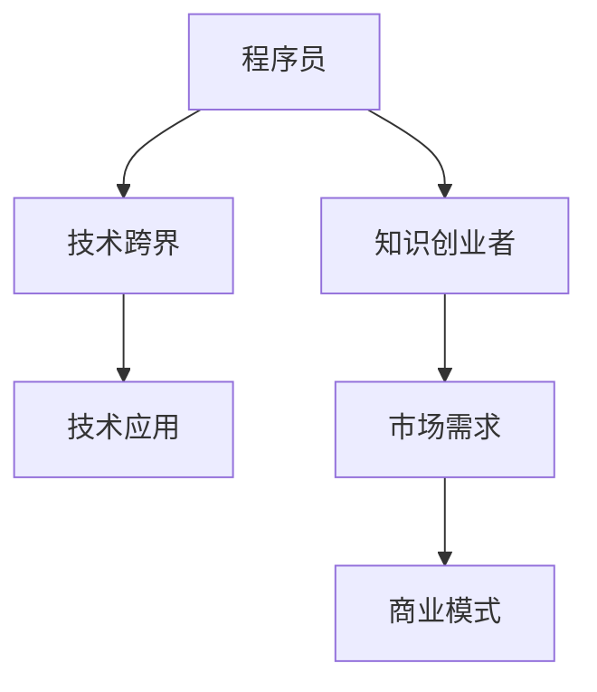

                 

# 程序员转型知识创业者的心路历程

在当今数字化时代，技术更新迭代迅速，行业边界日益模糊，跨界融合成为常态。对于许多深耕技术多年的程序员来说，如何在纷繁复杂的新领域中寻找突破口，顺利转型为知识创业者，成为了一个亟待解决的问题。本文将从背景介绍、核心概念、算法原理、实际应用、资源推荐、未来展望等多个方面，系统梳理程序员转型知识创业者的心路历程。

## 1. 背景介绍

### 1.1 问题由来

程序员转型知识创业者的过程，通常伴随着对原有技术技能的挑战、对新领域知识的学习和探索，以及对市场需求变化敏锐洞察等多重考验。面对技术更新和市场变化的快速迭代，许多长期在技术岗位上的程序员开始思考如何通过自身技能向知识创业者转型。

### 1.2 问题核心关键点

在技术快速发展的今天，程序员转型知识创业者面临的核心挑战包括：
- **技术技能跨界**：如何在原有技术技能的基础上，拓展到新领域的知识体系。
- **市场需求洞察**：如何准确把握市场需求，选择有潜力的知识创业领域。
- **商业模式设计**：如何将技术转化为商业价值，设计出可持续发展的商业模式。
- **团队管理协作**：如何组建并管理一支高效、协作的知识创业团队。

## 2. 核心概念与联系

### 2.1 核心概念概述

为更好地理解程序员转型知识创业者的过程，本节将介绍几个密切相关的核心概念：

- **程序员**：掌握某种或多种编程语言和开发技术，能够编写、测试和维护软件程序的专业人员。
- **知识创业者**：利用自身的专业知识和经验，通过开发和销售软件、咨询、培训等形式，创造经济价值的人群。
- **技术跨界**：将原有的技术技能应用到新的领域，进行知识和技能的拓展。
- **市场需求**：指市场上用户或企业对某种产品、服务或解决方案的需求。
- **商业模式**：企业在运营过程中，如何创造、传递和获取价值的体系。

这些核心概念之间的逻辑关系可以通过以下Mermaid流程图来展示：



这个流程图展示了一名程序员通过技术跨界到知识创业者的过程：

1. 一名程序员通过技术跨界拓展到新的领域。
2. 在新的领域应用原有技术技能，创造出有市场需求的产品或服务。
3. 设计商业模式，将产品或服务转化为经济价值。

## 3. 核心算法原理 & 具体操作步骤

### 3.1 算法原理概述

程序员转型知识创业者的过程，本质上是一个从技术到商业的过程。其核心算法原理在于如何将技术转化为商业价值，即如何通过技术创新解决市场需求，进而设计出可行的商业模式。

### 3.2 算法步骤详解

程序员转型知识创业者通常遵循以下步骤：

**Step 1: 自我评估**
- 评估自身技术能力和知识体系，识别擅长和感兴趣的技术领域。
- 分析自身的软技能，如沟通能力、团队合作等，这些是成功转型的重要因素。

**Step 2: 市场调研**
- 了解目标领域市场现状，包括主要竞争对手、市场需求、用户痛点等。
- 使用调查问卷、访谈等方法收集用户反馈，识别潜在的商业机会。

**Step 3: 技术拓展**
- 通过在线课程、技术博客、学术研究等方式，学习目标领域的关键技术。
- 参与开源项目、技术社区等活动，积累相关经验。

**Step 4: 验证想法**
- 开发原型或最小可行产品(MVP)，验证市场需求的真实性和技术方案的可行性。
- 通过用户反馈不断优化产品设计和技术实现。

**Step 5: 商业模式设计**
- 根据市场需求和技术创新，设计可持续的商业模式。
- 确定盈利模式，如订阅服务、广告收入、商品销售等。

**Step 6: 市场推广**
- 制定营销策略，通过社交媒体、博客、展会等渠道推广产品。
- 建立品牌声誉，吸引潜在客户和投资者。

**Step 7: 团队建设**
- 招募有经验的团队成员，构建跨学科团队。
- 设立明确的团队目标和角色，促进高效协作。

**Step 8: 持续迭代**
- 根据用户反馈和市场变化，不断优化产品和技术。
- 进行业务和技术的持续迭代，保持竞争优势。

### 3.3 算法优缺点

程序员转型知识创业者的过程，具有以下优点：
1. **资源整合能力**：利用原有技术积累，快速进入新领域，减少创业初期的成本。
2. **创新潜力**：技术背景的程序员往往具备较强的创新意识和能力，容易发现新的商业机会。
3. **市场适应性**：通过技术手段解决用户痛点，能够快速满足市场需求。

同时，该过程也存在一定的局限性：
1. **学习曲线陡峭**：新领域的知识和技能往往需要较长时间的学习和积累。
2. **市场竞争激烈**：新领域可能存在大量竞争者，创业成功的不确定性高。
3. **跨界风险**：技术跨界过程中可能遇到技术适配、市场需求不匹配等问题。

尽管存在这些局限性，但成功的程序员转型为知识创业者，能够在新领域创造巨大价值，推动技术进步和产业创新。

### 3.4 算法应用领域

程序员转型知识创业者的过程，可以应用于多个领域，例如：

- **软件即服务(SaaS)**：通过技术开发和销售软件产品，为中小企业提供解决方案。
- **咨询服务**：利用技术背景和专业知识，为客户提供技术咨询、培训等服务。
- **产品创新**：在新兴技术领域开发创新产品，如人工智能、区块链、物联网等。
- **开源社区**：成为开源项目的关键贡献者，通过社区力量推动技术发展。

除了上述这些经典应用外，知识创业者的成功案例还出现在教育、健康、环保等多个领域，展示了技术跨界的广泛潜力。

## 4. 数学模型和公式 & 详细讲解 & 举例说明

### 4.1 数学模型构建

知识创业者转型过程中的技术决策，往往需要构建数学模型来分析和评估。以软件开发为例，我们可以构建以下数学模型：

设开发软件的平均成本为 $C$，目标市场的年收益为 $R$，投资回报率(ROI)为 $ROI = \frac{R}{C}$。此外，假设软件开发周期为 $T$，每年的收益为 $R_{\text{annual}} = R / T$，则单个项目的净现值(NPV)为：

$$
NPV = \sum_{t=0}^{T} \frac{R_{\text{annual}}}{(1+i)^t} - C
$$

其中 $i$ 为贴现率。

### 4.2 公式推导过程

以软件开发为例，假设开发周期为1年，市场收益为50万美元，成本为30万美元，贴现率为10%。根据上述公式，计算每个季度的收益并折现，得到净现值：

$$
NPV = \frac{50}{(1+0.1)^0} + \frac{50}{(1+0.1)^1} + \frac{50}{(1+0.1)^2} + \frac{50}{(1+0.1)^3} - 30
$$

计算得到 $NPV > 0$，说明该项目值得投资。

### 4.3 案例分析与讲解

假设你是一名软件开发工程师，有兴趣进入人工智能领域。通过学习相关的数学和编程知识，开发了一款人工智能图像识别应用。为评估其市场潜力和投资价值，可以构建类似的数学模型。假设该应用的开发周期为3个月，市场规模为1亿美元，成本为50万美元，使用上述公式计算NPV。假设应用每月的收益为50万美元，则：

$$
NPV = \frac{50}{(1+0.1)^0} + \frac{50}{(1+0.1)^1} + \frac{50}{(1+0.1)^2} - 50
$$

计算得到 $NPV > 0$，说明该项目有较高的投资价值。

## 5. 项目实践：代码实例和详细解释说明

### 5.1 开发环境搭建

在进行知识创业项目的开发前，首先需要搭建合适的开发环境。以下是使用Python进行项目开发的环境配置流程：

1. 安装Anaconda：从官网下载并安装Anaconda，用于创建独立的Python环境。

2. 创建并激活虚拟环境：
```bash
conda create -n myenv python=3.8 
conda activate myenv
```

3. 安装所需的Python库：
```bash
pip install numpy pandas scikit-learn matplotlib jupyter notebook ipython
```

4. 安装所需的开发工具：
```bash
pip install django flask
```

5. 安装数据库和服务器：
```bash
pip install psycopg2 django-heroku
```

完成上述步骤后，即可在`myenv`环境中开始知识创业项目的开发。

### 5.2 源代码详细实现

下面以开发一个简单的博客系统为例，给出使用Django框架进行知识创业项目开发的PyTorch代码实现。

首先，定义博客模型的数据模型：

```python
from django.db import models
from django.contrib.auth.models import User

class Blog(models.Model):
    title = models.CharField(max_length=200)
    content = models.TextField()
    created_at = models.DateTimeField(auto_now_add=True)
    updated_at = models.DateTimeField(auto_now=True)
    user = models.ForeignKey(User, on_delete=models.CASCADE)
```

然后，定义博客系统的视图和模板：

```python
from django.shortcuts import render, redirect
from .models import Blog

def blog_list(request):
    blogs = Blog.objects.all().order_by('-created_at')
    return render(request, 'blog/list.html', {'blogs': blogs})

def blog_detail(request, pk):
    blog = Blog.objects.get(pk=pk)
    return render(request, 'blog/detail.html', {'blog': blog})
```

接着，定义博客系统的模板：

```html
<!-- blog/list.html -->
<ul>
    
        <li><a href="">{{ blog.title }}</a></li>
    
</ul>

<!-- blog/detail.html -->
<h1>{{ blog.title }}</h1>
<p>{{ blog.content }}</p>
```

最后，启动博客系统的开发流程：

```bash
python manage.py startapp blog
python manage.py makemigrations
python manage.py migrate
python manage.py runserver
```

以上就是使用Django框架开发博客系统的完整代码实现。可以看到，Django框架为开发提供了强大的数据模型和视图模板，使得知识创业项目开发变得简洁高效。

### 5.3 代码解读与分析

让我们再详细解读一下关键代码的实现细节：

**模型定义**：
- `from django.db import models`：引入Django的数据库模块。
- `from django.contrib.auth.models import User`：引入用户模型，用于关联博客和用户。
- `class Blog(models.Model)`：定义博客模型，继承自`Model`基类。
- `title`、`content`等字段定义博客的标题、内容等属性。

**视图定义**：
- `from django.shortcuts import render, redirect`：引入渲染视图和重定向视图。
- `from .models import Blog`：引入博客模型。
- `def blog_list(request)`：定义博客列表视图，查询所有博客并排序，渲染到模板。
- `def blog_detail(request, pk)`：定义博客详情视图，根据ID获取博客，渲染到模板。

**模板定义**：
- `<!-- blog/list.html -->`：定义博客列表模板，渲染博客列表。
- `<!-- blog/detail.html -->`：定义博客详情模板，渲染博客详情。

可以看到，Django框架提供了强大的开发工具，使得知识创业项目开发变得简洁高效。开发者可以将更多精力放在业务逻辑和用户体验上，而不必过多关注底层的实现细节。

当然，工业级的系统实现还需考虑更多因素，如用户管理、权限控制、数据备份等。但核心的开发流程基本与此类似。

## 6. 实际应用场景

### 6.1 在线教育平台

基于知识创业者的软件开发技能，可以开发在线教育平台，为学习者提供多样化、个性化的教育服务。平台可以包括视频课程、在线问答、虚拟实验室等功能。

在技术实现上，可以收集教育领域的教学资源、学习反馈等数据，结合机器学习和数据分析技术，为学习者推荐个性化课程和学习路径。通过微服务架构和云计算平台，平台可以高效扩展，支撑大量并发用户。

### 6.2 健康管理应用

知识创业者可以利用自身的技术背景，开发健康管理应用，为个人和家庭提供健康监测、饮食管理、运动指导等服务。

在技术实现上，可以通过集成传感器、智能穿戴设备等数据采集技术，结合机器学习算法，实时监测用户的健康状况，并给出科学合理的健康建议。通过API接口，应用可以与医院、药店等医疗机构进行数据共享和协同，提供更全面的健康服务。

### 6.3 旅游推荐系统

知识创业者可以开发旅游推荐系统，为游客提供个性化旅游路线、景点介绍、酒店预订等服务。

在技术实现上，可以通过收集游客的旅游偏好、历史行为等数据，结合自然语言处理和机器学习技术，生成个性化的旅游路线和推荐内容。通过API接口，系统可以与航空公司、酒店等服务商进行数据共享，提供更便捷的旅游服务。

### 6.4 未来应用展望

随着知识创业者的技术积累和市场洞察能力的提升，未来的知识创业领域将更加多样化，技术创新和应用也将更加广泛。

在智慧医疗领域，基于知识创业者的软件开发技能，可以开发智能医疗助理、远程诊疗、医疗数据分析等应用，提高医疗服务的效率和质量。

在智能制造领域，知识创业者可以利用自动化、物联网技术，开发智能生产线、设备监控、预测性维护等应用，提升制造企业的生产效率和资源利用率。

在数字内容创作领域，知识创业者可以开发内容生成、版权管理、内容推荐等应用，推动数字内容产业的发展。

此外，在金融、教育、环保、交通等众多领域，知识创业者的软件开发技能也将发挥重要作用，推动社会各个方面的数字化转型。相信随着知识创业者的技术创新和市场突破，未来将有更多具有革命性意义的应用场景涌现。

## 7. 工具和资源推荐

### 7.1 学习资源推荐

为了帮助知识创业者掌握软件开发和市场分析的相关知识，这里推荐一些优质的学习资源：

1. **《Python编程：从入门到实践》**：适合Python编程初学者的入门书籍，通过实战项目引导学习。
2. **《Flask Web Development》**：Flask框架的权威指南，涵盖Web开发的基础知识和实战案例。
3. **Coursera《Machine Learning》**：由斯坦福大学教授Andrew Ng讲授的机器学习课程，系统介绍机器学习算法和应用。
4. **Kaggle竞赛平台**：通过参与数据科学和机器学习的竞赛，积累实战经验，学习最新的数据处理方法。
5. **Udacity纳米学位项目**：提供多样化的在线课程和实战项目，涵盖计算机科学和数据科学的各个方向。

通过对这些资源的学习实践，相信你一定能够全面提升自己的技术能力和市场分析能力，为知识创业的成功奠定坚实基础。

### 7.2 开发工具推荐

高效的开发离不开优秀的工具支持。以下是几款用于知识创业项目开发的常用工具：

1. **Visual Studio Code**：轻量级的代码编辑器，支持Python、JavaScript等多种编程语言，配置灵活，扩展丰富。
2. **Git**：版本控制系统，支持代码版本管理、协作开发等，是团队项目开发的基础。
3. **Jupyter Notebook**：交互式的代码编辑器，支持Python、R等语言，支持代码和文本的混合编辑。
4. **Heroku**：云端平台，提供快速部署、自动扩展等云服务，适合小型项目和快速迭代。
5. **AWS和Google Cloud**：提供全面的云服务，支持数据存储、计算、数据库等，适合大规模项目和复杂应用。

合理利用这些工具，可以显著提升知识创业项目的开发效率，加速创新迭代的步伐。

### 7.3 相关论文推荐

知识创业者转型过程中，需要不断学习新技术和市场变化。以下是几篇奠基性的相关论文，推荐阅读：

1. **《Deep Learning》**：由Goodfellow、Bengio和Courville合著，全面介绍了深度学习的基本理论和实践应用。
2. **《The Google Brain Book》**：由Jeff Dean和Fei-Fei Li等Google大脑团队成员合著，介绍了机器学习和深度学习的最新进展。
3. **《Natural Language Processing with Transformers》**：HuggingFace团队合著，介绍了Transformer模型的原理和应用，涵盖NLP领域的最新研究进展。
4. **《Human-Computer Interaction》**：由Blandford、Buxton和Greenfield合著，介绍了人机交互设计的基本原则和最新发展。
5. **《Business Model Generation》**：由Alex Osterwalder和Yves Pigneur合著，介绍了商业模式设计的经典方法和案例。

这些论文代表了大数据、深度学习、人机交互等领域的发展脉络，是知识创业者全面提升技术能力和市场分析能力的必备资料。

## 8. 总结：未来发展趋势与挑战

### 8.1 研究成果总结

本文对程序员转型知识创业者的过程进行了全面系统的介绍，包括背景介绍、核心概念、算法原理、实际操作、应用场景、学习资源等多个方面。通过系统梳理，希望能够帮助读者理解知识创业者的转型心路历程，并提供一些实用的建议和指导。

### 8.2 未来发展趋势

展望未来，知识创业者转型面临以下发展趋势：

1. **技术栈多样化**：知识创业者需要掌握多种技术栈，如Python、Java、JavaScript、Flask等，以便于开发多样化的应用。
2. **数据驱动决策**：通过数据分析和机器学习，知识创业者可以更好地理解市场需求和用户行为，制定更加精准的商业策略。
3. **产品快速迭代**：知识创业者需要快速响应市场变化，不断迭代产品和技术，保持竞争优势。
4. **全球化视野**：随着互联网的普及，知识创业者的产品和服务可以覆盖全球市场，拓展更广阔的发展空间。
5. **跨界合作**：知识创业者需要与不同领域的专家和团队进行合作，综合利用各自的优势，开发具有创新性的产品和服务。

### 8.3 面临的挑战

尽管知识创业者转型过程中充满了机遇，但也面临诸多挑战：

1. **学习成本高**：新技术和新领域的快速变化，要求知识创业者不断学习新知识，投入大量时间和精力。
2. **市场竞争激烈**：新兴领域可能存在大量竞争者，创业成功的不确定性高。
3. **资源投入大**：技术跨界和市场开拓需要大量的人力、物力和财力投入，风险较大。
4. **产品验证难**：新领域的产品验证和市场接受度不确定，需要更多时间和数据积累。
5. **用户需求多样**：不同用户群体的需求各异，产品设计和市场推广需要精准把握。

### 8.4 研究展望

面对知识创业者转型过程中面临的挑战，未来的研究需要在以下几个方面寻求新的突破：

1. **技术快速迭代**：开发更加高效、易用的开发工具和框架，降低知识创业者的学习曲线和开发成本。
2. **市场需求分析**：建立更精准的市场需求分析工具和方法，帮助知识创业者快速定位潜在客户和市场机会。
3. **跨领域合作**：促进不同领域的专家和团队之间的合作，推动技术创新和应用。
4. **商业模式创新**：探索更多灵活、创新的商业模式，如SaaS、订阅服务、共享经济等。
5. **用户需求管理**：通过数据分析和用户反馈，精准把握用户需求，设计更加符合用户期望的产品。

这些研究方向的探索，必将引领知识创业者转型过程向更深层次发展，为构建成功和可持续的知识创业企业铺平道路。

## 9. 附录：常见问题与解答

**Q1：程序员转型知识创业者的难点在哪里？**

A: 程序员转型知识创业者的难点在于：
1. **知识跨界**：需要将原有技术知识应用到新领域，需要学习新领域的知识体系和应用场景。
2. **市场需求**：需要准确把握目标市场的用户需求和竞争格局，识别潜在的商业机会。
3. **团队建设**：需要组建跨学科团队，培养团队的协作和创新能力。

**Q2：如何评估一个知识创业项目的可行性？**

A: 评估知识创业项目的可行性，可以从以下几个方面考虑：
1. **市场需求**：调研目标市场的用户需求和竞争对手情况，确定市场潜力和增长空间。
2. **技术可行性**：评估技术方案的可行性，包括技术实现难度、成本和资源需求。
3. **商业模式**：设计可行的商业模式，确定盈利模式和市场定位。
4. **团队能力**：评估团队的技术能力和市场经验，确定项目执行的可行性和团队建设计划。

**Q3：知识创业者如何建立团队？**

A: 知识创业者建立团队需要考虑以下因素：
1. **团队成员选择**：根据项目需求，选择有经验、有热情的团队成员。
2. **角色分配**：明确团队成员的角色和职责，确保高效协作。
3. **团队管理**：建立有效的沟通和反馈机制，促进团队成员的紧密合作。
4. **文化建设**：营造积极、开放、创新的团队文化，增强团队凝聚力。

**Q4：知识创业者如何保持技术领先？**

A: 知识创业者保持技术领先需要不断学习和实践：
1. **持续学习**：通过在线课程、技术博客、技术会议等方式，不断学习新技术和市场变化。
2. **实践积累**：通过实战项目和创新尝试，积累丰富的技术经验和市场洞察。
3. **技术交流**：积极参与技术社区和行业协会，与同行进行交流和合作。
4. **知识共享**：通过技术博客、开源项目等方式，分享自己的技术成果和经验。

**Q5：知识创业者如何应对市场变化？**

A: 知识创业者应对市场变化需要灵活调整策略：
1. **市场调研**：定期进行市场调研，了解市场动态和用户需求变化。
2. **快速迭代**：通过快速迭代和灵活调整，及时响应市场变化和用户反馈。
3. **产品优化**：持续优化产品和用户体验，提高用户满意度和市场竞争力。
4. **跨界合作**：与其他领域的专家和团队进行合作，综合利用各自的优势。

这些建议和指导，将有助于知识创业者顺利转型，实现技术到商业的成功跨越。希望通过本文的系统梳理，能够为知识创业者的转型提供一些有用的参考和启示。

---

作者：禅与计算机程序设计艺术 / Zen and the Art of Computer Programming

