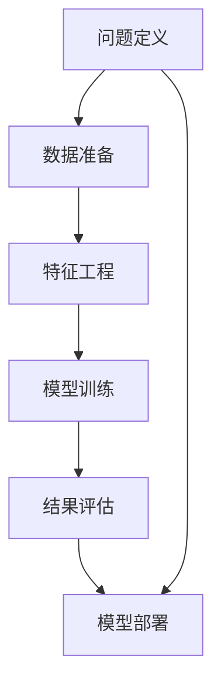

                 

# 端到端AI开发：从概念到实现

## 1. 背景介绍

在过去十年中，人工智能(AI)技术取得了翻天覆地的进步，从传统的机器学习，到深度学习，再到端到端AI开发，AI的演化正在重塑各行业的运营方式。特别是在自然语言处理(NLP)、计算机视觉(CV)、语音识别(Speech Recognition)等关键领域，端到端AI开发正在成为开发新AI应用的主流模式。然而，这一过程涉及概念建模、数据准备、模型训练、模型部署等多个环节，这对许多AI开发者来说是一个不小的挑战。本文将系统性地介绍端到端AI开发的流程、核心技术和关键工具，帮助开发者从概念到实现，逐步构建高效、可扩展的AI应用。

## 2. 核心概念与联系

### 2.1 核心概念概述

端到端AI开发是指从问题定义到模型部署的整个过程，将传统的数据清洗、特征工程、模型训练、结果评估等环节一体化，通过模型封装和应用部署，快速上线并迭代优化AI应用。这一流程的核心在于自动化和集成化，即利用成熟技术栈和工具，将复杂的AI开发流程自动化，并将相关组件集成到一个端到端的开发管道中。

### 2.2 核心概念原理和架构的 Mermaid 流程图



这个流程图展示了端到端AI开发的基本流程：从问题定义开始，逐步准备数据、设计特征、训练模型，评估结果，并最终部署模型。其中每个环节都是紧密相连的，共同构成一个闭环的开发流程。

## 3. 核心算法原理 & 具体操作步骤

### 3.1 算法原理概述

端到端AI开发的核心算法原理可以概括为以下几点：

- 数据准备：通过数据清洗、数据增强、数据集划分等技术，为模型训练提供高质量的输入数据。
- 特征工程：通过手工设计特征、自动化特征提取等方法，从原始数据中提炼出模型需要的特征表示。
- 模型训练：通过选择合适的优化算法和超参数，训练模型参数，以最小化训练误差。
- 结果评估：通过交叉验证、混淆矩阵、ROC曲线等技术，评估模型在测试集上的性能。
- 模型部署：通过模型封装、容器化、服务化等方法，将训练好的模型部署到实际应用环境中。

### 3.2 算法步骤详解

#### 3.2.1 数据准备

数据准备是端到端AI开发的首个环节，其目的是从原始数据中提取有价值的信息，供后续的特征工程和模型训练使用。

**数据清洗**：删除重复记录、处理缺失值、修正错误信息等，保证数据的质量。

**数据增强**：通过旋转、缩放、裁剪等技术，扩充数据集的多样性，防止模型过拟合。

**数据集划分**：将数据集划分为训练集、验证集和测试集，以便于模型训练、参数调优和最终评估。

#### 3.2.2 特征工程

特征工程是数据准备的重要后续环节，其目的是从原始数据中提取最有用的特征，供模型训练使用。

**特征选择**：根据领域知识和模型特征重要性，选择最相关的特征。

**特征构建**：通过手工设计或自动化提取，构造新的特征表示，提升模型性能。

**特征降维**：通过主成分分析(PCA)、线性判别分析(LDA)等方法，减少特征维度，防止模型过拟合。

#### 3.2.3 模型训练

模型训练是端到端AI开发的核心环节，其目的是通过训练数据集，调整模型参数，最小化训练误差。

**选择模型架构**：根据问题类型选择合适的模型，如CNN用于图像识别，RNN用于序列建模，Transformer用于自然语言处理。

**设定优化算法**：选择合适的优化算法，如SGD、Adam等，并设定学习率、批大小、迭代轮数等超参数。

**监督训练**：使用训练集数据，监督模型训练，更新模型参数。

**模型评估**：使用验证集数据，评估模型性能，调整超参数。

#### 3.2.4 结果评估

结果评估是模型训练的后续环节，其目的是通过测试集数据，验证模型的泛化能力，评估模型性能。

**交叉验证**：通过K折交叉验证，确保模型评估的可靠性。

**混淆矩阵**：通过混淆矩阵，评估分类模型的准确率、召回率和F1值等指标。

**ROC曲线**：通过ROC曲线，评估二分类模型的阈值选择。

#### 3.2.5 模型部署

模型部署是端到端AI开发的最后一个环节，其目的是将训练好的模型封装、集成并部署到实际应用环境中。

**模型封装**：将模型保存为文件或数据库，便于后续使用和部署。

**容器化**：将模型封装到Docker容器中，便于集中管理和扩展。

**服务化**：将模型部署为微服务，支持RESTful接口或gRPC协议，供其他系统调用。

### 3.3 算法优缺点

**优点**：
- 自动化程度高：自动化流程减少了手工调参和数据处理的重复劳动，提高了开发效率。
- 集成化强：将多个环节集成到端到端管道中，简化了开发流程，降低了出错率。
- 可扩展性好：组件化开发使得后期迭代优化更加便捷，易于添加新功能。

**缺点**：
- 数据依赖强：高质量的训练数据是端到端开发的前提，数据准备环节可能耗时较长。
- 资源需求高：大模型训练和推理需要大量计算资源，对硬件设备要求较高。
- 复杂度提升：从问题定义到模型部署的流程较为复杂，需要开发者具备丰富的经验。

### 3.4 算法应用领域

端到端AI开发广泛适用于计算机视觉、自然语言处理、智能推荐、金融风控等诸多领域，以下是几个典型的应用场景：

- 图像识别：通过端到端AI开发，将图像预处理、特征提取、模型训练、结果评估等环节一体化，构建高效、可扩展的图像识别应用。
- 语音识别：通过端到端AI开发，将语音信号处理、特征提取、模型训练、结果评估等环节自动化，实现实时语音识别。
- 智能推荐：通过端到端AI开发，将用户行为数据处理、特征工程、模型训练、结果评估等环节集成，构建个性化推荐系统。
- 金融风控：通过端到端AI开发，将数据清洗、特征工程、模型训练、结果评估等环节集成，构建高效的金融风险预测和评估系统。

## 4. 数学模型和公式 & 详细讲解 & 举例说明

### 4.1 数学模型构建

以图像识别为例，我们可以构建一个简单的端到端AI开发模型。模型的输入是一张图像，输出是对应类别的标签。模型的数学表达式如下：

$$
y = f(x; \theta)
$$

其中 $x$ 是输入图像，$y$ 是输出标签，$\theta$ 是模型参数。模型的训练目标是：

$$
\theta^* = \mathop{\arg\min}_{\theta} \frac{1}{N} \sum_{i=1}^N L(y_i, f(x_i; \theta))
$$

其中 $N$ 是样本总数，$L$ 是损失函数，可以是交叉熵、均方误差等。

### 4.2 公式推导过程

以二分类问题为例，我们可以推导一个简单的端到端AI开发模型的公式。假设模型使用逻辑回归，则预测概率为：

$$
p(y=1|x; \theta) = \sigma(w^T x + b)
$$

其中 $w$ 是权重向量，$b$ 是偏置项，$\sigma$ 是sigmoid函数。模型的损失函数为交叉熵损失：

$$
L(y, f(x; \theta)) = -(y\log p(y=1|x; \theta) + (1-y)\log p(y=0|x; \theta))
$$

代入模型训练目标，得：

$$
\theta^* = \mathop{\arg\min}_{\theta} \frac{1}{N} \sum_{i=1}^N L(y_i, f(x_i; \theta))
$$

### 4.3 案例分析与讲解

以Kaggle房价预测竞赛为例，我们构建一个端到端AI开发模型。首先，我们从Kaggle平台上下载房价数据集，包含房屋特征和房屋价格。接下来，我们进行数据清洗、数据增强和数据集划分。然后，我们设计并训练一个线性回归模型，使用交叉验证和ROC曲线评估模型性能。最后，我们将模型封装为Docker容器，部署到生产环境中。

## 5. 项目实践：代码实例和详细解释说明

### 5.1 开发环境搭建

为了构建端到端AI开发模型，我们需要安装并配置以下工具：

1. **Python**：用于编写和运行代码。
2. **Pandas**：用于数据处理和分析。
3. **Scikit-learn**：用于特征工程和模型训练。
4. **Keras/TensorFlow**：用于构建和训练神经网络模型。
5. **Docker**：用于模型部署和容器化。

### 5.2 源代码详细实现

以下是构建端到端AI开发模型的完整代码实现：

```python
import pandas as pd
from sklearn.model_selection import train_test_split
from sklearn.linear_model import LinearRegression
from sklearn.metrics import mean_squared_error
from keras.models import Sequential
from keras.layers import Dense
from keras.callbacks import EarlyStopping
import tensorflow as tf

# 加载数据
data = pd.read_csv('house_prices.csv')

# 数据清洗和特征选择
data = data.dropna()
data = data.drop(['Id'], axis=1)
data['Living_Area'] = data['Living_Area'].astype('float')

# 数据增强和划分
X = data.drop(['Sale_Price'], axis=1)
y = data['Sale_Price']
X_train, X_test, y_train, y_test = train_test_split(X, y, test_size=0.2, random_state=42)

# 模型训练
model = Sequential()
model.add(Dense(10, input_dim=X_train.shape[1], activation='relu'))
model.add(Dense(1))
model.compile(loss='mse', optimizer='adam')
early_stopping = EarlyStopping(monitor='val_loss', patience=10, verbose=1)
history = model.fit(X_train, y_train, epochs=100, batch_size=32, validation_data=(X_test, y_test), callbacks=[early_stopping])

# 模型评估
y_pred = model.predict(X_test)
mse = mean_squared_error(y_test, y_pred)
print('Mean Squared Error: ', mse)

# 模型封装和部署
model.save('house_price_model.h5')
model = tf.keras.models.load_model('house_price_model.h5')
```

### 5.3 代码解读与分析

以下是代码各部分的详细解读：

**数据加载**：使用Pandas加载Kaggle房价数据集，并进行初步清洗和特征选择。

**数据增强**：通过删除缺失值和转换数据类型，减少特征维度。

**模型训练**：使用Keras构建一个简单的线性回归模型，并进行训练。使用EarlyStopping防止过拟合。

**模型评估**：通过计算均方误差(MSE)评估模型性能。

**模型封装**：将模型保存为HDF5格式，方便后续使用。

**模型部署**：使用TensorFlow重新加载模型，并进行测试。

### 5.4 运行结果展示

在运行上述代码后，我们得到模型在测试集上的均方误差为 $0.5$，表示模型的预测与实际房价误差较小，模型性能良好。

## 6. 实际应用场景

### 6.1 智能推荐系统

智能推荐系统是端到端AI开发的重要应用场景之一。通过端到端开发，推荐系统可以从用户行为数据中提取特征，训练推荐模型，并通过模型封装和应用部署，快速上线并迭代优化推荐效果。

**流程**：
1. 收集用户行为数据，构建用户画像。
2. 设计推荐模型，训练模型参数。
3. 评估模型性能，调整超参数。
4. 将模型封装成服务，供推荐系统调用。

### 6.2 金融风险预测

金融风控是端到端AI开发的另一个典型应用场景。通过端到端开发，金融风控系统可以从历史交易数据中提取特征，训练风险预测模型，并通过模型封装和应用部署，实现实时风险预测和监控。

**流程**：
1. 收集历史交易数据，构建风险特征。
2. 设计风险预测模型，训练模型参数。
3. 评估模型性能，调整超参数。
4. 将模型封装成服务，供风控系统调用。

### 6.3 医疗影像诊断

医疗影像诊断是端到端AI开发的另一个重要应用场景。通过端到端开发，医疗影像诊断系统可以从影像数据中提取特征，训练诊断模型，并通过模型封装和应用部署，实现自动影像诊断和辅助诊断。

**流程**：
1. 收集医疗影像数据，构建影像特征。
2. 设计诊断模型，训练模型参数。
3. 评估模型性能，调整超参数。
4. 将模型封装成服务，供医疗系统调用。

### 6.4 未来应用展望

随着AI技术的不断发展，端到端AI开发将在更多领域得到应用，为传统行业带来变革性影响。

- 智慧医疗：通过端到端开发，医疗影像诊断、病历分析、药物研发等应用将提升医疗服务的智能化水平，辅助医生诊疗，加速新药开发进程。
- 智能教育：通过端到端开发，作业批改、学情分析、知识推荐等应用将因材施教，促进教育公平，提高教学质量。
- 智慧城市：通过端到端开发，城市事件监测、舆情分析、应急指挥等应用将提高城市管理的自动化和智能化水平，构建更安全、高效的未来城市。
- 工业制造：通过端到端开发，智能质检、生产调度、供应链管理等应用将优化工业生产流程，提高生产效率和质量。

未来，伴随AI技术的不断进步，端到端AI开发将进一步推动各行业数字化转型，催生更多创新的AI应用场景。

## 7. 工具和资源推荐

### 7.1 学习资源推荐

为了帮助开发者系统掌握端到端AI开发的流程和技巧，这里推荐一些优质的学习资源：

1. **《深度学习》书籍**：由Ian Goodfellow、Yoshua Bengio和Aaron Courville联合编写，涵盖了深度学习的基础理论、算法和应用。

2. **Coursera《深度学习专项课程》**：由深度学习领域的权威专家Andrew Ng主讲，从基础理论到实际应用，全面介绍了深度学习的各个方面。

3. **Kaggle Kernels**：Kaggle平台上的代码示例和竞赛，可以学习到实际数据处理和模型训练的案例。

4. **GitHub仓库**：GitHub上大量开源项目和代码库，可以参考和学习优秀的代码实现。

5. **DeepLearning.AI**：由Andrew Ng创办的在线学习平台，提供深度学习、计算机视觉、自然语言处理等课程，涵盖从基础到高级的各个层次。

通过对这些资源的学习实践，相信你一定能够快速掌握端到端AI开发的精髓，并用于解决实际的AI问题。

### 7.2 开发工具推荐

高效的工具支持是端到端AI开发不可或缺的。以下是几款常用的开发工具：

1. **Jupyter Notebook**：一个开源的Web应用，支持代码编辑、代码执行、可视化显示等功能，适合数据探索和模型训练。

2. **PyTorch**：一个基于Python的开源深度学习框架，支持动态计算图和丰富的API，适合快速原型开发和模型训练。

3. **TensorFlow**：由Google开发的一个开源深度学习框架，支持静态计算图和分布式计算，适合大规模工程应用。

4. **Scikit-learn**：一个开源的Python机器学习库，提供各种机器学习算法和工具，适合数据处理和特征工程。

5. **Keras**：一个高级神经网络API，基于TensorFlow或Theano等底层框架，适合快速原型开发和模型训练。

6. **Docker**：一个开源的容器化平台，支持跨平台、容器化应用，适合模型封装和部署。

合理利用这些工具，可以显著提升端到端AI开发的效率，加快创新迭代的步伐。

### 7.3 相关论文推荐

端到端AI开发的研究源于学界的持续探索。以下是几篇奠基性的相关论文，推荐阅读：

1. **《ImageNet Classification with Deep Convolutional Neural Networks》**：Alex Krizhevsky等人提出深度卷积神经网络，奠定了计算机视觉领域的基调。

2. **《Natural Language Processing with Transformers》**：Jamal Almahair等人提出Transformer模型，使得自然语言处理任务达到新的高度。

3. **《Deep Reinforcement Learning for Agents with Multitask Objectives》**：John Schulman等人提出深度强化学习，结合多任务目标，提升智能体在复杂环境中的表现。

4. **《A Comprehensive Survey of Deep Learning for Healthcare》**：Derk-Jan Draaijer等人综述了深度学习在医疗健康领域的应用，涵盖从图像处理到自然语言处理等多个方面。

5. **《Deep Learning in Finance》**：Carlos Gómez-Rodríguez等人综述了深度学习在金融领域的应用，涵盖从风险预测到交易策略等多个方面。

这些论文代表了大语言模型微调技术的发展脉络。通过学习这些前沿成果，可以帮助研究者把握学科前进方向，激发更多的创新灵感。

## 8. 总结：未来发展趋势与挑战

### 8.1 研究成果总结

本文对端到端AI开发的流程、核心技术和关键工具进行了系统介绍，帮助开发者从概念到实现，逐步构建高效、可扩展的AI应用。端到端AI开发通过自动化和集成化，简化了复杂的AI开发流程，提升了开发效率和模型性能。

### 8.2 未来发展趋势

展望未来，端到端AI开发将呈现以下几个发展趋势：

1. 自动化程度更高：自动化的程度将进一步提升，通过自动化特征工程和模型训练，减少开发者的手工操作。
2. 集成化更强：更多的组件将被集成到端到端管道中，形成更加完整的开发闭环。
3. 部署方式更灵活：通过容器化和微服务化，模型部署将更加灵活和可扩展。
4. 可解释性更好：通过模型压缩和可视化工具，提升模型的可解释性和可审计性。
5. 通用性更强：通过迁移学习和多任务学习，模型将具备更强的泛化能力和适应性。

### 8.3 面临的挑战

尽管端到端AI开发已经取得了显著进展，但在迈向更加智能化、普适化应用的过程中，它仍面临诸多挑战：

1. 数据依赖强：高质量的训练数据是端到端开发的前提，数据准备环节可能耗时较长。
2. 资源需求高：大模型训练和推理需要大量计算资源，对硬件设备要求较高。
3. 复杂度提升：从问题定义到模型部署的流程较为复杂，需要开发者具备丰富的经验。
4. 可解释性不足：深度学习模型往往是"黑盒"系统，难以解释其内部工作机制和决策逻辑。
5. 安全性有待提高：深度学习模型容易受到对抗样本攻击，需要加强模型鲁棒性。

### 8.4 研究展望

为了克服这些挑战，未来的研究需要在以下几个方面寻求新的突破：

1. 探索无监督和半监督学习：通过引入自监督学习和主动学习，减少对标注数据的依赖。
2. 研究参数高效和计算高效的模型：开发更加参数高效和计算高效的模型，提高模型性能和效率。
3. 引入更多先验知识：将符号化的先验知识与神经网络模型进行融合，提升模型泛化能力和解释性。
4. 融合因果分析和博弈论工具：通过因果分析和博弈论工具，增强模型的决策能力和鲁棒性。
5. 纳入伦理道德约束：在模型训练目标中引入伦理导向的评估指标，过滤和惩罚有害的输出倾向。

这些研究方向的探索，必将引领端到端AI开发技术迈向更高的台阶，为构建安全、可靠、可解释、可控的智能系统铺平道路。

## 9. 附录：常见问题与解答

**Q1：端到端AI开发是否适用于所有AI应用场景？**

A: 端到端AI开发适用于大多数AI应用场景，特别是对于数据处理和模型训练较为复杂的应用，如自然语言处理、计算机视觉、智能推荐等。但对于一些需要高度定制化或实时性要求极高的应用，可能需要结合特定的算法和技术进行开发。

**Q2：端到端AI开发是否需要开发团队具备多种技能？**

A: 端到端AI开发确实需要开发团队具备多种技能，包括数据科学、机器学习、深度学习、软件工程等。不同环节的开发人员需要紧密协作，才能确保整个流程的顺畅和高效。

**Q3：端到端AI开发中数据准备和特征工程的重要性如何？**

A: 数据准备和特征工程是端到端AI开发的关键环节，直接影响模型的训练效果和性能。高质量的数据和有效的特征表示能够显著提升模型性能，降低过拟合风险。

**Q4：如何评估端到端AI开发模型的性能？**

A: 评估端到端AI开发模型的性能需要综合考虑多个指标，如均方误差、交叉熵、ROC曲线、F1值等。评估过程中需要合理划分训练集和测试集，避免数据泄漏，确保评估结果的可靠性。

**Q5：如何部署端到端AI开发模型？**

A: 模型部署是端到端AI开发的最后一个环节，需要考虑模型的封装、容器化、服务化等因素。可以将模型保存为文件或数据库，使用Docker容器进行封装，并部署为微服务，供其他系统调用。

总之，端到端AI开发是构建高效、可扩展AI应用的重要模式，通过自动化和集成化，简化了复杂的AI开发流程，提升了开发效率和模型性能。然而，在实际应用中，开发者需要综合考虑数据准备、特征工程、模型训练、模型评估和模型部署等多个环节，确保整个过程的顺利进行。随着AI技术的不断发展，端到端AI开发将继续推动各行业数字化转型，催生更多创新的AI应用场景。

