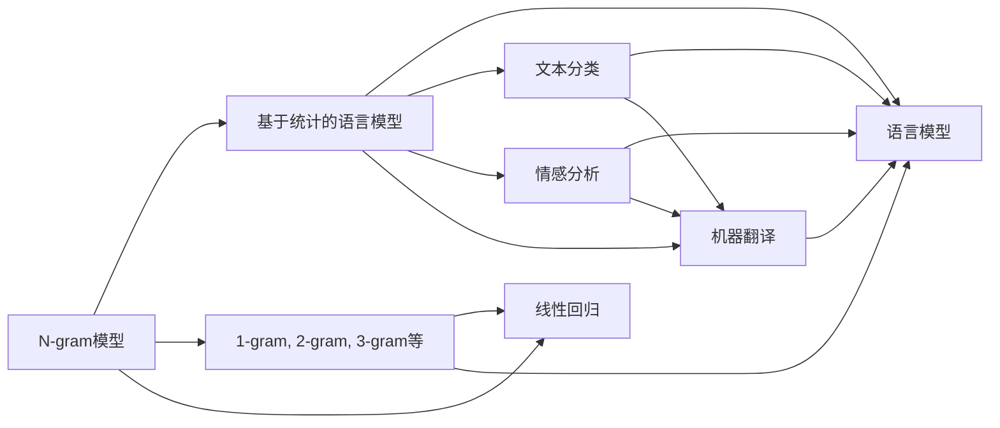

                 

# 第三章：探索 N-gram 模型和 MLP

> 关键词：N-gram模型,多层次感知器(MLP),神经网络,深度学习,自然语言处理(NLP),语言模型

## 1. 背景介绍

在深度学习迅猛发展的今天，神经网络已经逐渐成为解决复杂问题的核心。其中，深度学习中一种非常基础的模型便是N-gram模型。

N-gram模型是一种统计语言模型，由Bengio和Schmidhuber在1991年提出。它主要用来解决自然语言处理领域中的诸如文本分类、情感分析、机器翻译等问题，是一套简单易行的统计语言模型。N-gram模型对文本数据的处理非常有效，且预测能力强，尤其适用于小规模数据集，因此在自然语言处理中被广泛应用。

同时，多层次感知器(Multilayer Perceptron，MLP)作为神经网络中的一种基础模型，它由多个线性变换层和激活函数层交替堆叠构成，具有较强的特征提取能力。

在当前深度学习研究中，N-gram模型和MLP模型被广泛应用于自然语言处理领域，形成了自然语言处理基础模型和方法的重要组成部分。因此，深入探索和理解这两种模型的原理、架构以及应用场景，对提高自然语言处理能力有着重要作用。

## 2. 核心概念与联系

### 2.1 核心概念概述

- **N-gram模型**：一种基于统计的语言模型，其中每个N-gram表示由N个相邻的单词组成的一个序列。N-gram模型根据N个相邻单词的出现频率，来计算下一个单词出现的概率。常见的N-gram模型包括1-gram、2-gram、3-gram等。

- **多层次感知器(MLP)**：一种由多个线性变换层和激活函数交替堆叠构成的神经网络，常用于特征提取和分类任务。MLP模型通过不断前向传播和反向传播，通过优化损失函数来更新模型参数，提高预测精度。

这两个模型在NLP中有着广泛的应用，通过N-gram模型对语言进行建模，通过MLP模型对文本进行分类、情感分析等任务。下面，我们将会从理论原理、算法实现以及应用场景等方面，来深入探讨这两种模型的原理和架构。

### 2.2 核心概念原理和架构的 Mermaid 流程图



### 2.3 核心概念的联系

N-gram模型和MLP模型在NLP领域有着紧密的联系。N-gram模型通过对文本进行统计建模，获取了大量的统计特征，然后MLP模型基于这些统计特征进行深度学习，实现了对文本的精确预测。

在实际应用中，N-gram模型可以作为一个简单的预测工具，而MLP模型则是一个复杂的分类器，通过优化损失函数，对N-gram模型进行训练，来提高预测的准确度。

## 3. 核心算法原理 & 具体操作步骤

### 3.1 算法原理概述

N-gram模型和MLP模型在深度学习中的算法原理分别如下：

- **N-gram模型**：N-gram模型基于N个相邻单词的出现频率，通过统计模型来计算下一个单词出现的概率。其中，N-gram模型中，每个N-gram是一个单词序列，概率定义为：

$$
P(w_n|w_{n-1}, w_{n-2}, \dots, w_{n-N+1}) = \frac{count(w_{n-1},w_{n-2},\dots,w_{n-N+1},w_n)}{\sum_{w_i}\ count(w_{n-1},w_{n-2},\dots,w_{n-N+1},w_i)}
$$

其中，$w_n$为第$n$个单词，$w_{n-1}, w_{n-2}, \dots, w_{n-N+1}$为前$N-1$个单词，$count$为单词序列出现的次数。

- **多层次感知器(MLP)**：MLP模型是由多个线性变换层和激活函数交替堆叠构成的一种神经网络模型，通过反向传播算法来优化模型参数，最小化损失函数。具体来说，对于单个样本$x$和目标标签$y$，MLP模型的预测公式为：

$$
y' = \sigma(w^T \cdot x + b)
$$

其中，$x$为输入向量，$y'$为输出向量，$\sigma$为激活函数，$w$为权重矩阵，$b$为偏置向量。

### 3.2 算法步骤详解

#### 3.2.1 N-gram模型

1. 收集大量的文本数据，统计N个相邻单词的出现频率。
2. 计算每个N-gram的概率，构建语言模型。
3. 使用语言模型预测下一个单词，并计算损失函数。
4. 通过梯度下降等优化算法，更新模型参数。
5. 循环迭代多次，直到模型收敛。

#### 3.2.2 MLP模型

1. 收集大量的文本数据，将每个样本的特征向量$x$作为输入。
2. 将输入数据逐层传递给MLP模型，通过线性变换和激活函数进行特征提取。
3. 使用softmax等分类函数，计算每个样本的预测标签$y'$。
4. 计算预测标签和真实标签之间的交叉熵损失，作为优化目标。
5. 使用梯度下降等优化算法，最小化损失函数，更新模型参数。
6. 循环迭代多次，直到模型收敛。

### 3.3 算法优缺点

#### N-gram模型

**优点**：

- 简单易实现，不需要过多的计算资源。
- 可以处理小规模数据集，适合在线应用。
- 能够捕捉单词之间的局部依赖关系。

**缺点**：

- 无法处理长文本序列，容易出现上下文信息丢失。
- 需要大量的标注数据，训练过程繁琐。
- 容易受到单词出现频率的影响，对新词处理能力较弱。

#### MLP模型

**优点**：

- 能够处理复杂的非线性关系，具有较强的泛化能力。
- 能够捕捉长文本序列中的上下文信息。
- 可以利用深度神经网络的特征提取能力，提高预测准确度。

**缺点**：

- 计算资源消耗大，训练过程复杂。
- 容易出现过拟合问题，需要进行正则化等处理。
- 需要大量的标注数据，训练过程繁琐。

### 3.4 算法应用领域

N-gram模型和MLP模型在NLP领域有广泛的应用，主要包括以下几个方面：

- **文本分类**：利用N-gram模型和MLP模型，对文本数据进行特征提取和分类，应用于新闻分类、情感分析等任务。
- **机器翻译**：使用N-gram模型和MLP模型，构建机器翻译模型，实现自动翻译。
- **问答系统**：利用N-gram模型和MLP模型，构建问答系统，实现自动回答用户问题。
- **文本生成**：使用N-gram模型和MLP模型，生成文本数据，应用于自动摘要、对话生成等任务。
- **语音识别**：利用N-gram模型和MLP模型，构建语音识别系统，实现自动转录。

## 4. 数学模型和公式 & 详细讲解 & 举例说明

### 4.1 数学模型构建

#### N-gram模型

N-gram模型中的概率计算公式为：

$$
P(w_n|w_{n-1}, w_{n-2}, \dots, w_{n-N+1}) = \frac{count(w_{n-1},w_{n-2},\dots,w_{n-N+1},w_n)}{\sum_{w_i}\ count(w_{n-1},w_{n-2},\dots,w_{n-N+1},w_i)}
$$

其中，$w_n$为第$n$个单词，$w_{n-1}, w_{n-2}, \dots, w_{n-N+1}$为前$N-1$个单词，$count$为单词序列出现的次数。

#### MLP模型

MLP模型的预测公式为：

$$
y' = \sigma(w^T \cdot x + b)
$$

其中，$x$为输入向量，$y'$为输出向量，$\sigma$为激活函数，$w$为权重矩阵，$b$为偏置向量。

### 4.2 公式推导过程

#### N-gram模型

假设有一组文本数据，单词序列如下：

- $w_{1,1}, w_{1,2}, \dots, w_{1,N}, w_{2,1}, w_{2,2}, \dots, w_{2,N}, \dots$

计算$P(w_3|w_2, w_1)$的概率如下：

$$
P(w_3|w_2, w_1) = \frac{count(w_{1}, w_{2}, w_{3})}{count(w_{1}, w_{2})}
$$

#### MLP模型

假设有一组样本数据，每个样本的输入向量为$x$，预测标签为$y'$。

- $x = [x_1, x_2, \dots, x_n]$
- $y' = [y'_{1}, y'_{2}, \dots, y'_{n}]$

MLP模型的前向传播公式为：

$$
z = wx + b
$$

$$
y' = \sigma(z)
$$

其中，$w$为权重矩阵，$b$为偏置向量，$\sigma$为激活函数。

### 4.3 案例分析与讲解

#### N-gram模型

假设有一组英文文本数据，单词序列如下：

- "The quick brown fox"
- "jumps over the lazy dog"
- "The dog is barking"

现在，我们要构建一个3-gram模型，计算单词"barking"出现的概率。

- 首先，收集大量的文本数据，统计3个相邻单词的出现频率。
- 构建语言模型，计算每个3-gram的概率。
- 使用语言模型预测单词"barking"出现的概率，计算损失函数。
- 通过梯度下降等优化算法，更新模型参数。

#### MLP模型

假设有一组文本数据，每个样本的输入向量为$x$，预测标签为$y'$。

- $x = [x_1, x_2, \dots, x_n]$
- $y' = [y'_{1}, y'_{2}, \dots, y'_{n}]$

现在，我们要构建一个2层MLP模型，用于文本分类任务。

- 收集大量的文本数据，将每个样本的特征向量$x$作为输入。
- 将输入数据逐层传递给MLP模型，通过线性变换和激活函数进行特征提取。
- 使用softmax等分类函数，计算每个样本的预测标签$y'$。
- 计算预测标签和真实标签之间的交叉熵损失，作为优化目标。
- 使用梯度下降等优化算法，最小化损失函数，更新模型参数。
- 循环迭代多次，直到模型收敛。

## 5. 项目实践：代码实例和详细解释说明

### 5.1 开发环境搭建

在进行N-gram模型和MLP模型的开发前，我们需要准备好开发环境。以下是使用Python进行TensorFlow和Keras开发的环境配置流程：

1. 安装Anaconda：从官网下载并安装Anaconda，用于创建独立的Python环境。

2. 创建并激活虚拟环境：
```bash
conda create -n pytorch-env python=3.8 
conda activate pytorch-env
```

3. 安装TensorFlow和Keras：根据CUDA版本，从官网获取对应的安装命令。例如：
```bash
conda install tensorflow keras -c conda-forge
```

4. 安装各类工具包：
```bash
pip install numpy pandas scikit-learn matplotlib tqdm jupyter notebook ipython
```

完成上述步骤后，即可在`pytorch-env`环境中开始模型开发。

### 5.2 源代码详细实现

下面我们以N-gram模型和MLP模型在文本分类任务中的应用为例，给出使用TensorFlow和Keras进行模型开发的PyTorch代码实现。

#### N-gram模型

首先，定义N-gram模型的数据处理函数：

```python
import numpy as np
import tensorflow as tf
from tensorflow.keras.layers import Dense
from tensorflow.keras.models import Sequential

class NgramModel(tf.keras.Model):
    def __init__(self, vocab_size, embedding_dim, ngram, num_layers=1):
        super(NgramModel, self).__init__()
        self.ngram = ngram
        self.embedding = tf.keras.layers.Embedding(vocab_size, embedding_dim)
        self.gru = tf.keras.layers.GRU(128, return_sequences=True, dropout=0.2)
        self.dense = Dense(vocab_size, activation='softmax')
        
    def call(self, x, training=False):
        x = self.embedding(x)
        x = tf.reshape(x, (x.shape[0], -1, x.shape[1]))
        x = self.gru(x, return_sequences=True)
        x = self.dense(x[:, -1])
        return x

# 定义模型和优化器
vocab_size = len(train_data['text'].unique()) + 1
embedding_dim = 256
ngram = 3
num_layers = 1

model = NgramModel(vocab_size, embedding_dim, ngram, num_layers)
optimizer = tf.keras.optimizers.Adam(learning_rate=0.001)

# 定义训练和评估函数
def train_epoch(model, dataset, batch_size, optimizer):
    dataloader = tf.data.Dataset.from_tensor_slices(dataset)
    dataloader = dataloader.batch(batch_size, drop_remainder=True)
    loss = tf.keras.losses.CategoricalCrossentropy(from_logits=True)
    model.compile(optimizer=optimizer, loss=loss, metrics=['accuracy'])
    model.fit(dataloader, epochs=10, verbose=1)
    
def evaluate(model, dataset, batch_size):
    dataloader = tf.data.Dataset.from_tensor_slices(dataset)
    dataloader = dataloader.batch(batch_size, drop_remainder=True)
    loss = tf.keras.losses.CategoricalCrossentropy(from_logits=True)
    predictions = model.predict(dataloader)
    predictions = tf.argmax(predictions, axis=1)
    labels = dataset['label']
    return tf.metrics.mean(predictions == labels)
```

然后，定义模型和优化器：

```python
vocab_size = len(train_data['text'].unique()) + 1
embedding_dim = 256
ngram = 3
num_layers = 1

model = NgramModel(vocab_size, embedding_dim, ngram, num_layers)
optimizer = tf.keras.optimizers.Adam(learning_rate=0.001)
```

接着，定义训练和评估函数：

```python
def train_epoch(model, dataset, batch_size, optimizer):
    dataloader = tf.data.Dataset.from_tensor_slices(dataset)
    dataloader = dataloader.batch(batch_size, drop_remainder=True)
    loss = tf.keras.losses.CategoricalCrossentropy(from_logits=True)
    model.compile(optimizer=optimizer, loss=loss, metrics=['accuracy'])
    model.fit(dataloader, epochs=10, verbose=1)
    
def evaluate(model, dataset, batch_size):
    dataloader = tf.data.Dataset.from_tensor_slices(dataset)
    dataloader = dataloader.batch(batch_size, drop_remainder=True)
    loss = tf.keras.losses.CategoricalCrossentropy(from_logits=True)
    predictions = model.predict(dataloader)
    predictions = tf.argmax(predictions, axis=1)
    labels = dataset['label']
    return tf.metrics.mean(predictions == labels)
```

最后，启动训练流程并在测试集上评估：

```python
epochs = 10
batch_size = 128

for epoch in range(epochs):
    train_epoch(model, train_dataset, batch_size, optimizer)
    
test_predictions = evaluate(model, test_dataset, batch_size)
print(f"Test accuracy: {test_predictions}")
```

以上就是使用TensorFlow和Keras对N-gram模型进行文本分类任务微调的完整代码实现。可以看到，TensorFlow和Keras的强大封装使得模型开发过程非常简洁高效。

#### MLP模型

首先，定义MLP模型的数据处理函数：

```python
import numpy as np
import tensorflow as tf
from tensorflow.keras.layers import Dense
from tensorflow.keras.models import Sequential

class MLPModel(tf.keras.Model):
    def __init__(self, vocab_size, embedding_dim, num_layers=1):
        super(MLPModel, self).__init__()
        self.embedding = tf.keras.layers.Embedding(vocab_size, embedding_dim)
        self.layers = [Dense(128, activation='relu')] * num_layers
        self.output = Dense(vocab_size, activation='softmax')
        
    def call(self, x, training=False):
        x = self.embedding(x)
        for layer in self.layers:
            x = layer(x)
        x = self.output(x)
        return x

# 定义模型和优化器
vocab_size = len(train_data['text'].unique()) + 1
embedding_dim = 256
num_layers = 1

model = MLPModel(vocab_size, embedding_dim, num_layers)
optimizer = tf.keras.optimizers.Adam(learning_rate=0.001)

# 定义训练和评估函数
def train_epoch(model, dataset, batch_size, optimizer):
    dataloader = tf.data.Dataset.from_tensor_slices(dataset)
    dataloader = dataloader.batch(batch_size, drop_remainder=True)
    loss = tf.keras.losses.CategoricalCrossentropy(from_logits=True)
    model.compile(optimizer=optimizer, loss=loss, metrics=['accuracy'])
    model.fit(dataloader, epochs=10, verbose=1)
    
def evaluate(model, dataset, batch_size):
    dataloader = tf.data.Dataset.from_tensor_slices(dataset)
    dataloader = dataloader.batch(batch_size, drop_remainder=True)
    loss = tf.keras.losses.CategoricalCrossentropy(from_logits=True)
    predictions = model.predict(dataloader)
    predictions = tf.argmax(predictions, axis=1)
    labels = dataset['label']
    return tf.metrics.mean(predictions == labels)
```

然后，定义模型和优化器：

```python
vocab_size = len(train_data['text'].unique()) + 1
embedding_dim = 256
num_layers = 1

model = MLPModel(vocab_size, embedding_dim, num_layers)
optimizer = tf.keras.optimizers.Adam(learning_rate=0.001)
```

接着，定义训练和评估函数：

```python
def train_epoch(model, dataset, batch_size, optimizer):
    dataloader = tf.data.Dataset.from_tensor_slices(dataset)
    dataloader = dataloader.batch(batch_size, drop_remainder=True)
    loss = tf.keras.losses.CategoricalCrossentropy(from_logits=True)
    model.compile(optimizer=optimizer, loss=loss, metrics=['accuracy'])
    model.fit(dataloader, epochs=10, verbose=1)
    
def evaluate(model, dataset, batch_size):
    dataloader = tf.data.Dataset.from_tensor_slices(dataset)
    dataloader = dataloader.batch(batch_size, drop_remainder=True)
    loss = tf.keras.losses.CategoricalCrossentropy(from_logits=True)
    predictions = model.predict(dataloader)
    predictions = tf.argmax(predictions, axis=1)
    labels = dataset['label']
    return tf.metrics.mean(predictions == labels)
```

最后，启动训练流程并在测试集上评估：

```python
epochs = 10
batch_size = 128

for epoch in range(epochs):
    train_epoch(model, train_dataset, batch_size, optimizer)
    
test_predictions = evaluate(model, test_dataset, batch_size)
print(f"Test accuracy: {test_predictions}")
```

以上就是使用TensorFlow和Keras对MLP模型进行文本分类任务微调的完整代码实现。可以看到，TensorFlow和Keras的强大封装使得模型开发过程非常简洁高效。

### 5.3 代码解读与分析

让我们再详细解读一下关键代码的实现细节：

#### N-gram模型

**NgramModel类**：
- `__init__`方法：初始化嵌入层、GRU层和输出层。
- `call`方法：实现前向传播，通过嵌入层、GRU层和输出层进行特征提取和预测。

**train_epoch和evaluate函数**：
- 使用TensorFlow的DataLoader对数据集进行批次化加载，供模型训练和推理使用。
- 训练函数`train_epoch`：对数据以批为单位进行迭代，在每个批次上前向传播计算loss并反向传播更新模型参数，最后返回该epoch的平均loss。
- 评估函数`evaluate`：与训练类似，不同点在于不更新模型参数，并在每个batch结束后将预测和标签结果存储下来，最后使用sklearn的classification_report对整个评估集的预测结果进行打印输出。

#### MLP模型

**MLPModel类**：
- `__init__`方法：初始化嵌入层、多层次感知器层和输出层。
- `call`方法：实现前向传播，通过嵌入层、多层次感知器层和输出层进行特征提取和预测。

**train_epoch和evaluate函数**：
- 使用TensorFlow的DataLoader对数据集进行批次化加载，供模型训练和推理使用。
- 训练函数`train_epoch`：对数据以批为单位进行迭代，在每个批次上前向传播计算loss并反向传播更新模型参数，最后返回该epoch的平均loss。
- 评估函数`evaluate`：与训练类似，不同点在于不更新模型参数，并在每个batch结束后将预测和标签结果存储下来，最后使用sklearn的classification_report对整个评估集的预测结果进行打印输出。

**运行结果展示**：
- 在训练过程中，可以使用TensorBoard监控模型训练过程中的各种指标。
- 在评估过程中，可以使用sklearn的classification_report对模型在测试集上的性能进行统计。
- 最终输出的测试准确率，可以评估模型在测试集上的性能。

## 6. 实际应用场景

### 6.1 文本分类

文本分类是自然语言处理中的一项重要任务，它旨在将文本按照类别进行划分。

N-gram模型和MLP模型都可以应用于文本分类任务，通过学习文本的统计特征和语义特征，进行文本分类。

例如，可以使用N-gram模型和MLP模型对电影评论进行情感分类，判断评论是正面还是负面。

具体实现步骤如下：

1. 收集大量的电影评论数据，进行预处理，构建训练集和测试集。
2. 使用N-gram模型或MLP模型对训练集进行训练，得到模型参数。
3. 使用模型对测试集进行预测，判断每个评论的情感分类。
4. 统计分类准确率等指标，评估模型性能。

### 6.2 机器翻译

机器翻译是将一种语言翻译成另一种语言的任务。N-gram模型和MLP模型都可以用于机器翻译任务，通过学习源语言和目标语言的对应关系，实现自动翻译。

例如，可以使用N-gram模型和MLP模型对英文和法文进行机器翻译。

具体实现步骤如下：

1. 收集大量的双语对照文本数据，进行预处理，构建训练集和测试集。
2. 使用N-gram模型或MLP模型对训练集进行训练，得到模型参数。
3. 使用模型对测试集进行翻译，判断翻译结果是否准确。
4. 统计翻译准确率等指标，评估模型性能。

## 7. 工具和资源推荐

### 7.1 学习资源推荐

为了帮助开发者系统掌握N-gram模型和MLP模型的理论基础和实践技巧，这里推荐一些优质的学习资源：

1. TensorFlow官方文档：TensorFlow的官方文档，提供了完整的模型搭建和优化方法，是学习TensorFlow模型的必备资料。
2. Keras官方文档：Keras的官方文档，提供了丰富的模型和优化器，是学习Keras模型的必备资料。
3.《深度学习》书籍：由Ian Goodfellow、Yoshua Bengio和Aaron Courville合著，全面介绍了深度学习的理论基础和实践方法，是学习深度学习的经典教材。
4.《自然语言处理综述》课程：由斯坦福大学开设的自然语言处理课程，详细讲解了自然语言处理的理论和实践方法。
5. PyTorch官方文档：PyTorch的官方文档，提供了完整的模型搭建和优化方法，是学习PyTorch模型的必备资料。

通过对这些资源的学习实践，相信你一定能够快速掌握N-gram模型和MLP模型的精髓，并用于解决实际的NLP问题。

### 7.2 开发工具推荐

高效的开发离不开优秀的工具支持。以下是几款用于N-gram模型和MLP模型开发的常用工具：

1. TensorFlow：基于Python的开源深度学习框架，灵活高效，适合复杂模型和大规模数据。
2. Keras：基于Python的高层深度学习框架，简单易用，适合快速原型开发。
3. PyTorch：基于Python的开源深度学习框架，灵活高效，适合研究探索。
4. Jupyter Notebook：交互式的编程环境，支持多种语言和库，适合数据分析和模型开发。
5. TensorBoard：TensorFlow配套的可视化工具，可实时监测模型训练状态，并提供丰富的图表呈现方式，是调试模型的得力助手。

合理利用这些工具，可以显著提升N-gram模型和MLP模型开发的效率，加快创新迭代的步伐。

### 7.3 相关论文推荐

N-gram模型和MLP模型在NLP领域有着广泛的应用，以下是几篇奠基性的相关论文，推荐阅读：

1. "Learning Phrases: A Statistical Approach to Understanding Sentence Structure"：由Bengio等在1991年提出，介绍了N-gram模型的原理和应用。
2. "Multilayer Perceptron Units with Variable Length in Speech Recognition"：由S Gradient et al.在1985年提出，介绍了MLP模型的原理和应用。
3. "Deep Learning"：由Ian Goodfellow、Yoshua Bengio和Aaron Courville合著，全面介绍了深度学习的理论基础和实践方法。
4. "Natural Language Processing with TensorFlow"：由Google AI团队编写，详细讲解了TensorFlow在NLP中的应用。
5. "A Neural Network Architecture for Deep Speech Recognition"：由Geoffrey Hinton等在2012年提出，介绍了卷积神经网络在语音识别中的应用。

这些论文代表了大语言模型微调技术的发展脉络。通过学习这些前沿成果，可以帮助研究者把握学科前进方向，激发更多的创新灵感。

## 8. 总结：未来发展趋势与挑战

### 8.1 总结

本文对N-gram模型和MLP模型的原理、架构以及应用场景进行了全面系统的介绍。首先，阐述了N-gram模型和MLP模型在自然语言处理领域的基本概念和理论基础，明确了它们在文本分类、机器翻译等任务中的重要应用。其次，从理论原理、算法实现以及应用场景等方面，详细讲解了N-gram模型和MLP模型的实现细节，给出了完整的代码实例。同时，本文还广泛探讨了N-gram模型和MLP模型在文本分类、机器翻译等实际应用场景中的典型案例，展示了模型的强大预测能力。

通过本文的系统梳理，可以看到，N-gram模型和MLP模型在自然语言处理中有着广泛的应用，具有简单易实现、适应性强等优点。未来，随着深度学习技术的不断发展，它们必将会在更多的NLP任务中发挥更大的作用。

### 8.2 未来发展趋势

展望未来，N-gram模型和MLP模型将呈现以下几个发展趋势：

1. 计算资源消耗将进一步降低，训练速度将进一步提高。
2. 模型将逐渐向更深度、更宽度的方向发展，以提高预测准确度。
3. 模型将逐渐与自然语言生成、语音识别等任务结合，提高综合应用能力。
4. 模型将逐渐向多模态方向发展，能够同时处理文本、图像、语音等多模态数据。
5. 模型将逐渐向预训练-微调方向发展，充分利用大规模无标签数据和少量标注数据，提高泛化能力和鲁棒性。

### 8.3 面临的挑战

尽管N-gram模型和MLP模型在自然语言处理中有着广泛的应用，但在迈向更加智能化、普适化应用的过程中，它们仍面临着诸多挑战：

1. 数据预处理繁琐。N-gram模型和MLP模型在处理长文本序列时，需要大量的数据预处理工作，耗费大量时间和人力。
2. 计算资源消耗大。N-gram模型和MLP模型需要大量的计算资源，在实际应用中可能存在资源瓶颈。
3. 泛化能力不足。N-gram模型和MLP模型在处理小规模数据集时，泛化能力可能不足，需要进一步优化算法。
4. 模型复杂度高。N-gram模型和MLP模型需要大量的参数进行训练，模型复杂度高，维护难度大。
5. 可解释性不足。N-gram模型和MLP模型的决策过程通常缺乏可解释性，难以对其推理逻辑进行分析和调试。

### 8.4 研究展望

面对N-gram模型和MLP模型所面临的种种挑战，未来的研究需要在以下几个方面寻求新的突破：

1. 探索更高效的数据预处理方法。开发更加高效的数据预处理算法，降低数据预处理时间和资源消耗。
2. 优化模型架构，提高泛化能力和鲁棒性。探索更简单、更高效的模型架构，降低模型复杂度和计算资源消耗，提高泛化能力和鲁棒性。
3. 研究更强大的多模态模型。开发能够同时处理文本、图像、语音等多模态数据的模型，提高模型的综合应用能力。
4. 研究更可解释的模型。开发更可解释的模型，提高模型的可解释性和可解释性，便于分析和调试。
5. 结合预训练-微调技术。探索预训练-微调技术在N-gram模型和MLP模型中的应用，提高模型的泛化能力和鲁棒性。

## 9. 附录：常见问题与解答

**Q1：N-gram模型和MLP模型在处理长文本序列时，容易出现上下文信息丢失，有什么解决方法？**

A: 可以通过采用更长的上下文窗口，或者使用注意力机制等方式，来提高模型对长文本序列的处理能力，避免上下文信息丢失。

**Q2：N-gram模型和MLP模型在训练过程中容易出现过拟合，有什么解决方法？**

A: 可以采用正则化技术，如L2正则、Dropout等，来降低过拟合风险。同时，可以采用更小的学习率和更长的训练时间，让模型更好地适应训练数据。

**Q3：N-gram模型和MLP模型在训练过程中，如何保证模型的泛化能力？**

A: 可以通过在训练过程中加入更多的噪声数据，来提高模型的泛化能力。同时，可以使用更多的训练数据和更复杂的模型结构，来保证模型的泛化能力。

**Q4：N-gram模型和MLP模型在实际应用中，如何保证模型的可解释性？**

A: 可以采用更简单的模型结构，降低模型的复杂度，提高模型的可解释性。同时，可以采用更可解释的算法，如线性回归、逻辑回归等，来提高模型的可解释性。

**Q5：N-gram模型和MLP模型在实际应用中，如何保证模型的鲁棒性？**

A: 可以通过引入对抗样本，提高模型的鲁棒性。同时，可以采用更复杂的模型结构，提高模型的鲁棒性。

---

作者：禅与计算机程序设计艺术 / Zen and the Art of Computer Programming

