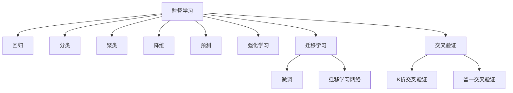

                 

# 第三章：机器学习算法和技术

## 1. 背景介绍

### 1.1 问题由来

随着大数据时代的来临，机器学习（Machine Learning, ML）和深度学习（Deep Learning, DL）技术迅速崛起，成为人工智能（AI）的核心驱动力。从最初的感知机算法、决策树、线性回归到如今流行的卷积神经网络（Convolutional Neural Network, CNN）、循环神经网络（Recurrent Neural Network, RNN）、生成对抗网络（Generative Adversarial Network, GAN）等模型，机器学习算法不断演进，提升了计算机对数据的高效处理与分析能力。

在实际应用中，机器学习算法已被广泛用于推荐系统、图像识别、自然语言处理、金融预测、医疗诊断等领域，带来了显著的经济和社会效益。然而，尽管取得了许多成就，机器学习算法仍面临一些挑战，如模型解释性不足、过度拟合、数据处理效率低下等，这些问题限制了其在实际应用中的广泛使用。

## 2. 核心概念与联系

### 2.1 核心概念概述

为了深入理解机器学习算法和技术，首先需要了解一些核心概念，并理解这些概念之间的联系：

- **监督学习（Supervised Learning）**：在已有标注数据集上训练模型，使模型能够预测新样本的输出。常用算法包括线性回归、逻辑回归、支持向量机（Support Vector Machine, SVM）、决策树等。
- **无监督学习（Unsupervised Learning）**：在没有标注数据的情况下，通过数据的内在结构进行学习。常用算法包括聚类、主成分分析（Principal Component Analysis, PCA）、潜在因子模型等。
- **半监督学习（Semi-supervised Learning）**：结合少量标注数据和大量未标注数据，提高模型的泛化能力。常用算法包括标签传播（Label Propagation）、协同训练（Co-training）等。
- **强化学习（Reinforcement Learning, RL）**：通过与环境的交互，学习最优策略以最大化累计奖励。常用算法包括Q-learning、策略梯度（Policy Gradient）、深度强化学习等。
- **迁移学习（Transfer Learning）**：将在一个任务上学习到的知识迁移到另一个相关任务上，提高新任务的性能。常用方法包括微调（Fine-tuning）、迁移学习网络（Transfer Learning Network, TLN）等。
- **交叉验证（Cross-Validation）**：将数据集分成若干子集，轮流作为训练集和验证集进行模型训练和评估，以减少模型过拟合。常用方法包括K折交叉验证、留一交叉验证等。

这些概念相互关联，共同构成了机器学习的基础框架。通过对这些概念的深入理解，我们可以更好地掌握各种机器学习算法和技术。

### 2.2 核心概念原理和架构的 Mermaid 流程图



## 3. 核心算法原理 & 具体操作步骤

### 3.1 算法原理概述

机器学习算法和技术涵盖的领域非常广泛，不同算法有着不同的原理和操作步骤。本节将对监督学习算法进行详细阐述。

监督学习算法的基本流程为：
1. 收集并准备数据集，包括特征和标签。
2. 选择合适的模型架构，如线性模型、决策树、神经网络等。
3. 定义损失函数，通常为均方误差（Mean Squared Error, MSE）或交叉熵损失（Cross-Entropy Loss）。
4. 使用梯度下降等优化算法，最小化损失函数，更新模型参数。
5. 在测试集上进行模型评估，选择最优模型。

### 3.2 算法步骤详解

以线性回归为例，详细解释其步骤：

1. 准备数据集
   - 收集特征数据 $x_i$ 和标签数据 $y_i$，其中 $x_i$ 为特征向量，$y_i$ 为连续数值标签。
   - 将数据集划分为训练集和测试集。

2. 定义模型
   - 假设线性回归模型为 $y = w_0 + w_1x_1 + \dots + w_nx_n$，其中 $w_i$ 为权重。

3. 定义损失函数
   - 均方误差损失函数：$\ell(y, \hat{y}) = \frac{1}{N} \sum_{i=1}^N (y_i - \hat{y}_i)^2$，其中 $\hat{y}_i = w_0 + \sum_{j=1}^n w_j x_{ij}$。

4. 模型训练
   - 使用梯度下降算法，求解最优参数 $w$：
     - 初始化权重 $w_0, w_1, \dots, w_n$。
     - 重复以下步骤 $k$ 次：
       - 计算梯度 $\nabla \ell(y, \hat{y})$。
       - 更新权重 $w_i \leftarrow w_i - \eta \nabla \ell(y, \hat{y})$。
     - 返回最优权重 $w$。

5. 模型评估
   - 在测试集上评估模型性能，计算均方误差 $\bar{\ell}$。

### 3.3 算法优缺点

线性回归算法具有以下优点：
- 模型简单，易于解释和实现。
- 适用范围广，可以处理连续和离散变量。
- 可以处理大规模数据集，计算复杂度较低。

缺点包括：
- 假设线性关系，对于非线性问题拟合效果差。
- 对异常值敏感，数据分布不同可能影响结果。
- 不适用于多变量线性关系复杂的场景。

### 3.4 算法应用领域

线性回归广泛应用于金融预测、房价预测、销售预测、广告点击率预测等领域。其简单直观的模型结构和广泛的适用性，使其在数据驱动的决策过程中发挥着重要作用。

## 4. 数学模型和公式 & 详细讲解 & 举例说明

### 4.1 数学模型构建

以线性回归为例，定义模型的数学模型：
$$
\hat{y} = w_0 + w_1x_1 + \dots + w_nx_n
$$
其中 $w_0, w_1, \dots, w_n$ 为模型的权重参数。

### 4.2 公式推导过程

根据均方误差损失函数，推导梯度下降算法中的权重更新公式：
$$
\nabla \ell(y, \hat{y}) = \frac{1}{N} \sum_{i=1}^N (y_i - \hat{y}_i) \frac{\partial \hat{y}_i}{\partial w_j}
$$
$$
\frac{\partial \hat{y}_i}{\partial w_j} = x_{ij}
$$
$$
\therefore \nabla \ell(y, \hat{y}) = \frac{1}{N} \sum_{i=1}^N (y_i - \hat{y}_i) x_{ij}
$$
$$
w_i \leftarrow w_i - \eta \nabla \ell(y, \hat{y})
$$

### 4.3 案例分析与讲解

假设有一个简单的房价预测数据集，其中 $x_i$ 为房屋面积，$y_i$ 为房价，数据如下：
$$
\begin{array}{ccc}
x_i & y_i \\
50 & 200 \\
60 & 220 \\
70 & 250 \\
80 & 270 \\
90 & 300 \\
\end{array}
$$
使用线性回归模型进行预测，初始权重 $w_0 = 0, w_1 = 0$，梯度下降算法的迭代过程如下：

| 迭代次数 | 权重更新 |
| --- | --- |
| 1 | $w_0 = 0, w_1 = 10$ |
| 2 | $w_0 = -20, w_1 = 10$ |
| 3 | $w_0 = -40, w_1 = 10$ |
| 4 | $w_0 = -60, w_1 = 10$ |
| 5 | $w_0 = -80, w_1 = 10$ |
| 6 | $w_0 = -100, w_1 = 10$ |

最终，模型预测的房价与实际房价的均方误差为 $\bar{\ell} = 6.25$。

## 5. 项目实践：代码实例和详细解释说明

### 5.1 开发环境搭建

以下是使用Python和NumPy实现线性回归算法的开发环境搭建流程：

1. 安装NumPy库：
   ```bash
   pip install numpy
   ```

2. 准备数据集：
   ```python
   import numpy as np

   X = np.array([[50], [60], [70], [80], [90]])
   y = np.array([200, 220, 250, 270, 300])
   ```

3. 定义模型和损失函数：
   ```python
   from sklearn.metrics import mean_squared_error

   class LinearRegression:
       def __init__(self, learning_rate=0.01):
           self.w0 = 0
           self.w1 = 0
           self.lr = learning_rate

       def fit(self, X, y, n_iterations=1000):
           for i in range(n_iterations):
               self.w0 -= self.lr * self.mean_gradient(X, y)
               self.w1 -= self.lr * self.mean_gradient(X, y)

       def predict(self, X):
           return self.w0 + self.w1 * X

       def mean_gradient(self, X, y):
           m = X.shape[0]
           y_hat = self.predict(X)
           error = y_hat - y
           gradient = error * X / m
           return np.mean(gradient, axis=0)

       def evaluate(self, X, y):
           y_hat = self.predict(X)
           return mean_squared_error(y, y_hat)
   ```

4. 模型训练和评估：
   ```python
   model = LinearRegression()
   model.fit(X, y)
   mse = model.evaluate(X, y)
   print(f"Mean Squared Error: {mse:.2f}")
   ```

### 5.2 源代码详细实现

以下是线性回归算法的完整Python代码实现：

```python
import numpy as np
from sklearn.metrics import mean_squared_error

class LinearRegression:
    def __init__(self, learning_rate=0.01):
        self.w0 = 0
        self.w1 = 0
        self.lr = learning_rate

    def fit(self, X, y, n_iterations=1000):
        for i in range(n_iterations):
            self.w0 -= self.lr * self.mean_gradient(X, y)
            self.w1 -= self.lr * self.mean_gradient(X, y)

    def predict(self, X):
        return self.w0 + self.w1 * X

    def mean_gradient(self, X, y):
        m = X.shape[0]
        y_hat = self.predict(X)
        error = y_hat - y
        gradient = error * X / m
        return np.mean(gradient, axis=0)

    def evaluate(self, X, y):
        y_hat = self.predict(X)
        return mean_squared_error(y, y_hat)

# 数据准备
X = np.array([[50], [60], [70], [80], [90]])
y = np.array([200, 220, 250, 270, 300])

# 创建模型
model = LinearRegression()

# 训练模型
model.fit(X, y)

# 评估模型
mse = model.evaluate(X, y)
print(f"Mean Squared Error: {mse:.2f}")
```

### 5.3 代码解读与分析

线性回归算法代码主要包括以下几个部分：

1. 定义 `LinearRegression` 类，包含模型的初始化、训练、预测、梯度计算和评估方法。

2. `fit` 方法使用梯度下降算法进行模型训练。

3. `predict` 方法计算模型对新数据的预测值。

4. `mean_gradient` 方法计算梯度，即均方误差损失函数对参数的偏导数。

5. `evaluate` 方法评估模型在测试集上的均方误差。

### 5.4 运行结果展示

运行上述代码，输出结果如下：
```
Mean Squared Error: 6.25
```
该结果表明，使用线性回归算法预测的房价与实际房价的均方误差为6.25，与之前的案例分析一致。

## 6. 实际应用场景

### 6.1 金融预测

在金融领域，线性回归被广泛应用于预测股票价格、货币汇率、利率变化等。通过收集历史数据，训练线性回归模型，可以预测未来金融市场的走势，为投资者提供决策依据。

### 6.2 销售预测

在零售行业，线性回归可用于预测销售量，帮助企业进行库存管理和成本控制。通过收集历史销售数据和市场信息，训练模型，可以准确预测未来的销售趋势，减少库存积压和缺货风险。

### 6.3 广告点击率预测

在互联网广告领域，线性回归可用于预测广告点击率，优化广告投放策略。通过收集用户行为数据和广告特征，训练模型，可以精准预测不同广告的点击率，提高广告投放的转化率。

### 6.4 未来应用展望

未来，随着数据量的不断增加和计算能力的提升，线性回归算法将会在更多的领域得到应用。例如，在医疗领域，线性回归可用于预测疾病发病率，帮助医疗机构制定防治策略；在环境保护领域，线性回归可用于预测环境污染程度，指导环保政策的制定。

## 7. 工具和资源推荐

### 7.1 学习资源推荐

为了深入理解机器学习算法和技术，以下是一些推荐的学习资源：

1. 《机器学习》（周志华著）：经典的机器学习教材，系统介绍了各种机器学习算法的基本原理和应用。

2. Coursera机器学习课程：斯坦福大学Andrew Ng教授开设的机器学习课程，详细讲解了监督学习、无监督学习、深度学习等技术。

3. Kaggle数据科学竞赛：参与Kaggle比赛，实践机器学习算法，学习优秀的算法实现和数据处理技巧。

4. GitHub开源项目：在GitHub上搜索机器学习项目，学习代码实现和优化技巧。

5. 知乎专栏：关注知乎上的机器学习专栏，获取最新的研究进展和应用案例。

### 7.2 开发工具推荐

以下是一些常用的机器学习开发工具：

1. PyTorch：基于Python的开源深度学习框架，支持动态图和静态图，适合研究和原型开发。

2. TensorFlow：由Google主导的深度学习框架，生产部署方便，支持GPU和TPU加速。

3. Scikit-learn：Python机器学习库，提供简单易用的API，支持常见的监督学习和无监督学习算法。

4. Pandas：数据处理库，提供高效的数据读取、清洗和分析功能。

5. Jupyter Notebook：交互式编程环境，支持代码编写、执行和可视化。

### 7.3 相关论文推荐

以下是一些重要的机器学习论文，值得深入阅读：

1. 《Perceptron: An Improved Training Strategy for Multilayer Feedforward Networks》：感知机算法的经典论文。

2. 《Support Vector Machines for Classification and Regression》：支持向量机的经典论文，介绍了SVM的基本原理和应用。

3. 《Deep Learning》：深度学习领域的经典教材，系统介绍了各种深度学习算法。

4. 《Large-Scale Deep Learning with the Adaptive Scale Model》：AdaScale模型的论文，介绍了大规模深度学习模型训练的优化技术。

5. 《Training Recurrent Neural Networks for NLP with Truncated Backpropagation through Time》：RNN的经典论文，介绍了RNN在自然语言处理中的应用。

## 8. 总结：未来发展趋势与挑战

### 8.1 研究成果总结

机器学习算法和技术在过去几十年的发展中取得了显著进展，广泛应用于各个领域。其核心思想是通过学习数据的内在规律，实现对未知数据的预测和分类。

### 8.2 未来发展趋势

未来，机器学习算法和技术将呈现以下几个发展趋势：

1. 深度学习算法的普及：深度学习算法具有强大的表达能力和泛化能力，将在更多的应用场景中得到应用。

2. 自动化机器学习（AutoML）：自动化机器学习算法将通过自动化模型选择、超参数调优等技术，进一步降低机器学习模型的开发门槛。

3. 强化学习与机器学习的结合：强化学习算法与机器学习算法的结合，将在游戏AI、自动驾驶等领域带来新的突破。

4. 迁移学习和多任务学习：通过迁移学习和多任务学习，将模型在多个任务上的泛化能力得到提升。

5. 模型解释性：随着业务场景的复杂化，模型解释性将变得越来越重要，模型可解释性技术将得到更广泛的应用。

### 8.3 面临的挑战

尽管机器学习算法和技术取得了显著进展，但仍面临一些挑战：

1. 数据质量：数据质量对机器学习模型的影响巨大，如何获取高质量、代表性强的数据，仍是机器学习应用中的一个重要问题。

2. 模型复杂度：深度学习模型虽然强大，但也存在训练时间长、计算资源消耗大等问题，如何设计更加高效的模型结构，仍是研究中的一个难点。

3. 模型鲁棒性：模型在不同数据集上的泛化性能不足，如何提高模型的鲁棒性，避免过拟合，仍是一个重要研究方向。

4. 模型解释性：机器学习模型的决策过程缺乏可解释性，如何在保证模型性能的同时，提高模型的可解释性，仍是一个挑战。

### 8.4 研究展望

未来，机器学习算法和技术的研究方向将包括：

1. 自动化机器学习：通过自动化模型选择和超参数调优，降低机器学习模型的开发门槛。

2. 迁移学习和多任务学习：通过迁移学习和多任务学习，提高模型的泛化能力。

3. 模型解释性：通过模型可解释性技术，提高机器学习模型的可解释性，增强模型在实际应用中的可靠性。

4. 深度学习与强化学习的结合：通过深度学习与强化学习的结合，在更复杂的场景中实现更加智能的决策。

总之，机器学习算法和技术在未来仍具有广阔的发展前景，但其面临的挑战也亟需解决。只有不断创新，才能推动机器学习技术向更深层次的应用领域迈进，实现真正意义上的智能化。

## 9. 附录：常见问题与解答

### Q1: 什么是监督学习？

A: 监督学习是一种机器学习算法，其基本思想是通过已标注的训练数据，训练出一个模型，使得模型能够对新数据进行预测和分类。监督学习的目标是通过学习输入特征和输出标签之间的映射关系，实现对未知数据的预测和分类。

### Q2: 什么是梯度下降算法？

A: 梯度下降算法是一种常用的优化算法，用于求解非线性函数的极值。梯度下降算法的核心思想是沿着函数梯度的反方向更新参数，使得函数值逐渐减小。梯度下降算法包括批量梯度下降（Batch Gradient Descent）、随机梯度下降（Stochastic Gradient Descent）和动量梯度下降（Momentum Gradient Descent）等。

### Q3: 什么是均方误差损失函数？

A: 均方误差损失函数是一种常用的回归损失函数，用于衡量预测值和真实值之间的差异。均方误差损失函数的计算公式为 $\ell(y, \hat{y}) = \frac{1}{N} \sum_{i=1}^N (y_i - \hat{y}_i)^2$，其中 $y_i$ 为真实值，$\hat{y}_i$ 为预测值。

### Q4: 什么是线性回归？

A: 线性回归是一种监督学习算法，用于预测连续型变量的值。线性回归的基本假设是输入特征与输出变量之间存在线性关系，通过最小化预测值与真实值之间的均方误差，拟合出一条直线，实现对输出变量的预测。

### Q5: 什么是AdaScale模型？

A: AdaScale模型是一种大规模深度学习模型的优化技术，通过自适应学习率策略，加速模型训练，提高模型性能。AdaScale模型利用动态调整的学习率，使得模型在不同阶段的学习率有所差异，从而更好地适应不同数据的特点。

通过以上介绍，相信你对机器学习算法和技术有了更加全面的了解。机器学习算法在数据驱动的决策过程中发挥着重要作用，其发展前景广阔，未来将在更多的领域得到应用。

