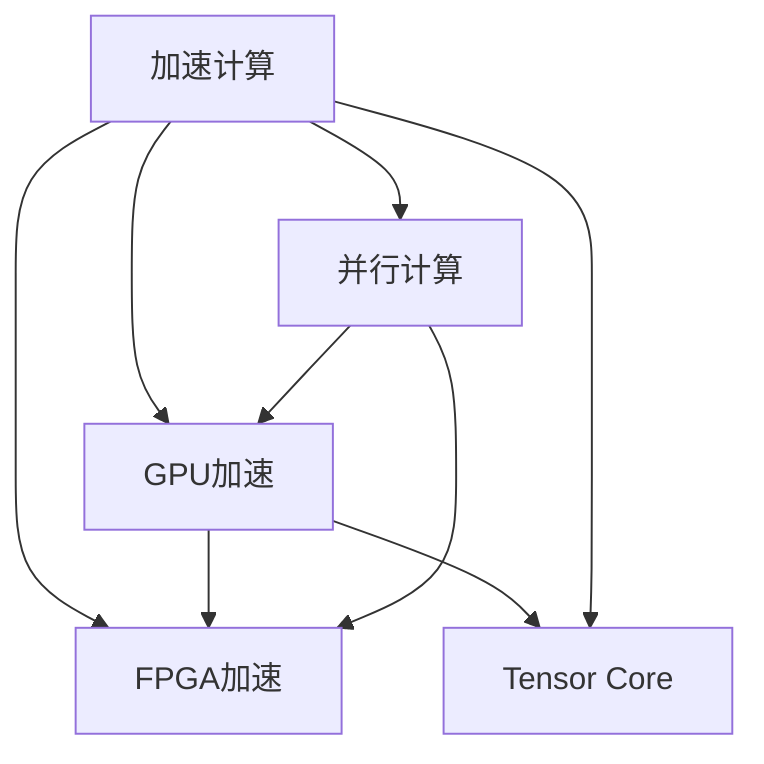

                 

# 第八章：设备加速：CPU、GPU 和更多

> 关键词：加速计算，硬件性能优化，设备协处理，多核优化，深度学习框架，模型部署

## 1. 背景介绍

随着人工智能（AI）技术的快速进步，设备加速（Device Acceleration）成为了提升AI模型性能和效率的关键手段。在大数据、深度学习和图像处理等领域，传统的CPU处理能力已经无法满足需求，而GPU（图形处理单元）和FPGA（现场可编程门阵列）等专用硬件设备，则成为了加速计算的主要工具。

设备加速的根本原理是利用硬件的并行计算能力，通过将计算任务分配到不同的硬件单元，从而实现加速。例如，GPU拥有大量的计算单元（CU），可以在单芯片上实现数万到数十万核心的并行计算能力，远超传统CPU。同时，GPU的SIMD（单指令多数据）架构，能够高效地执行数据密集型的计算任务，如矩阵乘法、卷积操作等。

除了GPU，TILE、DSP（数字信号处理器）和NPU（神经网络处理器）等新型硬件设备也逐渐进入AI计算领域。这些设备具备更高的计算密度和能效比，能够在特定应用场景中提供超越传统CPU和GPU的性能优势。

## 2. 核心概念与联系

### 2.1 核心概念概述

设备加速涉及的核心理念包括：

- **加速计算（Acceleration Computing）**：利用专用硬件设备加速数据密集型计算，提升AI模型的处理能力。
- **并行计算（Parallel Computing）**：通过将计算任务分配到多个处理器核心或硬件单元，实现计算任务的并行执行。
- **GPU加速**：使用图形处理单元GPU进行计算加速，利用其并行处理能力和SIMD架构。
- **FPGA加速**：利用现场可编程门阵列FPGA进行计算加速，通过硬件逻辑优化提升性能。
- **Tensor Core**：NVIDIA GPU中专门用于张量计算的硬件单元，能够加速深度学习模型中的矩阵运算。

这些概念之间存在紧密的联系，如图2-1所示：



其中，加速计算是目标，并行计算是其手段，而GPU加速和FPGA加速是实现加速计算的具体技术路径。

### 2.2 核心概念原理和架构的 Mermaid 流程图

以下是基于GPU加速的计算流程的Mermaid流程图，展示了计算任务如何通过GPU进行加速：

```mermaid
graph LR
    CPU[CPU] --> GPU[GPU]
    GPU --> CUDA[CUDA]
    GPU --> CUDA[Kernels]
    CUDA --> GEMM[GEMM]
    CUDA --> Convolution[Convolution]
    GPU --> memory[Memory]
    CUDA --> memory[Read/Write]
    memory --> GPU[Transfer Data]

    Note over GEMM, Convolution: 矩阵乘法和卷积是深度学习中常见的操作
```

该流程图展示了从CPU向GPU转移数据，GPU通过CUDA执行GEMM和卷积操作，最后数据再次从GPU传输回内存的整个计算过程。

## 3. 核心算法原理 & 具体操作步骤

### 3.1 算法原理概述

设备加速的核心算法原理是利用硬件并行计算能力，通过将计算任务分解为多个并行执行的小任务，来提升计算效率。GPU和FPGA等专用硬件设备能够高效执行这些小任务，从而实现计算加速。

具体来说，设备加速算法主要包括以下几个步骤：

1. **数据传输**：将计算任务所需的输入数据从CPU传输到GPU或FPGA等专用硬件设备。
2. **并行计算**：利用硬件并行计算能力，将计算任务并行分解为多个子任务，并分配到不同的硬件单元执行。
3. **结果收集**：将各个子任务的结果收集合并，最终得到计算结果。

### 3.2 算法步骤详解

设备加速的具体操作步骤如下：

1. **数据准备**：将输入数据加载到CPU的内存中。
2. **数据传输**：通过DMA（直接内存访问）或网络传输等机制，将数据从CPU内存传输到GPU或FPGA等硬件设备的内存中。
3. **并行计算**：利用硬件设备的并行计算能力，执行深度学习模型中的矩阵运算、卷积操作等计算任务。
4. **结果传输**：将计算结果从硬件设备内存传输回CPU内存。
5. **结果处理**：将计算结果传递给上层软件系统进行进一步处理。

### 3.3 算法优缺点

设备加速算法的主要优点包括：

- **高效并行计算**：利用硬件设备的并行计算能力，大幅提升计算效率。
- **低延迟**：硬件设备与内存之间的高带宽传输，能够快速执行计算任务，降低延迟。
- **可扩展性**：硬件设备的数量可以动态增加，从而扩展计算能力。

其主要缺点包括：

- **硬件成本高**：专用硬件设备如GPU、FPGA等的初始投资较高，维护成本也不低。
- **编程复杂**：使用专用硬件设备需要编写特定的加速代码，增加了编程难度。
- **能耗高**：硬件加速设备通常能耗较大，需要专门的电源和散热系统。

### 3.4 算法应用领域

设备加速技术广泛应用于以下几个领域：

- **深度学习**：加速深度学习模型的训练和推理过程，提升模型的处理能力和效率。
- **计算机视觉**：加速图像处理和计算机视觉算法的计算，如图像分类、目标检测等。
- **数据分析**：加速大数据分析和科学计算，提升数据处理的速度和精度。
- **信号处理**：加速信号处理算法，如音频和视频编码、滤波等。
- **高性能计算**：加速复杂的科学计算和工程计算任务，如天气模拟、金融建模等。

## 4. 数学模型和公式 & 详细讲解 & 举例说明

### 4.1 数学模型构建

设备加速的数学模型构建通常涉及以下几个步骤：

1. **输入数据的表示**：将输入数据表示为向量或矩阵形式。
2. **计算任务的分解**：将计算任务分解为多个子任务，分配到不同的硬件设备执行。
3. **输出数据的表示**：将计算结果表示为向量或矩阵形式。

### 4.2 公式推导过程

以矩阵乘法为例，以下是GPU加速矩阵乘法的公式推导过程：

设输入矩阵为 $A$，大小为 $m \times n$，另一个输入矩阵为 $B$，大小为 $n \times p$，输出矩阵为 $C$，大小为 $m \times p$。在CPU上执行矩阵乘法的时间复杂度为 $O(m \times n \times p)$。

在GPU上，由于每个GPU核心可以并行执行多个计算任务，因此可以将矩阵乘法分解为多个子任务，每个子任务对应矩阵乘法的一个小区域。设GPU核心数量为 $k$，每个核心的计算速度为 $v$，则并行计算的时间复杂度为 $O(\frac{m \times n \times p}{k \times v})$。

### 4.3 案例分析与讲解

以下是一个使用TensorFlow进行GPU加速矩阵乘法的示例：

```python
import tensorflow as tf

# 创建GPU设备
with tf.device('/gpu:0'):
    # 定义输入矩阵A和B
    A = tf.random.normal([1000, 1000])
    B = tf.random.normal([1000, 1000])

    # 执行矩阵乘法
    C = tf.matmul(A, B)

# 计算结果
with tf.Session() as sess:
    C_value = sess.run(C)
    print(C_value)
```

该示例使用TensorFlow的GPU设备，定义了两个大小为 $1000 \times 1000$ 的矩阵 $A$ 和 $B$，并执行矩阵乘法操作 $C = A \times B$。最终结果存储在变量 $C_value$ 中。

## 5. 项目实践：代码实例和详细解释说明

### 5.1 开发环境搭建

设备加速的开发环境搭建需要考虑以下几个方面：

- **硬件配置**：确保设备有足够的计算能力和内存，支持并行计算。
- **软件环境**：安装深度学习框架和加速库，如TensorFlow、PyTorch、CUDA等。

以下是一个使用PyTorch和CUDA进行GPU加速的示例：

```bash
# 安装PyTorch和CUDA
pip install torch torchvision torchaudio
conda install cudatoolkit=11.1 -c pytorch -c conda-forge
```

### 5.2 源代码详细实现

以下是一个使用PyTorch进行GPU加速卷积操作的示例：

```python
import torch
import torch.nn as nn

# 定义卷积层
class Conv2d(nn.Module):
    def __init__(self):
        super(Conv2d, self).__init__()
        self.conv = nn.Conv2d(3, 64, kernel_size=3, stride=1, padding=1)

    def forward(self, x):
        x = self.conv(x)
        return x

# 创建卷积层实例
model = Conv2d().to('cuda')

# 定义输入数据
x = torch.randn(1, 3, 224, 224).cuda()

# 执行卷积操作
y = model(x)
print(y.shape)
```

该示例定义了一个包含卷积层的PyTorch模型，并使用`.to('cuda')`将模型迁移到GPU设备。然后定义了一个大小为 $1 \times 3 \times 224 \times 224$ 的输入张量 $x$，并使用模型执行卷积操作 $y = model(x)$。

### 5.3 代码解读与分析

以上代码中，`.to('cuda')`方法用于将模型和数据迁移到GPU设备。在执行卷积操作时，PyTorch会自动将计算任务分配到GPU核心进行并行计算，从而实现加速。

## 6. 实际应用场景

### 6.1 自动驾驶

自动驾驶系统需要处理大量的传感器数据，如摄像头、雷达、激光雷达等，实时进行环境感知、路径规划和决策。为了提升计算效率，自动驾驶系统通常采用GPU或FPGA等硬件设备进行加速计算。

以环境感知为例，可以使用深度学习模型进行图像处理和目标检测。通过在GPU上加速卷积操作，可以显著提升模型的推理速度，满足自动驾驶实时性的要求。

### 6.2 智能医疗

智能医疗系统需要对大量的医学影像数据进行分析和处理，如X光片、CT、MRI等。这些数据通常包含大量高维度的信息，需要高效的计算能力进行处理。

在智能医疗系统中，可以使用GPU加速深度学习模型进行图像分割、病变检测等任务。通过并行计算和数据并行处理，可以大幅提升模型的计算效率，缩短诊断时间，提高诊断精度。

### 6.3 金融风控

金融风控系统需要对海量交易数据进行实时分析和处理，如信用评分、欺诈检测等。这些任务通常涉及大量的矩阵运算和特征计算，需要高效的计算能力。

在金融风控系统中，可以使用GPU加速矩阵乘法和向量计算，提升模型的处理速度和效率。通过并行计算和数据并行处理，可以缩短分析时间，提高风险评估的准确性。

## 7. 工具和资源推荐

### 7.1 学习资源推荐

为了更好地学习设备加速技术，以下推荐一些优质的学习资源：

1. **《Deep Learning Specialization》课程**：由Andrew Ng教授主讲的Coursera课程，系统介绍了深度学习原理和加速计算技术。
2. **《CUDA Programming Guide》书籍**：NVIDIA官方书籍，详细介绍了CUDA编程和GPU加速技术。
3. **《TensorFlow Developer Guide》书籍**：Google官方书籍，介绍了TensorFlow框架的使用和加速技术。
4. **《PyTorch Developer Documentation》网站**：PyTorch官方文档，提供了详细的加速编程和优化建议。

通过学习这些资源，可以系统掌握设备加速技术的原理和实现方法。

### 7.2 开发工具推荐

以下是几款常用的设备加速开发工具：

1. **TensorFlow**：Google开源的深度学习框架，提供了丰富的GPU加速库和优化技术。
2. **PyTorch**：Facebook开源的深度学习框架，支持GPU和FPGA加速，提供了灵活的计算图和优化工具。
3. **CUDA**：NVIDIA开发的并行计算平台，支持GPU编程和加速计算。
4. **OpenCL**：开源的并行计算平台，支持CPU、GPU和FPGA等设备的编程和加速。

这些工具提供了高效的计算能力和丰富的优化技术，帮助开发者实现高效的设备加速计算。

### 7.3 相关论文推荐

设备加速技术的发展离不开学界的持续研究。以下推荐几篇代表性的相关论文：

1. **《CUDA Parallel Programming》论文**：由NVIDIA发表的CUDA编程指南，介绍了CUDA的并行计算和优化技术。
2. **《Accelerating Deep Learning with GPUs》论文**：Google发表的深度学习加速论文，介绍了GPU加速的原理和实践。
3. **《FPGA-Based Machine Learning Acceleration》论文**：IEEE发表的FPGA加速论文，介绍了FPGA在机器学习中的应用。
4. **《Parallel Computing for Deep Learning》论文**：IEEE发表的并行计算论文，介绍了深度学习模型的并行加速技术。

这些论文代表了设备加速技术的最新进展，可以帮助研究者把握学科的前沿方向。

## 8. 总结：未来发展趋势与挑战

### 8.1 研究成果总结

设备加速技术在深度学习、计算机视觉、数据分析等领域取得了显著的进展，大大提升了AI模型的处理能力和效率。GPU和FPGA等硬件设备的并行计算能力，成为推动AI技术发展的关键因素。

### 8.2 未来发展趋势

未来设备加速技术将呈现以下几个发展趋势：

1. **异构计算**：利用多种硬件设备（如GPU、FPGA、DSP等）的协同计算能力，提升整体系统的性能和效率。
2. **硬件统一编程**：通过硬件统一编程框架（如OpenCL、Rocm等），简化不同硬件设备的编程难度，提高开发效率。
3. **软件优化**：引入编译器优化、代码生成等技术，提升加速代码的性能和效率。
4. **低功耗计算**：开发低功耗的加速设备，提升能效比，降低计算成本。
5. **自动调优**：引入自动调优技术，实时调整计算参数，优化系统性能。

这些趋势将推动设备加速技术不断进步，提升AI模型的性能和效率。

### 8.3 面临的挑战

尽管设备加速技术在AI领域取得了显著进展，但在发展过程中仍面临一些挑战：

1. **硬件成本高**：专用硬件设备的初始投资和维护成本较高，增加了技术门槛。
2. **编程复杂**：开发高效的加速代码需要具备较高的编程技能和硬件知识，增加了开发难度。
3. **软件生态不完善**：尽管深度学习框架提供了GPU和FPGA的加速支持，但在实际应用中仍存在兼容性问题。
4. **能耗问题**：加速设备通常能耗较大，需要专门的散热和供电系统，增加了系统成本。
5. **标准化问题**：不同硬件设备的编程接口和加速库不同，难以实现跨平台开发和部署。

### 8.4 研究展望

未来设备加速技术的研究方向包括：

1. **硬件加速创新**：开发新型硬件设备，提升计算密度和能效比，降低成本。
2. **软件优化技术**：引入编译器优化、代码生成等技术，提升加速代码的性能和效率。
3. **跨平台协同计算**：开发统一的编程接口和加速库，实现跨平台开发和部署。
4. **智能调优技术**：引入自动调优技术，实时调整计算参数，优化系统性能。
5. **边缘计算**：将加速设备集成到边缘计算设备中，提升计算能力和实时性。

这些研究方向将推动设备加速技术不断进步，提升AI模型的性能和效率，为AI技术的广泛应用提供坚实的基础。

## 9. 附录：常见问题与解答

**Q1：设备加速对CPU有哪些影响？**

A: 设备加速对CPU的影响主要体现在两个方面：

1. **负载分担**：设备加速将部分计算任务分担到GPU或FPGA等硬件设备上，从而减轻CPU的计算负担。
2. **内存访问延迟**：设备加速需要对数据进行频繁的内存传输，增加了CPU的内存访问延迟。

**Q2：设备加速的并行计算是否适用于所有计算任务？**

A: 并行计算适用于数据密集型和计算密集型的计算任务，但对于I/O密集型任务（如文件读写、网络通信等），并行计算效果有限。

**Q3：如何选择适合设备加速的硬件设备？**

A: 选择适合设备加速的硬件设备需要考虑以下几个因素：

1. **计算能力**：选择计算能力较强的硬件设备，如GPU或FPGA等。
2. **内存带宽**：选择内存带宽较高的硬件设备，确保数据传输速度。
3. **功耗要求**：考虑系统的能耗要求，选择低功耗的硬件设备。

**Q4：如何优化设备加速的代码？**

A: 优化设备加速代码需要考虑以下几个方面：

1. **数据分配**：合理分配数据到不同硬件设备上，避免数据竞争和传输延迟。
2. **任务粒度**：将计算任务分解为多个小任务，分配到不同的硬件设备执行，提升并行计算效率。
3. **内存访问**：优化内存访问模式，减少数据传输延迟和带宽占用。
4. **并发控制**：合理控制并发度，避免竞争条件和死锁问题。

**Q5：设备加速在实际应用中需要注意哪些问题？**

A: 在实际应用中，设备加速需要注意以下几个问题：

1. **设备兼容性**：确保设备与硬件平台兼容，避免硬件设备冲突。
2. **编程复杂性**：优化编程难度，提高开发效率。
3. **性能调优**：通过调优参数、优化算法等方式，提升设备加速性能。
4. **系统稳定性**：确保设备加速系统的稳定性，避免崩溃和异常。

通过解决这些常见问题，可以更好地实现设备加速技术的应用。

---

作者：禅与计算机程序设计艺术 / Zen and the Art of Computer Programming

