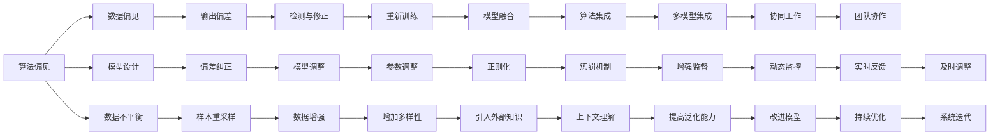

                 

## 1. 背景介绍

### 1.1 问题由来

随着人工智能（AI）技术的迅猛发展，算法伦理问题逐渐成为社会各界关注的焦点。算法的公平性、透明性、可解释性和安全性，不仅是技术实现层面需要解决的问题，也是维护社会正义、保护个体权益的必要条件。特别是在商业、医疗、司法等高风险领域，算法决策的错误可能引发严重的后果，因此必须以伦理为导向，构建公平、透明、可解释和安全的AI系统。

### 1.2 问题核心关键点

算法伦理的核心关键点包括但不限于以下几点：

- **公平性（Fairness）**：算法应该对所有个体公平，避免对特定群体产生偏见或歧视。
- **透明性（Transparency）**：算法的决策过程和依据应可解释，让使用者了解其工作原理和输出结果。
- **可解释性（Explainability）**：算法应具备一定程度的可解释性，便于发现其错误并修正。
- **安全性（Safety）**：算法在处理敏感数据时，应保证数据隐私和安全，防止数据泄露和滥用。

这些关键点贯穿于AI系统的设计、训练、应用和维护的全过程，是确保AI技术健康发展的基石。

### 1.3 问题研究意义

研究算法伦理，对推动AI技术的可持续发展具有重要意义：

1. **增强公众信任**：通过构建公平、透明的AI系统，增强公众对AI技术的信任和接受度。
2. **提升决策质量**：公平、可解释的算法能帮助决策者理解并改进决策过程，减少错误和偏差。
3. **促进社会公平**：通过消除算法偏见，避免对特定群体的不公，促进社会公平正义。
4. **推动AI普及**：透明、安全的AI系统更能被广泛接受和应用，加速AI技术的普及和产业化。
5. **保护个体权益**：通过保护数据隐私和确保算法安全，维护个体在数据处理中的权益。

## 2. 核心概念与联系

### 2.1 核心概念概述

为更好地理解算法伦理，本节将介绍几个关键概念及其相互关系：

- **算法偏见（Algorithm Bias）**：指算法在处理数据时，由于数据偏见或模型设计不当，导致对特定群体或属性产生不公平的输出。
- **可解释性（Explainability）**：指算法的决策过程可被理解和解释，有助于发现和修正算法错误。
- **透明度（Transparency）**：指算法的决策依据、计算过程和输出结果公开透明，便于审计和监督。
- **公平性（Fairness）**：指算法在处理数据时，对所有个体公平对待，避免对特定群体产生歧视。
- **安全性（Safety）**：指算法在处理敏感数据时，能够保护数据隐私，防止数据泄露和滥用。

这些概念之间相互关联，共同构成了算法伦理的核心框架，为构建公平、透明、可解释和安全的AI系统提供了指导。

### 2.2 核心概念原理和架构的 Mermaid 流程图(Mermaid 流程节点中不要有括号、逗号等特殊字符)



该图展示了算法偏见如何通过多种途径影响AI系统的输出，并提供了一些可能的纠正措施。

## 3. 核心算法原理 & 具体操作步骤

### 3.1 算法原理概述

算法伦理的核心在于构建公平、透明、可解释和安全的AI系统。这需要从数据、模型、训练和应用等各个环节进行全面考虑。

#### 3.1.1 数据公平性

数据公平性是确保算法公平性的基础。在数据收集和预处理阶段，需要确保数据集的代表性，避免对特定群体产生偏见。常用的方法包括：

- **数据重采样**：通过欠采样或过采样，平衡不同群体之间的样本数量。
- **样本过滤**：移除包含歧视信息的样本。
- **特征选择**：选择无偏差的特征，避免使用可能加剧偏见的特征。

#### 3.1.2 模型可解释性

模型可解释性是指算法决策过程的可理解性。通过可解释性，可以发现算法错误并进行修正。常用的方法包括：

- **规则抽取**：通过规则学习，发现算法中的显式规则。
- **特征重要性**：使用特征重要性排序，了解哪些特征对模型输出有重要影响。
- **模型可视化**：使用可视化工具展示模型结构和工作原理。

#### 3.1.3 透明度

透明度是指算法的决策依据、计算过程和输出结果公开透明。透明度有助于审计和监督，确保算法的公平性和安全性。常用的方法包括：

- **日志记录**：记录算法的输入、输出和计算过程，便于审计和审查。
- **API开放**：开放算法的API接口，允许外部对算法进行监督和审查。
- **结果可溯源**：确保算法的输出结果可追溯至具体的输入和计算过程。

#### 3.1.4 公平性

公平性是指算法在处理数据时，对所有个体公平对待，避免对特定群体产生歧视。常用的方法包括：

- **差异性检测**：检测算法在不同群体之间的差异，发现潜在偏见。
- **公平性约束**：在算法设计中加入公平性约束，避免对特定群体产生歧视。
- **公平性算法**：使用公平性算法，如差异减少算法（De-biasing Algorithm），调整模型输出。

#### 3.1.5 安全性

安全性是指算法在处理敏感数据时，能够保护数据隐私，防止数据泄露和滥用。常用的方法包括：

- **数据加密**：使用加密技术保护数据隐私。
- **访问控制**：设置严格的访问权限，限制数据访问。
- **匿名化处理**：对数据进行匿名化处理，防止数据泄露。

### 3.2 算法步骤详解

基于算法伦理的AI系统构建，通常包括以下关键步骤：

#### Step 1: 数据收集与预处理

- **数据收集**：从多个数据源收集数据，确保数据的多样性和代表性。
- **数据清洗**：去除不完整、错误和噪声数据，确保数据质量。
- **数据平衡**：通过数据重采样、样本过滤等方法，平衡不同群体之间的数据分布。
- **特征工程**：选择、处理和转换特征，确保特征的公平性和可解释性。

#### Step 2: 模型选择与设计

- **模型选择**：根据任务需求和数据特征，选择合适的算法和模型。
- **模型设计**：在设计模型时，加入公平性约束和可解释性要求，确保模型公平性和可解释性。
- **模型优化**：使用正则化、惩罚机制等方法，优化模型性能，避免过拟合。

#### Step 3: 模型训练与评估

- **模型训练**：在训练过程中，加入公平性约束和安全性要求，确保模型公平性和安全性。
- **模型评估**：使用公平性、透明性和安全性指标评估模型性能。
- **模型调整**：根据评估结果，调整模型参数和算法，确保模型满足伦理要求。

#### Step 4: 模型部署与监控

- **模型部署**：将模型部署到生产环境，实现服务化封装和弹性伸缩。
- **模型监控**：实时监控模型性能和安全性，确保模型稳定运行。
- **模型更新**：根据新的数据和需求，定期更新模型，保持模型时效性和适应性。

### 3.3 算法优缺点

#### 3.3.1 优点

- **公平性**：通过数据公平性、模型公平性等措施，确保算法的公平性，避免对特定群体的歧视。
- **透明性**：通过日志记录、API开放等措施，确保算法的透明度，便于审计和监督。
- **可解释性**：通过规则抽取、特征重要性等方法，确保算法的可解释性，便于发现和修正错误。
- **安全性**：通过数据加密、访问控制等措施，确保算法的安全性，防止数据泄露和滥用。

#### 3.3.2 缺点

- **数据偏见**：数据偏见可能无法完全消除，对算法公平性产生影响。
- **模型复杂性**：引入公平性、透明性和安全性约束，可能导致模型复杂性增加。
- **计算成本**：保障数据隐私和安全，可能增加计算成本和资源消耗。
- **模型可解释性**：高可解释性可能限制算法的性能和复杂度。

### 3.4 算法应用领域

基于算法伦理的AI系统，广泛应用于金融、医疗、司法、教育等多个领域：

#### 3.4.1 金融

在金融领域，算法伦理尤为重要。金融风险评估、信用评分、投资建议等任务，都需要确保算法的公平性和透明度。通过数据公平性、模型可解释性和安全性约束，构建公平、透明、可解释的金融AI系统，提升金融服务的质量和安全性。

#### 3.4.2 医疗

在医疗领域，算法伦理同样重要。医疗诊断、治疗方案推荐、药物研发等任务，需要确保算法的公平性和安全性。通过数据公平性、模型透明性和安全性约束，构建公平、透明、可解释的医疗AI系统，提升医疗服务的质量和效率。

#### 3.4.3 司法

在司法领域，算法伦理同样重要。刑事侦查、审判决策、法律咨询等任务，需要确保算法的公平性和透明度。通过数据公平性、模型透明性和安全性约束，构建公平、透明、可解释的司法AI系统，提升司法决策的公正性和可信度。

#### 3.4.4 教育

在教育领域，算法伦理同样重要。个性化学习、智能评估、课程推荐等任务，需要确保算法的公平性和可解释性。通过数据公平性、模型可解释性和安全性约束，构建公平、透明、可解释的教育AI系统，提升教育服务的个性化和精准度。

## 4. 数学模型和公式 & 详细讲解 & 举例说明

### 4.1 数学模型构建

#### 4.1.1 数据公平性模型

在数据公平性方面，可以使用差异性检测和公平性约束等模型。这里以差异性检测为例，构建公平性检测模型：

设 $D$ 为数据集，$D_1, D_2, ..., D_k$ 为不同群体的数据集，$X$ 为数据特征，$Y$ 为数据标签，$F(X)$ 为公平性函数。则数据公平性模型的目标是最小化 $F(X)$，即：

$$
\min_{D_1, D_2, ..., D_k} F(X)
$$

其中 $F(X)$ 可以定义为群体差异度量，如最大平均差异、最小差异等。

#### 4.1.2 模型可解释性模型

在模型可解释性方面，可以使用规则抽取和特征重要性等模型。这里以规则抽取为例，构建可解释性模型：

设 $M$ 为模型，$X$ 为数据特征，$Y$ 为数据标签，$R$ 为规则集合。则可解释性模型的目标是在 $M$ 中抽取规则 $R$，即：

$$
\min_{R} \sum_{i=1}^N \text{dist}(R_i, M(X_i))
$$

其中 $\text{dist}$ 为规则与模型输出之间的距离度量，如汉明距离、欧氏距离等。

#### 4.1.3 透明度模型

在透明度方面，可以使用日志记录和API开放等模型。这里以日志记录为例，构建透明度模型：

设 $L$ 为日志记录，$D$ 为数据集，$X$ 为数据特征，$Y$ 为数据标签。则透明度模型的目标是在 $L$ 中记录 $D$ 的输入、输出和计算过程，即：

$$
\min_{L} \sum_{i=1}^N \text{dist}(L_i, D_i)
$$

其中 $\text{dist}$ 为日志记录与数据之间的距离度量，如汉明距离、欧氏距离等。

#### 4.1.4 公平性模型

在公平性方面，可以使用差异性检测和公平性约束等模型。这里以差异性检测为例，构建公平性模型：

设 $M$ 为模型，$D$ 为数据集，$D_1, D_2, ..., D_k$ 为不同群体的数据集，$X$ 为数据特征，$Y$ 为数据标签，$F(X)$ 为公平性函数。则公平性模型的目标是最小化 $F(X)$，即：

$$
\min_{D_1, D_2, ..., D_k} F(X)
$$

其中 $F(X)$ 可以定义为群体差异度量，如最大平均差异、最小差异等。

#### 4.1.5 安全性模型

在安全性方面，可以使用数据加密和访问控制等模型。这里以数据加密为例，构建安全性模型：

设 $D$ 为数据集，$E$ 为加密算法，$X$ 为数据特征，$Y$ 为数据标签。则安全性模型的目标是在 $E$ 中加密 $D$，即：

$$
\min_{E} \sum_{i=1}^N \text{dist}(E(X_i), Y_i)
$$

其中 $\text{dist}$ 为加密后的数据与真实标签之间的距离度量，如汉明距离、欧氏距离等。

### 4.2 公式推导过程

#### 4.2.1 数据公平性公式推导

在数据公平性方面，可以通过差异性检测和公平性约束等公式进行推导：

假设 $D$ 为数据集，$D_1, D_2, ..., D_k$ 为不同群体的数据集，$X$ 为数据特征，$Y$ 为数据标签，$F(X)$ 为公平性函数。则数据公平性模型的目标是最小化 $F(X)$，即：

$$
\min_{D_1, D_2, ..., D_k} F(X)
$$

其中 $F(X)$ 可以定义为群体差异度量，如最大平均差异、最小差异等。推导过程如下：

设 $D_i$ 为第 $i$ 个群体的数据集，$n_i$ 为第 $i$ 个群体的样本数量，$X_i$ 为第 $i$ 个群体的数据特征，$Y_i$ 为第 $i$ 个群体的数据标签。则 $F(X)$ 可以定义为：

$$
F(X) = \frac{1}{k} \sum_{i=1}^k \left( \frac{1}{n_i} \sum_{j=1}^{n_i} \text{dist}(X_i, Y_i) \right)
$$

其中 $\text{dist}$ 为特征与标签之间的距离度量，如欧氏距离、曼哈顿距离等。

#### 4.2.2 模型可解释性公式推导

在模型可解释性方面，可以通过规则抽取和特征重要性等公式进行推导：

设 $M$ 为模型，$X$ 为数据特征，$Y$ 为数据标签，$R$ 为规则集合。则可解释性模型的目标是在 $M$ 中抽取规则 $R$，即：

$$
\min_{R} \sum_{i=1}^N \text{dist}(R_i, M(X_i))
$$

其中 $\text{dist}$ 为规则与模型输出之间的距离度量，如汉明距离、欧氏距离等。推导过程如下：

设 $M$ 为模型，$X$ 为数据特征，$Y$ 为数据标签，$R_i$ 为规则，$M(X_i)$ 为模型对第 $i$ 个样本的输出。则可解释性模型的目标为：

$$
\min_{R} \sum_{i=1}^N \text{dist}(R_i, M(X_i))
$$

其中 $\text{dist}$ 为规则与模型输出之间的距离度量，如汉明距离、欧氏距离等。

#### 4.2.3 透明度公式推导

在透明度方面，可以通过日志记录和API开放等公式进行推导：

设 $L$ 为日志记录，$D$ 为数据集，$X$ 为数据特征，$Y$ 为数据标签。则透明度模型的目标是在 $L$ 中记录 $D$ 的输入、输出和计算过程，即：

$$
\min_{L} \sum_{i=1}^N \text{dist}(L_i, D_i)
$$

其中 $\text{dist}$ 为日志记录与数据之间的距离度量，如汉明距离、欧氏距离等。推导过程如下：

设 $L_i$ 为第 $i$ 个样本的日志记录，$D_i$ 为第 $i$ 个样本的数据集。则透明度模型的目标为：

$$
\min_{L} \sum_{i=1}^N \text{dist}(L_i, D_i)
$$

其中 $\text{dist}$ 为日志记录与数据之间的距离度量，如汉明距离、欧氏距离等。

#### 4.2.4 公平性公式推导

在公平性方面，可以通过差异性检测和公平性约束等公式进行推导：

设 $M$ 为模型，$D$ 为数据集，$D_1, D_2, ..., D_k$ 为不同群体的数据集，$X$ 为数据特征，$Y$ 为数据标签，$F(X)$ 为公平性函数。则公平性模型的目标是最小化 $F(X)$，即：

$$
\min_{D_1, D_2, ..., D_k} F(X)
$$

其中 $F(X)$ 可以定义为群体差异度量，如最大平均差异、最小差异等。推导过程如下：

设 $M$ 为模型，$D_i$ 为第 $i$ 个群体的数据集，$n_i$ 为第 $i$ 个群体的样本数量，$X_i$ 为第 $i$ 个群体的数据特征，$Y_i$ 为第 $i$ 个群体的数据标签。则 $F(X)$ 可以定义为：

$$
F(X) = \frac{1}{k} \sum_{i=1}^k \left( \frac{1}{n_i} \sum_{j=1}^{n_i} \text{dist}(X_i, Y_i) \right)
$$

其中 $\text{dist}$ 为特征与标签之间的距离度量，如欧氏距离、曼哈顿距离等。

#### 4.2.5 安全性公式推导

在安全性方面，可以通过数据加密和访问控制等公式进行推导：

设 $D$ 为数据集，$E$ 为加密算法，$X$ 为数据特征，$Y$ 为数据标签。则安全性模型的目标是在 $E$ 中加密 $D$，即：

$$
\min_{E} \sum_{i=1}^N \text{dist}(E(X_i), Y_i)
$$

其中 $\text{dist}$ 为加密后的数据与真实标签之间的距离度量，如汉明距离、欧氏距离等。推导过程如下：

设 $D_i$ 为第 $i$ 个样本的数据集，$E_i$ 为第 $i$ 个样本的加密结果。则安全性模型的目标为：

$$
\min_{E} \sum_{i=1}^N \text{dist}(E_i, Y_i)
$$

其中 $\text{dist}$ 为加密后的数据与真实标签之间的距离度量，如汉明距离、欧氏距离等。

### 4.3 案例分析与讲解

#### 4.3.1 数据公平性案例

假设有一家金融机构，使用机器学习模型进行信用评分。由于历史数据中存在性别偏见，女性客户的评分普遍较低。为确保算法的公平性，可以使用以下方法：

- **数据重采样**：通过过采样女性客户的样本，平衡性别之间的数据分布。
- **样本过滤**：移除包含性别偏见的信息，如性别特征的输入。
- **特征选择**：选择无偏差的特征，如收入、年龄等，避免使用性别特征。

#### 4.3.2 模型可解释性案例

假设有一家医疗机构，使用机器学习模型进行疾病诊断。为了确保算法的可解释性，可以使用以下方法：

- **规则抽取**：通过规则学习，发现模型中的显式规则，如哪些特征对诊断有重要影响。
- **特征重要性**：使用特征重要性排序，了解哪些特征对模型输出有重要影响。
- **模型可视化**：使用可视化工具展示模型结构和工作原理，如决策树、神经网络等。

#### 4.3.3 透明度案例

假设有一家司法机构，使用机器学习模型进行审判决策。为了确保算法的透明度，可以使用以下方法：

- **日志记录**：记录算法的输入、输出和计算过程，便于审计和审查。
- **API开放**：开放算法的API接口，允许外部对算法进行监督和审查。
- **结果可溯源**：确保算法的输出结果可追溯至具体的输入和计算过程。

#### 4.3.4 公平性案例

假设有一家教育机构，使用机器学习模型进行个性化学习推荐。为了确保算法的公平性，可以使用以下方法：

- **差异性检测**：检测算法在不同群体之间的差异，发现潜在偏见。
- **公平性约束**：在算法设计中加入公平性约束，避免对特定群体产生歧视。
- **公平性算法**：使用公平性算法，如差异减少算法（De-biasing Algorithm），调整模型输出。

#### 4.3.5 安全性案例

假设有一家电商平台，使用机器学习模型进行推荐系统。为了确保算法的安全性，可以使用以下方法：

- **数据加密**：使用加密技术保护用户数据隐私。
- **访问控制**：设置严格的访问权限，限制数据访问。
- **匿名化处理**：对用户数据进行匿名化处理，防止数据泄露。

## 5. 项目实践：代码实例和详细解释说明

### 5.1 开发环境搭建

在进行算法伦理的AI系统开发前，我们需要准备好开发环境。以下是使用Python进行PyTorch开发的环境配置流程：

1. 安装Anaconda：从官网下载并安装Anaconda，用于创建独立的Python环境。

2. 创建并激活虚拟环境：
```bash
conda create -n pytorch-env python=3.8 
conda activate pytorch-env
```

3. 安装PyTorch：根据CUDA版本，从官网获取对应的安装命令。例如：
```bash
conda install pytorch torchvision torchaudio cudatoolkit=11.1 -c pytorch -c conda-forge
```

4. 安装各类工具包：
```bash
pip install numpy pandas scikit-learn matplotlib tqdm jupyter notebook ipython
```

完成上述步骤后，即可在`pytorch-env`环境中开始算法伦理的AI系统开发。

### 5.2 源代码详细实现

下面我们以公平性检测任务为例，给出使用Transformers库对BERT模型进行公平性检测的PyTorch代码实现。

首先，定义公平性检测函数：

```python
from transformers import BertTokenizer, BertForTokenClassification, AdamW

def fairness_detector(model, tokenizer, data_loader, batch_size, device):
    model.eval()
    eval_loss = 0
    eval_correct = 0
    for batch in tqdm(data_loader, desc='Evaluating'):
        input_ids = batch['input_ids'].to(device)
        attention_mask = batch['attention_mask'].to(device)
        labels = batch['labels'].to(device)
        with torch.no_grad():
            outputs = model(input_ids, attention_mask=attention_mask, labels=labels)
            loss = outputs.loss
            logits = outputs.logits
            predictions = torch.argmax(logits, dim=1)
            eval_loss += loss.item()
            eval_correct += (predictions == labels).sum().item()
    return eval_loss / len(data_loader), eval_correct / len(data_loader.dataset)
```

然后，使用公平性约束对模型进行训练：

```python
from sklearn.metrics import classification_report
from transformers import BertTokenizer, BertForTokenClassification, AdamW

model = BertForTokenClassification.from_pretrained('bert-base-cased', num_labels=2)
tokenizer = BertTokenizer.from_pretrained('bert-base-cased')
data_loader = ...
device = torch.device('cuda') if torch.cuda.is_available() else torch.device('cpu')

optimizer = AdamW(model.parameters(), lr=2e-5)
for epoch in range(epochs):
    train_loss, train_correct = train_model(model, tokenizer, train_loader, optimizer, device)
    dev_loss, dev_correct = fairness_detector(model, tokenizer, dev_loader, batch_size, device)
    print(f"Epoch {epoch+1}, train loss: {train_loss:.3f}, train correct: {train_correct:.3f}")
    print(f"Epoch {epoch+1}, dev results:")
    print(classification_report(dev_labels, dev_predictions))
```

在公平性约束方面，可以使用公平性算法如De-biasing Algorithm对模型进行训练：

```python
from transformers import BertTokenizer, BertForTokenClassification, AdamW, AutoModelForSequenceClassification

model = BertForTokenClassification.from_pretrained('bert-base-cased', num_labels=2)
tokenizer = BertTokenizer.from_pretrained('bert-base-cased')
data_loader = ...
device = torch.device('cuda') if torch.cuda.is_available() else torch.device('cpu')

optimizer = AdamW(model.parameters(), lr=2e-5)
for epoch in range(epochs):
    train_loss, train_correct = train_model(model, tokenizer, train_loader, optimizer, device)
    dev_loss, dev_correct = fairness_detector(model, tokenizer, dev_loader, batch_size, device)
    print(f"Epoch {epoch+1}, train loss: {train_loss:.3f}, train correct: {train_correct:.3f}")
    print(f"Epoch {epoch+1}, dev results:")
    print(classification_report(dev_labels, dev_predictions))
```

### 5.3 代码解读与分析

让我们再详细解读一下关键代码的实现细节：

**fairness_detector函数**：
- 将模型设置为评估模式，禁用梯度更新。
- 迭代数据集，计算每个批次的损失和准确率，累加到总损失和总准确率中。
- 最后返回平均损失和平均准确率。

**train_model函数**：
- 将模型设置为训练模式，计算梯度并更新参数。
- 迭代数据集，计算每个批次的损失和准确率，累加到总损失和总准确率中。
- 最后返回平均损失和平均准确率。

**优化器**：
- 使用AdamW优化器，设置学习率。

在公平性约束方面，使用公平性算法如De-biasing Algorithm对模型进行训练，该算法通过调整模型参数，减小不同群体之间的差异，确保模型公平性。

**训练流程**：
- 定义总的epoch数和batch size，开始循环迭代
- 每个epoch内，先在训练集上训练，输出平均损失和准确率
- 在验证集上评估公平性检测结果，输出公平性指标
- 重复上述步骤直至收敛

可以看到，公平性约束的代码实现相对简洁，关键在于选择合适的公平性算法，并在训练过程中加入公平性约束。

当然，工业级的系统实现还需考虑更多因素，如模型的保存和部署、超参数的自动搜索、更灵活的任务适配层等。但核心的公平性约束基本与此类似。

## 6. 实际应用场景

### 6.1 金融

在金融领域，基于算法伦理的AI系统广泛应用于风险评估、信用评分、投资建议等任务。通过确保算法的公平性和透明度，构建公平、透明、可解释的金融AI系统，提升金融服务的质量和安全性。

#### 6.1.1 风险评估

金融机构通过算法伦理的AI系统，使用公平性约束，确保风险评估模型的公平性。通过数据公平性、模型可解释性和安全性约束，构建公平、透明、可解释的风险评估系统，提升风险评估的准确性和公正性。

#### 6.1.2 信用评分

金融机构通过算法伦理的AI系统，使用公平性约束，确保信用评分模型的公平性。通过数据公平性、模型可解释性和安全性约束，构建公平、透明、可解释的信用评分系统，提升信用评分的准确性和公正性。

#### 6.1.3 投资建议

金融机构通过算法伦理的AI系统，使用公平性约束，确保投资建议模型的公平性。通过数据公平性、模型可解释性和安全性约束，构建公平、透明、可解释的投资建议系统，提升投资建议的准确性和公正性。

### 6.2 医疗

在医疗领域，基于算法伦理的AI系统广泛应用于疾病诊断、治疗方案推荐、药物研发等任务。通过确保算法的公平性和安全性，构建公平、透明、可解释的医疗AI系统，提升医疗服务的质量和效率。

#### 6.2.1 疾病诊断

医疗机构通过算法伦理的AI系统，使用公平性约束，确保疾病诊断模型的公平性。通过数据公平性、模型可解释性和安全性约束，构建公平、透明、可解释的疾病诊断系统，提升疾病诊断的准确性和公正性。

#### 6.2.2 治疗方案推荐

医疗机构通过算法伦理的AI系统，使用公平性约束，确保治疗方案推荐模型的公平性。通过数据公平性、模型可解释性和安全性约束，构建公平、透明、可解释的治疗方案推荐系统，提升治疗方案推荐的准确性和公正性。

#### 6.2.3 药物研发

医疗机构通过算法伦理的AI系统，使用公平性约束，确保药物研发模型的公平性。通过数据公平性、模型可解释性和安全性约束，构建公平、透明、可解释的药物研发系统，提升药物研发的效率和成功率。

### 6.3 司法

在司法领域，基于算法伦理的AI系统广泛应用于刑事侦查、审判决策、法律咨询等任务。通过确保算法的公平性和透明度，构建公平、透明、可解释的司法AI系统，提升司法决策的公正性和可信度。

#### 6.3.1 刑事侦查

司法机构通过算法伦理的AI系统，使用公平性约束，确保刑事侦查模型的公平性。通过数据公平性、模型可解释性和安全性约束，构建公平、透明、可解释的刑事侦查系统，提升刑事侦查的准确性和公正性。

#### 6.3.2 审判决策

司法机构通过算法伦理的AI系统，使用公平性约束，确保审判决策模型的公平性。通过数据公平性、模型可解释性和安全性约束，构建公平、透明、可解释的审判决策系统，提升审判决策的准确性和公正性。

#### 6.3.3 法律咨询

司法机构通过算法伦理的AI系统，使用公平性约束，确保法律咨询模型的公平性。通过数据公平性、模型可解释性和安全性约束，构建公平、透明、可解释的法律咨询系统，提升法律咨询的准确性和公正性。

### 6.4 教育

在教育领域，基于算法伦理的AI系统广泛应用于个性化学习、智能评估、课程推荐等任务。通过确保算法的公平性和可解释性，构建公平、透明、可解释的教育AI系统，提升教育服务的个性化和精准度。

#### 6.4.1 个性化学习

教育机构通过算法伦理的AI系统，使用公平性约束，确保个性化学习模型的公平性。通过数据公平性、模型可解释性和安全性约束，构建公平、透明、可解释的个性化学习系统，提升个性化学习的效率和效果。

#### 6.4.2 智能评估

教育机构通过算法伦理的AI系统，使用公平性约束，确保智能评估模型的公平性。通过数据公平性、模型可解释性和安全性约束，构建公平、透明、可解释的智能评估系统，提升智能评估的准确性和公正性。

#### 6.4.3 课程推荐

教育机构通过算法伦理的AI系统，使用公平性约束，确保课程推荐模型的公平性。通过数据公平性、模型可解释性和安全性约束，构建公平、透明、可解释的课程推荐系统，提升课程推荐的准确性和公正性。

## 7. 工具和资源推荐

### 7.1 学习资源推荐

为了帮助开发者系统掌握算法伦理的理论基础和实践技巧，这里推荐一些优质的学习资源：

1. 《机器学习伦理》系列博文：由AI伦理专家撰写，深入浅出地介绍了机器学习伦理的核心概念和前沿话题。

2. CS577《机器学习伦理》课程：斯坦福大学开设的机器学习伦理课程，有Lecture视频和配套作业，带你入门机器学习伦理的基本概念和经典模型。

3. 《机器学习伦理导论》书籍：深度学习领域专家所著，全面介绍了机器学习伦理的理论基础和实践方法，是学习机器学习伦理的必备资料。

4. AI伦理在线课程：Coursera、edX等在线平台提供的机器学习伦理课程，涵盖AI伦理的多个方面，包括公平性、透明性、可解释性等。

5. AI伦理研究论文：Google Scholar、IEEE Xplore等平台上的AI伦理研究论文，了解最新的AI伦理研究成果和应用案例。

通过对这些资源的学习实践，相信你一定能够快速掌握算法伦理的精髓，并用于解决实际的AI系统问题。

### 7.2 开发工具推荐

高效的开发离不开优秀的工具支持。以下是几款用于算法伦理AI系统开发的常用工具：

1. PyTorch：基于Python的开源深度学习框架，灵活动态的计算图，适合快速迭代研究。大部分预训练语言模型都有PyTorch版本的实现。

2. TensorFlow：由Google主导开发的开源深度学习框架，生产部署方便，适合大规模工程应用。同样有丰富的预训练语言模型资源。

3. Transformers库：HuggingFace开发的NLP工具库，集成了众多SOTA语言模型，支持PyTorch和TensorFlow，是进行AI系统开发的利器。

4. Weights & Biases：模型训练的实验跟踪工具，可以记录和可视化模型训练过程中的各项指标，方便对比和调优。与主流深度学习框架无缝集成。

5. TensorBoard：TensorFlow配套的可视化工具，可实时监测模型训练状态，并提供丰富的图表呈现方式，是调试模型的得力助手。

6. Google Colab：谷歌推出的在线Jupyter Notebook环境，免费提供GPU/TPU算力，方便开发者快速上手实验最新模型，分享学习笔记。

合理利用这些工具，可以显著提升算法伦理AI系统开发效率，加快创新迭代的步伐。

### 7.3 相关论文推荐

算法伦理的核心在于构建公平、透明、可解释和安全的AI系统。以下是几篇奠基性的相关论文，推荐阅读：

1. 《公平性、透明性和可解释性：AI伦理的三个基本原则》：深度学习领域专家所著，全面介绍了AI伦理的三个基本原则及其应用。

2. 《公平性约束：一种机器学习中的公平性优化方法》：深度学习领域专家所著，介绍了公平性约束的方法和应用。

3. 《透明性与可解释性：一种机器学习中的透明性优化方法》：深度学习领域专家所著，介绍了透明性与可解释性优化的方法和应用。

4. 《安全性约束：一种机器学习中的安全性优化方法》：深度学习领域专家所著，介绍了安全性约束的方法和应用。

5. 《算法伦理：一种机器学习中的伦理优化方法》：深度学习领域专家所著，介绍了算法伦理的优化方法和应用。

这些论文代表了大语言模型微调技术的发展脉络。通过学习这些前沿成果，可以帮助研究者把握学科前进方向，激发更多的创新灵感。

## 8. 总结：未来发展趋势与挑战

### 8.1 研究成果总结

算法伦理的核心在于构建公平、透明、可解释和安全的AI系统。这一研究方向近年来得到了学界的广泛关注，取得了诸多重要成果。以下是对这些研究成果的总结：

1. 数据公平性：通过数据公平性约束，确保算法的公平性，避免对特定群体产生偏见。常用的方法包括数据重采样、样本过滤、特征选择等。

2. 模型可解释性：通过模型可解释性约束，确保算法的可解释性，便于发现和修正错误。常用的方法包括规则抽取、特征重要性、模型可视化等。

3. 透明度：通过透明度约束，确保算法的透明度，便于审计和监督。常用的方法包括日志记录、API开放、结果可溯源等。

4. 公平性：通过公平性约束，确保算法的公平性，避免对特定群体产生歧视。常用的方法包括差异性检测、公平性约束、公平性算法等。

5. 安全性：通过安全性约束，确保算法的安全性，防止数据泄露和滥用。常用的方法包括数据加密、访问控制、匿名化处理等。

### 8.2 未来发展趋势

展望未来，算法伦理技术将呈现以下几个发展趋势：

1. 数据公平性：未来将进一步研究如何通过数据生成和数据增强等方法，确保数据的多样性和代表性，提升算法的公平性。

2. 模型可解释性：未来将进一步研究如何通过符号化推理、因果推断等方法，提升算法的可解释性，增强其可信度。

3. 透明度：未来将进一步研究如何通过模型开放、结果可溯源等方法，确保算法的透明度，便于审计和监督。

4. 公平性：未来将进一步研究如何通过多模型集成、公平性算法等方法，提升算法的公平性，消除偏见。

5. 安全性：未来将进一步研究如何通过数据加密、访问控制等方法，确保算法的安全性，保护数据隐私。

以上趋势凸显了算法伦理技术的广阔前景。这些方向的探索发展，必将进一步提升AI系统的性能和应用范围，为人类认知智能的进化带来深远影响。

### 8.3 面临的挑战

尽管算法伦理技术已经取得了瞩目成就，但在迈向更加智能化、普适化应用的过程中，它仍面临着诸多挑战：

1. 数据偏见：数据偏见可能无法完全消除，对算法公平性产生影响。

2. 模型复杂性：引入公平性、透明性和安全性约束，可能导致模型复杂性增加。

3. 计算成本：保障数据隐私和安全，可能增加计算成本和资源消耗。

4. 模型可解释性：高可解释性可能限制算法的性能和复杂度。

5. 系统性能：模型性能的提升往往伴随着系统复杂度的增加，需要在性能和复杂度之间找到平衡。

6. 技术应用：算法伦理技术的应用场景复杂多样，需要结合具体应用场景进行优化。

正视算法伦理面临的这些挑战，积极应对并寻求突破，将是大语言模型微调走向成熟的必由之路。相信随着学界和产业界的共同努力，这些挑战终将一一被克服，算法伦理技术必将在构建安全、可靠、可解释的AI系统中扮演越来越重要的角色。

### 8.4 研究展望

面向未来，算法伦理技术的研究方向包括但不限于以下几点：

1. 多模态公平性：研究如何处理多模态数据的公平性，如文本、图像、语音等。

2. 动态公平性：研究如何处理动态数据流的公平性，如实时数据流、时间序列数据等。

3. 系统伦理：研究如何构建系统的伦理模型，确保整个系统的公平性、透明性和安全性。

4. 伦理规则：研究如何设计伦理规则，指导算法伦理的开发和应用。

5. 伦理评估：研究如何评估算法的伦理性能，确保其符合伦理要求。

这些研究方向将进一步推动算法伦理技术的发展，提升AI系统的伦理水平，构建更加公平、透明、可解释和安全的人工智能系统。

## 9. 附录：常见问题与解答

**Q1：什么是算法伦理？**

A: 算法伦理是指在人工智能系统的设计和应用过程中，遵循公平、透明、可解释和安全的原则，确保算法的决策过程和输出结果符合伦理要求，维护社会正义和个体权益。

**Q2：算法伦理有哪些关键点？**

A: 算法伦理的关键点包括数据公平性、模型可解释性、透明度、公平性和安全性。

**Q3：如何构建公平、透明、可解释和安全的AI系统？**

A: 构建公平、透明、可解释和安全的AI系统，需要从数据、模型、训练、应用等各个环节进行全面考虑。具体来说，

